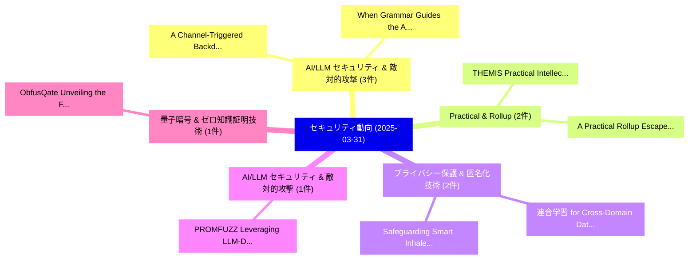

# 📅 02_daily: 日次エグゼクティブサマリー報告書 (2025-03-31)

**集計日時**: 2026-10-02 23:05:21 UTC  
**対象日付**: 2025-03-31  
**本日収集論文数**: 14 件  

---

## 💡 主要セキュリティ動向・脅威インサイト (Executive Insights)

本日の収集論文（計 14 件）において、以下の重点セキュリティ領域で活発な研究動向が確認されました：
- **AI/LLM セキュリティ & 敵対的攻撃** (3 件): 注目論文として 「A Channel-Triggered Backdoor A...」、「When Grammar Guides the Attack...」 等が発表され、実務防御および攻撃検証の進展が見られます。
- **Practical & Rollup** (2 件): 注目論文として 「THEMIS: Practical Intellectual...」、「A Practical Rollup Escape Hatc...」 等が発表され、実務防御および攻撃検証の進展が見られます。
- **プライバシー保護 & 匿名化技術** (2 件): 注目論文として 「連合学習 for Cross-Domain Data Pri...」、「Safeguarding Smart Inhaler Dev...」 等が発表され、実務防御および攻撃検証の進展が見られます。
- **AI/LLM セキュリティ & 敵対的攻撃** (1 件): 注目論文として 「PROMFUZZ: Leveraging LLM-Drive...」 等が発表され、実務防御および攻撃検証の進展が見られます。
- **量子暗号 & ゼロ知識証明技術** (1 件): 注目論文として 「ObfusQate: Unveiling the First...」 等が発表され、実務防御および攻撃検証の進展が見られます。

### 🗺️ 技術・脅威トピックマインドマップ

---

## 📌 日次セキュリティ論文一覧 (日本語表形式)

| No | arXiv ID | 論文タイトル (日本語訳) | 重要キーワード | 構造化エグゼクティブ要約 (背景・提案・影響) | 脅威分類 | 詳細リンク |
|---|---|---|---|---|---|---|
| 1 | `2503.23718v2` | [PROMFUZZ: Leveraging LLM-Driven and Bug-Oriented Composite Analysis for Detecting Functional Bugs in Smart Contracts（セキュリティ分析論文）](../../okf/papers/2025-03-31/2503.23718.md) | `Detecting Functional Bugs`, `Smart Contracts`, `Bug-Oriented Composite` | 【提案】概要 (Overview & Key Finding) 本論文「PROMFUZZ: Leveraging LLM-Driven and Bug-Oriented Compos...。実証評価により経営層・セキュリティ管理者向け推奨アクション (E... | `cs.CR` | [arXiv](https://arxiv.org/abs/2503.23718v2) &#124; [OKF](../../okf/papers/2025-03-31/2503.23718.md) |
| 2 | `2503.23748v1` | [THEMIS: Practical Intellectual Property Protection for Post-Deployment On-Device Deep Learning Modelsに向けて](../../okf/papers/2025-03-31/2503.23748.md) | `Practical Intellectual Property Protection`, `Towards Practical Intellectual Property Protection`, `Device Deep Learning Models` | 【提案】概要 (Overview & Key Finding) 本論文「THEMIS: Practical Intellectual Property Protection for ...。実証評価により経営層・セキュリティ管理者向け推奨アクション (E... | `cs.CR` | [arXiv](https://arxiv.org/abs/2503.23748v1) &#124; [OKF](../../okf/papers/2025-03-31/2503.23748.md) |
| 3 | `2503.23785v2` | [ObfusQate: Unveiling the First Quantum Program Obfuscation Framework（セキュリティ分析論文）](../../okf/papers/2025-03-31/2503.23785.md) | `See Toh Zi Jie`, `Carmen Wong Jiawen`, `Nikhil Bartake` | 【提案】概要 (Overview & Key Finding) 本論文「ObfusQate: Unveiling the First 量子 Program Obfuscation F...。実証評価により経営層・セキュリティ管理者向け推奨アクション (E... | `cs.CR` | [arXiv](https://arxiv.org/abs/2503.23785v2) &#124; [OKF](../../okf/papers/2025-03-31/2503.23785.md) |
| 4 | `2503.23804v3` | [DrunkAgent: Stealthy Memory Corruption in LLM-Powered Recommender Agents（セキュリティ分析論文）](../../okf/papers/2025-03-31/2503.23804.md) | `Stealthy Memory Corruption`, `Powered Recommender Agents`, `LLM-Powered Recommender` | 【提案】概要 (Overview & Key Finding) 本論文「DrunkAgent: Stealthy Memory Corruption in LLM-Powered R...。実証評価により経営層・セキュリティ管理者向け推奨アクション (E... | `cs.CR` | [arXiv](https://arxiv.org/abs/2503.23804v3) &#124; [OKF](../../okf/papers/2025-03-31/2503.23804.md) |
| 5 | `2503.23866v3` | [A Channel-Triggered Backdoor Attack on Wireless Semantic Image Reconstruction（セキュリティ分析論文）](../../okf/papers/2025-03-31/2503.23866.md) | `Wireless Semantic Image Reconstruction`, `Triggered Backdoor Attack`, `Channel-Triggered Backdoor` | 【提案】概要 (Overview & Key Finding) 本論文「A Channel-Triggered Backdoor Attack on Wireless Semanti...。実証評価により経営層・セキュリティ管理者向け推奨アクション (E... | `cs.CR` | [arXiv](https://arxiv.org/abs/2503.23866v3) &#124; [OKF](../../okf/papers/2025-03-31/2503.23866.md) |
| 6 | `2503.23949v1` | [AMB-FHE: Adaptive Multi-biometric Fusion with Fully Homomorphic Encryption（セキュリティ分析論文）](../../okf/papers/2025-03-31/2503.23949.md) | `Fully Homomorphic Encryption`, `Adaptive Multi`, `Multi-biometric Fusion` | 【提案】概要 (Overview & Key Finding) 本論文「AMB-FHE: Adaptive Multi-biometric Fusion with Fully 準同型...。実証評価により経営層・セキュリティ管理者向け推奨アクション (E... | `cs.CR` | [arXiv](https://arxiv.org/abs/2503.23949v1) &#124; [OKF](../../okf/papers/2025-03-31/2503.23949.md) |
| 7 | `2503.23986v1` | [A Practical Rollup Escape Hatch Design（セキュリティ分析論文）](../../okf/papers/2025-03-31/2503.23986.md) | `Practical Rollup Escape Hatch Design`, `Francisco Gomes Figueira`, `Ching Lun Chiu` | 【提案】概要 (Overview & Key Finding) 本論文「A Practical Rollup Escape Hatch Design（セキュリティ分析論文）」（原題:...。実証評価により経営層・セキュリティ管理者向け推奨アクション (E... | `cs.CR` | [arXiv](https://arxiv.org/abs/2503.23986v1) &#124; [OKF](../../okf/papers/2025-03-31/2503.23986.md) |
| 8 | `2503.24037v1` | [Digital Nudges Using Emotion Regulation to Reduce Online Disinformation Sharing（セキュリティ分析論文）](../../okf/papers/2025-03-31/2503.24037.md) | `Digital Nudges Using Emotion Regulation`, `Reduce Online Disinformation Sharing`, `Haruka Nakajima Suzuki` | 【提案】概要 (Overview & Key Finding) 本論文「Digital Nudges Using Emotion Regulation to Reduce Onlin...。実証評価により経営層・セキュリティ管理者向け推奨アクション (E... | `cs.CR` | [arXiv](https://arxiv.org/abs/2503.24037v1) &#124; [OKF](../../okf/papers/2025-03-31/2503.24037.md) |
| 9 | `2503.24191v4` | [When Grammar Guides the Attack: Uncovering Control-Plane Vulnerabilities in LLMs with Structured Output（セキュリティ分析論文）](../../okf/papers/2025-03-31/2503.24191.md) | `Uncovering Control`, `Plane Vulnerabilities`, `Structured Output` | 【提案】概要 (Overview & Key Finding) 本論文「When Grammar Guides the Attack: Uncovering Control-Plan...。実証評価により経営層・セキュリティ管理者向け推奨アクション (E... | `cs.CR` | [arXiv](https://arxiv.org/abs/2503.24191v4) &#124; [OKF](../../okf/papers/2025-03-31/2503.24191.md) |
| 10 | `2504.00147v1` | [Universal Zero-shot Embedding Inversion（セキュリティ分析論文）](../../okf/papers/2025-03-31/2504.00147.md) | `Universal Zero`, `Embedding Inversion`, `Zero-shot Embedding` | 【提案】概要 (Overview & Key Finding) 本論文「Universal Zero-shot Embedding Inversion（セキュリティ分析論文）」（原題...。実証評価によりMorris, Vitaly Shmatikov ... | `cs.CR` | [arXiv](https://arxiv.org/abs/2504.00147v1) &#124; [OKF](../../okf/papers/2025-03-31/2504.00147.md) |
| 11 | `2504.00170v1` | [Backdoor Detection through Replicated Execution of Outsourced Training（セキュリティ分析論文）](../../okf/papers/2025-03-31/2504.00170.md) | `Backdoor Detection`, `Replicated Execution`, `Outsourced Training` | 【提案】概要 (Overview & Key Finding) 本論文「Backdoor Detection through Replicated Execution of Outs...。実証評価により経営層・セキュリティ管理者向け推奨アクション (E... | `cs.CR` | [arXiv](https://arxiv.org/abs/2504.00170v1) &#124; [OKF](../../okf/papers/2025-03-31/2504.00170.md) |
| 12 | `2504.00282v1` | [連合学習 for Cross-Domain Data Privacy: A Distributed Approach to Secure Collaboration](../../okf/papers/2025-03-31/2504.00282.md) | `Domain Data Privacy`, `Cross-Domain Data`, `Secure Collaboration` | 【提案】概要 (Overview & Key Finding) 本論文「連合学習 for Cross-Domain Data Privacy: A Distributed Appro...。実証評価により経営層・セキュリティ管理者向け推奨アクション (E... | `cs.CR` | [arXiv](https://arxiv.org/abs/2504.00282v1) &#124; [OKF](../../okf/papers/2025-03-31/2504.00282.md) |
| 13 | `2504.03726v1` | [Detecting Malicious AI Agents Through Simulated Interactions（セキュリティ分析論文）](../../okf/papers/2025-03-31/2504.03726.md) | `Detecting Malicious`, `Yulu Pi`, `Ella Bettison` | 【提案】概要 (Overview & Key Finding) 本論文「Detecting Malicious AI Agents Through Simulated Interac...。実証評価により経営層・セキュリティ管理者向け推奨アクション (E... | `cs.CR` | [arXiv](https://arxiv.org/abs/2504.03726v1) &#124; [OKF](../../okf/papers/2025-03-31/2504.03726.md) |
| 14 | `2504.03730v1` | [Safeguarding Smart Inhaler Devices and Patient Privacy in Respiratory Health Monitoring（セキュリティ分析論文）](../../okf/papers/2025-03-31/2504.03730.md) | `Safeguarding Smart Inhaler Devices`, `Respiratory Health Monitoring`, `Patient Privacy` | 【提案】概要 (Overview & Key Finding) 本論文「Safeguarding Smart Inhaler Devices and Patient Privacy ...。実証評価により経営層・セキュリティ管理者向け推奨アクション (E... | `cs.CR` | [arXiv](https://arxiv.org/abs/2504.03730v1) &#124; [OKF](../../okf/papers/2025-03-31/2504.03730.md) |

