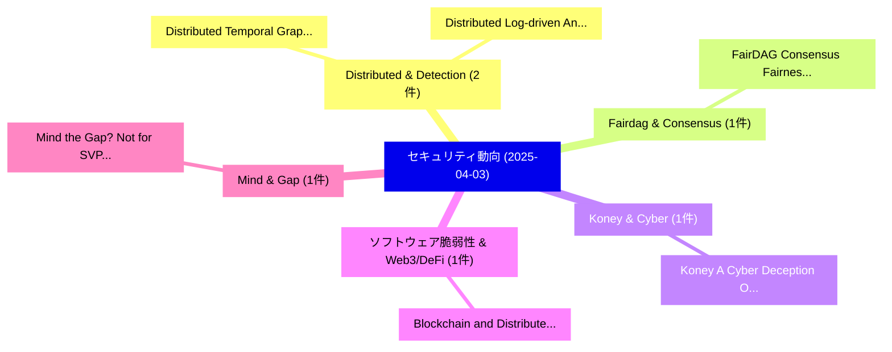

# 📅 02_daily: 日次エグゼクティブサマリー報告書 (2025-04-03)

**集計日時**: 2026-10-02 23:05:21 UTC  
**対象日付**: 2025-04-03  
**本日収集論文数**: 13 件  

---

## 💡 主要セキュリティ動向・脅威インサイト (Executive Insights)

本日の収集論文（計 13 件）において、以下の重点セキュリティ領域で活発な研究動向が確認されました：
- **Distributed & Detection** (2 件): 注目論文として 「Distributed Temporal Graph Lea...」、「Distributed Log-driven Anomaly...」 等が発表され、実務防御および攻撃検証の進展が見られます。
- **Fairdag & Consensus** (1 件): 注目論文として 「FairDAG: Consensus Fairness ov...」 等が発表され、実務防御および攻撃検証の進展が見られます。
- **Koney & Cyber** (1 件): 注目論文として 「Koney: A Cyber Deception Orche...」 等が発表され、実務防御および攻撃検証の進展が見られます。
- **ソフトウェア脆弱性 & Web3/DeFi** (1 件): 注目論文として 「Blockchain and Distributed Led...」 等が発表され、実務防御および攻撃検証の進展が見られます。
- **Mind & Gap** (1 件): 注目論文として 「Mind the Gap? Not for SVP Hard...」 等が発表され、実務防御および攻撃検証の進展が見られます。

### 🗺️ 技術・脅威トピックマインドマップ

---

## 📌 日次セキュリティ論文一覧 (日本語表形式)

| No | arXiv ID | 論文タイトル (日本語訳) | 重要キーワード | 構造化エグゼクティブ要約 (背景・提案・影響) | 脅威分類 | 詳細リンク |
|---|---|---|---|---|---|---|
| 1 | `2504.02194v3` | [FairDAG: Consensus Fairness over Multi-Proposer Causal Design（セキュリティ分析論文）](../../okf/papers/2025-04-03/2504.02194.md) | `Proposer Causal Design`, `Consensus Fairness`, `Multi-Proposer Causal` | 【提案】概要 (Overview & Key Finding) 本論文「FairDAG: Consensus Fairness over Multi-Proposer Causal ...。実証評価により経営層・セキュリティ管理者向け推奨アクション (E... | `cs.CR` | [arXiv](https://arxiv.org/abs/2504.02194v3) &#124; [OKF](../../okf/papers/2025-04-03/2504.02194.md) |
| 2 | `2504.02313v1` | [Distributed Temporal Graph Learning with Provenance for APT Detection in Supply Chains（セキュリティ分析論文）](../../okf/papers/2025-04-03/2504.02313.md) | `Distributed Temporal Graph Learning`, `Supply Chains`, `Zhuoran Tan` | 【提案】概要 (Overview & Key Finding) 本論文「Distributed Temporal Graph Learning with Provenance for...。実証評価により経営層・セキュリティ管理者向け推奨アクション (E... | `cs.CR` | [arXiv](https://arxiv.org/abs/2504.02313v1) &#124; [OKF](../../okf/papers/2025-04-03/2504.02313.md) |
| 3 | `2504.02322v1` | [Distributed Log-driven Anomaly Detection System based on Evolving Decision Making（セキュリティ分析論文）](../../okf/papers/2025-04-03/2504.02322.md) | `Anomaly Detection System`, `Evolving Decision Making`, `Distributed Log` | 【提案】概要 (Overview & Key Finding) 本論文「Distributed Log-driven Anomaly Detection System based o...。実証評価により経営層・セキュリティ管理者向け推奨アクション (E... | `cs.CR` | [arXiv](https://arxiv.org/abs/2504.02322v1) &#124; [OKF](../../okf/papers/2025-04-03/2504.02322.md) |
| 4 | `2504.02431v2` | [Koney: A Cyber Deception Orchestration Framework for Kubernetes（セキュリティ分析論文）](../../okf/papers/2025-04-03/2504.02431.md) | `Mario Kahlhofer`, `Matteo Golinelli`, `Stefan Rass` | 【提案】概要 (Overview & Key Finding) 本論文「Koney: A Cyber Deception Orchestration Framework for Ku...。実証評価により経営層・セキュリティ管理者向け推奨アクション (E... | `cs.CR` | [arXiv](https://arxiv.org/abs/2504.02431v2) &#124; [OKF](../../okf/papers/2025-04-03/2504.02431.md) |
| 5 | `2504.02537v1` | [Blockchain and Distributed Ledger Technologies for Cyberthreat Intelligence Sharing（セキュリティ分析論文）](../../okf/papers/2025-04-03/2504.02537.md) | `Distributed Ledger Technologies`, `Cyberthreat Intelligence Sharing`, `Mohamed Adel Serhani` | 【提案】概要 (Overview & Key Finding) 本論文「Blockchain and Distributed Ledger Technologies for Cybe...。実証評価により経営層・セキュリティ管理者向け推奨アクション (E... | `cs.CR` | [arXiv](https://arxiv.org/abs/2504.02537v1) &#124; [OKF](../../okf/papers/2025-04-03/2504.02537.md) |
| 6 | `2504.02695v2` | [Mind the Gap? Not for SVP Hardness under ETH!（セキュリティ分析論文）](../../okf/papers/2025-04-03/2504.02695.md) | `Divesh Aggarwal`, `Rishav Gupta`, `Aditya Morolia` | 【提案】### (日本語題名: Mind the Gap?。実証評価により経営層・セキュリティ管理者向け推奨アクション (Executive Recommendations) - 組織のセキュリティ設計およびリスク評価基準への影響確認 - 技術チー...。 | `cs.CR` | [arXiv](https://arxiv.org/abs/2504.02695v2) &#124; [OKF](../../okf/papers/2025-04-03/2504.02695.md) |
| 7 | `2504.02963v1` | [Digital Forensics in the Age of 大規模言語モデル](../../okf/papers/2025-04-03/2504.02963.md) | `Digital Forensics`, `Large Language Models`, `Zhipeng Yin` | 【提案】概要 (Overview & Key Finding) 本論文「Digital Forensics in the Age of 大規模言語モデル」（原題: Digital F...。実証評価により経営層・セキュリティ管理者向け推奨アクション (E... | `cs.CR` | [arXiv](https://arxiv.org/abs/2504.02963v1) &#124; [OKF](../../okf/papers/2025-04-03/2504.02963.md) |
| 8 | `2504.02979v1` | [Multi-Screaming-Channel Attacks: Frequency Diversity for Enhanced Attacks（セキュリティ分析論文）](../../okf/papers/2025-04-03/2504.02979.md) | `Channel Attacks`, `Frequency Diversity`, `Enhanced Attacks` | 【提案】概要 (Overview & Key Finding) 本論文「Multi-Screaming-Channel Attacks: Frequency Diversity fo...。実証評価により経営層・セキュリティ管理者向け推奨アクション (E... | `cs.CR` | [arXiv](https://arxiv.org/abs/2504.02979v1) &#124; [OKF](../../okf/papers/2025-04-03/2504.02979.md) |
| 9 | `2504.03002v1` | [Improving Efficiency in 連合学習 with Optimized Homomorphic Encryption](../../okf/papers/2025-04-03/2504.03002.md) | `Optimized Homomorphic Encryption`, `Improving Efficiency`, `Federated Learning` | 【提案】概要 (Overview & Key Finding) 本論文「Improving Efficiency in 連合学習 with Optimized 準同型暗号」（原題: ...。実証評価により経営層・セキュリティ管理者向け推奨アクション (E... | `cs.CR` | [arXiv](https://arxiv.org/abs/2504.03002v1) &#124; [OKF](../../okf/papers/2025-04-03/2504.03002.md) |
| 10 | `2504.03077v1` | [Integrating Identity-Based Identification against Adaptive Adversaries in 連合学習](../../okf/papers/2025-04-03/2504.03077.md) | `Integrating Identity`, `Based Identification`, `Adaptive Adversaries` | 【提案】概要 (Overview & Key Finding) 本論文「Integrating Identity-Based Identification against Adapt...。実証評価により経営層・セキュリティ管理者向け推奨アクション (E... | `cs.CR` | [arXiv](https://arxiv.org/abs/2504.03077v1) &#124; [OKF](../../okf/papers/2025-04-03/2504.03077.md) |
| 11 | `2504.03770v3` | [JailDAM: Jailbreak Detection with Adaptive Memory for Vision-Language Model（セキュリティ分析論文）](../../okf/papers/2025-04-03/2504.03770.md) | `Jailbreak Detection`, `Adaptive Memory`, `Language Model` | 【提案】概要 (Overview & Key Finding) 本論文「JailDAM: ジェイルブレイク Detection with Adaptive Memory for Vi...。実証評価により経営層・セキュリティ管理者向け推奨アクション (E... | `cs.CR` | [arXiv](https://arxiv.org/abs/2504.03770v3) &#124; [OKF](../../okf/papers/2025-04-03/2504.03770.md) |
| 12 | `2504.03778v1` | [Augmenting Anonymized Data with AI: Exploring the Feasibility and Limitations of 大規模言語モデル in Data Enrichment](../../okf/papers/2025-04-03/2504.03778.md) | `Augmenting Anonymized Data`, `Data Enrichment`, `Large Language Models` | 【提案】概要 (Overview & Key Finding) 本論文「Augmenting Anonymized Data with AI: Exploring the Feasi...。実証評価により経営層・セキュリティ管理者向け推奨アクション (E... | `cs.CR` | [arXiv](https://arxiv.org/abs/2504.03778v1) &#124; [OKF](../../okf/papers/2025-04-03/2504.03778.md) |
| 13 | `2507.01018v1` | [A Systematic Review of Security Vulnerabilities in Smart Home Devices and Mitigation Techniques（セキュリティ分析論文）](../../okf/papers/2025-04-03/2507.01018.md) | `Smart Home Devices`, `Systematic Review`, `Security Vulnerabilities` | 【提案】概要 (Overview & Key Finding) 本論文「A Systematic Review of Security Vulnerabilities in Smar...。実証評価により経営層・セキュリティ管理者向け推奨アクション (E... | `cs.CR` | [arXiv](https://arxiv.org/abs/2507.01018v1) &#124; [OKF](../../okf/papers/2025-04-03/2507.01018.md) |

