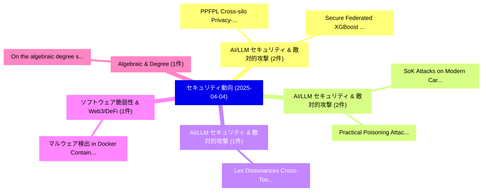

# 📅 02_daily: 日次エグゼクティブサマリー報告書 (2025-04-04)

**集計日時**: 2026-10-02 23:05:21 UTC  
**対象日付**: 2025-04-04  
**本日収集論文数**: 12 件  

---

## 💡 主要セキュリティ動向・脅威インサイト (Executive Insights)

本日の収集論文（計 12 件）において、以下の重点セキュリティ領域で活発な研究動向が確認されました：
- **AI/LLM セキュリティ & 敵対的攻撃** (2 件): 注目論文として 「PPFPL: Cross-silo Privacy-pres...」、「Secure Federated XGBoost with ...」 等が発表され、実務防御および攻撃検証の進展が見られます。
- **AI/LLM セキュリティ & 敵対的攻撃** (2 件): 注目論文として 「SoK: Attacks on Modern Card Pa...」、「Practical Poisoning Attacks ag...」 等が発表され、実務防御および攻撃検証の進展が見られます。
- **AI/LLM セキュリティ & 敵対的攻撃** (1 件): 注目論文として 「Les Dissonances: Cross-Tool Ha...」 等が発表され、実務防御および攻撃検証の進展が見られます。
- **ソフトウェア脆弱性 & Web3/DeFi** (1 件): 注目論文として 「マルウェア検出 in Docker Containers: ...」 等が発表され、実務防御および攻撃検証の進展が見られます。
- **Algebraic & Degree** (1 件): 注目論文として 「On the algebraic degree stabil...」 等が発表され、実務防御および攻撃検証の進展が見られます。

### 🗺️ 技術・脅威トピックマインドマップ

---

## 📌 日次セキュリティ論文一覧 (日本語表形式)

| No | arXiv ID | 論文タイトル (日本語訳) | 重要キーワード | 構造化エグゼクティブ要約 (背景・提案・影響) | 脅威分類 | 詳細リンク |
|---|---|---|---|---|---|---|
| 1 | `2504.03111v3` | [Les Dissonances: Cross-Tool Harvesting and Polluting in Pool-of-Tools Empowered LLMエージェント](../../okf/papers/2025-04-04/2504.03111.md) | `Les Dissonances`, `Tool Harvesting`, `Tools Empowered` | 【提案】概要 (Overview & Key Finding) 本論文「Les Dissonances: Cross-Tool Harvesting and Polluting in...。実証評価により経営層・セキュリティ管理者向け推奨アクション (E... | `cs.CR` | [arXiv](https://arxiv.org/abs/2504.03111v3) &#124; [OKF](../../okf/papers/2025-04-04/2504.03111.md) |
| 2 | `2504.03173v5` | [PPFPL: Cross-silo Privacy-preserving Federated Prototype Learning Against Data Poisoning Attacks（セキュリティ分析論文）](../../okf/papers/2025-04-04/2504.03173.md) | `Cross-silo Privacy`, `Hongliang Zhang`, `Jiguo Yu` | 【提案】概要 (Overview & Key Finding) 本論文「PPFPL: Cross-silo Privacy-preserving Federated Prototyp...。実証評価により経営層・セキュリティ管理者向け推奨アクション (E... | `cs.CR` | [arXiv](https://arxiv.org/abs/2504.03173v5) &#124; [OKF](../../okf/papers/2025-04-04/2504.03173.md) |
| 3 | `2504.03238v1` | [マルウェア検出 in Docker Containers: An Image is Worth a Thousand Logs](../../okf/papers/2025-04-04/2504.03238.md) | `Docker Containers`, `Thousand Logs`, `Malware Detection` | 【提案】概要 (Overview & Key Finding) 本論文「マルウェア検出 in Docker Containers: An Image is Worth a Thous...。実証評価により経営層・セキュリティ管理者向け推奨アクション (E... | `cs.CR` | [arXiv](https://arxiv.org/abs/2504.03238v1) &#124; [OKF](../../okf/papers/2025-04-04/2504.03238.md) |
| 4 | `2504.03307v2` | [On the algebraic degree stability of vectorial Boolean functions when restricted to affine subspaces（セキュリティ分析論文）](../../okf/papers/2025-04-04/2504.03307.md) | `Claude Carlet`, `Serge Feukoua`, `Ana Salagean` | 【提案】概要 (Overview & Key Finding) 本論文「On the algebraic degree stability of vectorial Boolean ...。実証評価により経営層・セキュリティ管理者向け推奨アクション (E... | `cs.CR` | [arXiv](https://arxiv.org/abs/2504.03307v2) &#124; [OKF](../../okf/papers/2025-04-04/2504.03307.md) |
| 5 | `2504.03347v1` | [Optimizing Password Cracking for Digital Investigations（セキュリティ分析論文）](../../okf/papers/2025-04-04/2504.03347.md) | `Optimizing Password Cracking`, `Digital Investigations`, `Mohamad Hachem` | 【提案】概要 (Overview & Key Finding) 本論文「Optimizing Password Cracking for Digital Investigations...。実証評価により経営層・セキュリティ管理者向け推奨アクション (E... | `cs.CR` | [arXiv](https://arxiv.org/abs/2504.03347v1) &#124; [OKF](../../okf/papers/2025-04-04/2504.03347.md) |
| 6 | `2504.03363v1` | [SoK: Attacks on Modern Card Payments（セキュリティ分析論文）](../../okf/papers/2025-04-04/2504.03363.md) | `Modern Card Payments`, `Xenia Hofmeier`, `David Basin` | 【提案】概要 (Overview & Key Finding) 本論文「SoK: Attacks on Modern Card Payments（セキュリティ分析論文）」（原題: S...。実証評価により経営層・セキュリティ管理者向け推奨アクション (E... | `cs.CR` | [arXiv](https://arxiv.org/abs/2504.03363v1) &#124; [OKF](../../okf/papers/2025-04-04/2504.03363.md) |
| 7 | `2504.03823v1` | [The H-Elena Trojan Virus to Infect Model Weights: A Wake-Up Call on the Security Risks of Malicious Fine-Tuning（セキュリティ分析論文）](../../okf/papers/2025-04-04/2504.03823.md) | `Elena Trojan Virus`, `Infect Model Weights`, `Security Risks` | 【提案】概要 (Overview & Key Finding) 本論文「The H-Elena Trojan Virus to Infect Model Weights: A Wak...。実証評価により経営層・セキュリティ管理者向け推奨アクション (E... | `cs.CR` | [arXiv](https://arxiv.org/abs/2504.03823v1) &#124; [OKF](../../okf/papers/2025-04-04/2504.03823.md) |
| 8 | `2504.03850v1` | [Detection Limits and Statistical Separability of Tree Ring Watermarks in Rectified Flow-based Text-to-Image Generation Models（セキュリティ分析論文）](../../okf/papers/2025-04-04/2504.03850.md) | `Tree Ring Watermarks`, `Image Generation Models`, `Detection Limits` | 【提案】概要 (Overview & Key Finding) 本論文「Detection Limits and Statistical Separability of Tree R...。実証評価により経営層・セキュリティ管理者向け推奨アクション (E... | `cs.CR` | [arXiv](https://arxiv.org/abs/2504.03850v1) &#124; [OKF](../../okf/papers/2025-04-04/2504.03850.md) |
| 9 | `2504.03863v1` | [The Secret Life of CVEs（セキュリティ分析論文）](../../okf/papers/2025-04-04/2504.03863.md) | `Piotr Przymus`, `Krzysztof Stencel`, `Raw Meta` | 【提案】概要 (Overview & Key Finding) 本論文「The Secret Life of CVEs（セキュリティ分析論文）」（原題: The Secret Lif...。実証評価により経営層・セキュリティ管理者向け推奨アクション (E... | `cs.CR` | [arXiv](https://arxiv.org/abs/2504.03863v1) &#124; [OKF](../../okf/papers/2025-04-04/2504.03863.md) |
| 10 | `2504.03909v1` | [Secure Federated XGBoost with CUDA-accelerated Homomorphic Encryption via NVIDIA FLARE（セキュリティ分析論文）](../../okf/papers/2025-04-04/2504.03909.md) | `Secure Federated`, `Homomorphic Encryption`, `CUDA-accelerated Homomorphic` | 【提案】概要 (Overview & Key Finding) 本論文「Secure Federated XGBoost with CUDA-accelerated 準同型暗号 vi...。実証評価により経営層・セキュリティ管理者向け推奨アクション (E... | `cs.CR` | [arXiv](https://arxiv.org/abs/2504.03909v1) &#124; [OKF](../../okf/papers/2025-04-04/2504.03909.md) |
| 11 | `2504.03936v2` | [Commit-Reveal$^2$: Randomness Beacons with Randomized Reveal Order in Smart Contractsのセキュリティ強化](../../okf/papers/2025-04-04/2504.03936.md) | `Randomized Reveal Order`, `Randomness Beacons`, `Securing Randomness Beacons` | 【提案】概要 (Overview & Key Finding) 本論文「Commit-Reveal$^2$: Randomness Beacons with Randomized R...。実証評価により経営層・セキュリティ管理者向け推奨アクション (E... | `cs.CR` | [arXiv](https://arxiv.org/abs/2504.03936v2) &#124; [OKF](../../okf/papers/2025-04-04/2504.03936.md) |
| 12 | `2504.03957v2` | [Practical Poisoning Attacks against Retrieval-Augmented Generation（セキュリティ分析論文）](../../okf/papers/2025-04-04/2504.03957.md) | `Practical Poisoning Attacks`, `Augmented Generation`, `Retrieval-Augmented Generation` | 【提案】概要 (Overview & Key Finding) 本論文「Practical Poisoning Attacks against Retrieval-Augmented...。実証評価により経営層・セキュリティ管理者向け推奨アクション (E... | `cs.CR` | [arXiv](https://arxiv.org/abs/2504.03957v2) &#124; [OKF](../../okf/papers/2025-04-04/2504.03957.md) |

