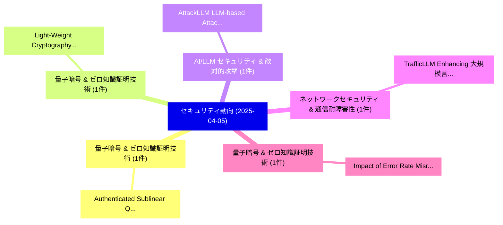

# 📅 02_daily: 日次エグゼクティブサマリー報告書 (2025-04-05)

**集計日時**: 2026-10-02 23:05:21 UTC  
**対象日付**: 2025-04-05  
**本日収集論文数**: 6 件  

---

## 💡 主要セキュリティ動向・脅威インサイト (Executive Insights)

本日の収集論文（計 6 件）において、以下の重点セキュリティ領域で活発な研究動向が確認されました：
- **量子暗号 & ゼロ知識証明技術** (1 件): 注目論文として 「Authenticated Sublinear Quantu...」 等が発表され、実務防御および攻撃検証の進展が見られます。
- **量子暗号 & ゼロ知識証明技術** (1 件): 注目論文として 「Light-Weight Cryptography Algo...」 等が発表され、実務防御および攻撃検証の進展が見られます。
- **AI/LLM セキュリティ & 敵対的攻撃** (1 件): 注目論文として 「AttackLLM: LLM-based Attack Pa...」 等が発表され、実務防御および攻撃検証の進展が見られます。
- **ネットワークセキュリティ & 通信耐障害性** (1 件): 注目論文として 「TrafficLLM: Enhancing 大規模言語モデル...」 等が発表され、実務防御および攻撃検証の進展が見られます。
- **量子暗号 & ゼロ知識証明技術** (1 件): 注目論文として 「Impact of Error Rate Misreport...」 等が発表され、実務防御および攻撃検証の進展が見られます。

### 🗺️ 技術・脅威トピックマインドマップ

---

## 📌 日次セキュリティ論文一覧 (日本語表形式)

| No | arXiv ID | 論文タイトル (日本語訳) | 重要キーワード | 構造化エグゼクティブ要約 (背景・提案・影響) | 脅威分類 | 詳細リンク |
|---|---|---|---|---|---|---|
| 1 | `2504.04041v3` | [Authenticated Sublinear Quantum Private Information Retrieval（セキュリティ分析論文）](../../okf/papers/2025-04-05/2504.04041.md) | `Authenticated Sublinear Quantum Private Information Retrieval`, `Fengxia Liu`, `Zhiyong Zheng` | 【提案】概要 (Overview & Key Finding) 本論文「Authenticated Sublinear 量子 Private Information Retrieva...。実証評価により経営層・セキュリティ管理者向け推奨アクション (E... | `cs.CR` | [arXiv](https://arxiv.org/abs/2504.04041v3) &#124; [OKF](../../okf/papers/2025-04-05/2504.04041.md) |
| 2 | `2504.04063v1` | [Light-Weight Cryptography Algorithms for UAV-Networksの分析](../../okf/papers/2025-04-05/2504.04063.md) | `Weight Cryptography Algorithms`, `Light-Weight Cryptography`, `Aswani Kumar Cherukuri` | 【提案】概要 (Overview & Key Finding) 本論文「Light-Weight 暗号技術 Algorithms for UAV-Networksの分析」（原題: A...。実証評価により経営層・セキュリティ管理者向け推奨アクション (E... | `cs.CR` | [arXiv](https://arxiv.org/abs/2504.04063v1) &#124; [OKF](../../okf/papers/2025-04-05/2504.04063.md) |
| 3 | `2504.04187v1` | [AttackLLM: LLM-based Attack Pattern Generation for an Industrial Control System（セキュリティ分析論文）](../../okf/papers/2025-04-05/2504.04187.md) | `Attack Pattern Generation`, `Industrial Control System`, `LLM-based Attack` | 【提案】概要 (Overview & Key Finding) 本論文「AttackLLM: LLM-based Attack Pattern Generation for an I...。実証評価により経営層・セキュリティ管理者向け推奨アクション (E... | `cs.CR` | [arXiv](https://arxiv.org/abs/2504.04187v1) &#124; [OKF](../../okf/papers/2025-04-05/2504.04187.md) |
| 4 | `2504.04222v2` | [TrafficLLM: Enhancing 大規模言語モデル for Network Traffic Analysis with Generic Traffic Representation](../../okf/papers/2025-04-05/2504.04222.md) | `Generic Traffic Representation`, `Enhancing Large Language Models`, `Tianyu Cui` | 【提案】概要 (Overview & Key Finding) 本論文「TrafficLLM: Enhancing 大規模言語モデル for Network Traffic Anal...。実証評価により経営層・セキュリティ管理者向け推奨アクション (E... | `cs.CR` | [arXiv](https://arxiv.org/abs/2504.04222v2) &#124; [OKF](../../okf/papers/2025-04-05/2504.04222.md) |
| 5 | `2504.04285v1` | [Impact of Error Rate Misreporting on Resource Allocation in Multi-tenant Quantum Computing and Defense（セキュリティ分析論文）](../../okf/papers/2025-04-05/2504.04285.md) | `Error Rate Misreporting`, `Resource Allocation`, `Quantum Computing` | 【提案】概要 (Overview & Key Finding) 本論文「Impact of Error Rate Misreporting on Resource Allocatio...。実証評価により経営層・セキュリティ管理者向け推奨アクション (E... | `cs.CR` | [arXiv](https://arxiv.org/abs/2504.04285v1) &#124; [OKF](../../okf/papers/2025-04-05/2504.04285.md) |
| 6 | `2504.08782v1` | [Embedding Hidden Adversarial Capabilities in Pre-Trained Diffusion Models（セキュリティ分析論文）](../../okf/papers/2025-04-05/2504.08782.md) | `Embedding Hidden Adversarial Capabilities`, `Trained Diffusion Models`, `Pre-Trained Diffusion` | 【提案】概要 (Overview & Key Finding) 本論文「Embedding Hidden Adversarial Capabilities in Pre-Traine...。実証評価により経営層・セキュリティ管理者向け推奨アクション (E... | `cs.CR` | [arXiv](https://arxiv.org/abs/2504.08782v1) &#124; [OKF](../../okf/papers/2025-04-05/2504.08782.md) |

