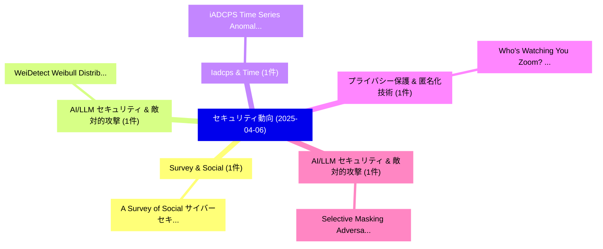

# 📅 02_daily: 日次エグゼクティブサマリー報告書 (2025-04-06)

**集計日時**: 2026-10-02 23:05:21 UTC  
**対象日付**: 2025-04-06  
**本日収集論文数**: 8 件  

---

## 💡 主要セキュリティ動向・脅威インサイト (Executive Insights)

本日の収集論文（計 8 件）において、以下の重点セキュリティ領域で活発な研究動向が確認されました：
- **Survey & Social** (1 件): 注目論文として 「A Survey of Social サイバーセキュリティ:...」 等が発表され、実務防御および攻撃検証の進展が見られます。
- **AI/LLM セキュリティ & 敵対的攻撃** (1 件): 注目論文として 「WeiDetect: Weibull Distributio...」 等が発表され、実務防御および攻撃検証の進展が見られます。
- **Iadcps & Time** (1 件): 注目論文として 「iADCPS: Time Series Anomaly De...」 等が発表され、実務防御および攻撃検証の進展が見られます。
- **プライバシー保護 & 匿名化技術** (1 件): 注目論文として 「Who's Watching You Zoom? Inves...」 等が発表され、実務防御および攻撃検証の進展が見られます。
- **AI/LLM セキュリティ & 敵対的攻撃** (1 件): 注目論文として 「Selective Masking Adversarial ...」 等が発表され、実務防御および攻撃検証の進展が見られます。

### 🗺️ 技術・脅威トピックマインドマップ

---

## 📌 日次セキュリティ論文一覧 (日本語表形式)

| No | arXiv ID | 論文タイトル (日本語訳) | 重要キーワード | 構造化エグゼクティブ要約 (背景・提案・影響) | 脅威分類 | 詳細リンク |
|---|---|---|---|---|---|---|
| 1 | `2504.04311v1` | [A Survey of Social サイバーセキュリティ: Techniques for Attack Detection, Evaluations, Challenges, and Future Prospects](../../okf/papers/2025-04-06/2504.04311.md) | `Attack Detection`, `Future Prospects`, `Social Cybersecurity` | 【提案】概要 (Overview & Key Finding) 本論文「A Survey of Social サイバーセキュリティ: Techniques for Attack De...。実証評価により経営層・セキュリティ管理者向け推奨アクション (E... | `cs.CR` | [arXiv](https://arxiv.org/abs/2504.04311v1) &#124; [OKF](../../okf/papers/2025-04-06/2504.04311.md) |
| 2 | `2504.04367v2` | [WeiDetect: Weibull Distribution-Based Defense against Poisoning Attacks in 連合学習 for Network Intrusion Detection Systems](../../okf/papers/2025-04-06/2504.04367.md) | `Network Intrusion Detection Systems`, `Weibull Distribution`, `Based Defense` | 【提案】概要 (Overview & Key Finding) 本論文「WeiDetect: Weibull Distribution-Based Defense against P...。実証評価により経営層・セキュリティ管理者向け推奨アクション (E... | `cs.CR` | [arXiv](https://arxiv.org/abs/2504.04367v2) &#124; [OKF](../../okf/papers/2025-04-06/2504.04367.md) |
| 3 | `2504.04374v1` | [iADCPS: Time Series Anomaly Detection for Evolving Cyber-physical Systems via Incremental Meta-learning（セキュリティ分析論文）](../../okf/papers/2025-04-06/2504.04374.md) | `Time Series Anomaly Detection`, `Evolving Cyber`, `Cyber-physical Systems` | 【提案】概要 (Overview & Key Finding) 本論文「iADCPS: Time Series Anomaly Detection for Evolving Cybe...。実証評価により経営層・セキュリティ管理者向け推奨アクション (E... | `cs.CR` | [arXiv](https://arxiv.org/abs/2504.04374v1) &#124; [OKF](../../okf/papers/2025-04-06/2504.04374.md) |
| 4 | `2504.04388v1` | [Who's Watching You Zoom? Investigating Privacy of Third-Party Zoom Apps（セキュリティ分析論文）](../../okf/papers/2025-04-06/2504.04388.md) | `Party Zoom Apps`, `Investigating Privacy`, `Third-Party Zoom` | 【提案】Investigating Privacy of Third-Party Zoom Apps ### (日本語題名: Who's Watching You Zoom?。実証評価により経営層・セキュリティ管理者向け推奨アクション (Executiv... | `cs.CR` | [arXiv](https://arxiv.org/abs/2504.04388v1) &#124; [OKF](../../okf/papers/2025-04-06/2504.04388.md) |
| 5 | `2504.04394v1` | [Selective Masking Adversarial Attack on Automatic Speech Recognition Systems（セキュリティ分析論文）](../../okf/papers/2025-04-06/2504.04394.md) | `Selective Masking Adversarial Attack`, `Automatic Speech Recognition Systems`, `Zheng Fang` | 【提案】概要 (Overview & Key Finding) 本論文「Selective Masking 敵対的攻撃 on Automatic Speech Recognition...。実証評価により経営層・セキュリティ管理者向け推奨アクション (E... | `cs.CR` | [arXiv](https://arxiv.org/abs/2504.04394v1) &#124; [OKF](../../okf/papers/2025-04-06/2504.04394.md) |
| 6 | `2504.04422v1` | [LeakGuard: Detecting Memory Leaks Accurately and Scalably（セキュリティ分析論文）](../../okf/papers/2025-04-06/2504.04422.md) | `Detecting Memory Leaks Accurately`, `Hongliang Liang`, `Luming Yin` | 【提案】概要 (Overview & Key Finding) 本論文「LeakGuard: Detecting Memory Leaks Accurately and Scalab...。実証評価により経営層・セキュリティ管理者向け推奨アクション (E... | `cs.CR` | [arXiv](https://arxiv.org/abs/2504.04422v1) &#124; [OKF](../../okf/papers/2025-04-06/2504.04422.md) |
| 7 | `2504.04511v1` | [Post-Quantum Wireless-based Key Encapsulation Mechanism via CRYSTALS-Kyber for Resource-Constrained Devices（セキュリティ分析論文）](../../okf/papers/2025-04-06/2504.04511.md) | `Key Encapsulation Mechanism`, `Quantum Wireless`, `Constrained Devices` | 【提案】概要 (Overview & Key Finding) 本論文「Post-量子 Wireless-based Key Encapsulation Mechanism via ...。実証評価により経営層・セキュリティ管理者向け推奨アクション (E... | `cs.CR` | [arXiv](https://arxiv.org/abs/2504.04511v1) &#124; [OKF](../../okf/papers/2025-04-06/2504.04511.md) |
| 8 | `2504.07132v1` | [SolRPDS: A Dataset for Analyzing Rug Pulls in Solana Decentralized Finance（セキュリティ分析論文）](../../okf/papers/2025-04-06/2504.07132.md) | `Analyzing Rug Pulls`, `Solana Decentralized Finance`, `Abdulrahman Alhaidari` | 【提案】概要 (Overview & Key Finding) 本論文「SolRPDS: A Dataset for Analyzing Rug Pulls in Solana De...。実証評価により経営層・セキュリティ管理者向け推奨アクション (E... | `cs.CR` | [arXiv](https://arxiv.org/abs/2504.07132v1) &#124; [OKF](../../okf/papers/2025-04-06/2504.07132.md) |

