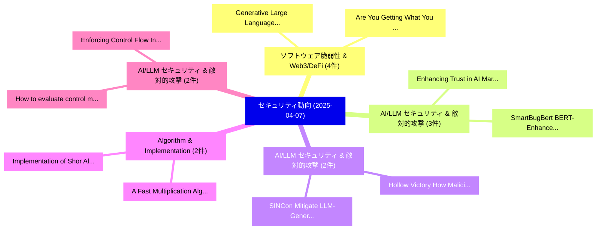

# 📅 02_daily: 日次エグゼクティブサマリー報告書 (2025-04-07)

**集計日時**: 2026-10-02 23:05:21 UTC  
**対象日付**: 2025-04-07  
**本日収集論文数**: 21 件  

---

## 💡 主要セキュリティ動向・脅威インサイト (Executive Insights)

本日の収集論文（計 21 件）において、以下の重点セキュリティ領域で活発な研究動向が確認されました：
- **ソフトウェア脆弱性 & Web3/DeFi** (4 件): 注目論文として 「Generative Large Language Mode...」、「Are You Getting What You Pay F...」 等が発表され、実務防御および攻撃検証の進展が見られます。
- **AI/LLM セキュリティ & 敵対的攻撃** (3 件): 注目論文として 「Enhancing Trust in AI Marketpl...」、「SmartBugBert: BERT-Enhanced 脆弱...」 等が発表され、実務防御および攻撃検証の進展が見られます。
- **AI/LLM セキュリティ & 敵対的攻撃** (2 件): 注目論文として 「Hollow Victory: How Malicious ...」、「SINCon: Mitigate LLM-Generated...」 等が発表され、実務防御および攻撃検証の進展が見られます。
- **Algorithm & Implementation** (2 件): 注目論文として 「A Fast Multiplication Algorith...」、「Implementation of Shor Algorit...」 等が発表され、実務防御および攻撃検証の進展が見られます。
- **AI/LLM セキュリティ & 敵対的攻撃** (2 件): 注目論文として 「How to evaluate control measur...」、「Enforcing Control Flow Integri...」 等が発表され、実務防御および攻撃検証の進展が見られます。

### 🗺️ 技術・脅威トピックマインドマップ

---

## 📌 日次セキュリティ論文一覧 (日本語表形式)

| No | arXiv ID | 論文タイトル (日本語訳) | 重要キーワード | 構造化エグゼクティブ要約 (背景・提案・影響) | 脅威分類 | 詳細リンク |
|---|---|---|---|---|---|---|
| 1 | `2504.04685v1` | [Generative Large Language Model usage in Smart Contract 脆弱性検出](../../okf/papers/2025-04-07/2504.04685.md) | `Generative Large Language Model`, `Smart Contract Vulnerability Detection`, `Smart Contract` | 【提案】概要 (Overview & Key Finding) 本論文「Generative Large Language Model usage in スマートコントラクト 脆弱性...。実証評価によりLiu, Xiaoning Du - **。 | `cs.CR` | [arXiv](https://arxiv.org/abs/2504.04685v1) &#124; [OKF](../../okf/papers/2025-04-07/2504.04685.md) |
| 2 | `2504.04715v2` | [Are You Getting What You Pay For? Auditing Model Substitution in LLM APIs（セキュリティ分析論文）](../../okf/papers/2025-04-07/2504.04715.md) | `Auditing Model Substitution`, `Will Cai`, `Tianneng Shi` | 【提案】Auditing Model Substitution in LLM APIs ### (日本語題名: Are You Getting What You Pay For?。実証評価により経営層・セキュリティ管理者向け推奨アクション (Execut... | `cs.CR` | [arXiv](https://arxiv.org/abs/2504.04715v2) &#124; [OKF](../../okf/papers/2025-04-07/2504.04715.md) |
| 3 | `2504.04731v1` | [A High-Performance Curve25519 and Curve448 Unified Elliptic Curve Cryptography Accelerator（セキュリティ分析論文）](../../okf/papers/2025-04-07/2504.04731.md) | `Curve448 Unified Elliptic Curve Cryptography Accelerator`, `Performance Curve25519`, `High-Performance Curve25519` | 【提案】概要 (Overview & Key Finding) 本論文「A High-Performance Curve25519 and Curve448 Unified Elli...。実証評価により経営層・セキュリティ管理者向け推奨アクション (E... | `cs.CR` | [arXiv](https://arxiv.org/abs/2504.04731v1) &#124; [OKF](../../okf/papers/2025-04-07/2504.04731.md) |
| 4 | `2504.04734v2` | [Teaching Data Science Students to Sketch Privacy Designs through Heuristics (Extended Technical Report)（セキュリティ分析論文）](../../okf/papers/2025-04-07/2504.04734.md) | `Teaching Data Science Students`, `Sketch Privacy Designs`, `Extended Technical Report` | 【提案】概要 (Overview & Key Finding) 本論文「Teaching Data Science Students to Sketch Privacy Design...。実証評価により経営層・セキュリティ管理者向け推奨アクション (E... | `cs.CR` | [arXiv](https://arxiv.org/abs/2504.04734v2) &#124; [OKF](../../okf/papers/2025-04-07/2504.04734.md) |
| 5 | `2504.04794v1` | [Enhancing Trust in AI Marketplaces: Evaluating On-Chain Verification of Personalized AI models using zk-SNARKs（セキュリティ分析論文）](../../okf/papers/2025-04-07/2504.04794.md) | `Enhancing Trust`, `Chain Verification`, `On-Chain Verification` | 【提案】概要 (Overview & Key Finding) 本論文「Enhancing Trust in AI Marketplaces: Evaluating On-Chain...。実証評価により経営層・セキュリティ管理者向け推奨アクション (E... | `cs.CR` | [arXiv](https://arxiv.org/abs/2504.04794v1) &#124; [OKF](../../okf/papers/2025-04-07/2504.04794.md) |
| 6 | `2504.04803v1` | [Out of Sight, Still at Risk: The Lifecycle of Transitive Vulnerabilities in Maven（セキュリティ分析論文）](../../okf/papers/2025-04-07/2504.04803.md) | `Transitive Vulnerabilities`, `Piotr Przymus`, `Krzysztof Rykaczewski` | 【提案】概要 (Overview & Key Finding) 本論文「Out of Sight, Still at Risk: The Lifecycle of Transitiv...。実証評価により経営層・セキュリティ管理者向け推奨アクション (E... | `cs.CR` | [arXiv](https://arxiv.org/abs/2504.04803v1) &#124; [OKF](../../okf/papers/2025-04-07/2504.04803.md) |
| 7 | `2504.04809v2` | [SEEM: Exploiting Black-Box Text Attacks to Manipulate Tool Selection（セキュリティ分析論文）](../../okf/papers/2025-04-07/2504.04809.md) | `Box Text Attacks`, `Manipulate Tool Selection`, `Exploiting Black` | 【提案】概要 (Overview & Key Finding) 本論文「SEEM: Exploiting Black-Box Text Attacks to Manipulate T...。実証評価により経営層・セキュリティ管理者向け推奨アクション (E... | `cs.CR` | [arXiv](https://arxiv.org/abs/2504.04809v2) &#124; [OKF](../../okf/papers/2025-04-07/2504.04809.md) |
| 8 | `2504.05002v2` | [SmartBugBert: BERT-Enhanced 脆弱性検出 for Smart Contract Bytecode](../../okf/papers/2025-04-07/2504.05002.md) | `Smart Contract Bytecode`, `Enhanced Vulnerability Detection`, `BERT-Enhanced Vulnerability` | 【提案】概要 (Overview & Key Finding) 本論文「SmartBugBert: BERT-Enhanced 脆弱性検出 for スマートコントラクト Byteco...。実証評価により経営層・セキュリティ管理者向け推奨アクション (E... | `cs.CR` | [arXiv](https://arxiv.org/abs/2504.05002v2) &#124; [OKF](../../okf/papers/2025-04-07/2504.05002.md) |
| 9 | `2504.05006v2` | [Enhancing Smart Contract 脆弱性検出 in DApps Leveraging Fine-Tuned LLM](../../okf/papers/2025-04-07/2504.05006.md) | `Leveraging Fine`, `Fine-Tuned LLM`, `Enhancing Smart Contract Vulnerability Detection` | 【提案】概要 (Overview & Key Finding) 本論文「Enhancing スマートコントラクト 脆弱性検出 in DApps Leveraging Fine-Tun...。実証評価により経営層・セキュリティ管理者向け推奨アクション (E... | `cs.CR` | [arXiv](https://arxiv.org/abs/2504.05006v2) &#124; [OKF](../../okf/papers/2025-04-07/2504.05006.md) |
| 10 | `2504.05094v1` | [Hollow Victory: How Malicious Proposers Exploit Validator Incentives in Optimistic Rollup Dispute Games（セキュリティ分析論文）](../../okf/papers/2025-04-07/2504.05094.md) | `Optimistic Rollup Dispute Games`, `Hollow Victory`, `Suhyeon Lee` | 【提案】概要 (Overview & Key Finding) 本論文「Hollow Victory: How Malicious Proposers エクスプロイト Validat...。実証評価により経営層・セキュリティ管理者向け推奨アクション (E... | `cs.CR` | [arXiv](https://arxiv.org/abs/2504.05094v1) &#124; [OKF](../../okf/papers/2025-04-07/2504.05094.md) |
| 11 | `2504.05143v1` | [Taming Double-Spending in Offline Payments with Reputation-Weighted Loan Networks（セキュリティ分析論文）](../../okf/papers/2025-04-07/2504.05143.md) | `Weighted Loan Networks`, `Taming Double`, `Offline Payments` | 【提案】概要 (Overview & Key Finding) 本論文「Taming Double-Spending in Offline Payments with Reputat...。実証評価により経営層・セキュリティ管理者向け推奨アクション (E... | `cs.CR` | [arXiv](https://arxiv.org/abs/2504.05143v1) &#124; [OKF](../../okf/papers/2025-04-07/2504.05143.md) |
| 12 | `2504.05147v2` | [Pr$εε$mpt: Sanitizing Sensitive Prompts for LLMs（セキュリティ分析論文）](../../okf/papers/2025-04-07/2504.05147.md) | `Sanitizing Sensitive Prompts`, `Amrita Roy Chowdhury`, `David Glukhov` | 【提案】概要 (Overview & Key Finding) 本論文「Pr$εε$mpt: Sanitizing Sensitive Prompts for LLMs（セキュリティ...。実証評価により経営層・セキュリティ管理者向け推奨アクション (E... | `cs.CR` | [arXiv](https://arxiv.org/abs/2504.05147v2) &#124; [OKF](../../okf/papers/2025-04-07/2504.05147.md) |
| 13 | `2504.05159v2` | [A Fast Multiplication Algorithm and RLWE-PLWE Equivalence for the Maximal Real Subfield of the $2^r p^s$-th Cyclotomic Field（セキュリティ分析論文）](../../okf/papers/2025-04-07/2504.05159.md) | `Fast Multiplication Algorithm`, `Maximal Real Subfield`, `Cyclotomic Field` | 【提案】概要 (Overview & Key Finding) 本論文「A Fast Multiplication Algorithm and RLWE-PLWE Equivalen...。実証評価により経営層・セキュリティ管理者向け推奨アクション (E... | `cs.CR` | [arXiv](https://arxiv.org/abs/2504.05159v2) &#124; [OKF](../../okf/papers/2025-04-07/2504.05159.md) |
| 14 | `2504.05202v1` | [Infinitely Divisible Noise for Differential Privacy: Nearly Optimal Error in the High $\varepsilon$ Regime（セキュリティ分析論文）](../../okf/papers/2025-04-07/2504.05202.md) | `Infinitely Divisible Noise`, `Nearly Optimal Error`, `Differential Privacy` | 【提案】概要 (Overview & Key Finding) 本論文「Infinitely Divisible Noise for 差分プライバシー: Nearly Optimal...。実証評価により経営層・セキュリティ管理者向け推奨アクション (E... | `cs.CR` | [arXiv](https://arxiv.org/abs/2504.05202v1) &#124; [OKF](../../okf/papers/2025-04-07/2504.05202.md) |
| 15 | `2504.05259v1` | [How to evaluate control measures for LLMエージェント? A trajectory from today to superintelligence](../../okf/papers/2025-04-07/2504.05259.md) | `Tomek Korbak`, `Mikita Balesni`, `Buck Shlegeris` | 【提案】A trajectory from today to superintelligence ### (日本語題名: How to evaluate control measur...。実証評価により経営層・セキュリティ管理者向け推奨アクション (E... | `cs.CR` | [arXiv](https://arxiv.org/abs/2504.05259v1) &#124; [OKF](../../okf/papers/2025-04-07/2504.05259.md) |
| 16 | `2504.05408v4` | [Frontier AI's Impact on the サイバーセキュリティ Landscape](../../okf/papers/2025-04-07/2504.05408.md) | `Cybersecurity Landscape`, `Patrick Gage Kelley`, `Yujin Potter` | 【提案】概要 (Overview & Key Finding) 本論文「Frontier AI's Impact on the サイバーセキュリティ Landscape」（原題: F...。実証評価により経営層・セキュリティ管理者向け推奨アクション (E... | `cs.CR` | [arXiv](https://arxiv.org/abs/2504.05408v4) &#124; [OKF](../../okf/papers/2025-04-07/2504.05408.md) |
| 17 | `2504.05485v1` | [Zero Trust Security in Connected Vehicles: A Comprehensive Surveyに向けて](../../okf/papers/2025-04-07/2504.05485.md) | `Connected Vehicles`, `Towards Zero Trust Security`, `Zero Trust Security` | 【提案】概要 (Overview & Key Finding) 本論文「ゼロトラスト Security in Connected Vehicles: A Comprehensive ...。実証評価により経営層・セキュリティ管理者向け推奨アクション (E... | `cs.CR` | [arXiv](https://arxiv.org/abs/2504.05485v1) &#124; [OKF](../../okf/papers/2025-04-07/2504.05485.md) |
| 18 | `2504.05509v3` | [Enforcing Control Flow Integrity on DeFi Smart Contracts（セキュリティ分析論文）](../../okf/papers/2025-04-07/2504.05509.md) | `Enforcing Control Flow Integrity`, `Smart Contracts`, `Sidi Mohamed Beillahi` | 【提案】概要 (Overview & Key Finding) 本論文「Enforcing Control Flow Integrity on DeFi スマートコントラクトs（セキ...。実証評価により経営層・セキュリティ管理者向け推奨アクション (E... | `cs.CR` | [arXiv](https://arxiv.org/abs/2504.05509v3) &#124; [OKF](../../okf/papers/2025-04-07/2504.05509.md) |
| 19 | `2504.07135v1` | [SINCon: Mitigate LLM-Generated Malicious Message Injection Attack for Rumor Detection（セキュリティ分析論文）](../../okf/papers/2025-04-07/2504.07135.md) | `Generated Malicious Message Injection Attack`, `LLM-Generated Malicious`, `Rumor Detection` | 【提案】概要 (Overview & Key Finding) 本論文「SINCon: Mitigate LLM-Generated Malicious Message Inject...。実証評価により経営層・セキュリティ管理者向け推奨アクション (E... | `cs.CR` | [arXiv](https://arxiv.org/abs/2504.07135v1) &#124; [OKF](../../okf/papers/2025-04-07/2504.07135.md) |
| 20 | `2504.07137v1` | [Large Language Model (LLM) for Software Security: Code Analysis, Malware Analysis, Reverse Engineering（セキュリティ分析論文）](../../okf/papers/2025-04-07/2504.07137.md) | `Large Language Model`, `Software Security`, `Reverse Engineering` | 【提案】概要 (Overview & Key Finding) 本論文「Large Language Model (LLM) for Software Security: Code ...。実証評価により経営層・セキュリティ管理者向け推奨アクション (E... | `cs.CR` | [arXiv](https://arxiv.org/abs/2504.07137v1) &#124; [OKF](../../okf/papers/2025-04-07/2504.07137.md) |
| 21 | `2505.03743v2` | [Implementation of Shor Algorithm: Factoring a 4096-Bit Integer Under Specific Constraints（セキュリティ分析論文）](../../okf/papers/2025-04-07/2505.03743.md) | `Shor Algorithm`, `4096-Bit Integer`, `Raw Meta` | 【提案】概要 (Overview & Key Finding) 本論文「Implementation of Shor Algorithm: Factoring a 4096-Bit ...。実証評価により経営層・セキュリティ管理者向け推奨アクション (E... | `cs.CR` | [arXiv](https://arxiv.org/abs/2505.03743v2) &#124; [OKF](../../okf/papers/2025-04-07/2505.03743.md) |

