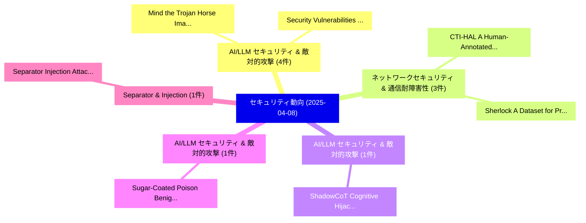

# 📅 02_daily: 日次エグゼクティブサマリー報告書 (2025-04-08)

**集計日時**: 2026-10-02 23:05:22 UTC  
**対象日付**: 2025-04-08  
**本日収集論文数**: 20 件  

---

## 💡 主要セキュリティ動向・脅威インサイト (Executive Insights)

本日の収集論文（計 20 件）において、以下の重点セキュリティ領域で活発な研究動向が確認されました：
- **AI/LLM セキュリティ & 敵対的攻撃** (4 件): 注目論文として 「Mind the Trojan Horse: Image P...」、「Security Vulnerabilities in Et...」 等が発表され、実務防御および攻撃検証の進展が見られます。
- **ネットワークセキュリティ & 通信耐障害性** (3 件): 注目論文として 「CTI-HAL: A Human-Annotated Dat...」、「Sherlock: A Dataset for Proces...」 等が発表され、実務防御および攻撃検証の進展が見られます。
- **AI/LLM セキュリティ & 敵対的攻撃** (1 件): 注目論文として 「ShadowCoT: Cognitive Hijacking...」 等が発表され、実務防御および攻撃検証の進展が見られます。
- **AI/LLM セキュリティ & 敵対的攻撃** (1 件): 注目論文として 「Sugar-Coated Poison: Benign Ge...」 等が発表され、実務防御および攻撃検証の進展が見られます。
- **Separator & Injection** (1 件): 注目論文として 「Separator Injection Attack: Un...」 等が発表され、実務防御および攻撃検証の進展が見られます。

### 🗺️ 技術・脅威トピックマインドマップ

---

## 📌 日次セキュリティ論文一覧 (日本語表形式)

| No | arXiv ID | 論文タイトル (日本語訳) | 重要キーワード | 構造化エグゼクティブ要約 (背景・提案・影響) | 脅威分類 | 詳細リンク |
|---|---|---|---|---|---|---|
| 1 | `2504.05605v1` | [ShadowCoT: Cognitive Hijacking for Stealthy Reasoning Backdoors in LLMs（セキュリティ分析論文）](../../okf/papers/2025-04-08/2504.05605.md) | `Stealthy Reasoning Backdoors`, `Cognitive Hijacking`, `Gejian Zhao` | 【提案】概要 (Overview & Key Finding) 本論文「ShadowCoT: Cognitive Hijacking for Stealthy Reasoning B...。実証評価により経営層・セキュリティ管理者向け推奨アクション (E... | `cs.CR` | [arXiv](https://arxiv.org/abs/2504.05605v1) &#124; [OKF](../../okf/papers/2025-04-08/2504.05605.md) |
| 2 | `2504.05652v3` | [Sugar-Coated Poison: Benign Generation Unlocks LLM Jailbreaking（セキュリティ分析論文）](../../okf/papers/2025-04-08/2504.05652.md) | `Benign Generation Unlocks`, `Coated Poison`, `Sugar-Coated Poison` | 【提案】概要 (Overview & Key Finding) 本論文「Sugar-Coated Poison: Benign Generation Unlocks LLM ジェイル...。実証評価により経営層・セキュリティ管理者向け推奨アクション (E... | `cs.CR` | [arXiv](https://arxiv.org/abs/2504.05652v3) &#124; [OKF](../../okf/papers/2025-04-08/2504.05652.md) |
| 3 | `2504.05689v1` | [Separator Injection Attack: Uncovering Dialogue Biases in 大規模言語モデル Caused by Role Separators](../../okf/papers/2025-04-08/2504.05689.md) | `Separator Injection Attack`, `Uncovering Dialogue Biases`, `Role Separators` | 【提案】概要 (Overview & Key Finding) 本論文「Separator Injection Attack: Uncovering Dialogue Biases ...。実証評価により経営層・セキュリティ管理者向け推奨アクション (E... | `cs.CR` | [arXiv](https://arxiv.org/abs/2504.05689v1) &#124; [OKF](../../okf/papers/2025-04-08/2504.05689.md) |
| 4 | `2504.05710v2` | [Cryptomania v.s. Minicrypt in a Quantum World（セキュリティ分析論文）](../../okf/papers/2025-04-08/2504.05710.md) | `Quantum World`, `Longcheng Li`, `Qian Li` | 【提案】Minicrypt in a 量子 World ### (日本語題名: Cryptomania v.s. Minicrypt in a 量子 World（セキュリティ分析論文...。実証評価により経営層・セキュリティ管理者向け推奨アクション (E... | `cs.CR` | [arXiv](https://arxiv.org/abs/2504.05710v2) &#124; [OKF](../../okf/papers/2025-04-08/2504.05710.md) |
| 5 | `2504.05832v1` | [Channel State Information Analysis for Jamming Attack Detection in Static and Dynamic UAV Networks -- An Experimental Study（セキュリティ分析論文）](../../okf/papers/2025-04-08/2504.05832.md) | `Jamming Attack Detection`, `Pavlo Mykytyn`, `Ronald Chitauro` | 【提案】概要 (Overview & Key Finding) 本論文「Channel State Information Analysis for Jamming Attack D...。実証評価により経営層・セキュリティ管理者向け推奨アクション (E... | `cs.CR` | [arXiv](https://arxiv.org/abs/2504.05832v1) &#124; [OKF](../../okf/papers/2025-04-08/2504.05832.md) |
| 6 | `2504.05838v1` | [Mind the Trojan Horse: Image Prompt Adapter Enabling Scalable and Deceptive Jailbreaking（セキュリティ分析論文）](../../okf/papers/2025-04-08/2504.05838.md) | `Image Prompt Adapter Enabling Scalable`, `Trojan Horse`, `Deceptive Jailbreaking` | 【提案】概要 (Overview & Key Finding) 本論文「Mind the Trojan Horse: Image Prompt Adapter Enabling Sc...。実証評価により経営層・セキュリティ管理者向け推奨アクション (E... | `cs.CR` | [arXiv](https://arxiv.org/abs/2504.05838v1) &#124; [OKF](../../okf/papers/2025-04-08/2504.05838.md) |
| 7 | `2504.05866v1` | [CTI-HAL: A Human-Annotated Dataset for Cyber Threat Intelligence Analysis（セキュリティ分析論文）](../../okf/papers/2025-04-08/2504.05866.md) | `Annotated Dataset`, `Human-Annotated Dataset`, `Sofia Della Penna` | 【提案】概要 (Overview & Key Finding) 本論文「CTI-HAL: A Human-Annotated Dataset for Cyber 脅威 Intelli...。実証評価により経営層・セキュリティ管理者向け推奨アクション (E... | `cs.CR` | [arXiv](https://arxiv.org/abs/2504.05866v1) &#124; [OKF](../../okf/papers/2025-04-08/2504.05866.md) |
| 8 | `2504.05902v2` | [Defending against Backdoor Attacks via Module Switching（セキュリティ分析論文）](../../okf/papers/2025-04-08/2504.05902.md) | `Backdoor Attacks`, `Module Switching`, `Weijun Li` | 【提案】概要 (Overview & Key Finding) 本論文「Defending against Backdoor Attacks via Module Switching...。実証評価により経営層・セキュリティ管理者向け推奨アクション (E... | `cs.CR` | [arXiv](https://arxiv.org/abs/2504.05902v2) &#124; [OKF](../../okf/papers/2025-04-08/2504.05902.md) |
| 9 | `2504.05968v4` | [Security Vulnerabilities in Ethereum Smart Contracts: A Systematic Analysis（セキュリティ分析論文）](../../okf/papers/2025-04-08/2504.05968.md) | `Ethereum Smart Contracts`, `Security Vulnerabilities`, `Jixuan Wu` | 【提案】概要 (Overview & Key Finding) 本論文「Security Vulnerabilities in Ethereum スマートコントラクトs: A Sys...。実証評価により経営層・セキュリティ管理者向け推奨アクション (E... | `cs.CR` | [arXiv](https://arxiv.org/abs/2504.05968v4) &#124; [OKF](../../okf/papers/2025-04-08/2504.05968.md) |
| 10 | `2504.06017v2` | [CAI: An Open, Bug Bounty-Ready サイバーセキュリティ AI](../../okf/papers/2025-04-08/2504.06017.md) | `Bug Bounty`, `Ready Cybersecurity`, `Bounty-Ready Cybersecurity` | 【提案】概要 (Overview & Key Finding) 本論文「CAI: An Open, Bug Bounty-Ready サイバーセキュリティ AI」（原題: CAI: ...。実証評価により経営層・セキュリティ管理者向け推奨アクション (E... | `cs.CR` | [arXiv](https://arxiv.org/abs/2504.06017v2) &#124; [OKF](../../okf/papers/2025-04-08/2504.06017.md) |
| 11 | `2504.06083v1` | [Security Thumbnail-Preserving Image Encryption and a New Frameworkの分析](../../okf/papers/2025-04-08/2504.06083.md) | `Preserving Image Encryption`, `Thumbnail-Preserving Image`, `Security Thumbnail` | 【提案】概要 (Overview & Key Finding) 本論文「Security Thumbnail-Preserving Image Encryption and a Ne...。実証評価により経営層・セキュリティ管理者向け推奨アクション (E... | `cs.CR` | [arXiv](https://arxiv.org/abs/2504.06083v1) &#124; [OKF](../../okf/papers/2025-04-08/2504.06083.md) |
| 12 | `2504.06102v1` | [Sherlock: A Dataset for Process-aware Intrusion Detection Research on Power Grid Networks（セキュリティ分析論文）](../../okf/papers/2025-04-08/2504.06102.md) | `Intrusion Detection Research`, `Power Grid Networks`, `Process-aware Intrusion` | 【提案】概要 (Overview & Key Finding) 本論文「Sherlock: A Dataset for Process-aware Intrusion Detecti...。実証評価により経営層・セキュリティ管理者向け推奨アクション (E... | `cs.CR` | [arXiv](https://arxiv.org/abs/2504.06102v1) &#124; [OKF](../../okf/papers/2025-04-08/2504.06102.md) |
| 13 | `2504.06180v1` | [Blockchain Oracles for Real Estate Rental（セキュリティ分析論文）](../../okf/papers/2025-04-08/2504.06180.md) | `Real Estate Rental`, `Blockchain Oracles`, `Nuno Braz` | 【提案】概要 (Overview & Key Finding) 本論文「Blockchain Oracles for Real Estate Rental（セキュリティ分析論文）」（...。実証評価により経営層・セキュリティ管理者向け推奨アクション (E... | `cs.CR` | [arXiv](https://arxiv.org/abs/2504.06180v1) &#124; [OKF](../../okf/papers/2025-04-08/2504.06180.md) |
| 14 | `2504.06211v2` | [Need for zkSpeed: Accelerating HyperPlonk for Zero-Knowledge Proofs（セキュリティ分析論文）](../../okf/papers/2025-04-08/2504.06211.md) | `Knowledge Proofs`, `Zero-Knowledge Proofs`, `Alhad Daftardar` | 【提案】概要 (Overview & Key Finding) 本論文「Need for zkSpeed: Accelerating HyperPlonk for Zero-Know...。実証評価により経営層・セキュリティ管理者向け推奨アクション (E... | `cs.CR` | [arXiv](https://arxiv.org/abs/2504.06211v2) &#124; [OKF](../../okf/papers/2025-04-08/2504.06211.md) |
| 15 | `2504.06241v1` | [A Case for Network-wide Orchestration of Host-based Intrusion Detection and Response（セキュリティ分析論文）](../../okf/papers/2025-04-08/2504.06241.md) | `Intrusion Detection`, `Network-wide Orchestration`, `Host-based Intrusion` | 【提案】概要 (Overview & Key Finding) 本論文「A Case for Network-wide Orchestration of Host-based Int...。実証評価により経営層・セキュリティ管理者向け推奨アクション (E... | `cs.CR` | [arXiv](https://arxiv.org/abs/2504.06241v1) &#124; [OKF](../../okf/papers/2025-04-08/2504.06241.md) |
| 16 | `2504.06320v2` | [Hybrid Temporal Differential Consistency Autoencoder for Efficient and Sustainable Anomaly Detection in Cyber-Physical Systems（セキュリティ分析論文）](../../okf/papers/2025-04-08/2504.06320.md) | `Hybrid Temporal Differential Consistency Autoencoder`, `Sustainable Anomaly Detection`, `Physical Systems` | 【提案】概要 (Overview & Key Finding) 本論文「Hybrid Temporal Differential Consistency Autoencoder fo...。実証評価により経営層・セキュリティ管理者向け推奨アクション (E... | `cs.CR` | [arXiv](https://arxiv.org/abs/2504.06320v2) &#124; [OKF](../../okf/papers/2025-04-08/2504.06320.md) |
| 17 | `2504.06410v1` | [PEEL the Layers and Find Yourself: Revisiting Inference-time Data Leakage for Residual Neural Networks（セキュリティ分析論文）](../../okf/papers/2025-04-08/2504.06410.md) | `Residual Neural Networks`, `Revisiting Inference`, `Data Leakage` | 【提案】概要 (Overview & Key Finding) 本論文「PEEL the Layers and Find Yourself: Revisiting Inference...。実証評価により経営層・セキュリティ管理者向け推奨アクション (E... | `cs.CR` | [arXiv](https://arxiv.org/abs/2504.06410v1) &#124; [OKF](../../okf/papers/2025-04-08/2504.06410.md) |
| 18 | `2504.06417v2` | [TRIDENT: Tri-modal Real-time Intrusion Detection Engine for New Targets（セキュリティ分析論文）](../../okf/papers/2025-04-08/2504.06417.md) | `Intrusion Detection Engine`, `New Targets`, `Tri-modal Real` | 【提案】概要 (Overview & Key Finding) 本論文「TRIDENT: Tri-modal Real-time Intrusion Detection Engine...。実証評価により経営層・セキュリティ管理者向け推奨アクション (E... | `cs.CR` | [arXiv](https://arxiv.org/abs/2504.06417v2) &#124; [OKF](../../okf/papers/2025-04-08/2504.06417.md) |
| 19 | `2504.06418v1` | [Releasing Differentially Private Event Logs Using Generative Models（セキュリティ分析論文）](../../okf/papers/2025-04-08/2504.06418.md) | `Releasing Differentially Private Event Logs Using Generative Models`, `Frederik Wangelik`, `Majid Rafiei` | 【提案】概要 (Overview & Key Finding) 本論文「Releasing Differentially Private Event Logs Using Gener...。実証評価により経営層・セキュリティ管理者向け推奨アクション (E... | `cs.CR` | [arXiv](https://arxiv.org/abs/2504.06418v1) &#124; [OKF](../../okf/papers/2025-04-08/2504.06418.md) |
| 20 | `2504.07140v2` | [Secure Text Mail Encryption with Generative Adversarial Networks（セキュリティ分析論文）](../../okf/papers/2025-04-08/2504.07140.md) | `Secure Text Mail Encryption`, `Generative Adversarial Networks`, `Alexej Schelle` | 【提案】概要 (Overview & Key Finding) 本論文「Secure Text Mail Encryption with Generative Adversarial...。実証評価により経営層・セキュリティ管理者向け推奨アクション (E... | `cs.CR` | [arXiv](https://arxiv.org/abs/2504.07140v2) &#124; [OKF](../../okf/papers/2025-04-08/2504.07140.md) |

