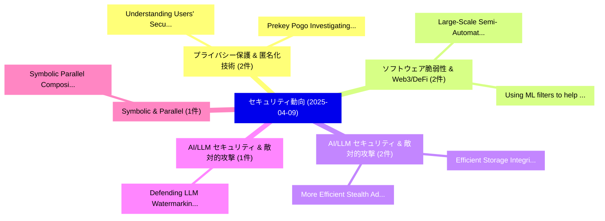

# 📅 02_daily: 日次エグゼクティブサマリー報告書 (2025-04-09)

**集計日時**: 2026-10-02 23:05:22 UTC  
**対象日付**: 2025-04-09  
**本日収集論文数**: 20 件  

---

## 💡 主要セキュリティ動向・脅威インサイト (Executive Insights)

本日の収集論文（計 20 件）において、以下の重点セキュリティ領域で活発な研究動向が確認されました：
- **プライバシー保護 & 匿名化技術** (2 件): 注目論文として 「Understanding Users' Security ...」、「Prekey Pogo: Investigating Sec...」 等が発表され、実務防御および攻撃検証の進展が見られます。
- **ソフトウェア脆弱性 & Web3/DeFi** (2 件): 注目論文として 「Large-Scale (Semi-)Automated S...」、「Using ML filters to help autom...」 等が発表され、実務防御および攻撃検証の進展が見られます。
- **AI/LLM セキュリティ & 敵対的攻撃** (2 件): 注目論文として 「More Efficient Stealth Address...」、「Efficient Storage Integrity in...」 等が発表され、実務防御および攻撃検証の進展が見られます。
- **AI/LLM セキュリティ & 敵対的攻撃** (1 件): 注目論文として 「Defending LLM Watermarking Aga...」 等が発表され、実務防御および攻撃検証の進展が見られます。
- **Symbolic & Parallel** (1 件): 注目論文として 「Symbolic Parallel Composition ...」 等が発表され、実務防御および攻撃検証の進展が見られます。

### 🗺️ 技術・脅威トピックマインドマップ

---

## 📌 日次セキュリティ論文一覧 (日本語表形式)

| No | arXiv ID | 論文タイトル (日本語訳) | 重要キーワード | 構造化エグゼクティブ要約 (背景・提案・影響) | 脅威分類 | 詳細リンク |
|---|---|---|---|---|---|---|
| 1 | `2504.06552v2` | [Understanding Users' Security and Privacy Concerns and Attitudes Conversational AI Platformsに向けて](../../okf/papers/2025-04-09/2504.06552.md) | `Understanding Users`, `Privacy Concerns`, `Attitudes Conversational` | 【提案】概要 (Overview & Key Finding) 本論文「Understanding Users' Security and Privacy Concerns and ...。実証評価により経営層・セキュリティ管理者向け推奨アクション (E... | `cs.CR` | [arXiv](https://arxiv.org/abs/2504.06552v2) &#124; [OKF](../../okf/papers/2025-04-09/2504.06552.md) |
| 2 | `2504.06575v2` | [Defending LLM Watermarking Against Spoofing Attacks with Contrastive Representation Learning（セキュリティ分析論文）](../../okf/papers/2025-04-09/2504.06575.md) | `Contrastive Representation Learning`, `Yujian Liu`, `Yepeng Liu` | 【提案】概要 (Overview & Key Finding) 本論文「Defending LLM Watermarking Against Spoofing Attacks wit...。実証評価により経営層・セキュリティ管理者向け推奨アクション (E... | `cs.CR` | [arXiv](https://arxiv.org/abs/2504.06575v2) &#124; [OKF](../../okf/papers/2025-04-09/2504.06575.md) |
| 3 | `2504.06712v2` | [Large-Scale (Semi-)Automated Security Assessment of Consumer IoT Devices -- A Roadmap（セキュリティ分析論文）](../../okf/papers/2025-04-09/2504.06712.md) | `Automated Security Assessment`, `Automated Security Ass`, `Matthias Janetschek` | 【提案】概要 (Overview & Key Finding) 本論文「Large-Scale (Semi-)Automated Security Assessment of Con...。実証評価により経営層・セキュリティ管理者向け推奨アクション (E... | `cs.CR` | [arXiv](https://arxiv.org/abs/2504.06712v2) &#124; [OKF](../../okf/papers/2025-04-09/2504.06712.md) |
| 4 | `2504.06744v1` | [More Efficient Stealth Address Protocol（セキュリティ分析論文）](../../okf/papers/2025-04-09/2504.06744.md) | `Marija Mikic`, `Mihajlo Srbakoski`, `Strahinja Praska` | 【提案】概要 (Overview & Key Finding) 本論文「More Efficient Stealth Address Protocol（セキュリティ分析論文）」（原題...。実証評価により経営層・セキュリティ管理者向け推奨アクション (E... | `cs.CR` | [arXiv](https://arxiv.org/abs/2504.06744v1) &#124; [OKF](../../okf/papers/2025-04-09/2504.06744.md) |
| 5 | `2504.06833v3` | [Symbolic Parallel Composition for Multi-language Protocol Verification（セキュリティ分析論文）](../../okf/papers/2025-04-09/2504.06833.md) | `Symbolic Parallel Composition`, `Protocol Verification`, `Multi-language Protocol` | 【提案】概要 (Overview & Key Finding) 本論文「Symbolic Parallel Composition for Multi-language Protoc...。実証評価により経営層・セキュリティ管理者向け推奨アクション (E... | `cs.CR` | [arXiv](https://arxiv.org/abs/2504.06833v3) &#124; [OKF](../../okf/papers/2025-04-09/2504.06833.md) |
| 6 | `2504.06923v4` | [The Importance of Being Discrete: Measuring the Impact of Discretization in End-to-End Differentially Private Synthetic Data（セキュリティ分析論文）](../../okf/papers/2025-04-09/2504.06923.md) | `End Differentially Private Synthetic Data`, `Meenatchi Sundaram Muthu Selva Annamalai`, `Emiliano De Cristofaro` | 【提案】概要 (Overview & Key Finding) 本論文「The Importance of Being Discrete: Measuring the Impact ...。実証評価により経営層・セキュリティ管理者向け推奨アクション (E... | `cs.CR` | [arXiv](https://arxiv.org/abs/2504.06923v4) &#124; [OKF](../../okf/papers/2025-04-09/2504.06923.md) |
| 7 | `2504.07002v2` | [DeCoMa: Detecting and Purifying Code Dataset Watermarks through Dual Channel Code Abstraction（セキュリティ分析論文）](../../okf/papers/2025-04-09/2504.07002.md) | `Purifying Code Dataset Watermarks`, `Dual Channel Code Abstraction`, `Yuan Xiao` | 【提案】概要 (Overview & Key Finding) 本論文「DeCoMa: Detecting and Purifying Code Dataset Watermarks...。実証評価により経営層・セキュリティ管理者向け推奨アクション (E... | `cs.CR` | [arXiv](https://arxiv.org/abs/2504.07002v2) &#124; [OKF](../../okf/papers/2025-04-09/2504.07002.md) |
| 8 | `2504.07015v1` | [LLM-IFT: LLM-Powered Information Flow Tracking for Secure Hardware（セキュリティ分析論文）](../../okf/papers/2025-04-09/2504.07015.md) | `Powered Information Flow Tracking`, `Secure Hardware`, `LLM-Powered Information` | 【提案】概要 (Overview & Key Finding) 本論文「LLM-IFT: LLM-Powered Information Flow Tracking for Secu...。実証評価により経営層・セキュリティ管理者向け推奨アクション (E... | `cs.CR` | [arXiv](https://arxiv.org/abs/2504.07015v1) &#124; [OKF](../../okf/papers/2025-04-09/2504.07015.md) |
| 9 | `2504.07018v1` | [ShadowBinding: Realizing Effective Microarchitectures for In-Core Secure Speculation Schemes（セキュリティ分析論文）](../../okf/papers/2025-04-09/2504.07018.md) | `Core Secure Speculation Schemes`, `Realizing Effective Microarchitectures`, `In-Core Secure` | 【提案】概要 (Overview & Key Finding) 本論文「ShadowBinding: Realizing Effective Microarchitectures f...。実証評価により経営層・セキュリティ管理者向け推奨アクション (E... | `cs.CR` | [arXiv](https://arxiv.org/abs/2504.07018v1) &#124; [OKF](../../okf/papers/2025-04-09/2504.07018.md) |
| 10 | `2504.07027v1` | [Using ML filters to help automated vulnerability repairs: when it helps and when it doesn't（セキュリティ分析論文）](../../okf/papers/2025-04-09/2504.07027.md) | `Maria Camporese`, `Fabio Massacci`, `Raw Meta` | 【提案】概要 (Overview & Key Finding) 本論文「Using ML filters to help automated 脆弱性 repairs: when it...。実証評価により経営層・セキュリティ管理者向け推奨アクション (E... | `cs.CR` | [arXiv](https://arxiv.org/abs/2504.07027v1) &#124; [OKF](../../okf/papers/2025-04-09/2504.07027.md) |
| 11 | `2504.07041v1` | [Efficient Storage Integrity in Adversarial Settings（セキュリティ分析論文）](../../okf/papers/2025-04-09/2504.07041.md) | `Efficient Storage Integrity`, `Adversarial Settings`, `Quinn Burke` | 【提案】概要 (Overview & Key Finding) 本論文「Efficient Storage Integrity in Adversarial Settings（セキュ...。実証評価により経営層・セキュリティ管理者向け推奨アクション (E... | `cs.CR` | [arXiv](https://arxiv.org/abs/2504.07041v1) &#124; [OKF](../../okf/papers/2025-04-09/2504.07041.md) |
| 12 | `2504.07048v3` | [Context Switching for Secure Multi-programming of Near-Term Quantum Computers（セキュリティ分析論文）](../../okf/papers/2025-04-09/2504.07048.md) | `Term Quantum Computers`, `Context Switching`, `Secure Multi` | 【提案】概要 (Overview & Key Finding) 本論文「Context Switching for Secure Multi-programming of Near-...。実証評価により経営層・セキュリティ管理者向け推奨アクション (E... | `cs.CR` | [arXiv](https://arxiv.org/abs/2504.07048v3) &#124; [OKF](../../okf/papers/2025-04-09/2504.07048.md) |
| 13 | `2504.07220v1` | [Leveraging Machine Learning Techniques in Intrusion Detection Systems for Internet of Things（セキュリティ分析論文）](../../okf/papers/2025-04-09/2504.07220.md) | `Leveraging Machine Learning Techniques`, `Intrusion Detection Systems`, `Nafi Kawser Wazed` | 【提案】概要 (Overview & Key Finding) 本論文「Leveraging Machine Learning Techniques in Intrusion Det...。実証評価により経営層・セキュリティ管理者向け推奨アクション (E... | `cs.CR` | [arXiv](https://arxiv.org/abs/2504.07220v1) &#124; [OKF](../../okf/papers/2025-04-09/2504.07220.md) |
| 14 | `2504.07265v1` | [ECDSA Cracking Methods（セキュリティ分析論文）](../../okf/papers/2025-04-09/2504.07265.md) | `Cracking Methods`, `Jamie Gilchrist`, `Keir Finlow` | 【提案】概要 (Overview & Key Finding) 本論文「ECDSA Cracking Methods（セキュリティ分析論文）」（原題: ECDSA Cracking ...。実証評価によりBuchanan, Jamie Gilchrist... | `cs.CR` | [arXiv](https://arxiv.org/abs/2504.07265v1) &#124; [OKF](../../okf/papers/2025-04-09/2504.07265.md) |
| 15 | `2504.07280v3` | [Conthereum: Concurrent Ethereum Optimized Transaction Scheduling for Multi-Core Execution（セキュリティ分析論文）](../../okf/papers/2025-04-09/2504.07280.md) | `Concurrent Ethereum Optimized Transaction Scheduling`, `Core Execution`, `Multi-Core Execution` | 【提案】概要 (Overview & Key Finding) 本論文「Conthereum: Concurrent Ethereum Optimized Transaction S...。実証評価により経営層・セキュリティ管理者向け推奨アクション (E... | `cs.CR` | [arXiv](https://arxiv.org/abs/2504.07280v3) &#124; [OKF](../../okf/papers/2025-04-09/2504.07280.md) |
| 16 | `2504.07287v2` | [Hybrid Privilege Escalation and Remote Code Execution Exploit Chains（セキュリティ分析論文）](../../okf/papers/2025-04-09/2504.07287.md) | `Remote Code Execution Exploit Chains`, `Hybrid Privilege Escalation`, `Simon Pietro Romano` | 【提案】概要 (Overview & Key Finding) 本論文「Hybrid 権限昇格 and リモートコード実行 エクスプロイト Chains（セキュリティ分析論文）」（原...。実証評価により経営層・セキュリティ管理者向け推奨アクション (E... | `cs.CR` | [arXiv](https://arxiv.org/abs/2504.07287v2) &#124; [OKF](../../okf/papers/2025-04-09/2504.07287.md) |
| 17 | `2504.07318v2` | [Cryptographic Strengthening of MST3 cryptosystem via Automorphism Group of Suzuki Function Fields（セキュリティ分析論文）](../../okf/papers/2025-04-09/2504.07318.md) | `Suzuki Function Fields`, `Cryptographic Strengthening`, `Automorphism Group` | 【提案】概要 (Overview & Key Finding) 本論文「Cryptographic Strengthening of MST3 cryptosystem via Au...。実証評価により経営層・セキュリティ管理者向け推奨アクション (E... | `cs.CR` | [arXiv](https://arxiv.org/abs/2504.07318v2) &#124; [OKF](../../okf/papers/2025-04-09/2504.07318.md) |
| 18 | `2504.07323v2` | [Prekey Pogo: Investigating Security and Privacy Issues in WhatsApp's Handshake Mechanism（セキュリティ分析論文）](../../okf/papers/2025-04-09/2504.07323.md) | `Prekey Pogo`, `Investigating Security`, `Privacy Issues` | 【提案】概要 (Overview & Key Finding) 本論文「Prekey Pogo: Investigating Security and Privacy Issues ...。実証評価により経営層・セキュリティ管理者向け推奨アクション (E... | `cs.CR` | [arXiv](https://arxiv.org/abs/2504.07323v2) &#124; [OKF](../../okf/papers/2025-04-09/2504.07323.md) |
| 19 | `2504.08805v1` | [Generative AI in Live Operations: Evidence of Productivity Gains in サイバーセキュリティ and Endpoint Management](../../okf/papers/2025-04-09/2504.08805.md) | `Live Operations`, `Productivity Gains`, `Endpoint Management` | 【提案】概要 (Overview & Key Finding) 本論文「Generative AI in Live Operations: Evidence of Productiv...。実証評価により経営層・セキュリティ管理者向け推奨アクション (E... | `cs.CR` | [arXiv](https://arxiv.org/abs/2504.08805v1) &#124; [OKF](../../okf/papers/2025-04-09/2504.08805.md) |
| 20 | `2504.08813v1` | [SafeMLRM: Demystifying Safety in Multi-modal Large Reasoning Models（セキュリティ分析論文）](../../okf/papers/2025-04-09/2504.08813.md) | `Large Reasoning Models`, `Demystifying Safety`, `Multi-modal Large` | 【提案】概要 (Overview & Key Finding) 本論文「SafeMLRM: Demystifying Safety in Multi-modal Large Reas...。実証評価により経営層・セキュリティ管理者向け推奨アクション (E... | `cs.CR` | [arXiv](https://arxiv.org/abs/2504.08813v1) &#124; [OKF](../../okf/papers/2025-04-09/2504.08813.md) |

