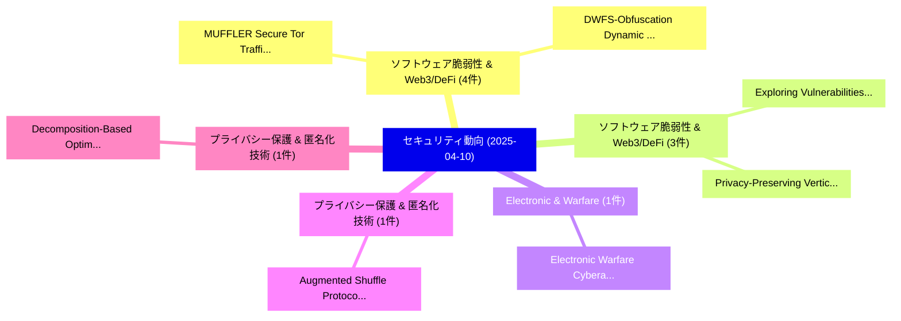

# 📅 02_daily: 日次エグゼクティブサマリー報告書 (2025-04-10)

**集計日時**: 2026-10-02 23:05:22 UTC  
**対象日付**: 2025-04-10  
**本日収集論文数**: 20 件  

---

## 💡 主要セキュリティ動向・脅威インサイト (Executive Insights)

本日の収集論文（計 20 件）において、以下の重点セキュリティ領域で活発な研究動向が確認されました：
- **ソフトウェア脆弱性 & Web3/DeFi** (4 件): 注目論文として 「MUFFLER: Secure Tor Traffic Ob...」、「DWFS-Obfuscation: Dynamic Weig...」 等が発表され、実務防御および攻撃検証の進展が見られます。
- **ソフトウェア脆弱性 & Web3/DeFi** (3 件): 注目論文として 「Exploring Vulnerabilities and ...」、「Privacy-Preserving Vertical K-...」 等が発表され、実務防御および攻撃検証の進展が見られます。
- **Electronic & Warfare** (1 件): 注目論文として 「Electronic Warfare Cyberattack...」 等が発表され、実務防御および攻撃検証の進展が見られます。
- **プライバシー保護 & 匿名化技術** (1 件): 注目論文として 「Augmented Shuffle Protocols fo...」 等が発表され、実務防御および攻撃検証の進展が見られます。
- **プライバシー保護 & 匿名化技術** (1 件): 注目論文として 「Decomposition-Based Optimal Bo...」 等が発表され、実務防御および攻撃検証の進展が見られます。

### 🗺️ 技術・脅威トピックマインドマップ

---

## 📌 日次セキュリティ論文一覧 (日本語表形式)

| No | arXiv ID | 論文タイトル (日本語訳) | 重要キーワード | 構造化エグゼクティブ要約 (背景・提案・影響) | 脅威分類 | 詳細リンク |
|---|---|---|---|---|---|---|
| 1 | `2504.07358v1` | [Electronic Warfare Cyberattacks, Countermeasures and Modern Defensive Strategies of UAV Avionics: A Survey（セキュリティ分析論文）](../../okf/papers/2025-04-10/2504.07358.md) | `Electronic Warfare Cyberattacks`, `Modern Defensive Strategies`, `Aaron Yu` | 【提案】概要 (Overview & Key Finding) 本論文「Electronic Warfare Cyberattacks, Countermeasures and Mo...。実証評価により経営層・セキュリティ管理者向け推奨アクション (E... | `cs.CR` | [arXiv](https://arxiv.org/abs/2504.07358v1) &#124; [OKF](../../okf/papers/2025-04-10/2504.07358.md) |
| 2 | `2504.07362v1` | [Augmented Shuffle Protocols for Accurate and Robust Frequency Estimation under Differential Privacy（セキュリティ分析論文）](../../okf/papers/2025-04-10/2504.07362.md) | `Augmented Shuffle Protocols`, `Robust Frequency Estimation`, `Differential Privacy` | 【提案】概要 (Overview & Key Finding) 本論文「Augmented Shuffle Protocols for Accurate and Robust Fre...。実証評価により経営層・セキュリティ管理者向け推奨アクション (E... | `cs.CR` | [arXiv](https://arxiv.org/abs/2504.07362v1) &#124; [OKF](../../okf/papers/2025-04-10/2504.07362.md) |
| 3 | `2504.07414v6` | [Decomposition-Based Optimal Bounds for Privacy Amplification via Shuffling（セキュリティ分析論文）](../../okf/papers/2025-04-10/2504.07414.md) | `Based Optimal Bounds`, `Privacy Amplification`, `Decomposition-Based Optimal` | 【提案】概要 (Overview & Key Finding) 本論文「Decomposition-Based Optimal Bounds for Privacy Amplific...。実証評価により経営層・セキュリティ管理者向け推奨アクション (E... | `cs.CR` | [arXiv](https://arxiv.org/abs/2504.07414v6) &#124; [OKF](../../okf/papers/2025-04-10/2504.07414.md) |
| 4 | `2504.07419v1` | [Exploring Vulnerabilities and Concerns in Solana Smart Contracts（セキュリティ分析論文）](../../okf/papers/2025-04-10/2504.07419.md) | `Solana Smart Contracts`, `Exploring Vulnerabilities`, `Xiangfan Wu` | 【提案】概要 (Overview & Key Finding) 本論文「Exploring Vulnerabilities and Concerns in Solana スマートコン...。実証評価により経営層・セキュリティ管理者向け推奨アクション (E... | `cs.CR` | [arXiv](https://arxiv.org/abs/2504.07419v1) &#124; [OKF](../../okf/papers/2025-04-10/2504.07419.md) |
| 5 | `2504.07457v1` | [CyberAlly: Leveraging LLMs and Knowledge Graphs to Empower Cyber Defenders（セキュリティ分析論文）](../../okf/papers/2025-04-10/2504.07457.md) | `Empower Cyber Defenders`, `Knowledge Graphs`, `Minjune Kim` | 【提案】概要 (Overview & Key Finding) 本論文「CyberAlly: Leveraging LLMs and Knowledge Graphs to Empo...。実証評価により経営層・セキュリティ管理者向け推奨アクション (E... | `cs.CR` | [arXiv](https://arxiv.org/abs/2504.07457v1) &#124; [OKF](../../okf/papers/2025-04-10/2504.07457.md) |
| 6 | `2504.07478v1` | [Intelligent DoS and DDoS Detection: A Hybrid GRU-NTM Approach to Network Security（セキュリティ分析論文）](../../okf/papers/2025-04-10/2504.07478.md) | `Network Security`, `Caroline Panggabean`, `Chandrasekar Venkatachalam` | 【提案】概要 (Overview & Key Finding) 本論文「Intelligent DoS and DDoS Detection: A Hybrid GRU-NTM Ap...。実証評価により経営層・セキュリティ管理者向け推奨アクション (E... | `cs.CR` | [arXiv](https://arxiv.org/abs/2504.07478v1) &#124; [OKF](../../okf/papers/2025-04-10/2504.07478.md) |
| 7 | `2504.07543v2` | [MUFFLER: Secure Tor Traffic Obfuscation with Dynamic Connection Shuffling and Splitting（セキュリティ分析論文）](../../okf/papers/2025-04-10/2504.07543.md) | `Secure Tor Traffic Obfuscation`, `Dynamic Connection Shuffling`, `Minjae Seo` | 【提案】概要 (Overview & Key Finding) 本論文「MUFFLER: Secure Tor Traffic Obfuscation with Dynamic Co...。実証評価により経営層・セキュリティ管理者向け推奨アクション (E... | `cs.CR` | [arXiv](https://arxiv.org/abs/2504.07543v2) &#124; [OKF](../../okf/papers/2025-04-10/2504.07543.md) |
| 8 | `2504.07574v2` | [Malware analysis assisted by AI with R2AI（セキュリティ分析論文）](../../okf/papers/2025-04-10/2504.07574.md) | `Axelle Apvrille`, `Daniel Nakov`, `Raw Meta` | 【提案】概要 (Overview & Key Finding) 本論文「マルウェア analysis assisted by AI with R2AI（セキュリティ分析論文）」（原題...。実証評価により経営層・セキュリティ管理者向け推奨アクション (E... | `cs.CR` | [arXiv](https://arxiv.org/abs/2504.07574v2) &#124; [OKF](../../okf/papers/2025-04-10/2504.07574.md) |
| 9 | `2504.07578v1` | [Privacy-Preserving Vertical K-Means Clustering（セキュリティ分析論文）](../../okf/papers/2025-04-10/2504.07578.md) | `Preserving Vertical`, `Means Clustering`, `Privacy-Preserving Vertical` | 【提案】概要 (Overview & Key Finding) 本論文「Privacy-Preserving Vertical K-Means Clustering（セキュリティ分析...。実証評価によりWilson, Maarten Everts, F... | `cs.CR` | [arXiv](https://arxiv.org/abs/2504.07578v1) &#124; [OKF](../../okf/papers/2025-04-10/2504.07578.md) |
| 10 | `2504.07590v1` | [DWFS-Obfuscation: Dynamic Weighted Feature Selection for Robust Malware Familial Classification under Obfuscation（セキュリティ分析論文）](../../okf/papers/2025-04-10/2504.07590.md) | `Dynamic Weighted Feature Selection`, `Robust Malware Familial Classification`, `Xingyuan Wei` | 【提案】概要 (Overview & Key Finding) 本論文「DWFS-Obfuscation: Dynamic Weighted Feature Selection fo...。実証評価により経営層・セキュリティ管理者向け推奨アクション (E... | `cs.CR` | [arXiv](https://arxiv.org/abs/2504.07590v1) &#124; [OKF](../../okf/papers/2025-04-10/2504.07590.md) |
| 11 | `2504.07717v3` | [PR-Attack: Coordinated Prompt-RAG Attacks on Retrieval-Augmented Generation in 大規模言語モデル via Bilevel Optimization](../../okf/papers/2025-04-10/2504.07717.md) | `Coordinated Prompt`, `Prompt-RAG Attacks`, `Augmented Generation` | 【提案】概要 (Overview & Key Finding) 本論文「PR-Attack: Coordinated Prompt-RAG Attacks on Retrieval-...。実証評価により経営層・セキュリティ管理者向け推奨アクション (E... | `cs.CR` | [arXiv](https://arxiv.org/abs/2504.07717v3) &#124; [OKF](../../okf/papers/2025-04-10/2504.07717.md) |
| 12 | `2504.07761v2` | [FakeIDet: Exploring Patches for Privacy-Preserving Fake ID Detection（セキュリティ分析論文）](../../okf/papers/2025-04-10/2504.07761.md) | `Exploring Patches`, `Preserving Fake`, `Privacy-Preserving Fake` | 【提案】概要 (Overview & Key Finding) 本論文「FakeIDet: Exploring Patches for Privacy-Preserving Fake...。実証評価により経営層・セキュリティ管理者向け推奨アクション (E... | `cs.CR` | [arXiv](https://arxiv.org/abs/2504.07761v2) &#124; [OKF](../../okf/papers/2025-04-10/2504.07761.md) |
| 13 | `2504.07766v2` | [Realigning Incentives to Build Better Software: a Holistic Approach to Vendor Accountability（セキュリティ分析論文）](../../okf/papers/2025-04-10/2504.07766.md) | `Build Better Software`, `Realigning Incentives`, `Vendor Accountability` | 【提案】概要 (Overview & Key Finding) 本論文「Realigning Incentives to Build Better Software: a Holis...。実証評価により経営層・セキュリティ管理者向け推奨アクション (E... | `cs.CR` | [arXiv](https://arxiv.org/abs/2504.07766v2) &#124; [OKF](../../okf/papers/2025-04-10/2504.07766.md) |
| 14 | `2504.07839v3` | [Deep Learning-based Intrusion Detection Systems: A Survey（セキュリティ分析論文）](../../okf/papers/2025-04-10/2504.07839.md) | `Intrusion Detection Systems`, `Deep Learning`, `Learning-based Intrusion` | 【提案】概要 (Overview & Key Finding) 本論文「Deep Learning-based Intrusion Detection Systems: A Surv...。実証評価により経営層・セキュリティ管理者向け推奨アクション (E... | `cs.CR` | [arXiv](https://arxiv.org/abs/2504.07839v3) &#124; [OKF](../../okf/papers/2025-04-10/2504.07839.md) |
| 15 | `2504.07868v1` | [SAFARI: a Scalable Air-gapped Framework for Automated Ransomware Investigation（セキュリティ分析論文）](../../okf/papers/2025-04-10/2504.07868.md) | `Automated Ransomware Investigation`, `Scalable Air`, `Tommaso Compagnucci` | 【提案】概要 (Overview & Key Finding) 本論文「SAFARI: a Scalable Air-gapped Framework for Automated ラ...。実証評価により経営層・セキュリティ管理者向け推奨アクション (E... | `cs.CR` | [arXiv](https://arxiv.org/abs/2504.07868v1) &#124; [OKF](../../okf/papers/2025-04-10/2504.07868.md) |
| 16 | `2504.07875v2` | [QubitHammer: Remotely Inducing Qubit State Change on Superconducting Quantum Computers（セキュリティ分析論文）](../../okf/papers/2025-04-10/2504.07875.md) | `Remotely Inducing Qubit State Change`, `Superconducting Quantum Computers`, `Yizhuo Tan` | 【提案】概要 (Overview & Key Finding) 本論文「QubitHammer: Remotely Inducing Qubit State Change on Su...。実証評価により経営層・セキュリティ管理者向け推奨アクション (E... | `cs.CR` | [arXiv](https://arxiv.org/abs/2504.07875v2) &#124; [OKF](../../okf/papers/2025-04-10/2504.07875.md) |
| 17 | `2504.07938v1` | [Development of a Quantum-Resistant File Transfer System with Blockchain Audit Trail（セキュリティ分析論文）](../../okf/papers/2025-04-10/2504.07938.md) | `Resistant File Transfer System`, `Blockchain Audit Trail`, `Quantum-Resistant File` | 【提案】概要 (Overview & Key Finding) 本論文「Development of a 量子-Resistant File Transfer System with...。実証評価により経営層・セキュリティ管理者向け推奨アクション (E... | `cs.CR` | [arXiv](https://arxiv.org/abs/2504.07938v1) &#124; [OKF](../../okf/papers/2025-04-10/2504.07938.md) |
| 18 | `2504.08086v1` | [Differentially Private Selection using Smooth Sensitivity（セキュリティ分析論文）](../../okf/papers/2025-04-10/2504.08086.md) | `Differentially Private Selection`, `Smooth Sensitivity`, `Iago Chaves` | 【提案】概要 (Overview & Key Finding) 本論文「Differentially Private Selection using Smooth Sensitivi...。実証評価により経営層・セキュリティ管理者向け推奨アクション (E... | `cs.CR` | [arXiv](https://arxiv.org/abs/2504.08086v1) &#124; [OKF](../../okf/papers/2025-04-10/2504.08086.md) |
| 19 | `2504.08104v1` | [Geneshift: Impact of different scenario shift on Jailbreaking LLM（セキュリティ分析論文）](../../okf/papers/2025-04-10/2504.08104.md) | `Tianyi Wu`, `Zhiwei Xue`, `Yue Liu` | 【提案】概要 (Overview & Key Finding) 本論文「Geneshift: Impact of different scenario shift on ジェイルブレ...。実証評価により経営層・セキュリティ管理者向け推奨アクション (E... | `cs.CR` | [arXiv](https://arxiv.org/abs/2504.08104v1) &#124; [OKF](../../okf/papers/2025-04-10/2504.08104.md) |
| 20 | `2504.20050v1` | [Multi-Party Private Set Operations from Predicative Zero-Sharing（セキュリティ分析論文）](../../okf/papers/2025-04-10/2504.20050.md) | `Party Private Set Operations`, `Predicative Zero`, `Multi-Party Private` | 【提案】概要 (Overview & Key Finding) 本論文「Multi-Party Private Set Operations from Predicative Zer...。実証評価により経営層・セキュリティ管理者向け推奨アクション (E... | `cs.CR` | [arXiv](https://arxiv.org/abs/2504.20050v1) &#124; [OKF](../../okf/papers/2025-04-10/2504.20050.md) |

