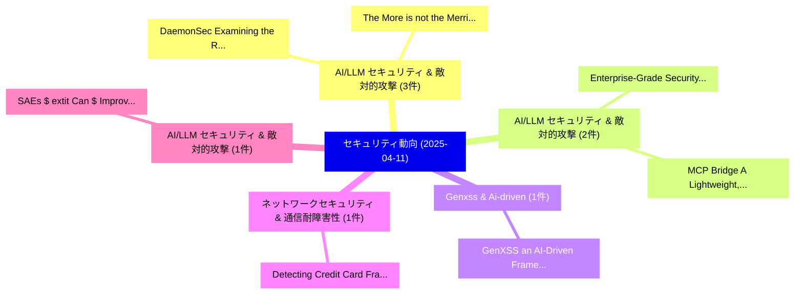

# 📅 02_daily: 日次エグゼクティブサマリー報告書 (2025-04-11)

**集計日時**: 2026-10-02 23:05:22 UTC  
**対象日付**: 2025-04-11  
**本日収集論文数**: 21 件  

---

## 💡 主要セキュリティ動向・脅威インサイト (Executive Insights)

本日の収集論文（計 21 件）において、以下の重点セキュリティ領域で活発な研究動向が確認されました：
- **AI/LLM セキュリティ & 敵対的攻撃** (3 件): 注目論文として 「The More is not the Merrier: I...」、「DaemonSec: Examining the Role ...」 等が発表され、実務防御および攻撃検証の進展が見られます。
- **AI/LLM セキュリティ & 敵対的攻撃** (2 件): 注目論文として 「Enterprise-Grade Security for ...」、「MCP Bridge: A Lightweight, LLM...」 等が発表され、実務防御および攻撃検証の進展が見られます。
- **Genxss & Ai-driven** (1 件): 注目論文として 「GenXSS: an AI-Driven Framework...」 等が発表され、実務防御および攻撃検証の進展が見られます。
- **ネットワークセキュリティ & 通信耐障害性** (1 件): 注目論文として 「Detecting Credit Card Fraud vi...」 等が発表され、実務防御および攻撃検証の進展が見られます。
- **AI/LLM セキュリティ & 敵対的攻撃** (1 件): 注目論文として 「SAEs $	extit{Can}$ Improve Unl...」 等が発表され、実務防御および攻撃検証の進展が見られます。

### 🗺️ 技術・脅威トピックマインドマップ

---

## 📌 日次セキュリティ論文一覧 (日本語表形式)

| No | arXiv ID | 論文タイトル (日本語訳) | 重要キーワード | 構造化エグゼクティブ要約 (背景・提案・影響) | 脅威分類 | 詳細リンク |
|---|---|---|---|---|---|---|
| 1 | `2504.08176v1` | [GenXSS: an AI-Driven Framework for Automated XSS Attacks in WAFsの検出](../../okf/papers/2025-04-11/2504.08176.md) | `Automated Detection`, `Vahid Babaey`, `Arun Ravindran` | 【提案】概要 (Overview & Key Finding) 本論文「GenXSS: an AI-Driven Framework for Automated XSS Attack...。実証評価により経営層・セキュリティ管理者向け推奨アクション (E... | `cs.CR` | [arXiv](https://arxiv.org/abs/2504.08176v1) &#124; [OKF](../../okf/papers/2025-04-11/2504.08176.md) |
| 2 | `2504.08183v1` | [Detecting Credit Card Fraud via Heterogeneous Graph Neural Networks with Graph Attention（セキュリティ分析論文）](../../okf/papers/2025-04-11/2504.08183.md) | `Detecting Credit Card Fraud`, `Heterogeneous Graph Neural Networks`, `Graph Attention` | 【提案】概要 (Overview & Key Finding) 本論文「Detecting Credit Card Fraud via Heterogeneous Graph Neu...。実証評価により経営層・セキュリティ管理者向け推奨アクション (E... | `cs.CR` | [arXiv](https://arxiv.org/abs/2504.08183v1) &#124; [OKF](../../okf/papers/2025-04-11/2504.08183.md) |
| 3 | `2504.08192v1` | [SAEs $	extit{Can}$ Improve Unlearning: Dynamic Sparse Autoencoder Guardrails for Precision Unlearning in LLMs（セキュリティ分析論文）](../../okf/papers/2025-04-11/2504.08192.md) | `Dynamic Sparse Autoencoder Guardrails`, `Improve Unlearning`, `Precision Unlearning` | 【提案】概要 (Overview & Key Finding) 本論文「SAEs $\textit{Can}$ Improve Unlearning: Dynamic Sparse ...。実証評価により経営層・セキュリティ管理者向け推奨アクション (E... | `cs.CR` | [arXiv](https://arxiv.org/abs/2504.08192v1) &#124; [OKF](../../okf/papers/2025-04-11/2504.08192.md) |
| 4 | `2504.08198v1` | [The More is not the Merrier: Investigating the Effect of Client Size on 連合学習](../../okf/papers/2025-04-11/2504.08198.md) | `Client Size`, `Federated Learning`, `Eleanor Wallach` | 【提案】背景とセキュリティ上の課題 (Background & Problem) 本研究はサイバー脅威環境におけるセキュリティ構造・脆弱性の検証を目的としています。(主要検出項目: ...。実証評価により経営層・セキュリティ管理者向け推奨アクション (E... | `cs.CR` | [arXiv](https://arxiv.org/abs/2504.08198v1) &#124; [OKF](../../okf/papers/2025-04-11/2504.08198.md) |
| 5 | `2504.08205v1` | [EO-VLM: VLM-Guided Energy Overload Attacks on Vision Models（セキュリティ分析論文）](../../okf/papers/2025-04-11/2504.08205.md) | `Guided Energy Overload Attacks`, `Vision Models`, `VLM-Guided Energy` | 【提案】概要 (Overview & Key Finding) 本論文「EO-VLM: VLM-Guided Energy Overload Attacks on Vision Mo...。実証評価により経営層・セキュリティ管理者向け推奨アクション (E... | `cs.CR` | [arXiv](https://arxiv.org/abs/2504.08205v1) &#124; [OKF](../../okf/papers/2025-04-11/2504.08205.md) |
| 6 | `2504.08227v2` | [DaemonSec: Examining the Role of Machine Learning for Daemon Security in Linux Environments（セキュリティ分析論文）](../../okf/papers/2025-04-11/2504.08227.md) | `Machine Learning`, `Daemon Security`, `Linux Environments` | 【提案】概要 (Overview & Key Finding) 本論文「DaemonSec: Examining the Role of Machine Learning for D...。実証評価により経営層・セキュリティ管理者向け推奨アクション (E... | `cs.CR` | [arXiv](https://arxiv.org/abs/2504.08227v2) &#124; [OKF](../../okf/papers/2025-04-11/2504.08227.md) |
| 7 | `2504.08254v2` | [Understanding the Impact of Data Domain Extraction on Synthetic Data Privacy（セキュリティ分析論文）](../../okf/papers/2025-04-11/2504.08254.md) | `Data Domain Extraction`, `Synthetic Data Privacy`, `Meenatchi Sundaram Muthu Selva Annamalai` | 【提案】概要 (Overview & Key Finding) 本論文「Understanding the Impact of Data Domain Extraction on S...。実証評価により経営層・セキュリティ管理者向け推奨アクション (E... | `cs.CR` | [arXiv](https://arxiv.org/abs/2504.08254v2) &#124; [OKF](../../okf/papers/2025-04-11/2504.08254.md) |
| 8 | `2504.08264v2` | [To See or Not to See -- Fingerprinting Devices in Adversarial Environments Amid Advanced Machine Learning（セキュリティ分析論文）](../../okf/papers/2025-04-11/2504.08264.md) | `Adversarial Environments Amid Advanced Machine Learning`, `Fingerprinting Devices`, `Adversarial Environments Amid Advanced Ma` | 【提案】背景とセキュリティ上の課題 (Background & Problem) 本研究はサイバー脅威環境におけるセキュリティ構造・脆弱性の検証を目的としています。(主要検出項目: ...。実証評価により経営層・セキュリティ管理者向け推奨アクション (E... | `cs.CR` | [arXiv](https://arxiv.org/abs/2504.08264v2) &#124; [OKF](../../okf/papers/2025-04-11/2504.08264.md) |
| 9 | `2504.08325v1` | [Practical Secure Aggregation by Combining Cryptography and Trusted Execution Environments（セキュリティ分析論文）](../../okf/papers/2025-04-11/2504.08325.md) | `Practical Secure Aggregation`, `Trusted Execution Environments`, `Combining Cryptography` | 【提案】概要 (Overview & Key Finding) 本論文「Practical Secure Aggregation by Combining 暗号技術 and Trus...。実証評価により経営層・セキュリティ管理者向け推奨アクション (E... | `cs.CR` | [arXiv](https://arxiv.org/abs/2504.08325v1) &#124; [OKF](../../okf/papers/2025-04-11/2504.08325.md) |
| 10 | `2504.08480v1` | [Toward Realistic Adversarial Attacks in IDS: A Novel Feasibility Metric for Transferability（セキュリティ分析論文）](../../okf/papers/2025-04-11/2504.08480.md) | `Toward Realistic Adversarial Attacks`, `Luigi Vincenzo Mancini`, `Sabrine Ennaji` | 【提案】概要 (Overview & Key Finding) 本論文「Toward Realistic 敵対的攻撃s in IDS: A Novel Feasibility Met...。実証評価により経営層・セキュリティ管理者向け推奨アクション (E... | `cs.CR` | [arXiv](https://arxiv.org/abs/2504.08480v1) &#124; [OKF](../../okf/papers/2025-04-11/2504.08480.md) |
| 11 | `2504.08508v1` | [An Early Experience with Confidential Computing Architecture for On-Device Model Protection（セキュリティ分析論文）](../../okf/papers/2025-04-11/2504.08508.md) | `Confidential Computing Architecture`, `Device Model Protection`, `On-Device Model` | 【提案】概要 (Overview & Key Finding) 本論文「An Early Experience with Confidential Computing Archite...。実証評価により経営層・セキュリティ管理者向け推奨アクション (E... | `cs.CR` | [arXiv](https://arxiv.org/abs/2504.08508v1) &#124; [OKF](../../okf/papers/2025-04-11/2504.08508.md) |
| 12 | `2504.08618v1` | [A Hybrid Chaos-Based Cryptographic Framework for Post-Quantum Secure Communications（セキュリティ分析論文）](../../okf/papers/2025-04-11/2504.08618.md) | `Quantum Secure Communications`, `Hybrid Chaos`, `Chaos-Based Cryptographic` | 【提案】概要 (Overview & Key Finding) 本論文「A Hybrid Chaos-Based Cryptographic Framework for Post-量...。実証評価により経営層・セキュリティ管理者向け推奨アクション (E... | `cs.CR` | [arXiv](https://arxiv.org/abs/2504.08618v1) &#124; [OKF](../../okf/papers/2025-04-11/2504.08618.md) |
| 13 | `2504.08623v2` | [Enterprise-Grade Security for the Model Context Protocol (MCP): Frameworks and Mitigation Strategies（セキュリティ分析論文）](../../okf/papers/2025-04-11/2504.08623.md) | `Model Context Protocol`, `Grade Security`, `Mitigation Strategies` | 【提案】概要 (Overview & Key Finding) 本論文「Enterprise-Grade Security for the Model Context Protoco...。実証評価により経営層・セキュリティ管理者向け推奨アクション (E... | `cs.CR` | [arXiv](https://arxiv.org/abs/2504.08623v2) &#124; [OKF](../../okf/papers/2025-04-11/2504.08623.md) |
| 14 | `2504.08848v1` | [X-Guard: Multilingual Guard Agent for Content Moderation（セキュリティ分析論文）](../../okf/papers/2025-04-11/2504.08848.md) | `Multilingual Guard Agent`, `Content Moderation`, `Bibek Upadhayay` | 【提案】概要 (Overview & Key Finding) 本論文「X-Guard: Multilingual Guard Agent for Content Moderatio...。実証評価によりD - **公開日時**: `2025-04-11... | `cs.CR` | [arXiv](https://arxiv.org/abs/2504.08848v1) &#124; [OKF](../../okf/papers/2025-04-11/2504.08848.md) |
| 15 | `2504.08854v3` | [大規模言語モデル and Attention-Based AI for Hardware Design and Security: Progress, Challenges, and Opportunities](../../okf/papers/2025-04-11/2504.08854.md) | `Hardware Design`, `Attention-Based AI`, `Large Language Models` | 【提案】概要 (Overview & Key Finding) 本論文「大規模言語モデル and Attention-Based AI for Hardware Design and...。実証評価により経営層・セキュリティ管理者向け推奨アクション (E... | `cs.CR` | [arXiv](https://arxiv.org/abs/2504.08854v3) &#124; [OKF](../../okf/papers/2025-04-11/2504.08854.md) |
| 16 | `2504.08871v1` | [An LLM Framework For Cryptography Over Chat Channels（セキュリティ分析論文）](../../okf/papers/2025-04-11/2504.08871.md) | `Sonu Kumar Jha`, `Danilo Gligoroski`, `Mayank Raikwar` | 【提案】概要 (Overview & Key Finding) 本論文「An LLM Framework For 暗号技術 Over Chat Channels（セキュリティ分析論文...。実証評価により経営層・セキュリティ管理者向け推奨アクション (E... | `cs.CR` | [arXiv](https://arxiv.org/abs/2504.08871v1) &#124; [OKF](../../okf/papers/2025-04-11/2504.08871.md) |
| 17 | `2504.08897v2` | [On the Adversarial Robustness of Spiking Neural Networks Trained by Local Learning（セキュリティ分析論文）](../../okf/papers/2025-04-11/2504.08897.md) | `Spiking Neural Networks Trained`, `Adversarial Robustness`, `Local Learning` | 【提案】概要 (Overview & Key Finding) 本論文「On the Adversarial Robustness of Spiking Neural Network...。実証評価により経営層・セキュリティ管理者向け推奨アクション (E... | `cs.CR` | [arXiv](https://arxiv.org/abs/2504.08897v2) &#124; [OKF](../../okf/papers/2025-04-11/2504.08897.md) |
| 18 | `2504.08951v2` | [Exploring the Effects of Load Altering Attacks on Load Frequency Control through Python and RTDS（セキュリティ分析論文）](../../okf/papers/2025-04-11/2504.08951.md) | `Load Altering Attacks`, `Load Frequency Control`, `Alkistis Kontou` | 【提案】概要 (Overview & Key Finding) 本論文「Exploring the Effects of Load Altering Attacks on Load ...。実証評価により経営層・セキュリティ管理者向け推奨アクション (E... | `cs.CR` | [arXiv](https://arxiv.org/abs/2504.08951v2) &#124; [OKF](../../okf/papers/2025-04-11/2504.08951.md) |
| 19 | `2504.08967v1` | [RAG-Based Fuzzing of Cross-Architecture Compilers（セキュリティ分析論文）](../../okf/papers/2025-04-11/2504.08967.md) | `Based Fuzzing`, `Architecture Compilers`, `RAG-Based Fuzzing` | 【提案】概要 (Overview & Key Finding) 本論文「RAG-Based Fuzzing of Cross-Architecture Compilers（セキュリテ...。実証評価によりFung - **公開日時**: `2025-04... | `cs.CR` | [arXiv](https://arxiv.org/abs/2504.08967v1) &#124; [OKF](../../okf/papers/2025-04-11/2504.08967.md) |
| 20 | `2504.08977v1` | [Robust Steganography from 大規模言語モデル](../../okf/papers/2025-04-11/2504.08977.md) | `Robust Steganography`, `Large Language Models`, `Neil Perry` | 【提案】概要 (Overview & Key Finding) 本論文「Robust Steganography from 大規模言語モデル」（原題: Robust Steganog...。実証評価により経営層・セキュリティ管理者向け推奨アクション (E... | `cs.CR` | [arXiv](https://arxiv.org/abs/2504.08977v1) &#124; [OKF](../../okf/papers/2025-04-11/2504.08977.md) |
| 21 | `2504.08999v3` | [MCP Bridge: A Lightweight, LLM-Agnostic RESTful Proxy for Model Context Protocol Servers（セキュリティ分析論文）](../../okf/papers/2025-04-11/2504.08999.md) | `Model Context Protocol Servers`, `LLM-Agnostic RESTful`, `Arash Ahmadi` | 【提案】概要 (Overview & Key Finding) 本論文「MCP Bridge: A Lightweight, LLM-Agnostic RESTful Proxy f...。実証評価により経営層・セキュリティ管理者向け推奨アクション (E... | `cs.CR` | [arXiv](https://arxiv.org/abs/2504.08999v3) &#124; [OKF](../../okf/papers/2025-04-11/2504.08999.md) |

