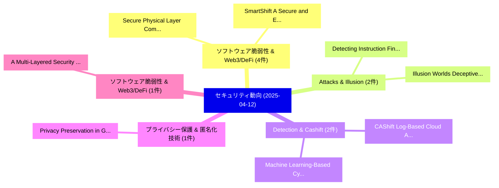

# 📅 02_daily: 日次エグゼクティブサマリー報告書 (2025-04-12)

**集計日時**: 2026-10-02 23:05:22 UTC  
**対象日付**: 2025-04-12  
**本日収集論文数**: 11 件  

---

## 💡 主要セキュリティ動向・脅威インサイト (Executive Insights)

本日の収集論文（計 11 件）において、以下の重点セキュリティ領域で活発な研究動向が確認されました：
- **ソフトウェア脆弱性 & Web3/DeFi** (4 件): 注目論文として 「Secure Physical Layer Communic...」、「SmartShift: A Secure and Effic...」 等が発表され、実務防御および攻撃検証の進展が見られます。
- **Attacks & Illusion** (2 件): 注目論文として 「Detecting Instruction Fine-tun...」、「Illusion Worlds: Deceptive UI ...」 等が発表され、実務防御および攻撃検証の進展が見られます。
- **Detection & Cashift** (2 件): 注目論文として 「CAShift: Log-Based Cloud Attac...」、「Machine Learning-Based Cyberat...」 等が発表され、実務防御および攻撃検証の進展が見られます。
- **プライバシー保護 & 匿名化技術** (1 件): 注目論文として 「Privacy Preservation in Gen AI...」 等が発表され、実務防御および攻撃検証の進展が見られます。
- **ソフトウェア脆弱性 & Web3/DeFi** (1 件): 注目論文として 「A Multi-Layered Security Block...」 等が発表され、実務防御および攻撃検証の進展が見られます。

### 🗺️ 技術・脅威トピックマインドマップ

---

## 📌 日次セキュリティ論文一覧 (日本語表形式)

| No | arXiv ID | 論文タイトル (日本語訳) | 重要キーワード | 構造化エグゼクティブ要約 (背景・提案・影響) | 脅威分類 | 詳細リンク |
|---|---|---|---|---|---|---|
| 1 | `2504.09026v3` | [Detecting Instruction Fine-tuning Attacks using Influence Function（セキュリティ分析論文）](../../okf/papers/2025-04-12/2504.09026.md) | `Detecting Instruction Fine`, `Influence Function`, `Fine-tuning Attacks` | 【提案】概要 (Overview & Key Finding) 本論文「Detecting Instruction Fine-tuning Attacks using Influen...。実証評価により経営層・セキュリティ管理者向け推奨アクション (E... | `cs.CR` | [arXiv](https://arxiv.org/abs/2504.09026v3) &#124; [OKF](../../okf/papers/2025-04-12/2504.09026.md) |
| 2 | `2504.09095v1` | [Privacy Preservation in Gen AI Applications（セキュリティ分析論文）](../../okf/papers/2025-04-12/2504.09095.md) | `Privacy Preservation`, `Ram Sundhar`, `Raw Meta` | 【提案】概要 (Overview & Key Finding) 本論文「Privacy Preservation in Gen AI Applications（セキュリティ分析論文）...。実証評価により経営層・セキュリティ管理者向け推奨アクション (E... | `cs.CR` | [arXiv](https://arxiv.org/abs/2504.09095v1) &#124; [OKF](../../okf/papers/2025-04-12/2504.09095.md) |
| 3 | `2504.09115v4` | [CAShift: Log-Based Cloud Attack Detection under Normality Shiftのベンチマーク評価](../../okf/papers/2025-04-12/2504.09115.md) | `Based Cloud Attack Detection`, `Log-Based Cloud`, `Benchmarking Log` | 【提案】概要 (Overview & Key Finding) 本論文「CAShift: Log-Based Cloud Attack Detection under Normali...。実証評価により経営層・セキュリティ管理者向け推奨アクション (E... | `cs.CR` | [arXiv](https://arxiv.org/abs/2504.09115v4) &#124; [OKF](../../okf/papers/2025-04-12/2504.09115.md) |
| 4 | `2504.09153v1` | [Secure Physical Layer Communications for Low-Altitude Economy Networking: A Survey（セキュリティ分析論文）](../../okf/papers/2025-04-12/2504.09153.md) | `Secure Physical Layer Communications`, `Altitude Economy Networking`, `Low-Altitude Economy` | 【提案】概要 (Overview & Key Finding) 本論文「Secure Physical Layer Communications for Low-Altitude E...。実証評価により経営層・セキュリティ管理者向け推奨アクション (E... | `cs.CR` | [arXiv](https://arxiv.org/abs/2504.09153v1) &#124; [OKF](../../okf/papers/2025-04-12/2504.09153.md) |
| 5 | `2504.09181v1` | [A Multi-Layered Security Blockchain Systems: From Attack Vectors to Defense and System Hardeningの分析](../../okf/papers/2025-04-12/2504.09181.md) | `Multi-Layered Security`, `Layered Security Blockchain Systems`, `Blockchain Systems` | 【提案】概要 (Overview & Key Finding) 本論文「A Multi-Layered Security Blockchain Systems: From Attac...。実証評価により経営層・セキュリティ管理者向け推奨アクション (E... | `cs.CR` | [arXiv](https://arxiv.org/abs/2504.09181v1) &#124; [OKF](../../okf/papers/2025-04-12/2504.09181.md) |
| 6 | `2504.09199v1` | [Illusion Worlds: Deceptive UI Attacks in Social VR（セキュリティ分析論文）](../../okf/papers/2025-04-12/2504.09199.md) | `Illusion Worlds`, `Junhee Lee`, `Hwanjo Heo` | 【提案】概要 (Overview & Key Finding) 本論文「Illusion Worlds: Deceptive UI Attacks in Social VR（セキュリ...。実証評価により経営層・セキュリティ管理者向け推奨アクション (E... | `cs.CR` | [arXiv](https://arxiv.org/abs/2504.09199v1) &#124; [OKF](../../okf/papers/2025-04-12/2504.09199.md) |
| 7 | `2504.09248v1` | [Asymptotic stabilization under homomorphic encryption: A re-encryption free method（セキュリティ分析論文）](../../okf/papers/2025-04-12/2504.09248.md) | `re-encryption free`, `Shuai Feng`, `Qian Ma` | 【提案】概要 (Overview & Key Finding) 本論文「Asymptotic stabilization under 準同型暗号: A re-encryption f...。実証評価により経営層・セキュリティ管理者向け推奨アクション (E... | `cs.CR` | [arXiv](https://arxiv.org/abs/2504.09248v1) &#124; [OKF](../../okf/papers/2025-04-12/2504.09248.md) |
| 8 | `2504.09315v2` | [SmartShift: A Secure and Efficient Approach to Smart Contract Migration（セキュリティ分析論文）](../../okf/papers/2025-04-12/2504.09315.md) | `Smart Contract Migration`, `Faisal Haque Bappy`, `Tarannum Shaila Zaman` | 【提案】概要 (Overview & Key Finding) 本論文「SmartShift: A Secure and Efficient Approach to スマートコントラ...。実証評価により経営層・セキュリティ管理者向け推奨アクション (E... | `cs.CR` | [arXiv](https://arxiv.org/abs/2504.09315v2) &#124; [OKF](../../okf/papers/2025-04-12/2504.09315.md) |
| 9 | `2504.09319v1` | [CrossLink: A Decentralized Framework for Secure Cross-Chain Smart Contract Execution（セキュリティ分析論文）](../../okf/papers/2025-04-12/2504.09319.md) | `Chain Smart Contract Execution`, `Secure Cross`, `Cross-Chain Smart` | 【提案】概要 (Overview & Key Finding) 本論文「CrossLink: A Decentralized Framework for Secure Cross-C...。実証評価により経営層・セキュリティ管理者向け推奨アクション (E... | `cs.CR` | [arXiv](https://arxiv.org/abs/2504.09319v1) &#124; [OKF](../../okf/papers/2025-04-12/2504.09319.md) |
| 10 | `2504.09335v1` | [Efficient Implementation of Reinforcement Learning over Homomorphic Encryption（セキュリティ分析論文）](../../okf/papers/2025-04-12/2504.09335.md) | `Efficient Implementation`, `Reinforcement Learning`, `Homomorphic Encryption` | 【提案】概要 (Overview & Key Finding) 本論文「Efficient Implementation of Reinforcement Learning over...。実証評価により経営層・セキュリティ管理者向け推奨アクション (E... | `cs.CR` | [arXiv](https://arxiv.org/abs/2504.09335v1) &#124; [OKF](../../okf/papers/2025-04-12/2504.09335.md) |
| 11 | `2504.09363v1` | [Machine Learning-Based Cyberattack Detection and Identification for Automatic Generation Control Systems Considering Nonlinearities（セキュリティ分析論文）](../../okf/papers/2025-04-12/2504.09363.md) | `Automatic Generation Control Systems Considering Nonlinearities`, `Based Cyberattack Detection`, `Machine Learning` | 【提案】概要 (Overview & Key Finding) 本論文「Machine Learning-Based Cyberattack Detection and Identi...。実証評価により経営層・セキュリティ管理者向け推奨アクション (E... | `cs.CR` | [arXiv](https://arxiv.org/abs/2504.09363v1) &#124; [OKF](../../okf/papers/2025-04-12/2504.09363.md) |

