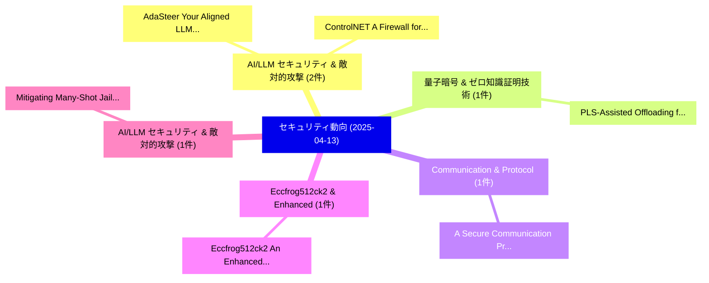

# 📅 02_daily: 日次エグゼクティブサマリー報告書 (2025-04-13)

**集計日時**: 2026-10-02 23:05:22 UTC  
**対象日付**: 2025-04-13  
**本日収集論文数**: 10 件  

---

## 💡 主要セキュリティ動向・脅威インサイト (Executive Insights)

本日の収集論文（計 10 件）において、以下の重点セキュリティ領域で活発な研究動向が確認されました：
- **AI/LLM セキュリティ & 敵対的攻撃** (2 件): 注目論文として 「AdaSteer: Your Aligned LLM is ...」、「ControlNET: A Firewall for RAG...」 等が発表され、実務防御および攻撃検証の進展が見られます。
- **量子暗号 & ゼロ知識証明技術** (1 件): 注目論文として 「PLS-Assisted Offloading for Ed...」 等が発表され、実務防御および攻撃検証の進展が見られます。
- **Communication & Protocol** (1 件): 注目論文として 「A Secure Communication Protoco...」 等が発表され、実務防御および攻撃検証の進展が見られます。
- **Eccfrog512ck2 & Enhanced** (1 件): 注目論文として 「Eccfrog512ck2: An Enhanced 512...」 等が発表され、実務防御および攻撃検証の進展が見られます。
- **AI/LLM セキュリティ & 敵対的攻撃** (1 件): 注目論文として 「Mitigating Many-Shot Jailbreak...」 等が発表され、実務防御および攻撃検証の進展が見られます。

### 🗺️ 技術・脅威トピックマインドマップ

---

## 📌 日次セキュリティ論文一覧 (日本語表形式)

| No | arXiv ID | 論文タイトル (日本語訳) | 重要キーワード | 構造化エグゼクティブ要約 (背景・提案・影響) | 脅威分類 | 詳細リンク |
|---|---|---|---|---|---|---|
| 1 | `2504.09437v1` | [PLS-Assisted Offloading for Edge Computing-Enabled Post-Quantum Security in Resource-Constrained Devices（セキュリティ分析論文）](../../okf/papers/2025-04-13/2504.09437.md) | `Assisted Offloading`, `Edge Computing`, `Enabled Post` | 【提案】概要 (Overview & Key Finding) 本論文「PLS-Assisted Offloading for Edge Computing-Enabled Post...。実証評価により経営層・セキュリティ管理者向け推奨アクション (E... | `cs.CR` | [arXiv](https://arxiv.org/abs/2504.09437v1) &#124; [OKF](../../okf/papers/2025-04-13/2504.09437.md) |
| 2 | `2504.09466v2` | [AdaSteer: Your Aligned LLM is Inherently an Adaptive Jailbreak Defender（セキュリティ分析論文）](../../okf/papers/2025-04-13/2504.09466.md) | `Adaptive Jailbreak Defender`, `Weixiang Zhao`, `Jiahe Guo` | 【提案】概要 (Overview & Key Finding) 本論文「AdaSteer: Your Aligned LLM is Inherently an Adaptive ジェ...。実証評価により経営層・セキュリティ管理者向け推奨アクション (E... | `cs.CR` | [arXiv](https://arxiv.org/abs/2504.09466v2) &#124; [OKF](../../okf/papers/2025-04-13/2504.09466.md) |
| 3 | `2504.09527v1` | [A Secure Communication Protocol for Remote Keyless Entry System with Adaptive Adjustment of Transmission Parameters（セキュリティ分析論文）](../../okf/papers/2025-04-13/2504.09527.md) | `Remote Keyless Entry System`, `Secure Communication Protocol`, `Adaptive Adjustment` | 【提案】概要 (Overview & Key Finding) 本論文「A Secure Communication Protocol for Remote Keyless Entr...。実証評価により経営層・セキュリティ管理者向け推奨アクション (E... | `cs.CR` | [arXiv](https://arxiv.org/abs/2504.09527v1) &#124; [OKF](../../okf/papers/2025-04-13/2504.09527.md) |
| 4 | `2504.09584v3` | [Eccfrog512ck2: An Enhanced 512-bit Weierstrass Elliptic Curve（セキュリティ分析論文）](../../okf/papers/2025-04-13/2504.09584.md) | `Weierstrass Elliptic Curve`, `512-bit Weierstrass`, `Duarte Melo` | 【提案】概要 (Overview & Key Finding) 本論文「Eccfrog512ck2: An Enhanced 512-bit Weierstrass Elliptic...。実証評価によりBuchanan - **公開日時**: `202... | `cs.CR` | [arXiv](https://arxiv.org/abs/2504.09584v3) &#124; [OKF](../../okf/papers/2025-04-13/2504.09584.md) |
| 5 | `2504.09593v2` | [ControlNET: A Firewall for RAG-based LLM System（セキュリティ分析論文）](../../okf/papers/2025-04-13/2504.09593.md) | `RAG-based LLM`, `Hongwei Yao`, `Haoran Shi` | 【提案】概要 (Overview & Key Finding) 本論文「ControlNET: A Firewall for RAG-based LLM System（セキュリティ分...。実証評価により経営層・セキュリティ管理者向け推奨アクション (E... | `cs.CR` | [arXiv](https://arxiv.org/abs/2504.09593v2) &#124; [OKF](../../okf/papers/2025-04-13/2504.09593.md) |
| 6 | `2504.09604v3` | [Mitigating Many-Shot Jailbreaking（セキュリティ分析論文）](../../okf/papers/2025-04-13/2504.09604.md) | `Mitigating Many`, `Shot Jailbreaking`, `Many-Shot Jailbreaking` | 【提案】概要 (Overview & Key Finding) 本論文「Mitigating Many-Shot ジェイルブレイクing（セキュリティ分析論文）」（原題: Mitig...。実証評価によりAckerman, Nina Panicksser... | `cs.CR` | [arXiv](https://arxiv.org/abs/2504.09604v3) &#124; [OKF](../../okf/papers/2025-04-13/2504.09604.md) |
| 7 | `2504.09652v1` | [Bridging Immutability with Flexibility: A Scheme for Secure and Efficient Smart Contract Upgrades（セキュリティ分析論文）](../../okf/papers/2025-04-13/2504.09652.md) | `Efficient Smart Contract Upgrades`, `Bridging Immutability`, `Faisal Haque Bappy` | 【提案】概要 (Overview & Key Finding) 本論文「Bridging Immutability with Flexibility: A Scheme for Se...。実証評価により経営層・セキュリティ管理者向け推奨アクション (E... | `cs.CR` | [arXiv](https://arxiv.org/abs/2504.09652v1) &#124; [OKF](../../okf/papers/2025-04-13/2504.09652.md) |
| 8 | `2504.09712v2` | [The Structural Safety Generalization Problem（セキュリティ分析論文）](../../okf/papers/2025-04-13/2504.09712.md) | `Julius Broomfield`, `Tom Gibbs`, `Ethan Kosak` | 【提案】概要 (Overview & Key Finding) 本論文「The Structural Safety Generalization Problem（セキュリティ分析論文...。実証評価により経営層・セキュリティ管理者向け推奨アクション (E... | `cs.CR` | [arXiv](https://arxiv.org/abs/2504.09712v2) &#124; [OKF](../../okf/papers/2025-04-13/2504.09712.md) |
| 9 | `2504.09757v1` | [Alleviating the Fear of Losing Alignment in LLM Fine-tuning（セキュリティ分析論文）](../../okf/papers/2025-04-13/2504.09757.md) | `Losing Alignment`, `Kang Yang`, `Guanhong Tao` | 【提案】概要 (Overview & Key Finding) 本論文「Alleviating the Fear of Losing Alignment in LLM Fine-tu...。実証評価により経営層・セキュリティ管理者向け推奨アクション (E... | `cs.CR` | [arXiv](https://arxiv.org/abs/2504.09757v1) &#124; [OKF](../../okf/papers/2025-04-13/2504.09757.md) |
| 10 | `2504.13192v2` | [CheatAgent: Attacking LLM-Empowered Recommender Systems via LLM Agent（セキュリティ分析論文）](../../okf/papers/2025-04-13/2504.13192.md) | `Empowered Recommender Systems`, `LLM-Empowered Recommender`, `Shijie Wang` | 【提案】概要 (Overview & Key Finding) 本論文「CheatAgent: Attacking LLM-Empowered Recommender Systems...。実証評価により経営層・セキュリティ管理者向け推奨アクション (E... | `cs.CR` | [arXiv](https://arxiv.org/abs/2504.13192v2) &#124; [OKF](../../okf/papers/2025-04-13/2504.13192.md) |

