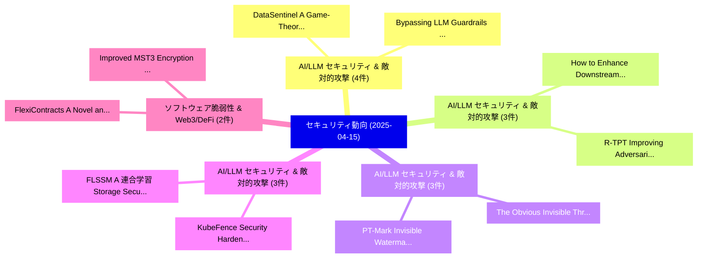

# 📅 02_daily: 日次エグゼクティブサマリー報告書 (2025-04-15)

**集計日時**: 2026-10-02 23:05:22 UTC  
**対象日付**: 2025-04-15  
**本日収集論文数**: 26 件  

---

## 💡 主要セキュリティ動向・脅威インサイト (Executive Insights)

本日の収集論文（計 26 件）において、以下の重点セキュリティ領域で活発な研究動向が確認されました：
- **AI/LLM セキュリティ & 敵対的攻撃** (4 件): 注目論文として 「Bypassing LLM Guardrails: An E...」、「DataSentinel: A Game-Theoretic...」 等が発表され、実務防御および攻撃検証の進展が見られます。
- **AI/LLM セキュリティ & 敵対的攻撃** (3 件): 注目論文として 「How to Enhance Downstream Adve...」、「R-TPT: Improving Adversarial R...」 等が発表され、実務防御および攻撃検証の進展が見られます。
- **AI/LLM セキュリティ & 敵対的攻撃** (3 件): 注目論文として 「PT-Mark: Invisible Watermarkin...」、「The Obvious Invisible Threat: ...」 等が発表され、実務防御および攻撃検証の進展が見られます。
- **AI/LLM セキュリティ & 敵対的攻撃** (3 件): 注目論文として 「FLSSM: A 連合学習 Storage Security...」、「KubeFence: Security Hardening ...」 等が発表され、実務防御および攻撃検証の進展が見られます。
- **ソフトウェア脆弱性 & Web3/DeFi** (2 件): 注目論文として 「FlexiContracts: A Novel and Ef...」、「Improved MST3 Encryption schem...」 等が発表され、実務防御および攻撃検証の進展が見られます。

### 🗺️ 技術・脅威トピックマインドマップ

---

## 📌 日次セキュリティ論文一覧 (日本語表形式)

| No | arXiv ID | 論文タイトル (日本語訳) | 重要キーワード | 構造化エグゼクティブ要約 (背景・提案・影響) | 脅威分類 | 詳細リンク |
|---|---|---|---|---|---|---|
| 1 | `2504.10811v1` | [FlexiContracts: A Novel and Efficient Scheme for Upgrading Smart Contracts in Ethereum Blockchain（セキュリティ分析論文）](../../okf/papers/2025-04-15/2504.10811.md) | `Upgrading Smart Contracts`, `Efficient Scheme`, `Ethereum Blockchain` | 【提案】概要 (Overview & Key Finding) 本論文「FlexiContracts: A Novel and Efficient Scheme for Upgrad...。実証評価により経営層・セキュリティ管理者向け推奨アクション (E... | `cs.CR` | [arXiv](https://arxiv.org/abs/2504.10811v1) &#124; [OKF](../../okf/papers/2025-04-15/2504.10811.md) |
| 2 | `2504.10850v1` | [How to Enhance Downstream Adversarial Robustness (almost) without Touching the Pre-Trained Foundation Model?（セキュリティ分析論文）](../../okf/papers/2025-04-15/2504.10850.md) | `Enhance Downstream Adversarial Robustness`, `Trained Foundation Model`, `Pre-Trained Foundation` | 【提案】/ arXiv: 2504.10850v1）は、cs.LG 分野における最新セキュリティ研究成果を取り扱っています。  **概要**: 本研究はサイバー脅威環境におけるセキュ...。実証評価により経営層・セキュリティ管理者向け推奨アクション (E... | `cs.CR` | [arXiv](https://arxiv.org/abs/2504.10850v1) &#124; [OKF](../../okf/papers/2025-04-15/2504.10850.md) |
| 3 | `2504.10853v2` | [PT-Mark: Invisible Watermarking for Text-to-image Diffusion Models via Semantic-aware Pivotal Tuning（セキュリティ分析論文）](../../okf/papers/2025-04-15/2504.10853.md) | `Invisible Watermarking`, `Diffusion Models`, `Pivotal Tuning` | 【提案】概要 (Overview & Key Finding) 本論文「PT-Mark: Invisible Watermarking for Text-to-image Diffu...。実証評価により経営層・セキュリティ管理者向け推奨アクション (E... | `cs.CR` | [arXiv](https://arxiv.org/abs/2504.10853v2) &#124; [OKF](../../okf/papers/2025-04-15/2504.10853.md) |
| 4 | `2504.10944v1` | [Cartesian Merkle Tree（セキュリティ分析論文）](../../okf/papers/2025-04-15/2504.10944.md) | `Cartesian Merkle Tree`, `Artem Chystiakov`, `Oleh Komendant` | 【提案】概要 (Overview & Key Finding) 本論文「Cartesian Merkle Tree（セキュリティ分析論文）」（原題: Cartesian Merkle...。実証評価により経営層・セキュリティ管理者向け推奨アクション (E... | `cs.CR` | [arXiv](https://arxiv.org/abs/2504.10944v1) &#124; [OKF](../../okf/papers/2025-04-15/2504.10944.md) |
| 5 | `2504.10947v1` | [Improved MST3 Encryption scheme based on small Ree groups（セキュリティ分析論文）](../../okf/papers/2025-04-15/2504.10947.md) | `Gennady Khalimov`, `Yevgen Kotukh`, `Raw Meta` | 【提案】概要 (Overview & Key Finding) 本論文「Improved MST3 Encryption scheme based on small Ree grou...。実証評価により経営層・セキュリティ管理者向け推奨アクション (E... | `cs.CR` | [arXiv](https://arxiv.org/abs/2504.10947v1) &#124; [OKF](../../okf/papers/2025-04-15/2504.10947.md) |
| 6 | `2504.10987v1` | [Leveraging Vertical Public-Private Split for Improved Synthetic Data Generation（セキュリティ分析論文）](../../okf/papers/2025-04-15/2504.10987.md) | `Improved Synthetic Data Generation`, `Leveraging Vertical Public`, `Private Split` | 【提案】概要 (Overview & Key Finding) 本論文「Leveraging Vertical Public-Private Split for Improved S...。実証評価により経営層・セキュリティ管理者向け推奨アクション (E... | `cs.CR` | [arXiv](https://arxiv.org/abs/2504.10987v1) &#124; [OKF](../../okf/papers/2025-04-15/2504.10987.md) |
| 7 | `2504.11088v1` | [FLSSM: A 連合学習 Storage Security Model with Homomorphic Encryption](../../okf/papers/2025-04-15/2504.11088.md) | `Homomorphic Encryption`, `Federated Learning Storage Security Model`, `Storage Security Model` | 【提案】概要 (Overview & Key Finding) 本論文「FLSSM: A 連合学習 Storage Security Model with 準同型暗号」（原題: FL...。実証評価により経営層・セキュリティ管理者向け推奨アクション (E... | `cs.CR` | [arXiv](https://arxiv.org/abs/2504.11088v1) &#124; [OKF](../../okf/papers/2025-04-15/2504.11088.md) |
| 8 | `2504.11106v2` | [Token-Level Constraint Boundary Search for Jailbreaking Text-to-Image Models（セキュリティ分析論文）](../../okf/papers/2025-04-15/2504.11106.md) | `Level Constraint Boundary Search`, `Jailbreaking Text`, `Image Models` | 【提案】概要 (Overview & Key Finding) 本論文「Token-Level Constraint Boundary Search for ジェイルブレイクing ...。実証評価により経営層・セキュリティ管理者向け推奨アクション (E... | `cs.CR` | [arXiv](https://arxiv.org/abs/2504.11106v2) &#124; [OKF](../../okf/papers/2025-04-15/2504.11106.md) |
| 9 | `2504.11124v1` | [A Unified Hardware Accelerator for Fast Fourier Transform and Number Theoretic Transform（セキュリティ分析論文）](../../okf/papers/2025-04-15/2504.11124.md) | `Unified Hardware Accelerator`, `Fast Fourier Transform`, `Number Theoretic Transform` | 【提案】概要 (Overview & Key Finding) 本論文「A Unified Hardware Accelerator for Fast Fourier Transfo...。実証評価により経営層・セキュリティ管理者向け推奨アクション (E... | `cs.CR` | [arXiv](https://arxiv.org/abs/2504.11124v1) &#124; [OKF](../../okf/papers/2025-04-15/2504.11124.md) |
| 10 | `2504.11126v1` | [KubeFence: Security Hardening of the Kubernetes Attack Surface（セキュリティ分析論文）](../../okf/papers/2025-04-15/2504.11126.md) | `Kubernetes Attack Surface`, `Security Hardening`, `Carmine Cesarano` | 【提案】概要 (Overview & Key Finding) 本論文「KubeFence: Security Hardening of the Kubernetes Attack ...。実証評価により経営層・セキュリティ管理者向け推奨アクション (E... | `cs.CR` | [arXiv](https://arxiv.org/abs/2504.11126v1) &#124; [OKF](../../okf/papers/2025-04-15/2504.11126.md) |
| 11 | `2504.11168v3` | [Bypassing LLM Guardrails: An Empirical Evasion Attacks against Prompt Injection and Jailbreak Detection Systemsの分析](../../okf/papers/2025-04-15/2504.11168.md) | `Prompt Injection`, `Jailbreak Detection Systems`, `Evasion Attacks` | 【提案】概要 (Overview & Key Finding) 本論文「Bypassing LLM Guardrails: An Empirical Evasion Attacks ...。実証評価により経営層・セキュリティ管理者向け推奨アクション (E... | `cs.CR` | [arXiv](https://arxiv.org/abs/2504.11168v3) &#124; [OKF](../../okf/papers/2025-04-15/2504.11168.md) |
| 12 | `2504.11182v1` | [Exploring Backdoor Attack and Defense for LLM-empowered Recommendations（セキュリティ分析論文）](../../okf/papers/2025-04-15/2504.11182.md) | `Exploring Backdoor Attack`, `LLM-empowered Recommendations`, `Liangbo Ning` | 【提案】概要 (Overview & Key Finding) 本論文「Exploring Backdoor Attack and Defense for LLM-empowered...。実証評価により経営層・セキュリティ管理者向け推奨アクション (E... | `cs.CR` | [arXiv](https://arxiv.org/abs/2504.11182v1) &#124; [OKF](../../okf/papers/2025-04-15/2504.11182.md) |
| 13 | `2504.11195v2` | [R-TPT: Improving Adversarial Robustness of Vision-Language Models through Test-Time Prompt Tuning（セキュリティ分析論文）](../../okf/papers/2025-04-15/2504.11195.md) | `Improving Adversarial Robustness`, `Time Prompt Tuning`, `Language Models` | 【提案】概要 (Overview & Key Finding) 本論文「R-TPT: Improving Adversarial Robustness of Vision-Langu...。実証評価により経営層・セキュリティ管理者向け推奨アクション (E... | `cs.CR` | [arXiv](https://arxiv.org/abs/2504.11195v2) &#124; [OKF](../../okf/papers/2025-04-15/2504.11195.md) |
| 14 | `2504.11208v2` | [Slice+Slice Baby: Generating Last-Level Cache Eviction Sets in the Blink of an Eye（セキュリティ分析論文）](../../okf/papers/2025-04-15/2504.11208.md) | `Level Cache Eviction Sets`, `Slice Baby`, `Generating Last` | 【提案】概要 (Overview & Key Finding) 本論文「Slice+Slice Baby: Generating Last-Level Cache Eviction ...。実証評価により経営層・セキュリティ管理者向け推奨アクション (E... | `cs.CR` | [arXiv](https://arxiv.org/abs/2504.11208v2) &#124; [OKF](../../okf/papers/2025-04-15/2504.11208.md) |
| 15 | `2504.11281v1` | [The Obvious Invisible Threat: LLM-Powered GUI Agents' Vulnerability to Fine-Print Injections（セキュリティ分析論文）](../../okf/papers/2025-04-15/2504.11281.md) | `Print Injections`, `LLM-Powered GUI`, `Fine-Print Injections` | 【提案】概要 (Overview & Key Finding) 本論文「The Obvious Invisible 脅威: LLM-Powered GUI Agents' 脆弱性 t...。実証評価により経営層・セキュリティ管理者向け推奨アクション (E... | `cs.CR` | [arXiv](https://arxiv.org/abs/2504.11281v1) &#124; [OKF](../../okf/papers/2025-04-15/2504.11281.md) |
| 16 | `2504.11358v4` | [DataSentinel: A Game-Theoretic Prompt Injection Attacksの検出](../../okf/papers/2025-04-15/2504.11358.md) | `Prompt Injection Attacks`, `Theoretic Prompt Injection`, `Theoretic Detection` | 【提案】概要 (Overview & Key Finding) 本論文「DataSentinel: A Game-Theoretic プロンプトインジェクション Attacksの検出...。実証評価により経営層・セキュリティ管理者向け推奨アクション (E... | `cs.CR` | [arXiv](https://arxiv.org/abs/2504.11358v4) &#124; [OKF](../../okf/papers/2025-04-15/2504.11358.md) |
| 17 | `2504.11429v1` | [Improving Statistical Privacy by Subsampling（セキュリティ分析論文）](../../okf/papers/2025-04-15/2504.11429.md) | `Improving Statistical Privacy`, `Dennis Breutigam`, `Raw Meta` | 【提案】概要 (Overview & Key Finding) 本論文「Improving Statistical Privacy by Subsampling（セキュリティ分析論文...。実証評価により経営層・セキュリティ管理者向け推奨アクション (E... | `cs.CR` | [arXiv](https://arxiv.org/abs/2504.11429v1) &#124; [OKF](../../okf/papers/2025-04-15/2504.11429.md) |
| 18 | `2504.11510v1` | [RAID: An In-Training Defense against Attribute Inference Attacks in Recommender Systems（セキュリティ分析論文）](../../okf/papers/2025-04-15/2504.11510.md) | `Attribute Inference Attacks`, `Training Defense`, `In-Training Defense` | 【提案】概要 (Overview & Key Finding) 本論文「RAID: An In-Training Defense against Attribute Inferenc...。実証評価により経営層・セキュリティ管理者向け推奨アクション (E... | `cs.CR` | [arXiv](https://arxiv.org/abs/2504.11510v1) &#124; [OKF](../../okf/papers/2025-04-15/2504.11510.md) |
| 19 | `2504.11575v2` | [MULTI-LF: A Continuous Learning Framework for Real-Time Malicious Traffic Detection in Multi-Environment Networks（セキュリティ分析論文）](../../okf/papers/2025-04-15/2504.11575.md) | `Time Malicious Traffic Detection`, `Environment Networks`, `Real-Time Malicious` | 【提案】概要 (Overview & Key Finding) 本論文「MULTI-LF: A Continuous Learning Framework for Real-Time...。実証評価により経営層・セキュリティ管理者向け推奨アクション (E... | `cs.CR` | [arXiv](https://arxiv.org/abs/2504.11575v2) &#124; [OKF](../../okf/papers/2025-04-15/2504.11575.md) |
| 20 | `2504.11604v2` | [SoK: Can Fully Homomorphic Encryption Support General AI Computation? A Functional and Cost Analysis（セキュリティ分析論文）](../../okf/papers/2025-04-15/2504.11604.md) | `Can Fully Homomorphic Encryption Support General`, `Jiaqi Xue`, `Xin Xin` | 【提案】A Functional and Cost Analysis ### (日本語題名: SoK: Can Fully 準同型暗号 Support General AI Comp...。実証評価により経営層・セキュリティ管理者向け推奨アクション (E... | `cs.CR` | [arXiv](https://arxiv.org/abs/2504.11604v2) &#124; [OKF](../../okf/papers/2025-04-15/2504.11604.md) |
| 21 | `2504.11622v1` | [Making Acoustic Side-Channel Attacks on Noisy Keyboards Viable with LLM-Assisted Spectrograms' "Typo" Correction（セキュリティ分析論文）](../../okf/papers/2025-04-15/2504.11622.md) | `Making Acoustic Side`, `Noisy Keyboards Viable`, `Channel Attacks` | 【提案】概要 (Overview & Key Finding) 本論文「Making Acoustic サイドチャネル攻撃 Attacks on Noisy Keyboards Vi...。実証評価により経営層・セキュリティ管理者向け推奨アクション (E... | `cs.CR` | [arXiv](https://arxiv.org/abs/2504.11622v1) &#124; [OKF](../../okf/papers/2025-04-15/2504.11622.md) |
| 22 | `2504.11633v5` | [Chypnosis: Undervolting-based Static Side-channel Attacks（セキュリティ分析論文）](../../okf/papers/2025-04-15/2504.11633.md) | `Static Side`, `Undervolting-based Static`, `Side-channel Attacks` | 【提案】概要 (Overview & Key Finding) 本論文「Chypnosis: Undervolting-based Static サイドチャネル攻撃 Attacks（...。実証評価により経営層・セキュリティ管理者向け推奨アクション (E... | `cs.CR` | [arXiv](https://arxiv.org/abs/2504.11633v5) &#124; [OKF](../../okf/papers/2025-04-15/2504.11633.md) |
| 23 | `2504.11661v1` | [サイバーセキュリティ through Entropy Injection: A Paradigm Shift from Reactive Defense to Proactive Uncertainty](../../okf/papers/2025-04-15/2504.11661.md) | `Entropy Injection`, `Paradigm Shift`, `Reactive Defense` | 【提案】概要 (Overview & Key Finding) 本論文「サイバーセキュリティ through Entropy Injection: A Paradigm Shift ...。実証評価により経営層・セキュリティ管理者向け推奨アクション (E... | `cs.CR` | [arXiv](https://arxiv.org/abs/2504.11661v1) &#124; [OKF](../../okf/papers/2025-04-15/2504.11661.md) |
| 24 | `2504.13201v3` | [CEE: An Inference-Time Jailbreak Defense for Embodied Intelligence via Subspace Concept Rotation（セキュリティ分析論文）](../../okf/papers/2025-04-15/2504.13201.md) | `Time Jailbreak Defense`, `Subspace Concept Rotation`, `Embodied Intelligence` | 【提案】概要 (Overview & Key Finding) 本論文「CEE: An Inference-Time ジェイルブレイク Defense for Embodied In...。実証評価により経営層・セキュリティ管理者向け推奨アクション (E... | `cs.CR` | [arXiv](https://arxiv.org/abs/2504.13201v3) &#124; [OKF](../../okf/papers/2025-04-15/2504.13201.md) |
| 25 | `2504.13203v2` | [X-Teaming: Multi-Turn Jailbreaks and Defenses with Adaptive Multi-Agents（セキュリティ分析論文）](../../okf/papers/2025-04-15/2504.13203.md) | `Turn Jailbreaks`, `Multi-Turn Jailbreaks`, `Adaptive Multi` | 【提案】概要 (Overview & Key Finding) 本論文「X-Teaming: Multi-Turn ジェイルブレイクs and Defenses with Adapt...。実証評価により経営層・セキュリティ管理者向け推奨アクション (E... | `cs.CR` | [arXiv](https://arxiv.org/abs/2504.13203v2) &#124; [OKF](../../okf/papers/2025-04-15/2504.13203.md) |
| 26 | `2504.13205v1` | [On-Device Watermarking: A Socio-Technical Imperative For Authenticity In The Age of Generative AI（セキュリティ分析論文）](../../okf/papers/2025-04-15/2504.13205.md) | `Device Watermarking`, `On-Device Watermarking`, `Socio-Technical Imperative` | 【提案】概要 (Overview & Key Finding) 本論文「On-Device Watermarking: A Socio-Technical Imperative Fo...。実証評価により経営層・セキュリティ管理者向け推奨アクション (E... | `cs.CR` | [arXiv](https://arxiv.org/abs/2504.13205v1) &#124; [OKF](../../okf/papers/2025-04-15/2504.13205.md) |

