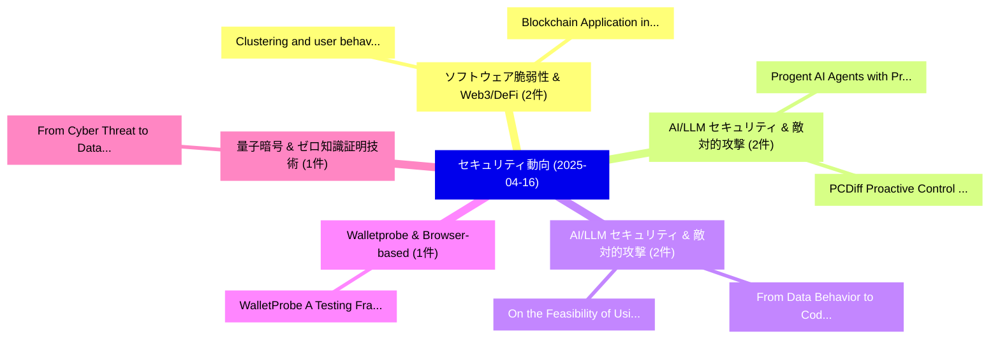

# 📅 02_daily: 日次エグゼクティブサマリー報告書 (2025-04-16)

**集計日時**: 2026-10-02 23:05:22 UTC  
**対象日付**: 2025-04-16  
**本日収集論文数**: 26 件  

---

## 💡 主要セキュリティ動向・脅威インサイト (Executive Insights)

本日の収集論文（計 26 件）において、以下の重点セキュリティ領域で活発な研究動向が確認されました：
- **ソフトウェア脆弱性 & Web3/DeFi** (2 件): 注目論文として 「Clustering and user behaviour ...」、「Blockchain Application in Meta...」 等が発表され、実務防御および攻撃検証の進展が見られます。
- **AI/LLM セキュリティ & 敵対的攻撃** (2 件): 注目論文として 「Progent: AI Agents with Privil...」、「PCDiff: Proactive Control for ...」 等が発表され、実務防御および攻撃検証の進展が見られます。
- **AI/LLM セキュリティ & 敵対的攻撃** (2 件): 注目論文として 「From Data Behavior to Code Ana...」、「On the Feasibility of Using Mu...」 等が発表され、実務防御および攻撃検証の進展が見られます。
- **Walletprobe & Browser-based** (1 件): 注目論文として 「WalletProbe: A Testing Framewo...」 等が発表され、実務防御および攻撃検証の進展が見られます。
- **量子暗号 & ゼロ知識証明技術** (1 件): 注目論文として 「From Cyber Threat to Data Shie...」 等が発表され、実務防御および攻撃検証の進展が見られます。

### 🗺️ 技術・脅威トピックマインドマップ

---

## 📌 日次セキュリティ論文一覧 (日本語表形式)

| No | arXiv ID | 論文タイトル (日本語訳) | 重要キーワード | 構造化エグゼクティブ要約 (背景・提案・影響) | 脅威分類 | 詳細リンク |
|---|---|---|---|---|---|---|
| 1 | `2504.11702v1` | [Clustering and user behaviour in blockchain: A case study of Planet IXの分析](../../okf/papers/2025-04-16/2504.11702.md) | `Dorottya Zelenyanszki`, `Zhe Hou`, `Kamanashis Biswas` | 【提案】概要 (Overview & Key Finding) 本論文「Clustering and user behaviour in blockchain: A case stu...。実証評価により経営層・セキュリティ管理者向け推奨アクション (E... | `cs.CR` | [arXiv](https://arxiv.org/abs/2504.11702v1) &#124; [OKF](../../okf/papers/2025-04-16/2504.11702.md) |
| 2 | `2504.11703v3` | [Progent: AI Agents with Privilege Controlのセキュリティ強化](../../okf/papers/2025-04-16/2504.11703.md) | `Privilege Control`, `Tianneng Shi`, `Zhun Wang` | 【提案】概要 (Overview & Key Finding) 本論文「Progent: AI Agents with Privilege Controlのセキュリティ強化」（原題:...。実証評価により経営層・セキュリティ管理者向け推奨アクション (E... | `cs.CR` | [arXiv](https://arxiv.org/abs/2504.11703v3) &#124; [OKF](../../okf/papers/2025-04-16/2504.11703.md) |
| 3 | `2504.11730v2` | [Blockchain Application in Metaverse: A Review（セキュリティ分析論文）](../../okf/papers/2025-04-16/2504.11730.md) | `Blockchain Application`, `Bingquan Jin`, `Hailu Kuang` | 【提案】概要 (Overview & Key Finding) 本論文「Blockchain Application in Metaverse: A Review（セキュリティ分析論...。実証評価により経営層・セキュリティ管理者向け推奨アクション (E... | `cs.CR` | [arXiv](https://arxiv.org/abs/2504.11730v2) &#124; [OKF](../../okf/papers/2025-04-16/2504.11730.md) |
| 4 | `2504.11735v1` | [WalletProbe: A Testing Framework for Browser-based Cryptocurrency Wallet Extensions（セキュリティ分析論文）](../../okf/papers/2025-04-16/2504.11735.md) | `Cryptocurrency Wallet Extensions`, `Browser-based Cryptocurrency`, `Xiaohui Hu` | 【提案】概要 (Overview & Key Finding) 本論文「WalletProbe: A Testing Framework for Browser-based Cryp...。実証評価により経営層・セキュリティ管理者向け推奨アクション (E... | `cs.CR` | [arXiv](https://arxiv.org/abs/2504.11735v1) &#124; [OKF](../../okf/papers/2025-04-16/2504.11735.md) |
| 5 | `2504.11744v1` | [From Cyber Threat to Data Shield: Constructing Provably Secure File Erasure with Repurposed Ransomware Cryptography（セキュリティ分析論文）](../../okf/papers/2025-04-16/2504.11744.md) | `Constructing Provably Secure File Erasure`, `Repurposed Ransomware Cryptography`, `Data Shield` | 【提案】概要 (Overview & Key Finding) 本論文「From Cyber 脅威 to Data Shield: Constructing Provably Sec...。実証評価により経営層・セキュリティ管理者向け推奨アクション (E... | `cs.CR` | [arXiv](https://arxiv.org/abs/2504.11744v1) &#124; [OKF](../../okf/papers/2025-04-16/2504.11744.md) |
| 6 | `2504.11774v1` | [PCDiff: Proactive Control for Ownership Protection in Diffusion Models with Watermark Compatibility（セキュリティ分析論文）](../../okf/papers/2025-04-16/2504.11774.md) | `Proactive Control`, `Ownership Protection`, `Diffusion Models` | 【提案】概要 (Overview & Key Finding) 本論文「PCDiff: Proactive Control for Ownership Protection in D...。実証評価により経営層・セキュリティ管理者向け推奨アクション (E... | `cs.CR` | [arXiv](https://arxiv.org/abs/2504.11774v1) &#124; [OKF](../../okf/papers/2025-04-16/2504.11774.md) |
| 7 | `2504.11783v1` | [The Digital サイバーセキュリティ Expert: How Far Have We Come?](../../okf/papers/2025-04-16/2504.11783.md) | `Dawei Wang`, `Geng Zhou`, `Xianglong Li` | 【提案】### (日本語題名: The Digital サイバーセキュリティ Expert: How Far Have We Come?)  > [!NOTE] > **OKF Me...。実証評価により経営層・セキュリティ管理者向け推奨アクション (E... | `cs.CR` | [arXiv](https://arxiv.org/abs/2504.11783v1) &#124; [OKF](../../okf/papers/2025-04-16/2504.11783.md) |
| 8 | `2504.11804v1` | [Advanced MST3 Encryption scheme based on generalized Suzuki 2-groups（セキュリティ分析論文）](../../okf/papers/2025-04-16/2504.11804.md) | `Gennady Khalimov`, `Yevgen Kotukh`, `Raw Meta` | 【提案】概要 (Overview & Key Finding) 本論文「Advanced MST3 Encryption scheme based on generalized Su...。実証評価により経営層・セキュリティ管理者向け推奨アクション (E... | `cs.CR` | [arXiv](https://arxiv.org/abs/2504.11804v1) &#124; [OKF](../../okf/papers/2025-04-16/2504.11804.md) |
| 9 | `2504.11860v2` | [From Data Behavior to Code Analysis: A Multimodal Study on Security and Privacy Challenges in Blockchain-Based DApp（セキュリティ分析論文）](../../okf/papers/2025-04-16/2504.11860.md) | `Privacy Challenges`, `Blockchain-Based DApp`, `Haoyang Sun` | 【提案】概要 (Overview & Key Finding) 本論文「From Data Behavior to Code Analysis: A Multimodal Study...。実証評価により経営層・セキュリティ管理者向け推奨アクション (E... | `cs.CR` | [arXiv](https://arxiv.org/abs/2504.11860v2) &#124; [OKF](../../okf/papers/2025-04-16/2504.11860.md) |
| 10 | `2504.11867v2` | [MDHP-Net: Detecting an Emerging Time-exciting Threat in IVN（セキュリティ分析論文）](../../okf/papers/2025-04-16/2504.11867.md) | `Emerging Time`, `Time-exciting Threat`, `Qi Liu` | 【提案】概要 (Overview & Key Finding) 本論文「MDHP-Net: Detecting an Emerging Time-exciting 脅威 in IVN...。実証評価により経営層・セキュリティ管理者向け推奨アクション (E... | `cs.CR` | [arXiv](https://arxiv.org/abs/2504.11867v2) &#124; [OKF](../../okf/papers/2025-04-16/2504.11867.md) |
| 11 | `2504.11924v1` | [Topological Mixer Activities in the Bitcoin Networkの分析](../../okf/papers/2025-04-16/2504.11924.md) | `Topological Mixer Activities`, `Mixer Activities`, `Bitcoin Network` | 【提案】概要 (Overview & Key Finding) 本論文「Topological Mixer Activities in the Bitcoin Networkの分析」...。実証評価により経営層・セキュリティ管理者向け推奨アクション (E... | `cs.CR` | [arXiv](https://arxiv.org/abs/2504.11924v1) &#124; [OKF](../../okf/papers/2025-04-16/2504.11924.md) |
| 12 | `2504.11961v3` | [zkFuzz: Foundation and Framework for Effective Fuzzing of Zero-Knowledge Circuits（セキュリティ分析論文）](../../okf/papers/2025-04-16/2504.11961.md) | `Effective Fuzzing`, `Knowledge Circuits`, `Zero-Knowledge Circuits` | 【提案】概要 (Overview & Key Finding) 本論文「zkFuzz: Foundation and Framework for Effective Fuzzing ...。実証評価により経営層・セキュリティ管理者向け推奨アクション (E... | `cs.CR` | [arXiv](https://arxiv.org/abs/2504.11961v3) &#124; [OKF](../../okf/papers/2025-04-16/2504.11961.md) |
| 13 | `2504.11984v1` | [The Evolution of Zero Trust Architecture (ZTA) from Concept to Implementation（セキュリティ分析論文）](../../okf/papers/2025-04-16/2504.11984.md) | `Zero Trust Architecture`, `Md Nasiruzzaman`, `Maaruf Ali` | 【提案】概要 (Overview & Key Finding) 本論文「The Evolution of ゼロトラスト Architecture (ZTA) from Concept...。実証評価により経営層・セキュリティ管理者向け推奨アクション (E... | `cs.CR` | [arXiv](https://arxiv.org/abs/2504.11984v1) &#124; [OKF](../../okf/papers/2025-04-16/2504.11984.md) |
| 14 | `2504.11990v1` | [Secure Transfer Learning: Training Clean Models Against Backdoor in (Both) Pre-trained Encoders and Downstream Datasets（セキュリティ分析論文）](../../okf/papers/2025-04-16/2504.11990.md) | `Secure Transfer Learning`, `Downstream Datasets`, `Pre-trained Encoders` | 【提案】概要 (Overview & Key Finding) 本論文「Secure Transfer Learning: Training Clean Models Against...。実証評価により経営層・セキュリティ管理者向け推奨アクション (E... | `cs.CR` | [arXiv](https://arxiv.org/abs/2504.11990v1) &#124; [OKF](../../okf/papers/2025-04-16/2504.11990.md) |
| 15 | `2504.12034v1` | [OpDiffer: LLM-Assisted Opcode-Level Differential Testing of Ethereum Virtual Machine（セキュリティ分析論文）](../../okf/papers/2025-04-16/2504.12034.md) | `Level Differential Testing`, `Ethereum Virtual Machine`, `Assisted Opcode` | 【提案】概要 (Overview & Key Finding) 本論文「OpDiffer: LLM-Assisted Opcode-Level Differential Testin...。実証評価により経営層・セキュリティ管理者向け推奨アクション (E... | `cs.CR` | [arXiv](https://arxiv.org/abs/2504.12034v1) &#124; [OKF](../../okf/papers/2025-04-16/2504.12034.md) |
| 16 | `2504.12062v1` | [A Scalable Framework for Post-Quantum Authentication in Public Key Infrastructures（セキュリティ分析論文）](../../okf/papers/2025-04-16/2504.12062.md) | `Public Key Infrastructures`, `Quantum Authentication`, `Post-Quantum Authentication` | 【提案】概要 (Overview & Key Finding) 本論文「A Scalable Framework for Post-量子 Authentication in Publ...。実証評価により経営層・セキュリティ管理者向け推奨アクション (E... | `cs.CR` | [arXiv](https://arxiv.org/abs/2504.12062v1) &#124; [OKF](../../okf/papers/2025-04-16/2504.12062.md) |
| 17 | `2504.12142v1` | [Overlapping Error Correction Codes on Two-Dimensional Structures（セキュリティ分析論文）](../../okf/papers/2025-04-16/2504.12142.md) | `Overlapping Error Correction Codes`, `Dimensional Structures`, `Two-Dimensional Structures` | 【提案】概要 (Overview & Key Finding) 本論文「Overlapping Error Correction Codes on Two-Dimensional S...。実証評価により経営層・セキュリティ管理者向け推奨アクション (E... | `cs.CR` | [arXiv](https://arxiv.org/abs/2504.12142v1) &#124; [OKF](../../okf/papers/2025-04-16/2504.12142.md) |
| 18 | `2504.12143v1` | [ARCeR: an Agentic RAG for the Automated Definition of Cyber Ranges（セキュリティ分析論文）](../../okf/papers/2025-04-16/2504.12143.md) | `Automated Definition`, `Cyber Ranges`, `Francesco Aurelio Pironti` | 【提案】概要 (Overview & Key Finding) 本論文「ARCeR: an Agentic RAG for the Automated Definition of C...。実証評価により経営層・セキュリティ管理者向け推奨アクション (E... | `cs.CR` | [arXiv](https://arxiv.org/abs/2504.12143v1) &#124; [OKF](../../okf/papers/2025-04-16/2504.12143.md) |
| 19 | `2504.12217v1` | [zkVC: Fast Zero-Knowledge Proof for Private and Verifiable Computing（セキュリティ分析論文）](../../okf/papers/2025-04-16/2504.12217.md) | `Fast Zero`, `Knowledge Proof`, `Verifiable Computing` | 【提案】概要 (Overview & Key Finding) 本論文「zkVC: Fast ゼロ知識証明 for Private and Verifiable Computing（...。実証評価により経営層・セキュリティ管理者向け推奨アクション (E... | `cs.CR` | [arXiv](https://arxiv.org/abs/2504.12217v1) &#124; [OKF](../../okf/papers/2025-04-16/2504.12217.md) |
| 20 | `2504.12218v2` | [Accountable Liveness（セキュリティ分析論文）](../../okf/papers/2025-04-16/2504.12218.md) | `Accountable Liveness`, `Andrew Lewis`, `Joachim Neu` | 【提案】概要 (Overview & Key Finding) 本論文「Accountable Liveness（セキュリティ分析論文）」（原題: Accountable Liven...。実証評価により経営層・セキュリティ管理者向け推奨アクション (E... | `cs.CR` | [arXiv](https://arxiv.org/abs/2504.12218v2) &#124; [OKF](../../okf/papers/2025-04-16/2504.12218.md) |
| 21 | `2504.12229v1` | [Watermarking Needs Input Repetition Masking（セキュリティ分析論文）](../../okf/papers/2025-04-16/2504.12229.md) | `Watermarking Needs Input Repetition Masking`, `David Khachaturov`, `Robert Mullins` | 【提案】概要 (Overview & Key Finding) 本論文「Watermarking Needs Input Repetition Masking（セキュリティ分析論文）...。実証評価により経営層・セキュリティ管理者向け推奨アクション (E... | `cs.CR` | [arXiv](https://arxiv.org/abs/2504.12229v1) &#124; [OKF](../../okf/papers/2025-04-16/2504.12229.md) |
| 22 | `2504.12493v2` | [Decentralised collaborative action: cryptoeconomics in space（セキュリティ分析論文）](../../okf/papers/2025-04-16/2504.12493.md) | `Raw Meta`, `Executive Summary`, `Key Finding` | 【提案】概要 (Overview & Key Finding) 本論文「Decentralised collaborative action: cryptoeconomics in ...。実証評価によりGabbay - **公開日時**: `2025-... | `cs.CR` | [arXiv](https://arxiv.org/abs/2504.12493v2) &#124; [OKF](../../okf/papers/2025-04-16/2504.12493.md) |
| 23 | `2504.13209v1` | [On the Feasibility of Using MultiModal LLMs to Execute AR Social Engineering Attacks（セキュリティ分析論文）](../../okf/papers/2025-04-16/2504.13209.md) | `Social Engineering Attacks`, `Ting Bi`, `Chenghang Ye` | 【提案】概要 (Overview & Key Finding) 本論文「On the Feasibility of Using MultiModal LLMs to Execute ...。実証評価により経営層・セキュリティ管理者向け推奨アクション (E... | `cs.CR` | [arXiv](https://arxiv.org/abs/2504.13209v1) &#124; [OKF](../../okf/papers/2025-04-16/2504.13209.md) |
| 24 | `2504.13212v1` | [I Know What You Bought Last Summer: Investigating User Data Leakage in E-Commerce Platforms（セキュリティ分析論文）](../../okf/papers/2025-04-16/2504.13212.md) | `Investigating User Data Leakage`, `Commerce Platforms`, `E-Commerce Platforms` | 【提案】概要 (Overview & Key Finding) 本論文「I Know What You Bought Last Summer: Investigating User ...。実証評価により経営層・セキュリティ管理者向け推奨アクション (E... | `cs.CR` | [arXiv](https://arxiv.org/abs/2504.13212v1) &#124; [OKF](../../okf/papers/2025-04-16/2504.13212.md) |
| 25 | `2504.13957v1` | [Naming is framing: How サイバーセキュリティ's language problems are repeating in AI governance](../../okf/papers/2025-04-16/2504.13957.md) | `Lianne Potter`, `Raw Meta`, `Executive Summary` | 【提案】概要 (Overview & Key Finding) 本論文「Naming is framing: How サイバーセキュリティ's language problems a...。実証評価により経営層・セキュリティ管理者向け推奨アクション (E... | `cs.CR` | [arXiv](https://arxiv.org/abs/2504.13957v1) &#124; [OKF](../../okf/papers/2025-04-16/2504.13957.md) |
| 26 | `2505.18156v1` | [InjectLab: A Tactical Framework for Adversarial Threat Modeling Against 大規模言語モデル](../../okf/papers/2025-04-16/2505.18156.md) | `Austin Howard`, `Raw Meta`, `Executive Summary` | 【提案】概要 (Overview & Key Finding) 本論文「InjectLab: A Tactical Framework for Adversarial 脅威 Mode...。実証評価により経営層・セキュリティ管理者向け推奨アクション (E... | `cs.CR` | [arXiv](https://arxiv.org/abs/2505.18156v1) &#124; [OKF](../../okf/papers/2025-04-16/2505.18156.md) |

