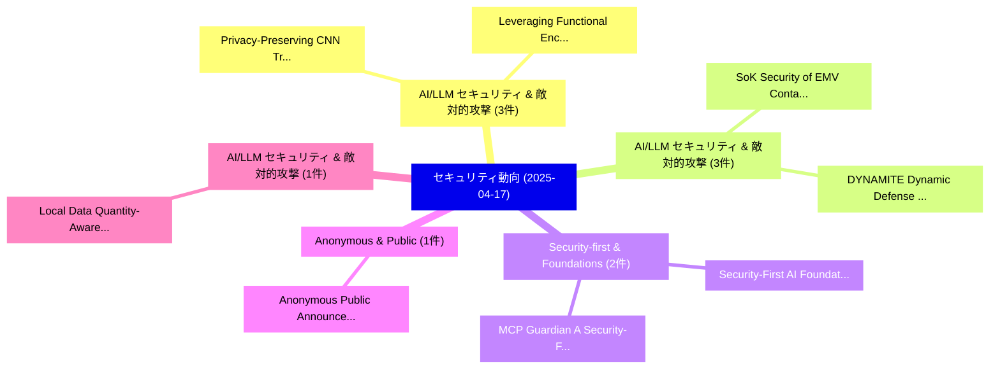

# 📅 02_daily: 日次エグゼクティブサマリー報告書 (2025-04-17)

**集計日時**: 2026-10-02 23:05:22 UTC  
**対象日付**: 2025-04-17  
**本日収集論文数**: 23 件  

---

## 💡 主要セキュリティ動向・脅威インサイト (Executive Insights)

本日の収集論文（計 23 件）において、以下の重点セキュリティ領域で活発な研究動向が確認されました：
- **AI/LLM セキュリティ & 敵対的攻撃** (3 件): 注目論文として 「Privacy-Preserving CNN Trainin...」、「Leveraging Functional Encrypti...」 等が発表され、実務防御および攻撃検証の進展が見られます。
- **AI/LLM セキュリティ & 敵対的攻撃** (3 件): 注目論文として 「SoK: Security of EMV Contactle...」、「DYNAMITE: Dynamic Defense Sele...」 等が発表され、実務防御および攻撃検証の進展が見られます。
- **Security-first & Foundations** (2 件): 注目論文として 「MCP Guardian: A Security-First...」、「Security-First AI: Foundations...」 等が発表され、実務防御および攻撃検証の進展が見られます。
- **Anonymous & Public** (1 件): 注目論文として 「Anonymous Public Announcements...」 等が発表され、実務防御および攻撃検証の進展が見られます。
- **AI/LLM セキュリティ & 敵対的攻撃** (1 件): 注目論文として 「Local Data Quantity-Aware Weig...」 等が発表され、実務防御および攻撃検証の進展が見られます。

### 🗺️ 技術・脅威トピックマインドマップ

---

## 📌 日次セキュリティ論文一覧 (日本語表形式)

| No | arXiv ID | 論文タイトル (日本語訳) | 重要キーワード | 構造化エグゼクティブ要約 (背景・提案・影響) | 脅威分類 | 詳細リンク |
|---|---|---|---|---|---|---|
| 1 | `2504.12546v2` | [Anonymous Public Announcements（セキュリティ分析論文）](../../okf/papers/2025-04-17/2504.12546.md) | `Anonymous Public Announcements`, `Rustam Galimullin`, `Ken Satoh` | 【提案】概要 (Overview & Key Finding) 本論文「Anonymous Public Announcements（セキュリティ分析論文）」（原題: Anonymo...。実証評価により経営層・セキュリティ管理者向け推奨アクション (E... | `cs.CR` | [arXiv](https://arxiv.org/abs/2504.12546v2) &#124; [OKF](../../okf/papers/2025-04-17/2504.12546.md) |
| 2 | `2504.12577v1` | [Local Data Quantity-Aware Weighted Averaging for 連合学習 with Dishonest Clients](../../okf/papers/2025-04-17/2504.12577.md) | `Local Data Quantity`, `Aware Weighted Averaging`, `Dishonest Clients` | 【提案】概要 (Overview & Key Finding) 本論文「Local Data Quantity-Aware Weighted Averaging for 連合学習 w...。実証評価により経営層・セキュリティ管理者向け推奨アクション (E... | `cs.CR` | [arXiv](https://arxiv.org/abs/2504.12577v1) &#124; [OKF](../../okf/papers/2025-04-17/2504.12577.md) |
| 3 | `2504.12579v3` | [Provable Secure Steganography Based on Adaptive Dynamic Sampling（セキュリティ分析論文）](../../okf/papers/2025-04-17/2504.12579.md) | `Provable Secure Steganography Based`, `Adaptive Dynamic Sampling`, `Kaiyi Pang` | 【提案】概要 (Overview & Key Finding) 本論文「Provable Secure Steganography Based on Adaptive Dynamic...。実証評価により経営層・セキュリティ管理者向け推奨アクション (E... | `cs.CR` | [arXiv](https://arxiv.org/abs/2504.12579v3) &#124; [OKF](../../okf/papers/2025-04-17/2504.12579.md) |
| 4 | `2504.12604v1` | [Codes over Finite Ring $\mathbb{Z}_k$, MacWilliams Identity and Theta Function（セキュリティ分析論文）](../../okf/papers/2025-04-17/2504.12604.md) | `Finite Ring`, `Theta Function`, `Zhiyong Zheng` | 【提案】概要 (Overview & Key Finding) 本論文「Codes over Finite Ring $\mathbb{Z}_k$, MacWilliams Iden...。実証評価により経営層・セキュリティ管理者向け推奨アクション (E... | `cs.CR` | [arXiv](https://arxiv.org/abs/2504.12604v1) &#124; [OKF](../../okf/papers/2025-04-17/2504.12604.md) |
| 5 | `2504.12612v2` | [Chronology of Multi-Agent Interactions for Provenance of Evolving Information（セキュリティ分析論文）](../../okf/papers/2025-04-17/2504.12612.md) | `Agent Interactions`, `Evolving Information`, `Multi-Agent Interactions` | 【提案】概要 (Overview & Key Finding) 本論文「Chronology of Multi-Agent Interactions for Provenance o...。実証評価により経営層・セキュリティ管理者向け推奨アクション (E... | `cs.CR` | [arXiv](https://arxiv.org/abs/2504.12612v2) &#124; [OKF](../../okf/papers/2025-04-17/2504.12612.md) |
| 6 | `2504.12623v1` | [Privacy-Preserving CNN Training with Transfer Learning: Two Hidden Layers（セキュリティ分析論文）](../../okf/papers/2025-04-17/2504.12623.md) | `Two Hidden Layers`, `Transfer Learning`, `Privacy-Preserving CNN` | 【提案】概要 (Overview & Key Finding) 本論文「Privacy-Preserving CNN Training with Transfer Learning:...。実証評価により経営層・セキュリティ管理者向け推奨アクション (E... | `cs.CR` | [arXiv](https://arxiv.org/abs/2504.12623v1) &#124; [OKF](../../okf/papers/2025-04-17/2504.12623.md) |
| 7 | `2504.12644v1` | [Quantum Computing Supported Adversarial Attack-Resilient Autonomous Vehicle Perception Module for Traffic Sign Classification（セキュリティ分析論文）](../../okf/papers/2025-04-17/2504.12644.md) | `Quantum Computing Supported Adversarial Attack`, `Resilient Autonomous Vehicle Perception Module`, `Traffic Sign Classification` | 【提案】概要 (Overview & Key Finding) 本論文「量子 Computing Supported 敵対的攻撃-Resilient Autonomous Vehic...。実証評価により経営層・セキュリティ管理者向け推奨アクション (E... | `cs.CR` | [arXiv](https://arxiv.org/abs/2504.12644v1) &#124; [OKF](../../okf/papers/2025-04-17/2504.12644.md) |
| 8 | `2504.12720v2` | [Malicious Code Detection in Smart Contracts via Opcode Vectorization（セキュリティ分析論文）](../../okf/papers/2025-04-17/2504.12720.md) | `Malicious Code Detection`, `Smart Contracts`, `Opcode Vectorization` | 【提案】概要 (Overview & Key Finding) 本論文「Malicious Code Detection in スマートコントラクトs via Opcode Vect...。実証評価により経営層・セキュリティ管理者向け推奨アクション (E... | `cs.CR` | [arXiv](https://arxiv.org/abs/2504.12720v2) &#124; [OKF](../../okf/papers/2025-04-17/2504.12720.md) |
| 9 | `2504.12733v1` | [Adversary-Augmented Simulation for Fairness Evaluation and Defense in Hyperledger Fabric（セキュリティ分析論文）](../../okf/papers/2025-04-17/2504.12733.md) | `Augmented Simulation`, `Hyperledger Fabric`, `Adversary-Augmented Simulation` | 【提案】概要 (Overview & Key Finding) 本論文「Adversary-Augmented Simulation for Fairness Evaluation ...。実証評価により経営層・セキュリティ管理者向け推奨アクション (E... | `cs.CR` | [arXiv](https://arxiv.org/abs/2504.12733v1) &#124; [OKF](../../okf/papers/2025-04-17/2504.12733.md) |
| 10 | `2504.12748v1` | [Attack-Defense Trees with Offensive and Defensive Attributes (with Appendix)（セキュリティ分析論文）](../../okf/papers/2025-04-17/2504.12748.md) | `Defense Trees`, `Defensive Attributes`, `Attack-Defense Trees` | 【提案】概要 (Overview & Key Finding) 本論文「Attack-Defense Trees with Offensive and Defensive Attri...。実証評価により経営層・セキュリティ管理者向け推奨アクション (E... | `cs.CR` | [arXiv](https://arxiv.org/abs/2504.12748v1) &#124; [OKF](../../okf/papers/2025-04-17/2504.12748.md) |
| 11 | `2504.12757v2` | [MCP Guardian: A Security-First Layer for Safeguarding MCP-Based AI System（セキュリティ分析論文）](../../okf/papers/2025-04-17/2504.12757.md) | `First Layer`, `Security-First Layer`, `MCP-Based AI` | 【提案】概要 (Overview & Key Finding) 本論文「MCP Guardian: A Security-First Layer for Safeguarding M...。実証評価により経営層・セキュリティ管理者向け推奨アクション (E... | `cs.CR` | [arXiv](https://arxiv.org/abs/2504.12757v2) &#124; [OKF](../../okf/papers/2025-04-17/2504.12757.md) |
| 12 | `2504.12782v1` | [Set You Straight: Auto-Steering Denoising Trajectories to Sidestep Unwanted Concepts（セキュリティ分析論文）](../../okf/papers/2025-04-17/2504.12782.md) | `Steering Denoising Trajectories`, `Sidestep Unwanted Concepts`, `Auto-Steering Denoising` | 【提案】概要 (Overview & Key Finding) 本論文「Set You Straight: Auto-Steering Denoising Trajectories ...。実証評価により経営層・セキュリティ管理者向け推奨アクション (E... | `cs.CR` | [arXiv](https://arxiv.org/abs/2504.12782v1) &#124; [OKF](../../okf/papers/2025-04-17/2504.12782.md) |
| 13 | `2504.12806v2` | [A Numerical Gradient Inversion Attack in Variational Quantum Neural-Networks（セキュリティ分析論文）](../../okf/papers/2025-04-17/2504.12806.md) | `Numerical Gradient Inversion Attack`, `Variational Quantum Neural`, `Numerical Gradient Inversion` | 【提案】概要 (Overview & Key Finding) 本論文「A Numerical Gradient Inversion Attack in Variational 量子...。実証評価により経営層・セキュリティ管理者向け推奨アクション (E... | `cs.CR` | [arXiv](https://arxiv.org/abs/2504.12806v2) &#124; [OKF](../../okf/papers/2025-04-17/2504.12806.md) |
| 14 | `2504.12812v1` | [SoK: Security of EMV Contactless Payment Systems（セキュリティ分析論文）](../../okf/papers/2025-04-17/2504.12812.md) | `Contactless Payment Systems`, `Mahshid Mehr Nezhad`, `Feng Hao` | 【提案】概要 (Overview & Key Finding) 本論文「SoK: Security of EMV Contactless Payment Systems（セキュリティ...。実証評価により経営層・セキュリティ管理者向け推奨アクション (E... | `cs.CR` | [arXiv](https://arxiv.org/abs/2504.12812v1) &#124; [OKF](../../okf/papers/2025-04-17/2504.12812.md) |
| 15 | `2504.12948v2` | [Algorithms for the Shortest Vector Problem in $2$-dimensional Lattices, Revisited（セキュリティ分析論文）](../../okf/papers/2025-04-17/2504.12948.md) | `Shortest Vector Problem`, `Lihao Zhao`, `Chengliang Tian` | 【提案】概要 (Overview & Key Finding) 本論文「Algorithms for the Shortest Vector Problem in $2$-dimen...。実証評価により経営層・セキュリティ管理者向け推奨アクション (E... | `cs.CR` | [arXiv](https://arxiv.org/abs/2504.12948v2) &#124; [OKF](../../okf/papers/2025-04-17/2504.12948.md) |
| 16 | `2504.13052v1` | [GraphAttack: Exploiting Representational Blindspots in LLM Safety Mechanisms（セキュリティ分析論文）](../../okf/papers/2025-04-17/2504.13052.md) | `Exploiting Representational Blindspots`, `Safety Mechanisms`, `Raw Meta` | 【提案】概要 (Overview & Key Finding) 本論文「GraphAttack: Exploiting Representational Blindspots in ...。実証評価により経営層・セキュリティ管理者向け推奨アクション (E... | `cs.CR` | [arXiv](https://arxiv.org/abs/2504.13052v1) &#124; [OKF](../../okf/papers/2025-04-17/2504.13052.md) |
| 17 | `2504.13061v1` | [ArtistAuditor: Auditing Artist Style Pirate in Text-to-Image Generation Models（セキュリティ分析論文）](../../okf/papers/2025-04-17/2504.13061.md) | `Auditing Artist Style Pirate`, `Image Generation Models`, `Linkang Du` | 【提案】概要 (Overview & Key Finding) 本論文「ArtistAuditor: Auditing Artist Style Pirate in Text-to-...。実証評価により経営層・セキュリティ管理者向け推奨アクション (E... | `cs.CR` | [arXiv](https://arxiv.org/abs/2504.13061v1) &#124; [OKF](../../okf/papers/2025-04-17/2504.13061.md) |
| 18 | `2504.13267v1` | [Leveraging Functional Encryption and Deep Learning for Privacy-Preserving Traffic Forecasting（セキュリティ分析論文）](../../okf/papers/2025-04-17/2504.13267.md) | `Leveraging Functional Encryption`, `Preserving Traffic Forecasting`, `Deep Learning` | 【提案】概要 (Overview & Key Finding) 本論文「Leveraging Functional Encryption and Deep Learning for ...。実証評価により経営層・セキュリティ管理者向け推奨アクション (E... | `cs.CR` | [arXiv](https://arxiv.org/abs/2504.13267v1) &#124; [OKF](../../okf/papers/2025-04-17/2504.13267.md) |
| 19 | `2504.13301v1` | [DYNAMITE: Dynamic Defense Selection for Enhancing Machine Learning-based Intrusion Detection Against Adversarial Attacks（セキュリティ分析論文）](../../okf/papers/2025-04-17/2504.13301.md) | `Dynamic Defense Selection`, `Enhancing Machine Learning`, `Learning-based Intrusion` | 【提案】概要 (Overview & Key Finding) 本論文「DYNAMITE: Dynamic Defense Selection for Enhancing Machi...。実証評価により経営層・セキュリティ管理者向け推奨アクション (E... | `cs.CR` | [arXiv](https://arxiv.org/abs/2504.13301v1) &#124; [OKF](../../okf/papers/2025-04-17/2504.13301.md) |
| 20 | `2504.13358v2` | [GraphQLer: Enhancing GraphQL Security with Context-Aware API Testing（セキュリティ分析論文）](../../okf/papers/2025-04-17/2504.13358.md) | `Context-Aware API`, `Tsz Tung Cheung`, `Omar Tsai` | 【提案】概要 (Overview & Key Finding) 本論文「GraphQLer: Enhancing GraphQL Security with Context-Awar...。実証評価により経営層・セキュリティ管理者向け推奨アクション (E... | `cs.CR` | [arXiv](https://arxiv.org/abs/2504.13358v2) &#124; [OKF](../../okf/papers/2025-04-17/2504.13358.md) |
| 21 | `2504.13371v1` | [The Impact of AI on the Cyber Offense-Defense Balance and the Character of Cyber Conflict（セキュリティ分析論文）](../../okf/papers/2025-04-17/2504.13371.md) | `Cyber Offense`, `Defense Balance`, `Cyber Conflict` | 【提案】概要 (Overview & Key Finding) 本論文「The Impact of AI on the Cyber Offense-Defense Balance a...。実証評価により経営層・セキュリティ管理者向け推奨アクション (E... | `cs.CR` | [arXiv](https://arxiv.org/abs/2504.13371v1) &#124; [OKF](../../okf/papers/2025-04-17/2504.13371.md) |
| 22 | `2504.16108v1` | [Trusted Identities for AI Agents: Leveraging Telco-Hosted eSIM Infrastructure（セキュリティ分析論文）](../../okf/papers/2025-04-17/2504.16108.md) | `Trusted Identities`, `Leveraging Telco`, `Telco-Hosted eSIM` | 【提案】概要 (Overview & Key Finding) 本論文「Trusted Identities for AI Agents: Leveraging Telco-Host...。実証評価により経営層・セキュリティ管理者向け推奨アクション (E... | `cs.CR` | [arXiv](https://arxiv.org/abs/2504.16108v1) &#124; [OKF](../../okf/papers/2025-04-17/2504.16108.md) |
| 23 | `2504.16110v1` | [Security-First AI: Foundations for Robust and Trustworthy Systems（セキュリティ分析論文）](../../okf/papers/2025-04-17/2504.16110.md) | `Trustworthy Systems`, `Security-First AI`, `Krti Tallam` | 【提案】概要 (Overview & Key Finding) 本論文「Security-First AI: Foundations for Robust and Trustwort...。実証評価により経営層・セキュリティ管理者向け推奨アクション (E... | `cs.CR` | [arXiv](https://arxiv.org/abs/2504.16110v1) &#124; [OKF](../../okf/papers/2025-04-17/2504.16110.md) |

