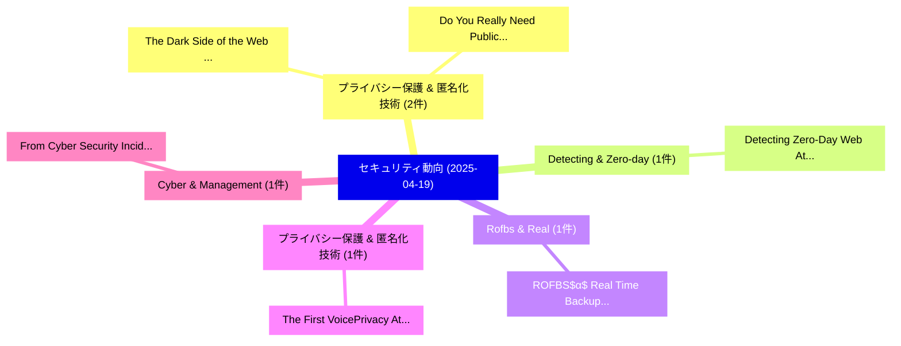

# 📅 02_daily: 日次エグゼクティブサマリー報告書 (2025-04-19)

**集計日時**: 2026-10-02 23:05:23 UTC  
**対象日付**: 2025-04-19  
**本日収集論文数**: 10 件  

---

## 💡 主要セキュリティ動向・脅威インサイト (Executive Insights)

本日の収集論文（計 10 件）において、以下の重点セキュリティ領域で活発な研究動向が確認されました：
- **プライバシー保護 & 匿名化技術** (2 件): 注目論文として 「The Dark Side of the Web: Unde...」、「Do You Really Need Public Data...」 等が発表され、実務防御および攻撃検証の進展が見られます。
- **Detecting & Zero-day** (1 件): 注目論文として 「Detecting Zero-Day Web Attacks...」 等が発表され、実務防御および攻撃検証の進展が見られます。
- **Rofbs & Real** (1 件): 注目論文として 「ROFBS$α$: Real Time Backup Sys...」 等が発表され、実務防御および攻撃検証の進展が見られます。
- **プライバシー保護 & 匿名化技術** (1 件): 注目論文として 「The First VoicePrivacy Attacke...」 等が発表され、実務防御および攻撃検証の進展が見られます。
- **Cyber & Management** (1 件): 注目論文として 「From Cyber Security Incident M...」 等が発表され、実務防御および攻撃検証の進展が見られます。

### 🗺️ 技術・脅威トピックマインドマップ

---

## 📌 日次セキュリティ論文一覧 (日本語表形式)

| No | arXiv ID | 論文タイトル (日本語訳) | 重要キーワード | 構造化エグゼクティブ要約 (背景・提案・影響) | 脅威分類 | 詳細リンク |
|---|---|---|---|---|---|---|
| 1 | `2504.14122v1` | [Detecting Zero-Day Web Attacks with an Ensemble of LSTM, GRU, and Stacked Autoencoders（セキュリティ分析論文）](../../okf/papers/2025-04-19/2504.14122.md) | `Day Web Attacks`, `Detecting Zero`, `Stacked Autoencoders` | 【提案】概要 (Overview & Key Finding) 本論文「Detecting Zero-Day Web Attacks with an Ensemble of LSTM...。実証評価により経営層・セキュリティ管理者向け推奨アクション (E... | `cs.CR` | [arXiv](https://arxiv.org/abs/2504.14122v1) &#124; [OKF](../../okf/papers/2025-04-19/2504.14122.md) |
| 2 | `2504.14162v1` | [ROFBS$α$: Real Time Backup System Decoupled from ML Based Ransomware Detection（セキュリティ分析論文）](../../okf/papers/2025-04-19/2504.14162.md) | `Real Time Backup System Decoupled`, `Based Ransomware Detection`, `Kosuke Higuchi` | 【提案】概要 (Overview & Key Finding) 本論文「ROFBS$α$: Real Time Backup System Decoupled from ML Bas...。実証評価により経営層・セキュリティ管理者向け推奨アクション (E... | `cs.CR` | [arXiv](https://arxiv.org/abs/2504.14162v1) &#124; [OKF](../../okf/papers/2025-04-19/2504.14162.md) |
| 3 | `2504.14183v1` | [The First VoicePrivacy Attacker Challenge（セキュリティ分析論文）](../../okf/papers/2025-04-19/2504.14183.md) | `Attacker Challenge`, `Natalia Tomashenko`, `Xiaoxiao Miao` | 【提案】概要 (Overview & Key Finding) 本論文「The First VoicePrivacy Attacker Challenge（セキュリティ分析論文）」（...。実証評価により経営層・セキュリティ管理者向け推奨アクション (E... | `cs.CR` | [arXiv](https://arxiv.org/abs/2504.14183v1) &#124; [OKF](../../okf/papers/2025-04-19/2504.14183.md) |
| 4 | `2504.14220v2` | [From Cyber Security Incident Management to Cyber Security Crisis Management in the European Union（セキュリティ分析論文）](../../okf/papers/2025-04-19/2504.14220.md) | `Cyber Security Crisis Management`, `European Union`, `Jukka Ruohonen` | 【提案】概要 (Overview & Key Finding) 本論文「From Cyber Security Incident Management to Cyber Securi...。実証評価により経営層・セキュリティ管理者向け推奨アクション (E... | `cs.CR` | [arXiv](https://arxiv.org/abs/2504.14220v2) &#124; [OKF](../../okf/papers/2025-04-19/2504.14220.md) |
| 5 | `2504.14235v2` | [The Dark Side of the Web: Understanding Various Data Sources in Cyber Threat Intelligenceに向けて](../../okf/papers/2025-04-19/2504.14235.md) | `Understanding Various Data Sources`, `Towards Understanding Various Data Sources`, `Cyber Threat` | 【提案】概要 (Overview & Key Finding) 本論文「The Dark Side of the Web: Understanding Various Data So...。実証評価により経営層・セキュリティ管理者向け推奨アクション (E... | `cs.CR` | [arXiv](https://arxiv.org/abs/2504.14235v2) &#124; [OKF](../../okf/papers/2025-04-19/2504.14235.md) |
| 6 | `2504.14328v1` | [ScaloWork: Useful Proof-of-Work with Distributed Pool Mining（セキュリティ分析論文）](../../okf/papers/2025-04-19/2504.14328.md) | `Distributed Pool Mining`, `Useful Proof`, `Diptendu Chatterjee` | 【提案】概要 (Overview & Key Finding) 本論文「ScaloWork: Useful Proof-of-Work with Distributed Pool M...。実証評価により経営層・セキュリティ管理者向け推奨アクション (E... | `cs.CR` | [arXiv](https://arxiv.org/abs/2504.14328v1) &#124; [OKF](../../okf/papers/2025-04-19/2504.14328.md) |
| 7 | `2504.14368v1` | [Do You Really Need Public Data? Surrogate Public Data for Differential Privacy on Tabular Data（セキュリティ分析論文）](../../okf/papers/2025-04-19/2504.14368.md) | `Surrogate Public Data`, `Differential Privacy`, `Tabular Data` | 【提案】Surrogate Public Data for 差分プライバシー on Tabular Data ### (日本語題名: Do You Really Need Publi...。実証評価により経営層・セキュリティ管理者向け推奨アクション (E... | `cs.CR` | [arXiv](https://arxiv.org/abs/2504.14368v1) &#124; [OKF](../../okf/papers/2025-04-19/2504.14368.md) |
| 8 | `2504.14381v3` | [Publicly Verifiable Secret Sharing: Generic Constructions and Lattice-Based Instantiations in the Standard Model（セキュリティ分析論文）](../../okf/papers/2025-04-19/2504.14381.md) | `Publicly Verifiable Secret Sharing`, `Generic Constructions`, `Based Instantiations` | 【提案】概要 (Overview & Key Finding) 本論文「Publicly Verifiable Secret Sharing: Generic Constructio...。実証評価により経営層・セキュリティ管理者向け推奨アクション (E... | `cs.CR` | [arXiv](https://arxiv.org/abs/2504.14381v3) &#124; [OKF](../../okf/papers/2025-04-19/2504.14381.md) |
| 9 | `2504.14421v1` | [How Do Mobile Applications Enhance Security? An Exploratory Use Cases and Provided Informationの分析](../../okf/papers/2025-04-19/2504.14421.md) | `Use Cases`, `Provided Information`, `Irdin Pekaric` | 【提案】An Exploratory Analysis of Use Cases and Provided Information ### (日本語題名: How Do Mobile...。実証評価により経営層・セキュリティ管理者向け推奨アクション (E... | `cs.CR` | [arXiv](https://arxiv.org/abs/2504.14421v1) &#124; [OKF](../../okf/papers/2025-04-19/2504.14421.md) |
| 10 | `2504.16120v1` | [A Data-Centric Approach for Safe and Secure 大規模言語モデル against Threatening and Toxic Content](../../okf/papers/2025-04-19/2504.16120.md) | `Toxic Content`, `Secure Large Language Models`, `Chaima Njeh` | 【提案】概要 (Overview & Key Finding) 本論文「A Data-Centric Approach for Safe and Secure 大規模言語モデル ag...。実証評価により経営層・セキュリティ管理者向け推奨アクション (E... | `cs.CR` | [arXiv](https://arxiv.org/abs/2504.16120v1) &#124; [OKF](../../okf/papers/2025-04-19/2504.16120.md) |

