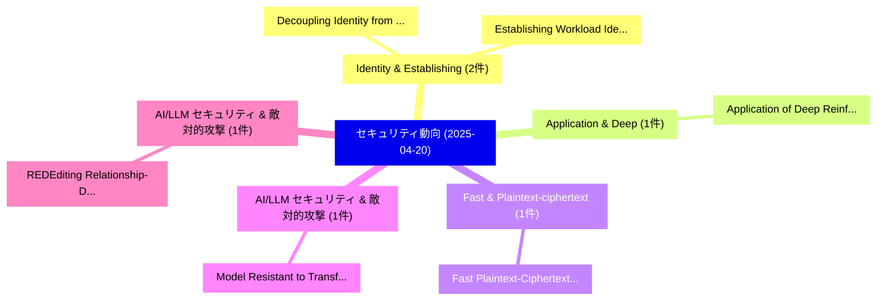

# 📅 02_daily: 日次エグゼクティブサマリー報告書 (2025-04-20)

**集計日時**: 2026-10-02 23:05:23 UTC  
**対象日付**: 2025-04-20  
**本日収集論文数**: 9 件  

---

## 💡 主要セキュリティ動向・脅威インサイト (Executive Insights)

本日の収集論文（計 9 件）において、以下の重点セキュリティ領域で活発な研究動向が確認されました：
- **Identity & Establishing** (2 件): 注目論文として 「Establishing Workload Identity...」、「Decoupling Identity from Acces...」 等が発表され、実務防御および攻撃検証の進展が見られます。
- **Application & Deep** (1 件): 注目論文として 「Application of Deep Reinforcem...」 等が発表され、実務防御および攻撃検証の進展が見られます。
- **Fast & Plaintext-ciphertext** (1 件): 注目論文として 「Fast Plaintext-Ciphertext Matr...」 等が発表され、実務防御および攻撃検証の進展が見られます。
- **AI/LLM セキュリティ & 敵対的攻撃** (1 件): 注目論文として 「Model Resistant to Transferabl...」 等が発表され、実務防御および攻撃検証の進展が見られます。
- **AI/LLM セキュリティ & 敵対的攻撃** (1 件): 注目論文として 「REDEditing: Relationship-Drive...」 等が発表され、実務防御および攻撃検証の進展が見られます。

### 🗺️ 技術・脅威トピックマインドマップ

---

## 📌 日次セキュリティ論文一覧 (日本語表形式)

| No | arXiv ID | 論文タイトル (日本語訳) | 重要キーワード | 構造化エグゼクティブ要約 (背景・提案・影響) | 脅威分類 | 詳細リンク |
|---|---|---|---|---|---|---|
| 1 | `2504.14436v1` | [Application of Deep Reinforcement Learning for Intrusion Detection in Internet of Things: A Systematic Review（セキュリティ分析論文）](../../okf/papers/2025-04-20/2504.14436.md) | `Deep Reinforcement Learning`, `Intrusion Detection`, `Systematic Review` | 【提案】概要 (Overview & Key Finding) 本論文「Application of Deep Reinforcement Learning for Intrusio...。実証評価により経営層・セキュリティ管理者向け推奨アクション (E... | `cs.CR` | [arXiv](https://arxiv.org/abs/2504.14436v1) &#124; [OKF](../../okf/papers/2025-04-20/2504.14436.md) |
| 2 | `2504.14497v1` | [Fast Plaintext-Ciphertext Matrix Multiplication from Additively Homomorphic Encryption（セキュリティ分析論文）](../../okf/papers/2025-04-20/2504.14497.md) | `Ciphertext Matrix Multiplication`, `Additively Homomorphic Encryption`, `Fast Plaintext` | 【提案】概要 (Overview & Key Finding) 本論文「Fast Plaintext-Ciphertext Matrix Multiplication from Ad...。実証評価により経営層・セキュリティ管理者向け推奨アクション (E... | `cs.CR` | [arXiv](https://arxiv.org/abs/2504.14497v1) &#124; [OKF](../../okf/papers/2025-04-20/2504.14497.md) |
| 3 | `2504.14541v1` | [Model Resistant to Transferable Adversarial Examples via Trigger Activationに向けて](../../okf/papers/2025-04-20/2504.14541.md) | `Transferable Adversarial Examples`, `Towards Model Resistant`, `Model Resistant` | 【提案】概要 (Overview & Key Finding) 本論文「Model Resistant to Transferable Adversarial Examples vi...。実証評価により経営層・セキュリティ管理者向け推奨アクション (E... | `cs.CR` | [arXiv](https://arxiv.org/abs/2504.14541v1) &#124; [OKF](../../okf/papers/2025-04-20/2504.14541.md) |
| 4 | `2504.14554v1` | [REDEditing: Relationship-Driven Precise Backdoor Poisoning on Text-to-Image Diffusion Models（セキュリティ分析論文）](../../okf/papers/2025-04-20/2504.14554.md) | `Driven Precise Backdoor Poisoning`, `Image Diffusion Models`, `Relationship-Driven Precise` | 【提案】概要 (Overview & Key Finding) 本論文「REDEditing: Relationship-Driven Precise Backdoor Poison...。実証評価により経営層・セキュリティ管理者向け推奨アクション (E... | `cs.CR` | [arXiv](https://arxiv.org/abs/2504.14554v1) &#124; [OKF](../../okf/papers/2025-04-20/2504.14554.md) |
| 5 | `2504.14654v4` | [BLACKOUT: Data-Oblivious Computation with Blinded Capabilities（セキュリティ分析論文）](../../okf/papers/2025-04-20/2504.14654.md) | `Oblivious Computation`, `Blinded Capabilities`, `Data-Oblivious Computation` | 【提案】概要 (Overview & Key Finding) 本論文「BLACKOUT: Data-Oblivious Computation with Blinded Capab...。実証評価によりAsokan - **公開日時**: `2025。 | `cs.CR` | [arXiv](https://arxiv.org/abs/2504.14654v4) &#124; [OKF](../../okf/papers/2025-04-20/2504.14654.md) |
| 6 | `2504.14696v3` | [Reveal-or-Obscure: A Differentially Private Sampling Algorithm for Discrete Distributions（セキュリティ分析論文）](../../okf/papers/2025-04-20/2504.14696.md) | `Differentially Private Sampling Algorithm`, `Discrete Distributions`, `Naima Tasnim` | 【提案】概要 (Overview & Key Finding) 本論文「Reveal-or-Obscure: A Differentially Private Sampling Al...。実証評価により経営層・セキュリティ管理者向け推奨アクション (E... | `cs.CR` | [arXiv](https://arxiv.org/abs/2504.14696v3) &#124; [OKF](../../okf/papers/2025-04-20/2504.14696.md) |
| 7 | `2504.14760v1` | [Establishing Workload Identity for Zero Trust CI/CD: From Secrets to SPIFFE-Based Authentication（セキュリティ分析論文）](../../okf/papers/2025-04-20/2504.14760.md) | `Establishing Workload Identity`, `Zero Trust`, `Based Authentication` | 【提案】概要 (Overview & Key Finding) 本論文「Establishing Workload Identity for ゼロトラスト CI/CD: From S...。実証評価により経営層・セキュリティ管理者向け推奨アクション (E... | `cs.CR` | [arXiv](https://arxiv.org/abs/2504.14760v1) &#124; [OKF](../../okf/papers/2025-04-20/2504.14760.md) |
| 8 | `2504.14761v1` | [Decoupling Identity from Access: Credential Broker Patterns for Secure CI/CD（セキュリティ分析論文）](../../okf/papers/2025-04-20/2504.14761.md) | `Credential Broker Patterns`, `Decoupling Identity`, `Surya Teja Avirneni` | 【提案】概要 (Overview & Key Finding) 本論文「Decoupling Identity from Access: Credential Broker Patt...。実証評価により経営層・セキュリティ管理者向け推奨アクション (E... | `cs.CR` | [arXiv](https://arxiv.org/abs/2504.14761v1) &#124; [OKF](../../okf/papers/2025-04-20/2504.14761.md) |
| 9 | `2504.16125v1` | [Breaking the Prompt Wall (I): A Real-World Case Study of Attacking ChatGPT via Lightweight Prompt Injection（セキュリティ分析論文）](../../okf/papers/2025-04-20/2504.16125.md) | `Lightweight Prompt Injection`, `Prompt Wall`, `Real-World Case` | 【提案】概要 (Overview & Key Finding) 本論文「Breaking the Prompt Wall (I): A Real-World Case Study o...。実証評価により経営層・セキュリティ管理者向け推奨アクション (E... | `cs.CR` | [arXiv](https://arxiv.org/abs/2504.16125v1) &#124; [OKF](../../okf/papers/2025-04-20/2504.16125.md) |

