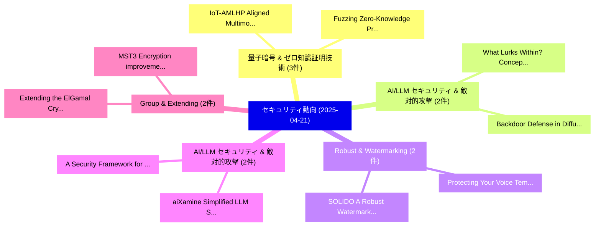

# 📅 02_daily: 日次エグゼクティブサマリー報告書 (2025-04-21)

**集計日時**: 2026-10-02 23:05:23 UTC  
**対象日付**: 2025-04-21  
**本日収集論文数**: 33 件  

---

## 💡 主要セキュリティ動向・脅威インサイト (Executive Insights)

本日の収集論文（計 33 件）において、以下の重点セキュリティ領域で活発な研究動向が確認されました：
- **量子暗号 & ゼロ知識証明技術** (3 件): 注目論文として 「IoT-AMLHP: Aligned Multimodal ...」、「Fuzzing Zero-Knowledge Proof C...」 等が発表され、実務防御および攻撃検証の進展が見られます。
- **AI/LLM セキュリティ & 敵対的攻撃** (2 件): 注目論文として 「What Lurks Within? Concept Aud...」、「Backdoor Defense in Diffusion ...」 等が発表され、実務防御および攻撃検証の進展が見られます。
- **Robust & Watermarking** (2 件): 注目論文として 「Protecting Your Voice: Tempora...」、「SOLIDO: A Robust Watermarking ...」 等が発表され、実務防御および攻撃検証の進展が見られます。
- **AI/LLM セキュリティ & 敵対的攻撃** (2 件): 注目論文として 「A Security Framework for Gener...」、「aiXamine: Simplified LLM Safet...」 等が発表され、実務防御および攻撃検証の進展が見られます。
- **Group & Extending** (2 件): 注目論文として 「Extending the ElGamal Cryptosy...」、「MST3 Encryption improvement wi...」 等が発表され、実務防御および攻撃検証の進展が見られます。

### 🗺️ 技術・脅威トピックマインドマップ

---

## 📌 日次セキュリティ論文一覧 (日本語表形式)

| No | arXiv ID | 論文タイトル (日本語訳) | 重要キーワード | 構造化エグゼクティブ要約 (背景・提案・影響) | 脅威分類 | 詳細リンク |
|---|---|---|---|---|---|---|
| 1 | `2504.14777v1` | [Intent-Aware Authorization for Zero Trust CI/CD（セキュリティ分析論文）](../../okf/papers/2025-04-21/2504.14777.md) | `Aware Authorization`, `Zero Trust`, `Intent-Aware Authorization` | 【提案】概要 (Overview & Key Finding) 本論文「Intent-Aware Authorization for ゼロトラスト CI/CD（セキュリティ分析論文）...。実証評価により経営層・セキュリティ管理者向け推奨アクション (E... | `cs.CR` | [arXiv](https://arxiv.org/abs/2504.14777v1) &#124; [OKF](../../okf/papers/2025-04-21/2504.14777.md) |
| 2 | `2504.14809v5` | [vApps: Verifiable Applications at Internet Scale（セキュリティ分析論文）](../../okf/papers/2025-04-21/2504.14809.md) | `Verifiable Applications`, `Internet Scale`, `Isaac Zhang` | 【提案】概要 (Overview & Key Finding) 本論文「vApps: Verifiable Applications at Internet Scale（セキュリティ...。実証評価により経営層・セキュリティ管理者向け推奨アクション (E... | `cs.CR` | [arXiv](https://arxiv.org/abs/2504.14809v5) &#124; [OKF](../../okf/papers/2025-04-21/2504.14809.md) |
| 3 | `2504.14812v1` | [CSI2Dig: Recovering Digit Content from Smartphone Loudspeakers Using Channel State Information（セキュリティ分析論文）](../../okf/papers/2025-04-21/2504.14812.md) | `Smartphone Loudspeakers Using Channel State Information`, `Recovering Digit Content`, `Smartphone Loudspeakers Using Channel State Informatio` | 【提案】概要 (Overview & Key Finding) 本論文「CSI2Dig: Recovering Digit Content from Smartphone Louds...。実証評価により経営層・セキュリティ管理者向け推奨アクション (E... | `cs.CR` | [arXiv](https://arxiv.org/abs/2504.14812v1) &#124; [OKF](../../okf/papers/2025-04-21/2504.14812.md) |
| 4 | `2504.14815v2` | [What Lurks Within? Concept Auditing for Shared Diffusion Models at Scale（セキュリティ分析論文）](../../okf/papers/2025-04-21/2504.14815.md) | `Shared Diffusion Models`, `Concept Auditing`, `Xiaoyong Yuan` | 【提案】Concept Auditing for Shared Diffusion Models at Scale ### (日本語題名: What Lurks Within?。実証評価により経営層・セキュリティ管理者向け推奨アクション (Executi... | `cs.CR` | [arXiv](https://arxiv.org/abs/2504.14815v2) &#124; [OKF](../../okf/papers/2025-04-21/2504.14815.md) |
| 5 | `2504.14832v2` | [Protecting Your Voice: Temporal-aware Robust Watermarking（セキュリティ分析論文）](../../okf/papers/2025-04-21/2504.14832.md) | `Robust Watermarking`, `Temporal-aware Robust`, `Yue Li` | 【提案】概要 (Overview & Key Finding) 本論文「Protecting Your Voice: Temporal-aware Robust Watermarki...。実証評価により経営層・セキュリティ管理者向け推奨アクション (E... | `cs.CR` | [arXiv](https://arxiv.org/abs/2504.14832v2) &#124; [OKF](../../okf/papers/2025-04-21/2504.14832.md) |
| 6 | `2504.14833v1` | [IoT-AMLHP: Aligned Multimodal Learning of Header-Payload Representations for Resource-Efficient Malicious IoT Traffic Classification（セキュリティ分析論文）](../../okf/papers/2025-04-21/2504.14833.md) | `Aligned Multimodal Learning`, `Payload Representations`, `Efficient Malicious` | 【提案】概要 (Overview & Key Finding) 本論文「IoT-AMLHP: Aligned Multimodal Learning of Header-Payloa...。実証評価により経営層・セキュリティ管理者向け推奨アクション (E... | `cs.CR` | [arXiv](https://arxiv.org/abs/2504.14833v1) &#124; [OKF](../../okf/papers/2025-04-21/2504.14833.md) |
| 7 | `2504.14881v2` | [Fuzzing Zero-Knowledge Proof Circuits (Short Paper)に向けて](../../okf/papers/2025-04-21/2504.14881.md) | `Knowledge Proof Circuits`, `Zero-Knowledge Proof`, `Towards Fuzzing Zero` | 【提案】概要 (Overview & Key Finding) 本論文「Fuzzing ゼロ知識証明 Circuits (Short Paper)に向けて」（原題: Towards ...。実証評価により経営層・セキュリティ管理者向け推奨アクション (E... | `cs.CR` | [arXiv](https://arxiv.org/abs/2504.14881v2) &#124; [OKF](../../okf/papers/2025-04-21/2504.14881.md) |
| 8 | `2504.14886v1` | [Zero Day マルウェア検出 with Alpha: Fast DBI with Transformer Models for Real World Application](../../okf/papers/2025-04-21/2504.14886.md) | `Real World Application`, `Transformer Models`, `Zero Day Malware Detection` | 【提案】概要 (Overview & Key Finding) 本論文「Zero Day マルウェア検出 with Alpha: Fast DBI with Transformer ...。実証評価により経営層・セキュリティ管理者向け推奨アクション (E... | `cs.CR` | [arXiv](https://arxiv.org/abs/2504.14886v1) &#124; [OKF](../../okf/papers/2025-04-21/2504.14886.md) |
| 9 | `2504.14957v2` | [Parallel Kac's Walk Generates PRU（セキュリティ分析論文）](../../okf/papers/2025-04-21/2504.14957.md) | `Parallel Kac`, `Walk Generates`, `Chuhan Lu` | 【提案】概要 (Overview & Key Finding) 本論文「Parallel Kac's Walk Generates PRU（セキュリティ分析論文）」（原題: Para...。実証評価により経営層・セキュリティ管理者向け推奨アクション (E... | `cs.CR` | [arXiv](https://arxiv.org/abs/2504.14957v2) &#124; [OKF](../../okf/papers/2025-04-21/2504.14957.md) |
| 10 | `2504.14965v2` | [A Security Framework for General Blockchain Layer 2 Protocols（セキュリティ分析論文）](../../okf/papers/2025-04-21/2504.14965.md) | `General Blockchain Layer`, `Zeta Avarikioti`, `Matteo Maffei` | 【提案】概要 (Overview & Key Finding) 本論文「A Security Framework for General Blockchain Layer 2 Pro...。実証評価により経営層・セキュリティ管理者向け推奨アクション (E... | `cs.CR` | [arXiv](https://arxiv.org/abs/2504.14965v2) &#124; [OKF](../../okf/papers/2025-04-21/2504.14965.md) |
| 11 | `2504.14985v2` | [aiXamine: Simplified LLM Safety and Security（セキュリティ分析論文）](../../okf/papers/2025-04-21/2504.14985.md) | `Fatih Deniz`, `Dorde Popovic`, `Yazan Boshmaf` | 【提案】概要 (Overview & Key Finding) 本論文「aiXamine: Simplified LLM Safety and Security（セキュリティ分析論文...。実証評価により経営層・セキュリティ管理者向け推奨アクション (E... | `cs.CR` | [arXiv](https://arxiv.org/abs/2504.14985v2) &#124; [OKF](../../okf/papers/2025-04-21/2504.14985.md) |
| 12 | `2504.14993v1` | [Dual Utilization of Perturbation for Stream Data Publication under Local Differential Privacy（セキュリティ分析論文）](../../okf/papers/2025-04-21/2504.14993.md) | `Stream Data Publication`, `Local Differential Privacy`, `Dual Utilization` | 【提案】概要 (Overview & Key Finding) 本論文「Dual Utilization of Perturbation for Stream Data Public...。実証評価により経営層・セキュリティ管理者向け推奨アクション (E... | `cs.CR` | [arXiv](https://arxiv.org/abs/2504.14993v1) &#124; [OKF](../../okf/papers/2025-04-21/2504.14993.md) |
| 13 | `2504.15025v1` | [Quantum pseudoresources imply cryptography（セキュリティ分析論文）](../../okf/papers/2025-04-21/2504.15025.md) | `Raw Meta`, `Executive Summary`, `Key Finding` | 【提案】概要 (Overview & Key Finding) 本論文「量子 pseudoresources imply 暗号技術（セキュリティ分析論文）」（原題: 量子 pseud...。実証評価によりGrilo, Álvaro Yángüez - *... | `cs.CR` | [arXiv](https://arxiv.org/abs/2504.15025v1) &#124; [OKF](../../okf/papers/2025-04-21/2504.15025.md) |
| 14 | `2504.15026v2` | [Gaussian Shading++: Rethinking the Realistic Deployment Challenge of Performance-Lossless Image Watermark for Diffusion Models（セキュリティ分析論文）](../../okf/papers/2025-04-21/2504.15026.md) | `Realistic Deployment Challenge`, `Lossless Image Watermark`, `Gaussian Shading` | 【提案】概要 (Overview & Key Finding) 本論文「Gaussian Shading++: Rethinking the Realistic Deployment...。実証評価により経営層・セキュリティ管理者向け推奨アクション (E... | `cs.CR` | [arXiv](https://arxiv.org/abs/2504.15026v2) &#124; [OKF](../../okf/papers/2025-04-21/2504.15026.md) |
| 15 | `2504.15035v1` | [SOLIDO: A Robust Watermarking Method for Speech Synthesis via Low-Rank Adaptation（セキュリティ分析論文）](../../okf/papers/2025-04-21/2504.15035.md) | `Speech Synthesis`, `Rank Adaptation`, `Low-Rank Adaptation` | 【提案】概要 (Overview & Key Finding) 本論文「SOLIDO: A Robust Watermarking Method for Speech Synthes...。実証評価により経営層・セキュリティ管理者向け推奨アクション (E... | `cs.CR` | [arXiv](https://arxiv.org/abs/2504.15035v1) &#124; [OKF](../../okf/papers/2025-04-21/2504.15035.md) |
| 16 | `2504.15063v1` | [Mining Characteristics of Vulnerable Smart Contracts Across Lifecycle Stages（セキュリティ分析論文）](../../okf/papers/2025-04-21/2504.15063.md) | `Vulnerable Smart Contracts Across Lifecycle Stages`, `Mining Characteristics`, `Hongli Peng` | 【提案】概要 (Overview & Key Finding) 本論文「Mining Characteristics of Vulnerable スマートコントラクトs Across...。実証評価により経営層・セキュリティ管理者向け推奨アクション (E... | `cs.CR` | [arXiv](https://arxiv.org/abs/2504.15063v1) &#124; [OKF](../../okf/papers/2025-04-21/2504.15063.md) |
| 17 | `2504.15139v1` | [GIFDL: Generated Image Fluctuation Distortion Learning for Enhancing Steganographic Security（セキュリティ分析論文）](../../okf/papers/2025-04-21/2504.15139.md) | `Generated Image Fluctuation Distortion Learning`, `Enhancing Steganographic Security`, `Xiangkun Wang` | 【提案】概要 (Overview & Key Finding) 本論文「GIFDL: Generated Image Fluctuation Distortion Learning ...。実証評価により経営層・セキュリティ管理者向け推奨アクション (E... | `cs.CR` | [arXiv](https://arxiv.org/abs/2504.15139v1) &#124; [OKF](../../okf/papers/2025-04-21/2504.15139.md) |
| 18 | `2504.15144v1` | [C2RUST-BENCH: A Minimized, Representative Dataset for C-to-Rust Transpilation Evaluation（セキュリティ分析論文）](../../okf/papers/2025-04-21/2504.15144.md) | `Representative Dataset`, `Melih Sirlanci`, `Carter Yagemann` | 【提案】概要 (Overview & Key Finding) 本論文「C2RUST-BENCH: A Minimized, Representative Dataset for C...。実証評価により経営層・セキュリティ管理者向け推奨アクション (E... | `cs.CR` | [arXiv](https://arxiv.org/abs/2504.15144v1) &#124; [OKF](../../okf/papers/2025-04-21/2504.15144.md) |
| 19 | `2504.15202v1` | [Extending the ElGamal Cryptosystem to the Third Group of Units of $\Z_{n}$（セキュリティ分析論文）](../../okf/papers/2025-04-21/2504.15202.md) | `Third Group`, `Jana Hamza`, `Seifeddine Kadri` | 【提案】概要 (Overview & Key Finding) 本論文「Extending the ElGamal Cryptosystem to the Third Group o...。実証評価により経営層・セキュリティ管理者向け推奨アクション (E... | `cs.CR` | [arXiv](https://arxiv.org/abs/2504.15202v1) &#124; [OKF](../../okf/papers/2025-04-21/2504.15202.md) |
| 20 | `2504.15233v1` | [A Review on Privacy in DAG-Based DLTs（セキュリティ分析論文）](../../okf/papers/2025-04-21/2504.15233.md) | `DAG-Based DLTs`, `Mayank Raikwar`, `Raw Meta` | 【提案】概要 (Overview & Key Finding) 本論文「A Review on Privacy in DAG-Based DLTs（セキュリティ分析論文）」（原題: ...。実証評価により経営層・セキュリティ管理者向け推奨アクション (E... | `cs.CR` | [arXiv](https://arxiv.org/abs/2504.15233v1) &#124; [OKF](../../okf/papers/2025-04-21/2504.15233.md) |
| 21 | `2504.15246v1` | [A Refreshment Stirred, Not Shaken (III): Can Swapping Be Differentially Private?（セキュリティ分析論文）](../../okf/papers/2025-04-21/2504.15246.md) | `Refreshment Stirred`, `James Bailie`, `Ruobin Gong` | 【提案】/ arXiv: 2504.15246v1）は、cs.CR 分野における最新セキュリティ研究成果を取り扱っています。  **概要**: 本研究はサイバー脅威環境におけるセキュ...。実証評価により経営層・セキュリティ管理者向け推奨アクション (E... | `cs.CR` | [arXiv](https://arxiv.org/abs/2504.15246v1) &#124; [OKF](../../okf/papers/2025-04-21/2504.15246.md) |
| 22 | `2504.15343v1` | [The Hardness of Learning Quantum Circuits and its Cryptographic Applications（セキュリティ分析論文）](../../okf/papers/2025-04-21/2504.15343.md) | `Learning Quantum Circuits`, `Cryptographic Applications`, `Bill Fefferman` | 【提案】概要 (Overview & Key Finding) 本論文「The Hardness of Learning 量子 Circuits and its Cryptograp...。実証評価により経営層・セキュリティ管理者向け推奨アクション (E... | `cs.CR` | [arXiv](https://arxiv.org/abs/2504.15343v1) &#124; [OKF](../../okf/papers/2025-04-21/2504.15343.md) |
| 23 | `2504.15375v1` | [FLARE: Feature-based Lightweight Aggregation for Robust Evaluation of IoT Intrusion Detection（セキュリティ分析論文）](../../okf/papers/2025-04-21/2504.15375.md) | `Lightweight Aggregation`, `Intrusion Detection`, `Feature-based Lightweight` | 【提案】概要 (Overview & Key Finding) 本論文「FLARE: Feature-based Lightweight Aggregation for Robust...。実証評価により# FLARE: Feature-based Li... | `cs.CR` | [arXiv](https://arxiv.org/abs/2504.15375v1) &#124; [OKF](../../okf/papers/2025-04-21/2504.15375.md) |
| 24 | `2504.15391v1` | [MST3 Encryption improvement with three-parameter group of Hermitian function field（セキュリティ分析論文）](../../okf/papers/2025-04-21/2504.15391.md) | `three-parameter group`, `Gennady Khalimov`, `Yevgen Kotukh` | 【提案】概要 (Overview & Key Finding) 本論文「MST3 Encryption improvement with three-parameter group ...。実証評価により経営層・セキュリティ管理者向け推奨アクション (E... | `cs.CR` | [arXiv](https://arxiv.org/abs/2504.15391v1) &#124; [OKF](../../okf/papers/2025-04-21/2504.15391.md) |
| 25 | `2504.15395v4` | [Measuring likelihood in サイバーセキュリティ](../../okf/papers/2025-04-21/2504.15395.md) | `Jesus Manuel Niebla`, `Pablo Corona`, `Vanessa Diaz` | 【提案】概要 (Overview & Key Finding) 本論文「Measuring likelihood in サイバーセキュリティ」（原題: Measuring likel...。実証評価によりHumphreys - **公開日時**: `20... | `cs.CR` | [arXiv](https://arxiv.org/abs/2504.15395v4) &#124; [OKF](../../okf/papers/2025-04-21/2504.15395.md) |
| 26 | `2504.15447v1` | [Valkyrie: A Response Framework to Augment Runtime Time-Progressive Attacksの検出](../../okf/papers/2025-04-21/2504.15447.md) | `Augment Runtime Detection`, `Augment Runtime Time`, `Progressive Attacks` | 【提案】概要 (Overview & Key Finding) 本論文「Valkyrie: A Response Framework to Augment Runtime Time-...。実証評価により経営層・セキュリティ管理者向け推奨アクション (E... | `cs.CR` | [arXiv](https://arxiv.org/abs/2504.15447v1) &#124; [OKF](../../okf/papers/2025-04-21/2504.15447.md) |
| 27 | `2504.18563v1` | [Backdoor Defense in Diffusion Models via Spatial Attention Unlearning（セキュリティ分析論文）](../../okf/papers/2025-04-21/2504.18563.md) | `Spatial Attention Unlearning`, `Backdoor Defense`, `Diffusion Models` | 【提案】概要 (Overview & Key Finding) 本論文「Backdoor Defense in Diffusion Models via Spatial Attent...。実証評価により経営層・セキュリティ管理者向け推奨アクション (E... | `cs.CR` | [arXiv](https://arxiv.org/abs/2504.18563v1) &#124; [OKF](../../okf/papers/2025-04-21/2504.18563.md) |
| 28 | `2504.18564v2` | [DualBreach: Efficient Dual-Jailbreaking via Target-Driven Initialization and Multi-Target Optimization（セキュリティ分析論文）](../../okf/papers/2025-04-21/2504.18564.md) | `Efficient Dual`, `Driven Initialization`, `Target Optimization` | 【提案】概要 (Overview & Key Finding) 本論文「DualBreach: Efficient Dual-ジェイルブレイクing via Target-Drive...。実証評価により経営層・セキュリティ管理者向け推奨アクション (E... | `cs.CR` | [arXiv](https://arxiv.org/abs/2504.18564v2) &#124; [OKF](../../okf/papers/2025-04-21/2504.18564.md) |
| 29 | `2504.18565v2` | [RepliBench: Evaluating the Autonomous Replication Capabilities of Language Model Agents（セキュリティ分析論文）](../../okf/papers/2025-04-21/2504.18565.md) | `Autonomous Replication Capabilities`, `Language Model Agents`, `Asa Cooper Stickland` | 【提案】概要 (Overview & Key Finding) 本論文「RepliBench: Evaluating the Autonomous Replication Capab...。実証評価により経営層・セキュリティ管理者向け推奨アクション (E... | `cs.CR` | [arXiv](https://arxiv.org/abs/2504.18565v2) &#124; [OKF](../../okf/papers/2025-04-21/2504.18565.md) |
| 30 | `2504.18566v1` | [Feature Selection via GANs (GANFS): Enhancing Machine Learning Models for DDoS Mitigation（セキュリティ分析論文）](../../okf/papers/2025-04-21/2504.18566.md) | `Enhancing Machine Learning Models`, `Feature Selection`, `Harsh Patel` | 【提案】概要 (Overview & Key Finding) 本論文「Feature Selection via GANs (GANFS): Enhancing Machine L...。実証評価により経営層・セキュリティ管理者向け推奨アクション (E... | `cs.CR` | [arXiv](https://arxiv.org/abs/2504.18566v1) &#124; [OKF](../../okf/papers/2025-04-21/2504.18566.md) |
| 31 | `2505.23770v1` | [A comprehensive survey of cybercrimes in India over the last decade（セキュリティ分析論文）](../../okf/papers/2025-04-21/2505.23770.md) | `Sudhanshu Sekhar Tripathy`, `Raw Meta`, `Executive Summary` | 【提案】概要 (Overview & Key Finding) 本論文「A comprehensive survey of cybercrimes in India over the...。実証評価により経営層・セキュリティ管理者向け推奨アクション (E... | `cs.CR` | [arXiv](https://arxiv.org/abs/2505.23770v1) &#124; [OKF](../../okf/papers/2025-04-21/2505.23770.md) |
| 32 | `2505.23771v1` | [AESHA3: Efficient and Secure Sub-Key Generation for AES Using SHA-3（セキュリティ分析論文）](../../okf/papers/2025-04-21/2505.23771.md) | `Secure Sub`, `Key Generation`, `Sub-Key Generation` | 【提案】概要 (Overview & Key Finding) 本論文「AESHA3: Efficient and Secure Sub-Key Generation for AES...。実証評価によりSahay, Parit M。 | `cs.CR` | [arXiv](https://arxiv.org/abs/2505.23771v1) &#124; [OKF](../../okf/papers/2025-04-21/2505.23771.md) |
| 33 | `2505.23772v2` | [Anamorphic Cryptography using Baby-Step Giant-Step Recovery（セキュリティ分析論文）](../../okf/papers/2025-04-21/2505.23772.md) | `Anamorphic Cryptography`, `Step Giant`, `Step Recovery` | 【提案】概要 (Overview & Key Finding) 本論文「Anamorphic 暗号技術 using Baby-Step Giant-Step Recovery（セキュ...。実証評価により経営層・セキュリティ管理者向け推奨アクション (E... | `cs.CR` | [arXiv](https://arxiv.org/abs/2505.23772v2) &#124; [OKF](../../okf/papers/2025-04-21/2505.23772.md) |

