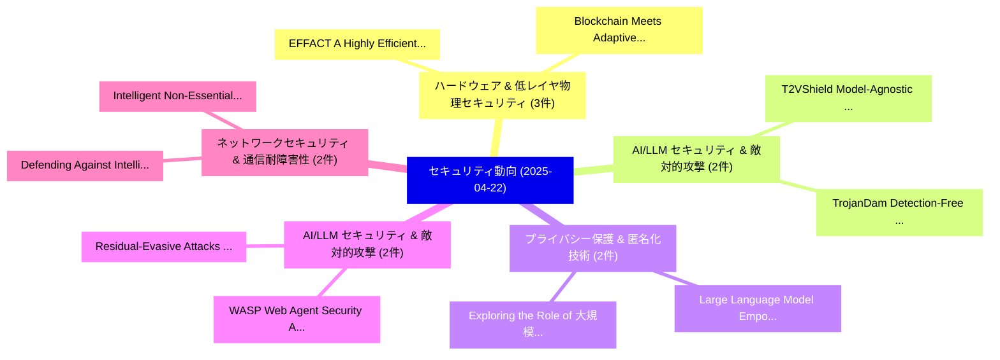

# 📅 02_daily: 日次エグゼクティブサマリー報告書 (2025-04-22)

**集計日時**: 2026-10-02 23:05:23 UTC  
**対象日付**: 2025-04-22  
**本日収集論文数**: 30 件  

---

## 💡 主要セキュリティ動向・脅威インサイト (Executive Insights)

本日の収集論文（計 30 件）において、以下の重点セキュリティ領域で活発な研究動向が確認されました：
- **ハードウェア & 低レイヤ物理セキュリティ** (3 件): 注目論文として 「EFFACT: A Highly Efficient Ful...」、「Blockchain Meets Adaptive Hone...」 等が発表され、実務防御および攻撃検証の進展が見られます。
- **AI/LLM セキュリティ & 敵対的攻撃** (2 件): 注目論文として 「T2VShield: Model-Agnostic Jail...」、「TrojanDam: Detection-Free Back...」 等が発表され、実務防御および攻撃検証の進展が見られます。
- **プライバシー保護 & 匿名化技術** (2 件): 注目論文として 「Exploring the Role of 大規模言語モデル...」、「Large Language Model Empowered...」 等が発表され、実務防御および攻撃検証の進展が見られます。
- **AI/LLM セキュリティ & 敵対的攻撃** (2 件): 注目論文として 「Residual-Evasive Attacks on AD...」、「WASP: Web Agent Security Again...」 等が発表され、実務防御および攻撃検証の進展が見られます。
- **ネットワークセキュリティ & 通信耐障害性** (2 件): 注目論文として 「Intelligent Non-Essential IoT ...」、「Defending Against Intelligent ...」 等が発表され、実務防御および攻撃検証の進展が見られます。

### 🗺️ 技術・脅威トピックマインドマップ

---

## 📌 日次セキュリティ論文一覧 (日本語表形式)

| No | arXiv ID | 論文タイトル (日本語訳) | 重要キーワード | 構造化エグゼクティブ要約 (背景・提案・影響) | 脅威分類 | 詳細リンク |
|---|---|---|---|---|---|---|
| 1 | `2504.15497v1` | [Scalable APT Malware Classification via Parallel Feature Extraction and GPU-Accelerated Learning（セキュリティ分析論文）](../../okf/papers/2025-04-22/2504.15497.md) | `Parallel Feature Extraction`, `Malware Classification`, `Accelerated Learning` | 【提案】概要 (Overview & Key Finding) 本論文「Scalable APT マルウェア Classification via Parallel Feature ...。実証評価により経営層・セキュリティ管理者向け推奨アクション (E... | `cs.CR` | [arXiv](https://arxiv.org/abs/2504.15497v1) &#124; [OKF](../../okf/papers/2025-04-22/2504.15497.md) |
| 2 | `2504.15499v1` | [Guillotine: Hypervisors for Isolating Malicious AIs（セキュリティ分析論文）](../../okf/papers/2025-04-22/2504.15499.md) | `Isolating Malicious`, `James Mickens`, `Sarah Radway` | 【提案】概要 (Overview & Key Finding) 本論文「Guillotine: Hypervisors for Isolating Malicious AIs（セキュ...。実証評価により経営層・セキュリティ管理者向け推奨アクション (E... | `cs.CR` | [arXiv](https://arxiv.org/abs/2504.15499v1) &#124; [OKF](../../okf/papers/2025-04-22/2504.15499.md) |
| 3 | `2504.15512v2` | [T2VShield: Model-Agnostic Jailbreak Defense for Text-to-Video Models（セキュリティ分析論文）](../../okf/papers/2025-04-22/2504.15512.md) | `Agnostic Jailbreak Defense`, `Video Models`, `Model-Agnostic Jailbreak` | 【提案】概要 (Overview & Key Finding) 本論文「T2VShield: Model-Agnostic ジェイルブレイク Defense for Text-to-...。実証評価により経営層・セキュリティ管理者向け推奨アクション (E... | `cs.CR` | [arXiv](https://arxiv.org/abs/2504.15512v2) &#124; [OKF](../../okf/papers/2025-04-22/2504.15512.md) |
| 4 | `2504.15565v1` | [DecETT: Accurate App Fingerprinting Under Encrypted Tunnels via Dual Decouple-based Semantic Enhancement（セキュリティ分析論文）](../../okf/papers/2025-04-22/2504.15565.md) | `Dual Decouple`, `Semantic Enhancement`, `Decouple-based Semantic` | 【提案】概要 (Overview & Key Finding) 本論文「DecETT: Accurate App Fingerprinting Under Encrypted Tun...。実証評価により経営層・セキュリティ管理者向け推奨アクション (E... | `cs.CR` | [arXiv](https://arxiv.org/abs/2504.15565v1) &#124; [OKF](../../okf/papers/2025-04-22/2504.15565.md) |
| 5 | `2504.15580v1` | [On the Price of Differential Privacy for Hierarchical Clustering（セキュリティ分析論文）](../../okf/papers/2025-04-22/2504.15580.md) | `Differential Privacy`, `Hierarchical Clustering`, `Chengyuan Deng` | 【提案】概要 (Overview & Key Finding) 本論文「On the Price of 差分プライバシー for Hierarchical Clustering（セキ...。実証評価により経営層・セキュリティ管理者向け推奨アクション (E... | `cs.CR` | [arXiv](https://arxiv.org/abs/2504.15580v1) &#124; [OKF](../../okf/papers/2025-04-22/2504.15580.md) |
| 6 | `2504.15585v4` | [A Comprehensive Survey in LLM(-Agent) Full Stack Safety: Data, Training and Deployment（セキュリティ分析論文）](../../okf/papers/2025-04-22/2504.15585.md) | `Full Stack Safety`, `Comprehensive Survey`, `Kun Wang` | 【提案】概要 (Overview & Key Finding) 本論文「A Comprehensive Survey in LLM(-Agent) Full Stack Safety...。実証評価により経営層・セキュリティ管理者向け推奨アクション (E... | `cs.CR` | [arXiv](https://arxiv.org/abs/2504.15585v4) &#124; [OKF](../../okf/papers/2025-04-22/2504.15585.md) |
| 7 | `2504.15592v2` | [Yet Another Diminishing Spark: Low-level Cyberattacks in the Israel-Gaza Conflict（セキュリティ分析論文）](../../okf/papers/2025-04-22/2504.15592.md) | `Yet Another Diminishing Spark`, `Gaza Conflict`, `Low-level Cyberattacks` | 【提案】概要 (Overview & Key Finding) 本論文「Yet Another Diminishing Spark: Low-level Cyberattacks i...。実証評価により経営層・セキュリティ管理者向け推奨アクション (E... | `cs.CR` | [arXiv](https://arxiv.org/abs/2504.15592v2) &#124; [OKF](../../okf/papers/2025-04-22/2504.15592.md) |
| 8 | `2504.15622v2` | [Exploring the Role of 大規模言語モデル in Cybersecurity: A Systematic Survey](../../okf/papers/2025-04-22/2504.15622.md) | `Systematic Survey`, `Large Language Models`, `Shuang Tian` | 【提案】概要 (Overview & Key Finding) 本論文「Exploring the Role of 大規模言語モデル in Cybersecurity: A Syst...。実証評価により経営層・セキュリティ管理者向け推奨アクション (E... | `cs.CR` | [arXiv](https://arxiv.org/abs/2504.15622v2) &#124; [OKF](../../okf/papers/2025-04-22/2504.15622.md) |
| 9 | `2504.15632v3` | [A Study on Mixup-Inspired Augmentation Methods for Software 脆弱性検出](../../okf/papers/2025-04-22/2504.15632.md) | `Inspired Augmentation Methods`, `Mixup-Inspired Augmentation`, `Software Vulnerability Detection` | 【提案】概要 (Overview & Key Finding) 本論文「A Study on Mixup-Inspired Augmentation Methods for Soft...。実証評価により経営層・セキュリティ管理者向け推奨アクション (E... | `cs.CR` | [arXiv](https://arxiv.org/abs/2504.15632v3) &#124; [OKF](../../okf/papers/2025-04-22/2504.15632.md) |
| 10 | `2504.15674v1` | [TrojanDam: Detection-Free Backdoor Defense in 連合学習 through Proactive Model Robustification utilizing OOD Data](../../okf/papers/2025-04-22/2504.15674.md) | `Free Backdoor Defense`, `Proactive Model Robustification`, `Detection-Free Backdoor` | 【提案】概要 (Overview & Key Finding) 本論文「TrojanDam: Detection-Free Backdoor Defense in 連合学習 thro...。実証評価により経営層・セキュリティ管理者向け推奨アクション (E... | `cs.CR` | [arXiv](https://arxiv.org/abs/2504.15674v1) &#124; [OKF](../../okf/papers/2025-04-22/2504.15674.md) |
| 11 | `2504.15676v1` | [Trustworthy Decentralized Autonomous Machines: A New Paradigm in Automation Economy（セキュリティ分析論文）](../../okf/papers/2025-04-22/2504.15676.md) | `Trustworthy Decentralized Autonomous Machines`, `New Paradigm`, `Automation Economy` | 【提案】概要 (Overview & Key Finding) 本論文「Trustworthy Decentralized Autonomous Machines: A New Pa...。実証評価により経営層・セキュリティ管理者向け推奨アクション (E... | `cs.CR` | [arXiv](https://arxiv.org/abs/2504.15676v1) &#124; [OKF](../../okf/papers/2025-04-22/2504.15676.md) |
| 12 | `2504.15695v3` | [A Time Series Malware Uploads to Programming Language Ecosystemsの分析](../../okf/papers/2025-04-22/2504.15695.md) | `Time Series Malware Uploads`, `Programming Language Ecosystems`, `Malware Uploads` | 【提案】概要 (Overview & Key Finding) 本論文「A Time Series マルウェア Uploads to Programming Language Eco...。実証評価により経営層・セキュリティ管理者向け推奨アクション (E... | `cs.CR` | [arXiv](https://arxiv.org/abs/2504.15695v3) &#124; [OKF](../../okf/papers/2025-04-22/2504.15695.md) |
| 13 | `2504.15717v2` | [Trusted Compute Units: A Framework for Chained Verifiable Computations（セキュリティ分析論文）](../../okf/papers/2025-04-22/2504.15717.md) | `Trusted Compute Units`, `Chained Verifiable Computations`, `Fernando Castillo` | 【提案】概要 (Overview & Key Finding) 本論文「Trusted Compute Units: A Framework for Chained Verifiab...。実証評価により経営層・セキュリティ管理者向け推奨アクション (E... | `cs.CR` | [arXiv](https://arxiv.org/abs/2504.15717v2) &#124; [OKF](../../okf/papers/2025-04-22/2504.15717.md) |
| 14 | `2504.15738v1` | [RRC Signaling Storm Detection in O-RAN（セキュリティ分析論文）](../../okf/papers/2025-04-22/2504.15738.md) | `Signaling Storm Detection`, `Dang Kien Nguyen`, `Rim El Malki` | 【提案】概要 (Overview & Key Finding) 本論文「RRC Signaling Storm Detection in O-RAN（セキュリティ分析論文）」（原題:...。実証評価により経営層・セキュリティ管理者向け推奨アクション (E... | `cs.CR` | [arXiv](https://arxiv.org/abs/2504.15738v1) &#124; [OKF](../../okf/papers/2025-04-22/2504.15738.md) |
| 15 | `2504.15817v1` | [EFFACT: A Highly Efficient Full-Stack FHE Acceleration Platform（セキュリティ分析論文）](../../okf/papers/2025-04-22/2504.15817.md) | `Highly Efficient Full`, `Acceleration Platform`, `Full-Stack FHE` | 【提案】概要 (Overview & Key Finding) 本論文「EFFACT: A Highly Efficient Full-Stack FHE Acceleration ...。実証評価により経営層・セキュリティ管理者向け推奨アクション (E... | `cs.CR` | [arXiv](https://arxiv.org/abs/2504.15817v1) &#124; [OKF](../../okf/papers/2025-04-22/2504.15817.md) |
| 16 | `2504.15822v1` | [Quantifying Source Speaker Leakage in One-to-One Voice Conversion（セキュリティ分析論文）](../../okf/papers/2025-04-22/2504.15822.md) | `Quantifying Source Speaker Leakage`, `One Voice Conversion`, `Scott Wellington` | 【提案】概要 (Overview & Key Finding) 本論文「Quantifying Source Speaker Leakage in One-to-One Voice ...。実証評価により経営層・セキュリティ管理者向け推奨アクション (E... | `cs.CR` | [arXiv](https://arxiv.org/abs/2504.15822v1) &#124; [OKF](../../okf/papers/2025-04-22/2504.15822.md) |
| 17 | `2504.15880v2` | [On key exchange protocol based on Two-side multiplication action（セキュリティ分析論文）](../../okf/papers/2025-04-22/2504.15880.md) | `Two-side multiplication`, `Alvaro Otero Sanchez`, `Raw Meta` | 【提案】概要 (Overview & Key Finding) 本論文「On key exchange protocol based on Two-side multiplicati...。実証評価により経営層・セキュリティ管理者向け推奨アクション (E... | `cs.CR` | [arXiv](https://arxiv.org/abs/2504.15880v2) &#124; [OKF](../../okf/papers/2025-04-22/2504.15880.md) |
| 18 | `2504.15942v1` | [Adversarial Observations in Weather Forecasting（セキュリティ分析論文）](../../okf/papers/2025-04-22/2504.15942.md) | `Adversarial Observations`, `Weather Forecasting`, `Erik Imgrund` | 【提案】概要 (Overview & Key Finding) 本論文「Adversarial Observations in Weather Forecasting（セキュリティ分...。実証評価により経営層・セキュリティ管理者向け推奨アクション (E... | `cs.CR` | [arXiv](https://arxiv.org/abs/2504.15942v1) &#124; [OKF](../../okf/papers/2025-04-22/2504.15942.md) |
| 19 | `2504.15949v2` | [Structural Properties of Non-Linear Cellular Automata: Permutivity, Surjectivity and Reversibility（セキュリティ分析論文）](../../okf/papers/2025-04-22/2504.15949.md) | `Linear Cellular Automata`, `Structural Properties`, `Non-Linear Cellular` | 【提案】概要 (Overview & Key Finding) 本論文「Structural Properties of Non-Linear Cellular Automata: ...。実証評価により経営層・セキュリティ管理者向け推奨アクション (E... | `cs.CR` | [arXiv](https://arxiv.org/abs/2504.15949v2) &#124; [OKF](../../okf/papers/2025-04-22/2504.15949.md) |
| 20 | `2504.16000v1` | [How Private is Your Attention? Bridging Privacy with In-Context Learning（セキュリティ分析論文）](../../okf/papers/2025-04-22/2504.16000.md) | `Bridging Privacy`, `Context Learning`, `In-Context Learning` | 【提案】Bridging Privacy with In-Context Learning ### (日本語題名: How Private is Your Attention?。実証評価により経営層・セキュリティ管理者向け推奨アクション (Executi... | `cs.CR` | [arXiv](https://arxiv.org/abs/2504.16000v1) &#124; [OKF](../../okf/papers/2025-04-22/2504.16000.md) |
| 21 | `2504.16057v5` | [Neuro-symbolic Static Analysis with LLM-generated Vulnerability Patterns（セキュリティ分析論文）](../../okf/papers/2025-04-22/2504.16057.md) | `Vulnerability Patterns`, `Neuro-symbolic Static`, `LLM-generated Vulnerability` | 【提案】概要 (Overview & Key Finding) 本論文「Neuro-symbolic Static Analysis with LLM-generated 脆弱性 P...。実証評価により経営層・セキュリティ管理者向け推奨アクション (E... | `cs.CR` | [arXiv](https://arxiv.org/abs/2504.16057v5) &#124; [OKF](../../okf/papers/2025-04-22/2504.16057.md) |
| 22 | `2504.16219v1` | [ReGraph: A Tool for Binary Similarity Identification（セキュリティ分析論文）](../../okf/papers/2025-04-22/2504.16219.md) | `Binary Similarity Identification`, `Li Zhou`, `Marc Dacier` | 【提案】概要 (Overview & Key Finding) 本論文「ReGraph: A Tool for Binary Similarity Identification（セキ...。実証評価により経営層・セキュリティ管理者向け推奨アクション (E... | `cs.CR` | [arXiv](https://arxiv.org/abs/2504.16219v1) &#124; [OKF](../../okf/papers/2025-04-22/2504.16219.md) |
| 23 | `2504.16226v1` | [Blockchain Meets Adaptive Honeypots: A Trust-Aware Approach to Next-Gen IoT Security（セキュリティ分析論文）](../../okf/papers/2025-04-22/2504.16226.md) | `Blockchain Meets Adaptive Honeypots`, `Next-Gen IoT`, `Yazan Otoum` | 【提案】概要 (Overview & Key Finding) 本論文「Blockchain Meets Adaptive Honeypots: A Trust-Aware Appr...。実証評価により経営層・セキュリティ管理者向け推奨アクション (E... | `cs.CR` | [arXiv](https://arxiv.org/abs/2504.16226v1) &#124; [OKF](../../okf/papers/2025-04-22/2504.16226.md) |
| 24 | `2504.16251v3` | [Adaptive and Efficient Dynamic Memory Management for Hardware Enclaves（セキュリティ分析論文）](../../okf/papers/2025-04-22/2504.16251.md) | `Efficient Dynamic Memory Management`, `Hardware Enclaves`, `Harpreet Singh Chawla` | 【提案】概要 (Overview & Key Finding) 本論文「Adaptive and Efficient Dynamic Memory Management for Ha...。実証評価により経営層・セキュリティ管理者向け推奨アクション (E... | `cs.CR` | [arXiv](https://arxiv.org/abs/2504.16251v3) &#124; [OKF](../../okf/papers/2025-04-22/2504.16251.md) |
| 25 | `2504.16316v2` | [On the Consistency of GNN Explanations for マルウェア検出](../../okf/papers/2025-04-22/2504.16316.md) | `Malware Detection`, `Hossein Shokouhinejad`, `Griffin Higgins` | 【提案】概要 (Overview & Key Finding) 本論文「On the Consistency of GNN Explanations for マルウェア検出」（原題:...。実証評価によりGhorbani - **公開日時**: `202... | `cs.CR` | [arXiv](https://arxiv.org/abs/2504.16316v2) &#124; [OKF](../../okf/papers/2025-04-22/2504.16316.md) |
| 26 | `2504.18569v1` | [Large Language Model Empowered Privacy-Protected Framework for PHI Annotation in Clinical Notes（セキュリティ分析論文）](../../okf/papers/2025-04-22/2504.18569.md) | `Large Language Model Empowered Privacy`, `Clinical Notes`, `Guanchen Wu` | 【提案】概要 (Overview & Key Finding) 本論文「Large Language Model Empowered Privacy-Protected Framew...。実証評価により経営層・セキュリティ管理者向け推奨アクション (E... | `cs.CR` | [arXiv](https://arxiv.org/abs/2504.18569v1) &#124; [OKF](../../okf/papers/2025-04-22/2504.18569.md) |
| 27 | `2504.18570v1` | [Residual-Evasive Attacks on ADMM in Distributed Optimization（セキュリティ分析論文）](../../okf/papers/2025-04-22/2504.18570.md) | `Evasive Attacks`, `Distributed Optimization`, `Residual-Evasive Attacks` | 【提案】概要 (Overview & Key Finding) 本論文「Residual-Evasive Attacks on ADMM in Distributed Optimiz...。実証評価により経営層・セキュリティ管理者向け推奨アクション (E... | `cs.CR` | [arXiv](https://arxiv.org/abs/2504.18570v1) &#124; [OKF](../../okf/papers/2025-04-22/2504.18570.md) |
| 28 | `2504.18571v1` | [Intelligent Non-Essential IoT Traffic on the Home Gatewayの検出](../../okf/papers/2025-04-22/2504.18571.md) | `Non-Essential IoT`, `Intelligent Detection`, `Home Gateway` | 【提案】概要 (Overview & Key Finding) 本論文「Intelligent Non-Essential IoT Traffic on the Home Gatew...。実証評価により経営層・セキュリティ管理者向け推奨アクション (E... | `cs.CR` | [arXiv](https://arxiv.org/abs/2504.18571v1) &#124; [OKF](../../okf/papers/2025-04-22/2504.18571.md) |
| 29 | `2504.18575v3` | [WASP: Web Agent Security Against Prompt Injection Attacksのベンチマーク評価](../../okf/papers/2025-04-22/2504.18575.md) | `Ivan Evtimov`, `Arman Zharmagambetov`, `Aaron Grattafiori` | 【提案】概要 (Overview & Key Finding) 本論文「WASP: Web Agent Security Against プロンプトインジェクション Attacksの...。実証評価により経営層・セキュリティ管理者向け推奨アクション (E... | `cs.CR` | [arXiv](https://arxiv.org/abs/2504.18575v3) &#124; [OKF](../../okf/papers/2025-04-22/2504.18575.md) |
| 30 | `2504.18577v1` | [Defending Against Intelligent Attackers at Large Scales（セキュリティ分析論文）](../../okf/papers/2025-04-22/2504.18577.md) | `Large Scales`, `Raw Meta`, `Executive Summary` | 【提案】概要 (Overview & Key Finding) 本論文「Defending Against Intelligent Attackers at Large Scales...。実証評価によりLohn - **公開日時**: `2025-04... | `cs.CR` | [arXiv](https://arxiv.org/abs/2504.18577v1) &#124; [OKF](../../okf/papers/2025-04-22/2504.18577.md) |

