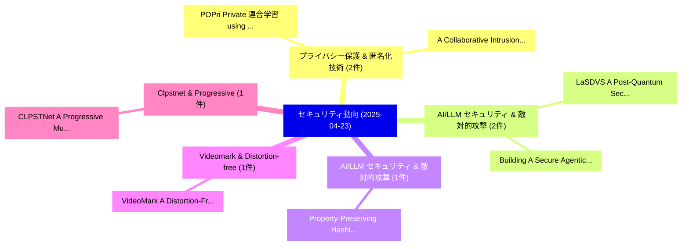

# 📅 02_daily: 日次エグゼクティブサマリー報告書 (2025-04-23)

**集計日時**: 2026-10-02 23:05:23 UTC  
**対象日付**: 2025-04-23  
**本日収集論文数**: 24 件  

---

## 💡 主要セキュリティ動向・脅威インサイト (Executive Insights)

本日の収集論文（計 24 件）において、以下の重点セキュリティ領域で活発な研究動向が確認されました：
- **プライバシー保護 & 匿名化技術** (2 件): 注目論文として 「POPri: Private 連合学習 using Pref...」、「A Collaborative Intrusion Dete...」 等が発表され、実務防御および攻撃検証の進展が見られます。
- **AI/LLM セキュリティ & 敵対的攻撃** (2 件): 注目論文として 「LaSDVS : A Post-Quantum Secure...」、「Building A Secure Agentic AI A...」 等が発表され、実務防御および攻撃検証の進展が見られます。
- **AI/LLM セキュリティ & 敵対的攻撃** (1 件): 注目論文として 「Property-Preserving Hashing fo...」 等が発表され、実務防御および攻撃検証の進展が見られます。
- **Videomark & Distortion-free** (1 件): 注目論文として 「VideoMark: A Distortion-Free R...」 等が発表され、実務防御および攻撃検証の進展が見られます。
- **Clpstnet & Progressive** (1 件): 注目論文として 「CLPSTNet: A Progressive Multi-...」 等が発表され、実務防御および攻撃検証の進展が見られます。

### 🗺️ 技術・脅威トピックマインドマップ

---

## 📌 日次セキュリティ論文一覧 (日本語表形式)

| No | arXiv ID | 論文タイトル (日本語訳) | 重要キーワード | 構造化エグゼクティブ要約 (背景・提案・影響) | 脅威分類 | 詳細リンク |
|---|---|---|---|---|---|---|
| 1 | `2504.16355v2` | [Property-Preserving Hashing for $\ell_1$-Distance Predicates: Applications to Countering Adversarial Input Attacks（セキュリティ分析論文）](../../okf/papers/2025-04-23/2504.16355.md) | `Countering Adversarial Input Attacks`, `Preserving Hashing`, `Property-Preserving Hashing` | 【提案】概要 (Overview & Key Finding) 本論文「Property-Preserving Hashing for $\ell_1$-Distance Predi...。実証評価により経営層・セキュリティ管理者向け推奨アクション (E... | `cs.CR` | [arXiv](https://arxiv.org/abs/2504.16355v2) &#124; [OKF](../../okf/papers/2025-04-23/2504.16355.md) |
| 2 | `2504.16359v3` | [VideoMark: A Distortion-Free Robust Watermarking Framework for Video Diffusion Models（セキュリティ分析論文）](../../okf/papers/2025-04-23/2504.16359.md) | `Video Diffusion Models`, `Distortion-Free Robust`, `Xuming Hu` | 【提案】概要 (Overview & Key Finding) 本論文「VideoMark: A Distortion-Free Robust Watermarking Framew...。実証評価により経営層・セキュリティ管理者向け推奨アクション (E... | `cs.CR` | [arXiv](https://arxiv.org/abs/2504.16359v3) &#124; [OKF](../../okf/papers/2025-04-23/2504.16359.md) |
| 3 | `2504.16364v1` | [CLPSTNet: A Progressive Multi-Scale Convolutional Steganography Model Integrating Curriculum Learning（セキュリティ分析論文）](../../okf/papers/2025-04-23/2504.16364.md) | `Scale Convolutional Steganography Model Integrating Curriculum Learning`, `Progressive Multi`, `Multi-Scale Convolutional` | 【提案】概要 (Overview & Key Finding) 本論文「CLPSTNet: A Progressive Multi-Scale Convolutional Stega...。実証評価により経営層・セキュリティ管理者向け推奨アクション (E... | `cs.CR` | [arXiv](https://arxiv.org/abs/2504.16364v1) &#124; [OKF](../../okf/papers/2025-04-23/2504.16364.md) |
| 4 | `2504.16407v2` | [Public-Key Quantum Fire and Key-Fire From Classical Oracles（セキュリティ分析論文）](../../okf/papers/2025-04-23/2504.16407.md) | `Key Quantum Fire`, `Public-Key Quantum`, `Vipul Goyal` | 【提案】概要 (Overview & Key Finding) 本論文「Public-Key 量子 Fire and Key-Fire From Classical Oracles（...。実証評価により経営層・セキュリティ管理者向け推奨アクション (E... | `cs.CR` | [arXiv](https://arxiv.org/abs/2504.16407v2) &#124; [OKF](../../okf/papers/2025-04-23/2504.16407.md) |
| 5 | `2504.16429v1` | [Give LLMs a Security Course: Retrieval-Augmented Code Generation via Knowledge Injectionのセキュリティ強化](../../okf/papers/2025-04-23/2504.16429.md) | `Augmented Code Generation`, `Security Course`, `Retrieval-Augmented Code` | 【提案】概要 (Overview & Key Finding) 本論文「Give LLMs a Security Course: Retrieval-Augmented Code G...。実証評価により経営層・セキュリティ管理者向け推奨アクション (E... | `cs.CR` | [arXiv](https://arxiv.org/abs/2504.16429v1) &#124; [OKF](../../okf/papers/2025-04-23/2504.16429.md) |
| 6 | `2504.16438v2` | [POPri: Private 連合学習 using Preference-Optimized Synthetic Data](../../okf/papers/2025-04-23/2504.16438.md) | `Optimized Synthetic Data`, `Preference-Optimized Synthetic`, `Private Federated Learning` | 【提案】概要 (Overview & Key Finding) 本論文「POPri: Private 連合学習 using Preference-Optimized Syntheti...。実証評価により経営層・セキュリティ管理者向け推奨アクション (E... | `cs.CR` | [arXiv](https://arxiv.org/abs/2504.16438v2) &#124; [OKF](../../okf/papers/2025-04-23/2504.16438.md) |
| 7 | `2504.16449v2` | [From Past to Present: A Survey of Malicious URL Detection Techniques, Datasets and Code Repositories（セキュリティ分析論文）](../../okf/papers/2025-04-23/2504.16449.md) | `Detection Techniques`, `Code Repositories`, `Ye Tian` | 【提案】概要 (Overview & Key Finding) 本論文「From Past to Present: A Survey of Malicious URL Detecti...。実証評価により経営層・セキュリティ管理者向け推奨アクション (E... | `cs.CR` | [arXiv](https://arxiv.org/abs/2504.16449v2) &#124; [OKF](../../okf/papers/2025-04-23/2504.16449.md) |
| 8 | `2504.16474v2` | [Seeking Flat Minima over Diverse Surrogates for Improved Adversarial Transferability: A Theoretical Framework and Algorithmic Instantiation（セキュリティ分析論文）](../../okf/papers/2025-04-23/2504.16474.md) | `Seeking Flat Minima`, `Improved Adversarial Transferability`, `Diverse Surrogates` | 【提案】概要 (Overview & Key Finding) 本論文「Seeking Flat Minima over Diverse Surrogates for Improve...。実証評価により経営層・セキュリティ管理者向け推奨アクション (E... | `cs.CR` | [arXiv](https://arxiv.org/abs/2504.16474v2) &#124; [OKF](../../okf/papers/2025-04-23/2504.16474.md) |
| 9 | `2504.16489v1` | [Amplified Vulnerabilities: Structured Jailbreak Attacks on LLM-based Multi-Agent Debate（セキュリティ分析論文）](../../okf/papers/2025-04-23/2504.16489.md) | `Structured Jailbreak Attacks`, `Amplified Vulnerabilities`, `Agent Debate` | 【提案】概要 (Overview & Key Finding) 本論文「Amplified Vulnerabilities: Structured ジェイルブレイク Attacks ...。実証評価により経営層・セキュリティ管理者向け推奨アクション (E... | `cs.CR` | [arXiv](https://arxiv.org/abs/2504.16489v1) &#124; [OKF](../../okf/papers/2025-04-23/2504.16489.md) |
| 10 | `2504.16550v1` | [A Collaborative Intrusion Detection System Using Snort IDS Nodes（セキュリティ分析論文）](../../okf/papers/2025-04-23/2504.16550.md) | `Collaborative Intrusion Detection System Using Snort`, `Max Hashem Eiza`, `Tom Davies` | 【提案】概要 (Overview & Key Finding) 本論文「A Collaborative Intrusion Detection System Using Snort ...。実証評価により経営層・セキュリティ管理者向け推奨アクション (E... | `cs.CR` | [arXiv](https://arxiv.org/abs/2504.16550v1) &#124; [OKF](../../okf/papers/2025-04-23/2504.16550.md) |
| 11 | `2504.16571v2` | [LaSDVS : A Post-Quantum Secure Compact Strong-Designated Verifier Signature（セキュリティ分析論文）](../../okf/papers/2025-04-23/2504.16571.md) | `Quantum Secure Compact Strong`, `Designated Verifier Signature`, `Post-Quantum Secure` | 【提案】概要 (Overview & Key Finding) 本論文「LaSDVS : A Post-量子 Secure Compact Strong-Designated Ver...。実証評価により経営層・セキュリティ管理者向け推奨アクション (E... | `cs.CR` | [arXiv](https://arxiv.org/abs/2504.16571v2) &#124; [OKF](../../okf/papers/2025-04-23/2504.16571.md) |
| 12 | `2504.16584v1` | [Case Study: Fine-tuning Small Language Models for Accurate and Private CWE Detection in Python Code（セキュリティ分析論文）](../../okf/papers/2025-04-23/2504.16584.md) | `Small Language Models`, `Fine-tuning Small`, `Python Code` | 【提案】概要 (Overview & Key Finding) 本論文「Case Study: Fine-tuning Small Language Models for Accur...。実証評価により経営層・セキュリティ管理者向け推奨アクション (E... | `cs.CR` | [arXiv](https://arxiv.org/abs/2504.16584v1) &#124; [OKF](../../okf/papers/2025-04-23/2504.16584.md) |
| 13 | `2504.16617v1` | [Security Science (SecSci), Basic Concepts and Mathematical Foundations（セキュリティ分析論文）](../../okf/papers/2025-04-23/2504.16617.md) | `Security Science`, `Basic Concepts`, `Mathematical Foundations` | 【提案】概要 (Overview & Key Finding) 本論文「Security Science (SecSci), Basic Concepts and Mathemati...。実証評価により経営層・セキュリティ管理者向け推奨アクション (E... | `cs.CR` | [arXiv](https://arxiv.org/abs/2504.16617v1) &#124; [OKF](../../okf/papers/2025-04-23/2504.16617.md) |
| 14 | `2504.16651v4` | [MAYA: Addressing Inconsistencies in Generative Password Guessing through a Unified Benchmark（セキュリティ分析論文）](../../okf/papers/2025-04-23/2504.16651.md) | `Generative Password Guessing`, `Addressing Inconsistencies`, `Unified Benchmark` | 【提案】概要 (Overview & Key Finding) 本論文「MAYA: Addressing Inconsistencies in Generative Password...。実証評価により経営層・セキュリティ管理者向け推奨アクション (E... | `cs.CR` | [arXiv](https://arxiv.org/abs/2504.16651v4) &#124; [OKF](../../okf/papers/2025-04-23/2504.16651.md) |
| 15 | `2504.16695v1` | [CAIBA: Multicast Source Authentication for CAN Through Reactive Bit Flipping（セキュリティ分析論文）](../../okf/papers/2025-04-23/2504.16695.md) | `Multicast Source Authentication`, `Eric Wagner`, `Frederik Basels` | 【提案】概要 (Overview & Key Finding) 本論文「CAIBA: Multicast Source Authentication for CAN Through ...。実証評価により経営層・セキュリティ管理者向け推奨アクション (E... | `cs.CR` | [arXiv](https://arxiv.org/abs/2504.16695v1) &#124; [OKF](../../okf/papers/2025-04-23/2504.16695.md) |
| 16 | `2504.16709v1` | [Resource Reduction in Multiparty Quantum Secret Sharing of both Classical and Quantum Information under Noisy Scenario（セキュリティ分析論文）](../../okf/papers/2025-04-23/2504.16709.md) | `Multiparty Quantum Secret Sharing`, `Resource Reduction`, `Quantum Information` | 【提案】概要 (Overview & Key Finding) 本論文「Resource Reduction in Multiparty 量子 Secret Sharing of b...。実証評価により経営層・セキュリティ管理者向け推奨アクション (E... | `cs.CR` | [arXiv](https://arxiv.org/abs/2504.16709v1) &#124; [OKF](../../okf/papers/2025-04-23/2504.16709.md) |
| 17 | `2504.16743v1` | [Implementing AI Bill of Materials (AI BOM) with SPDX 3.0: A Comprehensive Guide to Creating AI and Dataset Bill of Materials（セキュリティ分析論文）](../../okf/papers/2025-04-23/2504.16743.md) | `Comprehensive Guide`, `Dataset Bill`, `Gopi Krishnan Rajbahadur` | 【提案】概要 (Overview & Key Finding) 本論文「Implementing AI Bill of Materials (AI BOM) with SPDX 3....。実証評価により経営層・セキュリティ管理者向け推奨アクション (E... | `cs.CR` | [arXiv](https://arxiv.org/abs/2504.16743v1) &#124; [OKF](../../okf/papers/2025-04-23/2504.16743.md) |
| 18 | `2504.16836v1` | [Snorkeling in dark waters: A longitudinal surface exploration of unique Tor Hidden Services (Extended Version)（セキュリティ分析論文）](../../okf/papers/2025-04-23/2504.16836.md) | `Tor Hidden Services`, `Extended Version`, `Alfonso Rodriguez Barredo` | 【提案】概要 (Overview & Key Finding) 本論文「Snorkeling in dark waters: A longitudinal surface explo...。実証評価により経営層・セキュリティ管理者向け推奨アクション (E... | `cs.CR` | [arXiv](https://arxiv.org/abs/2504.16836v1) &#124; [OKF](../../okf/papers/2025-04-23/2504.16836.md) |
| 19 | `2504.16887v2` | [The Sponge is Quantum Indifferentiable（セキュリティ分析論文）](../../okf/papers/2025-04-23/2504.16887.md) | `Quantum Indifferentiable`, `Gorjan Alagic`, `Joseph Carolan` | 【提案】概要 (Overview & Key Finding) 本論文「The Sponge is 量子 Indifferentiable（セキュリティ分析論文）」（原題: The ...。実証評価により経営層・セキュリティ管理者向け推奨アクション (E... | `cs.CR` | [arXiv](https://arxiv.org/abs/2504.16887v2) &#124; [OKF](../../okf/papers/2025-04-23/2504.16887.md) |
| 20 | `2504.16902v2` | [Building A Secure Agentic AI Application Leveraging A2A Protocol（セキュリティ分析論文）](../../okf/papers/2025-04-23/2504.16902.md) | `Secure Agentic`, `Application Leveraging`, `Vineeth Sai Narajala` | 【提案】概要 (Overview & Key Finding) 本論文「Building A Secure Agentic AI Application Leveraging A2A...。実証評価により経営層・セキュリティ管理者向け推奨アクション (E... | `cs.CR` | [arXiv](https://arxiv.org/abs/2504.16902v2) &#124; [OKF](../../okf/papers/2025-04-23/2504.16902.md) |
| 21 | `2504.17059v1` | [Integrating Graph Theoretical Approaches in サイバーセキュリティ Education CSCI-RTED](../../okf/papers/2025-04-23/2504.17059.md) | `Integrating Graph Theoretical Approaches`, `Cybersecurity Education`, `Goksel Kucukkaya` | 【提案】概要 (Overview & Key Finding) 本論文「Integrating Graph Theoretical Approaches in サイバーセキュリティ ...。実証評価により経営層・セキュリティ管理者向け推奨アクション (E... | `cs.CR` | [arXiv](https://arxiv.org/abs/2504.17059v1) &#124; [OKF](../../okf/papers/2025-04-23/2504.17059.md) |
| 22 | `2504.17121v2` | [Evaluating Argon2 Adoption and Effectiveness in Real-World Software（セキュリティ分析論文）](../../okf/papers/2025-04-23/2504.17121.md) | `Evaluating Argon2 Adoption`, `World Software`, `Real-World Software` | 【提案】概要 (Overview & Key Finding) 本論文「Evaluating Argon2 Adoption and Effectiveness in Real-Wo...。実証評価により# Evaluating Argon2 Adopt... | `cs.CR` | [arXiv](https://arxiv.org/abs/2504.17121v2) &#124; [OKF](../../okf/papers/2025-04-23/2504.17121.md) |
| 23 | `2504.17130v3` | [Steering the CensorShip: Uncovering Representation Vectors for LLM "Thought" Control（セキュリティ分析論文）](../../okf/papers/2025-04-23/2504.17130.md) | `Uncovering Representation Vectors`, `Hannah Cyberey`, `David Evans` | 【提案】概要 (Overview & Key Finding) 本論文「Steering the CensorShip: Uncovering Representation Vect...。実証評価により経営層・セキュリティ管理者向け推奨アクション (E... | `cs.CR` | [arXiv](https://arxiv.org/abs/2504.17130v3) &#124; [OKF](../../okf/papers/2025-04-23/2504.17130.md) |
| 24 | `2504.18581v2` | [Enhancing Privacy in Semantic Communication over Wiretap Channels leveraging Differential Privacy（セキュリティ分析論文）](../../okf/papers/2025-04-23/2504.18581.md) | `Enhancing Privacy`, `Semantic Communication`, `Wiretap Channels` | 【提案】概要 (Overview & Key Finding) 本論文「Enhancing Privacy in Semantic Communication over Wireta...。実証評価により経営層・セキュリティ管理者向け推奨アクション (E... | `cs.CR` | [arXiv](https://arxiv.org/abs/2504.18581v2) &#124; [OKF](../../okf/papers/2025-04-23/2504.18581.md) |

