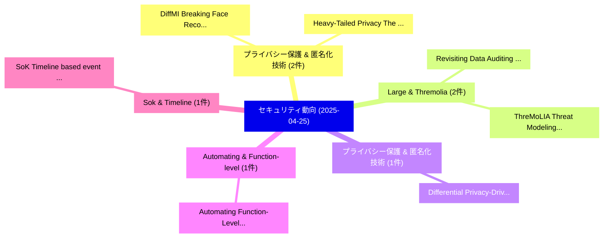

# 📅 02_daily: 日次エグゼクティブサマリー報告書 (2025-04-25)

**集計日時**: 2026-10-02 23:05:23 UTC  
**対象日付**: 2025-04-25  
**本日収集論文数**: 18 件  

---

## 💡 主要セキュリティ動向・脅威インサイト (Executive Insights)

本日の収集論文（計 18 件）において、以下の重点セキュリティ領域で活発な研究動向が確認されました：
- **プライバシー保護 & 匿名化技術** (2 件): 注目論文として 「DiffMI: Breaking Face Recognit...」、「Heavy-Tailed Privacy: The Symm...」 等が発表され、実務防御および攻撃検証の進展が見られます。
- **Large & Thremolia** (2 件): 注目論文として 「Revisiting Data Auditing in La...」、「ThreMoLIA: Threat Modeling of ...」 等が発表され、実務防御および攻撃検証の進展が見られます。
- **プライバシー保護 & 匿名化技術** (1 件): 注目論文として 「Differential Privacy-Driven Fr...」 等が発表され、実務防御および攻撃検証の進展が見られます。
- **Automating & Function-level** (1 件): 注目論文として 「Automating Function-Level TARA...」 等が発表され、実務防御および攻撃検証の進展が見られます。
- **Sok & Timeline** (1 件): 注目論文として 「SoK: Timeline based event reco...」 等が発表され、実務防御および攻撃検証の進展が見られます。

### 🗺️ 技術・脅威トピックマインドマップ

---

## 📌 日次セキュリティ論文一覧 (日本語表形式)

| No | arXiv ID | 論文タイトル (日本語訳) | 重要キーワード | 構造化エグゼクティブ要約 (背景・提案・影響) | 脅威分類 | 詳細リンク |
|---|---|---|---|---|---|---|
| 1 | `2504.18007v1` | [Differential Privacy-Driven Framework for Enhancing Heart Disease Prediction（セキュリティ分析論文）](../../okf/papers/2025-04-25/2504.18007.md) | `Enhancing Heart Disease Prediction`, `Differential Privacy`, `Yazan Otoum` | 【提案】概要 (Overview & Key Finding) 本論文「差分プライバシー-Driven Framework for Enhancing Heart Disease P...。実証評価により経営層・セキュリティ管理者向け推奨アクション (E... | `cs.CR` | [arXiv](https://arxiv.org/abs/2504.18007v1) &#124; [OKF](../../okf/papers/2025-04-25/2504.18007.md) |
| 2 | `2504.18015v4` | [DiffMI: Breaking Face Recognition Privacy via Diffusion-Driven Training-Free Model Inversion（セキュリティ分析論文）](../../okf/papers/2025-04-25/2504.18015.md) | `Breaking Face Recognition Privacy`, `Free Model Inversion`, `Driven Training` | 【提案】概要 (Overview & Key Finding) 本論文「DiffMI: Breaking Face Recognition Privacy via Diffusion...。実証評価により経営層・セキュリティ管理者向け推奨アクション (E... | `cs.CR` | [arXiv](https://arxiv.org/abs/2504.18015v4) &#124; [OKF](../../okf/papers/2025-04-25/2504.18015.md) |
| 3 | `2504.18083v1` | [Automating Function-Level TARA for Automotive Full-Lifecycle Security（セキュリティ分析論文）](../../okf/papers/2025-04-25/2504.18083.md) | `Automating Function`, `Automotive Full`, `Lifecycle Security` | 【提案】概要 (Overview & Key Finding) 本論文「Automating Function-Level TARA for Automotive Full-Life...。実証評価により経営層・セキュリティ管理者向け推奨アクション (E... | `cs.CR` | [arXiv](https://arxiv.org/abs/2504.18083v1) &#124; [OKF](../../okf/papers/2025-04-25/2504.18083.md) |
| 4 | `2504.18131v1` | [SoK: Timeline based event reconstruction for digital forensics: Terminology, methodology, and current challenges（セキュリティ分析論文）](../../okf/papers/2025-04-25/2504.18131.md) | `Frank Breitinger`, `Hudan Studiawan`, `Chris Hargreaves` | 【提案】概要 (Overview & Key Finding) 本論文「SoK: Timeline based event reconstruction for digital fo...。実証評価により経営層・セキュリティ管理者向け推奨アクション (E... | `cs.CR` | [arXiv](https://arxiv.org/abs/2504.18131v1) &#124; [OKF](../../okf/papers/2025-04-25/2504.18131.md) |
| 5 | `2504.18147v1` | [NoEsis: Differentially Private Knowledge Transfer in Modular LLM Adaptation（セキュリティ分析論文）](../../okf/papers/2025-04-25/2504.18147.md) | `Differentially Private Knowledge Transfer`, `Ali Shahin Shamsabadi`, `Rob Romijnders` | 【提案】概要 (Overview & Key Finding) 本論文「NoEsis: Differentially Private Knowledge Transfer in Mo...。実証評価により経営層・セキュリティ管理者向け推奨アクション (E... | `cs.CR` | [arXiv](https://arxiv.org/abs/2504.18147v1) &#124; [OKF](../../okf/papers/2025-04-25/2504.18147.md) |
| 6 | `2504.18188v1` | [Quantum Lifting for Invertible Permutations and Ideal Ciphers（セキュリティ分析論文）](../../okf/papers/2025-04-25/2504.18188.md) | `Quantum Lifting`, `Invertible Permutations`, `Ideal Ciphers` | 【提案】概要 (Overview & Key Finding) 本論文「量子 Lifting for Invertible Permutations and Ideal Cipher...。実証評価により経営層・セキュリティ管理者向け推奨アクション (E... | `cs.CR` | [arXiv](https://arxiv.org/abs/2504.18188v1) &#124; [OKF](../../okf/papers/2025-04-25/2504.18188.md) |
| 7 | `2504.18333v1` | [LLM-as-a-Judge Systems: Insights from Prompt Injectionsに対する敵対的攻撃](../../okf/papers/2025-04-25/2504.18333.md) | `Judge Systems`, `a-Judge Systems`, `Adversarial Attacks` | 【提案】概要 (Overview & Key Finding) 本論文「LLM-as-a-Judge Systems: Insights from プロンプトインジェクションsに対す...。実証評価により経営層・セキュリティ管理者向け推奨アクション (E... | `cs.CR` | [arXiv](https://arxiv.org/abs/2504.18333v1) &#124; [OKF](../../okf/papers/2025-04-25/2504.18333.md) |
| 8 | `2504.18348v1` | [TSCL:Multi-party loss Balancing scheme for deep learning Image steganography based on Curriculum learning（セキュリティ分析論文）](../../okf/papers/2025-04-25/2504.18348.md) | `Multi-party loss`, `Fengchun Liu`, `Tong Zhang` | 【提案】概要 (Overview & Key Finding) 本論文「TSCL:Multi-party loss Balancing scheme for deep learnin...。実証評価により経営層・セキュリティ管理者向け推奨アクション (E... | `cs.CR` | [arXiv](https://arxiv.org/abs/2504.18348v1) &#124; [OKF](../../okf/papers/2025-04-25/2504.18348.md) |
| 9 | `2504.18349v1` | [Revisiting Data Auditing in Large Vision-Language Models（セキュリティ分析論文）](../../okf/papers/2025-04-25/2504.18349.md) | `Revisiting Data Auditing`, `Large Vision`, `Language Models` | 【提案】概要 (Overview & Key Finding) 本論文「Revisiting Data Auditing in Large Vision-Language Model...。実証評価により経営層・セキュリティ管理者向け推奨アクション (E... | `cs.CR` | [arXiv](https://arxiv.org/abs/2504.18349v1) &#124; [OKF](../../okf/papers/2025-04-25/2504.18349.md) |
| 10 | `2504.18369v1` | [ThreMoLIA: Threat Modeling of Large Language Model-Integrated Applications（セキュリティ分析論文）](../../okf/papers/2025-04-25/2504.18369.md) | `Large Language Model`, `Threat Modeling`, `Integrated Applications` | 【提案】概要 (Overview & Key Finding) 本論文「ThreMoLIA: 脅威 Modeling of Large Language Model-Integrat...。実証評価により経営層・セキュリティ管理者向け推奨アクション (E... | `cs.CR` | [arXiv](https://arxiv.org/abs/2504.18369v1) &#124; [OKF](../../okf/papers/2025-04-25/2504.18369.md) |
| 11 | `2504.18375v1` | [Bandit on the Hunt: Dynamic Crawling for Cyber Threat Intelligence（セキュリティ分析論文）](../../okf/papers/2025-04-25/2504.18375.md) | `Cyber Threat Intelligence`, `Dynamic Crawling`, `Philipp Kuehn` | 【提案】概要 (Overview & Key Finding) 本論文「Bandit on the Hunt: Dynamic Crawling for Cyber 脅威 Intel...。実証評価により経営層・セキュリティ管理者向け推奨アクション (E... | `cs.CR` | [arXiv](https://arxiv.org/abs/2504.18375v1) &#124; [OKF](../../okf/papers/2025-04-25/2504.18375.md) |
| 12 | `2504.18411v1` | [Heavy-Tailed Privacy: The Symmetric alpha-Stable Privacy Mechanism（セキュリティ分析論文）](../../okf/papers/2025-04-25/2504.18411.md) | `Stable Privacy Mechanism`, `Tailed Privacy`, `Heavy-Tailed Privacy` | 【提案】概要 (Overview & Key Finding) 本論文「Heavy-Tailed Privacy: The Symmetric alpha-Stable Privac...。実証評価によりAbed - **公開日時**: `2025-。 | `cs.CR` | [arXiv](https://arxiv.org/abs/2504.18411v1) &#124; [OKF](../../okf/papers/2025-04-25/2504.18411.md) |
| 13 | `2504.18423v1` | [LLMpatronous: Harnessing the Power of LLMs For 脆弱性検出](../../okf/papers/2025-04-25/2504.18423.md) | `Rajesh Yarra`, `Raw Meta`, `Executive Summary` | 【提案】概要 (Overview & Key Finding) 本論文「LLMpatronous: Harnessing the Power of LLMs For 脆弱性検出」（原...。実証評価により経営層・セキュリティ管理者向け推奨アクション (E... | `cs.CR` | [arXiv](https://arxiv.org/abs/2504.18423v1) &#124; [OKF](../../okf/papers/2025-04-25/2504.18423.md) |
| 14 | `2504.18497v1` | [DeSIA: Attribute Inference Attacks Against Limited Fixed Aggregate Statistics（セキュリティ分析論文）](../../okf/papers/2025-04-25/2504.18497.md) | `Yifeng Mao`, `Bozhidar Stevanoski`, `Raw Meta` | 【提案】概要 (Overview & Key Finding) 本論文「DeSIA: Attribute Inference Attacks Against Limited Fixe...。実証評価により経営層・セキュリティ管理者向け推奨アクション (E... | `cs.CR` | [arXiv](https://arxiv.org/abs/2504.18497v1) &#124; [OKF](../../okf/papers/2025-04-25/2504.18497.md) |
| 15 | `2504.18608v1` | [ECG Identity Authentication in Open-set with Multi-model Pretraining and Self-constraint Center & Irrelevant Sample Repulsion Learning（セキュリティ分析論文）](../../okf/papers/2025-04-25/2504.18608.md) | `Irrelevant Sample Repulsion Learning`, `Identity Authentication`, `Multi-model Pretraining` | 【提案】概要 (Overview & Key Finding) 本論文「ECG Identity Authentication in Open-set with Multi-mode...。実証評価により経営層・セキュリティ管理者向け推奨アクション (E... | `cs.CR` | [arXiv](https://arxiv.org/abs/2504.18608v1) &#124; [OKF](../../okf/papers/2025-04-25/2504.18608.md) |
| 16 | `2504.18636v1` | [A Gradient-Optimized TSK Fuzzy Framework for Explainable Phishing Detection（セキュリティ分析論文）](../../okf/papers/2025-04-25/2504.18636.md) | `Explainable Phishing Detection`, `Gradient-Optimized TSK`, `Lohith Srikanth Pentapalli` | 【提案】概要 (Overview & Key Finding) 本論文「A Gradient-Optimized TSK Fuzzy Framework for Explainabl...。実証評価により経営層・セキュリティ管理者向け推奨アクション (E... | `cs.CR` | [arXiv](https://arxiv.org/abs/2504.18636v1) &#124; [OKF](../../okf/papers/2025-04-25/2504.18636.md) |
| 17 | `2504.21028v1` | [Semantic-Aware Contrastive Fine-Tuning: Boosting Multimodal Malware Classification with Discriminative Embeddings（セキュリティ分析論文）](../../okf/papers/2025-04-25/2504.21028.md) | `Boosting Multimodal Malware Classification`, `Aware Contrastive Fine`, `Discriminative Embeddings` | 【提案】概要 (Overview & Key Finding) 本論文「Semantic-Aware Contrastive Fine-Tuning: Boosting Multim...。実証評価により経営層・セキュリティ管理者向け推奨アクション (E... | `cs.CR` | [arXiv](https://arxiv.org/abs/2504.21028v1) &#124; [OKF](../../okf/papers/2025-04-25/2504.21028.md) |
| 18 | `2505.23773v1` | [LightDSA: A Python-Based Hybrid Digital Signature Library and Performance RSA, DSA, ECDSA and EdDSA in Variable Configurations, Elliptic Curve Forms and Curvesの分析](../../okf/papers/2025-04-25/2505.23773.md) | `Based Hybrid Digital Signature Library`, `Elliptic Curve Forms`, `Variable Configurations` | 【提案】概要 (Overview & Key Finding) 本論文「LightDSA: A Python-Based Hybrid Digital Signature Libra...。実証評価により経営層・セキュリティ管理者向け推奨アクション (E... | `cs.CR` | [arXiv](https://arxiv.org/abs/2505.23773v1) &#124; [OKF](../../okf/papers/2025-04-25/2505.23773.md) |

