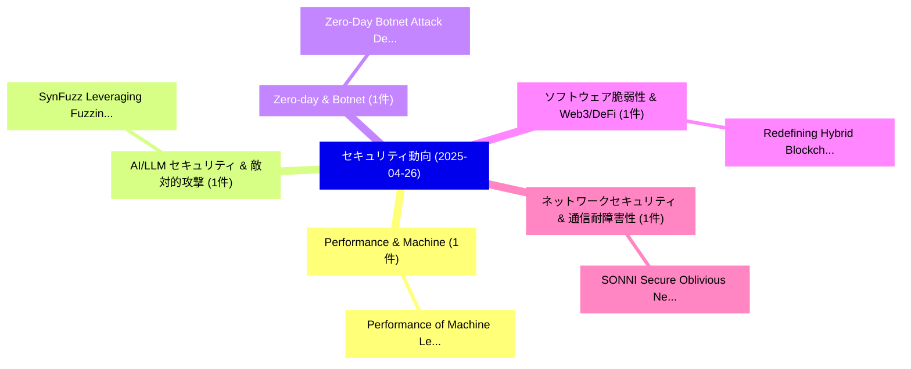

# 📅 02_daily: 日次エグゼクティブサマリー報告書 (2025-04-26)

**集計日時**: 2026-10-02 23:05:23 UTC  
**対象日付**: 2025-04-26  
**本日収集論文数**: 10 件  

---

## 💡 主要セキュリティ動向・脅威インサイト (Executive Insights)

本日の収集論文（計 10 件）において、以下の重点セキュリティ領域で活発な研究動向が確認されました：
- **Performance & Machine** (1 件): 注目論文として 「Performance of Machine Learnin...」 等が発表され、実務防御および攻撃検証の進展が見られます。
- **AI/LLM セキュリティ & 敵対的攻撃** (1 件): 注目論文として 「SynFuzz: Leveraging Fuzzing of...」 等が発表され、実務防御および攻撃検証の進展が見られます。
- **Zero-day & Botnet** (1 件): 注目論文として 「Zero-Day Botnet Attack Detecti...」 等が発表され、実務防御および攻撃検証の進展が見られます。
- **ソフトウェア脆弱性 & Web3/DeFi** (1 件): 注目論文として 「Redefining Hybrid Blockchains:...」 等が発表され、実務防御および攻撃検証の進展が見られます。
- **ネットワークセキュリティ & 通信耐障害性** (1 件): 注目論文として 「SONNI: Secure Oblivious Neural...」 等が発表され、実務防御および攻撃検証の進展が見られます。

### 🗺️ 技術・脅威トピックマインドマップ

---

## 📌 日次セキュリティ論文一覧 (日本語表形式)

| No | arXiv ID | 論文タイトル (日本語訳) | 重要キーワード | 構造化エグゼクティブ要約 (背景・提案・影響) | 脅威分類 | 詳細リンク |
|---|---|---|---|---|---|---|
| 1 | `2504.18771v1` | [Performance of Machine Learning Classifiers for Anomaly Detection in Cyber Security Applications（セキュリティ分析論文）](../../okf/papers/2025-04-26/2504.18771.md) | `Machine Learning Classifiers`, `Cyber Security Applications`, `Anomaly Detection` | 【提案】概要 (Overview & Key Finding) 本論文「Performance of Machine Learning Classifiers for Anomaly...。実証評価により経営層・セキュリティ管理者向け推奨アクション (E... | `cs.CR` | [arXiv](https://arxiv.org/abs/2504.18771v1) &#124; [OKF](../../okf/papers/2025-04-26/2504.18771.md) |
| 2 | `2504.18812v3` | [SynFuzz: Leveraging Fuzzing of Netlist to Detect Synthesis Bugs（セキュリティ分析論文）](../../okf/papers/2025-04-26/2504.18812.md) | `Detect Synthesis Bugs`, `Leveraging Fuzzing`, `Venkat Nitin Patnala` | 【提案】概要 (Overview & Key Finding) 本論文「SynFuzz: Leveraging Fuzzing of Netlist to Detect Synthe...。実証評価により経営層・セキュリティ管理者向け推奨アクション (E... | `cs.CR` | [arXiv](https://arxiv.org/abs/2504.18812v3) &#124; [OKF](../../okf/papers/2025-04-26/2504.18812.md) |
| 3 | `2504.18814v2` | [Zero-Day Botnet Attack Detection in IoV: A Modular Approach Using Isolation Forests and Particle Swarm Optimization（セキュリティ分析論文）](../../okf/papers/2025-04-26/2504.18814.md) | `Day Botnet Attack Detection`, `Particle Swarm Optimization`, `Zero-Day Botnet` | 【提案】概要 (Overview & Key Finding) 本論文「Zero-Day Botnet Attack Detection in IoV: A Modular Appr...。実証評価により経営層・セキュリティ管理者向け推奨アクション (E... | `cs.CR` | [arXiv](https://arxiv.org/abs/2504.18814v2) &#124; [OKF](../../okf/papers/2025-04-26/2504.18814.md) |
| 4 | `2504.18966v1` | [Redefining Hybrid Blockchains: A Balanced Architecture（セキュリティ分析論文）](../../okf/papers/2025-04-26/2504.18966.md) | `Redefining Hybrid Blockchains`, `Balanced Architecture`, `Syed Ibrahim Omer` | 【提案】概要 (Overview & Key Finding) 本論文「Redefining Hybrid Blockchains: A Balanced Architecture（...。実証評価により経営層・セキュリティ管理者向け推奨アクション (E... | `cs.CR` | [arXiv](https://arxiv.org/abs/2504.18966v1) &#124; [OKF](../../okf/papers/2025-04-26/2504.18966.md) |
| 5 | `2504.18974v1` | [SONNI: Secure Oblivious Neural Network Inference（セキュリティ分析論文）](../../okf/papers/2025-04-26/2504.18974.md) | `Secure Oblivious Neural Network Inference`, `Luke Sperling`, `Raw Meta` | 【提案】概要 (Overview & Key Finding) 本論文「SONNI: Secure Oblivious Neural Network Inference（セキュリティ...。実証評価によりKulkarni - **公開日時**: `202... | `cs.CR` | [arXiv](https://arxiv.org/abs/2504.18974v1) &#124; [OKF](../../okf/papers/2025-04-26/2504.18974.md) |
| 6 | `2504.18990v2` | [Safety Interventions against Adversarial Patches in an Open-Source Driver Assistance System（セキュリティ分析論文）](../../okf/papers/2025-04-26/2504.18990.md) | `Source Driver Assistance System`, `Safety Interventions`, `Adversarial Patches` | 【提案】概要 (Overview & Key Finding) 本論文「Safety Interventions against Adversarial Patches in an ...。実証評価により経営層・セキュリティ管理者向け推奨アクション (E... | `cs.CR` | [arXiv](https://arxiv.org/abs/2504.18990v2) &#124; [OKF](../../okf/papers/2025-04-26/2504.18990.md) |
| 7 | `2504.19001v1` | [Differentially Private Quasi-Concave Optimization: Bypassing the Lower Bound and Application to Geometric Problems（セキュリティ分析論文）](../../okf/papers/2025-04-26/2504.19001.md) | `Differentially Private Quasi`, `Concave Optimization`, `Quasi-Concave Optimization` | 【提案】概要 (Overview & Key Finding) 本論文「Differentially Private Quasi-Concave Optimization: Bypa...。実証評価により経営層・セキュリティ管理者向け推奨アクション (E... | `cs.CR` | [arXiv](https://arxiv.org/abs/2504.19001v1) &#124; [OKF](../../okf/papers/2025-04-26/2504.19001.md) |
| 8 | `2504.19019v1` | [Graph of Attacks: Improved Black-Box and Interpretable Jailbreaks for LLMs（セキュリティ分析論文）](../../okf/papers/2025-04-26/2504.19019.md) | `Improved Black`, `Interpretable Jailbreaks`, `Mohammad Taher Pilehvar` | 【提案】概要 (Overview & Key Finding) 本論文「Graph of Attacks: Improved Black-Box and Interpretable ...。実証評価により経営層・セキュリティ管理者向け推奨アクション (E... | `cs.CR` | [arXiv](https://arxiv.org/abs/2504.19019v1) &#124; [OKF](../../okf/papers/2025-04-26/2504.19019.md) |
| 9 | `2504.21029v1` | [PICO: Secure Transformers via Robust Prompt Isolation and サイバーセキュリティ Oversight](../../okf/papers/2025-04-26/2504.21029.md) | `Robust Prompt Isolation`, `Secure Transformers`, `Cybersecurity Oversight` | 【提案】概要 (Overview & Key Finding) 本論文「PICO: Secure Transformers via Robust Prompt Isolation a...。実証評価により経営層・セキュリティ管理者向け推奨アクション (E... | `cs.CR` | [arXiv](https://arxiv.org/abs/2504.21029v1) &#124; [OKF](../../okf/papers/2025-04-26/2504.21029.md) |
| 10 | `2505.03768v4` | [From Concept to Measurement: A Survey of How the Blockchain Trilemma Is Analyzed（セキュリティ分析論文）](../../okf/papers/2025-04-26/2505.03768.md) | `Mansur Masama Aliyu`, `Ali Sunyaev`, `Raw Meta` | 【提案】概要 (Overview & Key Finding) 本論文「From Concept to Measurement: A Survey of How the Blockc...。実証評価により経営層・セキュリティ管理者向け推奨アクション (E... | `cs.CR` | [arXiv](https://arxiv.org/abs/2505.03768v4) &#124; [OKF](../../okf/papers/2025-04-26/2505.03768.md) |

