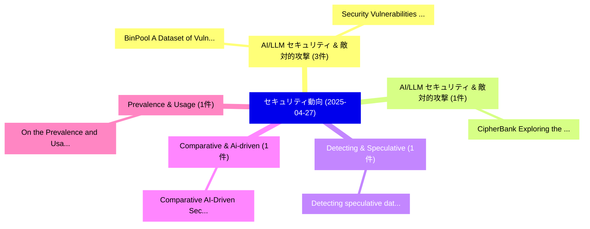

# 📅 02_daily: 日次エグゼクティブサマリー報告書 (2025-04-27)

**集計日時**: 2026-10-02 23:05:23 UTC  
**対象日付**: 2025-04-27  
**本日収集論文数**: 10 件  

---

## 💡 主要セキュリティ動向・脅威インサイト (Executive Insights)

本日の収集論文（計 10 件）において、以下の重点セキュリティ領域で活発な研究動向が確認されました：
- **AI/LLM セキュリティ & 敵対的攻撃** (3 件): 注目論文として 「BinPool: A Dataset of Vulnerab...」、「Security Vulnerabilities in Qu...」 等が発表され、実務防御および攻撃検証の進展が見られます。
- **AI/LLM セキュリティ & 敵対的攻撃** (1 件): 注目論文として 「CipherBank: Exploring the Boun...」 等が発表され、実務防御および攻撃検証の進展が見られます。
- **Detecting & Speculative** (1 件): 注目論文として 「Detecting speculative data flo...」 等が発表され、実務防御および攻撃検証の進展が見られます。
- **Comparative & Ai-driven** (1 件): 注目論文として 「Comparative AI-Driven Security...」 等が発表され、実務防御および攻撃検証の進展が見られます。
- **Prevalence & Usage** (1 件): 注目論文として 「On the Prevalence and Usage of...」 等が発表され、実務防御および攻撃検証の進展が見られます。

### 🗺️ 技術・脅威トピックマインドマップ

---

## 📌 日次セキュリティ論文一覧 (日本語表形式)

| No | arXiv ID | 論文タイトル (日本語訳) | 重要キーワード | 構造化エグゼクティブ要約 (背景・提案・影響) | 脅威分類 | 詳細リンク |
|---|---|---|---|---|---|---|
| 1 | `2504.19055v1` | [BinPool: A Dataset of Vulnerabilities for Binary Security Analysis（セキュリティ分析論文）](../../okf/papers/2025-04-27/2504.19055.md) | `Sima Arasteh`, `Georgios Nikitopoulos`, `Cheng Wu` | 【提案】概要 (Overview & Key Finding) 本論文「BinPool: A Dataset of Vulnerabilities for Binary Securi...。実証評価により経営層・セキュリティ管理者向け推奨アクション (E... | `cs.CR` | [arXiv](https://arxiv.org/abs/2504.19055v1) &#124; [OKF](../../okf/papers/2025-04-27/2504.19055.md) |
| 2 | `2504.19064v1` | [Security Vulnerabilities in Quantum Cloud Systems: A Survey on Emerging Threats（セキュリティ分析論文）](../../okf/papers/2025-04-27/2504.19064.md) | `Quantum Cloud Systems`, `Security Vulnerabilities`, `Emerging Threats` | 【提案】概要 (Overview & Key Finding) 本論文「Security Vulnerabilities in 量子 Cloud Systems: A Survey ...。実証評価により経営層・セキュリティ管理者向け推奨アクション (E... | `cs.CR` | [arXiv](https://arxiv.org/abs/2504.19064v1) &#124; [OKF](../../okf/papers/2025-04-27/2504.19064.md) |
| 3 | `2504.19093v1` | [CipherBank: Exploring the Boundary of LLM Reasoning Capabilities through Cryptography Challenges（セキュリティ分析論文）](../../okf/papers/2025-04-27/2504.19093.md) | `Reasoning Capabilities`, `Cryptography Challenges`, `Yu Li` | 【提案】概要 (Overview & Key Finding) 本論文「CipherBank: Exploring the Boundary of LLM Reasoning Cap...。実証評価により経営層・セキュリティ管理者向け推奨アクション (E... | `cs.CR` | [arXiv](https://arxiv.org/abs/2504.19093v1) &#124; [OKF](../../okf/papers/2025-04-27/2504.19093.md) |
| 4 | `2504.19128v1` | [Detecting speculative data flow vulnerabilities using weakest precondition reasoning（セキュリティ分析論文）](../../okf/papers/2025-04-27/2504.19128.md) | `Graeme Smith`, `Raw Meta`, `Executive Summary` | 【提案】概要 (Overview & Key Finding) 本論文「Detecting speculative data flow vulnerabilities using w...。実証評価により経営層・セキュリティ管理者向け推奨アクション (E... | `cs.CR` | [arXiv](https://arxiv.org/abs/2504.19128v1) &#124; [OKF](../../okf/papers/2025-04-27/2504.19128.md) |
| 5 | `2504.19154v1` | [Comparative AI-Driven Security Approaches in DevSecOps: Challenges, Solutions, and Future Directionsの分析](../../okf/papers/2025-04-27/2504.19154.md) | `Driven Security Approaches`, `AI-Driven Security`, `Future Directions` | 【提案】概要 (Overview & Key Finding) 本論文「Comparative AI-Driven Security Approaches in DevSecOps:...。実証評価により経営層・セキュリティ管理者向け推奨アクション (E... | `cs.CR` | [arXiv](https://arxiv.org/abs/2504.19154v1) &#124; [OKF](../../okf/papers/2025-04-27/2504.19154.md) |
| 6 | `2504.19215v1` | [On the Prevalence and Usage of Commit Signing on GitHub: A Longitudinal and Cross-Domain Study（セキュリティ分析論文）](../../okf/papers/2025-04-27/2504.19215.md) | `Commit Signing`, `Gayatri Priyadarsini Kancherla`, `Anupam Sharma` | 【提案】概要 (Overview & Key Finding) 本論文「On the Prevalence and Usage of Commit Signing on GitHub...。実証評価により経営層・セキュリティ管理者向け推奨アクション (E... | `cs.CR` | [arXiv](https://arxiv.org/abs/2504.19215v1) &#124; [OKF](../../okf/papers/2025-04-27/2504.19215.md) |
| 7 | `2504.19222v1` | [Evaluating Organization Security: User Stories of European Union NIS2 Directive（セキュリティ分析論文）](../../okf/papers/2025-04-27/2504.19222.md) | `Evaluating Organization Security`, `User Stories`, `European Union` | 【提案】概要 (Overview & Key Finding) 本論文「Evaluating Organization Security: User Stories of Europ...。実証評価により経営層・セキュリティ管理者向け推奨アクション (E... | `cs.CR` | [arXiv](https://arxiv.org/abs/2504.19222v1) &#124; [OKF](../../okf/papers/2025-04-27/2504.19222.md) |
| 8 | `2504.19274v2` | [TeleSparse: Practical Privacy-Preserving Verification of Deep Neural Networks（セキュリティ分析論文）](../../okf/papers/2025-04-27/2504.19274.md) | `Deep Neural Networks`, `Practical Privacy`, `Preserving Verification` | 【提案】概要 (Overview & Key Finding) 本論文「TeleSparse: Practical Privacy-Preserving Verification o...。実証評価により経営層・セキュリティ管理者向け推奨アクション (E... | `cs.CR` | [arXiv](https://arxiv.org/abs/2504.19274v2) &#124; [OKF](../../okf/papers/2025-04-27/2504.19274.md) |
| 9 | `2504.19373v5` | [Doxing via the Lens: Revealing Location-related Privacy Leakage on Multi-modal Large Reasoning Models（セキュリティ分析論文）](../../okf/papers/2025-04-27/2504.19373.md) | `Large Reasoning Models`, `Revealing Location`, `Privacy Leakage` | 【提案】概要 (Overview & Key Finding) 本論文「Doxing via the Lens: Revealing Location-related Privacy...。実証評価により経営層・セキュリティ管理者向け推奨アクション (E... | `cs.CR` | [arXiv](https://arxiv.org/abs/2504.19373v5) &#124; [OKF](../../okf/papers/2025-04-27/2504.19373.md) |
| 10 | `2504.21034v2` | [SAGA: A Security Architecture for Governing AI Agentic Systems（セキュリティ分析論文）](../../okf/papers/2025-04-27/2504.21034.md) | `Security Architecture`, `Agentic Systems`, `Georgios Syros` | 【提案】概要 (Overview & Key Finding) 本論文「SAGA: A Security Architecture for Governing AI Agentic ...。実証評価により経営層・セキュリティ管理者向け推奨アクション (E... | `cs.CR` | [arXiv](https://arxiv.org/abs/2504.21034v2) &#124; [OKF](../../okf/papers/2025-04-27/2504.21034.md) |

