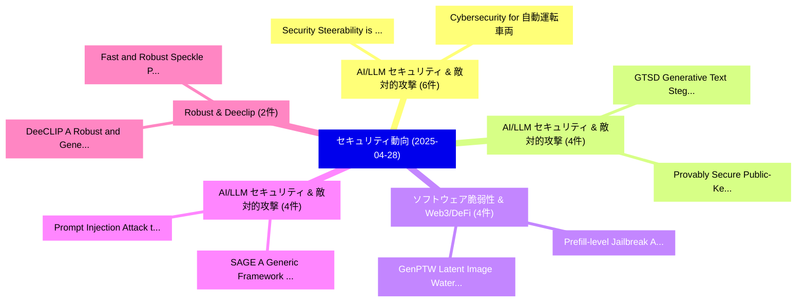

# 📅 02_daily: 日次エグゼクティブサマリー報告書 (2025-04-28)

**集計日時**: 2026-10-02 23:05:24 UTC  
**対象日付**: 2025-04-28  
**本日収集論文数**: 37 件  

---

## 💡 主要セキュリティ動向・脅威インサイト (Executive Insights)

本日の収集論文（計 37 件）において、以下の重点セキュリティ領域で活発な研究動向が確認されました：
- **AI/LLM セキュリティ & 敵対的攻撃** (6 件): 注目論文として 「Security Steerability is All Y...」、「Cybersecurity for 自動運転車両」 等が発表され、実務防御および攻撃検証の進展が見られます。
- **AI/LLM セキュリティ & 敵対的攻撃** (4 件): 注目論文として 「GTSD: Generative Text Steganog...」、「Provably Secure Public-Key Ste...」 等が発表され、実務防御および攻撃検証の進展が見られます。
- **ソフトウェア脆弱性 & Web3/DeFi** (4 件): 注目論文として 「GenPTW: Latent Image Watermark...」、「Prefill-level Jailbreak: A Bla...」 等が発表され、実務防御および攻撃検証の進展が見られます。
- **AI/LLM セキュリティ & 敵対的攻撃** (4 件): 注目論文として 「SAGE: A Generic Framework for ...」、「Prompt Injection Attack to Too...」 等が発表され、実務防御および攻撃検証の進展が見られます。
- **Robust & Deeclip** (2 件): 注目論文として 「DeeCLIP: A Robust and Generali...」、「Fast and Robust Speckle Patter...」 等が発表され、実務防御および攻撃検証の進展が見られます。

### 🗺️ 技術・脅威トピックマインドマップ

---

## 📌 日次セキュリティ論文一覧 (日本語表形式)

| No | arXiv ID | 論文タイトル (日本語訳) | 重要キーワード | 構造化エグゼクティブ要約 (背景・提案・影響) | 脅威分類 | 詳細リンク |
|---|---|---|---|---|---|---|
| 1 | `2504.19418v1` | [ChipletQuake: On-die Digital Impedance Sensing for Chiplet and Interposer Verification（セキュリティ分析論文）](../../okf/papers/2025-04-28/2504.19418.md) | `Digital Impedance Sensing`, `On-die Digital`, `Interposer Verification` | 【提案】概要 (Overview & Key Finding) 本論文「ChipletQuake: On-die Digital Impedance Sensing for Chip...。実証評価により経営層・セキュリティ管理者向け推奨アクション (E... | `cs.CR` | [arXiv](https://arxiv.org/abs/2504.19418v1) &#124; [OKF](../../okf/papers/2025-04-28/2504.19418.md) |
| 2 | `2504.19433v1` | [GTSD: Generative Text Steganography Based on Diffusion Model（セキュリティ分析論文）](../../okf/papers/2025-04-28/2504.19433.md) | `Generative Text Steganography Based`, `Diffusion Model`, `Zhengxian Wu` | 【提案】概要 (Overview & Key Finding) 本論文「GTSD: Generative Text Steganography Based on Diffusion ...。実証評価により経営層・セキュリティ管理者向け推奨アクション (E... | `cs.CR` | [arXiv](https://arxiv.org/abs/2504.19433v1) &#124; [OKF](../../okf/papers/2025-04-28/2504.19433.md) |
| 3 | `2504.19440v1` | [JailbreaksOverTime: Detecting Jailbreak Attacks Under Distribution Shift（セキュリティ分析論文）](../../okf/papers/2025-04-28/2504.19440.md) | `Julien Piet`, `Xiao Huang`, `Dennis Jacob` | 【提案】概要 (Overview & Key Finding) 本論文「ジェイルブレイクsOverTime: Detecting ジェイルブレイク Attacks Under Dis...。実証評価により経営層・セキュリティ管理者向け推奨アクション (E... | `cs.CR` | [arXiv](https://arxiv.org/abs/2504.19440v1) &#124; [OKF](../../okf/papers/2025-04-28/2504.19440.md) |
| 4 | `2504.19454v1` | [Provably Secure Public-Key Steganography Based on Admissible Encoding（セキュリティ分析論文）](../../okf/papers/2025-04-28/2504.19454.md) | `Provably Secure Public`, `Key Steganography Based`, `Admissible Encoding` | 【提案】概要 (Overview & Key Finding) 本論文「Provably Secure Public-Key Steganography Based on Admis...。実証評価により経営層・セキュリティ管理者向け推奨アクション (E... | `cs.CR` | [arXiv](https://arxiv.org/abs/2504.19454v1) &#124; [OKF](../../okf/papers/2025-04-28/2504.19454.md) |
| 5 | `2504.19456v1` | [FCGHunter: Evaluating Robustness of Graph-Based Android Malware Detectionに向けて](../../okf/papers/2025-04-28/2504.19456.md) | `Graph-Based Android`, `Based Android Malware Detection`, `Towards Evaluating Robustness` | 【提案】概要 (Overview & Key Finding) 本論文「FCGHunter: Evaluating Robustness of Graph-Based Android...。実証評価により# FCGHunter: Towards Eval... | `cs.CR` | [arXiv](https://arxiv.org/abs/2504.19456v1) &#124; [OKF](../../okf/papers/2025-04-28/2504.19456.md) |
| 6 | `2504.19486v1` | [The Cost of Performance: Breaking ThreadX with Kernel Object Masquerading Attacks（セキュリティ分析論文）](../../okf/papers/2025-04-28/2504.19486.md) | `Kernel Object Masquerading Attacks`, `Xinhui Shao`, `Zhen Ling` | 【提案】概要 (Overview & Key Finding) 本論文「The Cost of Performance: Breaking ThreadX with Kernel O...。実証評価により経営層・セキュリティ管理者向け推奨アクション (E... | `cs.CR` | [arXiv](https://arxiv.org/abs/2504.19486v1) &#124; [OKF](../../okf/papers/2025-04-28/2504.19486.md) |
| 7 | `2504.19521v4` | [Security Steerability is All You Need（セキュリティ分析論文）](../../okf/papers/2025-04-28/2504.19521.md) | `Security Steerability`, `Itay Hazan`, `Idan Habler` | 【提案】概要 (Overview & Key Finding) 本論文「Security Steerability is All You Need（セキュリティ分析論文）」（原題: ...。実証評価により経営層・セキュリティ管理者向け推奨アクション (E... | `cs.CR` | [arXiv](https://arxiv.org/abs/2504.19521v4) &#124; [OKF](../../okf/papers/2025-04-28/2504.19521.md) |
| 8 | `2504.19566v1` | [Metadata-private Messaging without Coordination（セキュリティ分析論文）](../../okf/papers/2025-04-28/2504.19566.md) | `Metadata-private Messaging`, `Peipei Jiang`, `Yihao Wu` | 【提案】背景とセキュリティ上の課題 (Background & Problem) 本研究はサイバー脅威環境におけるセキュリティ構造・脆弱性の検証を目的としています。(主要検出項目: ...。実証評価により経営層・セキュリティ管理者向け推奨アクション (E... | `cs.CR` | [arXiv](https://arxiv.org/abs/2504.19566v1) &#124; [OKF](../../okf/papers/2025-04-28/2504.19566.md) |
| 9 | `2504.19567v2` | [GenPTW: Latent Image Watermarking for Provenance Tracing and Tamper Localization（セキュリティ分析論文）](../../okf/papers/2025-04-28/2504.19567.md) | `Latent Image Watermarking`, `Provenance Tracing`, `Tamper Localization` | 【提案】概要 (Overview & Key Finding) 本論文「GenPTW: Latent Image Watermarking for Provenance Tracin...。実証評価により経営層・セキュリティ管理者向け推奨アクション (E... | `cs.CR` | [arXiv](https://arxiv.org/abs/2504.19567v2) &#124; [OKF](../../okf/papers/2025-04-28/2504.19567.md) |
| 10 | `2504.19640v1` | [From Paper Trails to Trust on Tracks: Adding Public Transparency to Railways via zk-SNARKs（セキュリティ分析論文）](../../okf/papers/2025-04-28/2504.19640.md) | `Adding Public Transparency`, `Tarek Galal`, `Valeria Tisch` | 【提案】概要 (Overview & Key Finding) 本論文「From Paper Trails to Trust on Tracks: Adding Public Tra...。実証評価により経営層・セキュリティ管理者向け推奨アクション (E... | `cs.CR` | [arXiv](https://arxiv.org/abs/2504.19640v1) &#124; [OKF](../../okf/papers/2025-04-28/2504.19640.md) |
| 11 | `2504.19674v2` | [SAGE: A Generic Framework for LLM Safety Evaluation（セキュリティ分析論文）](../../okf/papers/2025-04-28/2504.19674.md) | `Madhur Jindal`, `Hari Shrawgi`, `Parag Agrawal` | 【提案】概要 (Overview & Key Finding) 本論文「SAGE: A Generic Framework for LLM Safety Evaluation（セキュ...。実証評価により経営層・セキュリティ管理者向け推奨アクション (E... | `cs.CR` | [arXiv](https://arxiv.org/abs/2504.19674v2) &#124; [OKF](../../okf/papers/2025-04-28/2504.19674.md) |
| 12 | `2504.19793v3` | [Prompt Injection Attack to Tool Selection in LLMエージェント](../../okf/papers/2025-04-28/2504.19793.md) | `Prompt Injection Attack`, `Tool Selection`, `Neil Zhenqiang Gong` | 【提案】概要 (Overview & Key Finding) 本論文「プロンプトインジェクション Attack to Tool Selection in LLMエージェント」（原題...。実証評価により経営層・セキュリティ管理者向け推奨アクション (E... | `cs.CR` | [arXiv](https://arxiv.org/abs/2504.19793v3) &#124; [OKF](../../okf/papers/2025-04-28/2504.19793.md) |
| 13 | `2504.19821v1` | [SILENT: A New Lens on Statistics in Software Timing Side Channels（セキュリティ分析論文）](../../okf/papers/2025-04-28/2504.19821.md) | `Software Timing Side Channels`, `New Lens`, `Martin Dunsche` | 【提案】概要 (Overview & Key Finding) 本論文「SILENT: A New Lens on Statistics in Software Timing Sid...。実証評価により経営層・セキュリティ管理者向け推奨アクション (E... | `cs.CR` | [arXiv](https://arxiv.org/abs/2504.19821v1) &#124; [OKF](../../okf/papers/2025-04-28/2504.19821.md) |
| 14 | `2504.19855v2` | [The Automation Advantage in AI Red Teaming（セキュリティ分析論文）](../../okf/papers/2025-04-28/2504.19855.md) | `Red Teaming`, `Rob Mulla`, `Ads Dawson` | 【提案】概要 (Overview & Key Finding) 本論文「The Automation Advantage in AI Red Teaming（セキュリティ分析論文）」...。実証評価により経営層・セキュリティ管理者向け推奨アクション (E... | `cs.CR` | [arXiv](https://arxiv.org/abs/2504.19855v2) &#124; [OKF](../../okf/papers/2025-04-28/2504.19855.md) |
| 15 | `2504.19876v1` | [DeeCLIP: A Robust and Generalizable Transformer-Based Framework for Detecting AI-Generated Images（セキュリティ分析論文）](../../okf/papers/2025-04-28/2504.19876.md) | `Generalizable Transformer`, `Generated Images`, `AI-Generated Images` | 【提案】概要 (Overview & Key Finding) 本論文「DeeCLIP: A Robust and Generalizable Transformer-Based F...。実証評価により経営層・セキュリティ管理者向け推奨アクション (E... | `cs.CR` | [arXiv](https://arxiv.org/abs/2504.19876v1) &#124; [OKF](../../okf/papers/2025-04-28/2504.19876.md) |
| 16 | `2504.19951v1` | [GenAI Multi-Agent Systems Against Tool Squatting: A Zero Trust Registry-Based Approachのセキュリティ強化](../../okf/papers/2025-04-28/2504.19951.md) | `Zero Trust Registry`, `Multi-Agent Systems`, `Vineeth Sai Narajala` | 【提案】概要 (Overview & Key Finding) 本論文「GenAI Multi-Agent Systems Against Tool Squatting: A ゼロト...。実証評価により経営層・セキュリティ管理者向け推奨アクション (E... | `cs.CR` | [arXiv](https://arxiv.org/abs/2504.19951v1) &#124; [OKF](../../okf/papers/2025-04-28/2504.19951.md) |
| 17 | `2504.19956v2` | [Agentic AI: A Comprehensive Threat Model and Mitigation Framework for Generative AI Agentsのセキュリティ強化](../../okf/papers/2025-04-28/2504.19956.md) | `Comprehensive Threat Model`, `Securing Agentic`, `Vineeth Sai Narajala` | 【提案】概要 (Overview & Key Finding) 本論文「Agentic AI: A Comprehensive 脅威 Model and Mitigation Fra...。実証評価により経営層・セキュリティ管理者向け推奨アクション (E... | `cs.CR` | [arXiv](https://arxiv.org/abs/2504.19956v2) &#124; [OKF](../../okf/papers/2025-04-28/2504.19956.md) |
| 18 | `2504.19997v1` | [Simplified and Secure MCP Gateways for Enterprise AI Integration（セキュリティ分析論文）](../../okf/papers/2025-04-28/2504.19997.md) | `Ivo Brett`, `Raw Meta`, `Executive Summary` | 【提案】概要 (Overview & Key Finding) 本論文「Simplified and Secure MCP Gateways for Enterprise AI In...。実証評価により経営層・セキュリティ管理者向け推奨アクション (E... | `cs.CR` | [arXiv](https://arxiv.org/abs/2504.19997v1) &#124; [OKF](../../okf/papers/2025-04-28/2504.19997.md) |
| 19 | `2504.20180v1` | [Cybersecurity for 自動運転車両](../../okf/papers/2025-04-28/2504.20180.md) | `Autonomous Vehicles`, `Raw Meta`, `Executive Summary` | 【提案】概要 (Overview & Key Finding) 本論文「Cybersecurity for 自動運転車両」（原題: Cybersecurity for Autonom...。実証評価により経営層・セキュリティ管理者向け推奨アクション (E... | `cs.CR` | [arXiv](https://arxiv.org/abs/2504.20180v1) &#124; [OKF](../../okf/papers/2025-04-28/2504.20180.md) |
| 20 | `2504.20245v1` | [A Case Study on the Use of Representativeness Bias as a Defense Against Adversarial Cyber Threats（セキュリティ分析論文）](../../okf/papers/2025-04-28/2504.20245.md) | `Representativeness Bias`, `Briland Hitaj`, `Grit Denker` | 【提案】概要 (Overview & Key Finding) 本論文「A Case Study on the Use of Representativeness Bias as a...。実証評価により経営層・セキュリティ管理者向け推奨アクション (E... | `cs.CR` | [arXiv](https://arxiv.org/abs/2504.20245v1) &#124; [OKF](../../okf/papers/2025-04-28/2504.20245.md) |
| 21 | `2504.20260v1` | [SA2FE: A Secure, Anonymous, Auditable, and Fair Edge Computing Service Offloading Framework（セキュリティ分析論文）](../../okf/papers/2025-04-28/2504.20260.md) | `Xiaojian Wang`, `Huayue Gu`, `Zhouyu Li` | 【提案】概要 (Overview & Key Finding) 本論文「SA2FE: A Secure, Anonymous, Auditable, and Fair Edge Co...。実証評価により経営層・セキュリティ管理者向け推奨アクション (E... | `cs.CR` | [arXiv](https://arxiv.org/abs/2504.20260v1) &#124; [OKF](../../okf/papers/2025-04-28/2504.20260.md) |
| 22 | `2504.20266v1` | [A Virtual Cybersecurity Department for Digital Twins in Water Distribution Systemsのセキュリティ強化](../../okf/papers/2025-04-28/2504.20266.md) | `Virtual Cybersecurity Department`, `Digital Twins`, `Water Distribution` | 【提案】概要 (Overview & Key Finding) 本論文「A Virtual Cybersecurity Department for Digital Twins in...。実証評価により経営層・セキュリティ管理者向け推奨アクション (E... | `cs.CR` | [arXiv](https://arxiv.org/abs/2504.20266v1) &#124; [OKF](../../okf/papers/2025-04-28/2504.20266.md) |
| 23 | `2504.20275v1` | [Smart Water Security with AI and Blockchain-Enhanced Digital Twins（セキュリティ分析論文）](../../okf/papers/2025-04-28/2504.20275.md) | `Smart Water Security`, `Enhanced Digital Twins`, `Blockchain-Enhanced Digital` | 【提案】概要 (Overview & Key Finding) 本論文「Smart Water Security with AI and Blockchain-Enhanced Di...。実証評価により経営層・セキュリティ管理者向け推奨アクション (E... | `cs.CR` | [arXiv](https://arxiv.org/abs/2504.20275v1) &#124; [OKF](../../okf/papers/2025-04-28/2504.20275.md) |
| 24 | `2504.20295v1` | [The Dark Side of Digital Twins: AI-Driven Water Forecastingに対する敵対的攻撃](../../okf/papers/2025-04-28/2504.20295.md) | `Digital Twins`, `AI-Driven Water`, `Driven Water Forecasting` | 【提案】概要 (Overview & Key Finding) 本論文「The Dark Side of Digital Twins: AI-Driven Water Forecas...。実証評価により経営層・セキュリティ管理者向け推奨アクション (E... | `cs.CR` | [arXiv](https://arxiv.org/abs/2504.20295v1) &#124; [OKF](../../okf/papers/2025-04-28/2504.20295.md) |
| 25 | `2504.20296v1` | [SoK: A Survey of Mixing Techniques and Mixers for Cryptocurrencies（セキュリティ分析論文）](../../okf/papers/2025-04-28/2504.20296.md) | `Mixing Techniques`, `Juraj Mariani`, `Ivan Homoliak` | 【提案】概要 (Overview & Key Finding) 本論文「SoK: A Survey of Mixing Techniques and Mixers for Crypt...。実証評価により経営層・セキュリティ管理者向け推奨アクション (E... | `cs.CR` | [arXiv](https://arxiv.org/abs/2504.20296v1) &#124; [OKF](../../okf/papers/2025-04-28/2504.20296.md) |
| 26 | `2504.20310v2` | [A Cryptographic Perspective on Mitigation vs. Detection in Machine Learning（セキュリティ分析論文）](../../okf/papers/2025-04-28/2504.20310.md) | `Cryptographic Perspective`, `Machine Learning`, `Greg Gluch` | 【提案】概要 (Overview & Key Finding) 本論文「A Cryptographic Perspective on Mitigation vs. Detection...。実証評価により経営層・セキュリティ管理者向け推奨アクション (E... | `cs.CR` | [arXiv](https://arxiv.org/abs/2504.20310v2) &#124; [OKF](../../okf/papers/2025-04-28/2504.20310.md) |
| 27 | `2504.21035v4` | [A False Sense of Privacy: Evaluating Textual Data Sanitization Beyond Surface-level Privacy Leakage（セキュリティ分析論文）](../../okf/papers/2025-04-28/2504.21035.md) | `Evaluating Textual Data Sanitization Beyond Surface`, `False Sense`, `Privacy Leakage` | 【提案】概要 (Overview & Key Finding) 本論文「A False Sense of Privacy: Evaluating Textual Data Sanit...。実証評価により経営層・セキュリティ管理者向け推奨アクション (E... | `cs.CR` | [arXiv](https://arxiv.org/abs/2504.21035v4) &#124; [OKF](../../okf/papers/2025-04-28/2504.21035.md) |
| 28 | `2504.21036v2` | [Can Differentially Private Fine-tuning LLMs Protect Against Privacy Attacks?（セキュリティ分析論文）](../../okf/papers/2025-04-28/2504.21036.md) | `Can Differentially Private Fine`, `Fine-tuning LLMs`, `Hao Du` | 【提案】### (日本語題名: Can Differentially Private Fine-tuning LLMs Protect Against Privacy Attacks...。実証評価により経営層・セキュリティ管理者向け推奨アクション (E... | `cs.CR` | [arXiv](https://arxiv.org/abs/2504.21036v2) &#124; [OKF](../../okf/papers/2025-04-28/2504.21036.md) |
| 29 | `2504.21037v1` | [Security Bug Report Prediction Within and Across Projects: A Comparative Study of BERT and Random Forest（セキュリティ分析論文）](../../okf/papers/2025-04-28/2504.21037.md) | `Security Bug Report Prediction Within`, `Across Projects`, `Random Forest` | 【提案】概要 (Overview & Key Finding) 本論文「Security Bug Report Prediction Within and Across Projec...。実証評価により経営層・セキュリティ管理者向け推奨アクション (E... | `cs.CR` | [arXiv](https://arxiv.org/abs/2504.21037v1) &#124; [OKF](../../okf/papers/2025-04-28/2504.21037.md) |
| 30 | `2504.21038v2` | [Prefill-level Jailbreak: A Black-Box Risk Large Language Modelsの分析](../../okf/papers/2025-04-28/2504.21038.md) | `Prefill-level Jailbreak`, `Black-Box Risk`, `Box Risk Large Language` | 【提案】概要 (Overview & Key Finding) 本論文「Prefill-level ジェイルブレイク: A Black-Box Risk Large Language...。実証評価により経営層・セキュリティ管理者向け推奨アクション (E... | `cs.CR` | [arXiv](https://arxiv.org/abs/2504.21038v2) &#124; [OKF](../../okf/papers/2025-04-28/2504.21038.md) |
| 31 | `2504.21039v1` | [Llama-3.1-FoundationAI-SecurityLLM-Base-8B Technical Report（セキュリティ分析論文）](../../okf/papers/2025-04-28/2504.21039.md) | `Technical Report`, `Paul Kassianik`, `Baturay Saglam` | 【提案】概要 (Overview & Key Finding) 本論文「Llama-3.1-FoundationAI-SecurityLLM-Base-8B Technical Re...。実証評価により経営層・セキュリティ管理者向け推奨アクション (E... | `cs.CR` | [arXiv](https://arxiv.org/abs/2504.21039v1) &#124; [OKF](../../okf/papers/2025-04-28/2504.21039.md) |
| 32 | `2504.21041v1` | [Fast and Robust Speckle Pattern Authentication by Scale Invariant Feature Transform algorithm in Physical Unclonable Functions（セキュリティ分析論文）](../../okf/papers/2025-04-28/2504.21041.md) | `Robust Speckle Pattern Authentication`, `Scale Invariant Feature Transform`, `Physical Unclonable Functions` | 【提案】概要 (Overview & Key Finding) 本論文「Fast and Robust Speckle Pattern Authentication by Scale...。実証評価により経営層・セキュリティ管理者向け推奨アクション (E... | `cs.CR` | [arXiv](https://arxiv.org/abs/2504.21041v1) &#124; [OKF](../../okf/papers/2025-04-28/2504.21041.md) |
| 33 | `2504.21042v3` | [What's Pulling the Strings? Evaluating Integrity and Attribution in AI Training and Inference through Concept Shift（セキュリティ分析論文）](../../okf/papers/2025-04-28/2504.21042.md) | `Evaluating Integrity`, `Concept Shift`, `Jiamin Chang` | 【提案】Evaluating Integrity and Attribution in AI Training and Inference through Concept Shift...。実証評価により経営層・セキュリティ管理者向け推奨アクション (E... | `cs.CR` | [arXiv](https://arxiv.org/abs/2504.21042v3) &#124; [OKF](../../okf/papers/2025-04-28/2504.21042.md) |
| 34 | `2504.21043v2` | [CodeBC: A More Secure Large Language Model for Smart Contract Code Generation in Blockchain（セキュリティ分析論文）](../../okf/papers/2025-04-28/2504.21043.md) | `Smart Contract Code Generation`, `Lingxiang Wang`, `Hainan Zhang` | 【提案】概要 (Overview & Key Finding) 本論文「CodeBC: A More Secure Large Language Model for スマートコントラ...。実証評価により経営層・セキュリティ管理者向け推奨アクション (E... | `cs.CR` | [arXiv](https://arxiv.org/abs/2504.21043v2) &#124; [OKF](../../okf/papers/2025-04-28/2504.21043.md) |
| 35 | `2504.21044v1` | [AGATE: Stealthy Black-box Watermarking for Multimodal Model Copyright Protection（セキュリティ分析論文）](../../okf/papers/2025-04-28/2504.21044.md) | `Multimodal Model Copyright Protection`, `Stealthy Black`, `Black-box Watermarking` | 【提案】概要 (Overview & Key Finding) 本論文「AGATE: Stealthy Black-box Watermarking for Multimodal M...。実証評価により経営層・セキュリティ管理者向け推奨アクション (E... | `cs.CR` | [arXiv](https://arxiv.org/abs/2504.21044v1) &#124; [OKF](../../okf/papers/2025-04-28/2504.21044.md) |
| 36 | `2504.21045v1` | [Leveraging LLM to Strengthen ML-Based Cross-Site Scripting Detection（セキュリティ分析論文）](../../okf/papers/2025-04-28/2504.21045.md) | `Site Scripting Detection`, `Based Cross`, `ML-Based Cross` | 【提案】概要 (Overview & Key Finding) 本論文「Leveraging LLM to Strengthen ML-Based Cross-Site Script...。実証評価により経営層・セキュリティ管理者向け推奨アクション (E... | `cs.CR` | [arXiv](https://arxiv.org/abs/2504.21045v1) &#124; [OKF](../../okf/papers/2025-04-28/2504.21045.md) |
| 37 | `2505.11502v1` | [Hybrid プライバシーポリシー-Code Consistency Check using Knowledge Graphs and LLMs](../../okf/papers/2025-04-28/2505.11502.md) | `Code Consistency Check`, `Knowledge Graphs`, `Hybrid Privacy Policy` | 【提案】概要 (Overview & Key Finding) 本論文「Hybrid プライバシーポリシー-Code Consistency Check using Knowledg...。実証評価により経営層・セキュリティ管理者向け推奨アクション (E... | `cs.CR` | [arXiv](https://arxiv.org/abs/2505.11502v1) &#124; [OKF](../../okf/papers/2025-04-28/2505.11502.md) |

