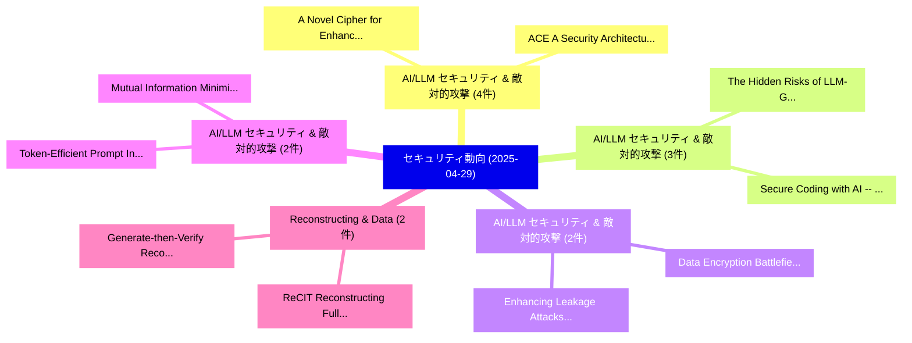

# 📅 02_daily: 日次エグゼクティブサマリー報告書 (2025-04-29)

**集計日時**: 2026-10-02 23:05:24 UTC  
**対象日付**: 2025-04-29  
**本日収集論文数**: 45 件  

---

## 💡 主要セキュリティ動向・脅威インサイト (Executive Insights)

本日の収集論文（計 45 件）において、以下の重点セキュリティ領域で活発な研究動向が確認されました：
- **AI/LLM セキュリティ & 敵対的攻撃** (4 件): 注目論文として 「A Novel Cipher for Enhancing M...」、「ACE: A Security Architecture f...」 等が発表され、実務防御および攻撃検証の進展が見られます。
- **AI/LLM セキュリティ & 敵対的攻撃** (3 件): 注目論文として 「The Hidden Risks of LLM-Genera...」、「Secure Coding with AI -- From ...」 等が発表され、実務防御および攻撃検証の進展が見られます。
- **AI/LLM セキュリティ & 敵対的攻撃** (2 件): 注目論文として 「Enhancing Leakage Attacks on S...」、「Data Encryption Battlefield: A...」 等が発表され、実務防御および攻撃検証の進展が見られます。
- **AI/LLM セキュリティ & 敵対的攻撃** (2 件): 注目論文として 「Token-Efficient Prompt Injecti...」、「Mutual Information Minimizatio...」 等が発表され、実務防御および攻撃検証の進展が見られます。
- **Reconstructing & Data** (2 件): 注目論文として 「ReCIT: Reconstructing Full Pri...」、「Generate-then-Verify: Reconstr...」 等が発表され、実務防御および攻撃検証の進展が見られます。

### 🗺️ 技術・脅威トピックマインドマップ

---

## 📌 日次セキュリティ論文一覧 (日本語表形式)

| No | arXiv ID | 論文タイトル (日本語訳) | 重要キーワード | 構造化エグゼクティブ要約 (背景・提案・影響) | 脅威分類 | 詳細リンク |
|---|---|---|---|---|---|---|
| 1 | `2504.20350v2` | [SoK: Enhancing Privacy-Preserving Software Development from a Developers' Perspective（セキュリティ分析論文）](../../okf/papers/2025-04-29/2504.20350.md) | `Preserving Software Development`, `Enhancing Privacy`, `Privacy-Preserving Software` | 【提案】概要 (Overview & Key Finding) 本論文「SoK: Enhancing Privacy-Preserving Software Development ...。実証評価により経営層・セキュリティ管理者向け推奨アクション (E... | `cs.CR` | [arXiv](https://arxiv.org/abs/2504.20350v2) &#124; [OKF](../../okf/papers/2025-04-29/2504.20350.md) |
| 2 | `2504.20376v3` | [When Memory Becomes a Vulnerability: Multi-turn Jailbreak Attacks against Text-to-Image Generation Systemsに向けて](../../okf/papers/2025-04-29/2504.20376.md) | `Jailbreak Attacks`, `Multi-turn Jailbreak`, `Image Generation Systems` | 【提案】概要 (Overview & Key Finding) 本論文「When Memory Becomes a 脆弱性: Multi-turn ジェイルブレイク Attacks ...。実証評価により経営層・セキュリティ管理者向け推奨アクション (E... | `cs.CR` | [arXiv](https://arxiv.org/abs/2504.20376v3) &#124; [OKF](../../okf/papers/2025-04-29/2504.20376.md) |
| 3 | `2504.20414v1` | [Enhancing Leakage Attacks on Searchable Symmetric Encryption Using LLM-Based Synthetic Data Generation（セキュリティ分析論文）](../../okf/papers/2025-04-29/2504.20414.md) | `Searchable Symmetric Encryption Using`, `Based Synthetic Data Generation`, `Enhancing Leakage Attacks` | 【提案】概要 (Overview & Key Finding) 本論文「Enhancing Leakage Attacks on Searchable Symmetric Encry...。実証評価により経営層・セキュリティ管理者向け推奨アクション (E... | `cs.CR` | [arXiv](https://arxiv.org/abs/2504.20414v1) &#124; [OKF](../../okf/papers/2025-04-29/2504.20414.md) |
| 4 | `2504.20432v2` | [An Algebraic Approach to Asymmetric Delegation and Polymorphic Label Inference (Technical Report)（セキュリティ分析論文）](../../okf/papers/2025-04-29/2504.20432.md) | `Polymorphic Label Inference`, `Asymmetric Delegation`, `Technical Report` | 【提案】概要 (Overview & Key Finding) 本論文「An Algebraic Approach to Asymmetric Delegation and Poly...。実証評価により経営層・セキュリティ管理者向け推奨アクション (E... | `cs.CR` | [arXiv](https://arxiv.org/abs/2504.20432v2) &#124; [OKF](../../okf/papers/2025-04-29/2504.20432.md) |
| 5 | `2504.20436v1` | [Network Attack Traffic Detection With Hybrid Quantum-Enhanced Convolution Neural Network（セキュリティ分析論文）](../../okf/papers/2025-04-29/2504.20436.md) | `Enhanced Convolution Neural Network`, `Quantum-Enhanced Convolution`, `Kar Wai Fok` | 【提案】概要 (Overview & Key Finding) 本論文「Network Attack Traffic Detection With Hybrid 量子-Enhance...。実証評価により経営層・セキュリティ管理者向け推奨アクション (E... | `cs.CR` | [arXiv](https://arxiv.org/abs/2504.20436v1) &#124; [OKF](../../okf/papers/2025-04-29/2504.20436.md) |
| 6 | `2504.20472v2` | [Robustness via Referencing: Defending against Prompt Injection Attacks by Referencing the Executed Instruction（セキュリティ分析論文）](../../okf/papers/2025-04-29/2504.20472.md) | `Prompt Injection Attacks`, `Executed Instruction`, `Yulin Chen` | 【提案】概要 (Overview & Key Finding) 本論文「Robustness via Referencing: Defending against プロンプトインジェ...。実証評価により経営層・セキュリティ管理者向け推奨アクション (E... | `cs.CR` | [arXiv](https://arxiv.org/abs/2504.20472v2) &#124; [OKF](../../okf/papers/2025-04-29/2504.20472.md) |
| 7 | `2504.20485v1` | [Sleeping Giants -- Activating Dormant Java Deserialization Gadget Chains through Stealthy Code Changes（セキュリティ分析論文）](../../okf/papers/2025-04-29/2504.20485.md) | `Activating Dormant Java Deserialization Gadget Chains`, `Stealthy Code Changes`, `Sleeping Giants` | 【提案】概要 (Overview & Key Finding) 本論文「Sleeping Giants -- Activating Dormant Java Deserializat...。実証評価により経営層・セキュリティ管理者向け推奨アクション (E... | `cs.CR` | [arXiv](https://arxiv.org/abs/2504.20485v1) &#124; [OKF](../../okf/papers/2025-04-29/2504.20485.md) |
| 8 | `2504.20493v1` | [Token-Efficient Prompt Injection Attack: Provoking Cessation in LLM Reasoning via Adaptive Token Compression（セキュリティ分析論文）](../../okf/papers/2025-04-29/2504.20493.md) | `Efficient Prompt Injection Attack`, `Adaptive Token Compression`, `Provoking Cessation` | 【提案】概要 (Overview & Key Finding) 本論文「Token-Efficient プロンプトインジェクション Attack: Provoking Cessati...。実証評価により経営層・セキュリティ管理者向け推奨アクション (E... | `cs.CR` | [arXiv](https://arxiv.org/abs/2504.20493v1) &#124; [OKF](../../okf/papers/2025-04-29/2504.20493.md) |
| 9 | `2504.20532v2` | [TriniMark: A Robust Generative Speech Watermarking Method for Trinity-Level Traceability（セキュリティ分析論文）](../../okf/papers/2025-04-29/2504.20532.md) | `Level Traceability`, `Trinity-Level Traceability`, `Yue Li` | 【提案】概要 (Overview & Key Finding) 本論文「TriniMark: A Robust Generative Speech Watermarking Meth...。実証評価により経営層・セキュリティ管理者向け推奨アクション (E... | `cs.CR` | [arXiv](https://arxiv.org/abs/2504.20532v2) &#124; [OKF](../../okf/papers/2025-04-29/2504.20532.md) |
| 10 | `2504.20536v1` | [Starfish: Rebalancing Multi-Party Off-Chain Payment Channels（セキュリティ分析論文）](../../okf/papers/2025-04-29/2504.20536.md) | `Chain Payment Channels`, `Rebalancing Multi`, `Minghui Xu` | 【提案】概要 (Overview & Key Finding) 本論文「Starfish: Rebalancing Multi-Party Off-Chain Payment Cha...。実証評価により経営層・セキュリティ管理者向け推奨アクション (E... | `cs.CR` | [arXiv](https://arxiv.org/abs/2504.20536v1) &#124; [OKF](../../okf/papers/2025-04-29/2504.20536.md) |
| 11 | `2504.20544v1` | [Efficient patient-centric EMR sharing block tree（セキュリティ分析論文）](../../okf/papers/2025-04-29/2504.20544.md) | `patient-centric EMR`, `Xiaohan Hu`, `Jyoti Sahni` | 【提案】概要 (Overview & Key Finding) 本論文「Efficient patient-centric EMR sharing block tree（セキュリティ...。実証評価によりSeah - **公開日時**: `2025-04... | `cs.CR` | [arXiv](https://arxiv.org/abs/2504.20544v1) &#124; [OKF](../../okf/papers/2025-04-29/2504.20544.md) |
| 12 | `2504.20556v5` | [Mutual Information Minimization for Side-Channel Attack Resistance via Optimal Noise Injection（セキュリティ分析論文）](../../okf/papers/2025-04-29/2504.20556.md) | `Mutual Information Minimization`, `Channel Attack Resistance`, `Optimal Noise Injection` | 【提案】概要 (Overview & Key Finding) 本論文「Mutual Information Minimization for サイドチャネル攻撃 Resistanc...。実証評価により経営層・セキュリティ管理者向け推奨アクション (E... | `cs.CR` | [arXiv](https://arxiv.org/abs/2504.20556v5) &#124; [OKF](../../okf/papers/2025-04-29/2504.20556.md) |
| 13 | `2504.20569v1` | [VIMU: Effective Physics-based Realtime Detection and Recovery against Stealthy Attacks on UAVs（セキュリティ分析論文）](../../okf/papers/2025-04-29/2504.20569.md) | `Effective Physics`, `Realtime Detection`, `Physics-based Realtime` | 【提案】概要 (Overview & Key Finding) 本論文「VIMU: Effective Physics-based Realtime Detection and Re...。実証評価により経営層・セキュリティ管理者向け推奨アクション (E... | `cs.CR` | [arXiv](https://arxiv.org/abs/2504.20569v1) &#124; [OKF](../../okf/papers/2025-04-29/2504.20569.md) |
| 14 | `2504.20570v1` | [ReCIT: Reconstructing Full Private Data from Gradient in Parameter-Efficient Fine-Tuning of 大規模言語モデル](../../okf/papers/2025-04-29/2504.20570.md) | `Reconstructing Full Private Data`, `Efficient Fine`, `Parameter-Efficient Fine` | 【提案】概要 (Overview & Key Finding) 本論文「ReCIT: Reconstructing Full Private Data from Gradient i...。実証評価により経営層・セキュリティ管理者向け推奨アクション (E... | `cs.CR` | [arXiv](https://arxiv.org/abs/2504.20570v1) &#124; [OKF](../../okf/papers/2025-04-29/2504.20570.md) |
| 15 | `2504.20612v1` | [The Hidden Risks of LLM-Generated Web Application Code: A Security-Centric Evaluation of Code Generation Capabilities in 大規模言語モデル](../../okf/papers/2025-04-29/2504.20612.md) | `Generated Web Application Code`, `Code Generation Capabilities`, `LLM-Generated Web` | 【提案】概要 (Overview & Key Finding) 本論文「The Hidden Risks of LLM-Generated Web Application Code:...。実証評価により経営層・セキュリティ管理者向け推奨アクション (E... | `cs.CR` | [arXiv](https://arxiv.org/abs/2504.20612v1) &#124; [OKF](../../okf/papers/2025-04-29/2504.20612.md) |
| 16 | `2504.20626v1` | [A Novel Cipher for Enhancing MAVLink Security: Design, Security Analysis, and Performance Evaluation Using a Drone Testbed（セキュリティ分析論文）](../../okf/papers/2025-04-29/2504.20626.md) | `Drone Testbed`, `Bhavya Dixit`, `Adheeba Thahsin` | 【提案】概要 (Overview & Key Finding) 本論文「A Novel Cipher for Enhancing MAVLink Security: Design, ...。実証評価により経営層・セキュリティ管理者向け推奨アクション (E... | `cs.CR` | [arXiv](https://arxiv.org/abs/2504.20626v1) &#124; [OKF](../../okf/papers/2025-04-29/2504.20626.md) |
| 17 | `2504.20637v2` | [Protocol Dialects as Formal Patterns: A Composable Theory of Lingos -- Technical report（セキュリティ分析論文）](../../okf/papers/2025-04-29/2504.20637.md) | `Protocol Dialects`, `Formal Patterns`, `Composable Theory` | 【提案】概要 (Overview & Key Finding) 本論文「Protocol Dialects as Formal Patterns: A Composable Theo...。実証評価により経営層・セキュリティ管理者向け推奨アクション (E... | `cs.CR` | [arXiv](https://arxiv.org/abs/2504.20637v2) &#124; [OKF](../../okf/papers/2025-04-29/2504.20637.md) |
| 18 | `2504.20681v1` | [Data Encryption Battlefield: A Deep Dive into the Dynamic Confrontations in Ransomware Attacks（セキュリティ分析論文）](../../okf/papers/2025-04-29/2504.20681.md) | `Data Encryption Battlefield`, `Deep Dive`, `Dynamic Confrontations` | 【提案】概要 (Overview & Key Finding) 本論文「Data Encryption Battlefield: A Deep Dive into the Dynam...。実証評価により経営層・セキュリティ管理者向け推奨アクション (E... | `cs.CR` | [arXiv](https://arxiv.org/abs/2504.20681v1) &#124; [OKF](../../okf/papers/2025-04-29/2504.20681.md) |
| 19 | `2504.20689v1` | [DICOM Compatible, 3D Multimodality Image Encryption using Hyperchaotic Signal（セキュリティ分析論文）](../../okf/papers/2025-04-29/2504.20689.md) | `Multimodality Image Encryption`, `Hyperchaotic Signal`, `Sishu Shankar Muni` | 【提案】概要 (Overview & Key Finding) 本論文「DICOM Compatible, 3D Multimodality Image Encryption usi...。実証評価により経営層・セキュリティ管理者向け推奨アクション (E... | `cs.CR` | [arXiv](https://arxiv.org/abs/2504.20689v1) &#124; [OKF](../../okf/papers/2025-04-29/2504.20689.md) |
| 20 | `2504.20700v1` | [Building Trust in Healthcare with Privacy Techniques: Blockchain in the Cloud（セキュリティ分析論文）](../../okf/papers/2025-04-29/2504.20700.md) | `Building Trust`, `Privacy Techniques`, `Ferhat Ozgur Catak` | 【提案】概要 (Overview & Key Finding) 本論文「Building Trust in Healthcare with Privacy Techniques: B...。実証評価により経営層・セキュリティ管理者向け推奨アクション (E... | `cs.CR` | [arXiv](https://arxiv.org/abs/2504.20700v1) &#124; [OKF](../../okf/papers/2025-04-29/2504.20700.md) |
| 21 | `2504.20726v1` | [Enhancing Vulnerability Reports with Automated and Augmented Description Summarization（セキュリティ分析論文）](../../okf/papers/2025-04-29/2504.20726.md) | `Enhancing Vulnerability Reports`, `Augmented Description Summarization`, `Hattan Althebeiti` | 【提案】概要 (Overview & Key Finding) 本論文「Enhancing 脆弱性 Reports with Automated and Augmented Desc...。実証評価により経営層・セキュリティ管理者向け推奨アクション (E... | `cs.CR` | [arXiv](https://arxiv.org/abs/2504.20726v1) &#124; [OKF](../../okf/papers/2025-04-29/2504.20726.md) |
| 22 | `2504.20767v1` | [did:self A registry-less DID method（セキュリティ分析論文）](../../okf/papers/2025-04-29/2504.20767.md) | `Nikos Fotiou`, `Raw Meta`, `Executive Summary` | 【提案】概要 (Overview & Key Finding) 本論文「did:self A registry-less DID method（セキュリティ分析論文）」（原題: di...。実証評価によりSiris - **公開日時**: `2025-0... | `cs.CR` | [arXiv](https://arxiv.org/abs/2504.20767v1) &#124; [OKF](../../okf/papers/2025-04-29/2504.20767.md) |
| 23 | `2504.20801v2` | [Unlocking User-oriented Pages: Intention-driven Black-box Scanner for Real-world Web Applications（セキュリティ分析論文）](../../okf/papers/2025-04-29/2504.20801.md) | `Unlocking User`, `User-oriented Pages`, `Web Applications` | 【提案】概要 (Overview & Key Finding) 本論文「Unlocking User-oriented Pages: Intention-driven Black-b...。実証評価により経営層・セキュリティ管理者向け推奨アクション (E... | `cs.CR` | [arXiv](https://arxiv.org/abs/2504.20801v2) &#124; [OKF](../../okf/papers/2025-04-29/2504.20801.md) |
| 24 | `2504.20814v2` | [Secure Coding with AI -- From Detection to Repair（セキュリティ分析論文）](../../okf/papers/2025-04-29/2504.20814.md) | `Secure Coding`, `Vladislav Belozerov`, `Ashkan Sami` | 【提案】概要 (Overview & Key Finding) 本論文「Secure Coding with AI -- From Detection to Repair（セキュリテ...。実証評価により経営層・セキュリティ管理者向け推奨アクション (E... | `cs.CR` | [arXiv](https://arxiv.org/abs/2504.20814v2) &#124; [OKF](../../okf/papers/2025-04-29/2504.20814.md) |
| 25 | `2504.20827v1` | [DP-SMOTE: Integrating Differential Privacy and Oversampling Technique to Preserve Privacy in Smart Homes（セキュリティ分析論文）](../../okf/papers/2025-04-29/2504.20827.md) | `Integrating Differential Privacy`, `Oversampling Technique`, `Preserve Privacy` | 【提案】概要 (Overview & Key Finding) 本論文「DP-SMOTE: Integrating 差分プライバシー and Oversampling Techniq...。実証評価により経営層・セキュリティ管理者向け推奨アクション (E... | `cs.CR` | [arXiv](https://arxiv.org/abs/2504.20827v1) &#124; [OKF](../../okf/papers/2025-04-29/2504.20827.md) |
| 26 | `2504.20848v1` | [Mitigating the Structural Bias in Graph Adversarial Defenses（セキュリティ分析論文）](../../okf/papers/2025-04-29/2504.20848.md) | `Graph Adversarial Defenses`, `Structural Bias`, `Junyuan Fang` | 【提案】概要 (Overview & Key Finding) 本論文「Mitigating the Structural Bias in Graph Adversarial Def...。実証評価によりTse - **公開日時**: `2025-04-... | `cs.CR` | [arXiv](https://arxiv.org/abs/2504.20848v1) &#124; [OKF](../../okf/papers/2025-04-29/2504.20848.md) |
| 27 | `2504.20869v2` | [Quantifying the Noise of Structural Perturbations on Graph Adversarial Attacks（セキュリティ分析論文）](../../okf/papers/2025-04-29/2504.20869.md) | `Graph Adversarial Attacks`, `Structural Perturbations`, `Junyuan Fang` | 【提案】概要 (Overview & Key Finding) 本論文「Quantifying the Noise of Structural Perturbations on Gr...。実証評価により経営層・セキュリティ管理者向け推奨アクション (E... | `cs.CR` | [arXiv](https://arxiv.org/abs/2504.20869v2) &#124; [OKF](../../okf/papers/2025-04-29/2504.20869.md) |
| 28 | `2504.20888v1` | [New Capacity Bounds for PIR on Graph and Multigraph-Based Replicated Storage（セキュリティ分析論文）](../../okf/papers/2025-04-29/2504.20888.md) | `New Capacity Bounds`, `Based Replicated Storage`, `Multigraph-Based Replicated` | 【提案】概要 (Overview & Key Finding) 本論文「New Capacity Bounds for PIR on Graph and Multigraph-Bas...。実証評価により経営層・セキュリティ管理者向け推奨アクション (E... | `cs.CR` | [arXiv](https://arxiv.org/abs/2504.20888v1) &#124; [OKF](../../okf/papers/2025-04-29/2504.20888.md) |
| 29 | `2504.20904v1` | [Dual Explanations via Subgraph Matching for マルウェア検出](../../okf/papers/2025-04-29/2504.20904.md) | `Dual Explanations`, `Subgraph Matching`, `Malware Detection` | 【提案】概要 (Overview & Key Finding) 本論文「Dual Explanations via Subgraph Matching for マルウェア検出」（原題...。実証評価によりGhorbani - **公開日時**: `202... | `cs.CR` | [arXiv](https://arxiv.org/abs/2504.20904v1) &#124; [OKF](../../okf/papers/2025-04-29/2504.20904.md) |
| 30 | `2504.20906v4` | [A Giant-Step Baby-Step Classifier For Scalable and Real-Time Anomaly Detection In Industrial Control Systems and Water Treatment Systems（セキュリティ分析論文）](../../okf/papers/2025-04-29/2504.20906.md) | `Water Treatment Systems`, `Step Baby`, `Giant-Step Baby` | 【提案】概要 (Overview & Key Finding) 本論文「A Giant-Step Baby-Step Classifier For Scalable and Real...。実証評価により経営層・セキュリティ管理者向け推奨アクション (E... | `cs.CR` | [arXiv](https://arxiv.org/abs/2504.20906v4) &#124; [OKF](../../okf/papers/2025-04-29/2504.20906.md) |
| 31 | `2504.20926v3` | [Bipartite Randomized Response Mechanism for Local Differential Privacy（セキュリティ分析論文）](../../okf/papers/2025-04-29/2504.20926.md) | `Bipartite Randomized Response Mechanism`, `Local Differential Privacy`, `Shun Zhang` | 【提案】概要 (Overview & Key Finding) 本論文「Bipartite Randomized Response Mechanism for Local 差分プライ...。実証評価により経営層・セキュリティ管理者向け推奨アクション (E... | `cs.CR` | [arXiv](https://arxiv.org/abs/2504.20926v3) &#124; [OKF](../../okf/papers/2025-04-29/2504.20926.md) |
| 32 | `2504.20934v1` | [DejaVuzz: Disclosing Transient Execution Bugs with Dynamic Swappable Memory and Differential Information Flow Tracking assisted Processor Fuzzing（セキュリティ分析論文）](../../okf/papers/2025-04-29/2504.20934.md) | `Disclosing Transient Execution Bugs`, `Differential Information Flow Tracking`, `Dynamic Swappable Memory` | 【提案】概要 (Overview & Key Finding) 本論文「DejaVuzz: Disclosing Transient Execution Bugs with Dyna...。実証評価により経営層・セキュリティ管理者向け推奨アクション (E... | `cs.CR` | [arXiv](https://arxiv.org/abs/2504.20934v1) &#124; [OKF](../../okf/papers/2025-04-29/2504.20934.md) |
| 33 | `2504.20941v4` | [Conformal-DP: A Density-Aware Mechanism for Differential Privacy over Riemannian Manifolds via Conformal Transformation（セキュリティ分析論文）](../../okf/papers/2025-04-29/2504.20941.md) | `Aware Mechanism`, `Differential Privacy`, `Riemannian Manifolds` | 【提案】概要 (Overview & Key Finding) 本論文「Conformal-DP: A Density-Aware Mechanism for 差分プライバシー ov...。実証評価により経営層・セキュリティ管理者向け推奨アクション (E... | `cs.CR` | [arXiv](https://arxiv.org/abs/2504.20941v4) &#124; [OKF](../../okf/papers/2025-04-29/2504.20941.md) |
| 34 | `2504.20984v3` | [ACE: A Security Architecture for LLM-Integrated App Systems（セキュリティ分析論文）](../../okf/papers/2025-04-29/2504.20984.md) | `Integrated App Systems`, `Security Architecture`, `LLM-Integrated App` | 【提案】概要 (Overview & Key Finding) 本論文「ACE: A Security Architecture for LLM-Integrated App Sys...。実証評価により経営層・セキュリティ管理者向け推奨アクション (E... | `cs.CR` | [arXiv](https://arxiv.org/abs/2504.20984v3) &#124; [OKF](../../okf/papers/2025-04-29/2504.20984.md) |
| 35 | `2504.21049v1` | [Phishing URL Detection using Bi-LSTM（セキュリティ分析論文）](../../okf/papers/2025-04-29/2504.21049.md) | `Sneha Baskota`, `Raw Meta`, `Executive Summary` | 【提案】概要 (Overview & Key Finding) 本論文「Phishing URL Detection using Bi-LSTM（セキュリティ分析論文）」（原題: P...。実証評価により経営層・セキュリティ管理者向け推奨アクション (E... | `cs.CR` | [arXiv](https://arxiv.org/abs/2504.21049v1) &#124; [OKF](../../okf/papers/2025-04-29/2504.21049.md) |
| 36 | `2504.21052v2` | [SFIBA: Spatial-based Full-target Invisible Backdoor Attacks（セキュリティ分析論文）](../../okf/papers/2025-04-29/2504.21052.md) | `Invisible Backdoor Attacks`, `Spatial-based Full`, `Yangxu Yin` | 【提案】概要 (Overview & Key Finding) 本論文「SFIBA: Spatial-based Full-target Invisible Backdoor Att...。実証評価により経営層・セキュリティ管理者向け推奨アクション (E... | `cs.CR` | [arXiv](https://arxiv.org/abs/2504.21052v2) &#124; [OKF](../../okf/papers/2025-04-29/2504.21052.md) |
| 37 | `2504.21054v2` | [FFCBA: Feature-based Full-target Clean-label Backdoor Attacks（セキュリティ分析論文）](../../okf/papers/2025-04-29/2504.21054.md) | `Backdoor Attacks`, `Feature-based Full`, `Clean-label Backdoor` | 【提案】概要 (Overview & Key Finding) 本論文「FFCBA: Feature-based Full-target Clean-label Backdoor A...。実証評価により経営層・セキュリティ管理者向け推奨アクション (E... | `cs.CR` | [arXiv](https://arxiv.org/abs/2504.21054v2) &#124; [OKF](../../okf/papers/2025-04-29/2504.21054.md) |
| 38 | `2504.21072v3` | [Erased but Not Forgotten: How Backdoors Compromise Concept Erasure（セキュリティ分析論文）](../../okf/papers/2025-04-29/2504.21072.md) | `Jonas Henry Grebe`, `Tobias Braun`, `Marcus Rohrbach` | 【提案】背景とセキュリティ上の課題 (Background & Problem) 本研究はサイバー脅威環境におけるセキュリティ構造・脆弱性の検証を目的としています。(主要検出項目: ...。実証評価により経営層・セキュリティ管理者向け推奨アクション (E... | `cs.CR` | [arXiv](https://arxiv.org/abs/2504.21072v3) &#124; [OKF](../../okf/papers/2025-04-29/2504.21072.md) |
| 39 | `2504.21168v1` | [A Summation-Based Algorithm For Integer Factorization（セキュリティ分析論文）](../../okf/papers/2025-04-29/2504.21168.md) | `Summation-Based Algorithm`, `Justin Friedlander`, `Raw Meta` | 【提案】概要 (Overview & Key Finding) 本論文「A Summation-Based Algorithm For Integer Factorization（セ...。実証評価により経営層・セキュリティ管理者向け推奨アクション (E... | `cs.CR` | [arXiv](https://arxiv.org/abs/2504.21168v1) &#124; [OKF](../../okf/papers/2025-04-29/2504.21168.md) |
| 40 | `2504.21182v1` | [Federated One-Shot Learning with Data Privacy and Objective-Hiding（セキュリティ分析論文）](../../okf/papers/2025-04-29/2504.21182.md) | `Federated One`, `Shot Learning`, `Data Privacy` | 【提案】概要 (Overview & Key Finding) 本論文「Federated One-Shot Learning with Data Privacy and Objec...。実証評価により経営層・セキュリティ管理者向け推奨アクション (E... | `cs.CR` | [arXiv](https://arxiv.org/abs/2504.21182v1) &#124; [OKF](../../okf/papers/2025-04-29/2504.21182.md) |
| 41 | `2504.21199v2` | [Generate-then-Verify: Reconstructing Data from Limited Published Statistics（セキュリティ分析論文）](../../okf/papers/2025-04-29/2504.21199.md) | `Limited Published Statistics`, `Reconstructing Data`, `Zhiwei Steven Wu` | 【提案】概要 (Overview & Key Finding) 本論文「Generate-then-Verify: Reconstructing Data from Limited ...。実証評価により経営層・セキュリティ管理者向け推奨アクション (E... | `cs.CR` | [arXiv](https://arxiv.org/abs/2504.21199v2) &#124; [OKF](../../okf/papers/2025-04-29/2504.21199.md) |
| 42 | `2504.21205v3` | [SecRepoBench: Code Agents for Secure Code Completion in Real-World Repositoriesのベンチマーク評価](../../okf/papers/2025-04-29/2504.21205.md) | `Secure Code Completion`, `Benchmarking Code Agents`, `Code Agents` | 【提案】概要 (Overview & Key Finding) 本論文「SecRepoBench: Code Agents for Secure Code Completion in...。実証評価により経営層・セキュリティ管理者向け推奨アクション (E... | `cs.CR` | [arXiv](https://arxiv.org/abs/2504.21205v3) &#124; [OKF](../../okf/papers/2025-04-29/2504.21205.md) |
| 43 | `2504.21228v3` | [CachePrune: Teaching LLMs What Not to Follow via KV-Cache Editing（セキュリティ分析論文）](../../okf/papers/2025-04-29/2504.21228.md) | `Cache Editing`, `KV-Cache Editing`, `Rui Wang` | 【提案】背景とセキュリティ上の課題 (Background & Problem) 本研究はサイバー脅威環境におけるセキュリティ構造・脆弱性の検証を目的としています。(主要検出項目: ...。実証評価により経営層・セキュリティ管理者向け推奨アクション (E... | `cs.CR` | [arXiv](https://arxiv.org/abs/2504.21228v3) &#124; [OKF](../../okf/papers/2025-04-29/2504.21228.md) |
| 44 | `2505.07828v2` | [AI-Based Crypto Tokens: The Illusion of Decentralized AI?（セキュリティ分析論文）](../../okf/papers/2025-04-29/2505.07828.md) | `Based Crypto Tokens`, `AI-Based Crypto`, `Rischan Mafrur` | 【提案】### (日本語題名: AI-Based Crypto Tokens: The Illusion of Decentralized AI?（セキュリティ分析論文）)  > [...。実証評価により経営層・セキュリティ管理者向け推奨アクション (E... | `cs.CR` | [arXiv](https://arxiv.org/abs/2505.07828v2) &#124; [OKF](../../okf/papers/2025-04-29/2505.07828.md) |
| 45 | `2507.15859v1` | [Decentralized AI-driven IoT Architecture for Privacy-Preserving and Latency-Optimized Healthcare in Pandemic and Critical Care Scenarios（セキュリティ分析論文）](../../okf/papers/2025-04-29/2507.15859.md) | `Critical Care Scenarios`, `Optimized Healthcare`, `AI-driven IoT` | 【提案】概要 (Overview & Key Finding) 本論文「Decentralized AI-driven IoT Architecture for Privacy-Pr...。実証評価により経営層・セキュリティ管理者向け推奨アクション (E... | `cs.CR` | [arXiv](https://arxiv.org/abs/2507.15859v1) &#124; [OKF](../../okf/papers/2025-04-29/2507.15859.md) |

