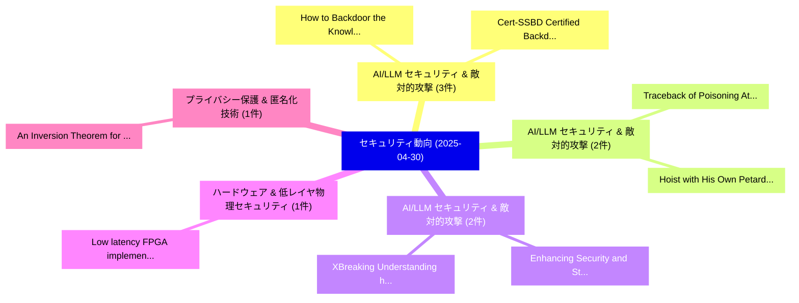

# 📅 02_daily: 日次エグゼクティブサマリー報告書 (2025-04-30)

**集計日時**: 2026-10-02 23:05:24 UTC  
**対象日付**: 2025-04-30  
**本日収集論文数**: 25 件  

---

## 💡 主要セキュリティ動向・脅威インサイト (Executive Insights)

本日の収集論文（計 25 件）において、以下の重点セキュリティ領域で活発な研究動向が確認されました：
- **AI/LLM セキュリティ & 敵対的攻撃** (3 件): 注目論文として 「How to Backdoor the Knowledge ...」、「Cert-SSBD: Certified Backdoor ...」 等が発表され、実務防御および攻撃検証の進展が見られます。
- **AI/LLM セキュリティ & 敵対的攻撃** (2 件): 注目論文として 「Traceback of Poisoning Attacks...」、「Hoist with His Own Petard: Ind...」 等が発表され、実務防御および攻撃検証の進展が見られます。
- **AI/LLM セキュリティ & 敵対的攻撃** (2 件): 注目論文として 「XBreaking: Understanding how L...」、「Enhancing Security and Strengt...」 等が発表され、実務防御および攻撃検証の進展が見られます。
- **ハードウェア & 低レイヤ物理セキュリティ** (1 件): 注目論文として 「Low latency FPGA implementatio...」 等が発表され、実務防御および攻撃検証の進展が見られます。
- **プライバシー保護 & 匿名化技術** (1 件): 注目論文として 「An Inversion Theorem for Buffe...」 等が発表され、実務防御および攻撃検証の進展が見られます。

### 🗺️ 技術・脅威トピックマインドマップ

---

## 📌 日次セキュリティ論文一覧 (日本語表形式)

| No | arXiv ID | 論文タイトル (日本語訳) | 重要キーワード | 構造化エグゼクティブ要約 (背景・提案・影響) | 脅威分類 | 詳細リンク |
|---|---|---|---|---|---|---|
| 1 | `2504.21323v2` | [How to Backdoor the Knowledge Distillation（セキュリティ分析論文）](../../okf/papers/2025-04-30/2504.21323.md) | `Knowledge Distillation`, `Chen Wu`, `Qian Ma` | 【提案】概要 (Overview & Key Finding) 本論文「How to Backdoor the Knowledge Distillation（セキュリティ分析論文）」...。実証評価により経営層・セキュリティ管理者向け推奨アクション (E... | `cs.CR` | [arXiv](https://arxiv.org/abs/2504.21323v2) &#124; [OKF](../../okf/papers/2025-04-30/2504.21323.md) |
| 2 | `2504.21342v1` | [Low latency FPGA implementation of twisted Edward curve cryptography hardware accelerator over prime field（セキュリティ分析論文）](../../okf/papers/2025-04-30/2504.21342.md) | `Mohammad Arif Sobhan Bhuiyan`, `Md Rownak Hossain`, `Md Sazedur Rahman` | 【提案】概要 (Overview & Key Finding) 本論文「Low latency FPGA implementation of twisted Edward curve...。実証評価により経営層・セキュリティ管理者向け推奨アクション (E... | `cs.CR` | [arXiv](https://arxiv.org/abs/2504.21342v1) &#124; [OKF](../../okf/papers/2025-04-30/2504.21342.md) |
| 3 | `2504.21413v1` | [An Inversion Theorem for Buffered Linear Toeplitz (BLT) Matrices and Applications to Streaming Differential Privacy（セキュリティ分析論文）](../../okf/papers/2025-04-30/2504.21413.md) | `Buffered Linear Toeplitz`, `Streaming Differential Privacy`, `Krishna Pillutla` | 【提案】概要 (Overview & Key Finding) 本論文「An Inversion Theorem for Buffered Linear Toeplitz (BLT)...。実証評価により経営層・セキュリティ管理者向け推奨アクション (E... | `cs.CR` | [arXiv](https://arxiv.org/abs/2504.21413v1) &#124; [OKF](../../okf/papers/2025-04-30/2504.21413.md) |
| 4 | `2504.21415v2` | [Optimizing Mouse Dynamics for User Authentication by Machine Learning: Addressing Data Sufficiency, Accuracy-Practicality Trade-off, and Model Performance Challenges（セキュリティ分析論文）](../../okf/papers/2025-04-30/2504.21415.md) | `Optimizing Mouse Dynamics`, `Addressing Data Sufficiency`, `Model Performance Challenges` | 【提案】概要 (Overview & Key Finding) 本論文「Optimizing Mouse Dynamics for User Authentication by Ma...。実証評価により経営層・セキュリティ管理者向け推奨アクション (E... | `cs.CR` | [arXiv](https://arxiv.org/abs/2504.21415v2) &#124; [OKF](../../okf/papers/2025-04-30/2504.21415.md) |
| 5 | `2504.21436v1` | [Whispers of Data: Unveiling Label Distributions in 連合学習 Through Virtual Client Simulation](../../okf/papers/2025-04-30/2504.21436.md) | `Unveiling Label Distributions`, `Zhixuan Ma`, `Haichang Gao` | 【提案】概要 (Overview & Key Finding) 本論文「Whispers of Data: Unveiling Label Distributions in 連合学習...。実証評価により経営層・セキュリティ管理者向け推奨アクション (E... | `cs.CR` | [arXiv](https://arxiv.org/abs/2504.21436v1) &#124; [OKF](../../okf/papers/2025-04-30/2504.21436.md) |
| 6 | `2504.21480v1` | [A Comprehensive Study of Exploitable Patterns in Smart Contracts: From Vulnerability to Defense（セキュリティ分析論文）](../../okf/papers/2025-04-30/2504.21480.md) | `Exploitable Patterns`, `Smart Contracts`, `Yuchen Ding` | 【提案】概要 (Overview & Key Finding) 本論文「A Comprehensive Study of Exploitable Patterns in スマートコン...。実証評価により経営層・セキュリティ管理者向け推奨アクション (E... | `cs.CR` | [arXiv](https://arxiv.org/abs/2504.21480v1) &#124; [OKF](../../okf/papers/2025-04-30/2504.21480.md) |
| 7 | `2504.21518v3` | [Confidential Serverless Computing（セキュリティ分析論文）](../../okf/papers/2025-04-30/2504.21518.md) | `Confidential Serverless Computing`, `Patrick Sabanic`, `Masanori Misono` | 【提案】概要 (Overview & Key Finding) 本論文「Confidential Serverless Computing（セキュリティ分析論文）」（原題: Conf...。実証評価により経営層・セキュリティ管理者向け推奨アクション (E... | `cs.CR` | [arXiv](https://arxiv.org/abs/2504.21518v3) &#124; [OKF](../../okf/papers/2025-04-30/2504.21518.md) |
| 8 | `2504.21520v1` | [Padding Matters -- Exploring Function Detection in PE Files（セキュリティ分析論文）](../../okf/papers/2025-04-30/2504.21520.md) | `Exploring Function Detection`, `Padding Matters`, `Raphael Springer` | 【提案】概要 (Overview & Key Finding) 本論文「Padding Matters -- Exploring Function Detection in PE F...。実証評価により経営層・セキュリティ管理者向け推奨アクション (E... | `cs.CR` | [arXiv](https://arxiv.org/abs/2504.21520v1) &#124; [OKF](../../okf/papers/2025-04-30/2504.21520.md) |
| 9 | `2504.21543v1` | [CryptoUNets: Applying Convolutional Networks to Encrypted Data for Biomedical Image Segmentation（セキュリティ分析論文）](../../okf/papers/2025-04-30/2504.21543.md) | `Applying Convolutional Networks`, `Biomedical Image Segmentation`, `Encrypted Data` | 【提案】概要 (Overview & Key Finding) 本論文「CryptoUNets: Applying Convolutional Networks to Encrypt...。実証評価により経営層・セキュリティ管理者向け推奨アクション (E... | `cs.CR` | [arXiv](https://arxiv.org/abs/2504.21543v1) &#124; [OKF](../../okf/papers/2025-04-30/2504.21543.md) |
| 10 | `2504.21574v1` | [Generative AI in Financial Institution: A Global Survey of Opportunities, Threats, and Regulation（セキュリティ分析論文）](../../okf/papers/2025-04-30/2504.21574.md) | `Financial Institution`, `Global Survey`, `Sandeep Kumar Shukla` | 【提案】概要 (Overview & Key Finding) 本論文「Generative AI in Financial Institution: A Global Survey...。実証評価により経営層・セキュリティ管理者向け推奨アクション (E... | `cs.CR` | [arXiv](https://arxiv.org/abs/2504.21574v1) &#124; [OKF](../../okf/papers/2025-04-30/2504.21574.md) |
| 11 | `2504.21618v1` | [Overlapping data in network protocols: bridging OS and NIDS reassembly gap（セキュリティ分析論文）](../../okf/papers/2025-04-30/2504.21618.md) | `Lucas Aubard`, `Johan Mazel`, `Gilles Guette` | 【提案】概要 (Overview & Key Finding) 本論文「Overlapping data in network protocols: bridging OS and ...。実証評価により経営層・セキュリティ管理者向け推奨アクション (E... | `cs.CR` | [arXiv](https://arxiv.org/abs/2504.21618v1) &#124; [OKF](../../okf/papers/2025-04-30/2504.21618.md) |
| 12 | `2504.21668v2` | [Traceback of Poisoning Attacks to Retrieval-Augmented Generation（セキュリティ分析論文）](../../okf/papers/2025-04-30/2504.21668.md) | `Poisoning Attacks`, `Augmented Generation`, `Retrieval-Augmented Generation` | 【提案】概要 (Overview & Key Finding) 本論文「Traceback of Poisoning Attacks to Retrieval-Augmented G...。実証評価により経営層・セキュリティ管理者向け推奨アクション (E... | `cs.CR` | [arXiv](https://arxiv.org/abs/2504.21668v2) &#124; [OKF](../../okf/papers/2025-04-30/2504.21668.md) |
| 13 | `2504.21680v1` | [Hoist with His Own Petard: Inducing Guardrails to Facilitate Denial-of-Service Attacks on Retrieval-Augmented Generation of LLMs（セキュリティ分析論文）](../../okf/papers/2025-04-30/2504.21680.md) | `Inducing Guardrails`, `Facilitate Denial`, `Service Attacks` | 【提案】概要 (Overview & Key Finding) 本論文「Hoist with His Own Petard: Inducing Guardrails to Facil...。実証評価により経営層・セキュリティ管理者向け推奨アクション (E... | `cs.CR` | [arXiv](https://arxiv.org/abs/2504.21680v1) &#124; [OKF](../../okf/papers/2025-04-30/2504.21680.md) |
| 14 | `2504.21700v3` | [XBreaking: Understanding how LLMs security alignment can be broken（セキュリティ分析論文）](../../okf/papers/2025-04-30/2504.21700.md) | `Vignesh Kumar Kembu`, `Marco Arazzi`, `Antonino Nocera` | 【提案】概要 (Overview & Key Finding) 本論文「XBreaking: Understanding how LLMs security alignment ca...。実証評価により経営層・セキュリティ管理者向け推奨アクション (E... | `cs.CR` | [arXiv](https://arxiv.org/abs/2504.21700v3) &#124; [OKF](../../okf/papers/2025-04-30/2504.21700.md) |
| 15 | `2504.21730v2` | [Cert-SSBD: Certified Backdoor Defense with Sample-Specific Smoothing Noises（セキュリティ分析論文）](../../okf/papers/2025-04-30/2504.21730.md) | `Certified Backdoor Defense`, `Specific Smoothing Noises`, `Sample-Specific Smoothing` | 【提案】概要 (Overview & Key Finding) 本論文「Cert-SSBD: Certified Backdoor Defense with Sample-Speci...。実証評価により経営層・セキュリティ管理者向け推奨アクション (E... | `cs.CR` | [arXiv](https://arxiv.org/abs/2504.21730v2) &#124; [OKF](../../okf/papers/2025-04-30/2504.21730.md) |
| 16 | `2504.21739v1` | [Bilateral Differentially Private Vertical Federated Boosted Decision Trees（セキュリティ分析論文）](../../okf/papers/2025-04-30/2504.21739.md) | `Bilateral Differentially Private Vertical Federated Boosted Decision Trees`, `Bilateral Differentially Private Vertical Federated Boosted Deci`, `Bokang Zhang` | 【提案】概要 (Overview & Key Finding) 本論文「Bilateral Differentially Private Vertical Federated Boo...。実証評価により経営層・セキュリティ管理者向け推奨アクション (E... | `cs.CR` | [arXiv](https://arxiv.org/abs/2504.21739v1) &#124; [OKF](../../okf/papers/2025-04-30/2504.21739.md) |
| 17 | `2504.21752v3` | [VDDP: Verifiable Distributed Differential Privacy under the Client-Server-Verifier Setup（セキュリティ分析論文）](../../okf/papers/2025-04-30/2504.21752.md) | `Verifiable Distributed Differential Privacy`, `Verifier Setup`, `Haochen Sun` | 【提案】概要 (Overview & Key Finding) 本論文「VDDP: Verifiable Distributed 差分プライバシー under the Client-...。実証評価により経営層・セキュリティ管理者向け推奨アクション (E... | `cs.CR` | [arXiv](https://arxiv.org/abs/2504.21752v3) &#124; [OKF](../../okf/papers/2025-04-30/2504.21752.md) |
| 18 | `2504.21770v1` | [LASHED: LLMs And Static Hardware Analysis for Early RTL Bugsの検出](../../okf/papers/2025-04-30/2504.21770.md) | `Early Detection`, `Baleegh Ahmad`, `Hammond Pearce` | 【提案】概要 (Overview & Key Finding) 本論文「LASHED: LLMs And Static Hardware Analysis for Early RTL...。実証評価により経営層・セキュリティ管理者向け推奨アクション (E... | `cs.CR` | [arXiv](https://arxiv.org/abs/2504.21770v1) &#124; [OKF](../../okf/papers/2025-04-30/2504.21770.md) |
| 19 | `2504.21803v1` | [An Empirical Study on the Effectiveness of 大規模言語モデル for Binary Code Understanding](../../okf/papers/2025-04-30/2504.21803.md) | `Binary Code Understanding`, `Large Language Models`, `Xiuwei Shang` | 【提案】概要 (Overview & Key Finding) 本論文「An Empirical Study on the Effectiveness of 大規模言語モデル for...。実証評価により経営層・セキュリティ管理者向け推奨アクション (E... | `cs.CR` | [arXiv](https://arxiv.org/abs/2504.21803v1) &#124; [OKF](../../okf/papers/2025-04-30/2504.21803.md) |
| 20 | `2504.21842v2` | [Cryptography without Long-Term Quantum Memory and Global Entanglement: Classical Setups for One-Time Programs, Copy Protection, and Stateful Obfuscation（セキュリティ分析論文）](../../okf/papers/2025-04-30/2504.21842.md) | `Term Quantum Memory`, `Global Entanglement`, `Classical Setups` | 【提案】背景とセキュリティ上の課題 (Background & Problem) 本研究はサイバー脅威環境におけるセキュリティ構造・脆弱性の検証を目的としています。(主要検出項目: ...。実証評価により経営層・セキュリティ管理者向け推奨アクション (E... | `cs.CR` | [arXiv](https://arxiv.org/abs/2504.21842v2) &#124; [OKF](../../okf/papers/2025-04-30/2504.21842.md) |
| 21 | `2504.21846v2` | [Combating Falsification of Speech Videos with Live Optical Signatures (Extended Version)（セキュリティ分析論文）](../../okf/papers/2025-04-30/2504.21846.md) | `Live Optical Signatures`, `Combating Falsification`, `Speech Videos` | 【提案】概要 (Overview & Key Finding) 本論文「Combating Falsification of Speech Videos with Live Opti...。実証評価により経営層・セキュリティ管理者向け推奨アクション (E... | `cs.CR` | [arXiv](https://arxiv.org/abs/2504.21846v2) &#124; [OKF](../../okf/papers/2025-04-30/2504.21846.md) |
| 22 | `2505.00061v1` | [Enhancing Security and Strengthening Defenses in Automated Short-Answer Grading Systems（セキュリティ分析論文）](../../okf/papers/2025-04-30/2505.00061.md) | `Answer Grading Systems`, `Enhancing Security`, `Strengthening Defenses` | 【提案】概要 (Overview & Key Finding) 本論文「Enhancing Security and Strengthening Defenses in Automa...。実証評価により経営層・セキュリティ管理者向け推奨アクション (E... | `cs.CR` | [arXiv](https://arxiv.org/abs/2505.00061v1) &#124; [OKF](../../okf/papers/2025-04-30/2505.00061.md) |
| 23 | `2505.00111v1` | [Security-by-Design at the Telco Edge with OSS: Challenges and Lessons Learned（セキュリティ分析論文）](../../okf/papers/2025-04-30/2505.00111.md) | `Telco Edge`, `Lessons Learned`, `Carmine Cesarano` | 【提案】概要 (Overview & Key Finding) 本論文「Security-by-Design at the Telco Edge with OSS: Challeng...。実証評価により経営層・セキュリティ管理者向け推奨アクション (E... | `cs.CR` | [arXiv](https://arxiv.org/abs/2505.00111v1) &#124; [OKF](../../okf/papers/2025-04-30/2505.00111.md) |
| 24 | `2505.00206v2` | [The Planted Orthogonal Vectors Problem（セキュリティ分析論文）](../../okf/papers/2025-04-30/2505.00206.md) | `Adam Polak`, `Alon Rosen`, `Raw Meta` | 【提案】概要 (Overview & Key Finding) 本論文「The Planted Orthogonal Vectors Problem（セキュリティ分析論文）」（原題:...。実証評価により経営層・セキュリティ管理者向け推奨アクション (E... | `cs.CR` | [arXiv](https://arxiv.org/abs/2505.00206v2) &#124; [OKF](../../okf/papers/2025-04-30/2505.00206.md) |
| 25 | `2505.01454v5` | [Sparsification Under Siege: Dual-Level Defense Against Poisoning in Communication-Efficient 連合学習](../../okf/papers/2025-04-30/2505.01454.md) | `Dual-Level Defense`, `Efficient Federated Learning`, `Communication-Efficient Federated` | 【提案】概要 (Overview & Key Finding) 本論文「Sparsification Under Siege: Dual-Level Defense Against ...。実証評価により経営層・セキュリティ管理者向け推奨アクション (E... | `cs.CR` | [arXiv](https://arxiv.org/abs/2505.01454v5) &#124; [OKF](../../okf/papers/2025-04-30/2505.01454.md) |

