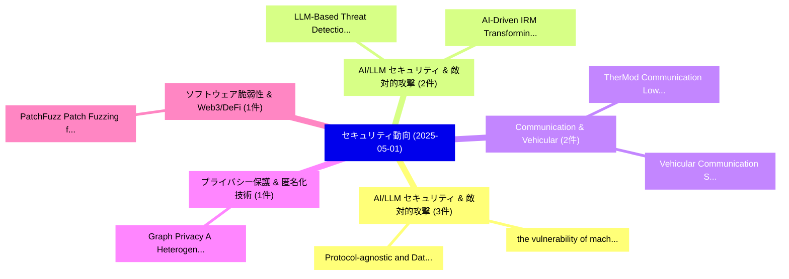

# 📅 02_daily: 日次エグゼクティブサマリー報告書 (2025-05-01)

**集計日時**: 2026-10-02 23:05:24 UTC  
**対象日付**: 2025-05-01  
**本日収集論文数**: 23 件  

---

## 💡 主要セキュリティ動向・脅威インサイト (Executive Insights)

本日の収集論文（計 23 件）において、以下の重点セキュリティ領域で活発な研究動向が確認されました：
- **AI/LLM セキュリティ & 敵対的攻撃** (3 件): 注目論文として 「the vulnerability of machine l...」、「Protocol-agnostic and Data-fre...」 等が発表され、実務防御および攻撃検証の進展が見られます。
- **AI/LLM セキュリティ & 敵対的攻撃** (2 件): 注目論文として 「LLM-Based Threat Detection and...」、「AI-Driven IRM: Transforming in...」 等が発表され、実務防御および攻撃検証の進展が見られます。
- **Communication & Vehicular** (2 件): 注目論文として 「Vehicular Communication Securi...」、「TherMod Communication: Low Pow...」 等が発表され、実務防御および攻撃検証の進展が見られます。
- **プライバシー保護 & 匿名化技術** (1 件): 注目論文として 「Graph Privacy: A Heterogeneous...」 等が発表され、実務防御および攻撃検証の進展が見られます。
- **ソフトウェア脆弱性 & Web3/DeFi** (1 件): 注目論文として 「PatchFuzz: Patch Fuzzing for J...」 等が発表され、実務防御および攻撃検証の進展が見られます。

### 🗺️ 技術・脅威トピックマインドマップ

---

## 📌 日次セキュリティ論文一覧 (日本語表形式)

| No | arXiv ID | 論文タイトル (日本語訳) | 重要キーワード | 構造化エグゼクティブ要約 (背景・提案・影響) | 脅威分類 | 詳細リンク |
|---|---|---|---|---|---|---|
| 1 | `2505.00240v2` | [LLM-Based Threat Detection and Prevention Framework for IoT Ecosystems（セキュリティ分析論文）](../../okf/papers/2025-05-01/2505.00240.md) | `Based Threat Detection`, `LLM-Based Threat`, `Yazan Otoum` | 【提案】概要 (Overview & Key Finding) 本論文「LLM-Based 脅威 Detection and Prevention Framework for IoT...。実証評価により経営層・セキュリティ管理者向け推奨アクション (E... | `cs.CR` | [arXiv](https://arxiv.org/abs/2505.00240v2) &#124; [OKF](../../okf/papers/2025-05-01/2505.00240.md) |
| 2 | `2505.00257v1` | [Graph Privacy: A Heterogeneous Federated GNN for Trans-Border Financial Data Circulation（セキュリティ分析論文）](../../okf/papers/2025-05-01/2505.00257.md) | `Border Financial Data Circulation`, `Graph Privacy`, `Heterogeneous Federated` | 【提案】概要 (Overview & Key Finding) 本論文「Graph Privacy: A Heterogeneous Federated GNN for Trans-...。実証評価により経営層・セキュリティ管理者向け推奨アクション (E... | `cs.CR` | [arXiv](https://arxiv.org/abs/2505.00257v1) &#124; [OKF](../../okf/papers/2025-05-01/2505.00257.md) |
| 3 | `2505.00289v1` | [PatchFuzz: Patch Fuzzing for JavaScript Engines（セキュリティ分析論文）](../../okf/papers/2025-05-01/2505.00289.md) | `Patch Fuzzing`, `Junjie Wang`, `Yuhan Ma` | 【提案】概要 (Overview & Key Finding) 本論文「PatchFuzz: Patch Fuzzing for JavaScript Engines（セキュリティ分...。実証評価により経営層・セキュリティ管理者向け推奨アクション (E... | `cs.CR` | [arXiv](https://arxiv.org/abs/2505.00289v1) &#124; [OKF](../../okf/papers/2025-05-01/2505.00289.md) |
| 4 | `2505.00340v2` | [Vehicular Communication Security: Multi-Channel and Multi-Factor Authentication（セキュリティ分析論文）](../../okf/papers/2025-05-01/2505.00340.md) | `Vehicular Communication Security`, `Factor Authentication`, `Multi-Factor Authentication` | 【提案】概要 (Overview & Key Finding) 本論文「Vehicular Communication Security: Multi-Channel and Mul...。実証評価により経営層・セキュリティ管理者向け推奨アクション (E... | `cs.CR` | [arXiv](https://arxiv.org/abs/2505.00340v2) &#124; [OKF](../../okf/papers/2025-05-01/2505.00340.md) |
| 5 | `2505.00465v1` | [HoneyWin: High-Interaction Windows Honeypot in Enterprise Environment（セキュリティ分析論文）](../../okf/papers/2025-05-01/2505.00465.md) | `Interaction Windows Honeypot`, `Enterprise Environment`, `High-Interaction Windows` | 【提案】概要 (Overview & Key Finding) 本論文「HoneyWin: High-Interaction Windows Honeypot in Enterpri...。実証評価により経営層・セキュリティ管理者向け推奨アクション (E... | `cs.CR` | [arXiv](https://arxiv.org/abs/2505.00465v1) &#124; [OKF](../../okf/papers/2025-05-01/2505.00465.md) |
| 6 | `2505.00480v1` | [Decentralized Vulnerability Disclosure via Permissioned Blockchain: A Secure, Transparent Alternative to Centralized CVE Management（セキュリティ分析論文）](../../okf/papers/2025-05-01/2505.00480.md) | `Decentralized Vulnerability Disclosure`, `Permissioned Blockchain`, `Transparent Alternative` | 【提案】概要 (Overview & Key Finding) 本論文「Decentralized 脆弱性 Disclosure via Permissioned Blockchai...。実証評価により経営層・セキュリティ管理者向け推奨アクション (E... | `cs.CR` | [arXiv](https://arxiv.org/abs/2505.00480v1) &#124; [OKF](../../okf/papers/2025-05-01/2505.00480.md) |
| 7 | `2505.00487v1` | [the vulnerability of machine learning regression models to adversarial attacks using data from 5G wireless networksの分析](../../okf/papers/2025-05-01/2505.00487.md) | `Leonid Legashev`, `Artur Zhigalov`, `Denis Parfenov` | 【提案】概要 (Overview & Key Finding) 本論文「the 脆弱性 of machine learning regression models to 敵対的攻撃s...。実証評価により経営層・セキュリティ管理者向け推奨アクション (E... | `cs.CR` | [arXiv](https://arxiv.org/abs/2505.00487v1) &#124; [OKF](../../okf/papers/2025-05-01/2505.00487.md) |
| 8 | `2505.00554v5` | [Protocols for Univariate Sumcheck（セキュリティ分析論文）](../../okf/papers/2025-05-01/2505.00554.md) | `Univariate Sumcheck`, `Malcom Mohamed`, `Raw Meta` | 【提案】概要 (Overview & Key Finding) 本論文「Protocols for Univariate Sumcheck（セキュリティ分析論文）」（原題: Prot...。実証評価により経営層・セキュリティ管理者向け推奨アクション (E... | `cs.CR` | [arXiv](https://arxiv.org/abs/2505.00554v5) &#124; [OKF](../../okf/papers/2025-05-01/2505.00554.md) |
| 9 | `2505.00593v1` | [A Novel Feature-Aware Chaotic Image Encryption Scheme For Data Security and Privacy in IoT and Edge Networks（セキュリティ分析論文）](../../okf/papers/2025-05-01/2505.00593.md) | `Edge Networks`, `Feature-Aware Chaotic`, `Muhammad Shahbaz Khan` | 【提案】概要 (Overview & Key Finding) 本論文「A Novel Feature-Aware Chaotic Image Encryption Scheme F...。実証評価により経営層・セキュリティ管理者向け推奨アクション (E... | `cs.CR` | [arXiv](https://arxiv.org/abs/2505.00593v1) &#124; [OKF](../../okf/papers/2025-05-01/2505.00593.md) |
| 10 | `2505.00618v2` | [RevealNet: Distributed Traffic Correlation for Attack Attribution on Programmable Networks（セキュリティ分析論文）](../../okf/papers/2025-05-01/2505.00618.md) | `Distributed Traffic Correlation`, `Attack Attribution`, `Programmable Networks` | 【提案】概要 (Overview & Key Finding) 本論文「RevealNet: Distributed Traffic Correlation for Attack A...。実証評価により経営層・セキュリティ管理者向け推奨アクション (E... | `cs.CR` | [arXiv](https://arxiv.org/abs/2505.00618v2) &#124; [OKF](../../okf/papers/2025-05-01/2505.00618.md) |
| 11 | `2505.00664v2` | [Key exchange protocol based on circulant matrix action over congruence-simple semiring（セキュリティ分析論文）](../../okf/papers/2025-05-01/2505.00664.md) | `congruence-simple semiring`, `Alvaro Otero Sanchez`, `Raw Meta` | 【提案】概要 (Overview & Key Finding) 本論文「Key exchange protocol based on circulant matrix action ...。実証評価により経営層・セキュリティ管理者向け推奨アクション (E... | `cs.CR` | [arXiv](https://arxiv.org/abs/2505.00664v2) &#124; [OKF](../../okf/papers/2025-05-01/2505.00664.md) |
| 12 | `2505.00665v1` | [Auditing without Leaks Despite Curiosity（セキュリティ分析論文）](../../okf/papers/2025-05-01/2505.00665.md) | `Leaks Despite Curiosity`, `Hagit Attiya`, `Alessia Milani` | 【提案】背景とセキュリティ上の課題 (Background & Problem) 本研究はサイバー脅威環境におけるセキュリティ構造・脆弱性の検証を目的としています。(主要検出項目: ...。実証評価により経営層・セキュリティ管理者向け推奨アクション (E... | `cs.CR` | [arXiv](https://arxiv.org/abs/2505.00665v1) &#124; [OKF](../../okf/papers/2025-05-01/2505.00665.md) |
| 13 | `2505.00817v1` | [Spill The Beans: Exploiting CPU Cache Side-Channels to Leak Tokens from 大規模言語モデル](../../okf/papers/2025-05-01/2505.00817.md) | `Cache Side`, `Leak Tokens`, `Large Language Models` | 【提案】概要 (Overview & Key Finding) 本論文「Spill The Beans: Exploiting CPU Cache サイドチャネル攻撃s to Lea...。実証評価により経営層・セキュリティ管理者向け推奨アクション (E... | `cs.CR` | [arXiv](https://arxiv.org/abs/2505.00817v1) &#124; [OKF](../../okf/papers/2025-05-01/2505.00817.md) |
| 14 | `2505.00841v1` | [From Texts to Shields: Convergence of 大規模言語モデル and Cybersecurity](../../okf/papers/2025-05-01/2505.00841.md) | `Large Language Models`, `Tao Li`, `Ting Yang` | 【提案】概要 (Overview & Key Finding) 本論文「From Texts to Shields: Convergence of 大規模言語モデル and Cybe...。実証評価により経営層・セキュリティ管理者向け推奨アクション (E... | `cs.CR` | [arXiv](https://arxiv.org/abs/2505.00841v1) &#124; [OKF](../../okf/papers/2025-05-01/2505.00841.md) |
| 15 | `2505.00843v1` | [OET: Optimization-based prompt injection Evaluation Toolkit（セキュリティ分析論文）](../../okf/papers/2025-05-01/2505.00843.md) | `Optimization-based prompt`, `Jinsheng Pan`, `Xiaogeng Liu` | 【提案】概要 (Overview & Key Finding) 本論文「OET: Optimization-based プロンプトインジェクション Evaluation Toolki...。実証評価により経営層・セキュリティ管理者向け推奨アクション (E... | `cs.CR` | [arXiv](https://arxiv.org/abs/2505.00843v1) &#124; [OKF](../../okf/papers/2025-05-01/2505.00843.md) |
| 16 | `2505.00849v3` | [TherMod Communication: Low Power or Hot Air?（セキュリティ分析論文）](../../okf/papers/2025-05-01/2505.00849.md) | `Low Power`, `Hot Air`, `Christiana Chamon` | 【提案】### (日本語題名: TherMod Communication: Low Power or Hot Air?（セキュリティ分析論文）)  > [!NOTE] > **OK...。実証評価により経営層・セキュリティ管理者向け推奨アクション (E... | `cs.CR` | [arXiv](https://arxiv.org/abs/2505.00849v3) &#124; [OKF](../../okf/papers/2025-05-01/2505.00849.md) |
| 17 | `2505.00858v2` | [Duality on the Thermodynamics of the Kirchhoff-Law-Johnson-Noise (KLJN) Secure Key Exchange Scheme（セキュリティ分析論文）](../../okf/papers/2025-05-01/2505.00858.md) | `Secure Key Exchange Scheme`, `Sarah Flanery`, `Anson Trapani` | 【提案】概要 (Overview & Key Finding) 本論文「Duality on the Thermodynamics of the Kirchhoff-Law-John...。実証評価により経営層・セキュリティ管理者向け推奨アクション (E... | `cs.CR` | [arXiv](https://arxiv.org/abs/2505.00858v2) &#124; [OKF](../../okf/papers/2025-05-01/2505.00858.md) |
| 18 | `2505.00881v1` | [Protocol-agnostic and Data-free Backdoor Attacks on Pre-trained Models in RF Fingerprinting（セキュリティ分析論文）](../../okf/papers/2025-05-01/2505.00881.md) | `Backdoor Attacks`, `Data-free Backdoor`, `Pre-trained Models` | 【提案】概要 (Overview & Key Finding) 本論文「Protocol-agnostic and Data-free Backdoor Attacks on Pre...。実証評価により経営層・セキュリティ管理者向け推奨アクション (E... | `cs.CR` | [arXiv](https://arxiv.org/abs/2505.00881v1) &#124; [OKF](../../okf/papers/2025-05-01/2505.00881.md) |
| 19 | `2505.00888v2` | [Balancing Security and Liquidity: A Time-Weighted Snapshot Framework for DAO Governance Voting（セキュリティ分析論文）](../../okf/papers/2025-05-01/2505.00888.md) | `Balancing Security`, `Governance Voting`, `Time-Weighted Snapshot` | 【提案】概要 (Overview & Key Finding) 本論文「Balancing Security and Liquidity: A Time-Weighted Snaps...。実証評価により経営層・セキュリティ管理者向け推奨アクション (E... | `cs.CR` | [arXiv](https://arxiv.org/abs/2505.00888v2) &#124; [OKF](../../okf/papers/2025-05-01/2505.00888.md) |
| 20 | `2505.00894v3` | [Non-Adaptive Cryptanalytic Time-Space Lower Bounds via a Shearer-like Inequality for Permutations（セキュリティ分析論文）](../../okf/papers/2025-05-01/2505.00894.md) | `Adaptive Cryptanalytic Time`, `Space Lower Bounds`, `Non-Adaptive Cryptanalytic` | 【提案】概要 (Overview & Key Finding) 本論文「Non-Adaptive Cryptanalytic Time-Space Lower Bounds via ...。実証評価により経営層・セキュリティ管理者向け推奨アクション (E... | `cs.CR` | [arXiv](https://arxiv.org/abs/2505.00894v3) &#124; [OKF](../../okf/papers/2025-05-01/2505.00894.md) |
| 21 | `2505.01460v1` | [Development of an Adapter for Analyzing and Protecting Machine Learning Models from Competitive Activity in the Networks Services（セキュリティ分析論文）](../../okf/papers/2025-05-01/2505.01460.md) | `Protecting Machine Learning Models`, `Competitive Activity`, `Networks Services` | 【提案】概要 (Overview & Key Finding) 本論文「Development of an Adapter for Analyzing and Protecting ...。実証評価により経営層・セキュリティ管理者向け推奨アクション (E... | `cs.CR` | [arXiv](https://arxiv.org/abs/2505.01460v1) &#124; [OKF](../../okf/papers/2025-05-01/2505.01460.md) |
| 22 | `2505.01463v2` | [Enhancing Cloud Security through Topic Modelling（セキュリティ分析論文）](../../okf/papers/2025-05-01/2505.01463.md) | `Enhancing Cloud Security`, `Topic Modelling`, `Nazim Madhavji` | 【提案】概要 (Overview & Key Finding) 本論文「Enhancing Cloud Security through Topic Modelling（セキュリティ...。実証評価によりSaleh, Nazim Madhavji, Jo... | `cs.CR` | [arXiv](https://arxiv.org/abs/2505.01463v2) &#124; [OKF](../../okf/papers/2025-05-01/2505.01463.md) |
| 23 | `2505.03796v1` | [AI-Driven IRM: Transforming insider risk management with adaptive scoring and LLM-based threat detection（セキュリティ分析論文）](../../okf/papers/2025-05-01/2505.03796.md) | `AI-Driven IRM`, `LLM-based threat`, `Lokesh Koli` | 【提案】概要 (Overview & Key Finding) 本論文「AI-Driven IRM: Transforming insider risk management wit...。実証評価により経営層・セキュリティ管理者向け推奨アクション (E... | `cs.CR` | [arXiv](https://arxiv.org/abs/2505.03796v1) &#124; [OKF](../../okf/papers/2025-05-01/2505.03796.md) |

