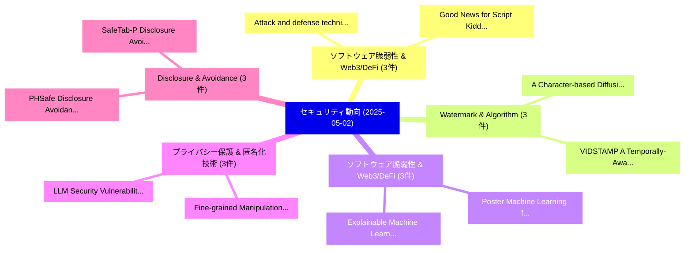

# 📅 02_daily: 日次エグゼクティブサマリー報告書 (2025-05-02)

**集計日時**: 2026-10-02 23:05:24 UTC  
**対象日付**: 2025-05-02  
**本日収集論文数**: 32 件  

---

## 💡 主要セキュリティ動向・脅威インサイト (Executive Insights)

本日の収集論文（計 32 件）において、以下の重点セキュリティ領域で活発な研究動向が確認されました：
- **ソフトウェア脆弱性 & Web3/DeFi** (3 件): 注目論文として 「Attack and defense techniques ...」、「Good News for Script Kiddies? ...」 等が発表され、実務防御および攻撃検証の進展が見られます。
- **Watermark & Algorithm** (3 件): 注目論文として 「A Character-based Diffusion Em...」、「VIDSTAMP: A Temporally-Aware W...」 等が発表され、実務防御および攻撃検証の進展が見られます。
- **ソフトウェア脆弱性 & Web3/DeFi** (3 件): 注目論文として 「Poster: Machine Learning for 脆...」、「Explainable Machine Learning f...」 等が発表され、実務防御および攻撃検証の進展が見られます。
- **プライバシー保護 & 匿名化技術** (3 件): 注目論文として 「LLM Security: Vulnerabilities,...」、「Fine-grained Manipulation Atta...」 等が発表され、実務防御および攻撃検証の進展が見られます。
- **Disclosure & Avoidance** (3 件): 注目論文として 「PHSafe: Disclosure Avoidance f...」、「SafeTab-P: Disclosure Avoidanc...」 等が発表され、実務防御および攻撃検証の進展が見られます。

### 🗺️ 技術・脅威トピックマインドマップ

---

## 📌 日次セキュリティ論文一覧 (日本語表形式)

| No | arXiv ID | 論文タイトル (日本語訳) | 重要キーワード | 構造化エグゼクティブ要約 (背景・提案・影響) | 脅威分類 | 詳細リンク |
|---|---|---|---|---|---|---|
| 1 | `2505.00946v1` | [Addressing Noise and Stochasticity in Fraud Detection for Service Networks（セキュリティ分析論文）](../../okf/papers/2025-05-02/2505.00946.md) | `Addressing Noise`, `Fraud Detection`, `Service Networks` | 【提案】概要 (Overview & Key Finding) 本論文「Addressing Noise and Stochasticity in Fraud Detection f...。実証評価により経営層・セキュリティ管理者向け推奨アクション (E... | `cs.CR` | [arXiv](https://arxiv.org/abs/2505.00946v1) &#124; [OKF](../../okf/papers/2025-05-02/2505.00946.md) |
| 2 | `2505.00951v1` | [Preserving Privacy and Utility in LLM-Based Product Recommendations（セキュリティ分析論文）](../../okf/papers/2025-05-02/2505.00951.md) | `Based Product Recommendations`, `Preserving Privacy`, `LLM-Based Product` | 【提案】概要 (Overview & Key Finding) 本論文「Preserving Privacy and Utility in LLM-Based Product Rec...。実証評価により経営層・セキュリティ管理者向け推奨アクション (E... | `cs.CR` | [arXiv](https://arxiv.org/abs/2505.00951v1) &#124; [OKF](../../okf/papers/2025-05-02/2505.00951.md) |
| 3 | `2505.00976v1` | [Attack and defense techniques in 大規模言語モデル: A survey and new perspectives](../../okf/papers/2025-05-02/2505.00976.md) | `Zhiyu Liao`, `Kang Chen`, `Yuanguo Lin` | 【提案】概要 (Overview & Key Finding) 本論文「Attack and defense techniques in 大規模言語モデル: A survey and...。実証評価により経営層・セキュリティ管理者向け推奨アクション (E... | `cs.CR` | [arXiv](https://arxiv.org/abs/2505.00976v1) &#124; [OKF](../../okf/papers/2025-05-02/2505.00976.md) |
| 4 | `2505.00977v2` | [A Character-based Diffusion Embedding Algorithm for Enhancing the Generation Quality of Generative Linguistic Steganographic Texts（セキュリティ分析論文）](../../okf/papers/2025-05-02/2505.00977.md) | `Generative Linguistic Steganographic Texts`, `Diffusion Embedding Algorithm`, `Generation Quality` | 【提案】概要 (Overview & Key Finding) 本論文「A Character-based Diffusion Embedding Algorithm for Enh...。実証評価により経営層・セキュリティ管理者向け推奨アクション (E... | `cs.CR` | [arXiv](https://arxiv.org/abs/2505.00977v2) &#124; [OKF](../../okf/papers/2025-05-02/2505.00977.md) |
| 5 | `2505.01012v3` | [Quantum Support Vector Regression for Robust Anomaly Detection（セキュリティ分析論文）](../../okf/papers/2025-05-02/2505.01012.md) | `Quantum Support Vector Regression`, `Robust Anomaly Detection`, `Kilian Tscharke` | 【提案】概要 (Overview & Key Finding) 本論文「量子 Support Vector Regression for Robust Anomaly Detecti...。実証評価により経営層・セキュリティ管理者向け推奨アクション (E... | `cs.CR` | [arXiv](https://arxiv.org/abs/2505.01012v3) &#124; [OKF](../../okf/papers/2025-05-02/2505.01012.md) |
| 6 | `2505.01028v1` | [Adaptive Wizard for Removing Cross-Tier Misconfigurations in Active Directory（セキュリティ分析論文）](../../okf/papers/2025-05-02/2505.01028.md) | `Adaptive Wizard`, `Removing Cross`, `Tier Misconfigurations` | 【提案】概要 (Overview & Key Finding) 本論文「Adaptive Wizard for Removing Cross-Tier Misconfiguratio...。実証評価により経営層・セキュリティ管理者向け推奨アクション (E... | `cs.CR` | [arXiv](https://arxiv.org/abs/2505.01028v1) &#124; [OKF](../../okf/papers/2025-05-02/2505.01028.md) |
| 7 | `2505.01048v1` | [Capability-Based Multi-Tenant Access Management in Crowdsourced Drone Services（セキュリティ分析論文）](../../okf/papers/2025-05-02/2505.01048.md) | `Tenant Access Management`, `Crowdsourced Drone Services`, `Based Multi` | 【提案】概要 (Overview & Key Finding) 本論文「Capability-Based Multi-Tenant Access Management in Crow...。実証評価により経営層・セキュリティ管理者向け推奨アクション (E... | `cs.CR` | [arXiv](https://arxiv.org/abs/2505.01048v1) &#124; [OKF](../../okf/papers/2025-05-02/2505.01048.md) |
| 8 | `2505.01065v1` | [Good News for Script Kiddies? Evaluating 大規模言語モデル for Automated Exploit Generation](../../okf/papers/2025-05-02/2505.01065.md) | `Automated Exploit Generation`, `Good News`, `Script Kiddies` | 【提案】Evaluating Large Language Models for Automated エクスプロイト Generation ### (日本語題名: Good News...。実証評価により経営層・セキュリティ管理者向け推奨アクション (E... | `cs.CR` | [arXiv](https://arxiv.org/abs/2505.01065v1) &#124; [OKF](../../okf/papers/2025-05-02/2505.01065.md) |
| 9 | `2505.01067v1` | [A Rusty Link in the AI Supply Chain: Detecting Evil Configurations in Model Repositories（セキュリティ分析論文）](../../okf/papers/2025-05-02/2505.01067.md) | `Detecting Evil Configurations`, `Rusty Link`, `Supply Chain` | 【提案】概要 (Overview & Key Finding) 本論文「A Rusty Link in the AI Supply Chain: Detecting Evil Con...。実証評価により経営層・セキュリティ管理者向け推奨アクション (E... | `cs.CR` | [arXiv](https://arxiv.org/abs/2505.01067v1) &#124; [OKF](../../okf/papers/2025-05-02/2505.01067.md) |
| 10 | `2505.01123v1` | [Poster: Machine Learning for 脆弱性検出 as Target Oracle in Automated Fuzz Driver Generation](../../okf/papers/2025-05-02/2505.01123.md) | `Automated Fuzz Driver Generation`, `Machine Learning`, `Target Oracle` | 【提案】概要 (Overview & Key Finding) 本論文「Poster: Machine Learning for 脆弱性検出 as Target Oracle in ...。実証評価により経営層・セキュリティ管理者向け推奨アクション (E... | `cs.CR` | [arXiv](https://arxiv.org/abs/2505.01123v1) &#124; [OKF](../../okf/papers/2025-05-02/2505.01123.md) |
| 11 | `2505.01139v2` | [Active Sybil attack and efficient defense strategy in IPFS DHT（セキュリティ分析論文）](../../okf/papers/2025-05-02/2505.01139.md) | `Active Sybil`, `Moura Netto`, `Raw Meta` | 【提案】概要 (Overview & Key Finding) 本論文「Active Sybil attack and efficient defense strategy in I...。実証評価によりCholez, C.。 | `cs.CR` | [arXiv](https://arxiv.org/abs/2505.01139v2) &#124; [OKF](../../okf/papers/2025-05-02/2505.01139.md) |
| 12 | `2505.01177v1` | [LLM Security: Vulnerabilities, Attacks, Defenses, and Countermeasures（セキュリティ分析論文）](../../okf/papers/2025-05-02/2505.01177.md) | `Francisco Aguilera`, `Fernando Berzal`, `Raw Meta` | 【提案】概要 (Overview & Key Finding) 本論文「LLM Security: Vulnerabilities, Attacks, Defenses, and C...。実証評価により経営層・セキュリティ管理者向け推奨アクション (E... | `cs.CR` | [arXiv](https://arxiv.org/abs/2505.01177v1) &#124; [OKF](../../okf/papers/2025-05-02/2505.01177.md) |
| 13 | `2505.01186v1` | [Secure Cluster-Based Hierarchical 連合学習 in Vehicular Networks](../../okf/papers/2025-05-02/2505.01186.md) | `Secure Cluster`, `Vehicular Networks`, `Cluster-Based Hierarchical` | 【提案】概要 (Overview & Key Finding) 本論文「Secure Cluster-Based Hierarchical 連合学習 in Vehicular Net...。実証評価によりSaeid HaghighiFard, Sinem... | `cs.CR` | [arXiv](https://arxiv.org/abs/2505.01186v1) &#124; [OKF](../../okf/papers/2025-05-02/2505.01186.md) |
| 14 | `2505.01254v1` | [PHSafe: Disclosure Avoidance for the 2020 Census Supplemental Demographic and Housing Characteristics File (S-DHC)（セキュリティ分析論文）](../../okf/papers/2025-05-02/2505.01254.md) | `Census Supplemental Demographic`, `Housing Characteristics File`, `Disclosure Avoidance` | 【提案】概要 (Overview & Key Finding) 本論文「PHSafe: Disclosure Avoidance for the 2020 Census Supple...。実証評価により経営層・セキュリティ管理者向け推奨アクション (E... | `cs.CR` | [arXiv](https://arxiv.org/abs/2505.01254v1) &#124; [OKF](../../okf/papers/2025-05-02/2505.01254.md) |
| 15 | `2505.01287v2` | [Shuffling Cards When You Are of Very Little Brain: Low Memory Generation of Permutations（セキュリティ分析論文）](../../okf/papers/2025-05-02/2505.01287.md) | `Low Memory Generation`, `Boaz Menuhin`, `Moni Naor` | 【提案】概要 (Overview & Key Finding) 本論文「Shuffling Cards When You Are of Very Little Brain: Low ...。実証評価により経営層・セキュリティ管理者向け推奨アクション (E... | `cs.CR` | [arXiv](https://arxiv.org/abs/2505.01287v2) &#124; [OKF](../../okf/papers/2025-05-02/2505.01287.md) |
| 16 | `2505.01292v1` | [Fine-grained Manipulation Attacks to Local Differential Privacy Protocols for Data Streams（セキュリティ分析論文）](../../okf/papers/2025-05-02/2505.01292.md) | `Local Differential Privacy Protocols`, `Manipulation Attacks`, `Fine-grained Manipulation` | 【提案】概要 (Overview & Key Finding) 本論文「Fine-grained Manipulation Attacks to Local 差分プライバシー Pro...。実証評価により経営層・セキュリティ管理者向け推奨アクション (E... | `cs.CR` | [arXiv](https://arxiv.org/abs/2505.01292v1) &#124; [OKF](../../okf/papers/2025-05-02/2505.01292.md) |
| 17 | `2505.01328v1` | [Constrained Network Adversarial Attacks: Validity, Robustness, and Transferability（セキュリティ分析論文）](../../okf/papers/2025-05-02/2505.01328.md) | `Constrained Network Adversarial Attacks`, `Btissam El Khamlichi`, `Amal El Fallah` | 【提案】概要 (Overview & Key Finding) 本論文「Constrained Network 敵対的攻撃s: Validity, Robustness, and T...。実証評価により経営層・セキュリティ管理者向け推奨アクション (E... | `cs.CR` | [arXiv](https://arxiv.org/abs/2505.01328v1) &#124; [OKF](../../okf/papers/2025-05-02/2505.01328.md) |
| 18 | `2505.01406v2` | [VIDSTAMP: A Temporally-Aware Watermark for Ownership and Integrity in Video Diffusion Models（セキュリティ分析論文）](../../okf/papers/2025-05-02/2505.01406.md) | `Video Diffusion Models`, `Aware Watermark`, `Temporally-Aware Watermark` | 【提案】概要 (Overview & Key Finding) 本論文「VIDSTAMP: A Temporally-Aware Watermark for Ownership an...。実証評価により経営層・セキュリティ管理者向け推奨アクション (E... | `cs.CR` | [arXiv](https://arxiv.org/abs/2505.01406v2) &#124; [OKF](../../okf/papers/2025-05-02/2505.01406.md) |
| 19 | `2505.01472v1` | [SafeTab-P: Disclosure Avoidance for the 2020 Census Detailed Demographic and Housing Characteristics File A (Detailed DHC-A)（セキュリティ分析論文）](../../okf/papers/2025-05-02/2505.01472.md) | `Census Detailed Demographic`, `Housing Characteristics File`, `Disclosure Avoidance` | 【提案】概要 (Overview & Key Finding) 本論文「SafeTab-P: Disclosure Avoidance for the 2020 Census Det...。実証評価により経営層・セキュリティ管理者向け推奨アクション (E... | `cs.CR` | [arXiv](https://arxiv.org/abs/2505.01472v1) &#124; [OKF](../../okf/papers/2025-05-02/2505.01472.md) |
| 20 | `2505.01474v1` | [Watermark Overwriting Attack on StegaStamp algorithm（セキュリティ分析論文）](../../okf/papers/2025-05-02/2505.01474.md) | `Watermark Overwriting Attack`, `Raw Meta`, `Executive Summary` | 【提案】概要 (Overview & Key Finding) 本論文「Watermark Overwriting Attack on StegaStamp algorithm（セキ...。実証評価によりAntsiferova - **公開日時**: `... | `cs.CR` | [arXiv](https://arxiv.org/abs/2505.01474v1) &#124; [OKF](../../okf/papers/2025-05-02/2505.01474.md) |
| 21 | `2505.01484v2` | [LLM Watermarking Using Mixtures and Statistical-to-Computational Gaps（セキュリティ分析論文）](../../okf/papers/2025-05-02/2505.01484.md) | `Watermarking Using Mixtures`, `Computational Gaps`, `Pedro Abdalla` | 【提案】概要 (Overview & Key Finding) 本論文「LLM Watermarking Using Mixtures and Statistical-to-Comp...。実証評価により経営層・セキュリティ管理者向け推奨アクション (E... | `cs.CR` | [arXiv](https://arxiv.org/abs/2505.01484v2) &#124; [OKF](../../okf/papers/2025-05-02/2505.01484.md) |
| 22 | `2505.01488v1` | [Explainable Machine Learning for Cyberattack Identification from Traffic Flows（セキュリティ分析論文）](../../okf/papers/2025-05-02/2505.01488.md) | `Explainable Machine Learning`, `Cyberattack Identification`, `Traffic Flows` | 【提案】概要 (Overview & Key Finding) 本論文「Explainable Machine Learning for Cyberattack Identifica...。実証評価により経営層・セキュリティ管理者向け推奨アクション (E... | `cs.CR` | [arXiv](https://arxiv.org/abs/2505.01488v1) &#124; [OKF](../../okf/papers/2025-05-02/2505.01488.md) |
| 23 | `2505.01489v1` | [Machine Learning for Cyber-Attack Identification from Traffic Flows（セキュリティ分析論文）](../../okf/papers/2025-05-02/2505.01489.md) | `Machine Learning`, `Attack Identification`, `Traffic Flows` | 【提案】概要 (Overview & Key Finding) 本論文「Machine Learning for Cyber-Attack Identification from T...。実証評価によりJacquet, Robel Dawit, Sky... | `cs.CR` | [arXiv](https://arxiv.org/abs/2505.01489v1) &#124; [OKF](../../okf/papers/2025-05-02/2505.01489.md) |
| 24 | `2505.01514v1` | [the Future of IVR: AI-Driven Innovation with Agile Security, Data Regulation, and Ethical AI Integrationのセキュリティ強化](../../okf/papers/2025-05-02/2505.01514.md) | `Driven Innovation`, `Agile Security`, `AI-Driven Innovation` | 【提案】概要 (Overview & Key Finding) 本論文「the Future of IVR: AI-Driven Innovation with Agile Secu...。実証評価により経営層・セキュリティ管理者向け推奨アクション (E... | `cs.CR` | [arXiv](https://arxiv.org/abs/2505.01514v1) &#124; [OKF](../../okf/papers/2025-05-02/2505.01514.md) |
| 25 | `2505.01518v2` | [Rubber Mallet: A Study of High Frequency Localized Bit Flips and Their Impact on Security（セキュリティ分析論文）](../../okf/papers/2025-05-02/2505.01518.md) | `High Frequency Localized Bit Flips`, `Rubber Mallet`, `Fatemeh Khojasteh Dana` | 【提案】概要 (Overview & Key Finding) 本論文「Rubber Mallet: A Study of High Frequency Localized Bit ...。実証評価により経営層・セキュリティ管理者向け推奨アクション (E... | `cs.CR` | [arXiv](https://arxiv.org/abs/2505.01518v2) &#124; [OKF](../../okf/papers/2025-05-02/2505.01518.md) |
| 26 | `2505.01524v1` | [The DCR Delusion: Measuring the Privacy Risk of Synthetic Data（セキュリティ分析論文）](../../okf/papers/2025-05-02/2505.01524.md) | `Privacy Risk`, `Synthetic Data`, `Zexi Yao` | 【提案】概要 (Overview & Key Finding) 本論文「The DCR Delusion: Measuring the Privacy Risk of Synthet...。実証評価により経営層・セキュリティ管理者向け推奨アクション (E... | `cs.CR` | [arXiv](https://arxiv.org/abs/2505.01524v1) &#124; [OKF](../../okf/papers/2025-05-02/2505.01524.md) |
| 27 | `2505.01536v1` | [Disassembly as Weighted Interval Scheduling with Learned Weights（セキュリティ分析論文）](../../okf/papers/2025-05-02/2505.01536.md) | `Weighted Interval Scheduling`, `Learned Weights`, `Antonio Flores` | 【提案】概要 (Overview & Key Finding) 本論文「Disassembly as Weighted Interval Scheduling with Learne...。実証評価により経営層・セキュリティ管理者向け推奨アクション (E... | `cs.CR` | [arXiv](https://arxiv.org/abs/2505.01536v1) &#124; [OKF](../../okf/papers/2025-05-02/2505.01536.md) |
| 28 | `2505.01538v3` | [HONEYBEE: Efficient Role-based Access Control for Vector Databases via Dynamic Partitioning[Technical Report]（セキュリティ分析論文）](../../okf/papers/2025-05-02/2505.01538.md) | `Efficient Role`, `Access Control`, `Vector Databases` | 【提案】概要 (Overview & Key Finding) 本論文「HONEYBEE: Efficient Role-based アクセス制御 for Vector Databa...。実証評価により経営層・セキュリティ管理者向け推奨アクション (E... | `cs.CR` | [arXiv](https://arxiv.org/abs/2505.01538v3) &#124; [OKF](../../okf/papers/2025-05-02/2505.01538.md) |
| 29 | `2505.02860v1` | [Allocation of Heterogeneous Resources in General Lotto Games（セキュリティ分析論文）](../../okf/papers/2025-05-02/2505.02860.md) | `General Lotto Games`, `Heterogeneous Resources`, `Keith Paarporn` | 【提案】概要 (Overview & Key Finding) 本論文「Allocation of Heterogeneous Resources in General Lotto ...。実証評価によりMarden - **公開日時**: `2025-... | `cs.CR` | [arXiv](https://arxiv.org/abs/2505.02860v1) &#124; [OKF](../../okf/papers/2025-05-02/2505.02860.md) |
| 30 | `2505.03072v1` | [SafeTab-H: Disclosure Avoidance for the 2020 Census Detailed Demographic and Housing Characteristics File B (Detailed DHC-B)（セキュリティ分析論文）](../../okf/papers/2025-05-02/2505.03072.md) | `Census Detailed Demographic`, `Housing Characteristics File`, `Disclosure Avoidance` | 【提案】概要 (Overview & Key Finding) 本論文「SafeTab-H: Disclosure Avoidance for the 2020 Census Det...。実証評価により経営層・セキュリティ管理者向け推奨アクション (E... | `cs.CR` | [arXiv](https://arxiv.org/abs/2505.03072v1) &#124; [OKF](../../okf/papers/2025-05-02/2505.03072.md) |
| 31 | `2505.03817v1` | [Modeling Behavioral Preferences of Cyber Adversaries Using Inverse Reinforcement Learning（セキュリティ分析論文）](../../okf/papers/2025-05-02/2505.03817.md) | `Cyber Adversaries Using Inverse Reinforcement Learning`, `Modeling Behavioral Preferences`, `Cyber Adversaries Using Inverse Re` | 【提案】概要 (Overview & Key Finding) 本論文「Modeling Behavioral Preferences of Cyber Adversaries Us...。実証評価により経営層・セキュリティ管理者向け推奨アクション (E... | `cs.CR` | [arXiv](https://arxiv.org/abs/2505.03817v1) &#124; [OKF](../../okf/papers/2025-05-02/2505.03817.md) |
| 32 | `2505.07834v1` | [ai.txt: A Domain-Specific Language for Guiding AI Interactions with the Internet（セキュリティ分析論文）](../../okf/papers/2025-05-02/2505.07834.md) | `Specific Language`, `Domain-Specific Language`, `Yuekang Li` | 【提案】概要 (Overview & Key Finding) 本論文「ai.txt: A Domain-Specific Language for Guiding AI Inter...。実証評価により経営層・セキュリティ管理者向け推奨アクション (E... | `cs.CR` | [arXiv](https://arxiv.org/abs/2505.07834v1) &#124; [OKF](../../okf/papers/2025-05-02/2505.07834.md) |

