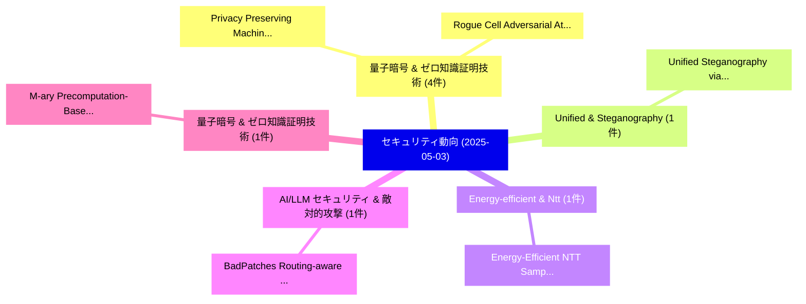

# 📅 02_daily: 日次エグゼクティブサマリー報告書 (2025-05-03)

**集計日時**: 2026-10-02 23:05:24 UTC  
**対象日付**: 2025-05-03  
**本日収集論文数**: 10 件  

---

## 💡 主要セキュリティ動向・脅威インサイト (Executive Insights)

本日の収集論文（計 10 件）において、以下の重点セキュリティ領域で活発な研究動向が確認されました：
- **量子暗号 & ゼロ知識証明技術** (4 件): 注目論文として 「Privacy Preserving Machine Lea...」、「Rogue Cell: Adversarial Attack...」 等が発表され、実務防御および攻撃検証の進展が見られます。
- **Unified & Steganography** (1 件): 注目論文として 「Unified Steganography via Impl...」 等が発表され、実務防御および攻撃検証の進展が見られます。
- **Energy-efficient & Ntt** (1 件): 注目論文として 「Energy-Efficient NTT Sampler f...」 等が発表され、実務防御および攻撃検証の進展が見られます。
- **AI/LLM セキュリティ & 敵対的攻撃** (1 件): 注目論文として 「BadPatches: Routing-aware Back...」 等が発表され、実務防御および攻撃検証の進展が見られます。
- **量子暗号 & ゼロ知識証明技術** (1 件): 注目論文として 「M-ary Precomputation-Based Acc...」 等が発表され、実務防御および攻撃検証の進展が見られます。

### 🗺️ 技術・脅威トピックマインドマップ

---

## 📌 日次セキュリティ論文一覧 (日本語表形式)

| No | arXiv ID | 論文タイトル (日本語訳) | 重要キーワード | 構造化エグゼクティブ要約 (背景・提案・影響) | 脅威分類 | 詳細リンク |
|---|---|---|---|---|---|---|
| 1 | `2505.01749v1` | [Unified Steganography via Implicit Neural Representation（セキュリティ分析論文）](../../okf/papers/2025-05-03/2505.01749.md) | `Implicit Neural Representation`, `Unified Steganography`, `Qi Song` | 【提案】概要 (Overview & Key Finding) 本論文「Unified Steganography via Implicit Neural Representatio...。実証評価により経営層・セキュリティ管理者向け推奨アクション (E... | `cs.CR` | [arXiv](https://arxiv.org/abs/2505.01749v1) &#124; [OKF](../../okf/papers/2025-05-03/2505.01749.md) |
| 2 | `2505.01782v1` | [Energy-Efficient NTT Sampler for Kyber Benchmarked on FPGA（セキュリティ分析論文）](../../okf/papers/2025-05-03/2505.01782.md) | `Kyber Benchmarked`, `Energy-Efficient NTT`, `Sumit Kumar Debnath` | 【提案】概要 (Overview & Key Finding) 本論文「Energy-Efficient NTT Sampler for Kyber Benchmarked on F...。実証評価により経営層・セキュリティ管理者向け推奨アクション (E... | `cs.CR` | [arXiv](https://arxiv.org/abs/2505.01782v1) &#124; [OKF](../../okf/papers/2025-05-03/2505.01782.md) |
| 3 | `2505.01788v1` | [Privacy Preserving Machine Learning Model Personalization through Federated Personalized Learning（セキュリティ分析論文）](../../okf/papers/2025-05-03/2505.01788.md) | `Privacy Preserving Machine Learning Model Personalization`, `Federated Personalized Learning`, `Shadman Sakeeb Khan` | 【提案】概要 (Overview & Key Finding) 本論文「Privacy Preserving Machine Learning Model Personalizati...。実証評価により経営層・セキュリティ管理者向け推奨アクション (E... | `cs.CR` | [arXiv](https://arxiv.org/abs/2505.01788v1) &#124; [OKF](../../okf/papers/2025-05-03/2505.01788.md) |
| 4 | `2505.01811v3` | [BadPatches: Routing-aware Backdoor Attacks on Vision Mixture of Experts（セキュリティ分析論文）](../../okf/papers/2025-05-03/2505.01811.md) | `Backdoor Attacks`, `Vision Mixture`, `Routing-aware Backdoor` | 【提案】概要 (Overview & Key Finding) 本論文「BadPatches: Routing-aware Backdoor Attacks on Vision Mi...。実証評価により経営層・セキュリティ管理者向け推奨アクション (E... | `cs.CR` | [arXiv](https://arxiv.org/abs/2505.01811v3) &#124; [OKF](../../okf/papers/2025-05-03/2505.01811.md) |
| 5 | `2505.01816v1` | [Rogue Cell: Adversarial Attack and Defense in Untrusted O-RAN Setup Exploiting the Traffic Steering xApp（セキュリティ分析論文）](../../okf/papers/2025-05-03/2505.01816.md) | `Rogue Cell`, `Adversarial Attack`, `Setup Exploiting` | 【提案】概要 (Overview & Key Finding) 本論文「Rogue Cell: 敵対的攻撃 and Defense in Untrusted O-RAN Setup ...。実証評価により経営層・セキュリティ管理者向け推奨アクション (E... | `cs.CR` | [arXiv](https://arxiv.org/abs/2505.01816v1) &#124; [OKF](../../okf/papers/2025-05-03/2505.01816.md) |
| 6 | `2505.01845v1` | [M-ary Precomputation-Based Accelerated Scalar Multiplication Algorithms for Enhanced Elliptic Curve Cryptography（セキュリティ分析論文）](../../okf/papers/2025-05-03/2505.01845.md) | `Based Accelerated Scalar Multiplication Algorithms`, `Enhanced Elliptic Curve Cryptography`, `M-ary Precomputation` | 【提案】概要 (Overview & Key Finding) 本論文「M-ary Precomputation-Based Accelerated Scalar Multiplic...。実証評価により経営層・セキュリティ管理者向け推奨アクション (E... | `cs.CR` | [arXiv](https://arxiv.org/abs/2505.01845v1) &#124; [OKF](../../okf/papers/2025-05-03/2505.01845.md) |
| 7 | `2505.01866v1` | [PQS-BFL: A Post-Quantum Secure Blockchain-based 連合学習 Framework](../../okf/papers/2025-05-03/2505.01866.md) | `Quantum Secure Blockchain`, `Post-Quantum Secure`, `Blockchain-based Federated` | 【提案】概要 (Overview & Key Finding) 本論文「PQS-BFL: A Post-量子 Secure Blockchain-based 連合学習 Framewo...。実証評価によりCrosby - **公開。 | `cs.CR` | [arXiv](https://arxiv.org/abs/2505.01866v1) &#124; [OKF](../../okf/papers/2025-05-03/2505.01866.md) |
| 8 | `2505.01873v1` | [An Approach for Handling Missing Attribute Values in Attribute-Based Access Control Policy Mining（セキュリティ分析論文）](../../okf/papers/2025-05-03/2505.01873.md) | `Based Access Control Policy Mining`, `Handling Missing Attribute Values`, `Attribute-Based Access` | 【提案】概要 (Overview & Key Finding) 本論文「An Approach for Handling Missing Attribute Values in At...。実証評価により経営層・セキュリティ管理者向け推奨アクション (E... | `cs.CR` | [arXiv](https://arxiv.org/abs/2505.01873v1) &#124; [OKF](../../okf/papers/2025-05-03/2505.01873.md) |
| 9 | `2505.01874v2` | [Trustworthy Federated Learning with Untrusted Participantsに向けて](../../okf/papers/2025-05-03/2505.01874.md) | `Towards Trustworthy Federated Learning`, `Trustworthy Federated Learning`, `Untrusted Participants` | 【提案】概要 (Overview & Key Finding) 本論文「Trustworthy Federated Learning with Untrusted Participa...。実証評価により経営層・セキュリティ管理者向け推奨アクション (E... | `cs.CR` | [arXiv](https://arxiv.org/abs/2505.01874v2) &#124; [OKF](../../okf/papers/2025-05-03/2505.01874.md) |
| 10 | `2505.01941v2` | [UK Finfluencers: Exploring Content, Reach, and Responsibility（セキュリティ分析論文）](../../okf/papers/2025-05-03/2505.01941.md) | `Exploring Content`, `Essam Ghadafi`, `Panagiotis Andriotis` | 【提案】概要 (Overview & Key Finding) 本論文「UK Finfluencers: Exploring Content, Reach, and Responsi...。実証評価により経営層・セキュリティ管理者向け推奨アクション (E... | `cs.CR` | [arXiv](https://arxiv.org/abs/2505.01941v2) &#124; [OKF](../../okf/papers/2025-05-03/2505.01941.md) |

