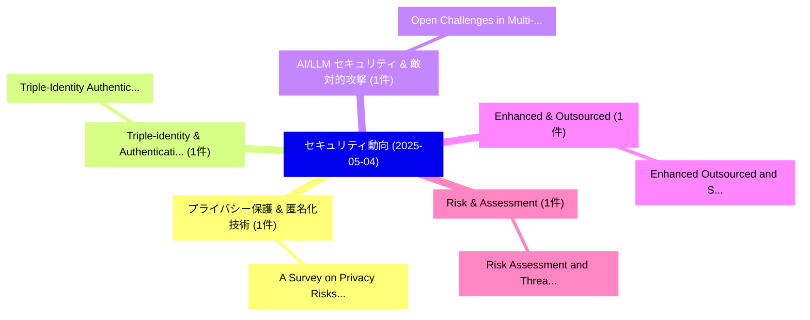

# 📅 02_daily: 日次エグゼクティブサマリー報告書 (2025-05-04)

**集計日時**: 2026-10-02 23:05:24 UTC  
**対象日付**: 2025-05-04  
**本日収集論文数**: 7 件  

---

## 💡 主要セキュリティ動向・脅威インサイト (Executive Insights)

本日の収集論文（計 7 件）において、以下の重点セキュリティ領域で活発な研究動向が確認されました：
- **プライバシー保護 & 匿名化技術** (1 件): 注目論文として 「A Survey on Privacy Risks and ...」 等が発表され、実務防御および攻撃検証の進展が見られます。
- **Triple-identity & Authentication** (1 件): 注目論文として 「Triple-Identity Authentication...」 等が発表され、実務防御および攻撃検証の進展が見られます。
- **AI/LLM セキュリティ & 敵対的攻撃** (1 件): 注目論文として 「Open Challenges in Multi-Agent...」 等が発表され、実務防御および攻撃検証の進展が見られます。
- **Enhanced & Outsourced** (1 件): 注目論文として 「Enhanced Outsourced and Secure...」 等が発表され、実務防御および攻撃検証の進展が見られます。
- **Risk & Assessment** (1 件): 注目論文として 「Risk Assessment and Threat Mod...」 等が発表され、実務防御および攻撃検証の進展が見られます。

### 🗺️ 技術・脅威トピックマインドマップ

---

## 📌 日次セキュリティ論文一覧 (日本語表形式)

| No | arXiv ID | 論文タイトル (日本語訳) | 重要キーワード | 構造化エグゼクティブ要約 (背景・提案・影響) | 脅威分類 | 詳細リンク |
|---|---|---|---|---|---|---|
| 1 | `2505.01976v1` | [A Survey on Privacy Risks and Protection in 大規模言語モデル](../../okf/papers/2025-05-04/2505.01976.md) | `Privacy Risks`, `Large Language Models`, `Kang Chen` | 【提案】概要 (Overview & Key Finding) 本論文「A Survey on Privacy Risks and Protection in 大規模言語モデル」（原...。実証評価により経営層・セキュリティ管理者向け推奨アクション (E... | `cs.CR` | [arXiv](https://arxiv.org/abs/2505.01976v1) &#124; [OKF](../../okf/papers/2025-05-04/2505.01976.md) |
| 2 | `2505.02004v5` | [Triple-Identity Authentication: The Future of Secure Access（セキュリティ分析論文）](../../okf/papers/2025-05-04/2505.02004.md) | `Identity Authentication`, `Secure Access`, `Triple-Identity Authentication` | 【提案】概要 (Overview & Key Finding) 本論文「Triple-Identity Authentication: The Future of Secure Ac...。実証評価により経営層・セキュリティ管理者向け推奨アクション (E... | `cs.CR` | [arXiv](https://arxiv.org/abs/2505.02004v5) &#124; [OKF](../../okf/papers/2025-05-04/2505.02004.md) |
| 3 | `2505.02077v2` | [Open Challenges in Multi-Agent Security: Secure Systems of Interacting AI Agentsに向けて](../../okf/papers/2025-05-04/2505.02077.md) | `Open Challenges`, `Agent Security`, `Multi-Agent Security` | 【提案】概要 (Overview & Key Finding) 本論文「Open Challenges in Multi-Agent Security: Secure Systems...。実証評価により経営層・セキュリティ管理者向け推奨アクション (E... | `cs.CR` | [arXiv](https://arxiv.org/abs/2505.02077v2) &#124; [OKF](../../okf/papers/2025-05-04/2505.02077.md) |
| 4 | `2505.02224v1` | [Enhanced Outsourced and Secure Inference for Tall Sparse Decision Trees（セキュリティ分析論文）](../../okf/papers/2025-05-04/2505.02224.md) | `Tall Sparse Decision Trees`, `Enhanced Outsourced`, `Secure Inference` | 【提案】概要 (Overview & Key Finding) 本論文「Enhanced Outsourced and Secure Inference for Tall Spars...。実証評価により経営層・セキュリティ管理者向け推奨アクション (E... | `cs.CR` | [arXiv](https://arxiv.org/abs/2505.02224v1) &#124; [OKF](../../okf/papers/2025-05-04/2505.02224.md) |
| 5 | `2505.02231v1` | [Risk Assessment and Threat Modeling for safe autonomous driving technology（セキュリティ分析論文）](../../okf/papers/2025-05-04/2505.02231.md) | `Risk Assessment`, `Threat Modeling`, `Ian Alexis Wong Paz` | 【提案】概要 (Overview & Key Finding) 本論文「Risk Assessment and 脅威 Modeling for safe autonomous dri...。実証評価により経営層・セキュリティ管理者向け推奨アクション (E... | `cs.CR` | [arXiv](https://arxiv.org/abs/2505.02231v1) &#124; [OKF](../../okf/papers/2025-05-04/2505.02231.md) |
| 6 | `2505.02239v2` | [Performance Analysis and Deployment Considerations of Post-Quantum Cryptography for Consumer Electronics（セキュリティ分析論文）](../../okf/papers/2025-05-04/2505.02239.md) | `Deployment Considerations`, `Quantum Cryptography`, `Consumer Electronics` | 【提案】概要 (Overview & Key Finding) 本論文「Performance Analysis and Deployment Considerations of ポ...。実証評価により経営層・セキュリティ管理者向け推奨アクション (E... | `cs.CR` | [arXiv](https://arxiv.org/abs/2505.02239v2) &#124; [OKF](../../okf/papers/2025-05-04/2505.02239.md) |
| 7 | `2505.03831v1` | [A Comprehensive Adversarial Attacks against Spam Filtersの分析](../../okf/papers/2025-05-04/2505.03831.md) | `Comprehensive Adversarial Attacks`, `Adversarial Attacks`, `Spam Filters` | 【提案】概要 (Overview & Key Finding) 本論文「A Comprehensive 敵対的攻撃s against Spam Filtersの分析」（原題: A C...。実証評価により経営層・セキュリティ管理者向け推奨アクション (E... | `cs.CR` | [arXiv](https://arxiv.org/abs/2505.03831v1) &#124; [OKF](../../okf/papers/2025-05-04/2505.03831.md) |

