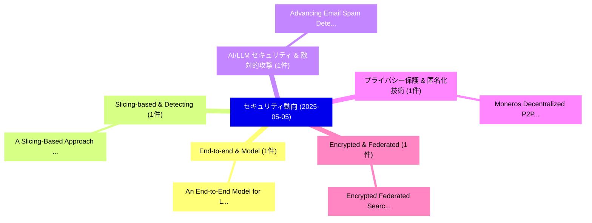

# 📅 02_daily: 日次エグゼクティブサマリー報告書 (2025-05-05)

**集計日時**: 2026-10-02 23:05:24 UTC  
**対象日付**: 2025-05-05  
**本日収集論文数**: 17 件  

---

## 💡 主要セキュリティ動向・脅威インサイト (Executive Insights)

本日の収集論文（計 17 件）において、以下の重点セキュリティ領域で活発な研究動向が確認されました：
- **End-to-end & Model** (1 件): 注目論文として 「An End-to-End Model for Logits...」 等が発表され、実務防御および攻撃検証の進展が見られます。
- **Slicing-based & Detecting** (1 件): 注目論文として 「A Slicing-Based Approach for D...」 等が発表され、実務防御および攻撃検証の進展が見られます。
- **AI/LLM セキュリティ & 敵対的攻撃** (1 件): 注目論文として 「Advancing Email Spam Detection...」 等が発表され、実務防御および攻撃検証の進展が見られます。
- **プライバシー保護 & 匿名化技術** (1 件): 注目論文として 「Moneros Decentralized P2P Exch...」 等が発表され、実務防御および攻撃検証の進展が見られます。
- **Encrypted & Federated** (1 件): 注目論文として 「Encrypted Federated Search Usi...」 等が発表され、実務防御および攻撃検証の進展が見られます。

### 🗺️ 技術・脅威トピックマインドマップ

---

## 📌 日次セキュリティ論文一覧 (日本語表形式)

| No | arXiv ID | 論文タイトル (日本語訳) | 重要キーワード | 構造化エグゼクティブ要約 (背景・提案・影響) | 脅威分類 | 詳細リンク |
|---|---|---|---|---|---|---|
| 1 | `2505.02344v3` | [An End-to-End Model for Logits-Based 大規模言語モデル Watermarking](../../okf/papers/2025-05-05/2505.02344.md) | `End Model`, `Based Large Language Models Watermarking`, `Logits-Based Large` | 【提案】概要 (Overview & Key Finding) 本論文「An End-to-End Model for Logits-Based 大規模言語モデル Watermark...。実証評価により経営層・セキュリティ管理者向け推奨アクション (E... | `cs.CR` | [arXiv](https://arxiv.org/abs/2505.02344v3) &#124; [OKF](../../okf/papers/2025-05-05/2505.02344.md) |
| 2 | `2505.02349v1` | [A Slicing-Based Approach for Detecting and Patching Vulnerable Code Clones（セキュリティ分析論文）](../../okf/papers/2025-05-05/2505.02349.md) | `Patching Vulnerable Code Clones`, `Hakam Alomari`, `Christopher Vendome` | 【提案】概要 (Overview & Key Finding) 本論文「A Slicing-Based Approach for Detecting and Patching Vul...。実証評価により経営層・セキュリティ管理者向け推奨アクション (E... | `cs.CR` | [arXiv](https://arxiv.org/abs/2505.02349v1) &#124; [OKF](../../okf/papers/2025-05-05/2505.02349.md) |
| 3 | `2505.02362v1` | [Advancing Email Spam Detection: Leveraging Zero-Shot Learning and 大規模言語モデル](../../okf/papers/2025-05-05/2505.02362.md) | `Advancing Email Spam Detection`, `Leveraging Zero`, `Shot Learning` | 【提案】概要 (Overview & Key Finding) 本論文「Advancing Email Spam Detection: Leveraging Zero-Shot Le...。実証評価により経営層・セキュリティ管理者向け推奨アクション (E... | `cs.CR` | [arXiv](https://arxiv.org/abs/2505.02362v1) &#124; [OKF](../../okf/papers/2025-05-05/2505.02362.md) |
| 4 | `2505.02392v3` | [Moneros Decentralized P2P Exchanges: Functionality, Adoption, and Privacy Risks（セキュリティ分析論文）](../../okf/papers/2025-05-05/2505.02392.md) | `Moneros Decentralized`, `Privacy Risks`, `Yannik Kopyciok` | 【提案】概要 (Overview & Key Finding) 本論文「Moneros Decentralized P2P Exchanges: Functionality, Ado...。実証評価により経営層・セキュリティ管理者向け推奨アクション (E... | `cs.CR` | [arXiv](https://arxiv.org/abs/2505.02392v3) &#124; [OKF](../../okf/papers/2025-05-05/2505.02392.md) |
| 5 | `2505.02409v1` | [Encrypted Federated Search Using Homomorphic Encryption（セキュリティ分析論文）](../../okf/papers/2025-05-05/2505.02409.md) | `Encrypted Federated Search Using Homomorphic Encryption`, `Aswani Kumar Cherukuri`, `Om Rathod` | 【提案】概要 (Overview & Key Finding) 本論文「Encrypted Federated Search Using 準同型暗号（セキュリティ分析論文）」（原題:...。実証評価により経営層・セキュリティ管理者向け推奨アクション (E... | `cs.CR` | [arXiv](https://arxiv.org/abs/2505.02409v1) &#124; [OKF](../../okf/papers/2025-05-05/2505.02409.md) |
| 6 | `2505.02464v1` | [Targeted Fuzzing for Unsafe Rust Code: Leveraging Selective Instrumentation（セキュリティ分析論文）](../../okf/papers/2025-05-05/2505.02464.md) | `Unsafe Rust Code`, `Leveraging Selective Instrumentation`, `Targeted Fuzzing` | 【提案】概要 (Overview & Key Finding) 本論文「Targeted Fuzzing for Unsafe Rust Code: Leveraging Selec...。実証評価により経営層・セキュリティ管理者向け推奨アクション (E... | `cs.CR` | [arXiv](https://arxiv.org/abs/2505.02464v1) &#124; [OKF](../../okf/papers/2025-05-05/2505.02464.md) |
| 7 | `2505.02493v1` | [Dynamic Graph-based Fingerprinting of In-browser Cryptomining（セキュリティ分析論文）](../../okf/papers/2025-05-05/2505.02493.md) | `Dynamic Graph`, `Graph-based Fingerprinting`, `In-browser Cryptomining` | 【提案】概要 (Overview & Key Finding) 本論文「Dynamic Graph-based Fingerprinting of In-browser Crypto...。実証評価により経営層・セキュリティ管理者向け推奨アクション (E... | `cs.CR` | [arXiv](https://arxiv.org/abs/2505.02493v1) &#124; [OKF](../../okf/papers/2025-05-05/2505.02493.md) |
| 8 | `2505.02499v1` | [An Efficient Hybrid Key Exchange Mechanism（セキュリティ分析論文）](../../okf/papers/2025-05-05/2505.02499.md) | `Vipindev Adat Vasudevan`, `Alejandro Cohen`, `Thomas Stahlbuhk` | 【提案】概要 (Overview & Key Finding) 本論文「An Efficient Hybrid Key Exchange Mechanism（セキュリティ分析論文）」...。実証評価によりD'Oliveira, Thomas Stahlb... | `cs.CR` | [arXiv](https://arxiv.org/abs/2505.02499v1) &#124; [OKF](../../okf/papers/2025-05-05/2505.02499.md) |
| 9 | `2505.02502v2` | [Unveiling the Landscape of LLM Deployment in the Wild: An Empirical Study（セキュリティ分析論文）](../../okf/papers/2025-05-05/2505.02502.md) | `Xinyi Hou`, `Jiahao Han`, `Yanjie Zhao` | 【提案】概要 (Overview & Key Finding) 本論文「Unveiling the Landscape of LLM Deployment in the Wild: ...。実証評価により経営層・セキュリティ管理者向け推奨アクション (E... | `cs.CR` | [arXiv](https://arxiv.org/abs/2505.02502v2) &#124; [OKF](../../okf/papers/2025-05-05/2505.02502.md) |
| 10 | `2505.02521v2` | [Attestable Builds: Compiling Verifiable Binaries on Untrusted Systems using Trusted Execution Environments（セキュリティ分析論文）](../../okf/papers/2025-05-05/2505.02521.md) | `Compiling Verifiable Binaries`, `Trusted Execution Environments`, `Attestable Builds` | 【提案】概要 (Overview & Key Finding) 本論文「Attestable Builds: Compiling Verifiable Binaries on Unt...。実証評価により経営層・セキュリティ管理者向け推奨アクション (E... | `cs.CR` | [arXiv](https://arxiv.org/abs/2505.02521v2) &#124; [OKF](../../okf/papers/2025-05-05/2505.02521.md) |
| 11 | `2505.02565v2` | [A Cross-Layer Network Antifragility with RIS-assisted Links under Jamming Attacksの分析](../../okf/papers/2025-05-05/2505.02565.md) | `RIS-assisted Links`, `Layer Network Antifragility`, `Network Antifragility` | 【提案】概要 (Overview & Key Finding) 本論文「A Cross-Layer Network Antifragility with RIS-assisted L...。実証評価により経営層・セキュリティ管理者向け推奨アクション (E... | `cs.CR` | [arXiv](https://arxiv.org/abs/2505.02565v2) &#124; [OKF](../../okf/papers/2025-05-05/2505.02565.md) |
| 12 | `2505.02713v1` | [SoK: Stealing Cars Since Remote Keyless Entry Introduction and How to Defend From It（セキュリティ分析論文）](../../okf/papers/2025-05-05/2505.02713.md) | `Stealing Cars Since Remote Keyless Entry Introduction`, `Tommaso Bianchi`, `Alessandro Brighente` | 【提案】概要 (Overview & Key Finding) 本論文「SoK: Stealing Cars Since Remote Keyless Entry Introduct...。実証評価により経営層・セキュリティ管理者向け推奨アクション (E... | `cs.CR` | [arXiv](https://arxiv.org/abs/2505.02713v1) &#124; [OKF](../../okf/papers/2025-05-05/2505.02713.md) |
| 13 | `2505.02725v1` | [Acoustic Side-Channel Attacks on a Computer Mouse（セキュリティ分析論文）](../../okf/papers/2025-05-05/2505.02725.md) | `Acoustic Side`, `Channel Attacks`, `Computer Mouse` | 【提案】概要 (Overview & Key Finding) 本論文「Acoustic サイドチャネル攻撃 Attacks on a Computer Mouse（セキュリティ分析...。実証評価により経営層・セキュリティ管理者向け推奨アクション (E... | `cs.CR` | [arXiv](https://arxiv.org/abs/2505.02725v1) &#124; [OKF](../../okf/papers/2025-05-05/2505.02725.md) |
| 14 | `2505.02824v2` | [Dataset Copyright Evasion Attack against Personalized Text-to-Image Diffusion Modelsに向けて](../../okf/papers/2025-05-05/2505.02824.md) | `Personalized Text`, `Dataset Copyright Evasion Attack`, `Towards Dataset Copyright Evasion Attack` | 【提案】概要 (Overview & Key Finding) 本論文「Dataset Copyright Evasion Attack against Personalized T...。実証評価により経営層・セキュリティ管理者向け推奨アクション (E... | `cs.CR` | [arXiv](https://arxiv.org/abs/2505.02824v2) &#124; [OKF](../../okf/papers/2025-05-05/2505.02824.md) |
| 15 | `2505.02828v3` | [Privacy Risks and Preservation Methods in Explainable Artificial Intelligence: A Scoping Review（セキュリティ分析論文）](../../okf/papers/2025-05-05/2505.02828.md) | `Explainable Artificial Intelligence`, `Privacy Risks`, `Preservation Methods` | 【提案】概要 (Overview & Key Finding) 本論文「Privacy Risks and Preservation Methods in Explainable A...。実証評価により経営層・セキュリティ管理者向け推奨アクション (E... | `cs.CR` | [arXiv](https://arxiv.org/abs/2505.02828v3) &#124; [OKF](../../okf/papers/2025-05-05/2505.02828.md) |
| 16 | `2505.03843v2` | [Economic Security of Multiple Shared Security Protocols（セキュリティ分析論文）](../../okf/papers/2025-05-05/2505.03843.md) | `Multiple Shared Security Protocols`, `Economic Security`, `Abhimanyu Nag` | 【提案】概要 (Overview & Key Finding) 本論文「Economic Security of Multiple Shared Security Protocols...。実証評価により経営層・セキュリティ管理者向け推奨アクション (E... | `cs.CR` | [arXiv](https://arxiv.org/abs/2505.03843v2) &#124; [OKF](../../okf/papers/2025-05-05/2505.03843.md) |
| 17 | `2505.03850v1` | [Impact Inference Time Attack of Perception Sensors on Autonomous Vehiclesの分析](../../okf/papers/2025-05-05/2505.03850.md) | `Perception Sensors`, `Impact Inference Time Attack`, `Inference Time Attack` | 【提案】概要 (Overview & Key Finding) 本論文「Impact Inference Time Attack of Perception Sensors on A...。実証評価により経営層・セキュリティ管理者向け推奨アクション (E... | `cs.CR` | [arXiv](https://arxiv.org/abs/2505.03850v1) &#124; [OKF](../../okf/papers/2025-05-05/2505.03850.md) |

