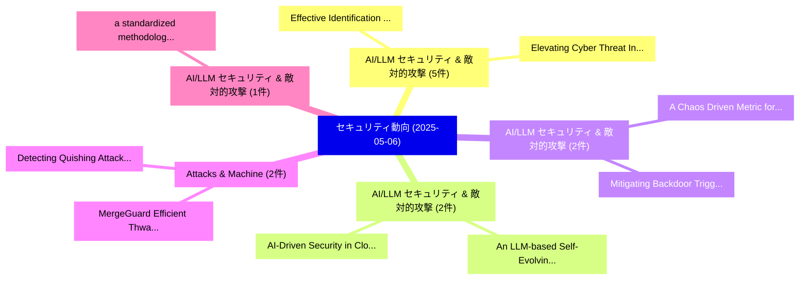

# 📅 02_daily: 日次エグゼクティブサマリー報告書 (2025-05-06)

**集計日時**: 2026-10-02 23:05:24 UTC  
**対象日付**: 2025-05-06  
**本日収集論文数**: 22 件  

---

## 💡 主要セキュリティ動向・脅威インサイト (Executive Insights)

本日の収集論文（計 22 件）において、以下の重点セキュリティ領域で活発な研究動向が確認されました：
- **AI/LLM セキュリティ & 敵対的攻撃** (5 件): 注目論文として 「Effective Identification of At...」、「Elevating Cyber Threat Intelli...」 等が発表され、実務防御および攻撃検証の進展が見られます。
- **AI/LLM セキュリティ & 敵対的攻撃** (2 件): 注目論文として 「An LLM-based Self-Evolving Sec...」、「AI-Driven Security in Cloud Co...」 等が発表され、実務防御および攻撃検証の進展が見られます。
- **AI/LLM セキュリティ & 敵対的攻撃** (2 件): 注目論文として 「A Chaos Driven Metric for Back...」、「Mitigating Backdoor Triggered ...」 等が発表され、実務防御および攻撃検証の進展が見られます。
- **Attacks & Machine** (2 件): 注目論文として 「Detecting Quishing Attacks wit...」、「MergeGuard: Efficient Thwartin...」 等が発表され、実務防御および攻撃検証の進展が見られます。
- **AI/LLM セキュリティ & 敵対的攻撃** (1 件): 注目論文として 「a standardized methodology and...」 等が発表され、実務防御および攻撃検証の進展が見られます。

### 🗺️ 技術・脅威トピックマインドマップ

---

## 📌 日次セキュリティ論文一覧 (日本語表形式)

| No | arXiv ID | 論文タイトル (日本語訳) | 重要キーワード | 構造化エグゼクティブ要約 (背景・提案・影響) | 脅威分類 | 詳細リンク |
|---|---|---|---|---|---|---|
| 1 | `2505.03100v1` | [a standardized methodology and dataset for evaluating LLM-based digital forensic timeline analysisに向けて](../../okf/papers/2025-05-06/2505.03100.md) | `LLM-based digital`, `Hudan Studiawan`, `Frank Breitinger` | 【提案】概要 (Overview & Key Finding) 本論文「a standardized methodology and dataset for evaluating L...。実証評価により経営層・セキュリティ管理者向け推奨アクション (E... | `cs.CR` | [arXiv](https://arxiv.org/abs/2505.03100v1) &#124; [OKF](../../okf/papers/2025-05-06/2505.03100.md) |
| 2 | `2505.03120v1` | [Adversarial Sample Generation for Anomaly Detection in Industrial Control Systems（セキュリティ分析論文）](../../okf/papers/2025-05-06/2505.03120.md) | `Adversarial Sample Generation`, `Industrial Control Systems`, `Anomaly Detection` | 【提案】概要 (Overview & Key Finding) 本論文「Adversarial Sample Generation for Anomaly Detection in ...。実証評価により経営層・セキュリティ管理者向け推奨アクション (E... | `cs.CR` | [arXiv](https://arxiv.org/abs/2505.03120v1) &#124; [OKF](../../okf/papers/2025-05-06/2505.03120.md) |
| 3 | `2505.03147v1` | [Effective Identification of Attack Techniques in Cyber Threat Intelligence Reports using Large Language Modelsに向けて](../../okf/papers/2025-05-06/2505.03147.md) | `Cyber Threat Intelligence Reports`, `Attack Techniques`, `Effective Identification` | 【提案】概要 (Overview & Key Finding) 本論文「Effective Identification of Attack Techniques in Cyber ...。実証評価により経営層・セキュリティ管理者向け推奨アクション (E... | `cs.CR` | [arXiv](https://arxiv.org/abs/2505.03147v1) &#124; [OKF](../../okf/papers/2025-05-06/2505.03147.md) |
| 4 | `2505.03161v2` | [An LLM-based Self-Evolving Security Framework for 6G Space-Air-Ground Integrated Networks（セキュリティ分析論文）](../../okf/papers/2025-05-06/2505.03161.md) | `Ground Integrated Networks`, `LLM-based Self`, `Evolving Security Fra` | 【提案】概要 (Overview & Key Finding) 本論文「An LLM-based Self-Evolving Security Framework for 6G Sp...。実証評価により経営層・セキュリティ管理者向け推奨アクション (E... | `cs.CR` | [arXiv](https://arxiv.org/abs/2505.03161v2) &#124; [OKF](../../okf/papers/2025-05-06/2505.03161.md) |
| 5 | `2505.03179v1` | [Bridging Expertise Gaps: The Role of LLMs in Human-AI Collaboration for サイバーセキュリティ](../../okf/papers/2025-05-06/2505.03179.md) | `Bridging Expertise Gaps`, `Human-AI Collaboration`, `Mohan Baruwal Chhetri` | 【提案】概要 (Overview & Key Finding) 本論文「Bridging Expertise Gaps: The Role of LLMs in Human-AI C...。実証評価により経営層・セキュリティ管理者向け推奨アクション (E... | `cs.CR` | [arXiv](https://arxiv.org/abs/2505.03179v1) &#124; [OKF](../../okf/papers/2025-05-06/2505.03179.md) |
| 6 | `2505.03193v1` | [A study on audio synchronous steganography detection and distributed guide inference model based on sliding spectral features and intelligent inference drive（セキュリティ分析論文）](../../okf/papers/2025-05-06/2505.03193.md) | `Wei Meng`, `Raw Meta`, `inference` | 【提案】概要 (Overview & Key Finding) 本論文「A study on audio synchronous steganography detection an...。実証評価により経営層・セキュリティ管理者向け推奨アクション (E... | `cs.CR` | [arXiv](https://arxiv.org/abs/2505.03193v1) &#124; [OKF](../../okf/papers/2025-05-06/2505.03193.md) |
| 7 | `2505.03208v1` | [A Chaos Driven Metric for Backdoor Attack Detection（セキュリティ分析論文）](../../okf/papers/2025-05-06/2505.03208.md) | `Chaos Driven Metric`, `Backdoor Attack Detection`, `Hema Karnam Surendrababu` | 【提案】概要 (Overview & Key Finding) 本論文「A Chaos Driven Metric for Backdoor Attack Detection（セキュ...。実証評価により経営層・セキュリティ管理者向け推奨アクション (E... | `cs.CR` | [arXiv](https://arxiv.org/abs/2505.03208v1) &#124; [OKF](../../okf/papers/2025-05-06/2505.03208.md) |
| 8 | `2505.03345v2` | [Elevating Cyber Threat Intelligence against Disinformation Campaigns with LLM-based Concept Extraction and the FakeCTI Dataset（セキュリティ分析論文）](../../okf/papers/2025-05-06/2505.03345.md) | `Elevating Cyber Threat Intelligence`, `Disinformation Campaigns`, `Concept Extraction` | 【提案】概要 (Overview & Key Finding) 本論文「Elevating Cyber 脅威 Intelligence against Disinformation ...。実証評価により経営層・セキュリティ管理者向け推奨アクション (E... | `cs.CR` | [arXiv](https://arxiv.org/abs/2505.03345v2) &#124; [OKF](../../okf/papers/2025-05-06/2505.03345.md) |
| 9 | `2505.03425v1` | [Directed Greybox Fuzzing via Large Language Model（セキュリティ分析論文）](../../okf/papers/2025-05-06/2505.03425.md) | `Directed Greybox Fuzzing`, `Large Language Model`, `Hanxiang Xu` | 【提案】概要 (Overview & Key Finding) 本論文「Directed Greybox Fuzzing via Large Language Model（セキュリテ...。実証評価により経営層・セキュリティ管理者向け推奨アクション (E... | `cs.CR` | [arXiv](https://arxiv.org/abs/2505.03425v1) &#124; [OKF](../../okf/papers/2025-05-06/2505.03425.md) |
| 10 | `2505.03439v1` | [The Steganographic Potentials of Language Models（セキュリティ分析論文）](../../okf/papers/2025-05-06/2505.03439.md) | `Language Models`, `Seong Hah Cho`, `Artem Karpov` | 【提案】概要 (Overview & Key Finding) 本論文「The Steganographic Potentials of Language Models（セキュリティ...。実証評価により経営層・セキュリティ管理者向け推奨アクション (E... | `cs.CR` | [arXiv](https://arxiv.org/abs/2505.03439v1) &#124; [OKF](../../okf/papers/2025-05-06/2505.03439.md) |
| 11 | `2505.03451v2` | [Detecting Quishing Attacks with Machine Learning Techniques Through QR Code Analysis（セキュリティ分析論文）](../../okf/papers/2025-05-06/2505.03451.md) | `Detecting Quishing Attacks`, `Fouad Trad`, `Ali Chehab` | 【提案】概要 (Overview & Key Finding) 本論文「Detecting Quishing Attacks with Machine Learning Techni...。実証評価により経営層・セキュリティ管理者向け推奨アクション (E... | `cs.CR` | [arXiv](https://arxiv.org/abs/2505.03451v2) &#124; [OKF](../../okf/papers/2025-05-06/2505.03451.md) |
| 12 | `2505.03455v1` | [Mitigating Backdoor Triggered and Targeted Data Poisoning Attacks in Voice Authentication Systems（セキュリティ分析論文）](../../okf/papers/2025-05-06/2505.03455.md) | `Targeted Data Poisoning Attacks`, `Mitigating Backdoor Triggered`, `Voice Authentication Systems` | 【提案】概要 (Overview & Key Finding) 本論文「Mitigating Backdoor Triggered and Targeted Data Poisoni...。実証評価により経営層・セキュリティ管理者向け推奨アクション (E... | `cs.CR` | [arXiv](https://arxiv.org/abs/2505.03455v1) &#124; [OKF](../../okf/papers/2025-05-06/2505.03455.md) |
| 13 | `2505.03501v1` | [BadLingual: A Novel Lingual-Backdoor Attack against 大規模言語モデル](../../okf/papers/2025-05-06/2505.03501.md) | `Backdoor Attack`, `Lingual-Backdoor Attack`, `Large Language Models` | 【提案】概要 (Overview & Key Finding) 本論文「BadLingual: A Novel Lingual-Backdoor Attack against 大規模...。実証評価により経営層・セキュリティ管理者向け推奨アクション (E... | `cs.CR` | [arXiv](https://arxiv.org/abs/2505.03501v1) &#124; [OKF](../../okf/papers/2025-05-06/2505.03501.md) |
| 14 | `2505.03529v2` | [SKALD: Scalable K-Anonymisation for Large Datasets（セキュリティ分析論文）](../../okf/papers/2025-05-06/2505.03529.md) | `Large Datasets`, `Kailash Reddy`, `Novoneel Chakraborty` | 【提案】概要 (Overview & Key Finding) 本論文「SKALD: Scalable K-Anonymisation for Large Datasets（セキュリ...。実証評価により経営層・セキュリティ管理者向け推奨アクション (E... | `cs.CR` | [arXiv](https://arxiv.org/abs/2505.03529v2) &#124; [OKF](../../okf/papers/2025-05-06/2505.03529.md) |
| 15 | `2505.03555v1` | [Empc: Effective Path Prioritization for Symbolic Execution with Path Cover（セキュリティ分析論文）](../../okf/papers/2025-05-06/2505.03555.md) | `Effective Path Prioritization`, `Symbolic Execution`, `Path Cover` | 【提案】概要 (Overview & Key Finding) 本論文「Empc: Effective Path Prioritization for Symbolic Execut...。実証評価により経営層・セキュリティ管理者向け推奨アクション (E... | `cs.CR` | [arXiv](https://arxiv.org/abs/2505.03555v1) &#124; [OKF](../../okf/papers/2025-05-06/2505.03555.md) |
| 16 | `2505.03574v1` | [LlamaFirewall: An open source guardrail system for building secure AI agents（セキュリティ分析論文）](../../okf/papers/2025-05-06/2505.03574.md) | `Sahana Chennabasappa`, `Cyrus Nikolaidis`, `Daniel Song` | 【提案】概要 (Overview & Key Finding) 本論文「LlamaFirewall: An open source guardrail system for buil...。実証評価により経営層・セキュリティ管理者向け推奨アクション (E... | `cs.CR` | [arXiv](https://arxiv.org/abs/2505.03574v1) &#124; [OKF](../../okf/papers/2025-05-06/2505.03574.md) |
| 17 | `2505.03639v1` | [Differential Privacy for Network Assortativity（セキュリティ分析論文）](../../okf/papers/2025-05-06/2505.03639.md) | `Differential Privacy`, `Network Assortativity`, `Fei Ma` | 【提案】概要 (Overview & Key Finding) 本論文「差分プライバシー for Network Assortativity（セキュリティ分析論文）」（原題: 差分プ...。実証評価により経営層・セキュリティ管理者向け推奨アクション (E... | `cs.CR` | [arXiv](https://arxiv.org/abs/2505.03639v1) &#124; [OKF](../../okf/papers/2025-05-06/2505.03639.md) |
| 18 | `2505.03863v1` | [Data-Driven Falsification of Cyber-Physical Systems（セキュリティ分析論文）](../../okf/papers/2025-05-06/2505.03863.md) | `Driven Falsification`, `Physical Systems`, `Data-Driven Falsification` | 【提案】概要 (Overview & Key Finding) 本論文「Data-Driven Falsification of Cyber-Physical Systems（セキュ...。実証評価により経営層・セキュリティ管理者向け推奨アクション (E... | `cs.CR` | [arXiv](https://arxiv.org/abs/2505.03863v1) &#124; [OKF](../../okf/papers/2025-05-06/2505.03863.md) |
| 19 | `2505.03945v1` | [AI-Driven Security in Cloud Computing: Enhancing Threat Detection, Automated Response, and Cyber Resilience（セキュリティ分析論文）](../../okf/papers/2025-05-06/2505.03945.md) | `Enhancing Threat Detection`, `Driven Security`, `AI-Driven Security` | 【提案】概要 (Overview & Key Finding) 本論文「AI-Driven Security in Cloud Computing: Enhancing 脅威 Det...。実証評価により経営層・セキュリティ管理者向け推奨アクション (E... | `cs.CR` | [arXiv](https://arxiv.org/abs/2505.03945v1) &#124; [OKF](../../okf/papers/2025-05-06/2505.03945.md) |
| 20 | `2505.04014v3` | [Rollbaccine : Herd Immunity against Storage Rollback Attacks in TEEs [Technical Report]（セキュリティ分析論文）](../../okf/papers/2025-05-06/2505.04014.md) | `Storage Rollback Attacks`, `Herd Immunity`, `Technical Report` | 【提案】概要 (Overview & Key Finding) 本論文「Rollbaccine : Herd Immunity against Storage Rollback At...。実証評価により経営層・セキュリティ管理者向け推奨アクション (E... | `cs.CR` | [arXiv](https://arxiv.org/abs/2505.04014v3) &#124; [OKF](../../okf/papers/2025-05-06/2505.04014.md) |
| 21 | `2505.04015v1` | [MergeGuard: Efficient Thwarting of Trojan Attacks in Machine Learning Models（セキュリティ分析論文）](../../okf/papers/2025-05-06/2505.04015.md) | `Machine Learning Models`, `Efficient Thwarting`, `Trojan Attacks` | 【提案】概要 (Overview & Key Finding) 本論文「MergeGuard: Efficient Thwarting of Trojan Attacks in Ma...。実証評価により経営層・セキュリティ管理者向け推奨アクション (E... | `cs.CR` | [arXiv](https://arxiv.org/abs/2505.04015v1) &#124; [OKF](../../okf/papers/2025-05-06/2505.04015.md) |
| 22 | `2505.08791v1` | [Post-Quantum Cryptography: An Code-Based and Lattice-Based Cryptosystemsの分析](../../okf/papers/2025-05-06/2505.08791.md) | `Quantum Cryptography`, `Post-Quantum Cryptography`, `Based Cryptosystems` | 【提案】概要 (Overview & Key Finding) 本論文「ポスト量子暗号: An Code-Based and Lattice-Based Cryptosystemsの...。実証評価により経営層・セキュリティ管理者向け推奨アクション (E... | `cs.CR` | [arXiv](https://arxiv.org/abs/2505.08791v1) &#124; [OKF](../../okf/papers/2025-05-06/2505.08791.md) |

