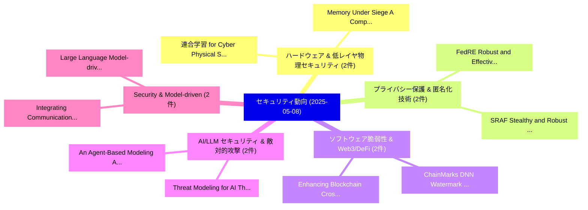

# 📅 02_daily: 日次エグゼクティブサマリー報告書 (2025-05-08)

**集計日時**: 2026-10-02 23:05:25 UTC  
**対象日付**: 2025-05-08  
**本日収集論文数**: 24 件  

---

## 💡 主要セキュリティ動向・脅威インサイト (Executive Insights)

本日の収集論文（計 24 件）において、以下の重点セキュリティ領域で活発な研究動向が確認されました：
- **ハードウェア & 低レイヤ物理セキュリティ** (2 件): 注目論文として 「連合学習 for Cyber Physical System...」、「Memory Under Siege: A Comprehe...」 等が発表され、実務防御および攻撃検証の進展が見られます。
- **プライバシー保護 & 匿名化技術** (2 件): 注目論文として 「FedRE: Robust and Effective 連合...」、「SRAF: Stealthy and Robust Adve...」 等が発表され、実務防御および攻撃検証の進展が見られます。
- **ソフトウェア脆弱性 & Web3/DeFi** (2 件): 注目論文として 「Enhancing Blockchain Cross Cha...」、「ChainMarks: DNN Watermark with...」 等が発表され、実務防御および攻撃検証の進展が見られます。
- **AI/LLM セキュリティ & 敵対的攻撃** (2 件): 注目論文として 「An Agent-Based Modeling Approa...」、「Threat Modeling for AI: The Ca...」 等が発表され、実務防御および攻撃検証の進展が見られます。
- **Security & Model-driven** (2 件): 注目論文として 「Integrating Communication, Sen...」、「Large Language Model-driven Se...」 等が発表され、実務防御および攻撃検証の進展が見られます。

### 🗺️ 技術・脅威トピックマインドマップ

---

## 📌 日次セキュリティ論文一覧 (日本語表形式)

| No | arXiv ID | 論文タイトル (日本語訳) | 重要キーワード | 構造化エグゼクティブ要約 (背景・提案・影響) | 脅威分類 | 詳細リンク |
|---|---|---|---|---|---|---|
| 1 | `2505.04873v1` | [連合学習 for Cyber Physical Systems: A Comprehensive Survey](../../okf/papers/2025-05-08/2505.04873.md) | `Cyber Physical Systems`, `Comprehensive Survey`, `Federated Learning` | 【提案】概要 (Overview & Key Finding) 本論文「連合学習 for Cyber Physical Systems: A Comprehensive Survey...。実証評価によりPathirana, Mayuri Wijayas... | `cs.CR` | [arXiv](https://arxiv.org/abs/2505.04873v1) &#124; [OKF](../../okf/papers/2025-05-08/2505.04873.md) |
| 2 | `2505.04889v1` | [FedRE: Robust and Effective 連合学習 with Privacy Preference](../../okf/papers/2025-05-08/2505.04889.md) | `Privacy Preference`, `Effective Federated Learning`, `Tianzhe Xiao` | 【提案】概要 (Overview & Key Finding) 本論文「FedRE: Robust and Effective 連合学習 with Privacy Preferenc...。実証評価により# FedRE: Robust and Effec... | `cs.CR` | [arXiv](https://arxiv.org/abs/2505.04889v1) &#124; [OKF](../../okf/papers/2025-05-08/2505.04889.md) |
| 3 | `2505.04896v1` | [Memory Under Siege: A Comprehensive Survey of Side-Channel Attacks on Memory（セキュリティ分析論文）](../../okf/papers/2025-05-08/2505.04896.md) | `Comprehensive Survey`, `Channel Attacks`, `Side-Channel Attacks` | 【提案】概要 (Overview & Key Finding) 本論文「Memory Under Siege: A Comprehensive Survey of サイドチャネル攻撃...。実証評価により経営層・セキュリティ管理者向け推奨アクション (E... | `cs.CR` | [arXiv](https://arxiv.org/abs/2505.04896v1) &#124; [OKF](../../okf/papers/2025-05-08/2505.04896.md) |
| 4 | `2505.04934v1` | [Enhancing Blockchain Cross Chain Interoperability: A Comprehensive Survey（セキュリティ分析論文）](../../okf/papers/2025-05-08/2505.04934.md) | `Enhancing Blockchain Cross Chain Interoperability`, `Comprehensive Survey`, `Zhihong Deng` | 【提案】概要 (Overview & Key Finding) 本論文「Enhancing Blockchain Cross Chain Interoperability: A Co...。実証評価により経営層・セキュリティ管理者向け推奨アクション (E... | `cs.CR` | [arXiv](https://arxiv.org/abs/2505.04934v1) &#124; [OKF](../../okf/papers/2025-05-08/2505.04934.md) |
| 5 | `2505.04977v2` | [ChainMarks: DNN Watermark with Cryptographic Chainのセキュリティ強化](../../okf/papers/2025-05-08/2505.04977.md) | `Cryptographic Chain`, `Brian Choi`, `Shu Wang` | 【提案】概要 (Overview & Key Finding) 本論文「ChainMarks: DNN Watermark with Cryptographic Chainのセキュリ...。実証評価により経営層・セキュリティ管理者向け推奨アクション (E... | `cs.CR` | [arXiv](https://arxiv.org/abs/2505.04977v2) &#124; [OKF](../../okf/papers/2025-05-08/2505.04977.md) |
| 6 | `2505.05015v1` | [An Agent-Based Modeling Approach to Free-Text Keyboard Dynamics for Continuous Authentication（セキュリティ分析論文）](../../okf/papers/2025-05-08/2505.05015.md) | `Text Keyboard Dynamics`, `Agent-Based Modeling`, `Continuous Authentication` | 【提案】概要 (Overview & Key Finding) 本論文「An Agent-Based Modeling Approach to Free-Text Keyboard ...。実証評価により経営層・セキュリティ管理者向け推奨アクション (E... | `cs.CR` | [arXiv](https://arxiv.org/abs/2505.05015v1) &#124; [OKF](../../okf/papers/2025-05-08/2505.05015.md) |
| 7 | `2505.05090v1` | [Integrating Communication, Sensing, and Security: Progress and Prospects of PLS in ISAC Systems（セキュリティ分析論文）](../../okf/papers/2025-05-08/2505.05090.md) | `Integrating Communication`, `Waqas Aman`, `Mehdi Illi` | 【提案】概要 (Overview & Key Finding) 本論文「Integrating Communication, Sensing, and Security: Progr...。実証評価により経営層・セキュリティ管理者向け推奨アクション (E... | `cs.CR` | [arXiv](https://arxiv.org/abs/2505.05090v1) &#124; [OKF](../../okf/papers/2025-05-08/2505.05090.md) |
| 8 | `2505.05100v1` | [SoK: A Taxonomy for Distributed-Ledger-Based Identity Management（セキュリティ分析論文）](../../okf/papers/2025-05-08/2505.05100.md) | `Based Identity Management`, `Sandro Rodriguez Garzon`, `Awid Vaziry` | 【提案】概要 (Overview & Key Finding) 本論文「SoK: A Taxonomy for Distributed-Ledger-Based Identity M...。実証評価により経営層・セキュリティ管理者向け推奨アクション (E... | `cs.CR` | [arXiv](https://arxiv.org/abs/2505.05100v1) &#124; [OKF](../../okf/papers/2025-05-08/2505.05100.md) |
| 9 | `2505.05103v1` | [A Weighted Byzantine Fault Tolerance Consensus Driven Trusted Multiple 大規模言語モデル Network](../../okf/papers/2025-05-08/2505.05103.md) | `Weighted Byzantine Fault Tolerance Consensus Driven Trusted Multiple`, `Weighted Byzantine Fault Tolerance Consensus Driven Trusted Multiple Large Language Models Network`, `Haoxiang Luo` | 【提案】概要 (Overview & Key Finding) 本論文「A Weighted Byzantine Fault Tolerance Consensus Driven T...。実証評価により経営層・セキュリティ管理者向け推奨アクション (E... | `cs.CR` | [arXiv](https://arxiv.org/abs/2505.05103v1) &#124; [OKF](../../okf/papers/2025-05-08/2505.05103.md) |
| 10 | `2505.05155v1` | [FedTDP: A Privacy-Preserving and Unified Framework for Trajectory Data Preparation via 連合学習](../../okf/papers/2025-05-08/2505.05155.md) | `Trajectory Data Preparation`, `Federated Learning`, `Zhihao Zeng` | 【提案】概要 (Overview & Key Finding) 本論文「FedTDP: A Privacy-Preserving and Unified Framework for ...。実証評価により経営層・セキュリティ管理者向け推奨アクション (E... | `cs.CR` | [arXiv](https://arxiv.org/abs/2505.05155v1) &#124; [OKF](../../okf/papers/2025-05-08/2505.05155.md) |
| 11 | `2505.05190v2` | [Revealing Weaknesses in Text Watermarking Through Self-Information Rewrite Attacks（セキュリティ分析論文）](../../okf/papers/2025-05-08/2505.05190.md) | `Information Rewrite Attacks`, `Revealing Weaknesses`, `Self-Information Rewrite` | 【提案】概要 (Overview & Key Finding) 本論文「Revealing Weaknesses in Text Watermarking Through Self-...。実証評価により経営層・セキュリティ管理者向け推奨アクション (E... | `cs.CR` | [arXiv](https://arxiv.org/abs/2505.05190v2) &#124; [OKF](../../okf/papers/2025-05-08/2505.05190.md) |
| 12 | `2505.05279v1` | [MTL-UE: Learning to Learn Nothing for Multi-Task Learning（セキュリティ分析論文）](../../okf/papers/2025-05-08/2505.05279.md) | `Learn Nothing`, `Task Learning`, `Multi-Task Learning` | 【提案】概要 (Overview & Key Finding) 本論文「MTL-UE: Learning to Learn Nothing for Multi-Task Learni...。実証評価により経営層・セキュリティ管理者向け推奨アクション (E... | `cs.CR` | [arXiv](https://arxiv.org/abs/2505.05279v1) &#124; [OKF](../../okf/papers/2025-05-08/2505.05279.md) |
| 13 | `2505.05292v1` | [QUIC-Exfil: Exploiting QUIC's Server Preferred Address Feature to Perform Data Exfiltration Attacks（セキュリティ分析論文）](../../okf/papers/2025-05-08/2505.05292.md) | `Server Preferred Address Feature`, `Perform Data Exfiltration Attacks`, `Weijie Niu` | 【提案】概要 (Overview & Key Finding) 本論文「QUIC-Exfil: Exploiting QUIC's Server Preferred Address ...。実証評価により経営層・セキュリティ管理者向け推奨アクション (E... | `cs.CR` | [arXiv](https://arxiv.org/abs/2505.05292v1) &#124; [OKF](../../okf/papers/2025-05-08/2505.05292.md) |
| 14 | `2505.05328v5` | [Timestamp Manipulation: Timestamp-based Nakamoto-style Blockchains are Vulnerable（セキュリティ分析論文）](../../okf/papers/2025-05-08/2505.05328.md) | `Timestamp Manipulation`, `Timestamp-based Nakamoto`, `Junjie Hu` | 【提案】概要 (Overview & Key Finding) 本論文「Timestamp Manipulation: Timestamp-based Nakamoto-style ...。実証評価により経営層・セキュリティ管理者向け推奨アクション (E... | `cs.CR` | [arXiv](https://arxiv.org/abs/2505.05328v5) &#124; [OKF](../../okf/papers/2025-05-08/2505.05328.md) |
| 15 | `2505.05370v4` | [Walrus: An Efficient Decentralized Storage Network（セキュリティ分析論文）](../../okf/papers/2025-05-08/2505.05370.md) | `Eleftherios Kokoris Kogias`, `George Danezis`, `Giacomo Giuliari` | 【提案】概要 (Overview & Key Finding) 本論文「Walrus: An Efficient Decentralized Storage Network（セキュリ...。実証評価により経営層・セキュリティ管理者向け推奨アクション (E... | `cs.CR` | [arXiv](https://arxiv.org/abs/2505.05370v4) &#124; [OKF](../../okf/papers/2025-05-08/2505.05370.md) |
| 16 | `2505.05613v1` | [Optimal Regret of Bernoulli Bandits under Global Differential Privacy（セキュリティ分析論文）](../../okf/papers/2025-05-08/2505.05613.md) | `Global Differential Privacy`, `Optimal Regret`, `Bernoulli Bandits` | 【提案】概要 (Overview & Key Finding) 本論文「Optimal Regret of Bernoulli Bandits under Global 差分プライバ...。実証評価により経営層・セキュリティ管理者向け推奨アクション (E... | `cs.CR` | [arXiv](https://arxiv.org/abs/2505.05613v1) &#124; [OKF](../../okf/papers/2025-05-08/2505.05613.md) |
| 17 | `2505.05619v3` | [LiteLMGuard: Seamless and Lightweight On-Device Prompt Filtering for Safeguarding Small Language Models against Quantization-induced Risks and Vulnerabilities（セキュリティ分析論文）](../../okf/papers/2025-05-08/2505.05619.md) | `Safeguarding Small Language Models`, `Device Prompt Filtering`, `On-Device Prompt` | 【提案】概要 (Overview & Key Finding) 本論文「LiteLMGuard: Seamless and Lightweight On-Device Prompt ...。実証評価により経営層・セキュリティ管理者向け推奨アクション (E... | `cs.CR` | [arXiv](https://arxiv.org/abs/2505.05619v3) &#124; [OKF](../../okf/papers/2025-05-08/2505.05619.md) |
| 18 | `2505.05648v1` | [Privacy-Preserving Transformers: SwiftKey's Differential Privacy Implementation（セキュリティ分析論文）](../../okf/papers/2025-05-08/2505.05648.md) | `Differential Privacy Implementation`, `Preserving Transformers`, `Privacy-Preserving Transformers` | 【提案】概要 (Overview & Key Finding) 本論文「Privacy-Preserving Transformers: SwiftKey's 差分プライバシー Im...。実証評価により経営層・セキュリティ管理者向け推奨アクション (E... | `cs.CR` | [arXiv](https://arxiv.org/abs/2505.05648v1) &#124; [OKF](../../okf/papers/2025-05-08/2505.05648.md) |
| 19 | `2505.05653v1` | [Invariant-Based Cryptography（セキュリティ分析論文）](../../okf/papers/2025-05-08/2505.05653.md) | `Based Cryptography`, `Invariant-Based Cryptography`, `Stanislav Semenov` | 【提案】概要 (Overview & Key Finding) 本論文「Invariant-Based 暗号技術（セキュリティ分析論文）」（原題: Invariant-Based 暗...。実証評価により経営層・セキュリティ管理者向け推奨アクション (E... | `cs.CR` | [arXiv](https://arxiv.org/abs/2505.05653v1) &#124; [OKF](../../okf/papers/2025-05-08/2505.05653.md) |
| 20 | `2505.06304v4` | [SRAF: Stealthy and Robust Adversarial Fingerprint for Copyright Verification of 大規模言語モデル](../../okf/papers/2025-05-08/2505.06304.md) | `Robust Adversarial Fingerprint`, `Copyright Verification`, `Large Language Models` | 【提案】概要 (Overview & Key Finding) 本論文「SRAF: Stealthy and Robust Adversarial Fingerprint for C...。実証評価により経営層・セキュリティ管理者向け推奨アクション (E... | `cs.CR` | [arXiv](https://arxiv.org/abs/2505.06304v4) &#124; [OKF](../../okf/papers/2025-05-08/2505.06304.md) |
| 21 | `2505.06305v1` | [User Behavior Analysis in Privacy Protection with 大規模言語モデル: A Study on Privacy Preferences with Limited Data](../../okf/papers/2025-05-08/2505.06305.md) | `Privacy Protection`, `Privacy Preferences`, `Limited Data` | 【提案】概要 (Overview & Key Finding) 本論文「User Behavior Analysis in Privacy Protection with 大規模言語...。実証評価により経営層・セキュリティ管理者向け推奨アクション (E... | `cs.CR` | [arXiv](https://arxiv.org/abs/2505.06305v1) &#124; [OKF](../../okf/papers/2025-05-08/2505.06305.md) |
| 22 | `2505.06307v1` | [Large Language Model-driven Security Assistant for Internet of Things via Chain-of-Thought（セキュリティ分析論文）](../../okf/papers/2025-05-08/2505.06307.md) | `Large Language Model`, `Security Assistant`, `Model-driven Security` | 【提案】概要 (Overview & Key Finding) 本論文「Large Language Model-driven Security Assistant for Inte...。実証評価により経営層・セキュリティ管理者向け推奨アクション (E... | `cs.CR` | [arXiv](https://arxiv.org/abs/2505.06307v1) &#124; [OKF](../../okf/papers/2025-05-08/2505.06307.md) |
| 23 | `2505.06311v2` | [Defending against Indirect Prompt Injection by Instruction Detection（セキュリティ分析論文）](../../okf/papers/2025-05-08/2505.06311.md) | `Indirect Prompt Injection`, `Instruction Detection`, `Tongyu Wen` | 【提案】概要 (Overview & Key Finding) 本論文「Defending against Indirect プロンプトインジェクション by Instruction...。実証評価により経営層・セキュリティ管理者向け推奨アクション (E... | `cs.CR` | [arXiv](https://arxiv.org/abs/2505.06311v2) &#124; [OKF](../../okf/papers/2025-05-08/2505.06311.md) |
| 24 | `2505.06315v2` | [Threat Modeling for AI: The Case for an Asset-Centric Approach（セキュリティ分析論文）](../../okf/papers/2025-05-08/2505.06315.md) | `Threat Modeling`, `Jose Sanchez Vicarte`, `Marcin Spoczynski` | 【提案】概要 (Overview & Key Finding) 本論文「脅威 Modeling for AI: The Case for an Asset-Centric Appro...。実証評価により経営層・セキュリティ管理者向け推奨アクション (E... | `cs.CR` | [arXiv](https://arxiv.org/abs/2505.06315v2) &#124; [OKF](../../okf/papers/2025-05-08/2505.06315.md) |

