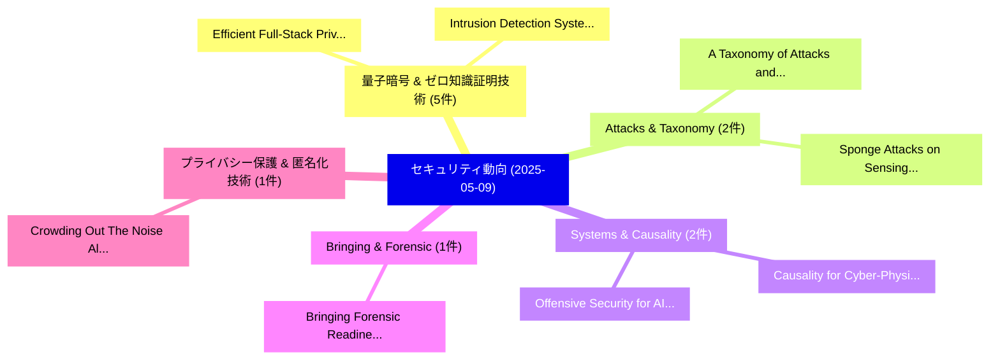

# 📅 02_daily: 日次エグゼクティブサマリー報告書 (2025-05-09)

**集計日時**: 2026-10-02 23:05:25 UTC  
**対象日付**: 2025-05-09  
**本日収集論文数**: 31 件  

---

## 💡 主要セキュリティ動向・脅威インサイト (Executive Insights)

本日の収集論文（計 31 件）において、以下の重点セキュリティ領域で活発な研究動向が確認されました：
- **量子暗号 & ゼロ知識証明技術** (5 件): 注目論文として 「Efficient Full-Stack Private F...」、「Intrusion Detection System Usi...」 等が発表され、実務防御および攻撃検証の進展が見られます。
- **Attacks & Taxonomy** (2 件): 注目論文として 「A Taxonomy of Attacks and Defe...」、「Sponge Attacks on Sensing AI: ...」 等が発表され、実務防御および攻撃検証の進展が見られます。
- **Systems & Causality** (2 件): 注目論文として 「Offensive Security for AI Syst...」、「Causality for Cyber-Physical S...」 等が発表され、実務防御および攻撃検証の進展が見られます。
- **Bringing & Forensic** (1 件): 注目論文として 「Bringing Forensic Readiness to...」 等が発表され、実務防御および攻撃検証の進展が見られます。
- **プライバシー保護 & 匿名化技術** (1 件): 注目論文として 「Crowding Out The Noise: Algori...」 等が発表され、実務防御および攻撃検証の進展が見られます。

### 🗺️ 技術・脅威トピックマインドマップ

---

## 📌 日次セキュリティ論文一覧 (日本語表形式)

| No | arXiv ID | 論文タイトル (日本語訳) | 重要キーワード | 構造化エグゼクティブ要約 (背景・提案・影響) | 脅威分類 | 詳細リンク |
|---|---|---|---|---|---|---|
| 1 | `2505.05697v1` | [Bringing Forensic Readiness to Modern Computer Firmware（セキュリティ分析論文）](../../okf/papers/2025-05-09/2505.05697.md) | `Bringing Forensic Readiness`, `Modern Computer Firmware`, `Tobias Latzo` | 【提案】概要 (Overview & Key Finding) 本論文「Bringing Forensic Readiness to Modern Computer Firmware...。実証評価により経営層・セキュリティ管理者向け推奨アクション (E... | `cs.CR` | [arXiv](https://arxiv.org/abs/2505.05697v1) &#124; [OKF](../../okf/papers/2025-05-09/2505.05697.md) |
| 2 | `2505.05707v2` | [Crowding Out The Noise: Algorithmic Collective Action Under Differential Privacy（セキュリティ分析論文）](../../okf/papers/2025-05-09/2505.05707.md) | `Rushabh Solanki`, `Meghana Bhange`, `Elliot Creager` | 【提案】概要 (Overview & Key Finding) 本論文「Crowding Out The Noise: Algorithmic Collective Action U...。実証評価により経営層・セキュリティ管理者向け推奨アクション (E... | `cs.CR` | [arXiv](https://arxiv.org/abs/2505.05707v2) &#124; [OKF](../../okf/papers/2025-05-09/2505.05707.md) |
| 3 | `2505.05712v4` | [LLM-Text Watermarking based on Lagrange Interpolation（セキュリティ分析論文）](../../okf/papers/2025-05-09/2505.05712.md) | `Text Watermarking`, `Lagrange Interpolation`, `LLM-Text Watermarking` | 【提案】概要 (Overview & Key Finding) 本論文「LLM-Text Watermarking based on Lagrange Interpolation（セ...。実証評価により経営層・セキュリティ管理者向け推奨アクション (E... | `cs.CR` | [arXiv](https://arxiv.org/abs/2505.05712v4) &#124; [OKF](../../okf/papers/2025-05-09/2505.05712.md) |
| 4 | `2505.05751v1` | [Efficient Full-Stack Private Federated Deep Learning with Post-Quantum Security（セキュリティ分析論文）](../../okf/papers/2025-05-09/2505.05751.md) | `Stack Private Federated Deep Learning`, `Efficient Full`, `Quantum Security` | 【提案】概要 (Overview & Key Finding) 本論文「Efficient Full-Stack Private Federated Deep Learning wi...。実証評価により経営層・セキュリティ管理者向け推奨アクション (E... | `cs.CR` | [arXiv](https://arxiv.org/abs/2505.05751v1) &#124; [OKF](../../okf/papers/2025-05-09/2505.05751.md) |
| 5 | `2505.05810v1` | [Intrusion Detection System Using Deep Learning for Network Security（セキュリティ分析論文）](../../okf/papers/2025-05-09/2505.05810.md) | `Intrusion Detection System Using Deep Learning`, `Network Security`, `Aswani Kumar Cherukuri` | 【提案】概要 (Overview & Key Finding) 本論文「Intrusion Detection System Using Deep Learning for Netw...。実証評価により経営層・セキュリティ管理者向け推奨アクション (E... | `cs.CR` | [arXiv](https://arxiv.org/abs/2505.05810v1) &#124; [OKF](../../okf/papers/2025-05-09/2505.05810.md) |
| 6 | `2505.05816v1` | [On the Price of Differential Privacy for Spectral Clustering over Stochastic Block Models（セキュリティ分析論文）](../../okf/papers/2025-05-09/2505.05816.md) | `Stochastic Block Models`, `Differential Privacy`, `Spectral Clustering` | 【提案】概要 (Overview & Key Finding) 本論文「On the Price of 差分プライバシー for Spectral Clustering over S...。実証評価により経営層・セキュリティ管理者向け推奨アクション (E... | `cs.CR` | [arXiv](https://arxiv.org/abs/2505.05816v1) &#124; [OKF](../../okf/papers/2025-05-09/2505.05816.md) |
| 7 | `2505.05843v1` | [Enhancing Noisy Functional Encryption for Privacy-Preserving Machine Learning（セキュリティ分析論文）](../../okf/papers/2025-05-09/2505.05843.md) | `Enhancing Noisy Functional Encryption`, `Preserving Machine Learning`, `Privacy-Preserving Machine` | 【提案】概要 (Overview & Key Finding) 本論文「Enhancing Noisy Functional Encryption for Privacy-Prese...。実証評価により経営層・セキュリティ管理者向け推奨アクション (E... | `cs.CR` | [arXiv](https://arxiv.org/abs/2505.05843v1) &#124; [OKF](../../okf/papers/2025-05-09/2505.05843.md) |
| 8 | `2505.05846v1` | [Representation gaps of rigid planar diagram monoids（セキュリティ分析論文）](../../okf/papers/2025-05-09/2505.05846.md) | `Willow Stewart`, `Daniel Tubbenhauer`, `Raw Meta` | 【提案】概要 (Overview & Key Finding) 本論文「Representation gaps of rigid planar diagram monoids（セキュ...。実証評価により経営層・セキュリティ管理者向け推奨アクション (E... | `cs.CR` | [arXiv](https://arxiv.org/abs/2505.05846v1) &#124; [OKF](../../okf/papers/2025-05-09/2505.05846.md) |
| 9 | `2505.05849v4` | [AgentVigil: Generic Black-Box Red-teaming for Indirect Prompt Injection against LLMエージェント](../../okf/papers/2025-05-09/2505.05849.md) | `Indirect Prompt Injection`, `Generic Black`, `Box Red` | 【提案】概要 (Overview & Key Finding) 本論文「AgentVigil: Generic Black-Box Red-teaming for Indirect ...。実証評価により経営層・セキュリティ管理者向け推奨アクション (E... | `cs.CR` | [arXiv](https://arxiv.org/abs/2505.05849v4) &#124; [OKF](../../okf/papers/2025-05-09/2505.05849.md) |
| 10 | `2505.05872v1` | [A Taxonomy of Attacks and Defenses in Split Learning（セキュリティ分析論文）](../../okf/papers/2025-05-09/2505.05872.md) | `Split Learning`, `Aqsa Shabbir`, `Sinem Sav` | 【提案】概要 (Overview & Key Finding) 本論文「A Taxonomy of Attacks and Defenses in Split Learning（セキ...。実証評価により経営層・セキュリティ管理者向け推奨アクション (E... | `cs.CR` | [arXiv](https://arxiv.org/abs/2505.05872v1) &#124; [OKF](../../okf/papers/2025-05-09/2505.05872.md) |
| 11 | `2505.05897v2` | [How Reliable Are FOSS Popularity Metrics? Analyzing the Effort Required for Spoofing Common Software Popularity Metrics（セキュリティ分析論文）](../../okf/papers/2025-05-09/2505.05897.md) | `Spoofing Common Software Popularity Metrics`, `Popularity Metrics`, `Effort Required` | 【提案】Analyzing the Effort Required for Spoofing Common Software Popularity Metrics ### (日本語題...。実証評価により経営層・セキュリティ管理者向け推奨アクション (E... | `cs.CR` | [arXiv](https://arxiv.org/abs/2505.05897v2) &#124; [OKF](../../okf/papers/2025-05-09/2505.05897.md) |
| 12 | `2505.05920v1` | [Privacy-Preserving Credit Card Approval Using Homomorphic SVM: Toward Secure Inference in FinTech Applications（セキュリティ分析論文）](../../okf/papers/2025-05-09/2505.05920.md) | `Preserving Credit Card Approval Using Homomorphic`, `Toward Secure Inference`, `Privacy-Preserving Credit` | 【提案】概要 (Overview & Key Finding) 本論文「Privacy-Preserving Credit Card Approval Using Homomorph...。実証評価により経営層・セキュリティ管理者向け推奨アクション (E... | `cs.CR` | [arXiv](https://arxiv.org/abs/2505.05920v1) &#124; [OKF](../../okf/papers/2025-05-09/2505.05920.md) |
| 13 | `2505.05922v2` | [Cape: Context-Aware Prompt Perturbation Mechanism with Differential Privacy（セキュリティ分析論文）](../../okf/papers/2025-05-09/2505.05922.md) | `Aware Prompt Perturbation Mechanism`, `Differential Privacy`, `Context-Aware Prompt` | 【提案】概要 (Overview & Key Finding) 本論文「Cape: Context-Aware Prompt Perturbation Mechanism with ...。実証評価により経営層・セキュリティ管理者向け推奨アクション (E... | `cs.CR` | [arXiv](https://arxiv.org/abs/2505.05922v2) &#124; [OKF](../../okf/papers/2025-05-09/2505.05922.md) |
| 14 | `2505.05934v1` | [Crypta Lattice-Based PIR Scheme for Arbitrary Database Sizesの分析](../../okf/papers/2025-05-09/2505.05934.md) | `Lattice-Based PIR`, `Arbitrary Database Sizes`, `Crypta Lattice` | 【提案】概要 (Overview & Key Finding) 本論文「Crypta Lattice-Based PIR Scheme for Arbitrary Database ...。実証評価により経営層・セキュリティ管理者向け推奨アクション (E... | `cs.CR` | [arXiv](https://arxiv.org/abs/2505.05934v1) &#124; [OKF](../../okf/papers/2025-05-09/2505.05934.md) |
| 15 | `2505.05959v1` | [Quantum Resilience: Data-Driven Migration Strategy Designに向けて](../../okf/papers/2025-05-09/2505.05959.md) | `Data-Driven Migration`, `Driven Migration Strategy Design`, `Towards Quantum Resilience` | 【提案】概要 (Overview & Key Finding) 本論文「量子 Resilience: Data-Driven Migration Strategy Designに向け...。実証評価により経営層・セキュリティ管理者向け推奨アクション (E... | `cs.CR` | [arXiv](https://arxiv.org/abs/2505.05959v1) &#124; [OKF](../../okf/papers/2025-05-09/2505.05959.md) |
| 16 | `2505.06084v1` | [HashKitty: Distributed Password Analysis（セキュリティ分析論文）](../../okf/papers/2025-05-09/2505.06084.md) | `Pedro Antunes`, `Daniel Fuentes`, `Raw Meta` | 【提案】概要 (Overview & Key Finding) 本論文「HashKitty: Distributed Password Analysis（セキュリティ分析論文）」（原...。実証評価により経営層・セキュリティ管理者向け推奨アクション (E... | `cs.CR` | [arXiv](https://arxiv.org/abs/2505.06084v1) &#124; [OKF](../../okf/papers/2025-05-09/2505.06084.md) |
| 17 | `2505.06171v1` | [Self-Supervised Federated GNSS Spoofing Detection with Opportunistic Data（セキュリティ分析論文）](../../okf/papers/2025-05-09/2505.06171.md) | `Supervised Federated`, `Spoofing Detection`, `Opportunistic Data` | 【提案】概要 (Overview & Key Finding) 本論文「Self-Supervised Federated GNSS Spoofing Detection with ...。実証評価により経営層・セキュリティ管理者向け推奨アクション (E... | `cs.CR` | [arXiv](https://arxiv.org/abs/2505.06171v1) &#124; [OKF](../../okf/papers/2025-05-09/2505.06171.md) |
| 18 | `2505.06174v1` | [Leakage-resilient Algebraic Manipulation Detection Codes with Optimal Parameters（セキュリティ分析論文）](../../okf/papers/2025-05-09/2505.06174.md) | `Algebraic Manipulation Detection Codes`, `Optimal Parameters`, `Leakage-resilient Algebraic` | 【提案】概要 (Overview & Key Finding) 本論文「Leakage-resilient Algebraic Manipulation Detection Code...。実証評価により経営層・セキュリティ管理者向け推奨アクション (E... | `cs.CR` | [arXiv](https://arxiv.org/abs/2505.06174v1) &#124; [OKF](../../okf/papers/2025-05-09/2505.06174.md) |
| 19 | `2505.06177v2` | [Fuzz Harness Degradationの実証研究](../../okf/papers/2025-05-09/2505.06177.md) | `Fuzz Harness Degradation`, `Fuzz Harness`, `Joschua Schilling` | 【提案】概要 (Overview & Key Finding) 本論文「Fuzz Harness Degradationの実証研究」（原題: An Empirical Study o...。実証評価により経営層・セキュリティ管理者向け推奨アクション (E... | `cs.CR` | [arXiv](https://arxiv.org/abs/2505.06177v2) &#124; [OKF](../../okf/papers/2025-05-09/2505.06177.md) |
| 20 | `2505.06335v2` | [Remote Rowhammer Attack using Adversarial Observations on 連合学習 Clients](../../okf/papers/2025-05-09/2505.06335.md) | `Remote Rowhammer Attack`, `Adversarial Observations`, `Federated Learning Clients` | 【提案】概要 (Overview & Key Finding) 本論文「Remote RowHammer Attack using Adversarial Observations ...。実証評価により経営層・セキュリティ管理者向け推奨アクション (E... | `cs.CR` | [arXiv](https://arxiv.org/abs/2505.06335v2) &#124; [OKF](../../okf/papers/2025-05-09/2505.06335.md) |
| 21 | `2505.06364v1` | [LATENT: LLM-Augmented Trojan Insertion and Evaluation Framework for Analog Netlist Topologies（セキュリティ分析論文）](../../okf/papers/2025-05-09/2505.06364.md) | `Augmented Trojan Insertion`, `Analog Netlist Topologies`, `LLM-Augmented Trojan` | 【提案】概要 (Overview & Key Finding) 本論文「LATENT: LLM-Augmented Trojan Insertion and Evaluation F...。実証評価により経営層・セキュリティ管理者向け推奨アクション (E... | `cs.CR` | [arXiv](https://arxiv.org/abs/2505.06364v1) &#124; [OKF](../../okf/papers/2025-05-09/2505.06364.md) |
| 22 | `2505.06379v1` | [NCorr-FP: A Neighbourhood-based Correlation-preserving Fingerprinting Scheme for Intellectual Property Protection of Structured Data（セキュリティ分析論文）](../../okf/papers/2025-05-09/2505.06379.md) | `Intellectual Property Protection`, `Fingerprinting Scheme`, `Structured Data` | 【提案】概要 (Overview & Key Finding) 本論文「NCorr-FP: A Neighbourhood-based Correlation-preserving ...。実証評価により経営層・セキュリティ管理者向け推奨アクション (E... | `cs.CR` | [arXiv](https://arxiv.org/abs/2505.06379v1) &#124; [OKF](../../okf/papers/2025-05-09/2505.06379.md) |
| 23 | `2505.06380v1` | [Offensive Security for AI Systems: Concepts, Practices, and Applications（セキュリティ分析論文）](../../okf/papers/2025-05-09/2505.06380.md) | `Offensive Security`, `Josh Harguess`, `Raw Meta` | 【提案】概要 (Overview & Key Finding) 本論文「Offensive Security for AI Systems: Concepts, Practices,...。実証評価により経営層・セキュリティ管理者向け推奨アクション (E... | `cs.CR` | [arXiv](https://arxiv.org/abs/2505.06380v1) &#124; [OKF](../../okf/papers/2025-05-09/2505.06380.md) |
| 24 | `2505.06384v1` | [RiM: Record, Improve and Maintain Physical Well-being using 連合学習](../../okf/papers/2025-05-09/2505.06384.md) | `Maintain Physical Well`, `Well-being using`, `Federated Learning` | 【提案】概要 (Overview & Key Finding) 本論文「RiM: Record, Improve and Maintain Physical Well-being u...。実証評価により経営層・セキュリティ管理者向け推奨アクション (E... | `cs.CR` | [arXiv](https://arxiv.org/abs/2505.06384v1) &#124; [OKF](../../okf/papers/2025-05-09/2505.06384.md) |
| 25 | `2505.06394v1` | [AI-Driven Human-Machine Co-Teaming for Adaptive and Agile Cyber Security Operation Centersに向けて](../../okf/papers/2025-05-09/2505.06394.md) | `Driven Human`, `Machine Co`, `AI-Driven Human` | 【提案】概要 (Overview & Key Finding) 本論文「AI-Driven Human-Machine Co-Teaming for Adaptive and Agi...。実証評価により経営層・セキュリティ管理者向け推奨アクション (E... | `cs.CR` | [arXiv](https://arxiv.org/abs/2505.06394v1) &#124; [OKF](../../okf/papers/2025-05-09/2505.06394.md) |
| 26 | `2505.06406v1` | [Safety Analysis in the NGAC Model（セキュリティ分析論文）](../../okf/papers/2025-05-09/2505.06406.md) | `Brian Tan`, `Indrakshi Ray`, `Raw Meta` | 【提案】概要 (Overview & Key Finding) 本論文「Safety Analysis in the NGAC Model（セキュリティ分析論文）」（原題: Safe...。実証評価によりAbdelgawad - **公開日時**: `2... | `cs.CR` | [arXiv](https://arxiv.org/abs/2505.06406v1) &#124; [OKF](../../okf/papers/2025-05-09/2505.06406.md) |
| 27 | `2505.06409v1` | [Engineering Risk-Aware, Security-by-Design Frameworks for Assurance of Large-Scale Autonomous AI Models（セキュリティ分析論文）](../../okf/papers/2025-05-09/2505.06409.md) | `Engineering Risk`, `Design Frameworks`, `Scale Autonomous` | 【提案】概要 (Overview & Key Finding) 本論文「Engineering Risk-Aware, Security-by-Design Frameworks f...。実証評価により経営層・セキュリティ管理者向け推奨アクション (E... | `cs.CR` | [arXiv](https://arxiv.org/abs/2505.06409v1) &#124; [OKF](../../okf/papers/2025-05-09/2505.06409.md) |
| 28 | `2505.06454v1` | [Sponge Attacks on Sensing AI: Energy-Latency Vulnerabilities and Defense via Model Pruning（セキュリティ分析論文）](../../okf/papers/2025-05-09/2505.06454.md) | `Sponge Attacks`, `Latency Vulnerabilities`, `Model Pruning` | 【提案】概要 (Overview & Key Finding) 本論文「Sponge Attacks on Sensing AI: Energy-Latency Vulnerabil...。実証評価により経営層・セキュリティ管理者向け推奨アクション (E... | `cs.CR` | [arXiv](https://arxiv.org/abs/2505.06454v1) &#124; [OKF](../../okf/papers/2025-05-09/2505.06454.md) |
| 29 | `2505.06470v3` | ["vcd2df" -- Leveraging Data Science Insights for Hardware Security Research（セキュリティ分析論文）](../../okf/papers/2025-05-09/2505.06470.md) | `Leveraging Data Science Insights`, `Hardware Security Research`, `Calvin Deutschbein` | 【提案】概要 (Overview & Key Finding) 本論文「"vcd2df" -- Leveraging Data Science Insights for Hardwa...。実証評価により経営層・セキュリティ管理者向け推奨アクション (E... | `cs.CR` | [arXiv](https://arxiv.org/abs/2505.06470v3) &#124; [OKF](../../okf/papers/2025-05-09/2505.06470.md) |
| 30 | `2505.08799v1` | [Measuring Security in 5G and Future Networks（セキュリティ分析論文）](../../okf/papers/2025-05-09/2505.08799.md) | `Measuring Security`, `Future Networks`, `Loay Abdelrazek` | 【提案】概要 (Overview & Key Finding) 本論文「Measuring Security in 5G and Future Networks（セキュリティ分析論文...。実証評価により経営層・セキュリティ管理者向け推奨アクション (E... | `cs.CR` | [arXiv](https://arxiv.org/abs/2505.08799v1) &#124; [OKF](../../okf/papers/2025-05-09/2505.08799.md) |
| 31 | `2505.13475v1` | [Causality for Cyber-Physical Systems（セキュリティ分析論文）](../../okf/papers/2025-05-09/2505.13475.md) | `Physical Systems`, `Cyber-Physical Systems`, `Mohammad Reza Mousavi` | 【提案】概要 (Overview & Key Finding) 本論文「Causality for Cyber-Physical Systems（セキュリティ分析論文）」（原題: C...。実証評価により経営層・セキュリティ管理者向け推奨アクション (E... | `cs.CR` | [arXiv](https://arxiv.org/abs/2505.13475v1) &#124; [OKF](../../okf/papers/2025-05-09/2505.13475.md) |

