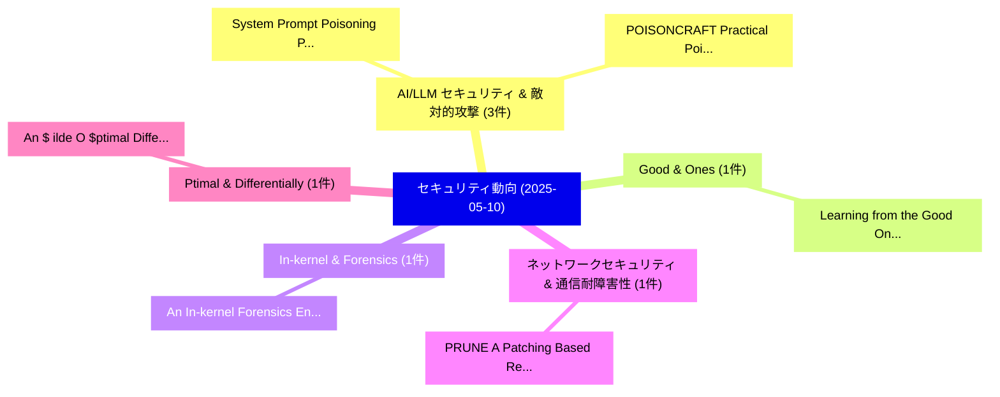

# 📅 02_daily: 日次エグゼクティブサマリー報告書 (2025-05-10)

**集計日時**: 2026-10-02 23:05:25 UTC  
**対象日付**: 2025-05-10  
**本日収集論文数**: 14 件  

---

## 💡 主要セキュリティ動向・脅威インサイト (Executive Insights)

本日の収集論文（計 14 件）において、以下の重点セキュリティ領域で活発な研究動向が確認されました：
- **AI/LLM セキュリティ & 敵対的攻撃** (3 件): 注目論文として 「System Prompt Poisoning: Persi...」、「POISONCRAFT: Practical Poisoni...」 等が発表され、実務防御および攻撃検証の進展が見られます。
- **Good & Ones** (1 件): 注目論文として 「Learning from the Good Ones: R...」 等が発表され、実務防御および攻撃検証の進展が見られます。
- **In-kernel & Forensics** (1 件): 注目論文として 「An In-kernel Forensics Engine ...」 等が発表され、実務防御および攻撃検証の進展が見られます。
- **ネットワークセキュリティ & 通信耐障害性** (1 件): 注目論文として 「PRUNE: A Patching Based Repair...」 等が発表され、実務防御および攻撃検証の進展が見られます。
- **Ptimal & Differentially** (1 件): 注目論文として 「An $	ilde{O}$ptimal Differenti...」 等が発表され、実務防御および攻撃検証の進展が見られます。

### 🗺️ 技術・脅威トピックマインドマップ

---

## 📌 日次セキュリティ論文一覧 (日本語表形式)

| No | arXiv ID | 論文タイトル (日本語訳) | 重要キーワード | 構造化エグゼクティブ要約 (背景・提案・影響) | 脅威分類 | 詳細リンク |
|---|---|---|---|---|---|---|
| 1 | `2505.06477v1` | [Learning from the Good Ones: Risk Profiling-Based Defenses Against Evasion Attacks on DNNs（セキュリティ分析論文）](../../okf/papers/2025-05-10/2505.06477.md) | `Good Ones`, `Risk Profiling`, `Profiling-Based Defenses` | 【提案】概要 (Overview & Key Finding) 本論文「Learning from the Good Ones: Risk Profiling-Based Defen...。実証評価により経営層・セキュリティ管理者向け推奨アクション (E... | `cs.CR` | [arXiv](https://arxiv.org/abs/2505.06477v1) &#124; [OKF](../../okf/papers/2025-05-10/2505.06477.md) |
| 2 | `2505.06493v3` | [System Prompt Poisoning: Persistent Attacks on 大規模言語モデル Beyond User Injection](../../okf/papers/2025-05-10/2505.06493.md) | `System Prompt Poisoning`, `Persistent Attacks`, `Large Language Models Beyond User Injection` | 【提案】概要 (Overview & Key Finding) 本論文「System Prompt Poisoning: Persistent Attacks on 大規模言語モデル...。実証評価により経営層・セキュリティ管理者向け推奨アクション (E... | `cs.CR` | [arXiv](https://arxiv.org/abs/2505.06493v3) &#124; [OKF](../../okf/papers/2025-05-10/2505.06493.md) |
| 3 | `2505.06498v2` | [An In-kernel Forensics Engine for Investigating Evasive Attacks（セキュリティ分析論文）](../../okf/papers/2025-05-10/2505.06498.md) | `Investigating Evasive Attacks`, `Forensics Engine`, `In-kernel Forensics` | 【提案】概要 (Overview & Key Finding) 本論文「An In-kernel Forensics Engine for Investigating Evasive...。実証評価により経営層・セキュリティ管理者向け推奨アクション (E... | `cs.CR` | [arXiv](https://arxiv.org/abs/2505.06498v2) &#124; [OKF](../../okf/papers/2025-05-10/2505.06498.md) |
| 4 | `2505.06520v4` | [PRUNE: A Patching Based Repair Framework for Certifiable Unlearning of Neural Networks（セキュリティ分析論文）](../../okf/papers/2025-05-10/2505.06520.md) | `Certifiable Unlearning`, `Neural Networks`, `Xuran Li` | 【提案】概要 (Overview & Key Finding) 本論文「PRUNE: A Patching Based Repair Framework for Certifiabl...。実証評価により経営層・セキュリティ管理者向け推奨アクション (E... | `cs.CR` | [arXiv](https://arxiv.org/abs/2505.06520v4) &#124; [OKF](../../okf/papers/2025-05-10/2505.06520.md) |
| 5 | `2505.06579v1` | [POISONCRAFT: Practical Poisoning of Retrieval-Augmented Generation for 大規模言語モデル](../../okf/papers/2025-05-10/2505.06579.md) | `Practical Poisoning`, `Augmented Generation`, `Retrieval-Augmented Generation` | 【提案】概要 (Overview & Key Finding) 本論文「POISONCRAFT: Practical Poisoning of Retrieval-Augmented...。実証評価により経営層・セキュリティ管理者向け推奨アクション (E... | `cs.CR` | [arXiv](https://arxiv.org/abs/2505.06579v1) &#124; [OKF](../../okf/papers/2025-05-10/2505.06579.md) |
| 6 | `2505.06581v2` | [An $	ilde{O}$ptimal Differentially Private Learner for Concept Classes with VC Dimension 1（セキュリティ分析論文）](../../okf/papers/2025-05-10/2505.06581.md) | `Differentially Private Learner`, `Concept Classes`, `Chao Yan` | 【提案】概要 (Overview & Key Finding) 本論文「An $\tilde{O}$ptimal Differentially Private Learner for...。実証評価により経営層・セキュリティ管理者向け推奨アクション (E... | `cs.CR` | [arXiv](https://arxiv.org/abs/2505.06581v2) &#124; [OKF](../../okf/papers/2025-05-10/2505.06581.md) |
| 7 | `2505.06632v1` | [AI-Powered Anomaly Detection with Blockchain for Real-Time Security and Reliability in 自動運転車両](../../okf/papers/2025-05-10/2505.06632.md) | `Powered Anomaly Detection`, `Time Security`, `AI-Powered Anomaly` | 【提案】概要 (Overview & Key Finding) 本論文「AI-Powered Anomaly Detection with Blockchain for Real-T...。実証評価により経営層・セキュリティ管理者向け推奨アクション (E... | `cs.CR` | [arXiv](https://arxiv.org/abs/2505.06632v1) &#124; [OKF](../../okf/papers/2025-05-10/2505.06632.md) |
| 8 | `2505.06636v1` | [A Contrastive Federated Semi-Supervised Learning Intrusion Detection Framework for Internet of Robotic Things（セキュリティ分析論文）](../../okf/papers/2025-05-10/2505.06636.md) | `Contrastive Federated Semi`, `Robotic Things`, `Semi-Supervised Learning` | 【提案】概要 (Overview & Key Finding) 本論文「A Contrastive Federated Semi-Supervised Learning Intrus...。実証評価により経営層・セキュリティ管理者向け推奨アクション (E... | `cs.CR` | [arXiv](https://arxiv.org/abs/2505.06636v1) &#124; [OKF](../../okf/papers/2025-05-10/2505.06636.md) |
| 9 | `2505.06643v1` | [Practical Reasoning Interruption Attacks on Reasoning 大規模言語モデル](../../okf/papers/2025-05-10/2505.06643.md) | `Practical Reasoning Interruption Attacks`, `Reasoning Large Language Models`, `Yu Cui` | 【提案】概要 (Overview & Key Finding) 本論文「Practical Reasoning Interruption Attacks on Reasoning 大...。実証評価により経営層・セキュリティ管理者向け推奨アクション (E... | `cs.CR` | [arXiv](https://arxiv.org/abs/2505.06643v1) &#124; [OKF](../../okf/papers/2025-05-10/2505.06643.md) |
| 10 | `2505.06661v1` | [Centralized Trust in Decentralized Systems: Unveiling Hidden Contradictions in Blockchain and Cryptocurrency（セキュリティ分析論文）](../../okf/papers/2025-05-10/2505.06661.md) | `Unveiling Hidden Contradictions`, `Centralized Trust`, `Decentralized Systems` | 【提案】概要 (Overview & Key Finding) 本論文「Centralized Trust in Decentralized Systems: Unveiling H...。実証評価により経営層・セキュリティ管理者向け推奨アクション (E... | `cs.CR` | [arXiv](https://arxiv.org/abs/2505.06661v1) &#124; [OKF](../../okf/papers/2025-05-10/2505.06661.md) |
| 11 | `2505.06701v1` | [RuleGenie: SIEM Detection Rule Set Optimization（セキュリティ分析論文）](../../okf/papers/2025-05-10/2505.06701.md) | `Detection Rule Set Optimization`, `Parth Atulbhai Gandhi`, `Akansha Shukla` | 【提案】概要 (Overview & Key Finding) 本論文「RuleGenie: SIEM Detection Rule Set Optimization（セキュリティ分...。実証評価により経営層・セキュリティ管理者向け推奨アクション (E... | `cs.CR` | [arXiv](https://arxiv.org/abs/2505.06701v1) &#124; [OKF](../../okf/papers/2025-05-10/2505.06701.md) |
| 12 | `2505.06738v3` | [I Know What You Said: Unveiling Hardware Cache Side-Channels in Local Large Language Model Inference（セキュリティ分析論文）](../../okf/papers/2025-05-10/2505.06738.md) | `Local Large Language Model Inference`, `Unveiling Hardware Cache Side`, `Zibo Gao` | 【提案】概要 (Overview & Key Finding) 本論文「I Know What You Said: Unveiling Hardware Cache サイドチャネル攻...。実証評価により経営層・セキュリティ管理者向け推奨アクション (E... | `cs.CR` | [arXiv](https://arxiv.org/abs/2505.06738v3) &#124; [OKF](../../okf/papers/2025-05-10/2505.06738.md) |
| 13 | `2505.06747v1` | [DPolicy: Managing Privacy Risks Across Multiple Releases with Differential Privacy（セキュリティ分析論文）](../../okf/papers/2025-05-10/2505.06747.md) | `Managing Privacy Risks Across Multiple Releases`, `Differential Privacy`, `Alexander Viand` | 【提案】概要 (Overview & Key Finding) 本論文「DPolicy: Managing Privacy Risks Across Multiple Release...。実証評価により経営層・セキュリティ管理者向け推奨アクション (E... | `cs.CR` | [arXiv](https://arxiv.org/abs/2505.06747v1) &#124; [OKF](../../okf/papers/2025-05-10/2505.06747.md) |
| 14 | `2505.06759v1` | [Privacy-aware Berrut Approximated Coded Computing applied to general distributed learning（セキュリティ分析論文）](../../okf/papers/2025-05-10/2505.06759.md) | `Berrut Approximated Coded Computing`, `Privacy-aware Berrut`, `Raw Meta` | 【提案】概要 (Overview & Key Finding) 本論文「Privacy-aware Berrut Approximated Coded Computing appli...。実証評価により経営層・セキュリティ管理者向け推奨アクション (E... | `cs.CR` | [arXiv](https://arxiv.org/abs/2505.06759v1) &#124; [OKF](../../okf/papers/2025-05-10/2505.06759.md) |

