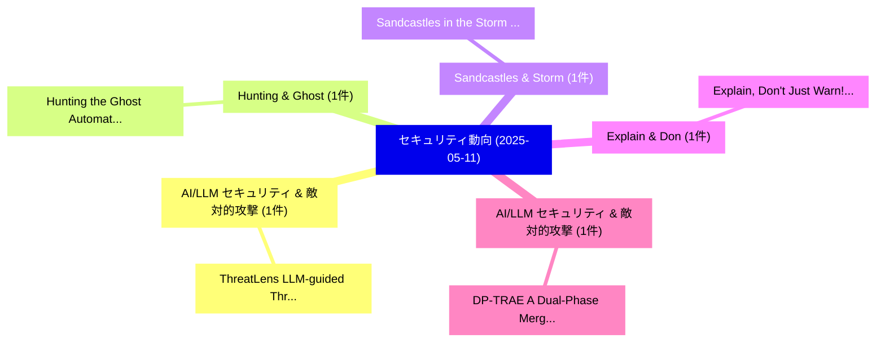

# 📅 02_daily: 日次エグゼクティブサマリー報告書 (2025-05-11)

**集計日時**: 2026-10-02 23:05:25 UTC  
**対象日付**: 2025-05-11  
**本日収集論文数**: 10 件  

---

## 💡 主要セキュリティ動向・脅威インサイト (Executive Insights)

本日の収集論文（計 10 件）において、以下の重点セキュリティ領域で活発な研究動向が確認されました：
- **AI/LLM セキュリティ & 敵対的攻撃** (1 件): 注目論文として 「ThreatLens: LLM-guided Threat ...」 等が発表され、実務防御および攻撃検証の進展が見られます。
- **Hunting & Ghost** (1 件): 注目論文として 「Hunting the Ghost: Automatic M...」 等が発表され、実務防御および攻撃検証の進展が見られます。
- **Sandcastles & Storm** (1 件): 注目論文として 「Sandcastles in the Storm: Revi...」 等が発表され、実務防御および攻撃検証の進展が見られます。
- **Explain & Don** (1 件): 注目論文として 「"Explain, Don't Just Warn!" --...」 等が発表され、実務防御および攻撃検証の進展が見られます。
- **AI/LLM セキュリティ & 敵対的攻撃** (1 件): 注目論文として 「DP-TRAE: A Dual-Phase Merging ...」 等が発表され、実務防御および攻撃検証の進展が見られます。

### 🗺️ 技術・脅威トピックマインドマップ

---

## 📌 日次セキュリティ論文一覧 (日本語表形式)

| No | arXiv ID | 論文タイトル (日本語訳) | 重要キーワード | 構造化エグゼクティブ要約 (背景・提案・影響) | 脅威分類 | 詳細リンク |
|---|---|---|---|---|---|---|
| 1 | `2505.06821v1` | [ThreatLens: LLM-guided Threat Modeling and Test Plan Generation for Hardware Security Verification（セキュリティ分析論文）](../../okf/papers/2025-05-11/2505.06821.md) | `Test Plan Generation`, `Hardware Security Verification`, `Threat Modeling` | 【提案】概要 (Overview & Key Finding) 本論文「ThreatLens: LLM-guided 脅威 Modeling and Test Plan Genera...。実証評価により経営層・セキュリティ管理者向け推奨アクション (E... | `cs.CR` | [arXiv](https://arxiv.org/abs/2505.06821v1) &#124; [OKF](../../okf/papers/2025-05-11/2505.06821.md) |
| 2 | `2505.06822v2` | [Hunting the Ghost: Automatic Mining of IoT Hidden Servicesに向けて](../../okf/papers/2025-05-11/2505.06822.md) | `Towards Automatic Mining`, `Hidden Services`, `Automatic Mining` | 【提案】概要 (Overview & Key Finding) 本論文「Hunting the Ghost: Automatic Mining of IoT Hidden Servi...。実証評価により経営層・セキュリティ管理者向け推奨アクション (E... | `cs.CR` | [arXiv](https://arxiv.org/abs/2505.06822v2) &#124; [OKF](../../okf/papers/2025-05-11/2505.06822.md) |
| 3 | `2505.06827v1` | [Sandcastles in the Storm: Revisiting the (Im)possibility of Strong Watermarking（セキュリティ分析論文）](../../okf/papers/2025-05-11/2505.06827.md) | `Strong Watermarking`, `Gary Jiarui Song`, `Boran Erol` | 【提案】概要 (Overview & Key Finding) 本論文「Sandcastles in the Storm: Revisiting the (Im)possibilit...。実証評価により経営層・セキュリティ管理者向け推奨アクション (E... | `cs.CR` | [arXiv](https://arxiv.org/abs/2505.06827v1) &#124; [OKF](../../okf/papers/2025-05-11/2505.06827.md) |
| 4 | `2505.06836v2` | ["Explain, Don't Just Warn!" -- A Real-Time Framework for Generating Phishing Warnings with Contextual Cues（セキュリティ分析論文）](../../okf/papers/2025-05-11/2505.06836.md) | `Generating Phishing Warnings`, `Contextual Cues`, `Sayak Saha Roy` | 【提案】概要 (Overview & Key Finding) 本論文「"Explain, Don't Just Warn!" -- A Real-Time Framework fo...。実証評価により経営層・セキュリティ管理者向け推奨アクション (E... | `cs.CR` | [arXiv](https://arxiv.org/abs/2505.06836v2) &#124; [OKF](../../okf/papers/2025-05-11/2505.06836.md) |
| 5 | `2505.06860v1` | [DP-TRAE: A Dual-Phase Merging Transferable Reversible Adversarial Example for Image Privacy Protection（セキュリティ分析論文）](../../okf/papers/2025-05-11/2505.06860.md) | `Phase Merging Transferable Reversible Adversarial Example`, `Image Privacy Protection`, `Dual-Phase Merging` | 【提案】概要 (Overview & Key Finding) 本論文「DP-TRAE: A Dual-Phase Merging Transferable Reversible 敵...。実証評価により経営層・セキュリティ管理者向け推奨アクション (E... | `cs.CR` | [arXiv](https://arxiv.org/abs/2505.06860v1) &#124; [OKF](../../okf/papers/2025-05-11/2505.06860.md) |
| 6 | `2505.06913v1` | [RedTeamLLM: an Agentic AI framework for offensive security（セキュリティ分析論文）](../../okf/papers/2025-05-11/2505.06913.md) | `Brian Challita`, `Pierre Parrend`, `Raw Meta` | 【提案】概要 (Overview & Key Finding) 本論文「RedTeamLLM: an Agentic AI framework for offensive secur...。実証評価により経営層・セキュリティ管理者向け推奨アクション (E... | `cs.CR` | [arXiv](https://arxiv.org/abs/2505.06913v1) &#124; [OKF](../../okf/papers/2025-05-11/2505.06913.md) |
| 7 | `2505.06989v3` | [Measuring the Accuracy and Effectiveness of PII Removal Services（セキュリティ分析論文）](../../okf/papers/2025-05-11/2505.06989.md) | `Removal Services`, `Pete Snyder`, `Hamed Haddadi` | 【提案】概要 (Overview & Key Finding) 本論文「Measuring the Accuracy and Effectiveness of PII Removal...。実証評価によりBustamante, Gareth Tyson ... | `cs.CR` | [arXiv](https://arxiv.org/abs/2505.06989v3) &#124; [OKF](../../okf/papers/2025-05-11/2505.06989.md) |
| 8 | `2505.07011v1` | [Source Anonymity for Private Random Walk Decentralized Learning（セキュリティ分析論文）](../../okf/papers/2025-05-11/2505.07011.md) | `Private Random Walk Decentralized Learning`, `Source Anonymity`, `Maximilian Egger` | 【提案】概要 (Overview & Key Finding) 本論文「Source Anonymity for Private Random Walk Decentralized ...。実証評価により経営層・セキュリティ管理者向け推奨アクション (E... | `cs.CR` | [arXiv](https://arxiv.org/abs/2505.07011v1) &#124; [OKF](../../okf/papers/2025-05-11/2505.07011.md) |
| 9 | `2505.07148v1` | [Standing Firm in 5G: A Single-Round, Dropout-Resilient Secure Aggregation for 連合学習](../../okf/papers/2025-05-11/2505.07148.md) | `Resilient Secure Aggregation`, `Standing Firm`, `Dropout-Resilient Secure` | 【提案】概要 (Overview & Key Finding) 本論文「Standing Firm in 5G: A Single-Round, Dropout-Resilient ...。実証評価により経営層・セキュリティ管理者向け推奨アクション (E... | `cs.CR` | [arXiv](https://arxiv.org/abs/2505.07148v1) &#124; [OKF](../../okf/papers/2025-05-11/2505.07148.md) |
| 10 | `2505.08804v1` | [TokenProber: Jailbreaking Text-to-image Models via Fine-grained Word Impact Analysis（セキュリティ分析論文）](../../okf/papers/2025-05-11/2505.08804.md) | `Jailbreaking Text`, `Fine-grained Word`, `Longtian Wang` | 【提案】概要 (Overview & Key Finding) 本論文「TokenProber: ジェイルブレイクing Text-to-image Models via Fine-...。実証評価により経営層・セキュリティ管理者向け推奨アクション (E... | `cs.CR` | [arXiv](https://arxiv.org/abs/2505.08804v1) &#124; [OKF](../../okf/papers/2025-05-11/2505.08804.md) |

