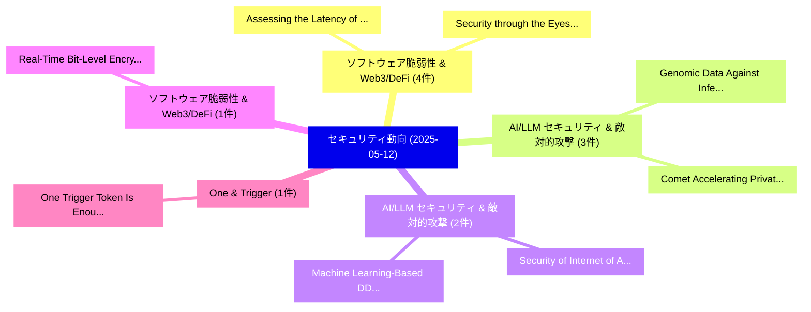

# 📅 02_daily: 日次エグゼクティブサマリー報告書 (2025-05-12)

**集計日時**: 2026-10-02 23:05:25 UTC  
**対象日付**: 2025-05-12  
**本日収集論文数**: 21 件  

---

## 💡 主要セキュリティ動向・脅威インサイト (Executive Insights)

本日の収集論文（計 21 件）において、以下の重点セキュリティ領域で活発な研究動向が確認されました：
- **ソフトウェア脆弱性 & Web3/DeFi** (4 件): 注目論文として 「Assessing the Latency of Netwo...」、「Security through the Eyes of A...」 等が発表され、実務防御および攻撃検証の進展が見られます。
- **AI/LLM セキュリティ & 敵対的攻撃** (3 件): 注目論文として 「Genomic Data Against Inference...」、「Comet: Accelerating Private In...」 等が発表され、実務防御および攻撃検証の進展が見られます。
- **AI/LLM セキュリティ & 敵対的攻撃** (2 件): 注目論文として 「Security of Internet of Agents...」、「Machine Learning-Based DDoS At...」 等が発表され、実務防御および攻撃検証の進展が見られます。
- **ソフトウェア脆弱性 & Web3/DeFi** (1 件): 注目論文として 「Real-Time Bit-Level Encryption...」 等が発表され、実務防御および攻撃検証の進展が見られます。
- **One & Trigger** (1 件): 注目論文として 「One Trigger Token Is Enough: A...」 等が発表され、実務防御および攻撃検証の進展が見られます。

### 🗺️ 技術・脅威トピックマインドマップ

---

## 📌 日次セキュリティ論文一覧 (日本語表形式)

| No | arXiv ID | 論文タイトル (日本語訳) | 重要キーワード | 構造化エグゼクティブ要約 (背景・提案・影響) | 脅威分類 | 詳細リンク |
|---|---|---|---|---|---|---|
| 1 | `2505.07158v1` | [Real-Time Bit-Level Encryption of Full High-Definition Video Without Diffusion（セキュリティ分析論文）](../../okf/papers/2025-05-12/2505.07158.md) | `Definition Video Without Diffusion`, `Time Bit`, `Level Encryption` | 【提案】背景とセキュリティ上の課題 (Background & Problem) 本研究はサイバー脅威環境におけるセキュリティ構造・脆弱性の検証を目的としています。(主要検出項目: ...。実証評価により経営層・セキュリティ管理者向け推奨アクション (E... | `cs.CR` | [arXiv](https://arxiv.org/abs/2505.07158v1) &#124; [OKF](../../okf/papers/2025-05-12/2505.07158.md) |
| 2 | `2505.07167v3` | [One Trigger Token Is Enough: A Defense Strategy for Balancing Safety and Usability in 大規模言語モデル](../../okf/papers/2025-05-12/2505.07167.md) | `Defense Strategy`, `Balancing Safety`, `Large Language Models` | 【提案】概要 (Overview & Key Finding) 本論文「One Trigger Token Is Enough: A Defense Strategy for Bal...。実証評価により経営層・セキュリティ管理者向け推奨アクション (E... | `cs.CR` | [arXiv](https://arxiv.org/abs/2505.07167v3) &#124; [OKF](../../okf/papers/2025-05-12/2505.07167.md) |
| 3 | `2505.07188v1` | [Genomic Data Against Inference Attacks in Federated Learning Environmentsのセキュリティ強化](../../okf/papers/2025-05-12/2505.07188.md) | `Federated Learning Environments`, `Federated Learning`, `Chetan Pathade` | 【提案】概要 (Overview & Key Finding) 本論文「Genomic Data Against Inference Attacks in Federated Lea...。実証評価により経営層・セキュリティ管理者向け推奨アクション (E... | `cs.CR` | [arXiv](https://arxiv.org/abs/2505.07188v1) &#124; [OKF](../../okf/papers/2025-05-12/2505.07188.md) |
| 4 | `2505.07239v1` | [Comet: Accelerating Private Inference for Large Language Model by Predicting Activation Sparsity（セキュリティ分析論文）](../../okf/papers/2025-05-12/2505.07239.md) | `Accelerating Private Inference`, `Large Language Model`, `Predicting Activation Sparsity` | 【提案】概要 (Overview & Key Finding) 本論文「Comet: Accelerating Private Inference for Large Languag...。実証評価により経営層・セキュリティ管理者向け推奨アクション (E... | `cs.CR` | [arXiv](https://arxiv.org/abs/2505.07239v1) &#124; [OKF](../../okf/papers/2025-05-12/2505.07239.md) |
| 5 | `2505.07328v1` | [Assessing the Latency of Network Layer Security in 5G Networks（セキュリティ分析論文）](../../okf/papers/2025-05-12/2505.07328.md) | `Network Layer Security`, `Sotiris Michaelides`, `Jonathan Mucke` | 【提案】概要 (Overview & Key Finding) 本論文「Assessing the Latency of Network Layer Security in 5G N...。実証評価により経営層・セキュリティ管理者向け推奨アクション (E... | `cs.CR` | [arXiv](https://arxiv.org/abs/2505.07328v1) &#124; [OKF](../../okf/papers/2025-05-12/2505.07328.md) |
| 6 | `2505.07329v1` | [Private LoRA Fine-tuning of Open-Source LLMs with Homomorphic Encryption（セキュリティ分析論文）](../../okf/papers/2025-05-12/2505.07329.md) | `Homomorphic Encryption`, `Open-Source LLMs`, `Jordan Frery` | 【提案】概要 (Overview & Key Finding) 本論文「Private LoRA Fine-tuning of Open-Source LLMs with 準同型暗号...。実証評価により経営層・セキュリティ管理者向け推奨アクション (E... | `cs.CR` | [arXiv](https://arxiv.org/abs/2505.07329v1) &#124; [OKF](../../okf/papers/2025-05-12/2505.07329.md) |
| 7 | `2505.07380v2` | [Apple's Synthetic Defocus Noise Pattern: Characterization and Forensic Applications（セキュリティ分析論文）](../../okf/papers/2025-05-12/2505.07380.md) | `Synthetic Defocus Noise Pattern`, `Forensic Applications`, `Raw Meta` | 【提案】概要 (Overview & Key Finding) 本論文「Apple's Synthetic Defocus Noise Pattern: Characterizati...。実証評価により経営層・セキュリティ管理者向け推奨アクション (E... | `cs.CR` | [arXiv](https://arxiv.org/abs/2505.07380v2) &#124; [OKF](../../okf/papers/2025-05-12/2505.07380.md) |
| 8 | `2505.07536v1` | [Post-Quantum Secure Decentralized Random Number Generation Protocol with Two Rounds of Communication in the Standard Model（セキュリティ分析論文）](../../okf/papers/2025-05-12/2505.07536.md) | `Quantum Secure Decentralized Random Number Generation Protocol`, `Two Rounds`, `Standard Model` | 【提案】概要 (Overview & Key Finding) 本論文「Post-量子 Secure Decentralized Random Number Generation P...。実証評価により経営層・セキュリティ管理者向け推奨アクション (E... | `cs.CR` | [arXiv](https://arxiv.org/abs/2505.07536v1) &#124; [OKF](../../okf/papers/2025-05-12/2505.07536.md) |
| 9 | `2505.07574v4` | [Security through the Eyes of AI: How Visualization is Shaping マルウェア検出](../../okf/papers/2025-05-12/2505.07574.md) | `Shaping Malware Detection`, `Matteo Brosolo`, `Mauro Conti` | 【提案】概要 (Overview & Key Finding) 本論文「Security through the Eyes of AI: How Visualization is S...。実証評価により経営層・セキュリティ管理者向け推奨アクション (E... | `cs.CR` | [arXiv](https://arxiv.org/abs/2505.07574v4) &#124; [OKF](../../okf/papers/2025-05-12/2505.07574.md) |
| 10 | `2505.07584v3` | [SecReEvalBench: A Multi-turned Security Resilience Evaluation Benchmark for 大規模言語モデル](../../okf/papers/2025-05-12/2505.07584.md) | `Multi-turned Security`, `Large Language Models`, `Huining Cui` | 【提案】概要 (Overview & Key Finding) 本論文「SecReEvalBench: A Multi-turned Security Resilience Eval...。実証評価により経営層・セキュリティ管理者向け推奨アクション (E... | `cs.CR` | [arXiv](https://arxiv.org/abs/2505.07584v3) &#124; [OKF](../../okf/papers/2025-05-12/2505.07584.md) |
| 11 | `2505.07724v2` | [WiFi Fingerprint-based Indoor Localization Systems from Malicious Access Pointsのセキュリティ強化](../../okf/papers/2025-05-12/2505.07724.md) | `Indoor Localization Systems`, `Fingerprint-based Indoor`, `Malicious Access Points` | 【提案】概要 (Overview & Key Finding) 本論文「WiFi Fingerprint-based Indoor Localization Systems from...。実証評価により経営層・セキュリティ管理者向け推奨アクション (E... | `cs.CR` | [arXiv](https://arxiv.org/abs/2505.07724v2) &#124; [OKF](../../okf/papers/2025-05-12/2505.07724.md) |
| 12 | `2505.07985v2` | [Fair Play for Individuals, Foul Play for Groups? Auditing Anonymization's Impact on ML Fairness（セキュリティ分析論文）](../../okf/papers/2025-05-12/2505.07985.md) | `Fair Play`, `Foul Play`, `Auditing Anonymization` | 【提案】Auditing Anonymization's Impact on ML Fairness ### (日本語題名: Fair Play for Individuals, F...。実証評価により経営層・セキュリティ管理者向け推奨アクション (E... | `cs.CR` | [arXiv](https://arxiv.org/abs/2505.07985v2) &#124; [OKF](../../okf/papers/2025-05-12/2505.07985.md) |
| 13 | `2505.08006v1` | [Evaluating Explanation Quality in X-IDS Using Feature Alignment Metrics（セキュリティ分析論文）](../../okf/papers/2025-05-12/2505.08006.md) | `Using Feature Alignment Metrics`, `Evaluating Explanation Quality`, `X-IDS Using` | 【提案】概要 (Overview & Key Finding) 本論文「Evaluating Explanation Quality in X-IDS Using Feature A...。実証評価により経営層・セキュリティ管理者向け推奨アクション (E... | `cs.CR` | [arXiv](https://arxiv.org/abs/2505.08006v1) &#124; [OKF](../../okf/papers/2025-05-12/2505.08006.md) |
| 14 | `2505.08050v1` | [Browser Security Posture Analysis: A Client-Side Security Assessment Framework（セキュリティ分析論文）](../../okf/papers/2025-05-12/2505.08050.md) | `Client-Side Security`, `Avihay Cohen`, `Raw Meta` | 【提案】概要 (Overview & Key Finding) 本論文「Browser Security Posture Analysis: A Client-Side Securi...。実証評価により経営層・セキュリティ管理者向け推奨アクション (E... | `cs.CR` | [arXiv](https://arxiv.org/abs/2505.08050v1) &#124; [OKF](../../okf/papers/2025-05-12/2505.08050.md) |
| 15 | `2505.08088v3` | [Graph-Based Floor Separation Using Node Embeddings and Clustering of WiFi Trajectories（セキュリティ分析論文）](../../okf/papers/2025-05-12/2505.08088.md) | `Based Floor Separation Using Node Embeddings`, `Graph-Based Floor`, `Rabia Yasa Kostas` | 【提案】概要 (Overview & Key Finding) 本論文「Graph-Based Floor Separation Using Node Embeddings and ...。実証評価により経営層・セキュリティ管理者向け推奨アクション (E... | `cs.CR` | [arXiv](https://arxiv.org/abs/2505.08088v3) &#124; [OKF](../../okf/papers/2025-05-12/2505.08088.md) |
| 16 | `2505.08114v1` | [Valida ISA Spec, version 1.0: A zk-Optimized Instruction Set Architecture（セキュリティ分析論文）](../../okf/papers/2025-05-12/2505.08114.md) | `Optimized Instruction Set Architecture`, `zk-Optimized Instruction`, `Morgan Thomas` | 【提案】概要 (Overview & Key Finding) 本論文「Valida ISA Spec, version 1.0: A zk-Optimized Instructio...。実証評価により経営層・セキュリティ管理者向け推奨アクション (E... | `cs.CR` | [arXiv](https://arxiv.org/abs/2505.08114v1) &#124; [OKF](../../okf/papers/2025-05-12/2505.08114.md) |
| 17 | `2505.08115v1` | [Invariant-Based Cryptography: Toward a General Framework（セキュリティ分析論文）](../../okf/papers/2025-05-12/2505.08115.md) | `Based Cryptography`, `Invariant-Based Cryptography`, `Stanislav Semenov` | 【提案】概要 (Overview & Key Finding) 本論文「Invariant-Based 暗号技術: Toward a General Framework（セキュリティ...。実証評価により経営層・セキュリティ管理者向け推奨アクション (E... | `cs.CR` | [arXiv](https://arxiv.org/abs/2505.08115v1) &#124; [OKF](../../okf/papers/2025-05-12/2505.08115.md) |
| 18 | `2505.08807v1` | [Security of Internet of Agents: Attacks and Countermeasures（セキュリティ分析論文）](../../okf/papers/2025-05-12/2505.08807.md) | `Yuntao Wang`, `Yanghe Pan`, `Shaolong Guo` | 【提案】概要 (Overview & Key Finding) 本論文「Security of Internet of Agents: Attacks and Countermeas...。実証評価により経営層・セキュリティ管理者向け推奨アクション (E... | `cs.CR` | [arXiv](https://arxiv.org/abs/2505.08807v1) &#124; [OKF](../../okf/papers/2025-05-12/2505.08807.md) |
| 19 | `2505.08809v2` | [MixBridge: Heterogeneous Image-to-Image Backdoor Attack through Mixture of Schrödinger Bridges（セキュリティ分析論文）](../../okf/papers/2025-05-12/2505.08809.md) | `Image Backdoor Attack`, `Heterogeneous Image`, `Shixi Qin` | 【提案】概要 (Overview & Key Finding) 本論文「MixBridge: Heterogeneous Image-to-Image Backdoor Attack...。実証評価により経営層・セキュリティ管理者向け推奨アクション (E... | `cs.CR` | [arXiv](https://arxiv.org/abs/2505.08809v2) &#124; [OKF](../../okf/papers/2025-05-12/2505.08809.md) |
| 20 | `2505.08810v1` | [Machine Learning-Based DDoS Attacks in VANETs for Emergency Vehicle Communicationの検出](../../okf/papers/2025-05-12/2505.08810.md) | `Machine Learning`, `Emergency Vehicle Communication`, `Based Detection` | 【提案】概要 (Overview & Key Finding) 本論文「Machine Learning-Based DDoS Attacks in VANETs for Emerg...。実証評価により経営層・セキュリティ管理者向け推奨アクション (E... | `cs.CR` | [arXiv](https://arxiv.org/abs/2505.08810v1) &#124; [OKF](../../okf/papers/2025-05-12/2505.08810.md) |
| 21 | `2505.08816v1` | [Self-Supervised Transformer-based Contrastive Learning for Intrusion Detection Systems（セキュリティ分析論文）](../../okf/papers/2025-05-12/2505.08816.md) | `Intrusion Detection Systems`, `Supervised Transformer`, `Contrastive Learning` | 【提案】概要 (Overview & Key Finding) 本論文「Self-Supervised Transformer-based Contrastive Learning ...。実証評価により経営層・セキュリティ管理者向け推奨アクション (E... | `cs.CR` | [arXiv](https://arxiv.org/abs/2505.08816v1) &#124; [OKF](../../okf/papers/2025-05-12/2505.08816.md) |

