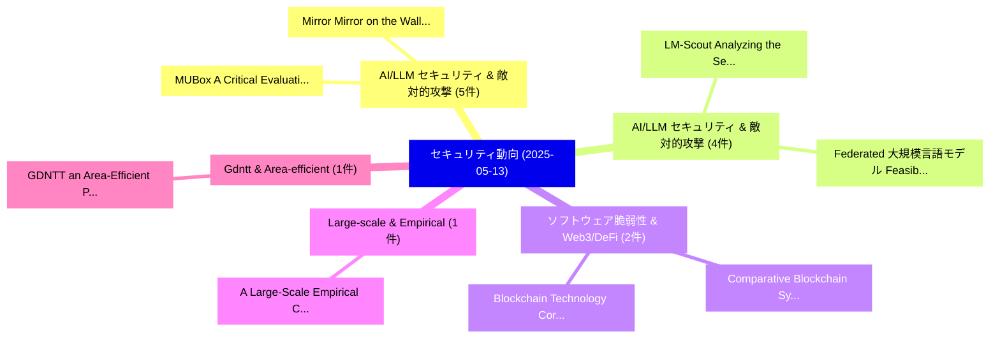

# 📅 02_daily: 日次エグゼクティブサマリー報告書 (2025-05-13)

**集計日時**: 2026-10-02 23:05:25 UTC  
**対象日付**: 2025-05-13  
**本日収集論文数**: 29 件  

---

## 💡 主要セキュリティ動向・脅威インサイト (Executive Insights)

本日の収集論文（計 29 件）において、以下の重点セキュリティ領域で活発な研究動向が確認されました：
- **AI/LLM セキュリティ & 敵対的攻撃** (5 件): 注目論文として 「Mirror Mirror on the Wall, Hav...」、「MUBox: A Critical Evaluation F...」 等が発表され、実務防御および攻撃検証の進展が見られます。
- **AI/LLM セキュリティ & 敵対的攻撃** (4 件): 注目論文として 「LM-Scout: Analyzing the Securi...」、「Federated 大規模言語モデル: Feasibilit...」 等が発表され、実務防御および攻撃検証の進展が見られます。
- **ソフトウェア脆弱性 & Web3/DeFi** (2 件): 注目論文として 「Comparative Blockchain Systems...」、「Blockchain Technology: Core Me...」 等が発表され、実務防御および攻撃検証の進展が見られます。
- **Large-scale & Empirical** (1 件): 注目論文として 「A Large-Scale Empirical Custom...」 等が発表され、実務防御および攻撃検証の進展が見られます。
- **Gdntt & Area-efficient** (1 件): 注目論文として 「GDNTT: an Area-Efficient Paral...」 等が発表され、実務防御および攻撃検証の進展が見られます。

### 🗺️ 技術・脅威トピックマインドマップ

---

## 📌 日次セキュリティ論文一覧 (日本語表形式)

| No | arXiv ID | 論文タイトル (日本語訳) | 重要キーワード | 構造化エグゼクティブ要約 (背景・提案・影響) | 脅威分類 | 詳細リンク |
|---|---|---|---|---|---|---|
| 1 | `2505.08138v1` | [Mirror Mirror on the Wall, Have I Forgotten it All? A New Framework for Evaluating Machine Unlearning（セキュリティ分析論文）](../../okf/papers/2025-05-13/2505.08138.md) | `Evaluating Machine Unlearning`, `Mirror Mirror`, `Brennon Brimhall` | 【提案】A New Framework for Evaluating Machine Unlearning ### (日本語題名: Mirror Mirror on the Wall...。実証評価により経営層・セキュリティ管理者向け推奨アクション (E... | `cs.CR` | [arXiv](https://arxiv.org/abs/2505.08138v1) &#124; [OKF](../../okf/papers/2025-05-13/2505.08138.md) |
| 2 | `2505.08148v1` | [A Large-Scale Empirical Custom GPTs' Vulnerabilities in the OpenAI Ecosystemの分析](../../okf/papers/2025-05-13/2505.08148.md) | `Large-Scale Empirical`, `Scale Empirical Custom`, `Benjamin Zi Hao Zhao` | 【提案】概要 (Overview & Key Finding) 本論文「A Large-Scale Empirical Custom GPTs' Vulnerabilities in...。実証評価により経営層・セキュリティ管理者向け推奨アクション (E... | `cs.CR` | [arXiv](https://arxiv.org/abs/2505.08148v1) &#124; [OKF](../../okf/papers/2025-05-13/2505.08148.md) |
| 3 | `2505.08162v1` | [GDNTT: an Area-Efficient Parallel NTT Accelerator Using Glitch-Driven Near-Memory Computing and Reconfigurable 10T SRAM（セキュリティ分析論文）](../../okf/papers/2025-05-13/2505.08162.md) | `Accelerator Using Glitch`, `Efficient Parallel`, `Driven Near` | 【提案】概要 (Overview & Key Finding) 本論文「GDNTT: an Area-Efficient Parallel NTT Accelerator Using...。実証評価により経営層・セキュリティ管理者向け推奨アクション (E... | `cs.CR` | [arXiv](https://arxiv.org/abs/2505.08162v1) &#124; [OKF](../../okf/papers/2025-05-13/2505.08162.md) |
| 4 | `2505.08204v1` | [LM-Scout: Analyzing the Security of Language Model Integration in Android Apps（セキュリティ分析論文）](../../okf/papers/2025-05-13/2505.08204.md) | `Language Model Integration`, `Android Apps`, `Muhammad Ibrahim` | 【提案】概要 (Overview & Key Finding) 本論文「LM-Scout: Analyzing the Security of Language Model Inte...。実証評価により経営層・セキュリティ管理者向け推奨アクション (E... | `cs.CR` | [arXiv](https://arxiv.org/abs/2505.08204v1) &#124; [OKF](../../okf/papers/2025-05-13/2505.08204.md) |
| 5 | `2505.08209v1` | [ABAC Lab: An Interactive Platform for Attribute-based Access Control Policy Analysis, Tools, and Datasets（セキュリティ分析論文）](../../okf/papers/2025-05-13/2505.08209.md) | `Attribute-based Access`, `Thang Bui`, `Anthony Matricia` | 【提案】概要 (Overview & Key Finding) 本論文「ABAC Lab: An Interactive Platform for Attribute-based ア...。実証評価により経営層・セキュリティ管理者向け推奨アクション (E... | `cs.CR` | [arXiv](https://arxiv.org/abs/2505.08209v1) &#124; [OKF](../../okf/papers/2025-05-13/2505.08209.md) |
| 6 | `2505.08234v1` | [Removing Watermarks with Partial Regeneration using Semantic Information（セキュリティ分析論文）](../../okf/papers/2025-05-13/2505.08234.md) | `Removing Watermarks`, `Partial Regeneration`, `Semantic Information` | 【提案】概要 (Overview & Key Finding) 本論文「Removing Watermarks with Partial Regeneration using Sem...。実証評価により経営層・セキュリティ管理者向け推奨アクション (E... | `cs.CR` | [arXiv](https://arxiv.org/abs/2505.08234v1) &#124; [OKF](../../okf/papers/2025-05-13/2505.08234.md) |
| 7 | `2505.08237v1` | [Privacy-Preserving Analytics for Smart Meter (AMI) Data: A Hybrid Approach to Comply with CPUC Privacy Regulations（セキュリティ分析論文）](../../okf/papers/2025-05-13/2505.08237.md) | `Preserving Analytics`, `Smart Meter`, `Privacy-Preserving Analytics` | 【提案】概要 (Overview & Key Finding) 本論文「Privacy-Preserving Analytics for Smart Meter (AMI) Data...。実証評価により経営層・セキュリティ管理者向け推奨アクション (E... | `cs.CR` | [arXiv](https://arxiv.org/abs/2505.08237v1) &#124; [OKF](../../okf/papers/2025-05-13/2505.08237.md) |
| 8 | `2505.08255v1` | [Where the Devil Hides: Deepfake Detectors Can No Longer Be Trusted（セキュリティ分析論文）](../../okf/papers/2025-05-13/2505.08255.md) | `Devil Hides`, `Shuaiwei Yuan`, `Junyu Dong` | 【提案】背景とセキュリティ上の課題 (Background & Problem) 本研究はサイバー脅威環境におけるセキュリティ構造・脆弱性の検証を目的としています。(主要検出項目: ...。実証評価により経営層・セキュリティ管理者向け推奨アクション (E... | `cs.CR` | [arXiv](https://arxiv.org/abs/2505.08255v1) &#124; [OKF](../../okf/papers/2025-05-13/2505.08255.md) |
| 9 | `2505.08292v1` | [On the Account Security Risks Posed by Password Strength Meters（セキュリティ分析論文）](../../okf/papers/2025-05-13/2505.08292.md) | `Account Security Risks Posed`, `Password Strength Meters`, `Jin Song Dong` | 【提案】概要 (Overview & Key Finding) 本論文「On the Account Security Risks Posed by Password Strengt...。実証評価により経営層・セキュリティ管理者向け推奨アクション (E... | `cs.CR` | [arXiv](https://arxiv.org/abs/2505.08292v1) &#124; [OKF](../../okf/papers/2025-05-13/2505.08292.md) |
| 10 | `2505.08541v1` | [Area Comparison of CHERIoT and PMP in Ibex（セキュリティ分析論文）](../../okf/papers/2025-05-13/2505.08541.md) | `Area Comparison`, `Samuel Riedel`, `John Thomson` | 【提案】概要 (Overview & Key Finding) 本論文「Area Comparison of CHERIoT and PMP in Ibex（セキュリティ分析論文）」...。実証評価により経営層・セキュリティ管理者向け推奨アクション (E... | `cs.CR` | [arXiv](https://arxiv.org/abs/2505.08541v1) &#124; [OKF](../../okf/papers/2025-05-13/2505.08541.md) |
| 11 | `2505.08544v1` | [ROSA: Finding Backdoors with Fuzzing（セキュリティ分析論文）](../../okf/papers/2025-05-13/2505.08544.md) | `Finding Backdoors`, `Dimitri Kokkonis`, `Emilien Decoux` | 【提案】概要 (Overview & Key Finding) 本論文「ROSA: Finding Backdoors with Fuzzing（セキュリティ分析論文）」（原題: R...。実証評価により経営層・セキュリティ管理者向け推奨アクション (E... | `cs.CR` | [arXiv](https://arxiv.org/abs/2505.08544v1) &#124; [OKF](../../okf/papers/2025-05-13/2505.08544.md) |
| 12 | `2505.08576v1` | [MUBox: A Critical Evaluation Framework of Deep Machine Unlearning（セキュリティ分析論文）](../../okf/papers/2025-05-13/2505.08576.md) | `Deep Machine Unlearning`, `Xiang Li`, `Bhavani Thuraisingham` | 【提案】概要 (Overview & Key Finding) 本論文「MUBox: A Critical Evaluation Framework of Deep Machine ...。実証評価により経営層・セキュリティ管理者向け推奨アクション (E... | `cs.CR` | [arXiv](https://arxiv.org/abs/2505.08576v1) &#124; [OKF](../../okf/papers/2025-05-13/2505.08576.md) |
| 13 | `2505.08596v1` | [Information Leakage in Data Linkage（セキュリティ分析論文）](../../okf/papers/2025-05-13/2505.08596.md) | `Information Leakage`, `Data Linkage`, `Peter Christen` | 【提案】概要 (Overview & Key Finding) 本論文「Information Leakage in Data Linkage（セキュリティ分析論文）」（原題: In...。実証評価により経営層・セキュリティ管理者向け推奨アクション (E... | `cs.CR` | [arXiv](https://arxiv.org/abs/2505.08596v1) &#124; [OKF](../../okf/papers/2025-05-13/2505.08596.md) |
| 14 | `2505.08650v1` | [Cryptologic Techniques and Associated Risks in Public and Private Security. An Italian and European Union Perspective with an Overview of the Current Legal Framework（セキュリティ分析論文）](../../okf/papers/2025-05-13/2505.08650.md) | `European Union Perspective`, `Cryptologic Techniques`, `Associated Risks` | 【提案】An Italian and European Union Perspective with an Overview of the Current Legal Framewo...。実証評価により経営層・セキュリティ管理者向け推奨アクション (E... | `cs.CR` | [arXiv](https://arxiv.org/abs/2505.08650v1) &#124; [OKF](../../okf/papers/2025-05-13/2505.08650.md) |
| 15 | `2505.08652v1` | [Comparative Blockchain Systemsの分析](../../okf/papers/2025-05-13/2505.08652.md) | `Blockchain Systems`, `Comparative Blockchain`, `Jiaqi Huang` | 【提案】概要 (Overview & Key Finding) 本論文「Comparative Blockchain Systemsの分析」（原題: Comparative Anal...。実証評価により経営層・セキュリティ管理者向け推奨アクション (E... | `cs.CR` | [arXiv](https://arxiv.org/abs/2505.08652v1) &#124; [OKF](../../okf/papers/2025-05-13/2505.08652.md) |
| 16 | `2505.08728v2` | [RAG: A Risk Assessment and Mitigation Frameworkのセキュリティ強化](../../okf/papers/2025-05-13/2505.08728.md) | `Risk Assessment`, `Lukas Ammann`, `Sara Ott` | 【提案】概要 (Overview & Key Finding) 本論文「RAG: A Risk Assessment and Mitigation Frameworkのセキュリティ強...。実証評価によりLehmann - **公開日時**: `2025... | `cs.CR` | [arXiv](https://arxiv.org/abs/2505.08728v2) &#124; [OKF](../../okf/papers/2025-05-13/2505.08728.md) |
| 17 | `2505.08771v2` | [Kudzu: Fast and Simple High-Throughput BFT（セキュリティ分析論文）](../../okf/papers/2025-05-13/2505.08771.md) | `Simple High`, `High-Throughput BFT`, `Victor Shoup` | 【提案】概要 (Overview & Key Finding) 本論文「Kudzu: Fast and Simple High-Throughput BFT（セキュリティ分析論文）」...。実証評価により経営層・セキュリティ管理者向け推奨アクション (E... | `cs.CR` | [arXiv](https://arxiv.org/abs/2505.08771v2) &#124; [OKF](../../okf/papers/2025-05-13/2505.08771.md) |
| 18 | `2505.08772v1` | [Blockchain Technology: Core Mechanisms, Evolution, and Future Implementation Challenges（セキュリティ分析論文）](../../okf/papers/2025-05-13/2505.08772.md) | `Future Implementation Challenges`, `Blockchain Technology`, `Core Mechanisms` | 【提案】概要 (Overview & Key Finding) 本論文「Blockchain Technology: Core Mechanisms, Evolution, and ...。実証評価により経営層・セキュリティ管理者向け推奨アクション (E... | `cs.CR` | [arXiv](https://arxiv.org/abs/2505.08772v1) &#124; [OKF](../../okf/papers/2025-05-13/2505.08772.md) |
| 19 | `2505.08830v1` | [Federated 大規模言語モデル: Feasibility, Robustness, Security and Future Directions](../../okf/papers/2025-05-13/2505.08830.md) | `Future Directions`, `Federated Large Language Models`, `Wenhao Jiang` | 【提案】概要 (Overview & Key Finding) 本論文「Federated 大規模言語モデル: Feasibility, Robustness, Security a...。実証評価により経営層・セキュリティ管理者向け推奨アクション (E... | `cs.CR` | [arXiv](https://arxiv.org/abs/2505.08830v1) &#124; [OKF](../../okf/papers/2025-05-13/2505.08830.md) |
| 20 | `2505.08835v1` | [Robustness Analysis against Adversarial Patch Attacks in Fully Unmanned Stores（セキュリティ分析論文）](../../okf/papers/2025-05-13/2505.08835.md) | `Adversarial Patch Attacks`, `Fully Unmanned Stores`, `Hyunsik Na` | 【提案】概要 (Overview & Key Finding) 本論文「Robustness Analysis against Adversarial Patch Attacks i...。実証評価により経営層・セキュリティ管理者向け推奨アクション (E... | `cs.CR` | [arXiv](https://arxiv.org/abs/2505.08835v1) &#124; [OKF](../../okf/papers/2025-05-13/2505.08835.md) |
| 21 | `2505.08837v1` | [Adaptive Security Policy Management in Cloud Environments Using Reinforcement Learning（セキュリティ分析論文）](../../okf/papers/2025-05-13/2505.08837.md) | `Cloud Environments Using Reinforcement Learning`, `Adaptive Security Policy Management`, `Muhammad Saqib` | 【提案】概要 (Overview & Key Finding) 本論文「Adaptive Security Policy Management in Cloud Environmen...。実証評価により経営層・セキュリティ管理者向け推奨アクション (E... | `cs.CR` | [arXiv](https://arxiv.org/abs/2505.08837v1) &#124; [OKF](../../okf/papers/2025-05-13/2505.08837.md) |
| 22 | `2505.08840v1` | [Lightweight Hybrid Block-Stream Cryptographic Algorithm for the Internet of Things（セキュリティ分析論文）](../../okf/papers/2025-05-13/2505.08840.md) | `Lightweight Hybrid Block`, `Stream Cryptographic Algorithm`, `Block-Stream Cryptographic` | 【提案】概要 (Overview & Key Finding) 本論文「Lightweight Hybrid Block-Stream Cryptographic Algorithm...。実証評価により経営層・セキュリティ管理者向け推奨アクション (E... | `cs.CR` | [arXiv](https://arxiv.org/abs/2505.08840v1) &#124; [OKF](../../okf/papers/2025-05-13/2505.08840.md) |
| 23 | `2505.08842v2` | [LibVulnWatch: A Deep Assessment Agent System and Leaderboard for Uncovering Hidden Vulnerabilities in Open-Source AI Libraries（セキュリティ分析論文）](../../okf/papers/2025-05-13/2505.08842.md) | `Deep Assessment Agent System`, `Uncovering Hidden Vulnerabilities`, `Open-Source AI` | 【提案】概要 (Overview & Key Finding) 本論文「LibVulnWatch: A Deep Assessment Agent System and Leader...。実証評価により経営層・セキュリティ管理者向け推奨アクション (E... | `cs.CR` | [arXiv](https://arxiv.org/abs/2505.08842v2) &#124; [OKF](../../okf/papers/2025-05-13/2505.08842.md) |
| 24 | `2505.08847v1` | [On the interplay of Explainability, Privacy and Predictive Performance with Explanation-assisted Model Extraction（セキュリティ分析論文）](../../okf/papers/2025-05-13/2505.08847.md) | `Predictive Performance`, `Model Extraction`, `Explanation-assisted Model` | 【提案】概要 (Overview & Key Finding) 本論文「On the interplay of Explainability, Privacy and Predict...。実証評価により経営層・セキュリティ管理者向け推奨アクション (E... | `cs.CR` | [arXiv](https://arxiv.org/abs/2505.08847v1) &#124; [OKF](../../okf/papers/2025-05-13/2505.08847.md) |
| 25 | `2505.08849v1` | [Improved Algorithms for Differentially Private Language Model Alignment（セキュリティ分析論文）](../../okf/papers/2025-05-13/2505.08849.md) | `Differentially Private Language Model Alignment`, `Improved Algorithms`, `Keyu Chen` | 【提案】概要 (Overview & Key Finding) 本論文「Improved Algorithms for Differentially Private Language...。実証評価により経営層・セキュリティ管理者向け推奨アクション (E... | `cs.CR` | [arXiv](https://arxiv.org/abs/2505.08849v1) &#124; [OKF](../../okf/papers/2025-05-13/2505.08849.md) |
| 26 | `2505.08878v1` | [Optimized Couplings for Watermarking 大規模言語モデル](../../okf/papers/2025-05-13/2505.08878.md) | `Optimized Couplings`, `Watermarking Large Language Models`, `Carol Xuan Long` | 【提案】概要 (Overview & Key Finding) 本論文「Optimized Couplings for Watermarking 大規模言語モデル」（原題: Opti...。実証評価によりCalmon - **公開日時**: `2025-... | `cs.CR` | [arXiv](https://arxiv.org/abs/2505.08878v1) &#124; [OKF](../../okf/papers/2025-05-13/2505.08878.md) |
| 27 | `2505.08964v1` | [GPML: Graph Processing for Machine Learning（セキュリティ分析論文）](../../okf/papers/2025-05-13/2505.08964.md) | `Graph Processing`, `Machine Learning`, `Majed Jaber` | 【提案】概要 (Overview & Key Finding) 本論文「GPML: Graph Processing for Machine Learning（セキュリティ分析論文）...。実証評価により経営層・セキュリティ管理者向け推奨アクション (E... | `cs.CR` | [arXiv](https://arxiv.org/abs/2505.08964v1) &#124; [OKF](../../okf/papers/2025-05-13/2505.08964.md) |
| 28 | `2505.08978v1` | [Inference Attacks for X-Vector Speaker Anonymization（セキュリティ分析論文）](../../okf/papers/2025-05-13/2505.08978.md) | `Vector Speaker Anonymization`, `Inference Attacks`, `X-Vector Speaker` | 【提案】概要 (Overview & Key Finding) 本論文「Inference Attacks for X-Vector Speaker Anonymization（セキ...。実証評価により経営層・セキュリティ管理者向け推奨アクション (E... | `cs.CR` | [arXiv](https://arxiv.org/abs/2505.08978v1) &#124; [OKF](../../okf/papers/2025-05-13/2505.08978.md) |
| 29 | `2505.09002v1` | [SAFE-SiP: Secure Authentication Framework for System-in-Package Using Multi-party Computation（セキュリティ分析論文）](../../okf/papers/2025-05-13/2505.09002.md) | `Package Using Multi`, `Multi-party Computation`, `Ishraq Tashdid` | 【提案】概要 (Overview & Key Finding) 本論文「SAFE-SiP: Secure Authentication Framework for System-in...。実証評価により経営層・セキュリティ管理者向け推奨アクション (E... | `cs.CR` | [arXiv](https://arxiv.org/abs/2505.09002v1) &#124; [OKF](../../okf/papers/2025-05-13/2505.09002.md) |

