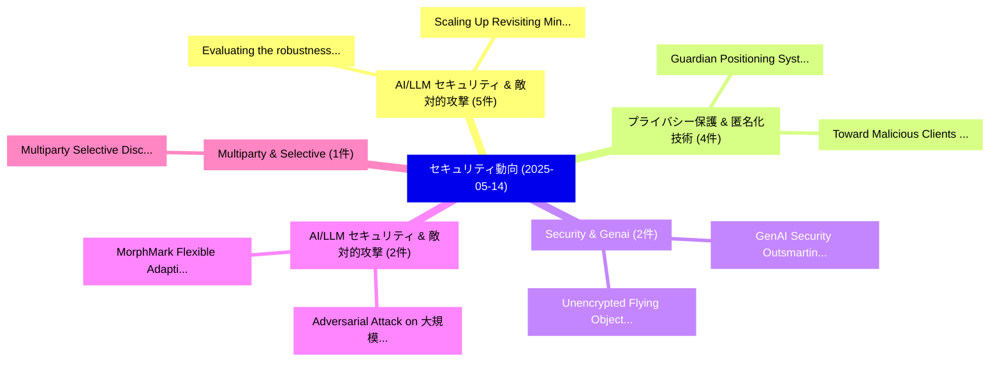

# 📅 02_daily: 日次エグゼクティブサマリー報告書 (2025-05-14)

**集計日時**: 2026-10-02 23:05:25 UTC  
**対象日付**: 2025-05-14  
**本日収集論文数**: 24 件  

---

## 💡 主要セキュリティ動向・脅威インサイト (Executive Insights)

本日の収集論文（計 24 件）において、以下の重点セキュリティ領域で活発な研究動向が確認されました：
- **AI/LLM セキュリティ & 敵対的攻撃** (5 件): 注目論文として 「Evaluating the robustness of a...」、「Scaling Up: Revisiting Mining ...」 等が発表され、実務防御および攻撃検証の進展が見られます。
- **プライバシー保護 & 匿名化技術** (4 件): 注目論文として 「Toward Malicious Clients Detec...」、「Guardian Positioning System (G...」 等が発表され、実務防御および攻撃検証の進展が見られます。
- **Security & Genai** (2 件): 注目論文として 「Unencrypted Flying Objects: Se...」、「GenAI Security: Outsmarting th...」 等が発表され、実務防御および攻撃検証の進展が見られます。
- **AI/LLM セキュリティ & 敵対的攻撃** (2 件): 注目論文として 「Adversarial Attack on 大規模言語モデル...」、「MorphMark: Flexible Adaptive W...」 等が発表され、実務防御および攻撃検証の進展が見られます。
- **Multiparty & Selective** (1 件): 注目論文として 「Multiparty Selective Disclosur...」 等が発表され、実務防御および攻撃検証の進展が見られます。

### 🗺️ 技術・脅威トピックマインドマップ

---

## 📌 日次セキュリティ論文一覧 (日本語表形式)

| No | arXiv ID | 論文タイトル (日本語訳) | 重要キーワード | 構造化エグゼクティブ要約 (背景・提案・影響) | 脅威分類 | 詳細リンク |
|---|---|---|---|---|---|---|
| 1 | `2505.09034v1` | [Multiparty Selective Disclosure using Attribute-Based Encryption（セキュリティ分析論文）](../../okf/papers/2025-05-14/2505.09034.md) | `Multiparty Selective Disclosure`, `Based Encryption`, `Attribute-Based Encryption` | 【提案】概要 (Overview & Key Finding) 本論文「Multiparty Selective Disclosure using Attribute-Based E...。実証評価により経営層・セキュリティ管理者向け推奨アクション (E... | `cs.CR` | [arXiv](https://arxiv.org/abs/2505.09034v1) &#124; [OKF](../../okf/papers/2025-05-14/2505.09034.md) |
| 2 | `2505.09038v1` | [Unencrypted Flying Objects: Security Lessons from University Small Satellite Developers and Their Code（セキュリティ分析論文）](../../okf/papers/2025-05-14/2505.09038.md) | `Unencrypted Flying Objects`, `University Small Satellite Developers`, `Security Lessons` | 【提案】概要 (Overview & Key Finding) 本論文「Unencrypted Flying Objects: Security Lessons from Unive...。実証評価により経営層・セキュリティ管理者向け推奨アクション (E... | `cs.CR` | [arXiv](https://arxiv.org/abs/2505.09038v1) &#124; [OKF](../../okf/papers/2025-05-14/2505.09038.md) |
| 3 | `2505.09048v1` | [Modeling Interdependent サイバーセキュリティ Threats Using Bayesian Networks: A Case Study on In-Vehicle Infotainment Systems](../../okf/papers/2025-05-14/2505.09048.md) | `Vehicle Infotainment Systems`, `In-Vehicle Infotainment`, `Threats Using Bayesian Networks` | 【提案】概要 (Overview & Key Finding) 本論文「Modeling Interdependent サイバーセキュリティ Threats Using Bayesi...。実証評価により経営層・セキュリティ管理者向け推奨アクション (E... | `cs.CR` | [arXiv](https://arxiv.org/abs/2505.09048v1) &#124; [OKF](../../okf/papers/2025-05-14/2505.09048.md) |
| 4 | `2505.09110v2` | [Toward Malicious Clients Detection in 連合学習](../../okf/papers/2025-05-14/2505.09110.md) | `Toward Malicious Clients Detection`, `Federated Learning`, `Zhihao Dou` | 【提案】概要 (Overview & Key Finding) 本論文「Toward Malicious Clients Detection in 連合学習」（原題: Toward ...。実証評価により経営層・セキュリティ管理者向け推奨アクション (E... | `cs.CR` | [arXiv](https://arxiv.org/abs/2505.09110v2) &#124; [OKF](../../okf/papers/2025-05-14/2505.09110.md) |
| 5 | `2505.09221v1` | [P4 Programs by Information Flow Controlのセキュリティ強化](../../okf/papers/2025-05-14/2505.09221.md) | `Securing P4 Programs`, `Information Flow Control`, `P4 Programs` | 【提案】概要 (Overview & Key Finding) 本論文「P4 Programs by Information Flow Controlのセキュリティ強化」（原題: S...。実証評価によりAhmadian, Musard Balliu, ... | `cs.CR` | [arXiv](https://arxiv.org/abs/2505.09221v1) &#124; [OKF](../../okf/papers/2025-05-14/2505.09221.md) |
| 6 | `2505.09261v1` | [Instantiating Standards: Enabling Standard-Driven Text TTP Extraction with Evolvable Memory（セキュリティ分析論文）](../../okf/papers/2025-05-14/2505.09261.md) | `Instantiating Standards`, `Enabling Standard`, `Driven Text` | 【提案】概要 (Overview & Key Finding) 本論文「Instantiating Standards: Enabling Standard-Driven Text ...。実証評価により経営層・セキュリティ管理者向け推奨アクション (E... | `cs.CR` | [arXiv](https://arxiv.org/abs/2505.09261v1) &#124; [OKF](../../okf/papers/2025-05-14/2505.09261.md) |
| 7 | `2505.09276v1` | [Privacy-Preserving Runtime Verification（セキュリティ分析論文）](../../okf/papers/2025-05-14/2505.09276.md) | `Preserving Runtime Verification`, `Privacy-Preserving Runtime`, `Mahyar Karimi` | 【提案】概要 (Overview & Key Finding) 本論文「Privacy-Preserving Runtime Verification（セキュリティ分析論文）」（原題...。実証評価によりThejaswini - **公開日時**: `2... | `cs.CR` | [arXiv](https://arxiv.org/abs/2505.09276v1) &#124; [OKF](../../okf/papers/2025-05-14/2505.09276.md) |
| 8 | `2505.09313v1` | [Detecting Sybil Addresses in Blockchain Airdrops: A Subgraph-based Feature Propagation and Fusion Approach（セキュリティ分析論文）](../../okf/papers/2025-05-14/2505.09313.md) | `Detecting Sybil Addresses`, `Blockchain Airdrops`, `Feature Propagation` | 【提案】概要 (Overview & Key Finding) 本論文「Detecting Sybil Addresses in Blockchain Airdrops: A Sub...。実証評価により経営層・セキュリティ管理者向け推奨アクション (E... | `cs.CR` | [arXiv](https://arxiv.org/abs/2505.09313v1) &#124; [OKF](../../okf/papers/2025-05-14/2505.09313.md) |
| 9 | `2505.09342v2` | [Evaluating the robustness of adversarial defenses in マルウェア検出 systems](../../okf/papers/2025-05-14/2505.09342.md) | `Mostafa Jafari`, `Alireza Shameli`, `Raw Meta` | 【提案】概要 (Overview & Key Finding) 本論文「Evaluating the robustness of adversarial defenses in マル...。実証評価により経営層・セキュリティ管理者向け推奨アクション (E... | `cs.CR` | [arXiv](https://arxiv.org/abs/2505.09342v2) &#124; [OKF](../../okf/papers/2025-05-14/2505.09342.md) |
| 10 | `2505.09374v1` | [DNS Query Forgery: A Client-Side Defense Against Mobile App Traffic Profiling（セキュリティ分析論文）](../../okf/papers/2025-05-14/2505.09374.md) | `Query Forgery`, `Client-Side Defense`, `Andrea Jimenez` | 【提案】概要 (Overview & Key Finding) 本論文「DNS Query Forgery: A Client-Side Defense Against Mobile...。実証評価により経営層・セキュリティ管理者向け推奨アクション (E... | `cs.CR` | [arXiv](https://arxiv.org/abs/2505.09374v1) &#124; [OKF](../../okf/papers/2025-05-14/2505.09374.md) |
| 11 | `2505.09384v1` | [CANTXSec: A Deterministic Intrusion Detection and Prevention System for CAN Bus Monitoring ECU Activations（セキュリティ分析論文）](../../okf/papers/2025-05-14/2505.09384.md) | `Deterministic Intrusion Detection`, `Prevention System`, `Bus Monitoring` | 【提案】概要 (Overview & Key Finding) 本論文「CANTXSec: A Deterministic Intrusion Detection and Preve...。実証評価により経営層・セキュリティ管理者向け推奨アクション (E... | `cs.CR` | [arXiv](https://arxiv.org/abs/2505.09384v1) &#124; [OKF](../../okf/papers/2025-05-14/2505.09384.md) |
| 12 | `2505.09501v1` | [Scaling Up: Revisiting Mining Android Sandboxes at Scale for Malware Classification（セキュリティ分析論文）](../../okf/papers/2025-05-14/2505.09501.md) | `Revisiting Mining Android Sandboxes`, `Malware Classification`, `Francisco Costa` | 【提案】概要 (Overview & Key Finding) 本論文「Scaling Up: Revisiting Mining Android Sandboxes at Scal...。実証評価により経営層・セキュリティ管理者向け推奨アクション (E... | `cs.CR` | [arXiv](https://arxiv.org/abs/2505.09501v1) &#124; [OKF](../../okf/papers/2025-05-14/2505.09501.md) |
| 13 | `2505.09602v1` | [Adversarial Suffix Filtering: a Defense Pipeline for LLMs（セキュリティ分析論文）](../../okf/papers/2025-05-14/2505.09602.md) | `Adversarial Suffix Filtering`, `Defense Pipeline`, `David Khachaturov` | 【提案】概要 (Overview & Key Finding) 本論文「Adversarial Suffix Filtering: a Defense Pipeline for LL...。実証評価により経営層・セキュリティ管理者向け推奨アクション (E... | `cs.CR` | [arXiv](https://arxiv.org/abs/2505.09602v1) &#124; [OKF](../../okf/papers/2025-05-14/2505.09602.md) |
| 14 | `2505.09733v1` | [Robust 連合学習 with Confidence-Weighted Filtering and GAN-Based Completion under Noisy and Incomplete Data](../../okf/papers/2025-05-14/2505.09733.md) | `Weighted Filtering`, `Based Completion`, `Incomplete Data` | 【提案】概要 (Overview & Key Finding) 本論文「Robust 連合学習 with Confidence-Weighted Filtering and GAN-...。実証評価により経営層・セキュリティ管理者向け推奨アクション (E... | `cs.CR` | [arXiv](https://arxiv.org/abs/2505.09733v1) &#124; [OKF](../../okf/papers/2025-05-14/2505.09733.md) |
| 15 | `2505.09743v1` | [Guardian Positioning System (GPS) for Location Based Services（セキュリティ分析論文）](../../okf/papers/2025-05-14/2505.09743.md) | `Guardian Positioning System`, `Location Based Services`, `Wenjie Liu` | 【提案】概要 (Overview & Key Finding) 本論文「Guardian Positioning System (GPS) for Location Based Se...。実証評価により経営層・セキュリティ管理者向け推奨アクション (E... | `cs.CR` | [arXiv](https://arxiv.org/abs/2505.09743v1) &#124; [OKF](../../okf/papers/2025-05-14/2505.09743.md) |
| 16 | `2505.09820v1` | [Adversarial Attack on 大規模言語モデル using Exponentiated Gradient Descent](../../okf/papers/2025-05-14/2505.09820.md) | `Exponentiated Gradient Descent`, `Adversarial Attack`, `Large Language Models` | 【提案】概要 (Overview & Key Finding) 本論文「敵対的攻撃 on 大規模言語モデル using Exponentiated Gradient Descent」...。実証評価により経営層・セキュリティ管理者向け推奨アクション (E... | `cs.CR` | [arXiv](https://arxiv.org/abs/2505.09820v1) &#124; [OKF](../../okf/papers/2025-05-14/2505.09820.md) |
| 17 | `2505.09843v1` | [Automated Alert Classification and Triage (AACT): An Intelligent System for the Prioritisation of サイバーセキュリティ Alerts](../../okf/papers/2025-05-14/2505.09843.md) | `Automated Alert Classification`, `Cybersecurity Alerts`, `Melissa Turcotte` | 【提案】概要 (Overview & Key Finding) 本論文「Automated Alert Classification and Triage (AACT): An In...。実証評価により経営層・セキュリティ管理者向け推奨アクション (E... | `cs.CR` | [arXiv](https://arxiv.org/abs/2505.09843v1) &#124; [OKF](../../okf/papers/2025-05-14/2505.09843.md) |
| 18 | `2505.10585v1` | [Efficient Malicious UAV Detection Using Autoencoder-TSMamba Integration（セキュリティ分析論文）](../../okf/papers/2025-05-14/2505.10585.md) | `Detection Using Autoencoder`, `Efficient Malicious`, `Autoencoder-TSMamba Integration` | 【提案】概要 (Overview & Key Finding) 本論文「Efficient Malicious UAV Detection Using Autoencoder-TSM...。実証評価により経営層・セキュリティ管理者向け推奨アクション (E... | `cs.CR` | [arXiv](https://arxiv.org/abs/2505.10585v1) &#124; [OKF](../../okf/papers/2025-05-14/2505.10585.md) |
| 19 | `2505.11532v2` | [Revisiting Adversarial Perception Attacks and Defense Methods on Autonomous Driving Systems（セキュリティ分析論文）](../../okf/papers/2025-05-14/2505.11532.md) | `Revisiting Adversarial Perception Attacks`, `Autonomous Driving Systems`, `Defense Methods` | 【提案】概要 (Overview & Key Finding) 本論文「Revisiting Adversarial Perception Attacks and Defense M...。実証評価により経営層・セキュリティ管理者向け推奨アクション (E... | `cs.CR` | [arXiv](https://arxiv.org/abs/2505.11532v2) &#124; [OKF](../../okf/papers/2025-05-14/2505.11532.md) |
| 20 | `2505.11541v2` | [MorphMark: Flexible Adaptive Watermarking for 大規模言語モデル](../../okf/papers/2025-05-14/2505.11541.md) | `Flexible Adaptive Watermarking`, `Large Language Models`, `Zongqi Wang` | 【提案】概要 (Overview & Key Finding) 本論文「MorphMark: Flexible Adaptive Watermarking for 大規模言語モデル」...。実証評価により経営層・セキュリティ管理者向け推奨アクション (E... | `cs.CR` | [arXiv](https://arxiv.org/abs/2505.11541v2) &#124; [OKF](../../okf/papers/2025-05-14/2505.11541.md) |
| 21 | `2505.11542v2` | [サイバーセキュリティ threat detection based on a UEBA framework using Deep Autoencoders](../../okf/papers/2025-05-14/2505.11542.md) | `Deep Autoencoders`, `Jose Fuentes`, `Ines Ortega` | 【提案】概要 (Overview & Key Finding) 本論文「サイバーセキュリティ 脅威 detection based on a UEBA framework using...。実証評価により経営層・セキュリティ管理者向け推奨アクション (E... | `cs.CR` | [arXiv](https://arxiv.org/abs/2505.11542v2) &#124; [OKF](../../okf/papers/2025-05-14/2505.11542.md) |
| 22 | `2505.13493v1` | [Optimizing DDoS Detection in SDNs Through Machine Learning Models（セキュリティ分析論文）](../../okf/papers/2025-05-14/2505.13493.md) | `Sayed Md Fazle Rabbi`, `Ahsan Habib Siam`, `Ehsanul Haque` | 【提案】概要 (Overview & Key Finding) 本論文「Optimizing DDoS Detection in SDNs Through Machine Learn...。実証評価によりShafiqul Alam, Ahsan Habi... | `cs.CR` | [arXiv](https://arxiv.org/abs/2505.13493v1) &#124; [OKF](../../okf/papers/2025-05-14/2505.13493.md) |
| 23 | `2505.18172v1` | [GenAI Security: Outsmarting the Bots with a Proactive Testing Framework（セキュリティ分析論文）](../../okf/papers/2025-05-14/2505.18172.md) | `Sunil Kumar Jang Bahadur`, `Gopala Dhar`, `Lavi Nigam` | 【提案】概要 (Overview & Key Finding) 本論文「GenAI Security: Outsmarting the Bots with a Proactive T...。実証評価により経営層・セキュリティ管理者向け推奨アクション (E... | `cs.CR` | [arXiv](https://arxiv.org/abs/2505.18172v1) &#124; [OKF](../../okf/papers/2025-05-14/2505.18172.md) |
| 24 | `2507.19484v1` | [the ideals of Self-Recovery and Metadata Privacy in Social Vault Recoveryに向けて](../../okf/papers/2025-05-14/2507.19484.md) | `Metadata Privacy`, `Social Vault Recovery`, `Social Vault` | 【提案】概要 (Overview & Key Finding) 本論文「the ideals of Self-Recovery and Metadata Privacy in Soc...。実証評価により経営層・セキュリティ管理者向け推奨アクション (E... | `cs.CR` | [arXiv](https://arxiv.org/abs/2507.19484v1) &#124; [OKF](../../okf/papers/2025-05-14/2507.19484.md) |

