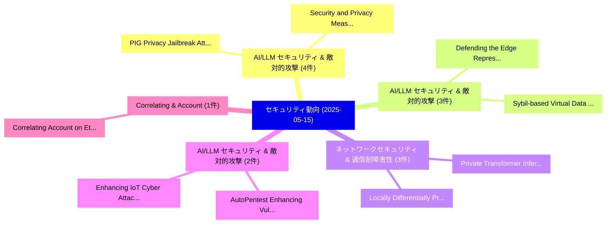

# 📅 02_daily: 日次エグゼクティブサマリー報告書 (2025-05-15)

**集計日時**: 2026-10-02 23:05:26 UTC  
**対象日付**: 2025-05-15  
**本日収集論文数**: 30 件  

---

## 💡 主要セキュリティ動向・脅威インサイト (Executive Insights)

本日の収集論文（計 30 件）において、以下の重点セキュリティ領域で活発な研究動向が確認されました：
- **AI/LLM セキュリティ & 敵対的攻撃** (4 件): 注目論文として 「PIG: Privacy Jailbreak Attack ...」、「Security and Privacy Measureme...」 等が発表され、実務防御および攻撃検証の進展が見られます。
- **AI/LLM セキュリティ & 敵対的攻撃** (3 件): 注目論文として 「Sybil-based Virtual Data Poiso...」、「Defending the Edge: Representa...」 等が発表され、実務防御および攻撃検証の進展が見られます。
- **ネットワークセキュリティ & 通信耐障害性** (3 件): 注目論文として 「Private Transformer Inference ...」、「Locally Differentially Private...」 等が発表され、実務防御および攻撃検証の進展が見られます。
- **AI/LLM セキュリティ & 敵対的攻撃** (2 件): 注目論文として 「AutoPentest: Enhancing Vulnera...」、「Enhancing IoT Cyber Attack Det...」 等が発表され、実務防御および攻撃検証の進展が見られます。
- **Correlating & Account** (1 件): 注目論文として 「Correlating Account on Ethereu...」 等が発表され、実務防御および攻撃検証の進展が見られます。

### 🗺️ 技術・脅威トピックマインドマップ

---

## 📌 日次セキュリティ論文一覧 (日本語表形式)

| No | arXiv ID | 論文タイトル (日本語訳) | 重要キーワード | 構造化エグゼクティブ要約 (背景・提案・影響) | 脅威分類 | 詳細リンク |
|---|---|---|---|---|---|---|
| 1 | `2505.09892v1` | [Correlating Account on Ethereum Mixing Service via Domain-Invariant feature learning（セキュリティ分析論文）](../../okf/papers/2025-05-15/2505.09892.md) | `Ethereum Mixing Service`, `Correlating Account`, `Domain-Invariant feature` | 【提案】概要 (Overview & Key Finding) 本論文「Correlating Account on Ethereum Mixing Service via Doma...。実証評価により経営層・セキュリティ管理者向け推奨アクション (E... | `cs.CR` | [arXiv](https://arxiv.org/abs/2505.09892v1) &#124; [OKF](../../okf/papers/2025-05-15/2505.09892.md) |
| 2 | `2505.09921v2` | [PIG: Privacy Jailbreak Attack on LLMs via Gradient-based Iterative In-Context Optimization（セキュリティ分析論文）](../../okf/papers/2025-05-15/2505.09921.md) | `Privacy Jailbreak Attack`, `Context Optimization`, `Gradient-based Iterative` | 【提案】概要 (Overview & Key Finding) 本論文「PIG: Privacy ジェイルブレイク Attack on LLMs via Gradient-based...。実証評価により経営層・セキュリティ管理者向け推奨アクション (E... | `cs.CR` | [arXiv](https://arxiv.org/abs/2505.09921v2) &#124; [OKF](../../okf/papers/2025-05-15/2505.09921.md) |
| 3 | `2505.09924v2` | [From Trade-off to Synergy: A Versatile Symbiotic Watermarking Framework for 大規模言語モデル](../../okf/papers/2025-05-15/2505.09924.md) | `Large Language Models`, `Yidan Wang`, `Yubing Ren` | 【提案】概要 (Overview & Key Finding) 本論文「From Trade-off to Synergy: A Versatile Symbiotic Waterm...。実証評価により経営層・セキュリティ管理者向け推奨アクション (E... | `cs.CR` | [arXiv](https://arxiv.org/abs/2505.09924v2) &#124; [OKF](../../okf/papers/2025-05-15/2505.09924.md) |
| 4 | `2505.09928v2` | [DeFeed: Secure Decentralized Cross-Contract Data Feed in Web 3.0 for Connected 自動運転車両](../../okf/papers/2025-05-15/2505.09928.md) | `Secure Decentralized Cross`, `Contract Data Feed`, `Cross-Contract Data` | 【提案】概要 (Overview & Key Finding) 本論文「DeFeed: Secure Decentralized Cross-Contract Data Feed i...。実証評価により経営層・セキュリティ管理者向け推奨アクション (E... | `cs.CR` | [arXiv](https://arxiv.org/abs/2505.09928v2) &#124; [OKF](../../okf/papers/2025-05-15/2505.09928.md) |
| 5 | `2505.09929v5` | [Security and Privacy Measurement on Chinese Consumer IoT Traffic based on Device Lifecycle（セキュリティ分析論文）](../../okf/papers/2025-05-15/2505.09929.md) | `Privacy Measurement`, `Chinese Consumer`, `Device Lifecycle` | 【提案】概要 (Overview & Key Finding) 本論文「Security and Privacy Measurement on Chinese Consumer Io...。実証評価により経営層・セキュリティ管理者向け推奨アクション (E... | `cs.CR` | [arXiv](https://arxiv.org/abs/2505.09929v5) &#124; [OKF](../../okf/papers/2025-05-15/2505.09929.md) |
| 6 | `2505.09974v2` | [Analysing Safety Risks in LLMs Fine-Tuned with Pseudo-Malicious Cyber Security Data（セキュリティ分析論文）](../../okf/papers/2025-05-15/2505.09974.md) | `Malicious Cyber Security Data`, `Analysing Safety Risks`, `Pseudo-Malicious Cyber` | 【提案】概要 (Overview & Key Finding) 本論文「Analysing Safety Risks in LLMs Fine-Tuned with Pseudo-M...。実証評価により経営層・セキュリティ管理者向け推奨アクション (E... | `cs.CR` | [arXiv](https://arxiv.org/abs/2505.09974v2) &#124; [OKF](../../okf/papers/2025-05-15/2505.09974.md) |
| 7 | `2505.09983v1` | [Sybil-based Virtual Data Poisoning Attacks in 連合学習](../../okf/papers/2025-05-15/2505.09983.md) | `Virtual Data Poisoning Attacks`, `Sybil-based Virtual`, `Federated Learning` | 【提案】概要 (Overview & Key Finding) 本論文「Sybil-based Virtual Data Poisoning Attacks in 連合学習」（原題:...。実証評価により経営層・セキュリティ管理者向け推奨アクション (E... | `cs.CR` | [arXiv](https://arxiv.org/abs/2505.09983v1) &#124; [OKF](../../okf/papers/2025-05-15/2505.09983.md) |
| 8 | `2505.10066v1` | [Dark LLMs: The Growing Threat of Unaligned AI Models（セキュリティ分析論文）](../../okf/papers/2025-05-15/2505.10066.md) | `Michael Fire`, `Yitzhak Elbazis`, `Adi Wasenstein` | 【提案】概要 (Overview & Key Finding) 本論文「Dark LLMs: The Growing 脅威 of Unaligned AI Models（セキュリティ...。実証評価により経営層・セキュリティ管理者向け推奨アクション (E... | `cs.CR` | [arXiv](https://arxiv.org/abs/2505.10066v1) &#124; [OKF](../../okf/papers/2025-05-15/2505.10066.md) |
| 9 | `2505.10111v3` | [When Mitigations Backfire: Timing Channel Attacks and Defense for PRAC-Based RowHammer Mitigations（セキュリティ分析論文）](../../okf/papers/2025-05-15/2505.10111.md) | `Timing Channel Attacks`, `PRAC-Based RowHammer`, `Jeonghyun Woo` | 【提案】概要 (Overview & Key Finding) 本論文「When Mitigations Backfire: Timing Channel Attacks and D...。実証評価により経営層・セキュリティ管理者向け推奨アクション (E... | `cs.CR` | [arXiv](https://arxiv.org/abs/2505.10111v3) &#124; [OKF](../../okf/papers/2025-05-15/2505.10111.md) |
| 10 | `2505.10184v1` | [The Tangent Space Attack（セキュリティ分析論文）](../../okf/papers/2025-05-15/2505.10184.md) | `Axel Lemoine`, `Raw Meta`, `Executive Summary` | 【提案】概要 (Overview & Key Finding) 本論文「The Tangent Space Attack（セキュリティ分析論文）」（原題: The Tangent S...。実証評価により経営層・セキュリティ管理者向け推奨アクション (E... | `cs.CR` | [arXiv](https://arxiv.org/abs/2505.10184v1) &#124; [OKF](../../okf/papers/2025-05-15/2505.10184.md) |
| 11 | `2505.10264v2` | [Cutting Through Privacy: A Hyperplane-Based Data Reconstruction Attack in 連合学習](../../okf/papers/2025-05-15/2505.10264.md) | `Based Data Reconstruction Attack`, `Hyperplane-Based Data`, `Federated Learning` | 【提案】概要 (Overview & Key Finding) 本論文「Cutting Through Privacy: A Hyperplane-Based Data Recons...。実証評価により経営層・セキュリティ管理者向け推奨アクション (E... | `cs.CR` | [arXiv](https://arxiv.org/abs/2505.10264v2) &#124; [OKF](../../okf/papers/2025-05-15/2505.10264.md) |
| 12 | `2505.10273v1` | [AttentionGuard: Transformer-based Misbehavior Detection for Secure Vehicular Platoons（セキュリティ分析論文）](../../okf/papers/2025-05-15/2505.10273.md) | `Secure Vehicular Platoons`, `Misbehavior Detection`, `Transformer-based Misbehavior` | 【提案】概要 (Overview & Key Finding) 本論文「AttentionGuard: Transformer-based Misbehavior Detection...。実証評価により経営層・セキュリティ管理者向け推奨アクション (E... | `cs.CR` | [arXiv](https://arxiv.org/abs/2505.10273v1) &#124; [OKF](../../okf/papers/2025-05-15/2505.10273.md) |
| 13 | `2505.10297v3` | [Defending the Edge: Representative-Attention Defense against Backdoor Attacks in 連合学習](../../okf/papers/2025-05-15/2505.10297.md) | `Attention Defense`, `Backdoor Attacks`, `Representative-Attention Defense` | 【提案】概要 (Overview & Key Finding) 本論文「Defending the Edge: Representative-Attention Defense ag...。実証評価により経営層・セキュリティ管理者向け推奨アクション (E... | `cs.CR` | [arXiv](https://arxiv.org/abs/2505.10297v3) &#124; [OKF](../../okf/papers/2025-05-15/2505.10297.md) |
| 14 | `2505.10315v1` | [Private Transformer Inference in MLaaS: A Survey（セキュリティ分析論文）](../../okf/papers/2025-05-15/2505.10315.md) | `Private Transformer Inference`, `Yang Li`, `Xinyu Zhou` | 【提案】概要 (Overview & Key Finding) 本論文「Private Transformer Inference in MLaaS: A Survey（セキュリティ...。実証評価により経営層・セキュリティ管理者向け推奨アクション (E... | `cs.CR` | [arXiv](https://arxiv.org/abs/2505.10315v1) &#124; [OKF](../../okf/papers/2025-05-15/2505.10315.md) |
| 15 | `2505.10316v1` | [One For All: Formally Verifying Protocols which use Aggregate Signatures (extended version)（セキュリティ分析論文）](../../okf/papers/2025-05-15/2505.10316.md) | `Formally Verifying Protocols`, `Aggregate Signatures`, `Xenia Hofmeier` | 【提案】概要 (Overview & Key Finding) 本論文「One For All: Formally Verifying Protocols which use Agg...。実証評価により経営層・セキュリティ管理者向け推奨アクション (E... | `cs.CR` | [arXiv](https://arxiv.org/abs/2505.10316v1) &#124; [OKF](../../okf/papers/2025-05-15/2505.10316.md) |
| 16 | `2505.10321v1` | [AutoPentest: Enhancing Vulnerability Management With Autonomous LLMエージェント](../../okf/papers/2025-05-15/2505.10321.md) | `Julius Henke`, `Raw Meta`, `Executive Summary` | 【提案】概要 (Overview & Key Finding) 本論文「AutoPentest: Enhancing 脆弱性 Management With Autonomous L...。実証評価により経営層・セキュリティ管理者向け推奨アクション (E... | `cs.CR` | [arXiv](https://arxiv.org/abs/2505.10321v1) &#124; [OKF](../../okf/papers/2025-05-15/2505.10321.md) |
| 17 | `2505.10349v2` | [Locally Differentially Private Frequency Estimation via Joint Randomized Response（セキュリティ分析論文）](../../okf/papers/2025-05-15/2505.10349.md) | `Locally Differentially Private Frequency Estimation`, `Joint Randomized Response`, `Shafizur Rahman Seeam` | 【提案】概要 (Overview & Key Finding) 本論文「Locally Differentially Private Frequency Estimation via...。実証評価により経営層・セキュリティ管理者向け推奨アクション (E... | `cs.CR` | [arXiv](https://arxiv.org/abs/2505.10349v2) &#124; [OKF](../../okf/papers/2025-05-15/2505.10349.md) |
| 18 | `2505.10430v1` | [The Ephemeral Threat: Assessing the Security of Algorithmic Trading Systems powered by Deep Learning（セキュリティ分析論文）](../../okf/papers/2025-05-15/2505.10430.md) | `Algorithmic Trading Systems`, `Deep Learning`, `Advije Rizvani` | 【提案】概要 (Overview & Key Finding) 本論文「The Ephemeral 脅威: Assessing the Security of Algorithmic...。実証評価により経営層・セキュリティ管理者向け推奨アクション (E... | `cs.CR` | [arXiv](https://arxiv.org/abs/2505.10430v1) &#124; [OKF](../../okf/papers/2025-05-15/2505.10430.md) |
| 19 | `2505.10500v1` | [Quantized Approximate Signal Processing (QASP): Homomorphic Encryption for audioに向けて](../../okf/papers/2025-05-15/2505.10500.md) | `Quantized Approximate Signal Processing`, `Towards Homomorphic Encryption`, `Homomorphic Encryption` | 【提案】概要 (Overview & Key Finding) 本論文「Quantized Approximate Signal Processing (QASP): 準同型暗号 f...。実証評価により経営層・セキュリティ管理者向け推奨アクション (E... | `cs.CR` | [arXiv](https://arxiv.org/abs/2505.10500v1) &#124; [OKF](../../okf/papers/2025-05-15/2505.10500.md) |
| 20 | `2505.10538v1` | [S3C2 Summit 2024-09: Industry Secure Software Supply Chain Summit（セキュリティ分析論文）](../../okf/papers/2025-05-15/2505.10538.md) | `Industry Secure Software Supply Chain Summit`, `Imranur Rahman`, `Yasemin Acar` | 【提案】概要 (Overview & Key Finding) 本論文「S3C2 Summit 2024-09: Industry Secure Software Supply Ch...。実証評価により経営層・セキュリティ管理者向け推奨アクション (E... | `cs.CR` | [arXiv](https://arxiv.org/abs/2505.10538v1) &#124; [OKF](../../okf/papers/2025-05-15/2505.10538.md) |
| 21 | `2505.10600v1` | [Enhancing IoT Cyber Attack Detection in the Presence of Highly Imbalanced Data（セキュリティ分析論文）](../../okf/papers/2025-05-15/2505.10600.md) | `Cyber Attack Detection`, `Highly Imbalanced Data`, `Saymon Hosen Polash` | 【提案】概要 (Overview & Key Finding) 本論文「Enhancing IoT Cyber Attack Detection in the Presence of...。実証評価により経営層・セキュリティ管理者向け推奨アクション (E... | `cs.CR` | [arXiv](https://arxiv.org/abs/2505.10600v1) &#124; [OKF](../../okf/papers/2025-05-15/2505.10600.md) |
| 22 | `2505.10609v1` | [Agent Name Service (ANS): A Universal Directory for Secure AI Agent Discovery and Interoperability（セキュリティ分析論文）](../../okf/papers/2025-05-15/2505.10609.md) | `Agent Name Service`, `Universal Directory`, `Agent Discovery` | 【提案】概要 (Overview & Key Finding) 本論文「Agent Name Service (ANS): A Universal Directory for Sec...。実証評価により経営層・セキュリティ管理者向け推奨アクション (E... | `cs.CR` | [arXiv](https://arxiv.org/abs/2505.10609v1) &#124; [OKF](../../okf/papers/2025-05-15/2505.10609.md) |
| 23 | `2505.10708v2` | [SafeTrans: LLM-assisted Transpilation from C to Rust（セキュリティ分析論文）](../../okf/papers/2025-05-15/2505.10708.md) | `LLM-assisted Transpilation`, `Muhammad Farrukh`, `Baris Coskun` | 【提案】概要 (Overview & Key Finding) 本論文「SafeTrans: LLM-assisted Transpilation from C to Rust（セキ...。実証評価により経営層・セキュリティ管理者向け推奨アクション (E... | `cs.CR` | [arXiv](https://arxiv.org/abs/2505.10708v2) &#124; [OKF](../../okf/papers/2025-05-15/2505.10708.md) |
| 24 | `2505.10732v1` | [Automating Security Audit Using Large Language Model based Agent: An Exploration Experiment（セキュリティ分析論文）](../../okf/papers/2025-05-15/2505.10732.md) | `Automating Security Audit Using Large Language Model`, `Automating Security Audit Using`, `Jia Hui Chin` | 【提案】概要 (Overview & Key Finding) 本論文「Automating Security Audit Using Large Language Model ba...。実証評価により経営層・セキュリティ管理者向け推奨アクション (E... | `cs.CR` | [arXiv](https://arxiv.org/abs/2505.10732v1) &#124; [OKF](../../okf/papers/2025-05-15/2505.10732.md) |
| 25 | `2505.10746v1` | [ChestyBot: Detecting and Disrupting Chinese Communist Party Influence Stratagems（セキュリティ分析論文）](../../okf/papers/2025-05-15/2505.10746.md) | `Disrupting Chinese Communist Party Influence Stratagems`, `Matthew Stoffolano`, `Ayush Rout` | 【提案】概要 (Overview & Key Finding) 本論文「ChestyBot: Detecting and Disrupting Chinese Communist P...。実証評価により経営層・セキュリティ管理者向け推奨アクション (E... | `cs.CR` | [arXiv](https://arxiv.org/abs/2505.10746v1) &#124; [OKF](../../okf/papers/2025-05-15/2505.10746.md) |
| 26 | `2505.11547v1` | [On Technique Identification and Threat-Actor Attribution using LLMs and Embedding Models（セキュリティ分析論文）](../../okf/papers/2025-05-15/2505.11547.md) | `Actor Attribution`, `Embedding Models`, `Threat-Actor Attribution` | 【提案】概要 (Overview & Key Finding) 本論文「On Technique Identification and 脅威-Actor Attribution us...。実証評価により経営層・セキュリティ管理者向け推奨アクション (E... | `cs.CR` | [arXiv](https://arxiv.org/abs/2505.11547v1) &#124; [OKF](../../okf/papers/2025-05-15/2505.11547.md) |
| 27 | `2505.11548v4` | [One Shot Dominance: Knowledge Poisoning Attack on Retrieval-Augmented Generation Systems（セキュリティ分析論文）](../../okf/papers/2025-05-15/2505.11548.md) | `One Shot Dominance`, `Knowledge Poisoning Attack`, `Augmented Generation Systems` | 【提案】概要 (Overview & Key Finding) 本論文「One Shot Dominance: Knowledge Poisoning Attack on Retri...。実証評価により経営層・セキュリティ管理者向け推奨アクション (E... | `cs.CR` | [arXiv](https://arxiv.org/abs/2505.11548v4) &#124; [OKF](../../okf/papers/2025-05-15/2505.11548.md) |
| 28 | `2505.11549v1` | [Managerial Insights on Investment Strategy in サイバーセキュリティ: Findings from Multi-Country Research](../../okf/papers/2025-05-15/2505.11549.md) | `Managerial Insights`, `Investment Strategy`, `Country Research` | 【提案】概要 (Overview & Key Finding) 本論文「Managerial Insights on Investment Strategy in サイバーセキュリテ...。実証評価により経営層・セキュリティ管理者向け推奨アクション (E... | `cs.CR` | [arXiv](https://arxiv.org/abs/2505.11549v1) &#124; [OKF](../../okf/papers/2025-05-15/2505.11549.md) |
| 29 | `2505.11551v1` | [A Survey of Learning-Based Intrusion Detection Systems for In-Vehicle Network（セキュリティ分析論文）](../../okf/papers/2025-05-15/2505.11551.md) | `Based Intrusion Detection Systems`, `Vehicle Network`, `Learning-Based Intrusion` | 【提案】概要 (Overview & Key Finding) 本論文「A Survey of Learning-Based Intrusion Detection Systems ...。実証評価により経営層・セキュリティ管理者向け推奨アクション (E... | `cs.CR` | [arXiv](https://arxiv.org/abs/2505.11551v1) &#124; [OKF](../../okf/papers/2025-05-15/2505.11551.md) |
| 30 | `2505.11557v2` | [AC-LoRA: (Almost) Training-Free Access Control-Aware Multi-Modal LLMs（セキュリティ分析論文）](../../okf/papers/2025-05-15/2505.11557.md) | `Free Access Control`, `Aware Multi`, `Training-Free Access` | 【提案】概要 (Overview & Key Finding) 本論文「AC-LoRA: (Almost) Training-Free アクセス制御-Aware Multi-Moda...。実証評価により経営層・セキュリティ管理者向け推奨アクション (E... | `cs.CR` | [arXiv](https://arxiv.org/abs/2505.11557v2) &#124; [OKF](../../okf/papers/2025-05-15/2505.11557.md) |

