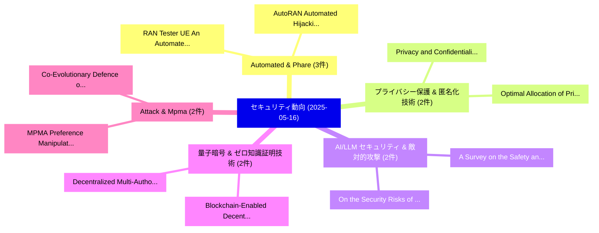

# 📅 02_daily: 日次エグゼクティブサマリー報告書 (2025-05-16)

**集計日時**: 2026-10-02 23:05:26 UTC  
**対象日付**: 2025-05-16  
**本日収集論文数**: 35 件  

---

## 💡 主要セキュリティ動向・脅威インサイト (Executive Insights)

本日の収集論文（計 35 件）において、以下の重点セキュリティ領域で活発な研究動向が確認されました：
- **Automated & Phare** (3 件): 注目論文として 「RAN Tester UE: An Automated De...」、「AutoRAN: Automated Hijacking o...」 等が発表され、実務防御および攻撃検証の進展が見られます。
- **プライバシー保護 & 匿名化技術** (2 件): 注目論文として 「Optimal Allocation of Privacy ...」、「Privacy and Confidentiality Re...」 等が発表され、実務防御および攻撃検証の進展が見られます。
- **AI/LLM セキュリティ & 敵対的攻撃** (2 件): 注目論文として 「On the Security Risks of ML-ba...」、「A Survey on the Safety and Sec...」 等が発表され、実務防御および攻撃検証の進展が見られます。
- **量子暗号 & ゼロ知識証明技術** (2 件): 注目論文として 「Blockchain-Enabled Decentraliz...」、「Decentralized Multi-Authority ...」 等が発表され、実務防御および攻撃検証の進展が見られます。
- **Attack & Mpma** (2 件): 注目論文として 「MPMA: Preference Manipulation ...」、「Co-Evolutionary Defence of Act...」 等が発表され、実務防御および攻撃検証の進展が見られます。

### 🗺️ 技術・脅威トピックマインドマップ

---

## 📌 日次セキュリティ論文一覧 (日本語表形式)

| No | arXiv ID | 論文タイトル (日本語訳) | 重要キーワード | 構造化エグゼクティブ要約 (背景・提案・影響) | 脅威分類 | 詳細リンク |
|---|---|---|---|---|---|---|
| 1 | `2505.10759v1` | [Random Client Selection on Contrastive 連合学習 for Tabular Data](../../okf/papers/2025-05-16/2505.10759.md) | `Random Client Selection`, `Tabular Data`, `Contrastive Federated Learning` | 【提案】概要 (Overview & Key Finding) 本論文「Random Client Selection on Contrastive 連合学習 for Tabular...。実証評価により経営層・セキュリティ管理者向け推奨アクション (E... | `cs.CR` | [arXiv](https://arxiv.org/abs/2505.10759v1) &#124; [OKF](../../okf/papers/2025-05-16/2505.10759.md) |
| 2 | `2505.10790v1` | [Neural-Inspired Advances in Integral Cryptanalysis（セキュリティ分析論文）](../../okf/papers/2025-05-16/2505.10790.md) | `Inspired Advances`, `Integral Cryptanalysis`, `Neural-Inspired Advances` | 【提案】概要 (Overview & Key Finding) 本論文「Neural-Inspired Advances in Integral Cryptanalysis（セキュリ...。実証評価により経営層・セキュリティ管理者向け推奨アクション (E... | `cs.CR` | [arXiv](https://arxiv.org/abs/2505.10790v1) &#124; [OKF](../../okf/papers/2025-05-16/2505.10790.md) |
| 3 | `2505.10812v1` | [RAN Tester UE: An Automated Declarative UE Centric Security Testing Platform（セキュリティ分析論文）](../../okf/papers/2025-05-16/2505.10812.md) | `Centric Security Testing Platform`, `Charles Marion Ueltschey`, `Aly Sabri Abdalla` | 【提案】概要 (Overview & Key Finding) 本論文「RAN Tester UE: An Automated Declarative UE Centric Secu...。実証評価により経営層・セキュリティ管理者向け推奨アクション (E... | `cs.CR` | [arXiv](https://arxiv.org/abs/2505.10812v1) &#124; [OKF](../../okf/papers/2025-05-16/2505.10812.md) |
| 4 | `2505.10815v1` | [Enhancing Secrecy Energy Efficiency in RIS-Aided Aerial Mobile Edge Computing Networks: A Deep Reinforcement Learning Approach（セキュリティ分析論文）](../../okf/papers/2025-05-16/2505.10815.md) | `Aided Aerial Mobile Edge Computing Networks`, `Enhancing Secrecy Energy Efficiency`, `RIS-Aided Aerial` | 【提案】概要 (Overview & Key Finding) 本論文「Enhancing Secrecy Energy Efficiency in RIS-Aided Aerial...。実証評価により経営層・セキュリティ管理者向け推奨アクション (E... | `cs.CR` | [arXiv](https://arxiv.org/abs/2505.10815v1) &#124; [OKF](../../okf/papers/2025-05-16/2505.10815.md) |
| 5 | `2505.10838v1` | [LARGO: Latent Adversarial Reflection through Gradient Optimization for Jailbreaking LLMs（セキュリティ分析論文）](../../okf/papers/2025-05-16/2505.10838.md) | `Latent Adversarial Reflection`, `Gradient Optimization`, `Ran Li` | 【提案】概要 (Overview & Key Finding) 本論文「LARGO: Latent Adversarial Reflection through Gradient O...。実証評価により経営層・セキュリティ管理者向け推奨アクション (E... | `cs.CR` | [arXiv](https://arxiv.org/abs/2505.10838v1) &#124; [OKF](../../okf/papers/2025-05-16/2505.10838.md) |
| 6 | `2505.10846v3` | [AutoRAN: Automated Hijacking of Safety Reasoning in Large Reasoning Models（セキュリティ分析論文）](../../okf/papers/2025-05-16/2505.10846.md) | `Large Reasoning Models`, `Automated Hijacking`, `Safety Reasoning` | 【提案】概要 (Overview & Key Finding) 本論文「AutoRAN: Automated Hijacking of Safety Reasoning in Lar...。実証評価により経営層・セキュリティ管理者向け推奨アクション (E... | `cs.CR` | [arXiv](https://arxiv.org/abs/2505.10846v3) &#124; [OKF](../../okf/papers/2025-05-16/2505.10846.md) |
| 7 | `2505.10864v1` | [Anti-Sensing: Defense against Unauthorized Radar-based Human Vital Sign Sensing with Physically Realizable Wearable Oscillators（セキュリティ分析論文）](../../okf/papers/2025-05-16/2505.10864.md) | `Human Vital Sign Sensing`, `Physically Realizable Wearable Oscillators`, `Unauthorized Radar` | 【提案】概要 (Overview & Key Finding) 本論文「Anti-Sensing: Defense against Unauthorized Radar-based ...。実証評価により経営層・セキュリティ管理者向け推奨アクション (E... | `cs.CR` | [arXiv](https://arxiv.org/abs/2505.10864v1) &#124; [OKF](../../okf/papers/2025-05-16/2505.10864.md) |
| 8 | `2505.10871v1` | [Optimal Allocation of Privacy Budget on Hierarchical Data Release（セキュリティ分析論文）](../../okf/papers/2025-05-16/2505.10871.md) | `Hierarchical Data Release`, `Optimal Allocation`, `Privacy Budget` | 【提案】概要 (Overview & Key Finding) 本論文「Optimal Allocation of Privacy Budget on Hierarchical Da...。実証評価により経営層・セキュリティ管理者向け推奨アクション (E... | `cs.CR` | [arXiv](https://arxiv.org/abs/2505.10871v1) &#124; [OKF](../../okf/papers/2025-05-16/2505.10871.md) |
| 9 | `2505.10903v1` | [On the Security Risks of ML-based マルウェア検出 Systems: A Survey](../../okf/papers/2025-05-16/2505.10903.md) | `Security Risks`, `Malware Detection Systems`, `ML-based Malware` | 【提案】概要 (Overview & Key Finding) 本論文「On the Security Risks of ML-based マルウェア検出 Systems: A Su...。実証評価により経営層・セキュリティ管理者向け推奨アクション (E... | `cs.CR` | [arXiv](https://arxiv.org/abs/2505.10903v1) &#124; [OKF](../../okf/papers/2025-05-16/2505.10903.md) |
| 10 | `2505.10924v4` | [A Survey on the Safety and Security Threats of Computer-Using Agents: JARVIS or Ultron?（セキュリティ分析論文）](../../okf/papers/2025-05-16/2505.10924.md) | `Security Threats`, `Using Agents`, `Computer-Using Agents` | 【提案】### (日本語題名: A Survey on the Safety and Security Threats of Computer-Using Agents: JARVI...。実証評価により経営層・セキュリティ管理者向け推奨アクション (E... | `cs.CR` | [arXiv](https://arxiv.org/abs/2505.10924v4) &#124; [OKF](../../okf/papers/2025-05-16/2505.10924.md) |
| 11 | `2505.10932v1` | [Enhanced Multiuser CSI-Based Physical Layer Authentication Based on Information Reconciliation（セキュリティ分析論文）](../../okf/papers/2025-05-16/2505.10932.md) | `Based Physical Layer Authentication Based`, `Enhanced Multiuser`, `Information Reconciliation` | 【提案】概要 (Overview & Key Finding) 本論文「Enhanced Multiuser CSI-Based Physical Layer Authenticat...。実証評価により経営層・セキュリティ管理者向け推奨アクション (E... | `cs.CR` | [arXiv](https://arxiv.org/abs/2505.10932v1) &#124; [OKF](../../okf/papers/2025-05-16/2505.10932.md) |
| 12 | `2505.10942v1` | [Nosy Layers, Noisy Fixes: Tackling DRAs in 連合学習 Systems using Explainable AI](../../okf/papers/2025-05-16/2505.10942.md) | `Nosy Layers`, `Noisy Fixes`, `Federated Learning Systems` | 【提案】概要 (Overview & Key Finding) 本論文「Nosy Layers, Noisy Fixes: Tackling DRAs in 連合学習 Systems...。実証評価により経営層・セキュリティ管理者向け推奨アクション (E... | `cs.CR` | [arXiv](https://arxiv.org/abs/2505.10942v1) &#124; [OKF](../../okf/papers/2025-05-16/2505.10942.md) |
| 13 | `2505.10965v1` | [Privacy and Confidentiality Requirements Engineering for Process Data（セキュリティ分析論文）](../../okf/papers/2025-05-16/2505.10965.md) | `Confidentiality Requirements Engineering`, `Process Data`, `Fabian Haertel` | 【提案】概要 (Overview & Key Finding) 本論文「Privacy and Confidentiality Requirements Engineering fo...。実証評価により経営層・セキュリティ管理者向け推奨アクション (E... | `cs.CR` | [arXiv](https://arxiv.org/abs/2505.10965v1) &#124; [OKF](../../okf/papers/2025-05-16/2505.10965.md) |
| 14 | `2505.10983v2` | [GenoArmory: A Unified Evaluation Framework for Genomic Foundation Modelsに対する敵対的攻撃](../../okf/papers/2025-05-16/2505.10983.md) | `Genomic Foundation Models`, `Adversarial Attacks`, `Genomic Foundation` | 【提案】概要 (Overview & Key Finding) 本論文「GenoArmory: A Unified Evaluation Framework for Genomic ...。実証評価により経営層・セキュリティ管理者向け推奨アクション (E... | `cs.CR` | [arXiv](https://arxiv.org/abs/2505.10983v2) &#124; [OKF](../../okf/papers/2025-05-16/2505.10983.md) |
| 15 | `2505.11016v1` | [GoLeash: Mitigating Golang Software Supply Chain Attacks with Runtime Policy Enforcement（セキュリティ分析論文）](../../okf/papers/2025-05-16/2505.11016.md) | `Mitigating Golang Software Supply Chain Attacks`, `Runtime Policy Enforcement`, `Carmine Cesarano` | 【提案】概要 (Overview & Key Finding) 本論文「GoLeash: Mitigating Golang Software Supply Chain Attack...。実証評価により経営層・セキュリティ管理者向け推奨アクション (E... | `cs.CR` | [arXiv](https://arxiv.org/abs/2505.11016v1) &#124; [OKF](../../okf/papers/2025-05-16/2505.11016.md) |
| 16 | `2505.11049v1` | [GuardReasoner-VL: Safeguarding VLMs via Reinforced Reasoning（セキュリティ分析論文）](../../okf/papers/2025-05-16/2505.11049.md) | `Reinforced Reasoning`, `Yue Liu`, `Shengfang Zhai` | 【提案】概要 (Overview & Key Finding) 本論文「GuardReasoner-VL: Safeguarding VLMs via Reinforced Reas...。実証評価により経営層・セキュリティ管理者向け推奨アクション (E... | `cs.CR` | [arXiv](https://arxiv.org/abs/2505.11049v1) &#124; [OKF](../../okf/papers/2025-05-16/2505.11049.md) |
| 17 | `2505.11058v1` | [Side Channel Analysis in Homomorphic Encryption（セキュリティ分析論文）](../../okf/papers/2025-05-16/2505.11058.md) | `Homomorphic Encryption`, `Baraq Ghaleb`, `Raw Meta` | 【提案】概要 (Overview & Key Finding) 本論文「Side Channel Analysis in 準同型暗号（セキュリティ分析論文）」（原題: Side Ch...。実証評価により経営層・セキュリティ管理者向け推奨アクション (E... | `cs.CR` | [arXiv](https://arxiv.org/abs/2505.11058v1) &#124; [OKF](../../okf/papers/2025-05-16/2505.11058.md) |
| 18 | `2505.11063v3` | [Think Twice Before You Act: Enhancing Agent Behavioral Safety with Thought Correction（セキュリティ分析論文）](../../okf/papers/2025-05-16/2505.11063.md) | `Enhancing Agent Behavioral Safety`, `Thought Correction`, `Enhancing Agent Behaviora` | 【提案】概要 (Overview & Key Finding) 本論文「Think Twice Before You Act: Enhancing Agent Behavioral ...。実証評価により経営層・セキュリティ管理者向け推奨アクション (E... | `cs.CR` | [arXiv](https://arxiv.org/abs/2505.11063v3) &#124; [OKF](../../okf/papers/2025-05-16/2505.11063.md) |
| 19 | `2505.11094v1` | [Blockchain-Enabled Decentralized Privacy-Preserving Group Purchasing for Energy Plans（セキュリティ分析論文）](../../okf/papers/2025-05-16/2505.11094.md) | `Enabled Decentralized Privacy`, `Preserving Group Purchasing`, `Energy Plans` | 【提案】概要 (Overview & Key Finding) 本論文「Blockchain-Enabled Decentralized Privacy-Preserving Gro...。実証評価により経営層・セキュリティ管理者向け推奨アクション (E... | `cs.CR` | [arXiv](https://arxiv.org/abs/2505.11094v1) &#124; [OKF](../../okf/papers/2025-05-16/2505.11094.md) |
| 20 | `2505.11097v1` | [Verifiably Forgotten? Gradient Differences Still Enable Data Reconstruction in Federated Unlearning（セキュリティ分析論文）](../../okf/papers/2025-05-16/2505.11097.md) | `Gradient Differences Still Enable Data Reconstruction`, `Verifiably Forgotten`, `Federated Unlearning` | 【提案】Gradient Differences Still Enable Data Reconstruction in Federated Unlearning ### (日本語題...。実証評価により経営層・セキュリティ管理者向け推奨アクション (E... | `cs.CR` | [arXiv](https://arxiv.org/abs/2505.11097v1) &#124; [OKF](../../okf/papers/2025-05-16/2505.11097.md) |
| 21 | `2505.11154v2` | [MPMA: Preference Manipulation Attack Against Model Context Protocol（セキュリティ分析論文）](../../okf/papers/2025-05-16/2505.11154.md) | `Zihan Wang`, `Rui Zhang`, `Yu Liu` | 【提案】概要 (Overview & Key Finding) 本論文「MPMA: Preference Manipulation Attack Against Model Cont...。実証評価により経営層・セキュリティ管理者向け推奨アクション (E... | `cs.CR` | [arXiv](https://arxiv.org/abs/2505.11154v2) &#124; [OKF](../../okf/papers/2025-05-16/2505.11154.md) |
| 22 | `2505.11320v2` | [Understanding and Characterizing Obfuscated Funds Transfers in Ethereum Smart Contracts（セキュリティ分析論文）](../../okf/papers/2025-05-16/2505.11320.md) | `Characterizing Obfuscated Funds Transfers`, `Ethereum Smart Contracts`, `Tan Kia Quang` | 【提案】概要 (Overview & Key Finding) 本論文「Understanding and Characterizing Obfuscated Funds Trans...。実証評価により経営層・セキュリティ管理者向け推奨アクション (E... | `cs.CR` | [arXiv](https://arxiv.org/abs/2505.11320v2) &#124; [OKF](../../okf/papers/2025-05-16/2505.11320.md) |
| 23 | `2505.11365v4` | [Phare: A Safety Probe for 大規模言語モデル](../../okf/papers/2025-05-16/2505.11365.md) | `Safety Probe`, `Large Language Models`, `Pierre Le Jeune` | 【提案】概要 (Overview & Key Finding) 本論文「Phare: A Safety Probe for 大規模言語モデル」（原題: Phare: A Safety...。実証評価により経営層・セキュリティ管理者向け推奨アクション (E... | `cs.CR` | [arXiv](https://arxiv.org/abs/2505.11365v4) &#124; [OKF](../../okf/papers/2025-05-16/2505.11365.md) |
| 24 | `2505.11449v1` | [LLMs unlock new paths to monetizing exploits（セキュリティ分析論文）](../../okf/papers/2025-05-16/2505.11449.md) | `Nicholas Carlini`, `Milad Nasr`, `Edoardo Debenedetti` | 【提案】概要 (Overview & Key Finding) 本論文「LLMs unlock new paths to monetizing exploits（セキュリティ分析論文...。実証評価によりChoquette-Choo, Daphne Ip... | `cs.CR` | [arXiv](https://arxiv.org/abs/2505.11449v1) &#124; [OKF](../../okf/papers/2025-05-16/2505.11449.md) |
| 25 | `2505.11459v2` | [ProxyPrompt: System Prompts against Prompt Extraction Attacksのセキュリティ強化](../../okf/papers/2025-05-16/2505.11459.md) | `Securing System Prompts`, `Prompt Extraction Attacks`, `System Prompts` | 【提案】概要 (Overview & Key Finding) 本論文「ProxyPrompt: System Prompts against Prompt Extraction A...。実証評価により経営層・セキュリティ管理者向け推奨アクション (E... | `cs.CR` | [arXiv](https://arxiv.org/abs/2505.11459v2) &#124; [OKF](../../okf/papers/2025-05-16/2505.11459.md) |
| 26 | `2505.11565v2` | [ACSE-Eval: Can LLMs threat model real-world cloud infrastructure?（セキュリティ分析論文）](../../okf/papers/2025-05-16/2505.11565.md) | `real-world cloud`, `Sarthak Munshi`, `Swapnil Pathak` | 【提案】### (日本語題名: ACSE-Eval: Can LLMs 脅威 model real-world cloud infrastructure?（セキュリティ分析論文）) ...。実証評価により経営層・セキュリティ管理者向け推奨アクション (E... | `cs.CR` | [arXiv](https://arxiv.org/abs/2505.11565v2) &#124; [OKF](../../okf/papers/2025-05-16/2505.11565.md) |
| 27 | `2505.11583v1` | [Scaling an ISO Compliance Practice: Strategic Insights from Building a \$1m+ サイバーセキュリティ Certification Line](../../okf/papers/2025-05-16/2505.11583.md) | `Compliance Practice`, `Strategic Insights`, `Certification Line` | 【提案】概要 (Overview & Key Finding) 本論文「Scaling an ISO Compliance Practice: Strategic Insights ...。実証評価により経営層・セキュリティ管理者向け推奨アクション (E... | `cs.CR` | [arXiv](https://arxiv.org/abs/2505.11583v1) &#124; [OKF](../../okf/papers/2025-05-16/2505.11583.md) |
| 28 | `2505.11586v1` | [The Ripple Effect: On Unforeseen Complications of Backdoor Attacks（セキュリティ分析論文）](../../okf/papers/2025-05-16/2505.11586.md) | `Backdoor Attacks`, `Rui Zhang`, `Yun Shen` | 【提案】概要 (Overview & Key Finding) 本論文「The Ripple Effect: On Unforeseen Complications of Backd...。実証評価により経営層・セキュリティ管理者向け推奨アクション (E... | `cs.CR` | [arXiv](https://arxiv.org/abs/2505.11586v1) &#124; [OKF](../../okf/papers/2025-05-16/2505.11586.md) |
| 29 | `2505.11611v3` | [Signal in the Noise: Polysemantic Interference Transfers and Predicts Cross-Model Influence（セキュリティ分析論文）](../../okf/papers/2025-05-16/2505.11611.md) | `Polysemantic Interference Transfers`, `Predicts Cross`, `Model Influence` | 【提案】概要 (Overview & Key Finding) 本論文「Signal in the Noise: Polysemantic Interference Transfer...。実証評価により経営層・セキュリティ管理者向け推奨アクション (E... | `cs.CR` | [arXiv](https://arxiv.org/abs/2505.11611v3) &#124; [OKF](../../okf/papers/2025-05-16/2505.11611.md) |
| 30 | `2505.11706v1` | [Forensics of Error Rates of Quantum Hardware（セキュリティ分析論文）](../../okf/papers/2025-05-16/2505.11706.md) | `Error Rates`, `Quantum Hardware`, `Rupshali Roy` | 【提案】概要 (Overview & Key Finding) 本論文「Forensics of Error Rates of 量子 Hardware（セキュリティ分析論文）」（原題...。実証評価により経営層・セキュリティ管理者向け推奨アクション (E... | `cs.CR` | [arXiv](https://arxiv.org/abs/2505.11706v1) &#124; [OKF](../../okf/papers/2025-05-16/2505.11706.md) |
| 31 | `2505.11708v3` | [Unveiling the Black Box: A Multi-Layer Framework for Explaining Reinforcement Learning-Based Cyber Agents（セキュリティ分析論文）](../../okf/papers/2025-05-16/2505.11708.md) | `Explaining Reinforcement Learning`, `Based Cyber Agents`, `Black Box` | 【提案】概要 (Overview & Key Finding) 本論文「Unveiling the Black Box: A Multi-Layer Framework for Ex...。実証評価により経営層・セキュリティ管理者向け推奨アクション (E... | `cs.CR` | [arXiv](https://arxiv.org/abs/2505.11708v3) &#124; [OKF](../../okf/papers/2025-05-16/2505.11708.md) |
| 32 | `2505.11710v2` | [Co-Evolutionary Defence of Active Directory Attack Graphs via GNN-Approximated Dynamic Programming（セキュリティ分析論文）](../../okf/papers/2025-05-16/2505.11710.md) | `Active Directory Attack Graphs`, `Approximated Dynamic Programming`, `Evolutionary Defence` | 【提案】概要 (Overview & Key Finding) 本論文「Co-Evolutionary Defence of Active Directory Attack Grap...。実証評価により経営層・セキュリティ管理者向け推奨アクション (E... | `cs.CR` | [arXiv](https://arxiv.org/abs/2505.11710v2) &#124; [OKF](../../okf/papers/2025-05-16/2505.11710.md) |
| 33 | `2505.11741v2` | [MTRE: Multi-Token Reliability Estimation for Hallucination Detection in VLMs（セキュリティ分析論文）](../../okf/papers/2025-05-16/2505.11741.md) | `Token Reliability Estimation`, `Hallucination Detection`, `Multi-Token Reliability` | 【提案】概要 (Overview & Key Finding) 本論文「MTRE: Multi-Token Reliability Estimation for Hallucinat...。実証評価により経営層・セキュリティ管理者向け推奨アクション (E... | `cs.CR` | [arXiv](https://arxiv.org/abs/2505.11741v2) &#124; [OKF](../../okf/papers/2025-05-16/2505.11741.md) |
| 34 | `2505.11744v1` | [Decentralized Multi-Authority Attribute-Based Inner-Product Functional Encryption: Noisy and Evasive Constructions from Lattices（セキュリティ分析論文）](../../okf/papers/2025-05-16/2505.11744.md) | `Product Functional Encryption`, `Decentralized Multi`, `Authority Attribute` | 【提案】概要 (Overview & Key Finding) 本論文「Decentralized Multi-Authority Attribute-Based Inner-Pro...。実証評価により経営層・セキュリティ管理者向け推奨アクション (E... | `cs.CR` | [arXiv](https://arxiv.org/abs/2505.11744v1) &#124; [OKF](../../okf/papers/2025-05-16/2505.11744.md) |
| 35 | `2505.15833v1` | [Adversarially Robust Spiking Neural Networks with Sparse Connectivity（セキュリティ分析論文）](../../okf/papers/2025-05-16/2505.15833.md) | `Adversarially Robust Spiking Neural Networks`, `Sparse Connectivity`, `Mathias Schmolli` | 【提案】概要 (Overview & Key Finding) 本論文「Adversarially Robust Spiking Neural Networks with Spars...。実証評価により経営層・セキュリティ管理者向け推奨アクション (E... | `cs.CR` | [arXiv](https://arxiv.org/abs/2505.15833v1) &#124; [OKF](../../okf/papers/2025-05-16/2505.15833.md) |

