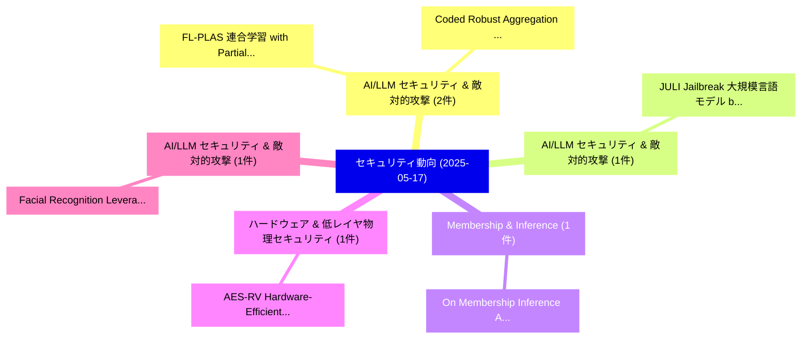

# 📅 02_daily: 日次エグゼクティブサマリー報告書 (2025-05-17)

**集計日時**: 2026-10-02 23:05:26 UTC  
**対象日付**: 2025-05-17  
**本日収集論文数**: 19 件  

---

## 💡 主要セキュリティ動向・脅威インサイト (Executive Insights)

本日の収集論文（計 19 件）において、以下の重点セキュリティ領域で活発な研究動向が確認されました：
- **AI/LLM セキュリティ & 敵対的攻撃** (2 件): 注目論文として 「FL-PLAS: 連合学習 with Partial Lay...」、「Coded Robust Aggregation for D...」 等が発表され、実務防御および攻撃検証の進展が見られます。
- **AI/LLM セキュリティ & 敵対的攻撃** (1 件): 注目論文として 「JULI: Jailbreak 大規模言語モデル by Se...」 等が発表され、実務防御および攻撃検証の進展が見られます。
- **Membership & Inference** (1 件): 注目論文として 「On Membership Inference Attack...」 等が発表され、実務防御および攻撃検証の進展が見られます。
- **ハードウェア & 低レイヤ物理セキュリティ** (1 件): 注目論文として 「AES-RV: Hardware-Efficient RIS...」 等が発表され、実務防御および攻撃検証の進展が見られます。
- **AI/LLM セキュリティ & 敵対的攻撃** (1 件): 注目論文として 「Facial Recognition Leveraging ...」 等が発表され、実務防御および攻撃検証の進展が見られます。

### 🗺️ 技術・脅威トピックマインドマップ

---

## 📌 日次セキュリティ論文一覧 (日本語表形式)

| No | arXiv ID | 論文タイトル (日本語訳) | 重要キーワード | 構造化エグゼクティブ要約 (背景・提案・影響) | 脅威分類 | 詳細リンク |
|---|---|---|---|---|---|---|
| 1 | `2505.11790v4` | [JULI: Jailbreak 大規模言語モデル by Self-Introspection](../../okf/papers/2025-05-17/2505.11790.md) | `Jailbreak Large Language Models`, `Jesson Wang`, `Zhanhao Hu` | 【提案】概要 (Overview & Key Finding) 本論文「JULI: ジェイルブレイク 大規模言語モデル by Self-Introspection」（原題: JULI...。実証評価により経営層・セキュリティ管理者向け推奨アクション (E... | `cs.CR` | [arXiv](https://arxiv.org/abs/2505.11790v4) &#124; [OKF](../../okf/papers/2025-05-17/2505.11790.md) |
| 2 | `2505.11837v2` | [On Membership Inference Attacks in Knowledge Distillation（セキュリティ分析論文）](../../okf/papers/2025-05-17/2505.11837.md) | `Knowledge Distillation`, `Ziyao Cui`, `Minxing Zhang` | 【提案】概要 (Overview & Key Finding) 本論文「On Membership Inference Attacks in Knowledge Distillati...。実証評価により経営層・セキュリティ管理者向け推奨アクション (E... | `cs.CR` | [arXiv](https://arxiv.org/abs/2505.11837v2) &#124; [OKF](../../okf/papers/2025-05-17/2505.11837.md) |
| 3 | `2505.11880v1` | [AES-RV: Hardware-Efficient RISC-V Accelerator with Low-Latency AES Instruction Extension for IoT Security（セキュリティ分析論文）](../../okf/papers/2025-05-17/2505.11880.md) | `Instruction Extension`, `Hardware-Efficient RISC`, `Low-Latency AES` | 【提案】概要 (Overview & Key Finding) 本論文「AES-RV: Hardware-Efficient RISC-V Accelerator with Low-...。実証評価により経営層・セキュリティ管理者向け推奨アクション (E... | `cs.CR` | [arXiv](https://arxiv.org/abs/2505.11880v1) &#124; [OKF](../../okf/papers/2025-05-17/2505.11880.md) |
| 4 | `2505.11884v2` | [Facial Recognition Leveraging Generative Adversarial Networks（セキュリティ分析論文）](../../okf/papers/2025-05-17/2505.11884.md) | `Facial Recognition Leveraging Generative Adversarial Networks`, `Zhongwen Li`, `Zongwei Li` | 【提案】概要 (Overview & Key Finding) 本論文「Facial Recognition Leveraging Generative Adversarial Ne...。実証評価により経営層・セキュリティ管理者向け推奨アクション (E... | `cs.CR` | [arXiv](https://arxiv.org/abs/2505.11884v2) &#124; [OKF](../../okf/papers/2025-05-17/2505.11884.md) |
| 5 | `2505.11901v1` | [LLMs in an Embodied Environment for Blue Team Threat Huntingのベンチマーク評価](../../okf/papers/2025-05-17/2505.11901.md) | `Embodied Environment`, `Blue Team Threat Hunting`, `Blue Team Threat` | 【提案】概要 (Overview & Key Finding) 本論文「LLMs in an Embodied Environment for Blue Team 脅威 Huntin...。実証評価により経営層・セキュリティ管理者向け推奨アクション (E... | `cs.CR` | [arXiv](https://arxiv.org/abs/2505.11901v1) &#124; [OKF](../../okf/papers/2025-05-17/2505.11901.md) |
| 6 | `2505.11928v1` | [Efficient Implementations of Residue Generators Mod 2n + 1 Providing Diminished-1 Representation（セキュリティ分析論文）](../../okf/papers/2025-05-17/2505.11928.md) | `Residue Generators Mod`, `Efficient Implementations`, `Providing Diminished` | 【提案】概要 (Overview & Key Finding) 本論文「Efficient Implementations of Residue Generators Mod 2n ...。実証評価により経営層・セキュリティ管理者向け推奨アクション (E... | `cs.CR` | [arXiv](https://arxiv.org/abs/2505.11928v1) &#124; [OKF](../../okf/papers/2025-05-17/2505.11928.md) |
| 7 | `2505.11963v3` | [MARVEL: Multi-Agent RTL Vulnerability Extraction using 大規模言語モデル](../../okf/papers/2025-05-17/2505.11963.md) | `Vulnerability Extraction`, `Multi-Agent RTL`, `Large Language Models` | 【提案】概要 (Overview & Key Finding) 本論文「MARVEL: Multi-Agent RTL 脆弱性 Extraction using 大規模言語モデル」（...。実証評価により経営層・セキュリティ管理者向け推奨アクション (E... | `cs.CR` | [arXiv](https://arxiv.org/abs/2505.11963v3) &#124; [OKF](../../okf/papers/2025-05-17/2505.11963.md) |
| 8 | `2505.11988v2` | [TechniqueRAG: Retrieval Augmented Generation for Adversarial Technique Annotation in Cyber Threat Intelligence Text（セキュリティ分析論文）](../../okf/papers/2025-05-17/2505.11988.md) | `Cyber Threat Intelligence Text`, `Retrieval Augmented Generation`, `Adversarial Technique Annotation` | 【提案】概要 (Overview & Key Finding) 本論文「TechniqueRAG: Retrieval Augmented Generation for Advers...。実証評価により経営層・セキュリティ管理者向け推奨アクション (E... | `cs.CR` | [arXiv](https://arxiv.org/abs/2505.11988v2) &#124; [OKF](../../okf/papers/2025-05-17/2505.11988.md) |
| 9 | `2505.12018v2` | [A Human Study of Cognitive Biases in Web Application Security（セキュリティ分析論文）](../../okf/papers/2025-05-17/2505.12018.md) | `Web Application Security`, `Cognitive Biases`, `Yuwei Yang` | 【提案】概要 (Overview & Key Finding) 本論文「A Human Study of Cognitive Biases in Web Application Se...。実証評価により経営層・セキュリティ管理者向け推奨アクション (E... | `cs.CR` | [arXiv](https://arxiv.org/abs/2505.12018v2) &#124; [OKF](../../okf/papers/2025-05-17/2505.12018.md) |
| 10 | `2505.12019v1` | [FL-PLAS: 連合学習 with Partial Layer Aggregation for Backdoor Defense Against High-Ratio Malicious Clients](../../okf/papers/2025-05-17/2505.12019.md) | `Partial Layer Aggregation`, `Ratio Malicious Clients`, `High-Ratio Malicious` | 【提案】概要 (Overview & Key Finding) 本論文「FL-PLAS: 連合学習 with Partial Layer Aggregation for Backdo...。実証評価により経営層・セキュリティ管理者向け推奨アクション (E... | `cs.CR` | [arXiv](https://arxiv.org/abs/2505.12019v1) &#124; [OKF](../../okf/papers/2025-05-17/2505.12019.md) |
| 11 | `2505.12038v1` | [Safe Delta: Consistently Preserving Safety when Fine-Tuning LLMs on Diverse Datasets（セキュリティ分析論文）](../../okf/papers/2025-05-17/2505.12038.md) | `Consistently Preserving Safety`, `Safe Delta`, `Diverse Datasets` | 【提案】概要 (Overview & Key Finding) 本論文「Safe Delta: Consistently Preserving Safety when Fine-Tu...。実証評価により経営層・セキュリティ管理者向け推奨アクション (E... | `cs.CR` | [arXiv](https://arxiv.org/abs/2505.12038v1) &#124; [OKF](../../okf/papers/2025-05-17/2505.12038.md) |
| 12 | `2505.12104v1` | [The Impact of Emerging Phishing Threats: Assessing Quishing and LLM-generated Phishing Emails against Organizations（セキュリティ分析論文）](../../okf/papers/2025-05-17/2505.12104.md) | `Emerging Phishing Threats`, `Assessing Quishing`, `Phishing Emails` | 【提案】概要 (Overview & Key Finding) 本論文「The Impact of Emerging Phishing Threats: Assessing Quis...。実証評価により経営層・セキュリティ管理者向け推奨アクション (E... | `cs.CR` | [arXiv](https://arxiv.org/abs/2505.12104v1) &#124; [OKF](../../okf/papers/2025-05-17/2505.12104.md) |
| 13 | `2505.12106v1` | [MalVis: A Large-Scale Image-Based Framework and Dataset for Advancing Android Malware Classification（セキュリティ分析論文）](../../okf/papers/2025-05-17/2505.12106.md) | `Advancing Android Malware Classification`, `Scale Image`, `Large-Scale Image` | 【提案】概要 (Overview & Key Finding) 本論文「MalVis: A Large-Scale Image-Based Framework and Dataset...。実証評価により経営層・セキュリティ管理者向け推奨アクション (E... | `cs.CR` | [arXiv](https://arxiv.org/abs/2505.12106v1) &#124; [OKF](../../okf/papers/2025-05-17/2505.12106.md) |
| 14 | `2505.12128v3` | [Back to Square Roots: An Optimal Bound on the Matrix Factorization Error for Multi-Epoch Differentially Private SGD（セキュリティ分析論文）](../../okf/papers/2025-05-17/2505.12128.md) | `Matrix Factorization Error`, `Epoch Differentially Private`, `Square Roots` | 【提案】概要 (Overview & Key Finding) 本論文「Back to Square Roots: An Optimal Bound on the Matrix Fa...。実証評価により経営層・セキュリティ管理者向け推奨アクション (E... | `cs.CR` | [arXiv](https://arxiv.org/abs/2505.12128v3) &#124; [OKF](../../okf/papers/2025-05-17/2505.12128.md) |
| 15 | `2505.12144v6` | [Proof-of-Social-Capital: A Consensus Protocol Replacing Stake for Social Capital（セキュリティ分析論文）](../../okf/papers/2025-05-17/2505.12144.md) | `Consensus Protocol Replacing Stake`, `Social Capital`, `Juraj Mariani` | 【提案】概要 (Overview & Key Finding) 本論文「Proof-of-Social-Capital: A Consensus Protocol Replacing...。実証評価により経営層・セキュリティ管理者向け推奨アクション (E... | `cs.CR` | [arXiv](https://arxiv.org/abs/2505.12144v6) &#124; [OKF](../../okf/papers/2025-05-17/2505.12144.md) |
| 16 | `2505.12167v2` | [FABLE: A Localized, Targeted Adversarial Attack on Weather Forecasting Models（セキュリティ分析論文）](../../okf/papers/2025-05-17/2505.12167.md) | `Targeted Adversarial Attack`, `Weather Forecasting Models`, `Asadullah Hill Galib` | 【提案】概要 (Overview & Key Finding) 本論文「FABLE: A Localized, Targeted 敵対的攻撃 on Weather Forecasti...。実証評価により経営層・セキュリティ管理者向け推奨アクション (E... | `cs.CR` | [arXiv](https://arxiv.org/abs/2505.12167v2) &#124; [OKF](../../okf/papers/2025-05-17/2505.12167.md) |
| 17 | `2506.01989v2` | [Coded Robust Aggregation for Distributed Learning under Byzantine Attacks（セキュリティ分析論文）](../../okf/papers/2025-05-17/2506.01989.md) | `Coded Robust Aggregation`, `Distributed Learning`, `Byzantine Attacks` | 【提案】概要 (Overview & Key Finding) 本論文「Coded Robust Aggregation for Distributed Learning under...。実証評価により経営層・セキュリティ管理者向け推奨アクション (E... | `cs.CR` | [arXiv](https://arxiv.org/abs/2506.01989v2) &#124; [OKF](../../okf/papers/2025-05-17/2506.01989.md) |
| 18 | `2507.21060v1` | [Privacy-Preserving AI for Encrypted Medical Imaging: A Framework for Secure Diagnosis and Learning（セキュリティ分析論文）](../../okf/papers/2025-05-17/2507.21060.md) | `Encrypted Medical Imaging`, `Secure Diagnosis`, `Privacy-Preserving AI` | 【提案】概要 (Overview & Key Finding) 本論文「Privacy-Preserving AI for Encrypted Medical Imaging: A ...。実証評価により経営層・セキュリティ管理者向け推奨アクション (E... | `cs.CR` | [arXiv](https://arxiv.org/abs/2507.21060v1) &#124; [OKF](../../okf/papers/2025-05-17/2507.21060.md) |
| 19 | `2507.21061v1` | [Security practices in AI development（セキュリティ分析論文）](../../okf/papers/2025-05-17/2507.21061.md) | `Petr Spelda`, `Vit Stritecky`, `Raw Meta` | 【提案】概要 (Overview & Key Finding) 本論文「Security practices in AI development（セキュリティ分析論文）」（原題: S...。実証評価により経営層・セキュリティ管理者向け推奨アクション (E... | `cs.CR` | [arXiv](https://arxiv.org/abs/2507.21061v1) &#124; [OKF](../../okf/papers/2025-05-17/2507.21061.md) |

