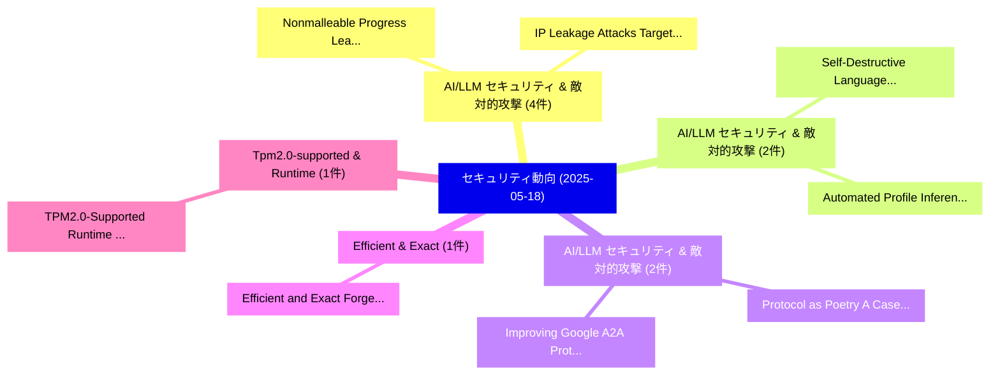

# 📅 02_daily: 日次エグゼクティブサマリー報告書 (2025-05-18)

**集計日時**: 2026-10-02 23:05:26 UTC  
**対象日付**: 2025-05-18  
**本日収集論文数**: 14 件  

---

## 💡 主要セキュリティ動向・脅威インサイト (Executive Insights)

本日の収集論文（計 14 件）において、以下の重点セキュリティ領域で活発な研究動向が確認されました：
- **AI/LLM セキュリティ & 敵対的攻撃** (4 件): 注目論文として 「Nonmalleable Progress Leakage（...」、「IP Leakage Attacks Targeting L...」 等が発表され、実務防御および攻撃検証の進展が見られます。
- **AI/LLM セキュリティ & 敵対的攻撃** (2 件): 注目論文として 「Self-Destructive Language Mode...」、「Automated Profile Inference wi...」 等が発表され、実務防御および攻撃検証の進展が見られます。
- **AI/LLM セキュリティ & 敵対的攻撃** (2 件): 注目論文として 「Protocol as Poetry: A Case Stu...」、「Improving Google A2A Protocol:...」 等が発表され、実務防御および攻撃検証の進展が見られます。
- **Efficient & Exact** (1 件): 注目論文として 「Efficient and Exact Forgetting...」 等が発表され、実務防御および攻撃検証の進展が見られます。
- **Tpm2.0-supported & Runtime** (1 件): 注目論文として 「TPM2.0-Supported Runtime Custo...」 等が発表され、実務防御および攻撃検証の進展が見られます。

### 🗺️ 技術・脅威トピックマインドマップ

---

## 📌 日次セキュリティ論文一覧 (日本語表形式)

| No | arXiv ID | 論文タイトル (日本語訳) | 重要キーワード | 構造化エグゼクティブ要約 (背景・提案・影響) | 脅威分類 | 詳細リンク |
|---|---|---|---|---|---|---|
| 1 | `2505.12186v2` | [Self-Destructive Language Model（セキュリティ分析論文）](../../okf/papers/2025-05-18/2505.12186.md) | `Destructive Language Model`, `Self-Destructive Language`, `Yuhui Wang` | 【提案】概要 (Overview & Key Finding) 本論文「Self-Destructive Language Model（セキュリティ分析論文）」（原題: Self-D...。実証評価により経営層・セキュリティ管理者向け推奨アクション (E... | `cs.CR` | [arXiv](https://arxiv.org/abs/2505.12186v2) &#124; [OKF](../../okf/papers/2025-05-18/2505.12186.md) |
| 2 | `2505.12210v1` | [Nonmalleable Progress Leakage（セキュリティ分析論文）](../../okf/papers/2025-05-18/2505.12210.md) | `Nonmalleable Progress Leakage`, `Ethan Cecchetti`, `Raw Meta` | 【提案】概要 (Overview & Key Finding) 本論文「Nonmalleable Progress Leakage（セキュリティ分析論文）」（原題: Nonmalle...。実証評価により経営層・セキュリティ管理者向け推奨アクション (E... | `cs.CR` | [arXiv](https://arxiv.org/abs/2505.12210v1) &#124; [OKF](../../okf/papers/2025-05-18/2505.12210.md) |
| 3 | `2505.12239v2` | [Efficient and Exact Forgetting Services in Pre-Trained-Model-based Continual Learningに向けて](../../okf/papers/2025-05-18/2505.12239.md) | `Exact Forgetting Services`, `Model-based Continual`, `Towards Efficient` | 【提案】概要 (Overview & Key Finding) 本論文「Efficient and Exact Forgetting Services in Pre-Trained-...。実証評価により経営層・セキュリティ管理者向け推奨アクション (E... | `cs.CR` | [arXiv](https://arxiv.org/abs/2505.12239v2) &#124; [OKF](../../okf/papers/2025-05-18/2505.12239.md) |
| 4 | `2505.12256v1` | [TPM2.0-Supported Runtime Customizable TEE on FPGA-SoC with User-Controllable vTPM（セキュリティ分析論文）](../../okf/papers/2025-05-18/2505.12256.md) | `Supported Runtime Customizable`, `0-Supported Runtime`, `User-Controllable vTPM` | 【提案】概要 (Overview & Key Finding) 本論文「TPM2.0-Supported Runtime Customizable TEE on FPGA-SoC w...。実証評価により経営層・セキュリティ管理者向け推奨アクション (E... | `cs.CR` | [arXiv](https://arxiv.org/abs/2505.12256v1) &#124; [OKF](../../okf/papers/2025-05-18/2505.12256.md) |
| 5 | `2505.12296v2` | [PoLO: Proof-of-Learning and Proof-of-Ownership at Once with Chained Watermarking（セキュリティ分析論文）](../../okf/papers/2025-05-18/2505.12296.md) | `Chained Watermarking`, `Ren Ping Liu`, `Haiyu Deng` | 【提案】概要 (Overview & Key Finding) 本論文「PoLO: Proof-of-Learning and Proof-of-Ownership at Once ...。実証評価により経営層・セキュリティ管理者向け推奨アクション (E... | `cs.CR` | [arXiv](https://arxiv.org/abs/2505.12296v2) &#124; [OKF](../../okf/papers/2025-05-18/2505.12296.md) |
| 6 | `2505.12335v2` | [Is Artificial Intelligence Generated Image Detection a Solved Problem?（セキュリティ分析論文）](../../okf/papers/2025-05-18/2505.12335.md) | `Solved Problem`, `Ziqiang Li`, `Jiazhen Yan` | 【提案】### (日本語題名: Is Artificial Intelligence Generated Image Detection a Solved Problem?（セキュリ...。実証評価により経営層・セキュリティ管理者向け推奨アクション (E... | `cs.CR` | [arXiv](https://arxiv.org/abs/2505.12335v2) &#124; [OKF](../../okf/papers/2025-05-18/2505.12335.md) |
| 7 | `2505.12393v2` | [Protocol as Poetry: A Case Study of Pak's Smart Contract-Based Protocol Art（セキュリティ分析論文）](../../okf/papers/2025-05-18/2505.12393.md) | `Based Protocol Art`, `Smart Contract`, `Contract-Based Protocol` | 【提案】概要 (Overview & Key Finding) 本論文「Protocol as Poetry: A Case Study of Pak's スマートコントラクト-Ba...。実証評価により経営層・セキュリティ管理者向け推奨アクション (E... | `cs.CR` | [arXiv](https://arxiv.org/abs/2505.12393v2) &#124; [OKF](../../okf/papers/2025-05-18/2505.12393.md) |
| 8 | `2505.12402v2` | [Automated Profile Inference with Language Model Agents（セキュリティ分析論文）](../../okf/papers/2025-05-18/2505.12402.md) | `Automated Profile Inference`, `Language Model Agents`, `Yuntao Du` | 【提案】概要 (Overview & Key Finding) 本論文「Automated Profile Inference with Language Model Agents（...。実証評価により経営層・セキュリティ管理者向け推奨アクション (E... | `cs.CR` | [arXiv](https://arxiv.org/abs/2505.12402v2) &#124; [OKF](../../okf/papers/2025-05-18/2505.12402.md) |
| 9 | `2505.12442v3` | [IP Leakage Attacks Targeting LLM-Based Multi-Agent Systems（セキュリティ分析論文）](../../okf/papers/2025-05-18/2505.12442.md) | `Leakage Attacks Targeting`, `Based Multi`, `Agent Systems` | 【提案】概要 (Overview & Key Finding) 本論文「IP Leakage Attacks Targeting LLM-Based Multi-Agent Syst...。実証評価により経営層・セキュリティ管理者向け推奨アクション (E... | `cs.CR` | [arXiv](https://arxiv.org/abs/2505.12442v3) &#124; [OKF](../../okf/papers/2025-05-18/2505.12442.md) |
| 10 | `2505.12453v2` | [SecEmb: Sparsity-Aware Secure 連合学習 of On-Device Recommender System with Large Embedding](../../okf/papers/2025-05-18/2505.12453.md) | `Device Recommender System`, `Sparsity-Aware Secure`, `On-Device Recommender` | 【提案】概要 (Overview & Key Finding) 本論文「SecEmb: Sparsity-Aware Secure 連合学習 of On-Device Recomme...。実証評価により経営層・セキュリティ管理者向け推奨アクション (E... | `cs.CR` | [arXiv](https://arxiv.org/abs/2505.12453v2) &#124; [OKF](../../okf/papers/2025-05-18/2505.12453.md) |
| 11 | `2505.12490v3` | [Improving Google A2A Protocol: Protecting Sensitive Data and Mitigating Unintended Harms in Multi-Agent Systems（セキュリティ分析論文）](../../okf/papers/2025-05-18/2505.12490.md) | `Protecting Sensitive Data`, `Mitigating Unintended Harms`, `Improving Google` | 【提案】概要 (Overview & Key Finding) 本論文「Improving Google A2A Protocol: Protecting Sensitive Dat...。実証評価により経営層・セキュリティ管理者向け推奨アクション (E... | `cs.CR` | [arXiv](https://arxiv.org/abs/2505.12490v3) &#124; [OKF](../../okf/papers/2025-05-18/2505.12490.md) |
| 12 | `2505.12541v2` | [Private Statistical Estimation via Truncation（セキュリティ分析論文）](../../okf/papers/2025-05-18/2505.12541.md) | `Private Statistical Estimation`, `Manolis Zampetakis`, `Felix Zhou` | 【提案】概要 (Overview & Key Finding) 本論文「Private Statistical Estimation via Truncation（セキュリティ分析論...。実証評価により経営層・セキュリティ管理者向け推奨アクション (E... | `cs.CR` | [arXiv](https://arxiv.org/abs/2505.12541v2) &#124; [OKF](../../okf/papers/2025-05-18/2505.12541.md) |
| 13 | `2505.12567v1` | [A Survey of Attacks on 大規模言語モデル](../../okf/papers/2025-05-18/2505.12567.md) | `Large Language Models`, `Wenrui Xu`, `Raw Meta` | 【提案】概要 (Overview & Key Finding) 本論文「A Survey of Attacks on 大規模言語モデル」（原題: A Survey of Attack...。実証評価によりParhi - **公開日時**: `2025-0... | `cs.CR` | [arXiv](https://arxiv.org/abs/2505.12567v1) &#124; [OKF](../../okf/papers/2025-05-18/2505.12567.md) |
| 14 | `2505.17066v3` | [Improving LLM Outputs Against Jailbreak Attacks with Expert Model Integration（セキュリティ分析論文）](../../okf/papers/2025-05-18/2505.17066.md) | `Expert Model Integration`, `David Dachi Choladze`, `Tatia Tsmindashvili` | 【提案】概要 (Overview & Key Finding) 本論文「Improving LLM Outputs Against ジェイルブレイク Attacks with Exp...。実証評価により経営層・セキュリティ管理者向け推奨アクション (E... | `cs.CR` | [arXiv](https://arxiv.org/abs/2505.17066v3) &#124; [OKF](../../okf/papers/2025-05-18/2505.17066.md) |

