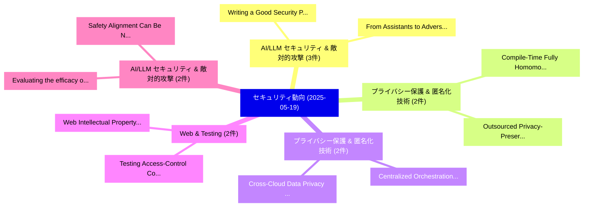

# 📅 02_daily: 日次エグゼクティブサマリー報告書 (2025-05-19)

**集計日時**: 2026-10-02 23:05:26 UTC  
**対象日付**: 2025-05-19  
**本日収集論文数**: 39 件  

---

## 💡 主要セキュリティ動向・脅威インサイト (Executive Insights)

本日の収集論文（計 39 件）において、以下の重点セキュリティ領域で活発な研究動向が確認されました：
- **AI/LLM セキュリティ & 敵対的攻撃** (3 件): 注目論文として 「Writing a Good Security Paper ...」、「From Assistants to Adversaries...」 等が発表され、実務防御および攻撃検証の進展が見られます。
- **プライバシー保護 & 匿名化技術** (2 件): 注目論文として 「Compile-Time Fully Homomorphic...」、「Outsourced Privacy-Preserving ...」 等が発表され、実務防御および攻撃検証の進展が見られます。
- **プライバシー保護 & 匿名化技術** (2 件): 注目論文として 「Centralized Orchestration of C...」、「Cross-Cloud Data Privacy Prote...」 等が発表され、実務防御および攻撃検証の進展が見られます。
- **Web & Testing** (2 件): 注目論文として 「Web Intellectual Property at R...」、「Testing Access-Control Configu...」 等が発表され、実務防御および攻撃検証の進展が見られます。
- **AI/LLM セキュリティ & 敵対的攻撃** (2 件): 注目論文として 「Evaluating the efficacy of LLM...」、「Safety Alignment Can Be Not Su...」 等が発表され、実務防御および攻撃検証の進展が見られます。

### 🗺️ 技術・脅威トピックマインドマップ

---

## 📌 日次セキュリティ論文一覧 (日本語表形式)

| No | arXiv ID | 論文タイトル (日本語訳) | 重要キーワード | 構造化エグゼクティブ要約 (背景・提案・影響) | 脅威分類 | 詳細リンク |
|---|---|---|---|---|---|---|
| 1 | `2505.12582v2` | [Compile-Time Fully Homomorphic Encryption of Vectors: Eliminating Online Encryption via Algebraic Basis Synthesis（セキュリティ分析論文）](../../okf/papers/2025-05-19/2505.12582.md) | `Time Fully Homomorphic Encryption`, `Eliminating Online Encryption`, `Algebraic Basis Synthesis` | 【提案】概要 (Overview & Key Finding) 本論文「Compile-Time Fully 準同型暗号 of Vectors: Eliminating Online...。実証評価により経営層・セキュリティ管理者向け推奨アクション (E... | `cs.CR` | [arXiv](https://arxiv.org/abs/2505.12582v2) &#124; [OKF](../../okf/papers/2025-05-19/2505.12582.md) |
| 2 | `2505.12610v1` | [hChain: Blockchain Based Large Scale EHR Data Sharing with Enhanced Security and Privacy（セキュリティ分析論文）](../../okf/papers/2025-05-19/2505.12610.md) | `Blockchain Based Large Scale`, `Data Sharing`, `Enhanced Security` | 【提案】概要 (Overview & Key Finding) 本論文「hChain: Blockchain Based Large Scale EHR Data Sharing w...。実証評価により経営層・セキュリティ管理者向け推奨アクション (E... | `cs.CR` | [arXiv](https://arxiv.org/abs/2505.12610v1) &#124; [OKF](../../okf/papers/2025-05-19/2505.12610.md) |
| 3 | `2505.12612v2` | [EPSpatial: Achieving Efficient and Private Statistical Analytics of Geospatial Data（セキュリティ分析論文）](../../okf/papers/2025-05-19/2505.12612.md) | `Private Statistical Analytics`, `Achieving Efficient`, `Geospatial Data` | 【提案】概要 (Overview & Key Finding) 本論文「EPSpatial: Achieving Efficient and Private Statistical ...。実証評価により経営層・セキュリティ管理者向け推奨アクション (E... | `cs.CR` | [arXiv](https://arxiv.org/abs/2505.12612v2) &#124; [OKF](../../okf/papers/2025-05-19/2505.12612.md) |
| 4 | `2505.12613v1` | [Centralized Orchestration of Cyber Protection Condition (CPCON)に向けて](../../okf/papers/2025-05-19/2505.12613.md) | `Cyber Protection Condition`, `Towards Centralized Orchestration`, `Centralized Orchestration` | 【提案】概要 (Overview & Key Finding) 本論文「Centralized Orchestration of Cyber Protection Condition...。実証評価により経営層・セキュリティ管理者向け推奨アクション (E... | `cs.CR` | [arXiv](https://arxiv.org/abs/2505.12613v1) &#124; [OKF](../../okf/papers/2025-05-19/2505.12613.md) |
| 5 | `2505.12625v1` | [R1dacted: Investigating Local Censorship in DeepSeek's R1 Language Model（セキュリティ分析論文）](../../okf/papers/2025-05-19/2505.12625.md) | `Investigating Local Censorship`, `R1 Language Model`, `Ali Naseh` | 【提案】概要 (Overview & Key Finding) 本論文「R1dacted: Investigating Local Censorship in DeepSeek's ...。実証評価により経営層・セキュリティ管理者向け推奨アクション (E... | `cs.CR` | [arXiv](https://arxiv.org/abs/2505.12625v1) &#124; [OKF](../../okf/papers/2025-05-19/2505.12625.md) |
| 6 | `2505.12640v2` | [GDPRShield: AI-Powered GDPR Support for Software Developers in Small and Medium-Sized Enterprises（セキュリティ分析論文）](../../okf/papers/2025-05-19/2505.12640.md) | `Software Developers`, `Sized Enterprises`, `AI-Powered GDPR` | 【提案】概要 (Overview & Key Finding) 本論文「GDPRShield: AI-Powered GDPR Support for Software Develo...。実証評価により経営層・セキュリティ管理者向け推奨アクション (E... | `cs.CR` | [arXiv](https://arxiv.org/abs/2505.12640v2) &#124; [OKF](../../okf/papers/2025-05-19/2505.12640.md) |
| 7 | `2505.12655v2` | [Web Intellectual Property at Risk: Preventing Unauthorized Real-Time Retrieval by 大規模言語モデル](../../okf/papers/2025-05-19/2505.12655.md) | `Web Intellectual Property`, `Preventing Unauthorized Real`, `Time Retrieval` | 【提案】概要 (Overview & Key Finding) 本論文「Web Intellectual Property at Risk: Preventing Unauthori...。実証評価により経営層・セキュリティ管理者向け推奨アクション (E... | `cs.CR` | [arXiv](https://arxiv.org/abs/2505.12655v2) &#124; [OKF](../../okf/papers/2025-05-19/2505.12655.md) |
| 8 | `2505.12688v1` | [Shielding Latent Face Representations From Privacy Attacks（セキュリティ分析論文）](../../okf/papers/2025-05-19/2505.12688.md) | `Arjun Ramesh Kaushik`, `Bharat Chandra Yalavarthi`, `Arun Ross` | 【提案】概要 (Overview & Key Finding) 本論文「Shielding Latent Face Representations From Privacy Atta...。実証評価により経営層・セキュリティ管理者向け推奨アクション (E... | `cs.CR` | [arXiv](https://arxiv.org/abs/2505.12688v1) &#124; [OKF](../../okf/papers/2025-05-19/2505.12688.md) |
| 9 | `2505.12690v1` | [An Automated Blackbox Noncompliance Checker for QUIC Server Implementations（セキュリティ分析論文）](../../okf/papers/2025-05-19/2505.12690.md) | `Server Implementations`, `Kian Kai Ang`, `Guy Farrelly` | 【提案】概要 (Overview & Key Finding) 本論文「An Automated Blackbox Noncompliance Checker for QUIC Se...。実証評価により経営層・セキュリティ管理者向け推奨アクション (E... | `cs.CR` | [arXiv](https://arxiv.org/abs/2505.12690v1) &#124; [OKF](../../okf/papers/2025-05-19/2505.12690.md) |
| 10 | `2505.12700v1` | [Writing a Good Security Paper for ISSCC (2025)（セキュリティ分析論文）](../../okf/papers/2025-05-19/2505.12700.md) | `Yong Ki Lee`, `Rabia Tugce Yazicigil`, `Utsav Banerjee` | 【提案】概要 (Overview & Key Finding) 本論文「Writing a Good Security Paper for ISSCC (2025)（セキュリティ分析...。実証評価により経営層・セキュリティ管理者向け推奨アクション (E... | `cs.CR` | [arXiv](https://arxiv.org/abs/2505.12700v1) &#124; [OKF](../../okf/papers/2025-05-19/2505.12700.md) |
| 11 | `2505.12750v1` | [Malware families discovery via Open-Set Recognition on Android manifest permissions（セキュリティ分析論文）](../../okf/papers/2025-05-19/2505.12750.md) | `Set Recognition`, `Open-Set Recognition`, `Filippo Leveni` | 【提案】概要 (Overview & Key Finding) 本論文「マルウェア families discovery via Open-Set Recognition on An...。実証評価により経営層・セキュリティ管理者向け推奨アクション (E... | `cs.CR` | [arXiv](https://arxiv.org/abs/2505.12750v1) &#124; [OKF](../../okf/papers/2025-05-19/2505.12750.md) |
| 12 | `2505.12770v1` | [Testing Access-Control Configuration Changes for Web Applications（セキュリティ分析論文）](../../okf/papers/2025-05-19/2505.12770.md) | `Control Configuration Changes`, `Testing Access`, `Web Applications` | 【提案】概要 (Overview & Key Finding) 本論文「Testing Access-Control Configuration Changes for Web Ap...。実証評価により経営層・セキュリティ管理者向け推奨アクション (E... | `cs.CR` | [arXiv](https://arxiv.org/abs/2505.12770v1) &#124; [OKF](../../okf/papers/2025-05-19/2505.12770.md) |
| 13 | `2505.12851v1` | [FLTG: Byzantine-Robust 連合学習 via Angle-Based Defense and Non-IID-Aware Weighting](../../okf/papers/2025-05-19/2505.12851.md) | `Based Defense`, `Aware Weighting`, `Angle-Based Defense` | 【提案】概要 (Overview & Key Finding) 本論文「FLTG: Byzantine-Robust 連合学習 via Angle-Based Defense and...。実証評価により経営層・セキュリティ管理者向け推奨アクション (E... | `cs.CR` | [arXiv](https://arxiv.org/abs/2505.12851v1) &#124; [OKF](../../okf/papers/2025-05-19/2505.12851.md) |
| 14 | `2505.12869v1` | [Outsourced Privacy-Preserving Feature Selection Based on Fully Homomorphic Encryption（セキュリティ分析論文）](../../okf/papers/2025-05-19/2505.12869.md) | `Preserving Feature Selection Based`, `Fully Homomorphic Encryption`, `Outsourced Privacy` | 【提案】概要 (Overview & Key Finding) 本論文「Outsourced Privacy-Preserving Feature Selection Based o...。実証評価により経営層・セキュリティ管理者向け推奨アクション (E... | `cs.CR` | [arXiv](https://arxiv.org/abs/2505.12869v1) &#124; [OKF](../../okf/papers/2025-05-19/2505.12869.md) |
| 15 | `2505.12871v1` | [Does Low Rank Adaptation Lead to Lower Robustness against Training-Time Attacks?（セキュリティ分析論文）](../../okf/papers/2025-05-19/2505.12871.md) | `Lower Robustness`, `Time Attacks`, `Training-Time Attacks` | 【提案】### (日本語題名: Does Low Rank Adaptation Lead to Lower Robustness against Training-Time Att...。実証評価により経営層・セキュリティ管理者向け推奨アクション (E... | `cs.CR` | [arXiv](https://arxiv.org/abs/2505.12871v1) &#124; [OKF](../../okf/papers/2025-05-19/2505.12871.md) |
| 16 | `2505.12968v1` | [Lara: Lightweight Anonymous Authentication with Asynchronous Revocation Auditability（セキュリティ分析論文）](../../okf/papers/2025-05-19/2505.12968.md) | `Lightweight Anonymous Authentication`, `Asynchronous Revocation Auditability`, `Claudio Correia` | 【提案】概要 (Overview & Key Finding) 本論文「Lara: Lightweight Anonymous Authentication with Asynchr...。実証評価により経営層・セキュリティ管理者向け推奨アクション (E... | `cs.CR` | [arXiv](https://arxiv.org/abs/2505.12968v1) &#124; [OKF](../../okf/papers/2025-05-19/2505.12968.md) |
| 17 | `2505.12981v2` | [From Assistants to Adversaries: Exploring the Security Risks of Mobile LLMエージェント](../../okf/papers/2025-05-19/2505.12981.md) | `Security Risks`, `Liangxuan Wu`, `Chao Wang` | 【提案】概要 (Overview & Key Finding) 本論文「From Assistants to Adversaries: Exploring the Security ...。実証評価により経営層・セキュリティ管理者向け推奨アクション (E... | `cs.CR` | [arXiv](https://arxiv.org/abs/2505.12981v2) &#124; [OKF](../../okf/papers/2025-05-19/2505.12981.md) |
| 18 | `2505.12995v2` | [ACE: A High-Assurance Isolated Virtualization Environment for RISC-Vに向けて](../../okf/papers/2025-05-19/2505.12995.md) | `Assurance Isolated Virtualization Environment`, `High-Assurance Isolated`, `Wojciech Ozga` | 【提案】概要 (Overview & Key Finding) 本論文「ACE: A High-Assurance Isolated Virtualization Environme...。実証評価によりLe, Lennard Gäher,。 | `cs.CR` | [arXiv](https://arxiv.org/abs/2505.12995v2) &#124; [OKF](../../okf/papers/2025-05-19/2505.12995.md) |
| 19 | `2505.13028v2` | [Evaluating the efficacy of LLM Safety Solutions : The Palit Benchmark Dataset（セキュリティ分析論文）](../../okf/papers/2025-05-19/2505.13028.md) | `Safety Solutions`, `Sayon Palit`, `Daniel Woods` | 【提案】概要 (Overview & Key Finding) 本論文「Evaluating the efficacy of LLM Safety Solutions : The P...。実証評価により経営層・セキュリティ管理者向け推奨アクション (E... | `cs.CR` | [arXiv](https://arxiv.org/abs/2505.13028v2) &#124; [OKF](../../okf/papers/2025-05-19/2505.13028.md) |
| 20 | `2505.13076v1` | [The Hidden Dangers of Browsing AI Agents（セキュリティ分析論文）](../../okf/papers/2025-05-19/2505.13076.md) | `Mykyta Mudryi`, `Markiyan Chaklosh`, `Raw Meta` | 【提案】概要 (Overview & Key Finding) 本論文「The Hidden Dangers of Browsing AI Agents（セキュリティ分析論文）」（原...。実証評価により経営層・セキュリティ管理者向け推奨アクション (E... | `cs.CR` | [arXiv](https://arxiv.org/abs/2505.13076v1) &#124; [OKF](../../okf/papers/2025-05-19/2505.13076.md) |
| 21 | `2505.13103v2` | [Fixing 7,400 Bugs for 1$: Cheap Crash-Site Program Repair（セキュリティ分析論文）](../../okf/papers/2025-05-19/2505.13103.md) | `Site Program Repair`, `Cheap Crash`, `Crash-Site Program` | 【提案】概要 (Overview & Key Finding) 本論文「Fixing 7,400 Bugs for 1$: Cheap Crash-Site Program Repa...。実証評価により経営層・セキュリティ管理者向け推奨アクション (E... | `cs.CR` | [arXiv](https://arxiv.org/abs/2505.13103v2) &#124; [OKF](../../okf/papers/2025-05-19/2505.13103.md) |
| 22 | `2505.13153v1` | [Prink: $k_s$-Anonymization for Streaming Data in Apache Flink（セキュリティ分析論文）](../../okf/papers/2025-05-19/2505.13153.md) | `Streaming Data`, `Apache Flink`, `Philip Groneberg` | 【提案】概要 (Overview & Key Finding) 本論文「Prink: $k_s$-Anonymization for Streaming Data in Apache...。実証評価により経営層・セキュリティ管理者向け推奨アクション (E... | `cs.CR` | [arXiv](https://arxiv.org/abs/2505.13153v1) &#124; [OKF](../../okf/papers/2025-05-19/2505.13153.md) |
| 23 | `2505.13158v1` | [Network-wide Quantum Key Distribution with Onion Routing Relay (Conference Version)（セキュリティ分析論文）](../../okf/papers/2025-05-19/2505.13158.md) | `Quantum Key Distribution`, `Onion Routing Relay`, `Network-wide Quantum` | 【提案】概要 (Overview & Key Finding) 本論文「Network-wide 量子鍵配送 with Onion Routing Relay (Conference...。実証評価により経営層・セキュリティ管理者向け推奨アクション (E... | `cs.CR` | [arXiv](https://arxiv.org/abs/2505.13158v1) &#124; [OKF](../../okf/papers/2025-05-19/2505.13158.md) |
| 24 | `2505.13238v4` | [A Geometry-Grounded Data Perimeter in Azure（セキュリティ分析論文）](../../okf/papers/2025-05-19/2505.13238.md) | `Grounded Data Perimeter`, `Geometry-Grounded Data`, `Christophe Parisel` | 【提案】概要 (Overview & Key Finding) 本論文「A Geometry-Grounded Data Perimeter in Azure（セキュリティ分析論文）...。実証評価により経営層・セキュリティ管理者向け推奨アクション (E... | `cs.CR` | [arXiv](https://arxiv.org/abs/2505.13238v4) &#124; [OKF](../../okf/papers/2025-05-19/2505.13238.md) |
| 25 | `2505.13239v1` | [Network-wide Quantum Key Distribution with Onion Routing Relay（セキュリティ分析論文）](../../okf/papers/2025-05-19/2505.13239.md) | `Quantum Key Distribution`, `Onion Routing Relay`, `Network-wide Quantum` | 【提案】概要 (Overview & Key Finding) 本論文「Network-wide 量子鍵配送 with Onion Routing Relay（セキュリティ分析論文）...。実証評価により経営層・セキュリティ管理者向け推奨アクション (E... | `cs.CR` | [arXiv](https://arxiv.org/abs/2505.13239v1) &#124; [OKF](../../okf/papers/2025-05-19/2505.13239.md) |
| 26 | `2505.13280v2` | [FlowPure: Continuous Normalizing Flows for Adversarial Purification（セキュリティ分析論文）](../../okf/papers/2025-05-19/2505.13280.md) | `Continuous Normalizing Flows`, `Adversarial Purification`, `Elias Collaert` | 【提案】概要 (Overview & Key Finding) 本論文「FlowPure: Continuous Normalizing Flows for Adversarial ...。実証評価により経営層・セキュリティ管理者向け推奨アクション (E... | `cs.CR` | [arXiv](https://arxiv.org/abs/2505.13280v2) &#124; [OKF](../../okf/papers/2025-05-19/2505.13280.md) |
| 27 | `2505.13292v1` | [Cross-Cloud Data Privacy Protection: Optimizing Collaborative Mechanisms of AI Systems by Integrating 連合学習 and LLMs](../../okf/papers/2025-05-19/2505.13292.md) | `Cloud Data Privacy Protection`, `Optimizing Collaborative Mechanisms`, `Cross-Cloud Data` | 【提案】概要 (Overview & Key Finding) 本論文「Cross-Cloud Data Privacy Protection: Optimizing Collabo...。実証評価により経営層・セキュリティ管理者向け推奨アクション (E... | `cs.CR` | [arXiv](https://arxiv.org/abs/2505.13292v1) &#124; [OKF](../../okf/papers/2025-05-19/2505.13292.md) |
| 28 | `2505.13319v2` | [SVAFD: A Secure and Verifiable Co-Aggregation Protocol for Federated Distillation（セキュリティ分析論文）](../../okf/papers/2025-05-19/2505.13319.md) | `Verifiable Co`, `Aggregation Protocol`, `Federated Distillation` | 【提案】概要 (Overview & Key Finding) 本論文「SVAFD: A Secure and Verifiable Co-Aggregation Protocol ...。実証評価により経営層・セキュリティ管理者向け推奨アクション (E... | `cs.CR` | [arXiv](https://arxiv.org/abs/2505.13319v2) &#124; [OKF](../../okf/papers/2025-05-19/2505.13319.md) |
| 29 | `2505.13329v1` | [Recommender Systems for Democracy: Toward Adversarial Robustness in Voting Advice Applications（セキュリティ分析論文）](../../okf/papers/2025-05-19/2505.13329.md) | `Toward Adversarial Robustness`, `Voting Advice Applications`, `Recommender Systems` | 【提案】概要 (Overview & Key Finding) 本論文「Recommender Systems for Democracy: Toward Adversarial R...。実証評価により経営層・セキュリティ管理者向け推奨アクション (E... | `cs.CR` | [arXiv](https://arxiv.org/abs/2505.13329v1) &#124; [OKF](../../okf/papers/2025-05-19/2505.13329.md) |
| 30 | `2505.13362v2` | [Dynamic Probabilistic Noise Injection for Membership Inference Defense（セキュリティ分析論文）](../../okf/papers/2025-05-19/2505.13362.md) | `Dynamic Probabilistic Noise Injection`, `Membership Inference Defense`, `Javad Forough` | 【提案】概要 (Overview & Key Finding) 本論文「Dynamic Probabilistic Noise Injection for Membership In...。実証評価により経営層・セキュリティ管理者向け推奨アクション (E... | `cs.CR` | [arXiv](https://arxiv.org/abs/2505.13362v2) &#124; [OKF](../../okf/papers/2025-05-19/2505.13362.md) |
| 31 | `2505.13581v1` | [RAR: Setting Knowledge Tripwires for Retrieval Augmented Rejection（セキュリティ分析論文）](../../okf/papers/2025-05-19/2505.13581.md) | `Setting Knowledge Tripwires`, `Retrieval Augmented Rejection`, `Tommaso Mario Buonocore` | 【提案】概要 (Overview & Key Finding) 本論文「RAR: Setting Knowledge Tripwires for Retrieval Augmente...。実証評価により経営層・セキュリティ管理者向け推奨アクション (E... | `cs.CR` | [arXiv](https://arxiv.org/abs/2505.13581v1) &#124; [OKF](../../okf/papers/2025-05-19/2505.13581.md) |
| 32 | `2505.13641v2` | [An Alignment Between the CRA's Essential Requirements and the ATT&CK's Mitigations（セキュリティ分析論文）](../../okf/papers/2025-05-19/2505.13641.md) | `Essential Requirements`, `Jukka Ruohonen`, `Young Kang` | 【提案】概要 (Overview & Key Finding) 本論文「An Alignment Between the CRA's Essential Requirements a...。実証評価により経営層・セキュリティ管理者向け推奨アクション (E... | `cs.CR` | [arXiv](https://arxiv.org/abs/2505.13641v2) &#124; [OKF](../../okf/papers/2025-05-19/2505.13641.md) |
| 33 | `2505.13651v4` | [Traceable Black-box Watermarks for 連合学習](../../okf/papers/2025-05-19/2505.13651.md) | `Traceable Black`, `Black-box Watermarks`, `Federated Learning` | 【提案】概要 (Overview & Key Finding) 本論文「Traceable Black-box Watermarks for 連合学習」（原題: Traceable ...。実証評価により経営層・セキュリティ管理者向け推奨アクション (E... | `cs.CR` | [arXiv](https://arxiv.org/abs/2505.13651v4) &#124; [OKF](../../okf/papers/2025-05-19/2505.13651.md) |
| 34 | `2505.13655v3` | [Optimal Client Sampling in 連合学習 with Client-Level Heterogeneous Differential Privacy](../../okf/papers/2025-05-19/2505.13655.md) | `Level Heterogeneous Differential Privacy`, `Optimal Client Sampling`, `Client-Level Heterogeneous` | 【提案】概要 (Overview & Key Finding) 本論文「Optimal Client Sampling in 連合学習 with Client-Level Heter...。実証評価により経営層・セキュリティ管理者向け推奨アクション (E... | `cs.CR` | [arXiv](https://arxiv.org/abs/2505.13655v3) &#124; [OKF](../../okf/papers/2025-05-19/2505.13655.md) |
| 35 | `2505.13694v1` | [A Systematic Review and Taxonomy for Privacy Breach Classification: Trends, Gaps, and Future Directions（セキュリティ分析論文）](../../okf/papers/2025-05-19/2505.13694.md) | `Privacy Breach Classification`, `Systematic Review`, `Future Directions` | 【提案】概要 (Overview & Key Finding) 本論文「A Systematic Review and Taxonomy for Privacy Breach Cla...。実証評価により経営層・セキュリティ管理者向け推奨アクション (E... | `cs.CR` | [arXiv](https://arxiv.org/abs/2505.13694v1) &#124; [OKF](../../okf/papers/2025-05-19/2505.13694.md) |
| 36 | `2505.13751v3` | [Multiple Proposer Transaction Fee Mechanism Design: Robust Incentives Against Censorship and Bribery（セキュリティ分析論文）](../../okf/papers/2025-05-19/2505.13751.md) | `Multiple Proposer Transaction Fee Mechanism Design`, `Panagiota Stouka`, `Julian Ma` | 【提案】概要 (Overview & Key Finding) 本論文「Multiple Proposer Transaction Fee Mechanism Design: Rob...。実証評価により経営層・セキュリティ管理者向け推奨アクション (E... | `cs.CR` | [arXiv](https://arxiv.org/abs/2505.13751v3) &#124; [OKF](../../okf/papers/2025-05-19/2505.13751.md) |
| 37 | `2505.13758v1` | [BeamClean: Language Aware Embedding Reconstruction（セキュリティ分析論文）](../../okf/papers/2025-05-19/2505.13758.md) | `Language Aware Embedding Reconstruction`, `Kaan Kale`, `Kyle Mylonakis` | 【提案】概要 (Overview & Key Finding) 本論文「BeamClean: Language Aware Embedding Reconstruction（セキュリ...。実証評価により経営層・セキュリティ管理者向け推奨アクション (E... | `cs.CR` | [arXiv](https://arxiv.org/abs/2505.13758v1) &#124; [OKF](../../okf/papers/2025-05-19/2505.13758.md) |
| 38 | `2505.17072v2` | [Safety Alignment Can Be Not Superficial With Explicit Safety Signals（セキュリティ分析論文）](../../okf/papers/2025-05-19/2505.17072.md) | `Jianwei Li`, `Eun Kim`, `Raw Meta` | 【提案】背景とセキュリティ上の課題 (Background & Problem) 本研究はサイバー脅威環境におけるセキュリティ構造・脆弱性の検証を目的としています。(主要検出項目: ...。実証評価により経営層・セキュリティ管理者向け推奨アクション (E... | `cs.CR` | [arXiv](https://arxiv.org/abs/2505.17072v2) &#124; [OKF](../../okf/papers/2025-05-19/2505.17072.md) |
| 39 | `2506.11022v2` | [Security Degradation in Iterative AI Code Generation -- A Systematic the Paradoxの分析](../../okf/papers/2025-05-19/2506.11022.md) | `Security Degradation`, `Code Generation`, `Shivani Shukla` | 【提案】概要 (Overview & Key Finding) 本論文「Security Degradation in Iterative AI Code Generation --...。実証評価により経営層・セキュリティ管理者向け推奨アクション (E... | `cs.CR` | [arXiv](https://arxiv.org/abs/2506.11022v2) &#124; [OKF](../../okf/papers/2025-05-19/2506.11022.md) |

