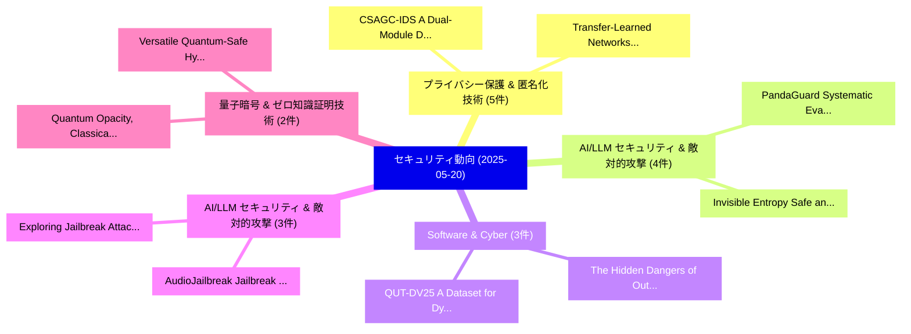

# 📅 02_daily: 日次エグゼクティブサマリー報告書 (2025-05-20)

**集計日時**: 2026-10-02 23:05:26 UTC  
**対象日付**: 2025-05-20  
**本日収集論文数**: 40 件  

---

## 💡 主要セキュリティ動向・脅威インサイト (Executive Insights)

本日の収集論文（計 40 件）において、以下の重点セキュリティ領域で活発な研究動向が確認されました：
- **プライバシー保護 & 匿名化技術** (5 件): 注目論文として 「CSAGC-IDS: A Dual-Module Deep ...」、「Transfer-Learned Networks with...」 等が発表され、実務防御および攻撃検証の進展が見られます。
- **AI/LLM セキュリティ & 敵対的攻撃** (4 件): 注目論文として 「PandaGuard: Systematic Evaluat...」、「Invisible Entropy: Safe and Ef...」 等が発表され、実務防御および攻撃検証の進展が見られます。
- **Software & Cyber** (3 件): 注目論文として 「QUT-DV25: A Dataset for Dynami...」、「The Hidden Dangers of Outdated...」 等が発表され、実務防御および攻撃検証の進展が見られます。
- **AI/LLM セキュリティ & 敵対的攻撃** (3 件): 注目論文として 「AudioJailbreak: Jailbreak Atta...」、「Exploring Jailbreak Attacks on...」 等が発表され、実務防御および攻撃検証の進展が見られます。
- **量子暗号 & ゼロ知識証明技術** (2 件): 注目論文として 「Quantum Opacity, Classical Cla...」、「Versatile Quantum-Safe Hybrid ...」 等が発表され、実務防御および攻撃検証の進展が見られます。

### 🗺️ 技術・脅威トピックマインドマップ

---

## 📌 日次セキュリティ論文一覧 (日本語表形式)

| No | arXiv ID | 論文タイトル (日本語訳) | 重要キーワード | 構造化エグゼクティブ要約 (背景・提案・影響) | 脅威分類 | 詳細リンク |
|---|---|---|---|---|---|---|
| 1 | `2505.13804v2` | [QUT-DV25: A Dataset for Dynamic Next-Gen Software Supply Chain Attacksの分析](../../okf/papers/2025-05-20/2505.13804.md) | `Next-Gen Software`, `Gen Software Supply Chain Attacks`, `Gen Software Supply Chain` | 【提案】概要 (Overview & Key Finding) 本論文「QUT-DV25: A Dataset for Dynamic Next-Gen Software Suppl...。実証評価により経営層・セキュリティ管理者向け推奨アクション (E... | `cs.CR` | [arXiv](https://arxiv.org/abs/2505.13804v2) &#124; [OKF](../../okf/papers/2025-05-20/2505.13804.md) |
| 2 | `2505.13819v1` | [Fragments to Facts: Partial-Information Fragment Inference from LLMs（セキュリティ分析論文）](../../okf/papers/2025-05-20/2505.13819.md) | `Information Fragment Inference`, `Partial-Information Fragment`, `Lucas Rosenblatt` | 【提案】概要 (Overview & Key Finding) 本論文「Fragments to Facts: Partial-Information Fragment Infere...。実証評価により経営層・セキュリティ管理者向け推奨アクション (E... | `cs.CR` | [arXiv](https://arxiv.org/abs/2505.13819v1) &#124; [OKF](../../okf/papers/2025-05-20/2505.13819.md) |
| 3 | `2505.13842v1` | [Provable Execution in Real-Time Embedded Systems（セキュリティ分析論文）](../../okf/papers/2025-05-20/2505.13842.md) | `Time Embedded Systems`, `Provable Execution`, `Real-Time Embedded` | 【提案】概要 (Overview & Key Finding) 本論文「Provable Execution in Real-Time Embedded Systems（セキュリティ...。実証評価により経営層・セキュリティ管理者向け推奨アクション (E... | `cs.CR` | [arXiv](https://arxiv.org/abs/2505.13842v1) &#124; [OKF](../../okf/papers/2025-05-20/2505.13842.md) |
| 4 | `2505.13848v1` | [Quantum Opacity, Classical Clarity: A Hybrid Approach to Quantum Circuit Obfuscation（セキュリティ分析論文）](../../okf/papers/2025-05-20/2505.13848.md) | `Quantum Circuit Obfuscation`, `Quantum Opacity`, `Classical Clarity` | 【提案】概要 (Overview & Key Finding) 本論文「量子 Opacity, Classical Clarity: A Hybrid Approach to 量子 ...。実証評価により経営層・セキュリティ管理者向け推奨アクション (E... | `cs.CR` | [arXiv](https://arxiv.org/abs/2505.13848v1) &#124; [OKF](../../okf/papers/2025-05-20/2505.13848.md) |
| 5 | `2505.13861v1` | [hChain 4.0: A Secure and Scalable Permissioned Blockchain for EHR Management in Smart Healthcare（セキュリティ分析論文）](../../okf/papers/2025-05-20/2505.13861.md) | `Scalable Permissioned Blockchain`, `Smart Healthcare`, `Elias Kougianos` | 【提案】概要 (Overview & Key Finding) 本論文「hChain 4.0: A Secure and Scalable Permissioned Blockcha...。実証評価により経営層・セキュリティ管理者向け推奨アクション (E... | `cs.CR` | [arXiv](https://arxiv.org/abs/2505.13861v1) &#124; [OKF](../../okf/papers/2025-05-20/2505.13861.md) |
| 6 | `2505.13862v3` | [PandaGuard: Systematic Evaluation of LLM Safety against Jailbreaking Attacks（セキュリティ分析論文）](../../okf/papers/2025-05-20/2505.13862.md) | `Jailbreaking Attacks`, `Guobin Shen`, `Dongcheng Zhao` | 【提案】概要 (Overview & Key Finding) 本論文「PandaGuard: Systematic Evaluation of LLM Safety against...。実証評価により経営層・セキュリティ管理者向け推奨アクション (E... | `cs.CR` | [arXiv](https://arxiv.org/abs/2505.13862v3) &#124; [OKF](../../okf/papers/2025-05-20/2505.13862.md) |
| 7 | `2505.13895v1` | [VulCPE: Context-Aware サイバーセキュリティ Vulnerability Retrieval and Management](../../okf/papers/2025-05-20/2505.13895.md) | `Aware Cybersecurity Vulnerability Retrieval`, `Vulnerability Retrieval`, `Context-Aware Cybersecurity` | 【提案】概要 (Overview & Key Finding) 本論文「VulCPE: Context-Aware サイバーセキュリティ 脆弱性 Retrieval and Mana...。実証評価により経営層・セキュリティ管理者向け推奨アクション (E... | `cs.CR` | [arXiv](https://arxiv.org/abs/2505.13895v1) &#124; [OKF](../../okf/papers/2025-05-20/2505.13895.md) |
| 8 | `2505.13922v1` | [The Hidden Dangers of Outdated Software: A Cyber Security Perspective（セキュリティ分析論文）](../../okf/papers/2025-05-20/2505.13922.md) | `Cyber Security Perspective`, `Outdated Software`, `Gogulakrishnan Thiyagarajan` | 【提案】概要 (Overview & Key Finding) 本論文「The Hidden Dangers of Outdated Software: A Cyber Securi...。実証評価により経営層・セキュリティ管理者向け推奨アクション (E... | `cs.CR` | [arXiv](https://arxiv.org/abs/2505.13922v1) &#124; [OKF](../../okf/papers/2025-05-20/2505.13922.md) |
| 9 | `2505.13942v1` | [D4+: Emergent Adversarial Driving Maneuvers with Approximate Functional Optimization（セキュリティ分析論文）](../../okf/papers/2025-05-20/2505.13942.md) | `Emergent Adversarial Driving Maneuvers`, `Approximate Functional Optimization`, `Diego Ortiz Barbosa` | 【提案】概要 (Overview & Key Finding) 本論文「D4+: Emergent Adversarial Driving Maneuvers with Approx...。実証評価により経営層・セキュリティ管理者向け推奨アクション (E... | `cs.CR` | [arXiv](https://arxiv.org/abs/2505.13942v1) &#124; [OKF](../../okf/papers/2025-05-20/2505.13942.md) |
| 10 | `2505.13957v1` | [Beyond Text: Unveiling Privacy Vulnerabilities in Multi-modal Retrieval-Augmented Generation（セキュリティ分析論文）](../../okf/papers/2025-05-20/2505.13957.md) | `Unveiling Privacy Vulnerabilities`, `Beyond Text`, `Augmented Generation` | 【提案】概要 (Overview & Key Finding) 本論文「Beyond Text: Unveiling Privacy Vulnerabilities in Multi...。実証評価により経営層・セキュリティ管理者向け推奨アクション (E... | `cs.CR` | [arXiv](https://arxiv.org/abs/2505.13957v1) &#124; [OKF](../../okf/papers/2025-05-20/2505.13957.md) |
| 11 | `2505.13964v1` | [Zk-SNARK for String Match（セキュリティ分析論文）](../../okf/papers/2025-05-20/2505.13964.md) | `String Match`, `Taoran Li`, `Taobo Liao` | 【提案】概要 (Overview & Key Finding) 本論文「Zk-SNARK for String Match（セキュリティ分析論文）」（原題: Zk-SNARK for...。実証評価により経営層・セキュリティ管理者向け推奨アクション (E... | `cs.CR` | [arXiv](https://arxiv.org/abs/2505.13964v1) &#124; [OKF](../../okf/papers/2025-05-20/2505.13964.md) |
| 12 | `2505.14024v1` | [FedGraM: Defending Against Untargeted Attacks in 連合学習 via Embedding Gram Matrix](../../okf/papers/2025-05-20/2505.14024.md) | `Embedding Gram Matrix`, `Federated Learning`, `Di Wu` | 【提案】概要 (Overview & Key Finding) 本論文「FedGraM: Defending Against Untargeted Attacks in 連合学習 v...。実証評価により経営層・セキュリティ管理者向け推奨アクション (E... | `cs.CR` | [arXiv](https://arxiv.org/abs/2505.14024v1) &#124; [OKF](../../okf/papers/2025-05-20/2505.14024.md) |
| 13 | `2505.14027v1` | [CSAGC-IDS: A Dual-Module Deep Learning Network Intrusion Detection Model for Complex and Imbalanced Data（セキュリティ分析論文）](../../okf/papers/2025-05-20/2505.14027.md) | `Module Deep Learning Network Intrusion Detection Model`, `Imbalanced Data`, `Dual-Module Deep` | 【提案】概要 (Overview & Key Finding) 本論文「CSAGC-IDS: A Dual-Module Deep Learning Network Intrusio...。実証評価により経営層・セキュリティ管理者向け推奨アクション (E... | `cs.CR` | [arXiv](https://arxiv.org/abs/2505.14027v1) &#124; [OKF](../../okf/papers/2025-05-20/2505.14027.md) |
| 14 | `2505.14067v1` | [In Search of Lost Data: A Study of Flash Sanitization Practices（セキュリティ分析論文）](../../okf/papers/2025-05-20/2505.14067.md) | `Flash Sanitization Practices`, `Lost Data`, `Janine Schneider` | 【提案】概要 (Overview & Key Finding) 本論文「In Search of Lost Data: A Study of Flash Sanitization P...。実証評価により経営層・セキュリティ管理者向け推奨アクション (E... | `cs.CR` | [arXiv](https://arxiv.org/abs/2505.14067v1) &#124; [OKF](../../okf/papers/2025-05-20/2505.14067.md) |
| 15 | `2505.14103v3` | [AudioJailbreak: Jailbreak Attacks against End-to-End Large Audio-Language Models（セキュリティ分析論文）](../../okf/papers/2025-05-20/2505.14103.md) | `End Large Audio`, `Jailbreak Attacks`, `Language Models` | 【提案】概要 (Overview & Key Finding) 本論文「Audioジェイルブレイク: ジェイルブレイク Attacks against End-to-End Larg...。実証評価により経営層・セキュリティ管理者向け推奨アクション (E... | `cs.CR` | [arXiv](https://arxiv.org/abs/2505.14103v3) &#124; [OKF](../../okf/papers/2025-05-20/2505.14103.md) |
| 16 | `2505.14112v1` | [Invisible Entropy: Safe and Efficient Low-Entropy LLM Watermarkingに向けて](../../okf/papers/2025-05-20/2505.14112.md) | `Invisible Entropy`, `Efficient Low`, `Low-Entropy LLM` | 【提案】概要 (Overview & Key Finding) 本論文「Invisible Entropy: Safe and Efficient Low-Entropy LLM W...。実証評価により経営層・セキュリティ管理者向け推奨アクション (E... | `cs.CR` | [arXiv](https://arxiv.org/abs/2505.14112v1) &#124; [OKF](../../okf/papers/2025-05-20/2505.14112.md) |
| 17 | `2505.14162v2` | [Versatile Quantum-Safe Hybrid Key Exchange and Its Application to MACsec（セキュリティ分析論文）](../../okf/papers/2025-05-20/2505.14162.md) | `Safe Hybrid Key Exchange`, `Versatile Quantum`, `Quantum-Safe Hybrid` | 【提案】概要 (Overview & Key Finding) 本論文「Versatile 量子-Safe Hybrid Key Exchange and Its Applicati...。実証評価により経営層・セキュリティ管理者向け推奨アクション (E... | `cs.CR` | [arXiv](https://arxiv.org/abs/2505.14162v2) &#124; [OKF](../../okf/papers/2025-05-20/2505.14162.md) |
| 18 | `2505.14175v1` | [Destabilizing Power Grid and Energy Market by Cyberattacks on Smart Inverters（セキュリティ分析論文）](../../okf/papers/2025-05-20/2505.14175.md) | `Destabilizing Power Grid`, `Energy Market`, `Smart Inverters` | 【提案】概要 (Overview & Key Finding) 本論文「Destabilizing Power Grid and Energy Market by Cyberatta...。実証評価により経営層・セキュリティ管理者向け推奨アクション (E... | `cs.CR` | [arXiv](https://arxiv.org/abs/2505.14175v1) &#124; [OKF](../../okf/papers/2025-05-20/2505.14175.md) |
| 19 | `2505.14251v2` | [A Private Approximation of the 2nd-Moment Matrix of Any Subsamplable Input（セキュリティ分析論文）](../../okf/papers/2025-05-20/2505.14251.md) | `Private Approximation`, `Moment Matrix`, `2nd-Moment Matrix` | 【提案】概要 (Overview & Key Finding) 本論文「A Private Approximation of the 2nd-Moment Matrix of Any...。実証評価により経営層・セキュリティ管理者向け推奨アクション (E... | `cs.CR` | [arXiv](https://arxiv.org/abs/2505.14251v2) &#124; [OKF](../../okf/papers/2025-05-20/2505.14251.md) |
| 20 | `2505.14316v1` | [Exploring Jailbreak Attacks on LLMs through Intent Concealment and Diversion（セキュリティ分析論文）](../../okf/papers/2025-05-20/2505.14316.md) | `Exploring Jailbreak Attacks`, `Intent Concealment`, `Tiehan Cui` | 【提案】概要 (Overview & Key Finding) 本論文「Exploring ジェイルブレイク Attacks on LLMs through Intent Conce...。実証評価により経営層・セキュリティ管理者向け推奨アクション (E... | `cs.CR` | [arXiv](https://arxiv.org/abs/2505.14316v1) &#124; [OKF](../../okf/papers/2025-05-20/2505.14316.md) |
| 21 | `2505.14323v2` | [Transfer-Learned Networks with Reverse Homomorphic Encryptionのセキュリティ強化](../../okf/papers/2025-05-20/2505.14323.md) | `Learned Networks`, `Transfer-Learned Networks`, `Reverse Homomorphic Encryption` | 【提案】概要 (Overview & Key Finding) 本論文「Transfer-Learned Networks with Reverse Homomorphic Encr...。実証評価により経営層・セキュリティ管理者向け推奨アクション (E... | `cs.CR` | [arXiv](https://arxiv.org/abs/2505.14323v2) &#124; [OKF](../../okf/papers/2025-05-20/2505.14323.md) |
| 22 | `2505.14325v2` | [Effects of the Cyber Resilience Act (CRA) on Industrial Equipment Manufacturing Companies（セキュリティ分析論文）](../../okf/papers/2025-05-20/2505.14325.md) | `Industrial Equipment Manufacturing Companies`, `Cyber Resilience Act`, `Industrial Equipment Manufacturin` | 【提案】概要 (Overview & Key Finding) 本論文「Effects of the Cyber Resilience Act (CRA) on Industrial...。実証評価により経営層・セキュリティ管理者向け推奨アクション (E... | `cs.CR` | [arXiv](https://arxiv.org/abs/2505.14325v2) &#124; [OKF](../../okf/papers/2025-05-20/2505.14325.md) |
| 23 | `2505.14368v2` | [From ASR to ASP: Evaluating Prompt Attack Vulnerabilities Against Open-Source LLMs（セキュリティ分析論文）](../../okf/papers/2025-05-20/2505.14368.md) | `Open-Source LLMs`, `Evaluating Prompt Att`, `Jiawen Wang` | 【提案】概要 (Overview & Key Finding) 本論文「From ASR to ASP: Evaluating Prompt Attack Vulnerabiliti...。実証評価により経営層・セキュリティ管理者向け推奨アクション (E... | `cs.CR` | [arXiv](https://arxiv.org/abs/2505.14368v2) &#124; [OKF](../../okf/papers/2025-05-20/2505.14368.md) |
| 24 | `2505.14461v1` | [MicroCrypt Assumptions with Quantum Input Sampling and Pseudodeterminism: Constructions and Separations（セキュリティ分析論文）](../../okf/papers/2025-05-20/2505.14461.md) | `Quantum Input Sampling`, `Mohammed Barhoush`, `Ryo Nishimaki` | 【提案】概要 (Overview & Key Finding) 本論文「MicroCrypt Assumptions with 量子 Input Sampling and Pseud...。実証評価により経営層・セキュリティ管理者向け推奨アクション (E... | `cs.CR` | [arXiv](https://arxiv.org/abs/2505.14461v1) &#124; [OKF](../../okf/papers/2025-05-20/2505.14461.md) |
| 25 | `2505.14534v1` | [Lessons from Defending Gemini Against Indirect Prompt Injections（セキュリティ分析論文）](../../okf/papers/2025-05-20/2505.14534.md) | `Chongyang Shi`, `Sharon Lin`, `Shuang Song` | 【提案】概要 (Overview & Key Finding) 本論文「Lessons from Defending Gemini Against Indirect プロンプトインジ...。実証評価により経営層・セキュリティ管理者向け推奨アクション (E... | `cs.CR` | [arXiv](https://arxiv.org/abs/2505.14534v1) &#124; [OKF](../../okf/papers/2025-05-20/2505.14534.md) |
| 26 | `2505.14549v3` | [Can 大規模言語モデル Really Recognize Your Name?](../../okf/papers/2025-05-20/2505.14549.md) | `Chau Minh Pham`, `Dzung Pham`, `Peter Kairouz` | 【提案】### (日本語題名: Can 大規模言語モデル Really Recognize Your Name?)  > [!NOTE] > **OKF Metadata**: Ty...。実証評価により経営層・セキュリティ管理者向け推奨アクション (E... | `cs.CR` | [arXiv](https://arxiv.org/abs/2505.14549v3) &#124; [OKF](../../okf/papers/2025-05-20/2505.14549.md) |
| 27 | `2505.14551v2` | [Game of Trust: How Trustworthy Does Your Blockchain Think You Are?（セキュリティ分析論文）](../../okf/papers/2025-05-20/2505.14551.md) | `Petros Drineas`, `Rohit Nema`, `Rafail Ostrovsky` | 【提案】### (日本語題名: Game of Trust: How Trustworthy Does Your Blockchain Think You Are?（セキュリティ分析...。実証評価により経営層・セキュリティ管理者向け推奨アクション (E... | `cs.CR` | [arXiv](https://arxiv.org/abs/2505.14551v2) &#124; [OKF](../../okf/papers/2025-05-20/2505.14551.md) |
| 28 | `2505.14565v1` | [Verifiability of Total Value Locked (TVL) in Decentralized Financeに向けて](../../okf/papers/2025-05-20/2505.14565.md) | `Total Value Locked`, `Towards Verifiability`, `Decentralized Finance` | 【提案】概要 (Overview & Key Finding) 本論文「Verifiability of Total Value Locked (TVL) in Decentrali...。実証評価により経営層・セキュリティ管理者向け推奨アクション (E... | `cs.CR` | [arXiv](https://arxiv.org/abs/2505.14565v1) &#124; [OKF](../../okf/papers/2025-05-20/2505.14565.md) |
| 29 | `2505.14592v1` | [Adaptive Pruning of Deep Neural Networks for Resource-Aware Embedded Intrusion Detection on the Edge（セキュリティ分析論文）](../../okf/papers/2025-05-20/2505.14592.md) | `Deep Neural Networks`, `Aware Embedded Intrusion Detection`, `Adaptive Pruning` | 【提案】概要 (Overview & Key Finding) 本論文「Adaptive Pruning of Deep Neural Networks for Resource-A...。実証評価により経営層・セキュリティ管理者向け推奨アクション (E... | `cs.CR` | [arXiv](https://arxiv.org/abs/2505.14592v1) &#124; [OKF](../../okf/papers/2025-05-20/2505.14592.md) |
| 30 | `2505.14607v3` | [sudoLLM: On Multi-role Alignment of Language Models（セキュリティ分析論文）](../../okf/papers/2025-05-20/2505.14607.md) | `Language Models`, `Multi-role Alignment`, `Soumadeep Saha` | 【提案】概要 (Overview & Key Finding) 本論文「sudoLLM: On Multi-role Alignment of Language Models（セキュ...。実証評価により経営層・セキュリティ管理者向け推奨アクション (E... | `cs.CR` | [arXiv](https://arxiv.org/abs/2505.14607v3) &#124; [OKF](../../okf/papers/2025-05-20/2505.14607.md) |
| 31 | `2505.14616v2` | [TSA-WF: Exploring the Effectiveness of Time Series Analysis for Website Fingerprinting（セキュリティ分析論文）](../../okf/papers/2025-05-20/2505.14616.md) | `Website Fingerprinting`, `Michael Wrana`, `Uzma Maroof` | 【提案】概要 (Overview & Key Finding) 本論文「TSA-WF: Exploring the Effectiveness of Time Series Anal...。実証評価により経営層・セキュリティ管理者向け推奨アクション (E... | `cs.CR` | [arXiv](https://arxiv.org/abs/2505.14616v2) &#124; [OKF](../../okf/papers/2025-05-20/2505.14616.md) |
| 32 | `2505.14673v1` | [Training-Free Watermarking for Autoregressive Image Generation（セキュリティ分析論文）](../../okf/papers/2025-05-20/2505.14673.md) | `Autoregressive Image Generation`, `Free Watermarking`, `Training-Free Watermarking` | 【提案】概要 (Overview & Key Finding) 本論文「Training-Free Watermarking for Autoregressive Image Gen...。実証評価により経営層・セキュリティ管理者向け推奨アクション (E... | `cs.CR` | [arXiv](https://arxiv.org/abs/2505.14673v1) &#124; [OKF](../../okf/papers/2025-05-20/2505.14673.md) |
| 33 | `2505.14797v1` | [Efficient Privacy-Preserving Cross-Silo 連合学習 with Multi-Key Homomorphic Encryption](../../okf/papers/2025-05-20/2505.14797.md) | `Key Homomorphic Encryption`, `Efficient Privacy`, `Preserving Cross` | 【提案】概要 (Overview & Key Finding) 本論文「Efficient Privacy-Preserving Cross-Silo 連合学習 with Multi...。実証評価により経営層・セキュリティ管理者向け推奨アクション (E... | `cs.CR` | [arXiv](https://arxiv.org/abs/2505.14797v1) &#124; [OKF](../../okf/papers/2025-05-20/2505.14797.md) |
| 34 | `2505.14835v1` | [Robust and Efficient AI-Based Attack Recovery in Autonomous Drones（セキュリティ分析論文）](../../okf/papers/2025-05-20/2505.14835.md) | `Based Attack Recovery`, `Autonomous Drones`, `AI-Based Attack` | 【提案】概要 (Overview & Key Finding) 本論文「Robust and Efficient AI-Based Attack Recovery in Autono...。実証評価により経営層・セキュリティ管理者向け推奨アクション (E... | `cs.CR` | [arXiv](https://arxiv.org/abs/2505.14835v1) &#124; [OKF](../../okf/papers/2025-05-20/2505.14835.md) |
| 35 | `2505.14891v1` | [On the (in)security of Proofs-of-Space based Longest-Chain Blockchains（セキュリティ分析論文）](../../okf/papers/2025-05-20/2505.14891.md) | `Chain Blockchains`, `Longest-Chain Blockchains`, `Mirza Ahad Baig` | 【提案】概要 (Overview & Key Finding) 本論文「On the (in)security of Proofs-of-Space based Longest-Ch...。実証評価により経営層・セキュリティ管理者向け推奨アクション (E... | `cs.CR` | [arXiv](https://arxiv.org/abs/2505.14891v1) &#124; [OKF](../../okf/papers/2025-05-20/2505.14891.md) |
| 36 | `2505.14898v1` | [Topology-aware Detection and Localization of Distributed Denial-of-Service Attacks in Network-on-Chips（セキュリティ分析論文）](../../okf/papers/2025-05-20/2505.14898.md) | `Distributed Denial`, `Service Attacks`, `Topology-aware Detection` | 【提案】概要 (Overview & Key Finding) 本論文「Topology-aware Detection and Localization of Distribute...。実証評価により経営層・セキュリティ管理者向け推奨アクション (E... | `cs.CR` | [arXiv](https://arxiv.org/abs/2505.14898v1) &#124; [OKF](../../okf/papers/2025-05-20/2505.14898.md) |
| 37 | `2505.14914v3` | [Sei Giga（セキュリティ分析論文）](../../okf/papers/2025-05-20/2505.14914.md) | `Sei Giga`, `Benjamin Marsh`, `Steven Landers` | 【提案】概要 (Overview & Key Finding) 本論文「Sei Giga（セキュリティ分析論文）」（原題: Sei Giga / arXiv: 2505.14914v...。実証評価により経営層・セキュリティ管理者向け推奨アクション (E... | `cs.CR` | [arXiv](https://arxiv.org/abs/2505.14914v3) &#124; [OKF](../../okf/papers/2025-05-20/2505.14914.md) |
| 38 | `2505.17077v1` | [Streamlining HTTP Flooding Attack Detection through Incremental Feature Selection（セキュリティ分析論文）](../../okf/papers/2025-05-20/2505.17077.md) | `Flooding Attack Detection`, `Incremental Feature Selection`, `Upasana Sarmah` | 【提案】概要 (Overview & Key Finding) 本論文「Streamlining HTTP Flooding Attack Detection through Inc...。実証評価により経営層・セキュリティ管理者向け推奨アクション (E... | `cs.CR` | [arXiv](https://arxiv.org/abs/2505.17077v1) &#124; [OKF](../../okf/papers/2025-05-20/2505.17077.md) |
| 39 | `2505.17084v1` | [From nuclear safety to LLM security: Applying non-probabilistic risk management strategies to build safe and secure LLM-powered systems（セキュリティ分析論文）](../../okf/papers/2025-05-20/2505.17084.md) | `non-probabilistic risk`, `LLM-powered systems`, `Alexander Gutfraind` | 【提案】概要 (Overview & Key Finding) 本論文「From nuclear safety to LLM security: Applying non-proba...。実証評価により経営層・セキュリティ管理者向け推奨アクション (E... | `cs.CR` | [arXiv](https://arxiv.org/abs/2505.17084v1) &#124; [OKF](../../okf/papers/2025-05-20/2505.17084.md) |
| 40 | `2505.17085v1` | [GSDFuse: Capturing Cognitive Inconsistencies from Multi-Dimensional Weak Signals in Social Media Steganalysis（セキュリティ分析論文）](../../okf/papers/2025-05-20/2505.17085.md) | `Capturing Cognitive Inconsistencies`, `Dimensional Weak Signals`, `Social Media Steganalysis` | 【提案】概要 (Overview & Key Finding) 本論文「GSDFuse: Capturing Cognitive Inconsistencies from Multi...。実証評価により経営層・セキュリティ管理者向け推奨アクション (E... | `cs.CR` | [arXiv](https://arxiv.org/abs/2505.17085v1) &#124; [OKF](../../okf/papers/2025-05-20/2505.17085.md) |

