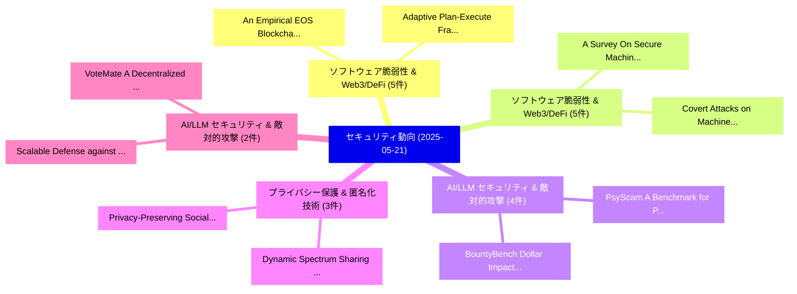

# 📅 02_daily: 日次エグゼクティブサマリー報告書 (2025-05-21)

**集計日時**: 2026-10-02 23:05:26 UTC  
**対象日付**: 2025-05-21  
**本日収集論文数**: 36 件  

---

## 💡 主要セキュリティ動向・脅威インサイト (Executive Insights)

本日の収集論文（計 36 件）において、以下の重点セキュリティ領域で活発な研究動向が確認されました：
- **ソフトウェア脆弱性 & Web3/DeFi** (5 件): 注目論文として 「An Empirical EOS Blockchain: A...」、「Adaptive Plan-Execute Framewor...」 等が発表され、実務防御および攻撃検証の進展が見られます。
- **ソフトウェア脆弱性 & Web3/DeFi** (5 件): 注目論文として 「A Survey On Secure Machine Lea...」、「Covert Attacks on Machine Lear...」 等が発表され、実務防御および攻撃検証の進展が見られます。
- **AI/LLM セキュリティ & 敵対的攻撃** (4 件): 注目論文として 「PsyScam: A Benchmark for Psych...」、「BountyBench: Dollar Impact of ...」 等が発表され、実務防御および攻撃検証の進展が見られます。
- **プライバシー保護 & 匿名化技術** (3 件): 注目論文として 「Dynamic Spectrum Sharing Based...」、「Privacy-Preserving Socialized ...」 等が発表され、実務防御および攻撃検証の進展が見られます。
- **AI/LLM セキュリティ & 敵対的攻撃** (2 件): 注目論文として 「Scalable Defense against In-th...」、「VoteMate: A Decentralized Appl...」 等が発表され、実務防御および攻撃検証の進展が見られます。

### 🗺️ 技術・脅威トピックマインドマップ

---

## 📌 日次セキュリティ論文一覧 (日本語表形式)

| No | arXiv ID | 論文タイトル (日本語訳) | 重要キーワード | 構造化エグゼクティブ要約 (背景・提案・影響) | 脅威分類 | 詳細リンク |
|---|---|---|---|---|---|---|
| 1 | `2505.15017v2` | [PsyScam: A Benchmark for Psychological Techniques in Real-World Scams（セキュリティ分析論文）](../../okf/papers/2025-05-21/2505.15017.md) | `Psychological Techniques`, `World Scams`, `Real-World Scams` | 【提案】概要 (Overview & Key Finding) 本論文「PsyScam: A Benchmark for Psychological Techniques in Re...。実証評価により経営層・セキュリティ管理者向け推奨アクション (E... | `cs.CR` | [arXiv](https://arxiv.org/abs/2505.15017v2) &#124; [OKF](../../okf/papers/2025-05-21/2505.15017.md) |
| 2 | `2505.15051v1` | [An Empirical EOS Blockchain: Architecture, Contract, and Securityの分析](../../okf/papers/2025-05-21/2505.15051.md) | `Haiyang Liu`, `Yingjie Mao`, `Xiaoqi Li` | 【提案】概要 (Overview & Key Finding) 本論文「An Empirical EOS Blockchain: Architecture, Contract, an...。実証評価により経営層・セキュリティ管理者向け推奨アクション (E... | `cs.CR` | [arXiv](https://arxiv.org/abs/2505.15051v1) &#124; [OKF](../../okf/papers/2025-05-21/2505.15051.md) |
| 3 | `2505.15088v1` | [Leveraging 大規模言語モデル for Command Injection Vulnerability Analysis in Python: An Empirical Study on Popular Open-Source Projects](../../okf/papers/2025-05-21/2505.15088.md) | `Popular Open`, `Source Projects`, `Open-Source Projects` | 【提案】概要 (Overview & Key Finding) 本論文「Leveraging 大規模言語モデル for Command Injection 脆弱性 Analysis ...。実証評価により経営層・セキュリティ管理者向け推奨アクション (E... | `cs.CR` | [arXiv](https://arxiv.org/abs/2505.15088v1) &#124; [OKF](../../okf/papers/2025-05-21/2505.15088.md) |
| 4 | `2505.15124v1` | [A Survey On Secure Machine Learning（セキュリティ分析論文）](../../okf/papers/2025-05-21/2505.15124.md) | `Taobo Liao`, `Taoran Li`, `Prathamesh Nadkarni` | 【提案】概要 (Overview & Key Finding) 本論文「A Survey On Secure Machine Learning（セキュリティ分析論文）」（原題: A ...。実証評価により経営層・セキュリティ管理者向け推奨アクション (E... | `cs.CR` | [arXiv](https://arxiv.org/abs/2505.15124v1) &#124; [OKF](../../okf/papers/2025-05-21/2505.15124.md) |
| 5 | `2505.15136v1` | [Hybrid Audio Detection Using Fine-Tuned Audio Spectrogram Transformers: A Dataset-Driven Evaluation of Mixed AI-Human Speech（セキュリティ分析論文）](../../okf/papers/2025-05-21/2505.15136.md) | `Hybrid Audio Detection Using Fine`, `Tuned Audio Spectrogram Transformers`, `Human Speech` | 【提案】概要 (Overview & Key Finding) 本論文「Hybrid Audio Detection Using Fine-Tuned Audio Spectrogr...。実証評価により経営層・セキュリティ管理者向け推奨アクション (E... | `cs.CR` | [arXiv](https://arxiv.org/abs/2505.15136v1) &#124; [OKF](../../okf/papers/2025-05-21/2505.15136.md) |
| 6 | `2505.15140v3` | [EC-LDA : Label Distribution Inference Attack against Federated Graph Learning with Embedding Compression（セキュリティ分析論文）](../../okf/papers/2025-05-21/2505.15140.md) | `Label Distribution Inference Attack`, `Federated Graph Learning`, `Embedding Compression` | 【提案】概要 (Overview & Key Finding) 本論文「EC-LDA : Label Distribution Inference Attack against Fe...。実証評価により経営層・セキュリティ管理者向け推奨アクション (E... | `cs.CR` | [arXiv](https://arxiv.org/abs/2505.15140v3) &#124; [OKF](../../okf/papers/2025-05-21/2505.15140.md) |
| 7 | `2505.15148v1` | [Dynamic Spectrum Sharing Based on the Rentable NFT Standard ERC4907（セキュリティ分析論文）](../../okf/papers/2025-05-21/2505.15148.md) | `Dynamic Spectrum Sharing Based`, `Litao Ye`, `Bin Chen` | 【提案】概要 (Overview & Key Finding) 本論文「Dynamic Spectrum Sharing Based on the Rentable NFT Stan...。実証評価により経営層・セキュリティ管理者向け推奨アクション (E... | `cs.CR` | [arXiv](https://arxiv.org/abs/2505.15148v1) &#124; [OKF](../../okf/papers/2025-05-21/2505.15148.md) |
| 8 | `2505.15156v1` | [Privacy-Preserving Socialized Recommendation based on Multi-View Clustering in a Cloud Environment（セキュリティ分析論文）](../../okf/papers/2025-05-21/2505.15156.md) | `Preserving Socialized Recommendation`, `View Clustering`, `Cloud Environment` | 【提案】概要 (Overview & Key Finding) 本論文「Privacy-Preserving Socialized Recommendation based on M...。実証評価により経営層・セキュリティ管理者向け推奨アクション (E... | `cs.CR` | [arXiv](https://arxiv.org/abs/2505.15156v1) &#124; [OKF](../../okf/papers/2025-05-21/2505.15156.md) |
| 9 | `2505.15175v3` | [A Linear Approach to Data Poisoning（セキュリティ分析論文）](../../okf/papers/2025-05-21/2505.15175.md) | `Data Poisoning`, `Donald Flynn`, `Diego Granziol` | 【提案】概要 (Overview & Key Finding) 本論文「A Linear Approach to Data Poisoning（セキュリティ分析論文）」（原題: A ...。実証評価により経営層・セキュリティ管理者向け推奨アクション (E... | `cs.CR` | [arXiv](https://arxiv.org/abs/2505.15175v3) &#124; [OKF](../../okf/papers/2025-05-21/2505.15175.md) |
| 10 | `2505.15216v3` | [BountyBench: Dollar Impact of AI Agent Attackers and Defenders on Real-World サイバーセキュリティ Systems](../../okf/papers/2025-05-21/2505.15216.md) | `Dollar Impact`, `Agent Attackers`, `World Cybersecurity Systems` | 【提案】概要 (Overview & Key Finding) 本論文「BountyBench: Dollar Impact of AI Agent Attackers and De...。実証評価により経営層・セキュリティ管理者向け推奨アクション (E... | `cs.CR` | [arXiv](https://arxiv.org/abs/2505.15216v3) &#124; [OKF](../../okf/papers/2025-05-21/2505.15216.md) |
| 11 | `2505.15242v2` | [Adaptive Plan-Execute Framework for Smart Contract Security Auditing（セキュリティ分析論文）](../../okf/papers/2025-05-21/2505.15242.md) | `Smart Contract Security Auditing`, `Adaptive Plan`, `Zhiyuan Wei` | 【提案】概要 (Overview & Key Finding) 本論文「Adaptive Plan-Execute Framework for スマートコントラクト Security...。実証評価により経営層・セキュリティ管理者向け推奨アクション (E... | `cs.CR` | [arXiv](https://arxiv.org/abs/2505.15242v2) &#124; [OKF](../../okf/papers/2025-05-21/2505.15242.md) |
| 12 | `2505.15252v1` | [An Efficient Private GPT Never Autoregressively Decodes（セキュリティ分析論文）](../../okf/papers/2025-05-21/2505.15252.md) | `Never Autoregressively Decodes`, `Zhengyi Li`, `Yue Guan` | 【提案】背景とセキュリティ上の課題 (Background & Problem) 本研究はサイバー脅威環境におけるセキュリティ構造・脆弱性の検証を目的としています。(主要検出項目: ...。実証評価により経営層・セキュリティ管理者向け推奨アクション (E... | `cs.CR` | [arXiv](https://arxiv.org/abs/2505.15252v1) &#124; [OKF](../../okf/papers/2025-05-21/2505.15252.md) |
| 13 | `2505.15265v2` | [Blind Spot Navigation: Evolutionary Discovery of Sensitive Semantic Concepts for LVLMs（セキュリティ分析論文）](../../okf/papers/2025-05-21/2505.15265.md) | `Blind Spot Navigation`, `Sensitive Semantic Concepts`, `Evolutionary Discovery` | 【提案】概要 (Overview & Key Finding) 本論文「Blind Spot Navigation: Evolutionary Discovery of Sensit...。実証評価により経営層・セキュリティ管理者向け推奨アクション (E... | `cs.CR` | [arXiv](https://arxiv.org/abs/2505.15265v2) &#124; [OKF](../../okf/papers/2025-05-21/2505.15265.md) |
| 14 | `2505.15376v1` | [連合学習-Enhanced Blockchain Framework for Privacy-Preserving Intrusion Detection in Industrial IoT](../../okf/papers/2025-05-21/2505.15376.md) | `Preserving Intrusion Detection`, `Privacy-Preserving Intrusion`, `Federated Learning` | 【提案】概要 (Overview & Key Finding) 本論文「連合学習-Enhanced Blockchain Framework for Privacy-Preservi...。実証評価により経営層・セキュリティ管理者向け推奨アクション (E... | `cs.CR` | [arXiv](https://arxiv.org/abs/2505.15376v1) &#124; [OKF](../../okf/papers/2025-05-21/2505.15376.md) |
| 15 | `2505.15383v1` | [Real-Time Insider Threats Using Behavioral Analytics and Deep Evidential Clusteringの検出](../../okf/papers/2025-05-21/2505.15383.md) | `Time Insider Threats Using Behavioral Analytics`, `Insider Threats Using Behavioral Analytics`, `Deep Evidential Clustering` | 【提案】概要 (Overview & Key Finding) 本論文「Real-Time Insider Threats Using Behavioral Analytics an...。実証評価により経営層・セキュリティ管理者向け推奨アクション (E... | `cs.CR` | [arXiv](https://arxiv.org/abs/2505.15383v1) &#124; [OKF](../../okf/papers/2025-05-21/2505.15383.md) |
| 16 | `2505.15389v3` | [Are Vision-Language Models Safe in the Wild? A Meme-Based Benchmark Study（セキュリティ分析論文）](../../okf/papers/2025-05-21/2505.15389.md) | `Language Models Safe`, `Vision-Language Models`, `Meme-Based Benchmark` | 【提案】A Meme-Based Benchmark Study ### (日本語題名: Are Vision-Language Models Safe in the Wild?。実証評価により経営層・セキュリティ管理者向け推奨アクション (Execut... | `cs.CR` | [arXiv](https://arxiv.org/abs/2505.15389v3) &#124; [OKF](../../okf/papers/2025-05-21/2505.15389.md) |
| 17 | `2505.15420v2` | [Silent Leaks: Implicit Knowledge Extraction Attack on RAG Systems through Benign Queries（セキュリティ分析論文）](../../okf/papers/2025-05-21/2505.15420.md) | `Implicit Knowledge Extraction Attack`, `Silent Leaks`, `Benign Queries` | 【提案】概要 (Overview & Key Finding) 本論文「Silent Leaks: Implicit Knowledge Extraction Attack on R...。実証評価により経営層・セキュリティ管理者向け推奨アクション (E... | `cs.CR` | [arXiv](https://arxiv.org/abs/2505.15420v2) &#124; [OKF](../../okf/papers/2025-05-21/2505.15420.md) |
| 18 | `2505.15476v1` | [Pura: An Efficient Privacy-Preserving Solution for Face Recognition（セキュリティ分析論文）](../../okf/papers/2025-05-21/2505.15476.md) | `Preserving Solution`, `Face Recognition`, `Privacy-Preserving Solution` | 【提案】概要 (Overview & Key Finding) 本論文「Pura: An Efficient Privacy-Preserving Solution for Face...。実証評価により経営層・セキュリティ管理者向け推奨アクション (E... | `cs.CR` | [arXiv](https://arxiv.org/abs/2505.15476v1) &#124; [OKF](../../okf/papers/2025-05-21/2505.15476.md) |
| 19 | `2505.15483v2` | [Optimal Piecewise-based Mechanism for Collecting Bounded Numerical Data under Local Differential Privacy（セキュリティ分析論文）](../../okf/papers/2025-05-21/2505.15483.md) | `Collecting Bounded Numerical Data`, `Local Differential Privacy`, `Optimal Piecewise` | 【提案】概要 (Overview & Key Finding) 本論文「Optimal Piecewise-based Mechanism for Collecting Bounde...。実証評価により経営層・セキュリティ管理者向け推奨アクション (E... | `cs.CR` | [arXiv](https://arxiv.org/abs/2505.15483v2) &#124; [OKF](../../okf/papers/2025-05-21/2505.15483.md) |
| 20 | `2505.15568v1` | [Model Checking the Security of the Lightning Network（セキュリティ分析論文）](../../okf/papers/2025-05-21/2505.15568.md) | `Model Checking`, `Lightning Network`, `Matthias Grundmann` | 【提案】概要 (Overview & Key Finding) 本論文「Model Checking the Security of the Lightning Network（セキ...。実証評価により経営層・セキュリティ管理者向け推奨アクション (E... | `cs.CR` | [arXiv](https://arxiv.org/abs/2505.15568v1) &#124; [OKF](../../okf/papers/2025-05-21/2505.15568.md) |
| 21 | `2505.15644v2` | [Can VLMs Detect and Localize Fine-Grained AI-Edited Images?（セキュリティ分析論文）](../../okf/papers/2025-05-21/2505.15644.md) | `Localize Fine`, `Fine-Grained AI`, `Edited Images` | 【提案】### (日本語題名: Can VLMs Detect and Localize Fine-Grained AI-Edited Images?（セキュリティ分析論文）)  >...。実証評価により経営層・セキュリティ管理者向け推奨アクション (E... | `cs.CR` | [arXiv](https://arxiv.org/abs/2505.15644v2) &#124; [OKF](../../okf/papers/2025-05-21/2505.15644.md) |
| 22 | `2505.15738v2` | [Checkpoint-GCG: Auditing and Attacking Fine-Tuning-Based Prompt Injection Defenses（セキュリティ分析論文）](../../okf/papers/2025-05-21/2505.15738.md) | `Based Prompt Injection Defenses`, `Attacking Fine`, `Xiaoxue Yang` | 【提案】概要 (Overview & Key Finding) 本論文「Checkpoint-GCG: Auditing and Attacking Fine-Tuning-Base...。実証評価により経営層・セキュリティ管理者向け推奨アクション (E... | `cs.CR` | [arXiv](https://arxiv.org/abs/2505.15738v2) &#124; [OKF](../../okf/papers/2025-05-21/2505.15738.md) |
| 23 | `2505.15753v1` | [Scalable Defense against In-the-wild Jailbreaking Attacks with Safety Context Retrieval（セキュリティ分析論文）](../../okf/papers/2025-05-21/2505.15753.md) | `Safety Context Retrieval`, `Scalable Defense`, `Jailbreaking Attacks` | 【提案】概要 (Overview & Key Finding) 本論文「Scalable Defense against In-the-wild ジェイルブレイクing Attack...。実証評価により経営層・セキュリティ管理者向け推奨アクション (E... | `cs.CR` | [arXiv](https://arxiv.org/abs/2505.15753v1) &#124; [OKF](../../okf/papers/2025-05-21/2505.15753.md) |
| 24 | `2505.15797v1` | [VoteMate: A Decentralized Application for Scalable Electronic Voting on EVM-Based Blockchain（セキュリティ分析論文）](../../okf/papers/2025-05-21/2505.15797.md) | `Scalable Electronic Voting`, `Decentralized Application`, `Based Blockchain` | 【提案】概要 (Overview & Key Finding) 本論文「VoteMate: A Decentralized Application for Scalable Elec...。実証評価により経営層・セキュリティ管理者向け推奨アクション (E... | `cs.CR` | [arXiv](https://arxiv.org/abs/2505.15797v1) &#124; [OKF](../../okf/papers/2025-05-21/2505.15797.md) |
| 25 | `2505.15921v1` | [Defining Atomicity (and Integrity) for Snapshots of Storage in Forensic Computing（セキュリティ分析論文）](../../okf/papers/2025-05-21/2505.15921.md) | `Defining Atomicity`, `Forensic Computing`, `Jenny Ottmann` | 【提案】概要 (Overview & Key Finding) 本論文「Defining Atomicity (and Integrity) for Snapshots of Sto...。実証評価により経営層・セキュリティ管理者向け推奨アクション (E... | `cs.CR` | [arXiv](https://arxiv.org/abs/2505.15921v1) &#124; [OKF](../../okf/papers/2025-05-21/2505.15921.md) |
| 26 | `2505.15935v3` | [MAPS: A Multilingual Benchmark for Agent Performance and Security（セキュリティ分析論文）](../../okf/papers/2025-05-21/2505.15935.md) | `Multilingual Benchmark`, `Agent Performance`, `Omer Hofman` | 【提案】概要 (Overview & Key Finding) 本論文「MAPS: A Multilingual Benchmark for Agent Performance an...。実証評価により経営層・セキュリティ管理者向け推奨アクション (E... | `cs.CR` | [arXiv](https://arxiv.org/abs/2505.15935v3) &#124; [OKF](../../okf/papers/2025-05-21/2505.15935.md) |
| 27 | `2505.15954v1` | [Integrating Robotic Navigation with Blockchain: A Novel PoS-Based Approach for Heterogeneous Robotic Teams（セキュリティ分析論文）](../../okf/papers/2025-05-21/2505.15954.md) | `Integrating Robotic Navigation`, `Heterogeneous Robotic Teams`, `Nasim Paykari` | 【提案】概要 (Overview & Key Finding) 本論文「Integrating Robotic Navigation with Blockchain: A Novel...。実証評価により経営層・セキュリティ管理者向け推奨アクション (E... | `cs.CR` | [arXiv](https://arxiv.org/abs/2505.15954v1) &#124; [OKF](../../okf/papers/2025-05-21/2505.15954.md) |
| 28 | `2505.16008v1` | [LAGO: Few-shot Crosslingual Embedding Inversion Attacks via Language Similarity-Aware Graph Optimization（セキュリティ分析論文）](../../okf/papers/2025-05-21/2505.16008.md) | `Crosslingual Embedding Inversion Attacks`, `Aware Graph Optimization`, `Few-shot Crosslingual` | 【提案】概要 (Overview & Key Finding) 本論文「LAGO: Few-shot Crosslingual Embedding Inversion Attacks...。実証評価により経営層・セキュリティ管理者向け推奨アクション (E... | `cs.CR` | [arXiv](https://arxiv.org/abs/2505.16008v1) &#124; [OKF](../../okf/papers/2025-05-21/2505.16008.md) |
| 29 | `2505.17092v1` | [Covert Attacks on Machine Learning Training in Passively Secure MPC（セキュリティ分析論文）](../../okf/papers/2025-05-21/2505.17092.md) | `Machine Learning Training`, `Covert Attacks`, `Passively Secure` | 【提案】概要 (Overview & Key Finding) 本論文「Covert Attacks on Machine Learning Training in Passivel...。実証評価により経営層・セキュリティ管理者向け推奨アクション (E... | `cs.CR` | [arXiv](https://arxiv.org/abs/2505.17092v1) &#124; [OKF](../../okf/papers/2025-05-21/2505.17092.md) |
| 30 | `2505.17094v1` | [Neuromorphic Mimicry Attacks Exploiting Brain-Inspired Computing for Covert Cyber Intrusions（セキュリティ分析論文）](../../okf/papers/2025-05-21/2505.17094.md) | `Neuromorphic Mimicry Attacks Exploiting Brain`, `Covert Cyber Intrusions`, `Inspired Computing` | 【提案】概要 (Overview & Key Finding) 本論文「Neuromorphic Mimicry Attacks Exploiting Brain-Inspired ...。実証評価により経営層・セキュリティ管理者向け推奨アクション (E... | `cs.CR` | [arXiv](https://arxiv.org/abs/2505.17094v1) &#124; [OKF](../../okf/papers/2025-05-21/2505.17094.md) |
| 31 | `2505.17107v1` | [CRAKEN: サイバーセキュリティ LLM Agent with Knowledge-Based Execution](../../okf/papers/2025-05-21/2505.17107.md) | `Based Execution`, `Knowledge-Based Execution`, `Venkata Sai Charan Putrevu` | 【提案】概要 (Overview & Key Finding) 本論文「CRAKEN: サイバーセキュリティ LLM Agent with Knowledge-Based Execu...。実証評価により経営層・セキュリティ管理者向け推奨アクション (E... | `cs.CR` | [arXiv](https://arxiv.org/abs/2505.17107v1) &#124; [OKF](../../okf/papers/2025-05-21/2505.17107.md) |
| 32 | `2505.17109v1` | [Mitigating Cyber Risk in the Age of Open-Weight LLMs: Policy Gaps and Technical Realities（セキュリティ分析論文）](../../okf/papers/2025-05-21/2505.17109.md) | `Mitigating Cyber Risk`, `Policy Gaps`, `Technical Realities` | 【提案】概要 (Overview & Key Finding) 本論文「Mitigating Cyber Risk in the Age of Open-Weight LLMs: P...。実証評価により経営層・セキュリティ管理者向け推奨アクション (E... | `cs.CR` | [arXiv](https://arxiv.org/abs/2505.17109v1) &#124; [OKF](../../okf/papers/2025-05-21/2505.17109.md) |
| 33 | `2505.18206v1` | [Quantum-Resilient Blockchain for Secure Transactions in UAV-Assisted Smart Agriculture Networks（セキュリティ分析論文）](../../okf/papers/2025-05-21/2505.18206.md) | `Assisted Smart Agriculture Networks`, `Resilient Blockchain`, `Secure Transactions` | 【提案】概要 (Overview & Key Finding) 本論文「量子-Resilient Blockchain for Secure Transactions in UAV-...。実証評価により経営層・セキュリティ管理者向け推奨アクション (E... | `cs.CR` | [arXiv](https://arxiv.org/abs/2505.18206v1) &#124; [OKF](../../okf/papers/2025-05-21/2505.18206.md) |
| 34 | `2506.05355v1` | [Zero-Trust Mobility-Aware Authentication Framework for Secure Vehicular Fog Computing Networks（セキュリティ分析論文）](../../okf/papers/2025-05-21/2506.05355.md) | `Secure Vehicular Fog Computing Networks`, `Trust Mobility`, `Zero-Trust Mobility` | 【提案】概要 (Overview & Key Finding) 本論文「ゼロトラスト Mobility-Aware Authentication Framework for Secu...。実証評価により経営層・セキュリティ管理者向け推奨アクション (E... | `cs.CR` | [arXiv](https://arxiv.org/abs/2506.05355v1) &#124; [OKF](../../okf/papers/2025-05-21/2506.05355.md) |
| 35 | `2506.05356v1` | [AI-Driven Dynamic Firewall Optimization Using Reinforcement Learning for Anomaly Detection and Prevention（セキュリティ分析論文）](../../okf/papers/2025-05-21/2506.05356.md) | `Driven Dynamic Firewall Optimization Using Reinforcement Learning`, `AI-Driven Dynamic`, `Anomaly Detection` | 【提案】概要 (Overview & Key Finding) 本論文「AI-Driven Dynamic Firewall Optimization Using Reinforce...。実証評価により経営層・セキュリティ管理者向け推奨アクション (E... | `cs.CR` | [arXiv](https://arxiv.org/abs/2506.05356v1) &#124; [OKF](../../okf/papers/2025-05-21/2506.05356.md) |
| 36 | `2506.12026v1` | [LURK-T: Limited Use of Remote Keys With Added Trust in TLS 1.3（セキュリティ分析論文）](../../okf/papers/2025-05-21/2506.12026.md) | `Limited Use`, `Behnam Shobiri`, `Sajjad Pourali` | 【提案】概要 (Overview & Key Finding) 本論文「LURK-T: Limited Use of Remote Keys With Added Trust in ...。実証評価により経営層・セキュリティ管理者向け推奨アクション (E... | `cs.CR` | [arXiv](https://arxiv.org/abs/2506.12026v1) &#124; [OKF](../../okf/papers/2025-05-21/2506.12026.md) |

