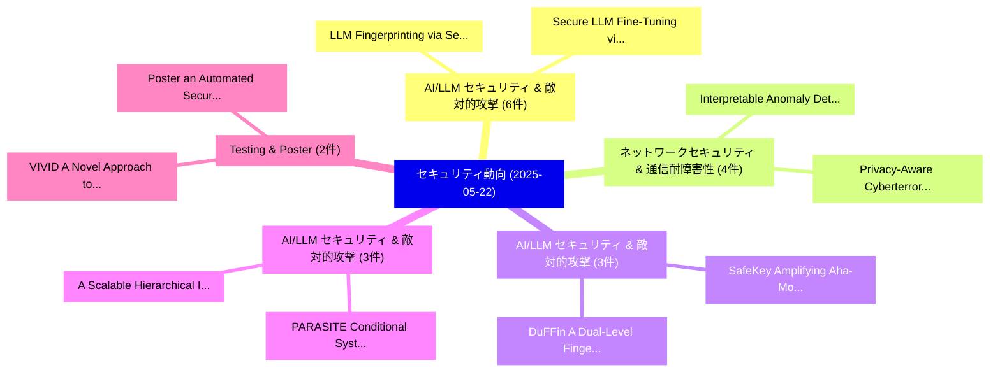

# 📅 02_daily: 日次エグゼクティブサマリー報告書 (2025-05-22)

**集計日時**: 2026-10-02 23:05:27 UTC  
**対象日付**: 2025-05-22  
**本日収集論文数**: 44 件  

---

## 💡 主要セキュリティ動向・脅威インサイト (Executive Insights)

本日の収集論文（計 44 件）において、以下の重点セキュリティ領域で活発な研究動向が確認されました：
- **AI/LLM セキュリティ & 敵対的攻撃** (6 件): 注目論文として 「LLM Fingerprinting via Semanti...」、「Secure LLM Fine-Tuning via Saf...」 等が発表され、実務防御および攻撃検証の進展が見られます。
- **ネットワークセキュリティ & 通信耐障害性** (4 件): 注目論文として 「Interpretable Anomaly Detectio...」、「Privacy-Aware Cyberterrorism N...」 等が発表され、実務防御および攻撃検証の進展が見られます。
- **AI/LLM セキュリティ & 敵対的攻撃** (3 件): 注目論文として 「SafeKey: Amplifying Aha-Moment...」、「DuFFin: A Dual-Level Fingerpri...」 等が発表され、実務防御および攻撃検証の進展が見られます。
- **AI/LLM セキュリティ & 敵対的攻撃** (3 件): 注目論文として 「A Scalable Hierarchical Intrus...」、「PARASITE: Conditional System P...」 等が発表され、実務防御および攻撃検証の進展が見られます。
- **Testing & Poster** (2 件): 注目論文として 「VIVID: A Novel Approach to Rem...」、「Poster: an Automated Security ...」 等が発表され、実務防御および攻撃検証の進展が見られます。

### 🗺️ 技術・脅威トピックマインドマップ

---

## 📌 日次セキュリティ論文一覧 (日本語表形式)

| No | arXiv ID | 論文タイトル (日本語訳) | 重要キーワード | 構造化エグゼクティブ要約 (背景・提案・影響) | 脅威分類 | 詳細リンク |
|---|---|---|---|---|---|---|
| 1 | `2505.16112v2` | [Extensible Post Quantum Cryptography Based Authentication（セキュリティ分析論文）](../../okf/papers/2025-05-22/2505.16112.md) | `Extensible Post Quantum Cryptography Based Authentication`, `Rahul Singh`, `Sanju Lama` | 【提案】概要 (Overview & Key Finding) 本論文「Extensible Post 量子 暗号技術 Based Authentication（セキュリティ分析論文...。実証評価によりSutherland - **公開。 | `cs.CR` | [arXiv](https://arxiv.org/abs/2505.16112v2) &#124; [OKF](../../okf/papers/2025-05-22/2505.16112.md) |
| 2 | `2505.16137v1` | [Outsourcing SAT-based Verification Computations in Network Security（セキュリティ分析論文）](../../okf/papers/2025-05-22/2505.16137.md) | `Verification Computations`, `Network Security`, `SAT-based Verification` | 【提案】概要 (Overview & Key Finding) 本論文「Outsourcing SAT-based Verification Computations in Netw...。実証評価により経営層・セキュリティ管理者向け推奨アクション (E... | `cs.CR` | [arXiv](https://arxiv.org/abs/2505.16137v1) &#124; [OKF](../../okf/papers/2025-05-22/2505.16137.md) |
| 3 | `2505.16186v2` | [SafeKey: Amplifying Aha-Moment Insights for Safety Reasoning（セキュリティ分析論文）](../../okf/papers/2025-05-22/2505.16186.md) | `Amplifying Aha`, `Moment Insights`, `Safety Reasoning` | 【提案】概要 (Overview & Key Finding) 本論文「SafeKey: Amplifying Aha-Moment Insights for Safety Reas...。実証評価により経営層・セキュリティ管理者向け推奨アクション (E... | `cs.CR` | [arXiv](https://arxiv.org/abs/2505.16186v2) &#124; [OKF](../../okf/papers/2025-05-22/2505.16186.md) |
| 4 | `2505.16205v1` | [VIVID: A Novel Approach to Remediation Prioritization in Static Application Security Testing (SAST)（セキュリティ分析論文）](../../okf/papers/2025-05-22/2505.16205.md) | `Static Application Security Testing`, `Remediation Prioritization`, `Naeem Budhwani` | 【提案】概要 (Overview & Key Finding) 本論文「VIVID: A Novel Approach to Remediation Prioritization i...。実証評価により経営層・セキュリティ管理者向け推奨アクション (E... | `cs.CR` | [arXiv](https://arxiv.org/abs/2505.16205v1) &#124; [OKF](../../okf/papers/2025-05-22/2505.16205.md) |
| 5 | `2505.16215v1` | [A Scalable Hierarchical Intrusion Detection System for Internet of Vehicles（セキュリティ分析論文）](../../okf/papers/2025-05-22/2505.16215.md) | `Scalable Hierarchical Intrusion Detection System`, `Md Ashraf Uddin`, `Reza Rafeh` | 【提案】概要 (Overview & Key Finding) 本論文「A Scalable Hierarchical Intrusion Detection System for ...。実証評価により経営層・セキュリティ管理者向け推奨アクション (E... | `cs.CR` | [arXiv](https://arxiv.org/abs/2505.16215v1) &#124; [OKF](../../okf/papers/2025-05-22/2505.16215.md) |
| 6 | `2505.16246v2` | [Verifiable Exponential Mechanism for Median Estimation（セキュリティ分析論文）](../../okf/papers/2025-05-22/2505.16246.md) | `Verifiable Exponential Mechanism`, `Median Estimation`, `Hyukjun Kwon` | 【提案】概要 (Overview & Key Finding) 本論文「Verifiable Exponential Mechanism for Median Estimation（...。実証評価により経営層・セキュリティ管理者向け推奨アクション (E... | `cs.CR` | [arXiv](https://arxiv.org/abs/2505.16246v2) &#124; [OKF](../../okf/papers/2025-05-22/2505.16246.md) |
| 7 | `2505.16261v1` | [Interpretable Anomaly Detection in Encrypted Traffic Using SHAP with Machine Learning Models（セキュリティ分析論文）](../../okf/papers/2025-05-22/2505.16261.md) | `Interpretable Anomaly Detection`, `Encrypted Traffic Using`, `Machine Learning Models` | 【提案】概要 (Overview & Key Finding) 本論文「Interpretable Anomaly Detection in Encrypted Traffic Us...。実証評価により経営層・セキュリティ管理者向け推奨アクション (E... | `cs.CR` | [arXiv](https://arxiv.org/abs/2505.16261v1) &#124; [OKF](../../okf/papers/2025-05-22/2505.16261.md) |
| 8 | `2505.16263v1` | [All You Need is "Leet": Evading Hate-speech Detection AI（セキュリティ分析論文）](../../okf/papers/2025-05-22/2505.16263.md) | `Evading Hate`, `Hate-speech Detection`, `Sampanna Yashwant Kahu` | 【提案】概要 (Overview & Key Finding) 本論文「All You Need is "Leet": Evading Hate-speech Detection A...。実証評価により経営層・セキュリティ管理者向け推奨アクション (E... | `cs.CR` | [arXiv](https://arxiv.org/abs/2505.16263v1) &#124; [OKF](../../okf/papers/2025-05-22/2505.16263.md) |
| 9 | `2505.16300v1` | [Poster: an Automated Security Testing Framework for Industrial UEsに向けて](../../okf/papers/2025-05-22/2505.16300.md) | `Daniel Eguiguren Chavez`, `Sotiris Michaelides`, `Martin Henze` | 【提案】概要 (Overview & Key Finding) 本論文「Poster: an Automated Security Testing Framework for Ind...。実証評価により経営層・セキュリティ管理者向け推奨アクション (E... | `cs.CR` | [arXiv](https://arxiv.org/abs/2505.16300v1) &#124; [OKF](../../okf/papers/2025-05-22/2505.16300.md) |
| 10 | `2505.16318v1` | [SuperPure: Efficient Purification of Localized and Distributed Adversarial Patches via Super-Resolution GAN Models（セキュリティ分析論文）](../../okf/papers/2025-05-22/2505.16318.md) | `Distributed Adversarial Patches`, `Efficient Purification`, `Super-Resolution GAN` | 【提案】概要 (Overview & Key Finding) 本論文「SuperPure: Efficient Purification of Localized and Dist...。実証評価により経営層・セキュリティ管理者向け推奨アクション (E... | `cs.CR` | [arXiv](https://arxiv.org/abs/2505.16318v1) &#124; [OKF](../../okf/papers/2025-05-22/2505.16318.md) |
| 11 | `2505.16366v1` | [ReCopilot: Reverse Engineering Copilot in Binary Analysis（セキュリティ分析論文）](../../okf/papers/2025-05-22/2505.16366.md) | `Reverse Engineering Copilot`, `Guoqiang Chen`, `Huiqi Sun` | 【提案】概要 (Overview & Key Finding) 本論文「ReCopilot: Reverse Engineering Copilot in Binary Analys...。実証評価により経営層・セキュリティ管理者向け推奨アクション (E... | `cs.CR` | [arXiv](https://arxiv.org/abs/2505.16366v1) &#124; [OKF](../../okf/papers/2025-05-22/2505.16366.md) |
| 12 | `2505.16371v1` | [Privacy-Aware Cyberterrorism Network Analysis using Graph Neural Networks and 連合学習](../../okf/papers/2025-05-22/2505.16371.md) | `Graph Neural Networks`, `Privacy-Aware Cyberterrorism`, `Federated Learning` | 【提案】概要 (Overview & Key Finding) 本論文「Privacy-Aware Cyberterrorism Network Analysis using Gra...。実証評価により経営層・セキュリティ管理者向け推奨アクション (E... | `cs.CR` | [arXiv](https://arxiv.org/abs/2505.16371v1) &#124; [OKF](../../okf/papers/2025-05-22/2505.16371.md) |
| 13 | `2505.16398v1` | [Consistent and Compatible Modelling of Cyber Intrusions and Incident Response Demonstrated in the Context of Malware Attacks on Critical Infrastructure（セキュリティ分析論文）](../../okf/papers/2025-05-22/2505.16398.md) | `Incident Response Demonstrated`, `Compatible Modelling`, `Cyber Intrusions` | 【提案】概要 (Overview & Key Finding) 本論文「Consistent and Compatible Modelling of Cyber Intrusions...。実証評価により# Consistent and Compatib... | `cs.CR` | [arXiv](https://arxiv.org/abs/2505.16398v1) &#124; [OKF](../../okf/papers/2025-05-22/2505.16398.md) |
| 14 | `2505.16439v2` | [Password Strength Detection via Machine Learning: Analysis, Modeling, and Evaluation（セキュリティ分析論文）](../../okf/papers/2025-05-22/2505.16439.md) | `Password Strength Detection`, `Machine Learning`, `Jiazhi Mo` | 【提案】概要 (Overview & Key Finding) 本論文「Password Strength Detection via Machine Learning: Analy...。実証評価により経営層・セキュリティ管理者向け推奨アクション (E... | `cs.CR` | [arXiv](https://arxiv.org/abs/2505.16439v2) &#124; [OKF](../../okf/papers/2025-05-22/2505.16439.md) |
| 15 | `2505.16503v2` | [Language-based Security and Time-inserting Supervisor（セキュリティ分析論文）](../../okf/papers/2025-05-22/2505.16503.md) | `Language-based Security`, `Time-inserting Supervisor`, `Raw Meta` | 【提案】概要 (Overview & Key Finding) 本論文「Language-based Security and Time-inserting Supervisor（セ...。実証評価によりGruska - **公開日時**: `2025-... | `cs.CR` | [arXiv](https://arxiv.org/abs/2505.16503v2) &#124; [OKF](../../okf/papers/2025-05-22/2505.16503.md) |
| 16 | `2505.16530v2` | [DuFFin: A Dual-Level Fingerprinting Framework for LLMs IP Protection（セキュリティ分析論文）](../../okf/papers/2025-05-22/2505.16530.md) | `Dual-Level Fingerprinting`, `Yuliang Yan`, `Haochun Tang` | 【提案】概要 (Overview & Key Finding) 本論文「DuFFin: A Dual-Level Fingerprinting Framework for LLMs ...。実証評価により経営層・セキュリティ管理者向け推奨アクション (E... | `cs.CR` | [arXiv](https://arxiv.org/abs/2505.16530v2) &#124; [OKF](../../okf/papers/2025-05-22/2505.16530.md) |
| 17 | `2505.16559v1` | [CTRAP: Embedding Collapse Trap to Safeguard 大規模言語モデル from Harmful Fine-Tuning](../../okf/papers/2025-05-22/2505.16559.md) | `Embedding Collapse Trap`, `Harmful Fine`, `Safeguard Large Language Models` | 【提案】概要 (Overview & Key Finding) 本論文「CTRAP: Embedding Collapse Trap to Safeguard 大規模言語モデル fr...。実証評価により経営層・セキュリティ管理者向け推奨アクション (E... | `cs.CR` | [arXiv](https://arxiv.org/abs/2505.16559v1) &#124; [OKF](../../okf/papers/2025-05-22/2505.16559.md) |
| 18 | `2505.16567v3` | [Watch your steps: Dormant Adversarial Behaviors that Activate upon LLM Finetuning（セキュリティ分析論文）](../../okf/papers/2025-05-22/2505.16567.md) | `Dormant Adversarial Behaviors`, `Thibaud Gloaguen`, `Mark Vero` | 【提案】概要 (Overview & Key Finding) 本論文「Watch your steps: Dormant Adversarial Behaviors that Ac...。実証評価により経営層・セキュリティ管理者向け推奨アクション (E... | `cs.CR` | [arXiv](https://arxiv.org/abs/2505.16567v3) &#124; [OKF](../../okf/papers/2025-05-22/2505.16567.md) |
| 19 | `2505.16614v1` | [Energy Consumption Framework and Post-Quantum Key-Generation on Embedded Devicesの分析](../../okf/papers/2025-05-22/2505.16614.md) | `Quantum Key`, `Post-Quantum Key`, `Embedded Devices` | 【提案】概要 (Overview & Key Finding) 本論文「Energy Consumption Framework and Post-量子 Key-Generation...。実証評価により経営層・セキュリティ管理者向け推奨アクション (E... | `cs.CR` | [arXiv](https://arxiv.org/abs/2505.16614v1) &#124; [OKF](../../okf/papers/2025-05-22/2505.16614.md) |
| 20 | `2505.16640v1` | [BadVLA: Backdoor Attacks on Vision-Language-Action Models via Objective-Decoupled Optimizationに向けて](../../okf/papers/2025-05-22/2505.16640.md) | `Action Models`, `Backdoor Attacks`, `Towards Backdoor Attacks` | 【提案】概要 (Overview & Key Finding) 本論文「BadVLA: Backdoor Attacks on Vision-Language-Action Mode...。実証評価により経営層・セキュリティ管理者向け推奨アクション (E... | `cs.CR` | [arXiv](https://arxiv.org/abs/2505.16640v1) &#124; [OKF](../../okf/papers/2025-05-22/2505.16640.md) |
| 21 | `2505.16650v1` | [Unsupervised Network Anomaly Detection with Autoencoders and Traffic Images（セキュリティ分析論文）](../../okf/papers/2025-05-22/2505.16650.md) | `Unsupervised Network Anomaly Detection`, `Traffic Images`, `Michael Neri` | 【提案】概要 (Overview & Key Finding) 本論文「Unsupervised Network Anomaly Detection with Autoencoder...。実証評価により経営層・セキュリティ管理者向け推奨アクション (E... | `cs.CR` | [arXiv](https://arxiv.org/abs/2505.16650v1) &#124; [OKF](../../okf/papers/2025-05-22/2505.16650.md) |
| 22 | `2505.16670v4` | [BitHydra: Bit-flip Inference Cost Attack against Large Language Modelsに向けて](../../okf/papers/2025-05-22/2505.16670.md) | `Inference Cost Attack`, `Bit-flip Inference`, `Large Language Models` | 【提案】概要 (Overview & Key Finding) 本論文「BitHydra: Bit-flip Inference Cost Attack against Large ...。実証評価により経営層・セキュリティ管理者向け推奨アクション (E... | `cs.CR` | [arXiv](https://arxiv.org/abs/2505.16670v4) &#124; [OKF](../../okf/papers/2025-05-22/2505.16670.md) |
| 23 | `2505.16723v3` | [LLM Fingerprinting via Semantically Conditioned Watermarks（セキュリティ分析論文）](../../okf/papers/2025-05-22/2505.16723.md) | `Semantically Conditioned Watermarks`, `Thibaud Gloaguen`, `Robin Staab` | 【提案】概要 (Overview & Key Finding) 本論文「LLM Fingerprinting via Semantically Conditioned Waterma...。実証評価により経営層・セキュリティ管理者向け推奨アクション (E... | `cs.CR` | [arXiv](https://arxiv.org/abs/2505.16723v3) &#124; [OKF](../../okf/papers/2025-05-22/2505.16723.md) |
| 24 | `2505.16737v2` | [Secure LLM Fine-Tuning via Safety-Aware Probing（セキュリティ分析論文）](../../okf/papers/2025-05-22/2505.16737.md) | `Aware Probing`, `Fine-Tuning via`, `Safety-Aware Probing` | 【提案】概要 (Overview & Key Finding) 本論文「Secure LLM Fine-Tuning via Safety-Aware Probing（セキュリティ分...。実証評価により経営層・セキュリティ管理者向け推奨アクション (E... | `cs.CR` | [arXiv](https://arxiv.org/abs/2505.16737v2) &#124; [OKF](../../okf/papers/2025-05-22/2505.16737.md) |
| 25 | `2505.16765v2` | [Hiding in Plain Sight: A Steganographic Approach to Stealthy LLM Jailbreaks（セキュリティ分析論文）](../../okf/papers/2025-05-22/2505.16765.md) | `Plain Sight`, `Jianing Geng`, `Biao Yi` | 【提案】概要 (Overview & Key Finding) 本論文「Hiding in Plain Sight: A Steganographic Approach to Ste...。実証評価により経営層・セキュリティ管理者向け推奨アクション (E... | `cs.CR` | [arXiv](https://arxiv.org/abs/2505.16765v2) &#124; [OKF](../../okf/papers/2025-05-22/2505.16765.md) |
| 26 | `2505.16785v1` | [CoTSRF: Utilize Chain of Thought as Stealthy and Robust Fingerprint of 大規模言語モデル](../../okf/papers/2025-05-22/2505.16785.md) | `Utilize Chain`, `Robust Fingerprint`, `Large Language Models` | 【提案】概要 (Overview & Key Finding) 本論文「CoTSRF: Utilize Chain of Thought as Stealthy and Robust...。実証評価により経営層・セキュリティ管理者向け推奨アクション (E... | `cs.CR` | [arXiv](https://arxiv.org/abs/2505.16785v1) &#124; [OKF](../../okf/papers/2025-05-22/2505.16785.md) |
| 27 | `2505.16831v3` | [Unlearning Isn't Deletion: Investigating Reversibility of Machine Unlearning in LLMs（セキュリティ分析論文）](../../okf/papers/2025-05-22/2505.16831.md) | `Unlearning Isn`, `Investigating Reversibility`, `Machine Unlearning` | 【提案】概要 (Overview & Key Finding) 本論文「Unlearning Isn't Deletion: Investigating Reversibility ...。実証評価により経営層・セキュリティ管理者向け推奨アクション (E... | `cs.CR` | [arXiv](https://arxiv.org/abs/2505.16831v3) &#124; [OKF](../../okf/papers/2025-05-22/2505.16831.md) |
| 28 | `2505.16888v4` | [PARASITE: Conditional System Prompt Poisoning to Hijack LLMs（セキュリティ分析論文）](../../okf/papers/2025-05-22/2505.16888.md) | `Conditional System Prompt Poisoning`, `Viet Pham`, `Thai Le` | 【提案】概要 (Overview & Key Finding) 本論文「PARASITE: Conditional System Prompt Poisoning to Hijack...。実証評価により経営層・セキュリティ管理者向け推奨アクション (E... | `cs.CR` | [arXiv](https://arxiv.org/abs/2505.16888v4) &#124; [OKF](../../okf/papers/2025-05-22/2505.16888.md) |
| 29 | `2505.16916v1` | [Backdoor Cleaning without External Guidance in MLLM Fine-tuning（セキュリティ分析論文）](../../okf/papers/2025-05-22/2505.16916.md) | `Backdoor Cleaning`, `External Guidance`, `Xuankun Rong` | 【提案】背景とセキュリティ上の課題 (Background & Problem) 本研究はサイバー脅威環境におけるセキュリティ構造・脆弱性の検証を目的としています。(主要検出項目: ...。実証評価により経営層・セキュリティ管理者向け推奨アクション (E... | `cs.CR` | [arXiv](https://arxiv.org/abs/2505.16916v1) &#124; [OKF](../../okf/papers/2025-05-22/2505.16916.md) |
| 30 | `2505.16957v1` | [Invisible Prompts, Visible Threats: Malicious Font Injection in External Resources for 大規模言語モデル](../../okf/papers/2025-05-22/2505.16957.md) | `Malicious Font Injection`, `Invisible Prompts`, `Visible Threats` | 【提案】概要 (Overview & Key Finding) 本論文「Invisible Prompts, Visible Threats: Malicious Font Inje...。実証評価により経営層・セキュリティ管理者向け推奨アクション (E... | `cs.CR` | [arXiv](https://arxiv.org/abs/2505.16957v1) &#124; [OKF](../../okf/papers/2025-05-22/2505.16957.md) |
| 31 | `2505.17145v1` | [LLM Access Shield: Domain-Specific LLM Framework for プライバシーポリシー Compliance](../../okf/papers/2025-05-22/2505.17145.md) | `Access Shield`, `Domain-Specific LLM`, `Privacy Policy Compliance` | 【提案】概要 (Overview & Key Finding) 本論文「LLM Access Shield: Domain-Specific LLM Framework for プラ...。実証評価により経営層・セキュリティ管理者向け推奨アクション (E... | `cs.CR` | [arXiv](https://arxiv.org/abs/2505.17145v1) &#124; [OKF](../../okf/papers/2025-05-22/2505.17145.md) |
| 32 | `2505.17147v1` | [MTSA: Multi-turn Safety Alignment for LLMs through Multi-round Red-teaming（セキュリティ分析論文）](../../okf/papers/2025-05-22/2505.17147.md) | `Safety Alignment`, `Multi-turn Safety`, `Multi-round Red` | 【提案】概要 (Overview & Key Finding) 本論文「MTSA: Multi-turn Safety Alignment for LLMs through Mult...。実証評価により経営層・セキュリティ管理者向け推奨アクション (E... | `cs.CR` | [arXiv](https://arxiv.org/abs/2505.17147v1) &#124; [OKF](../../okf/papers/2025-05-22/2505.17147.md) |
| 33 | `2505.17160v1` | [Harry Potter is Still Here! Probing Knowledge Leakage in Targeted Unlearned 大規模言語モデル via Automated Adversarial Prompting](../../okf/papers/2025-05-22/2505.17160.md) | `Probing Knowledge Leakage`, `Automated Adversarial Prompting`, `Harry Potter` | 【提案】Probing Knowledge Leakage in Targeted Unlearned Large Language Models via Automated Adv...。実証評価により経営層・セキュリティ管理者向け推奨アクション (E... | `cs.CR` | [arXiv](https://arxiv.org/abs/2505.17160v1) &#124; [OKF](../../okf/papers/2025-05-22/2505.17160.md) |
| 34 | `2505.17224v1` | [Dynamic Encryption-Based Cloud Security Model using Facial Image and Password-based Key Generation for Multimedia Data（セキュリティ分析論文）](../../okf/papers/2025-05-22/2505.17224.md) | `Based Cloud Security Model`, `Dynamic Encryption`, `Facial Image` | 【提案】概要 (Overview & Key Finding) 本論文「Dynamic Encryption-Based Cloud Security Model using Fac...。実証評価により経営層・セキュリティ管理者向け推奨アクション (E... | `cs.CR` | [arXiv](https://arxiv.org/abs/2505.17224v1) &#124; [OKF](../../okf/papers/2025-05-22/2505.17224.md) |
| 35 | `2505.17226v2` | [Secure and Private 連合学習: Achieving Adversarial Resilience through Robust Aggregation](../../okf/papers/2025-05-22/2505.17226.md) | `Achieving Adversarial Resilience`, `Robust Aggregation`, `Private Federated Learning` | 【提案】概要 (Overview & Key Finding) 本論文「Secure and Private 連合学習: Achieving Adversarial Resilien...。実証評価により# Secure and Private Fede... | `cs.CR` | [arXiv](https://arxiv.org/abs/2505.17226v2) &#124; [OKF](../../okf/papers/2025-05-22/2505.17226.md) |
| 36 | `2505.17236v2` | [LogStamping: A blockchain-based log auditing approach for large-scale systems（セキュリティ分析論文）](../../okf/papers/2025-05-22/2505.17236.md) | `blockchain-based log`, `large-scale systems`, `Md Shariful Islam` | 【提案】概要 (Overview & Key Finding) 本論文「LogStamping: A blockchain-based log auditing approach f...。実証評価により経営層・セキュリティ管理者向け推奨アクション (E... | `cs.CR` | [arXiv](https://arxiv.org/abs/2505.17236v2) &#124; [OKF](../../okf/papers/2025-05-22/2505.17236.md) |
| 37 | `2505.17248v3` | [Backdoors in DRL: Four Environments Focusing on In-distribution Triggers（セキュリティ分析論文）](../../okf/papers/2025-05-22/2505.17248.md) | `Four Environments Focusing`, `In-distribution Triggers`, `Chace Ashcraft` | 【提案】概要 (Overview & Key Finding) 本論文「Backdoors in DRL: Four Environments Focusing on In-dist...。実証評価により経営層・セキュリティ管理者向け推奨アクション (E... | `cs.CR` | [arXiv](https://arxiv.org/abs/2505.17248v3) &#124; [OKF](../../okf/papers/2025-05-22/2505.17248.md) |
| 38 | `2505.17253v1` | [Understanding the Security Landscape of Embedded Non-Volatile Memories: A Comprehensive Survey（セキュリティ分析論文）](../../okf/papers/2025-05-22/2505.17253.md) | `Security Landscape`, `Embedded Non`, `Volatile Memories` | 【提案】概要 (Overview & Key Finding) 本論文「Understanding the Security Landscape of Embedded Non-Vo...。実証評価により経営層・セキュリティ管理者向け推奨アクション (E... | `cs.CR` | [arXiv](https://arxiv.org/abs/2505.17253v1) &#124; [OKF](../../okf/papers/2025-05-22/2505.17253.md) |
| 39 | `2505.17274v1` | [Vehicular Intrusion Detection System for Controller Area Network: A Comprehensive Survey and Evaluation（セキュリティ分析論文）](../../okf/papers/2025-05-22/2505.17274.md) | `Vehicular Intrusion Detection System`, `Controller Area Network`, `Comprehensive Survey` | 【提案】概要 (Overview & Key Finding) 本論文「Vehicular Intrusion Detection System for Controller Are...。実証評価により経営層・セキュリティ管理者向け推奨アクション (E... | `cs.CR` | [arXiv](https://arxiv.org/abs/2505.17274v1) &#124; [OKF](../../okf/papers/2025-05-22/2505.17274.md) |
| 40 | `2505.17310v2` | [Advancing Security with Digital Twins: A Comprehensive Survey（セキュリティ分析論文）](../../okf/papers/2025-05-22/2505.17310.md) | `Advancing Security`, `Digital Twins`, `Comprehensive Survey` | 【提案】概要 (Overview & Key Finding) 本論文「Advancing Security with Digital Twins: A Comprehensive ...。実証評価により経営層・セキュリティ管理者向け推奨アクション (E... | `cs.CR` | [arXiv](https://arxiv.org/abs/2505.17310v2) &#124; [OKF](../../okf/papers/2025-05-22/2505.17310.md) |
| 41 | `2505.17335v2` | [Secure Parsing and Serializing with Separation Logic Applied to CBOR, CDDL, and COSE（セキュリティ分析論文）](../../okf/papers/2025-05-22/2505.17335.md) | `Separation Logic Applied`, `Secure Parsing`, `Tahina Ramananandro` | 【提案】概要 (Overview & Key Finding) 本論文「Secure Parsing and Serializing with Separation Logic Ap...。実証評価により経営層・セキュリティ管理者向け推奨アクション (E... | `cs.CR` | [arXiv](https://arxiv.org/abs/2505.17335v2) &#124; [OKF](../../okf/papers/2025-05-22/2505.17335.md) |
| 42 | `2506.05358v1` | [Can ChatGPT Perform Image Splicing Detection? A Preliminary Study（セキュリティ分析論文）](../../okf/papers/2025-05-22/2506.05358.md) | `Perform Image Splicing Detection`, `Souradip Nath`, `Raw Meta` | 【提案】A Preliminary Study ### (日本語題名: Can ChatGPT Perform Image Splicing Detection?。実証評価により経営層・セキュリティ管理者向け推奨アクション (Executive Reco... | `cs.CR` | [arXiv](https://arxiv.org/abs/2506.05358v1) &#124; [OKF](../../okf/papers/2025-05-22/2506.05358.md) |
| 43 | `2506.05359v1` | [Enhancing Meme Token Market Transparency: A Multi-Dimensional Entity-Linked Address Analysis for Liquidity Risk Evaluation（セキュリティ分析論文）](../../okf/papers/2025-05-22/2506.05359.md) | `Enhancing Meme Token Market Transparency`, `Dimensional Entity`, `Multi-Dimensional Entity` | 【提案】概要 (Overview & Key Finding) 本論文「Enhancing Meme Token Market Transparency: A Multi-Dimen...。実証評価により経営層・セキュリティ管理者向け推奨アクション (E... | `cs.CR` | [arXiv](https://arxiv.org/abs/2506.05359v1) &#124; [OKF](../../okf/papers/2025-05-22/2506.05359.md) |
| 44 | `2506.12032v1` | [Embedding Trust at Scale: Physics-Aware Neural Watermarking for Secure and Verifiable Data Pipelines（セキュリティ分析論文）](../../okf/papers/2025-05-22/2506.12032.md) | `Aware Neural Watermarking`, `Verifiable Data Pipelines`, `Embedding Trust` | 【提案】概要 (Overview & Key Finding) 本論文「Embedding Trust at Scale: Physics-Aware Neural Watermar...。実証評価により経営層・セキュリティ管理者向け推奨アクション (E... | `cs.CR` | [arXiv](https://arxiv.org/abs/2506.12032v1) &#124; [OKF](../../okf/papers/2025-05-22/2506.12032.md) |

