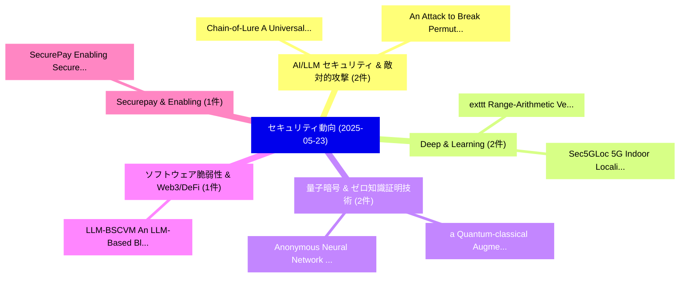

# 📅 02_daily: 日次エグゼクティブサマリー報告書 (2025-05-23)

**集計日時**: 2026-10-02 23:05:27 UTC  
**対象日付**: 2025-05-23  
**本日収集論文数**: 21 件  

---

## 💡 主要セキュリティ動向・脅威インサイト (Executive Insights)

本日の収集論文（計 21 件）において、以下の重点セキュリティ領域で活発な研究動向が確認されました：
- **AI/LLM セキュリティ & 敵対的攻撃** (2 件): 注目論文として 「Chain-of-Lure: A Universal Jai...」、「An Attack to Break Permutation...」 等が発表され、実務防御および攻撃検証の進展が見られます。
- **Deep & Learning** (2 件): 注目論文として 「exttt{Range-Arithmetic}: Verif...」、「Sec5GLoc: 5G Indoor Localizati...」 等が発表され、実務防御および攻撃検証の進展が見られます。
- **量子暗号 & ゼロ知識証明技術** (2 件): 注目論文として 「a Quantum-classical Augmented ...」、「Anonymous Neural Network Infer...」 等が発表され、実務防御および攻撃検証の進展が見られます。
- **ソフトウェア脆弱性 & Web3/DeFi** (1 件): 注目論文として 「LLM-BSCVM: An LLM-Based Blockc...」 等が発表され、実務防御および攻撃検証の進展が見られます。
- **Securepay & Enabling** (1 件): 注目論文として 「SecurePay: Enabling Secure and...」 等が発表され、実務防御および攻撃検証の進展が見られます。

### 🗺️ 技術・脅威トピックマインドマップ

---

## 📌 日次セキュリティ論文一覧 (日本語表形式)

| No | arXiv ID | 論文タイトル (日本語訳) | 重要キーワード | 構造化エグゼクティブ要約 (背景・提案・影響) | 脅威分類 | 詳細リンク |
|---|---|---|---|---|---|---|
| 1 | `2505.17416v1` | [LLM-BSCVM: An LLM-Based Blockchain Smart Contract Vulnerability Management Framework（セキュリティ分析論文）](../../okf/papers/2025-05-23/2505.17416.md) | `LLM-Based Blockchain`, `Based Blockchain Smart`, `Yanli Jin` | 【提案】概要 (Overview & Key Finding) 本論文「LLM-BSCVM: An LLM-Based Blockchain スマートコントラクト 脆弱性 Manag...。実証評価により経営層・セキュリティ管理者向け推奨アクション (E... | `cs.CR` | [arXiv](https://arxiv.org/abs/2505.17416v1) &#124; [OKF](../../okf/papers/2025-05-23/2505.17416.md) |
| 2 | `2505.17466v1` | [SecurePay: Enabling Secure and Fast Payment Processing for Platform Economy（セキュリティ分析論文）](../../okf/papers/2025-05-23/2505.17466.md) | `Fast Payment Processing`, `Enabling Secure`, `Platform Economy` | 【提案】概要 (Overview & Key Finding) 本論文「SecurePay: Enabling Secure and Fast Payment Processing ...。実証評価により経営層・セキュリティ管理者向け推奨アクション (E... | `cs.CR` | [arXiv](https://arxiv.org/abs/2505.17466v1) &#124; [OKF](../../okf/papers/2025-05-23/2505.17466.md) |
| 3 | `2505.17502v2` | [Demonstration of Quantum-Secure Communications in a Nuclear Reactor（セキュリティ分析論文）](../../okf/papers/2025-05-23/2505.17502.md) | `Secure Communications`, `Nuclear Reactor`, `Quantum-Secure Communications` | 【提案】概要 (Overview & Key Finding) 本論文「Demonstration of 量子-Secure Communications in a Nuclear ...。実証評価により経営層・セキュリティ管理者向け推奨アクション (E... | `cs.CR` | [arXiv](https://arxiv.org/abs/2505.17502v2) &#124; [OKF](../../okf/papers/2025-05-23/2505.17502.md) |
| 4 | `2505.17519v3` | [Chain-of-Lure: A Universal Jailbreak Attack Framework using Unconstrained Synthetic Narratives（セキュリティ分析論文）](../../okf/papers/2025-05-23/2505.17519.md) | `Unconstrained Synthetic Narratives`, `Unconstrained Synthetic Nar`, `Wenhan Chang` | 【提案】概要 (Overview & Key Finding) 本論文「Chain-of-Lure: A Universal ジェイルブレイク Attack Framework us...。実証評価により経営層・セキュリティ管理者向け推奨アクション (E... | `cs.CR` | [arXiv](https://arxiv.org/abs/2505.17519v3) &#124; [OKF](../../okf/papers/2025-05-23/2505.17519.md) |
| 5 | `2505.17527v1` | [Adaptively Secure Distributed Broadcast Encryption with Linear-Size Public Parameters（セキュリティ分析論文）](../../okf/papers/2025-05-23/2505.17527.md) | `Adaptively Secure Distributed Broadcast Encryption`, `Size Public Parameters`, `Linear-Size Public` | 【提案】概要 (Overview & Key Finding) 本論文「Adaptively Secure Distributed Broadcast Encryption with...。実証評価により経営層・セキュリティ管理者向け推奨アクション (E... | `cs.CR` | [arXiv](https://arxiv.org/abs/2505.17527v1) &#124; [OKF](../../okf/papers/2025-05-23/2505.17527.md) |
| 6 | `2505.17568v3` | [JALMBench: Jailbreak Vulnerabilities in Audio Language Modelsのベンチマーク評価](../../okf/papers/2025-05-23/2505.17568.md) | `Jailbreak Vulnerabilities`, `Audio Language`, `Benchmarking Jailbreak Vulnerabilities` | 【提案】概要 (Overview & Key Finding) 本論文「JALMBench: ジェイルブレイク Vulnerabilities in Audio Language M...。実証評価により経営層・セキュリティ管理者向け推奨アクション (E... | `cs.CR` | [arXiv](https://arxiv.org/abs/2505.17568v3) &#124; [OKF](../../okf/papers/2025-05-23/2505.17568.md) |
| 7 | `2505.17586v1` | [大規模言語モデル in the IoT Ecosystem -- A Survey on Security Challenges and Applications](../../okf/papers/2025-05-23/2505.17586.md) | `Security Challenges`, `Large Language Models`, `Kushal Khatiwada` | 【提案】概要 (Overview & Key Finding) 本論文「大規模言語モデル in the IoT Ecosystem -- A Survey on Security C...。実証評価により経営層・セキュリティ管理者向け推奨アクション (E... | `cs.CR` | [arXiv](https://arxiv.org/abs/2505.17586v1) &#124; [OKF](../../okf/papers/2025-05-23/2505.17586.md) |
| 8 | `2505.17598v1` | [One Model Transfer to All: On Robust Jailbreak Prompts Generation against LLMs（セキュリティ分析論文）](../../okf/papers/2025-05-23/2505.17598.md) | `One Model Transfer`, `Linbao Li`, `Yannan Liu` | 【提案】概要 (Overview & Key Finding) 本論文「One Model Transfer to All: On Robust ジェイルブレイク Prompts G...。実証評価により経営層・セキュリティ管理者向け推奨アクション (E... | `cs.CR` | [arXiv](https://arxiv.org/abs/2505.17598v1) &#124; [OKF](../../okf/papers/2025-05-23/2505.17598.md) |
| 9 | `2505.17623v2` | [exttt{Range-Arithmetic}: Verifiable Deep Learning Inference on an Untrusted Party（セキュリティ分析論文）](../../okf/papers/2025-05-23/2505.17623.md) | `Verifiable Deep Learning Inference`, `Untrusted Party`, `Mohammad Ali Maddah` | 【提案】概要 (Overview & Key Finding) 本論文「\texttt{Range-Arithmetic}: Verifiable Deep Learning Inf...。実証評価により経営層・セキュリティ管理者向け推奨アクション (E... | `cs.CR` | [arXiv](https://arxiv.org/abs/2505.17623v2) &#124; [OKF](../../okf/papers/2025-05-23/2505.17623.md) |
| 10 | `2505.17776v1` | [Sec5GLoc: 5G Indoor Localization via Adversary-Resilient Deep Learning Architectureのセキュリティ強化](../../okf/papers/2025-05-23/2505.17776.md) | `Indoor Localization`, `Adversary-Resilient Deep`, `Resilient Deep Learning Architecture` | 【提案】概要 (Overview & Key Finding) 本論文「Sec5GLoc: 5G Indoor Localization via Adversary-Resilien...。実証評価により経営層・セキュリティ管理者向け推奨アクション (E... | `cs.CR` | [arXiv](https://arxiv.org/abs/2505.17776v1) &#124; [OKF](../../okf/papers/2025-05-23/2505.17776.md) |
| 11 | `2505.18135v2` | [Tool Preferences in Agentic LLMs are Unreliable（セキュリティ分析論文）](../../okf/papers/2025-05-23/2505.18135.md) | `Tool Preferences`, `Kazem Faghih`, `Wenxiao Wang` | 【提案】概要 (Overview & Key Finding) 本論文「Tool Preferences in Agentic LLMs are Unreliable（セキュリティ分...。実証評価により経営層・セキュリティ管理者向け推奨アクション (E... | `cs.CR` | [arXiv](https://arxiv.org/abs/2505.18135v2) &#124; [OKF](../../okf/papers/2025-05-23/2505.18135.md) |
| 12 | `2505.18242v2` | [Privacy-Preserving Bathroom Monitoring for Elderly Emergencies Using PIR and LiDAR Sensors（セキュリティ分析論文）](../../okf/papers/2025-05-23/2505.18242.md) | `Preserving Bathroom Monitoring`, `Elderly Emergencies Using`, `Privacy-Preserving Bathroom` | 【提案】概要 (Overview & Key Finding) 本論文「Privacy-Preserving Bathroom Monitoring for Elderly Emer...。実証評価により経営層・セキュリティ管理者向け推奨アクション (E... | `cs.CR` | [arXiv](https://arxiv.org/abs/2505.18242v2) &#124; [OKF](../../okf/papers/2025-05-23/2505.18242.md) |
| 13 | `2505.18282v1` | [a Quantum-classical Augmented Networkに向けて](../../okf/papers/2025-05-23/2505.18282.md) | `Quantum-classical Augmented`, `Augmented Network`, `Nitin Jha` | 【提案】概要 (Overview & Key Finding) 本論文「a 量子-classical Augmented Networkに向けて」（原題: Towards a 量子-...。実証評価により経営層・セキュリティ管理者向け推奨アクション (E... | `cs.CR` | [arXiv](https://arxiv.org/abs/2505.18282v1) &#124; [OKF](../../okf/papers/2025-05-23/2505.18282.md) |
| 14 | `2505.18290v1` | [EtherBee: A Global Dataset of Ethereum Node Performance Measurements Coupled with Honeypot Interactions and Full Network Sessions（セキュリティ分析論文）](../../okf/papers/2025-05-23/2505.18290.md) | `Ethereum Node Performance Measurements Coupled`, `Full Network Sessions`, `Global Dataset` | 【提案】概要 (Overview & Key Finding) 本論文「EtherBee: A Global Dataset of Ethereum Node Performance...。実証評価により経営層・セキュリティ管理者向け推奨アクション (E... | `cs.CR` | [arXiv](https://arxiv.org/abs/2505.18290v1) &#124; [OKF](../../okf/papers/2025-05-23/2505.18290.md) |
| 15 | `2505.18323v2` | [Architectural Backdoors for Within-Batch Data Stealing and Model Inference Manipulation（セキュリティ分析論文）](../../okf/papers/2025-05-23/2505.18323.md) | `Batch Data Stealing`, `Model Inference Manipulation`, `Architectural Backdoors` | 【提案】概要 (Overview & Key Finding) 本論文「Architectural Backdoors for Within-Batch Data Stealing ...。実証評価により経営層・セキュリティ管理者向け推奨アクション (E... | `cs.CR` | [arXiv](https://arxiv.org/abs/2505.18323v2) &#124; [OKF](../../okf/papers/2025-05-23/2505.18323.md) |
| 16 | `2505.18332v1` | [An Attack to Break Permutation-Based Private Third-Party Inference Schemes for LLMs（セキュリティ分析論文）](../../okf/papers/2025-05-23/2505.18332.md) | `Based Private Third`, `Party Inference Schemes`, `Break Permutation` | 【提案】概要 (Overview & Key Finding) 本論文「An Attack to Break Permutation-Based Private Third-Part...。実証評価により経営層・セキュリティ管理者向け推奨アクション (E... | `cs.CR` | [arXiv](https://arxiv.org/abs/2505.18332v1) &#124; [OKF](../../okf/papers/2025-05-23/2505.18332.md) |
| 17 | `2505.18333v1` | [A Critical Evaluation of Defenses against Prompt Injection Attacks（セキュリティ分析論文）](../../okf/papers/2025-05-23/2505.18333.md) | `Prompt Injection Attacks`, `Neil Zhenqiang Gong`, `Yuqi Jia` | 【提案】概要 (Overview & Key Finding) 本論文「A Critical Evaluation of Defenses against プロンプトインジェクション...。実証評価により経営層・セキュリティ管理者向け推奨アクション (E... | `cs.CR` | [arXiv](https://arxiv.org/abs/2505.18333v1) &#124; [OKF](../../okf/papers/2025-05-23/2505.18333.md) |
| 18 | `2505.18384v5` | [Dynamic Risk Assessments for Offensive サイバーセキュリティ Agents](../../okf/papers/2025-05-23/2505.18384.md) | `Dynamic Risk Assessments`, `Offensive Cybersecurity Agents`, `Boyi Wei` | 【提案】概要 (Overview & Key Finding) 本論文「Dynamic Risk Assessments for Offensive サイバーセキュリティ Agent...。実証評価により経営層・セキュリティ管理者向け推奨アクション (E... | `cs.CR` | [arXiv](https://arxiv.org/abs/2505.18384v5) &#124; [OKF](../../okf/papers/2025-05-23/2505.18384.md) |
| 19 | `2505.18386v1` | [Modeling interdependent privacy threats（セキュリティ分析論文）](../../okf/papers/2025-05-23/2505.18386.md) | `Shuaishuai Liu`, `Raw Meta`, `Executive Summary` | 【提案】概要 (Overview & Key Finding) 本論文「Modeling interdependent privacy threats（セキュリティ分析論文）」（原題...。実証評価により経営層・セキュリティ管理者向け推奨アクション (E... | `cs.CR` | [arXiv](https://arxiv.org/abs/2505.18386v1) &#124; [OKF](../../okf/papers/2025-05-23/2505.18386.md) |
| 20 | `2505.18398v1` | [Anonymous Neural Network Inferenceに向けて](../../okf/papers/2025-05-23/2505.18398.md) | `Towards Anonymous Neural Network Inference`, `Anonymous Neural Network`, `Liao Peiyuan` | 【提案】概要 (Overview & Key Finding) 本論文「Anonymous Neural Network Inferenceに向けて」（原題: Towards Ano...。実証評価により経営層・セキュリティ管理者向け推奨アクション (E... | `cs.CR` | [arXiv](https://arxiv.org/abs/2505.18398v1) &#124; [OKF](../../okf/papers/2025-05-23/2505.18398.md) |
| 21 | `2505.18402v1` | [AI/ML for 5G and Beyond サイバーセキュリティ](../../okf/papers/2025-05-23/2505.18402.md) | `Beyond Cybersecurity`, `Sandeep Pirbhulal`, `Habtamu Abie` | 【提案】概要 (Overview & Key Finding) 本論文「AI/ML for 5G and Beyond サイバーセキュリティ」（原題: AI/ML for 5G an...。実証評価により経営層・セキュリティ管理者向け推奨アクション (E... | `cs.CR` | [arXiv](https://arxiv.org/abs/2505.18402v1) &#124; [OKF](../../okf/papers/2025-05-23/2505.18402.md) |

