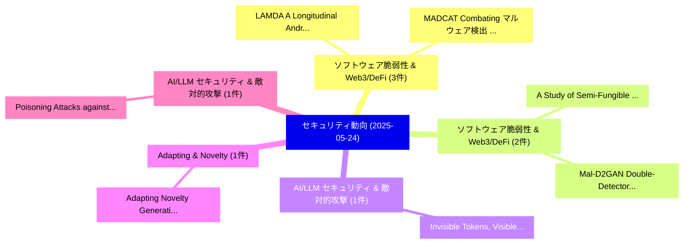

# 📅 02_daily: 日次エグゼクティブサマリー報告書 (2025-05-24)

**集計日時**: 2026-10-02 23:05:27 UTC  
**対象日付**: 2025-05-24  
**本日収集論文数**: 20 件  

---

## 💡 主要セキュリティ動向・脅威インサイト (Executive Insights)

本日の収集論文（計 20 件）において、以下の重点セキュリティ領域で活発な研究動向が確認されました：
- **ソフトウェア脆弱性 & Web3/DeFi** (3 件): 注目論文として 「LAMDA: A Longitudinal Android ...」、「MADCAT: Combating マルウェア検出 Unde...」 等が発表され、実務防御および攻撃検証の進展が見られます。
- **ソフトウェア脆弱性 & Web3/DeFi** (2 件): 注目論文として 「A Study of Semi-Fungible Token...」、「Mal-D2GAN: Double-Detector bas...」 等が発表され、実務防御および攻撃検証の進展が見られます。
- **AI/LLM セキュリティ & 敵対的攻撃** (1 件): 注目論文として 「Invisible Tokens, Visible Bill...」 等が発表され、実務防御および攻撃検証の進展が見られます。
- **Adapting & Novelty** (1 件): 注目論文として 「Adapting Novelty Generating An...」 等が発表され、実務防御および攻撃検証の進展が見られます。
- **AI/LLM セキュリティ & 敵対的攻撃** (1 件): 注目論文として 「Poisoning Attacks against Retr...」 等が発表され、実務防御および攻撃検証の進展が見られます。

### 🗺️ 技術・脅威トピックマインドマップ

---

## 📌 日次セキュリティ論文一覧 (日本語表形式)

| No | arXiv ID | 論文タイトル (日本語訳) | 重要キーワード | 構造化エグゼクティブ要約 (背景・提案・影響) | 脅威分類 | 詳細リンク |
|---|---|---|---|---|---|---|
| 1 | `2505.18471v1` | [Invisible Tokens, Visible Bills: The Urgent Need to Audit Hidden Operations in Opaque LLM Services（セキュリティ分析論文）](../../okf/papers/2025-05-24/2505.18471.md) | `Audit Hidden Operations`, `Invisible Tokens`, `Visible Bills` | 【提案】概要 (Overview & Key Finding) 本論文「Invisible Tokens, Visible Bills: The Urgent Need to Aud...。実証評価により経営層・セキュリティ管理者向け推奨アクション (E... | `cs.CR` | [arXiv](https://arxiv.org/abs/2505.18471v1) &#124; [OKF](../../okf/papers/2025-05-24/2505.18471.md) |
| 2 | `2505.18518v1` | [A Study of Semi-Fungible Token based Wi-Fi Access Control（セキュリティ分析論文）](../../okf/papers/2025-05-24/2505.18518.md) | `Fi Access Control`, `Fungible Token`, `Semi-Fungible Token` | 【提案】概要 (Overview & Key Finding) 本論文「A Study of Semi-Fungible Token based Wi-Fi アクセス制御（セキュリテ...。実証評価により経営層・セキュリティ管理者向け推奨アクション (E... | `cs.CR` | [arXiv](https://arxiv.org/abs/2505.18518v1) &#124; [OKF](../../okf/papers/2025-05-24/2505.18518.md) |
| 3 | `2505.18520v1` | [Adapting Novelty Generating Antigens for Antivirus systemsに向けて](../../okf/papers/2025-05-24/2505.18520.md) | `Adapting Novelty Generating Antigens`, `Adapting Novelty`, `Generating Antigens` | 【提案】概要 (Overview & Key Finding) 本論文「Adapting Novelty Generating Antigens for Antivirus syst...。実証評価により経営層・セキュリティ管理者向け推奨アクション (E... | `cs.CR` | [arXiv](https://arxiv.org/abs/2505.18520v1) &#124; [OKF](../../okf/papers/2025-05-24/2505.18520.md) |
| 4 | `2505.18543v1` | [Poisoning Attacks against Retrieval-Augmented Generationのベンチマーク評価](../../okf/papers/2025-05-24/2505.18543.md) | `Benchmarking Poisoning Attacks`, `Augmented Generation`, `Poisoning Attacks` | 【提案】概要 (Overview & Key Finding) 本論文「Poisoning Attacks against Retrieval-Augmented Generatio...。実証評価により経営層・セキュリティ管理者向け推奨アクション (E... | `cs.CR` | [arXiv](https://arxiv.org/abs/2505.18543v1) &#124; [OKF](../../okf/papers/2025-05-24/2505.18543.md) |
| 5 | `2505.18551v1` | [LAMDA: A Longitudinal Android Malware Benchmark for Concept Drift Analysis（セキュリティ分析論文）](../../okf/papers/2025-05-24/2505.18551.md) | `Longitudinal Android Malware Benchmark`, `Md Ahsanul Haque`, `Md Mahmuduzzaman Kamol` | 【提案】概要 (Overview & Key Finding) 本論文「LAMDA: A Longitudinal Android マルウェア Benchmark for Conce...。実証評価により経営層・セキュリティ管理者向け推奨アクション (E... | `cs.CR` | [arXiv](https://arxiv.org/abs/2505.18551v1) &#124; [OKF](../../okf/papers/2025-05-24/2505.18551.md) |
| 6 | `2505.18613v1` | [MLRan: A Behavioural Dataset for Ransomware Analysis and Detection（セキュリティ分析論文）](../../okf/papers/2025-05-24/2505.18613.md) | `Behavioural Dataset`, `Faithful Chiagoziem Onwuegbuche`, `Anca Delia Jurcut` | 【提案】概要 (Overview & Key Finding) 本論文「MLRan: A Behavioural Dataset for ランサムウェア Analysis and D...。実証評価により経営層・セキュリティ管理者向け推奨アクション (E... | `cs.CR` | [arXiv](https://arxiv.org/abs/2505.18613v1) &#124; [OKF](../../okf/papers/2025-05-24/2505.18613.md) |
| 7 | `2505.18627v2` | [Anonymity-washing（セキュリティ分析論文）](../../okf/papers/2025-05-24/2505.18627.md) | `William Letrone`, `Ludovica Robustelli`, `Raw Meta` | 【提案】概要 (Overview & Key Finding) 本論文「Anonymity-washing（セキュリティ分析論文）」（原題: Anonymity-washing / ...。実証評価により経営層・セキュリティ管理者向け推奨アクション (E... | `cs.CR` | [arXiv](https://arxiv.org/abs/2505.18627v2) &#124; [OKF](../../okf/papers/2025-05-24/2505.18627.md) |
| 8 | `2505.18680v1` | [$PD^3F$: A Pluggable and Dynamic DoS-Defense Framework Against Resource Consumption Attacks Targeting 大規模言語モデル](../../okf/papers/2025-05-24/2505.18680.md) | `Yuanhe Zhang`, `Xinyue Wang`, `Haoran Gao` | 【提案】概要 (Overview & Key Finding) 本論文「$PD^3F$: A Pluggable and Dynamic DoS-Defense Framework ...。実証評価により経営層・セキュリティ管理者向け推奨アクション (E... | `cs.CR` | [arXiv](https://arxiv.org/abs/2505.18680v1) &#124; [OKF](../../okf/papers/2025-05-24/2505.18680.md) |
| 9 | `2505.18734v1` | [MADCAT: Combating マルウェア検出 Under Concept Drift with Test-Time Adaptation](../../okf/papers/2025-05-24/2505.18734.md) | `Time Adaptation`, `Test-Time Adaptation`, `Eunjin Roh` | 【提案】概要 (Overview & Key Finding) 本論文「MADCAT: Combating マルウェア検出 Under Concept Drift with Test...。実証評価により経営層・セキュリティ管理者向け推奨アクション (E... | `cs.CR` | [arXiv](https://arxiv.org/abs/2505.18734v1) &#124; [OKF](../../okf/papers/2025-05-24/2505.18734.md) |
| 10 | `2505.18760v4` | [ARMS: A Vision for Actor Reputation Metric Systems in the Open-Source Software Supply Chain（セキュリティ分析論文）](../../okf/papers/2025-05-24/2505.18760.md) | `Actor Reputation Metric Systems`, `Source Software Supply Chain`, `Open-Source Software` | 【提案】概要 (Overview & Key Finding) 本論文「ARMS: A Vision for Actor Reputation Metric Systems in t...。実証評価により経営層・セキュリティ管理者向け推奨アクション (E... | `cs.CR` | [arXiv](https://arxiv.org/abs/2505.18760v4) &#124; [OKF](../../okf/papers/2025-05-24/2505.18760.md) |
| 11 | `2505.18773v3` | [Exploring the limits of strong membership inference attacks on 大規模言語モデル](../../okf/papers/2025-05-24/2505.18773.md) | `Meenatchi Sundaram Mutu Selva Annamalai`, `Jamie Hayes`, `Ilia Shumailov` | 【提案】概要 (Overview & Key Finding) 本論文「Exploring the limits of strong membership inference att...。実証評価により経営層・セキュリティ管理者向け推奨アクション (E... | `cs.CR` | [arXiv](https://arxiv.org/abs/2505.18773v3) &#124; [OKF](../../okf/papers/2025-05-24/2505.18773.md) |
| 12 | `2505.18787v2` | [Think Twice before Adaptation: Improving Adaptability of DeepFake Detection via Online Test-Time Adaptation（セキュリティ分析論文）](../../okf/papers/2025-05-24/2505.18787.md) | `Think Twice`, `Improving Adaptability`, `Online Test` | 【提案】概要 (Overview & Key Finding) 本論文「Think Twice before Adaptation: Improving Adaptability o...。実証評価により経営層・セキュリティ管理者向け推奨アクション (E... | `cs.CR` | [arXiv](https://arxiv.org/abs/2505.18787v2) &#124; [OKF](../../okf/papers/2025-05-24/2505.18787.md) |
| 13 | `2505.18806v1` | [Mal-D2GAN: Double-Detector based GAN for Malware Generation（セキュリティ分析論文）](../../okf/papers/2025-05-24/2505.18806.md) | `Malware Generation`, `Double-Detector based`, `Nam Hoang Thanh` | 【提案】概要 (Overview & Key Finding) 本論文「Mal-D2GAN: Double-Detector based GAN for マルウェア Generati...。実証評価により経営層・セキュリティ管理者向け推奨アクション (E... | `cs.CR` | [arXiv](https://arxiv.org/abs/2505.18806v1) &#124; [OKF](../../okf/papers/2025-05-24/2505.18806.md) |
| 14 | `2505.18814v1` | [Usability of Token-based and Remote Electronic Signatures: A User Experience Study（セキュリティ分析論文）](../../okf/papers/2025-05-24/2505.18814.md) | `Remote Electronic Signatures`, `Omer Ege`, `Mustafa Cagal` | 【提案】概要 (Overview & Key Finding) 本論文「Usability of Token-based and Remote Electronic Signatur...。実証評価により経営層・セキュリティ管理者向け推奨アクション (E... | `cs.CR` | [arXiv](https://arxiv.org/abs/2505.18814v1) &#124; [OKF](../../okf/papers/2025-05-24/2505.18814.md) |
| 15 | `2505.18846v2` | [LLM-Driven APT Detection for 6G Wireless Networks: A Systematic Review and Taxonomy（セキュリティ分析論文）](../../okf/papers/2025-05-24/2505.18846.md) | `Wireless Networks`, `Systematic Review`, `LLM-Driven APT` | 【提案】概要 (Overview & Key Finding) 本論文「LLM-Driven APT Detection for 6G Wireless Networks: A Sy...。実証評価により経営層・セキュリティ管理者向け推奨アクション (E... | `cs.CR` | [arXiv](https://arxiv.org/abs/2505.18846v2) &#124; [OKF](../../okf/papers/2025-05-24/2505.18846.md) |
| 16 | `2505.18861v1` | [Credit Inquiries: The Role of Real-Time User Approval in Preventing SSN Identity Theftのセキュリティ強化](../../okf/papers/2025-05-24/2505.18861.md) | `Time User Approval`, `Real-Time User`, `Securing Credit Inquiries` | 【提案】概要 (Overview & Key Finding) 本論文「Credit Inquiries: The Role of Real-Time User Approval i...。実証評価により経営層・セキュリティ管理者向け推奨アクション (E... | `cs.CR` | [arXiv](https://arxiv.org/abs/2505.18861v1) &#124; [OKF](../../okf/papers/2025-05-24/2505.18861.md) |
| 17 | `2505.18870v1` | [Understanding the Relationship Between Personal Data Privacy Literacy and Data Privacy Information Sharing by University Students（セキュリティ分析論文）](../../okf/papers/2025-05-24/2505.18870.md) | `Data Privacy Information Sharing`, `University Students`, `Bryan Anderson` | 【提案】概要 (Overview & Key Finding) 本論文「Understanding the Relationship Between Personal Data Pr...。実証評価により経営層・セキュリティ管理者向け推奨アクション (E... | `cs.CR` | [arXiv](https://arxiv.org/abs/2505.18870v1) &#124; [OKF](../../okf/papers/2025-05-24/2505.18870.md) |
| 18 | `2505.18872v1` | [Zero Trust サイバーセキュリティ: Procedures and Considerations in Context](../../okf/papers/2025-05-24/2505.18872.md) | `Zero Trust Cybersecurity`, `Zero Trust`, `Tae Hee Lee` | 【提案】概要 (Overview & Key Finding) 本論文「ゼロトラスト サイバーセキュリティ: Procedures and Considerations in Con...。実証評価によりLund, Tae Hee Lee, Ziang ... | `cs.CR` | [arXiv](https://arxiv.org/abs/2505.18872v1) &#124; [OKF](../../okf/papers/2025-05-24/2505.18872.md) |
| 19 | `2505.18889v5` | [Security Concerns for 大規模言語モデル: A Survey](../../okf/papers/2025-05-24/2505.18889.md) | `Security Concerns`, `Large Language Models`, `Raw Meta` | 【提案】概要 (Overview & Key Finding) 本論文「Security Concerns for 大規模言語モデル: A Survey」（原題: Security ...。実証評価によりFung - **公開日時**: `2025-05... | `cs.CR` | [arXiv](https://arxiv.org/abs/2505.18889v5) &#124; [OKF](../../okf/papers/2025-05-24/2505.18889.md) |
| 20 | `2505.23786v3` | [Mind the Gap: A Practical Attack on GGUF Quantization（セキュリティ分析論文）](../../okf/papers/2025-05-24/2505.23786.md) | `Practical Attack`, `Kazuki Egashira`, `Robin Staab` | 【提案】概要 (Overview & Key Finding) 本論文「Mind the Gap: A Practical Attack on GGUF Quantization（セ...。実証評価により経営層・セキュリティ管理者向け推奨アクション (E... | `cs.CR` | [arXiv](https://arxiv.org/abs/2505.23786v3) &#124; [OKF](../../okf/papers/2025-05-24/2505.23786.md) |

