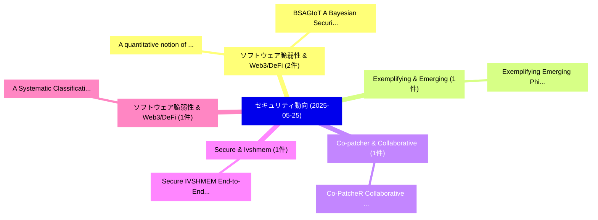

# 📅 02_daily: 日次エグゼクティブサマリー報告書 (2025-05-25)

**集計日時**: 2026-10-02 23:05:27 UTC  
**対象日付**: 2025-05-25  
**本日収集論文数**: 14 件  

---

## 💡 主要セキュリティ動向・脅威インサイト (Executive Insights)

本日の収集論文（計 14 件）において、以下の重点セキュリティ領域で活発な研究動向が確認されました：
- **ソフトウェア脆弱性 & Web3/DeFi** (2 件): 注目論文として 「A quantitative notion of econo...」、「BSAGIoT: A Bayesian Security A...」 等が発表され、実務防御および攻撃検証の進展が見られます。
- **Exemplifying & Emerging** (1 件): 注目論文として 「Exemplifying Emerging Phishing...」 等が発表され、実務防御および攻撃検証の進展が見られます。
- **Co-patcher & Collaborative** (1 件): 注目論文として 「Co-PatcheR: Collaborative Soft...」 等が発表され、実務防御および攻撃検証の進展が見られます。
- **Secure & Ivshmem** (1 件): 注目論文として 「Secure IVSHMEM: End-to-End Sha...」 等が発表され、実務防御および攻撃検証の進展が見られます。
- **ソフトウェア脆弱性 & Web3/DeFi** (1 件): 注目論文として 「A Systematic Classification of...」 等が発表され、実務防御および攻撃検証の進展が見られます。

### 🗺️ 技術・脅威トピックマインドマップ

---

## 📌 日次セキュリティ論文一覧 (日本語表形式)

| No | arXiv ID | 論文タイトル (日本語訳) | 重要キーワード | 構造化エグゼクティブ要約 (背景・提案・影響) | 脅威分類 | 詳細リンク |
|---|---|---|---|---|---|---|
| 1 | `2505.18944v1` | [Exemplifying Emerging Phishing: QR-based Browser-in-The-Browser (BiTB) Attack（セキュリティ分析論文）](../../okf/papers/2025-05-25/2505.18944.md) | `Exemplifying Emerging Phishing`, `QR-based Browser`, `Muhammad Wahid Akram` | 【提案】概要 (Overview & Key Finding) 本論文「Exemplifying Emerging Phishing: QR-based Browser-in-The...。実証評価により経営層・セキュリティ管理者向け推奨アクション (E... | `cs.CR` | [arXiv](https://arxiv.org/abs/2505.18944v1) &#124; [OKF](../../okf/papers/2025-05-25/2505.18944.md) |
| 2 | `2505.18955v2` | [Co-PatcheR: Collaborative Software Patching with Component(s)-specific Small Reasoning Models（セキュリティ分析論文）](../../okf/papers/2025-05-25/2505.18955.md) | `Collaborative Software Patching`, `Small Reasoning Models`, `Yuheng Tang` | 【提案】概要 (Overview & Key Finding) 本論文「Co-PatcheR: Collaborative Software Patching with Compon...。実証評価により経営層・セキュリティ管理者向け推奨アクション (E... | `cs.CR` | [arXiv](https://arxiv.org/abs/2505.18955v2) &#124; [OKF](../../okf/papers/2025-05-25/2505.18955.md) |
| 3 | `2505.19004v2` | [Secure IVSHMEM: End-to-End Shared-Memory Protocol with Hypervisor-CA Handshake and In-Kernel Access Control（セキュリティ分析論文）](../../okf/papers/2025-05-25/2505.19004.md) | `Kernel Access Control`, `End Shared`, `Memory Protocol` | 【提案】概要 (Overview & Key Finding) 本論文「Secure IVSHMEM: End-to-End Shared-Memory Protocol with ...。実証評価により経営層・セキュリティ管理者向け推奨アクション (E... | `cs.CR` | [arXiv](https://arxiv.org/abs/2505.19004v2) &#124; [OKF](../../okf/papers/2025-05-25/2505.19004.md) |
| 4 | `2505.19006v1` | [A quantitative notion of economic security for smart contract compositions（セキュリティ分析論文）](../../okf/papers/2025-05-25/2505.19006.md) | `Emily Priyadarshini`, `Massimo Bartoletti`, `Raw Meta` | 【提案】概要 (Overview & Key Finding) 本論文「A quantitative notion of economic security for スマートコントラ...。実証評価により経営層・セキュリティ管理者向け推奨アクション (E... | `cs.CR` | [arXiv](https://arxiv.org/abs/2505.19006v1) &#124; [OKF](../../okf/papers/2025-05-25/2505.19006.md) |
| 5 | `2505.19047v1` | [A Systematic Classification of Vulnerabilities in MoveEVM Smart Contracts (MWC)（セキュリティ分析論文）](../../okf/papers/2025-05-25/2505.19047.md) | `Systematic Classification`, `Smart Contracts`, `Raw Meta` | 【提案】概要 (Overview & Key Finding) 本論文「A Systematic Classification of Vulnerabilities in MoveE...。実証評価により経営層・セキュリティ管理者向け推奨アクション (E... | `cs.CR` | [arXiv](https://arxiv.org/abs/2505.19047v1) &#124; [OKF](../../okf/papers/2025-05-25/2505.19047.md) |
| 6 | `2505.19174v3` | [Penetration Testing for System Security: Methods and Practical Approaches（セキュリティ分析論文）](../../okf/papers/2025-05-25/2505.19174.md) | `Penetration Testing`, `System Security`, `Practical Approaches` | 【提案】概要 (Overview & Key Finding) 本論文「Penetration Testing for System Security: Methods and Pr...。実証評価により経営層・セキュリティ管理者向け推奨アクション (E... | `cs.CR` | [arXiv](https://arxiv.org/abs/2505.19174v3) &#124; [OKF](../../okf/papers/2025-05-25/2505.19174.md) |
| 7 | `2505.19216v5` | [Constitutional Consensus for Democratic Governance（セキュリティ分析論文）](../../okf/papers/2025-05-25/2505.19216.md) | `Constitutional Consensus`, `Democratic Governance`, `Idit Keidar` | 【提案】概要 (Overview & Key Finding) 本論文「Constitutional Consensus for Democratic Governance（セキュリ...。実証評価により経営層・セキュリティ管理者向け推奨アクション (E... | `cs.CR` | [arXiv](https://arxiv.org/abs/2505.19216v5) &#124; [OKF](../../okf/papers/2025-05-25/2505.19216.md) |
| 8 | `2505.19260v2` | [ALRPHFS: Adversarially Learned Risk Patterns with Hierarchical Fast \& Slow Reasoning for Robust Agent Defense（セキュリティ分析論文）](../../okf/papers/2025-05-25/2505.19260.md) | `Adversarially Learned Risk Patterns`, `Robust Agent Defense`, `Hierarchical Fast` | 【提案】概要 (Overview & Key Finding) 本論文「ALRPHFS: Adversarially Learned Risk Patterns with Hiera...。実証評価により経営層・セキュリティ管理者向け推奨アクション (E... | `cs.CR` | [arXiv](https://arxiv.org/abs/2505.19260v2) &#124; [OKF](../../okf/papers/2025-05-25/2505.19260.md) |
| 9 | `2505.19270v2` | [Effect of noise and topologies on multi-photon quantum protocols（セキュリティ分析論文）](../../okf/papers/2025-05-25/2505.19270.md) | `multi-photon quantum`, `Nitin Jha`, `Abhishek Parakh` | 【提案】概要 (Overview & Key Finding) 本論文「Effect of noise and topologies on multi-photon 量子 proto...。実証評価により経営層・セキュリティ管理者向け推奨アクション (E... | `cs.CR` | [arXiv](https://arxiv.org/abs/2505.19270v2) &#124; [OKF](../../okf/papers/2025-05-25/2505.19270.md) |
| 10 | `2505.19283v1` | [BSAGIoT: A Bayesian Security Aspect Graph for Internet of Things (IoT)（セキュリティ分析論文）](../../okf/papers/2025-05-25/2505.19283.md) | `Bayesian Security Aspect Graph`, `Zeinab Lashkaripour`, `Masoud Khosravi` | 【提案】概要 (Overview & Key Finding) 本論文「BSAGIoT: A Bayesian Security Aspect Graph for Internet ...。実証評価により経営層・セキュリティ管理者向け推奨アクション (E... | `cs.CR` | [arXiv](https://arxiv.org/abs/2505.19283v1) &#124; [OKF](../../okf/papers/2025-05-25/2505.19283.md) |
| 11 | `2505.19301v2` | [A Novel Zero-Trust Identity Framework for Agentic AI: Decentralized Authentication and Fine-Grained Access Control（セキュリティ分析論文）](../../okf/papers/2025-05-25/2505.19301.md) | `Grained Access Control`, `Decentralized Authentication`, `Zero-Trust Identity` | 【提案】概要 (Overview & Key Finding) 本論文「A Novel ゼロトラスト Identity Framework for Agentic AI: Decen...。実証評価により経営層・セキュリティ管理者向け推奨アクション (E... | `cs.CR` | [arXiv](https://arxiv.org/abs/2505.19301v2) &#124; [OKF](../../okf/papers/2025-05-25/2505.19301.md) |
| 12 | `2505.19338v1` | [Co-evolutionary Dynamics of Attack and Defence in サイバーセキュリティ](../../okf/papers/2025-05-25/2505.19338.md) | `Co-evolutionary Dynamics`, `Zia Ush Shamszaman`, `Adeela Bashir` | 【提案】概要 (Overview & Key Finding) 本論文「Co-evolutionary Dynamics of Attack and Defence in サイバーセ...。実証評価により経営層・セキュリティ管理者向け推奨アクション (E... | `cs.CR` | [arXiv](https://arxiv.org/abs/2505.19338v1) &#124; [OKF](../../okf/papers/2025-05-25/2505.19338.md) |
| 13 | `2505.19364v1` | [RADEP: A Resilient Adaptive Defense Framework Against Model Extraction Attacks（セキュリティ分析論文）](../../okf/papers/2025-05-25/2505.19364.md) | `Sayyed Farid Ahamed`, `Amit Chakraborty`, `Sandip Roy` | 【提案】概要 (Overview & Key Finding) 本論文「RADEP: A Resilient Adaptive Defense Framework Against M...。実証評価により経営層・セキュリティ管理者向け推奨アクション (E... | `cs.CR` | [arXiv](https://arxiv.org/abs/2505.19364v1) &#124; [OKF](../../okf/papers/2025-05-25/2505.19364.md) |
| 14 | `2505.23791v1` | [Evaluating Query Efficiency and Accuracy of Transfer Learning-based Model Extraction Attack in 連合学習](../../okf/papers/2025-05-25/2505.23791.md) | `Evaluating Query Efficiency`, `Model Extraction Attack`, `Transfer Learning` | 【提案】概要 (Overview & Key Finding) 本論文「Evaluating Query Efficiency and Accuracy of Transfer Le...。実証評価により# Evaluating Query Effici... | `cs.CR` | [arXiv](https://arxiv.org/abs/2505.23791v1) &#124; [OKF](../../okf/papers/2025-05-25/2505.23791.md) |

